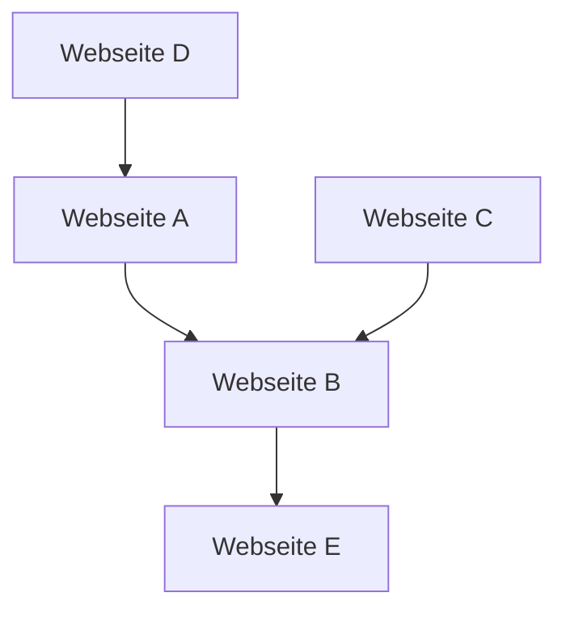

## 1. Die Geburt von Google: Der PageRank-Algorithmus
1998 wurde es von Larry Page und Sergey Brin gegründet.

## 2. Etablierung des Werbemodells (AdWords)
Die Haupteinnahmequelle von Google wurde die suchgebundene Werbung 'AdWords (jetzt Google Ads)'.

## 3. Mobil und Android
Im Jahr 2005 wurde Android Inc. übernommen und als Open-Source-Mobilbetriebssystem weiterentwickelt.

## 4. Auf dem Weg zum 'AI-First'-Unternehmen
Unter CEO Sundar Pichai wurde der Kurs von 'Mobile-First' auf 'AI-First' geändert. Die Abhandlung über das Transformer-Modell (2017) wurde zur Grundlage der heutigen Revolution der generativen KI, einschließlich ChatGPT.

$$
\text{Aufmerksamkeit}(Q, K, V) = \text{softmax}\left(\frac{QK^T}{\sqrt{d_k}}\right)V
$$
