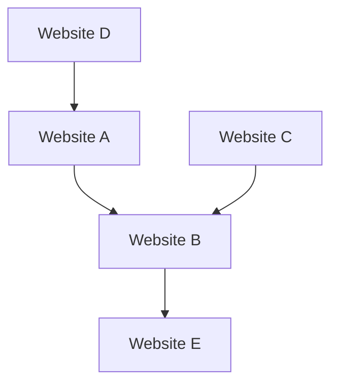

## 1. The Birth of Google: The PageRank Algorithm
Founded in 1998 by Larry Page and Sergey Brin.

## 2. Establishing the Advertising Model (AdWords)
The pillar of Google's revenue became the search-linked advertising "AdWords" (now Google Ads).

## 3. Mobile and Android
Acquired Android Inc. in 2005 and deployed it as an open-source mobile OS.

## 4. Towards an AI-First Company
Under CEO Sundar Pichai, the company shifted from "Mobile-First" to "AI-First". The Transformer model paper (2017) became the foundation of the modern generative AI revolution, including ChatGPT.

$$
\text{Attention}(Q, K, V) = \text{softmax}\left(\frac{QK^T}{\sqrt{d_k}}\right)V
$$
