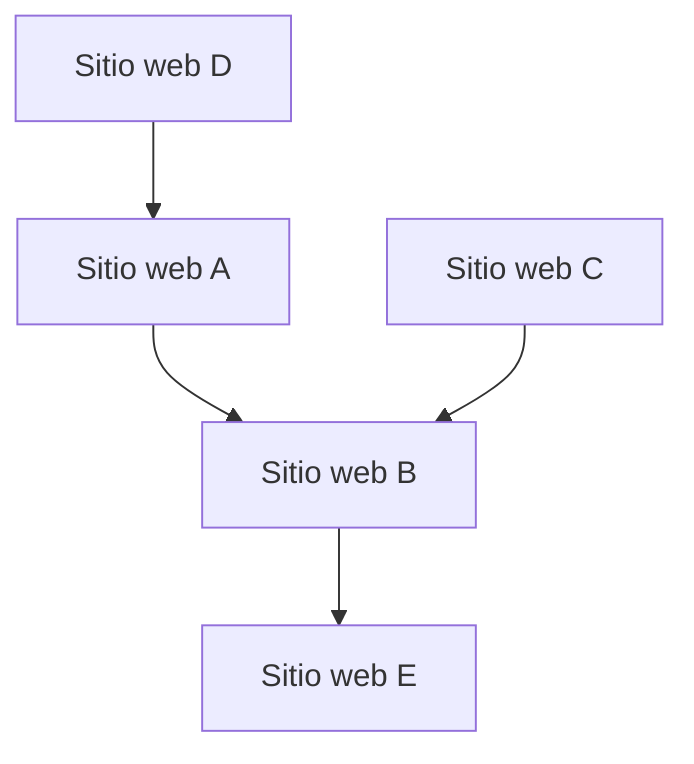

## 1. El nacimiento de Google: El algoritmo PageRank
Fue fundada en 1998 por Larry Page y Sergey Brin.

## 2. Establecimiento del modelo publicitario (AdWords)
El pilar de los ingresos de Google ha sido la publicidad basada en búsquedas, "AdWords" (actualmente Google Ads).

## 3. Móviles y Android
En 2005, adquirió la empresa Android y la desarrolló como un sistema operativo móvil de código abierto.

## 4. Hacia una empresa AI First
Bajo el liderazgo de su CEO, Sundar Pichai, la empresa cambió de rumbo de "Mobile First" a "AI First". El artículo sobre el modelo Transformer (2017) sentó las bases de la revolución actual de la IA generativa, que incluye a ChatGPT.

$$
\text{Atención}(Q, K, V) = \text{softmax}\left(\frac{QK^T}{\sqrt{d_k}}\right)V
$$
