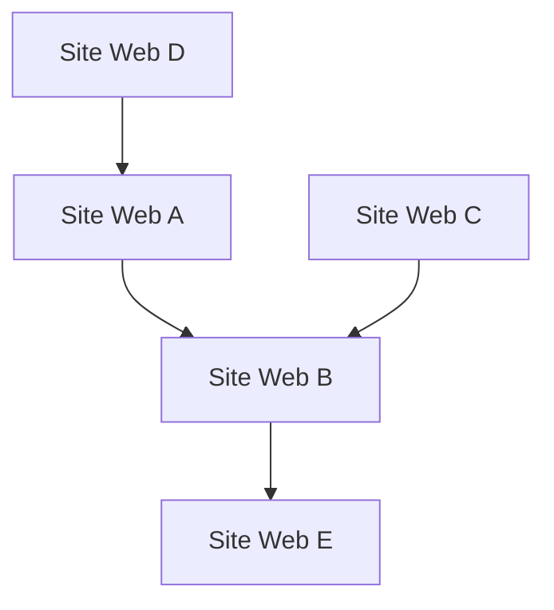

## 1. La naissance de Google : L'algorithme PageRank
Elle a été fondée en 1998 par Larry Page et Sergey Brin.

## 2. L'établissement du modèle publicitaire (AdWords)
Les publicités basées sur les recherches, « AdWords » (maintenant Google Ads), sont devenues le pilier des revenus de Google.

## 3. Le mobile et Android
Ils ont acquis Android Inc. en 2005 et l'ont développé en tant que système d'exploitation mobile open source.

## 4. Vers une entreprise « AI-first »
Sous la direction du PDG Sundar Pichai, l'entreprise est passée de « mobile-first » à « AI-first ». Le document de recherche sur le modèle Transformer (2017) est devenu le fondement de la révolution actuelle de l'IA générative, y compris ChatGPT.

$$
\text{Attention}(Q, K, V) = \text{softmax}\left(\frac{QK^T}{\sqrt{d_k}}\right)V
$$
