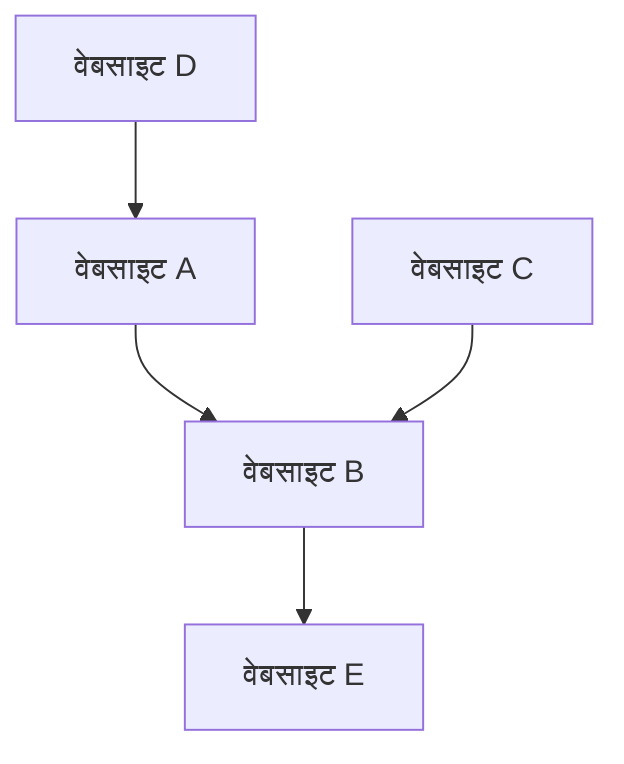

## 1. Google का जन्म: PageRank एल्गोरिथ्म
1998 में, इसकी स्थापना लैरी पेज और सर्गेई ब्रिन द्वारा की गई थी।

## 2. विज्ञापन मॉडल की स्थापना (AdWords)
Google की आय का मुख्य स्रोत सर्च-लिंक्ड विज्ञापन "AdWords (अब Google Ads)" है।

## 3. मोबाइल और Android
2005 में Android कंपनी का अधिग्रहण किया और इसे एक ओपन-सोर्स मोबाइल OS के रूप में विस्तारित किया।

## 4. AI-फर्स्ट कंपनी की ओर
CEO सुंदर पिचाई के नेतृत्व में, कंपनी ने "मोबाइल-फर्स्ट" से "AI-फर्स्ट" की दिशा में कदम बढ़ाया। Transformer मॉडल का पेपर (2017) ChatGPT सहित आधुनिक जनरेटिव AI क्रांति का आधार बना।

$$
\text{अटेंशन}(Q, K, V) = \text{softmax}\left(\frac{QK^T}{\sqrt{d_k}}\right)V
$$
