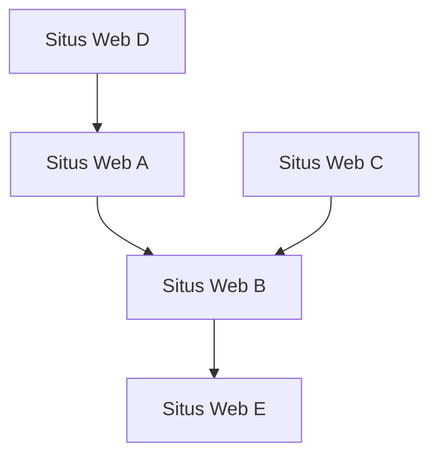

## 1. Kelahiran Google: Algoritma PageRank
Didirikan pada tahun 1998 oleh Larry Page dan Sergey Brin.

## 2. Pembentukan Model Iklan (AdWords)
Yang menjadi pilar pendapatan Google adalah iklan berbasis pencarian "AdWords (sekarang Google Ads)".

## 3. Seluler dan Android
Mengakuisisi perusahaan Android pada tahun 2005 dan mengembangkannya sebagai OS seluler sumber terbuka.

## 4. Menuju Perusahaan AI-First
Di bawah CEO Sundar Pichai, mereka beralih dari "Mobile-First" ke "AI-First". Makalah model Transformer (2017) menjadi dasar revolusi AI generatif modern termasuk ChatGPT.

$$
\text{Perhatian}(Q, K, V) = \text{softmax}\left(\frac{QK^T}{\sqrt{d_k}}\right)V
$$
