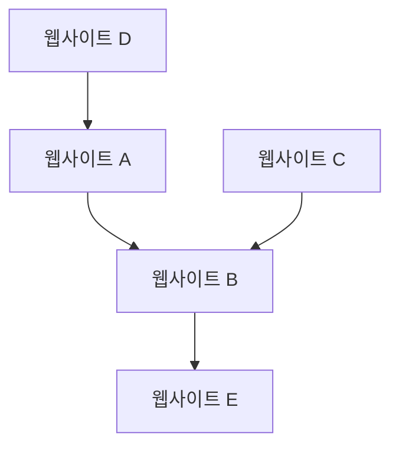

## 1. Google의 탄생: PageRank 알고리즘
1998년, 래리 페이지와 세르게이 브린에 의해 설립되었습니다.

## 2. 광고 모델의 확립 (AdWords)
Google의 수익 기둥이 된 것은 검색 연동형 광고 'AdWords(현 Google Ads)'입니다.

## 3. 모바일과 Android
2005년에 Android사를 인수하여, 오픈 소스 모바일 OS로 전개했습니다.

## 4. AI 퍼스트 기업으로
순다르 피차이 CEO 하에, '모바일 퍼스트'에서 'AI 퍼스트'로 방향을 전환했습니다. Transformer 모델 논문(2017)은 ChatGPT를 비롯한 현대 생성 AI 혁명의 기초가 되었습니다.

$$
\text{어텐션}(Q, K, V) = \text{softmax}\left(\frac{QK^T}{\sqrt{d_k}}\right)V
$$
