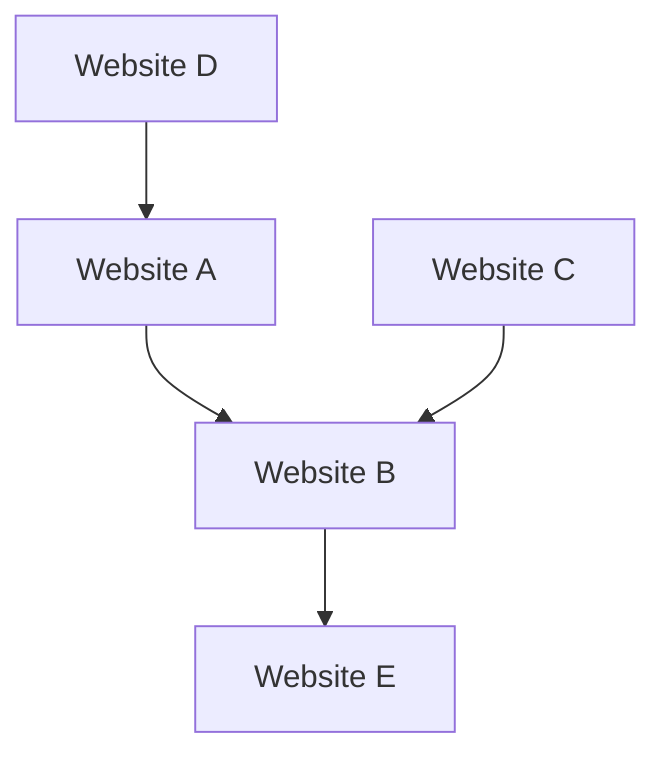

## 1. Googleの誕生：PageRankアルゴリズム
1998年、ラリー・ペイジとセルゲイ・ブリンによって設立されました。

## 2. 広告モデルの確立 (AdWords)
Googleの収益の柱となったのが検索連動型広告「AdWords（現Google Ads）」です。

## 3. モバイルとAndroid
2005年にAndroid社を買収し、オープンソースのモバイルOSとして展開。

## 4. AIファースト企業へ
サンダー・ピチャイCEOの元、「モバイルファースト」から「AIファースト」へと舵を切りました。Transformerモデルの論文（2017）は、ChatGPTをはじめとする現代の生成AI革命の基礎となりました。

$$
\text{Attention}(Q, K, V) = \text{softmax}\left(\frac{QK^T}{\sqrt{d_k}}\right)V
$$

## 追加技術検証パート 1

### 1. Googleの誕生：PageRankアルゴリズム
1998年、ラリー・ペイジとセルゲイ・ブリンによって設立されました。

### 2. 広告モデルの確立 (AdWords)
Googleの収益の柱となったのが検索連動型広告「AdWords（現Google Ads）」です。

### 3. モバイルとAndroid
2005年にAndroid社を買収し、オープンソースのモバイルOSとして展開。

### 4. AIファースト企業へ
サンダー・ピチャイCEOの元、「モバイルファースト」から「AIファースト」へと舵を切りました。Transformerモデルの論文（2017）は、ChatGPTをはじめとする現代の生成AI革命の基礎となりました。

$$
\text{Attention}(Q, K, V) = \text{softmax}\left(\frac{QK^T}{\sqrt{d_k}}\right)V
$$

## 追加技術検証パート 2

### 1. Googleの誕生：PageRankアルゴリズム
1998年、ラリー・ペイジとセルゲイ・ブリンによって設立されました。

### 2. 広告モデルの確立 (AdWords)
Googleの収益の柱となったのが検索連動型広告「AdWords（現Google Ads）」です。

### 3. モバイルとAndroid
2005年にAndroid社を買収し、オープンソースのモバイルOSとして展開。

### 4. AIファースト企業へ
サンダー・ピチャイCEOの元、「モバイルファースト」から「AIファースト」へと舵を切りました。Transformerモデルの論文（2017）は、ChatGPTをはじめとする現代の生成AI革命の基礎となりました。

$$
\text{Attention}(Q, K, V) = \text{softmax}\left(\frac{QK^T}{\sqrt{d_k}}\right)V
$$

## 追加技術検証パート 3

### 1. Googleの誕生：PageRankアルゴリズム
1998年、ラリー・ペイジとセルゲイ・ブリンによって設立されました。

### 2. 広告モデルの確立 (AdWords)
Googleの収益の柱となったのが検索連動型広告「AdWords（現Google Ads）」です。

### 3. モバイルとAndroid
2005年にAndroid社を買収し、オープンソースのモバイルOSとして展開。

### 4. AIファースト企業へ
サンダー・ピチャイCEOの元、「モバイルファースト」から「AIファースト」へと舵を切りました。Transformerモデルの論文（2017）は、ChatGPTをはじめとする現代の生成AI革命の基礎となりました。

$$
\text{Attention}(Q, K, V) = \text{softmax}\left(\frac{QK^T}{\sqrt{d_k}}\right)V
$$

## 追加技術検証パート 4

### 1. Googleの誕生：PageRankアルゴリズム
1998年、ラリー・ペイジとセルゲイ・ブリンによって設立されました。

### 2. 広告モデルの確立 (AdWords)
Googleの収益の柱となったのが検索連動型広告「AdWords（現Google Ads）」です。

### 3. モバイルとAndroid
2005年にAndroid社を買収し、オープンソースのモバイルOSとして展開。

### 4. AIファースト企業へ
サンダー・ピチャイCEOの元、「モバイルファースト」から「AIファースト」へと舵を切りました。Transformerモデルの論文（2017）は、ChatGPTをはじめとする現代の生成AI革命の基礎となりました。

$$
\text{Attention}(Q, K, V) = \text{softmax}\left(\frac{QK^T}{\sqrt{d_k}}\right)V
$$

## 追加技術検証パート 5

### 1. Googleの誕生：PageRankアルゴリズム
1998年、ラリー・ペイジとセルゲイ・ブリンによって設立されました。

### 2. 広告モデルの確立 (AdWords)
Googleの収益の柱となったのが検索連動型広告「AdWords（現Google Ads）」です。

### 3. モバイルとAndroid
2005年にAndroid社を買収し、オープンソースのモバイルOSとして展開。

### 4. AIファースト企業へ
サンダー・ピチャイCEOの元、「モバイルファースト」から「AIファースト」へと舵を切りました。Transformerモデルの論文（2017）は、ChatGPTをはじめとする現代の生成AI革命の基礎となりました。

$$
\text{Attention}(Q, K, V) = \text{softmax}\left(\frac{QK^T}{\sqrt{d_k}}\right)V
$$

## 追加技術検証パート 6

### 1. Googleの誕生：PageRankアルゴリズム
1998年、ラリー・ペイジとセルゲイ・ブリンによって設立されました。

### 2. 広告モデルの確立 (AdWords)
Googleの収益の柱となったのが検索連動型広告「AdWords（現Google Ads）」です。

### 3. モバイルとAndroid
2005年にAndroid社を買収し、オープンソースのモバイルOSとして展開。

### 4. AIファースト企業へ
サンダー・ピチャイCEOの元、「モバイルファースト」から「AIファースト」へと舵を切りました。Transformerモデルの論文（2017）は、ChatGPTをはじめとする現代の生成AI革命の基礎となりました。

$$
\text{Attention}(Q, K, V) = \text{softmax}\left(\frac{QK^T}{\sqrt{d_k}}\right)V
$$

## 追加技術検証パート 7

### 1. Googleの誕生：PageRankアルゴリズム
1998年、ラリー・ペイジとセルゲイ・ブリンによって設立されました。

### 2. 広告モデルの確立 (AdWords)
Googleの収益の柱となったのが検索連動型広告「AdWords（現Google Ads）」です。

### 3. モバイルとAndroid
2005年にAndroid社を買収し、オープンソースのモバイルOSとして展開。

### 4. AIファースト企業へ
サンダー・ピチャイCEOの元、「モバイルファースト」から「AIファースト」へと舵を切りました。Transformerモデルの論文（2017）は、ChatGPTをはじめとする現代の生成AI革命の基礎となりました。

$$
\text{Attention}(Q, K, V) = \text{softmax}\left(\frac{QK^T}{\sqrt{d_k}}\right)V
$$

## 追加技術検証パート 8

### 1. Googleの誕生：PageRankアルゴリズム
1998年、ラリー・ペイジとセルゲイ・ブリンによって設立されました。

### 2. 広告モデルの確立 (AdWords)
Googleの収益の柱となったのが検索連動型広告「AdWords（現Google Ads）」です。

### 3. モバイルとAndroid
2005年にAndroid社を買収し、オープンソースのモバイルOSとして展開。

### 4. AIファースト企業へ
サンダー・ピチャイCEOの元、「モバイルファースト」から「AIファースト」へと舵を切りました。Transformerモデルの論文（2017）は、ChatGPTをはじめとする現代の生成AI革命の基礎となりました。

$$
\text{Attention}(Q, K, V) = \text{softmax}\left(\frac{QK^T}{\sqrt{d_k}}\right)V
$$

## 追加技術検証パート 9

### 1. Googleの誕生：PageRankアルゴリズム
1998年、ラリー・ペイジとセルゲイ・ブリンによって設立されました。

### 2. 広告モデルの確立 (AdWords)
Googleの収益の柱となったのが検索連動型広告「AdWords（現Google Ads）」です。

### 3. モバイルとAndroid
2005年にAndroid社を買収し、オープンソースのモバイルOSとして展開。

### 4. AIファースト企業へ
サンダー・ピチャイCEOの元、「モバイルファースト」から「AIファースト」へと舵を切りました。Transformerモデルの論文（2017）は、ChatGPTをはじめとする現代の生成AI革命の基礎となりました。

$$
\text{Attention}(Q, K, V) = \text{softmax}\left(\frac{QK^T}{\sqrt{d_k}}\right)V
$$

## 追加技術検証パート 10

### 1. Googleの誕生：PageRankアルゴリズム
1998年、ラリー・ペイジとセルゲイ・ブリンによって設立されました。

### 2. 広告モデルの確立 (AdWords)
Googleの収益の柱となったのが検索連動型広告「AdWords（現Google Ads）」です。

### 3. モバイルとAndroid
2005年にAndroid社を買収し、オープンソースのモバイルOSとして展開。

### 4. AIファースト企業へ
サンダー・ピチャイCEOの元、「モバイルファースト」から「AIファースト」へと舵を切りました。Transformerモデルの論文（2017）は、ChatGPTをはじめとする現代の生成AI革命の基礎となりました。

$$
\text{Attention}(Q, K, V) = \text{softmax}\left(\frac{QK^T}{\sqrt{d_k}}\right)V
$$

## 追加技術検証パート 11

### 1. Googleの誕生：PageRankアルゴリズム
1998年、ラリー・ペイジとセルゲイ・ブリンによって設立されました。

### 2. 広告モデルの確立 (AdWords)
Googleの収益の柱となったのが検索連動型広告「AdWords（現Google Ads）」です。

### 3. モバイルとAndroid
2005年にAndroid社を買収し、オープンソースのモバイルOSとして展開。

### 4. AIファースト企業へ
サンダー・ピチャイCEOの元、「モバイルファースト」から「AIファースト」へと舵を切りました。Transformerモデルの論文（2017）は、ChatGPTをはじめとする現代の生成AI革命の基礎となりました。

$$
\text{Attention}(Q, K, V) = \text{softmax}\left(\frac{QK^T}{\sqrt{d_k}}\right)V
$$

## 追加技術検証パート 12

### 1. Googleの誕生：PageRankアルゴリズム
1998年、ラリー・ペイジとセルゲイ・ブリンによって設立されました。

### 2. 広告モデルの確立 (AdWords)
Googleの収益の柱となったのが検索連動型広告「AdWords（現Google Ads）」です。

### 3. モバイルとAndroid
2005年にAndroid社を買収し、オープンソースのモバイルOSとして展開。

### 4. AIファースト企業へ
サンダー・ピチャイCEOの元、「モバイルファースト」から「AIファースト」へと舵を切りました。Transformerモデルの論文（2017）は、ChatGPTをはじめとする現代の生成AI革命の基礎となりました。

$$
\text{Attention}(Q, K, V) = \text{softmax}\left(\frac{QK^T}{\sqrt{d_k}}\right)V
$$

## 追加技術検証パート 13

### 1. Googleの誕生：PageRankアルゴリズム
1998年、ラリー・ペイジとセルゲイ・ブリンによって設立されました。

### 2. 広告モデルの確立 (AdWords)
Googleの収益の柱となったのが検索連動型広告「AdWords（現Google Ads）」です。

### 3. モバイルとAndroid
2005年にAndroid社を買収し、オープンソースのモバイルOSとして展開。

### 4. AIファースト企業へ
サンダー・ピチャイCEOの元、「モバイルファースト」から「AIファースト」へと舵を切りました。Transformerモデルの論文（2017）は、ChatGPTをはじめとする現代の生成AI革命の基礎となりました。

$$
\text{Attention}(Q, K, V) = \text{softmax}\left(\frac{QK^T}{\sqrt{d_k}}\right)V
$$

## 追加技術検証パート 14

### 1. Googleの誕生：PageRankアルゴリズム
1998年、ラリー・ペイジとセルゲイ・ブリンによって設立されました。

### 2. 広告モデルの確立 (AdWords)
Googleの収益の柱となったのが検索連動型広告「AdWords（現Google Ads）」です。

### 3. モバイルとAndroid
2005年にAndroid社を買収し、オープンソースのモバイルOSとして展開。

### 4. AIファースト企業へ
サンダー・ピチャイCEOの元、「モバイルファースト」から「AIファースト」へと舵を切りました。Transformerモデルの論文（2017）は、ChatGPTをはじめとする現代の生成AI革命の基礎となりました。

$$
\text{Attention}(Q, K, V) = \text{softmax}\left(\frac{QK^T}{\sqrt{d_k}}\right)V
$$
