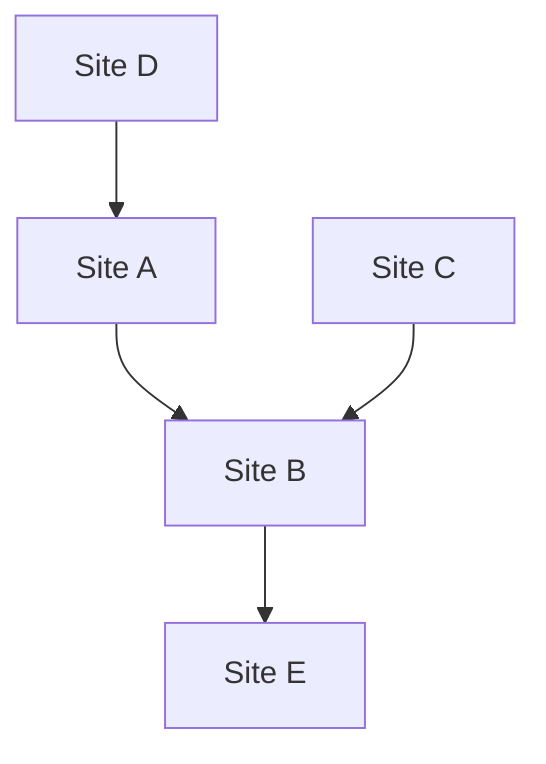

## 1. O Nascimento do Google: Algoritmo PageRank
Foi fundada em 1998 por Larry Page e Sergey Brin.

## 2. Estabelecimento do Modelo de Publicidade (AdWords)
O pilar de receita do Google tornou-se a publicidade vinculada à pesquisa 'AdWords' (atualmente Google Ads).

## 3. Dispositivos Móveis e Android
Adquiriu a empresa Android em 2005 e a lançou como um sistema operacional móvel de código aberto.

## 4. Rumo a uma Empresa AI-First
Sob a liderança do CEO Sundar Pichai, a empresa mudou o rumo de 'Mobile-First' para 'AI-First'. O artigo sobre o modelo Transformer (2017) tornou-se a base da revolução da IA generativa moderna, incluindo o ChatGPT.

$$
\text{Atenção}(Q, K, V) = \text{softmax}\left(\frac{QK^T}{\sqrt{d_k}}\right)V
$$
