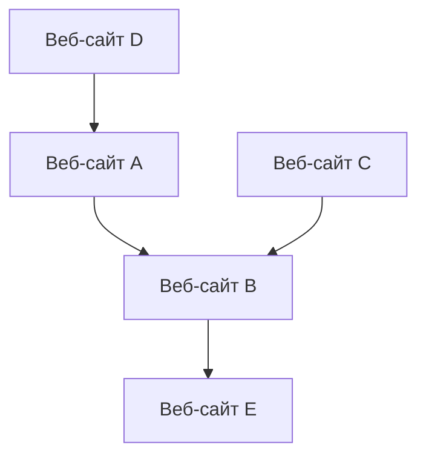

## 1. Рождение Google: Алгоритм PageRank
Компания была основана в 1998 году Ларри Пейджем и Сергеем Брином.

## 2. Создание рекламной модели (AdWords)
Основой дохода Google стала поисковая реклама «AdWords» (ныне Google Ads).

## 3. Мобильные устройства и Android
В 2005 году компания приобрела Android и стала развивать её как мобильную ОС с открытым исходным кодом.

## 4. Переход к компании «AI-first»
Под руководством генерального директора Сундара Пичаи компания сменила курс с «Mobile-first» на «AI-first». Статья о модели Transformer (2017) стала основой современной революции генеративного ИИ, включая ChatGPT.

$$
\text{Внимание}(Q, K, V) = \text{softmax}\left(\frac{QK^T}{\sqrt{d_k}}\right)V
$$
