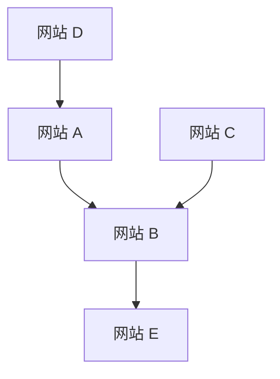

## 1. 谷歌的诞生：PageRank算法
1998年，由拉里·佩奇和谢尔盖·布林创立。

## 2. 广告模式的确立 (AdWords)
成为谷歌收入支柱的是搜索连动型广告“AdWords（现Google Ads）”。

## 3. 移动端与安卓
2005年收购了Android公司，并将其作为开源移动操作系统展开。

## 4. 迈向人工智能优先企业
在桑达尔·皮查伊CEO的领导下，公司从“移动优先”转向了“人工智能优先”。Transformer模型的论文（2017年）成为了以ChatGPT为首的现代生成式人工智能革命的基础。

$$
\text{注意力}(Q, K, V) = \text{softmax}\left(\frac{QK^T}{\sqrt{d_k}}\right)V
$$
