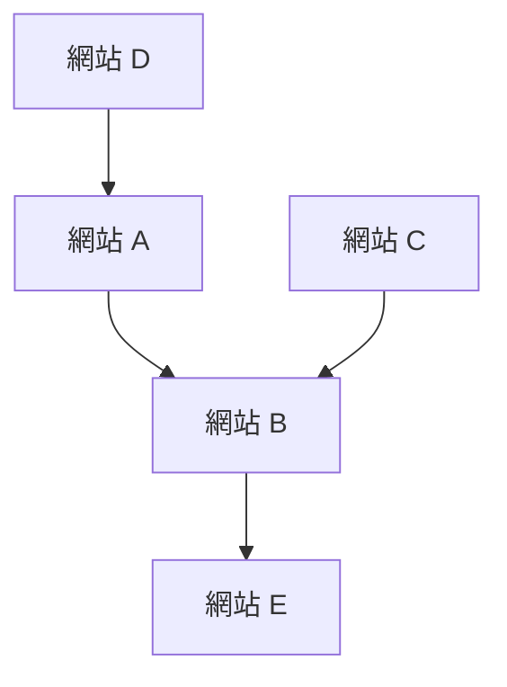

## 1. Google 的誕生：PageRank 演算法
1998年，由拉里·佩吉和謝爾蓋·布林創立。

## 2. 確立廣告模式 (AdWords)
Google 的營收支柱是關鍵字搜尋廣告「AdWords（現為 Google Ads）」。

## 3. 行動裝置與 Android
2005年收購了 Android 公司，並作為開源的行動作業系統展開。

## 4. 邁向 AI 優先企業
在執行長桑達·皮采的帶領下，從「行動優先」轉向「AI 優先」。Transformer 模型的論文（2017年）成為了包含 ChatGPT 在內現代生成式 AI 革命的基礎。

$$
\text{注意力}(Q, K, V) = \text{softmax}\left(\frac{QK^T}{\sqrt{d_k}}\right)V
$$
