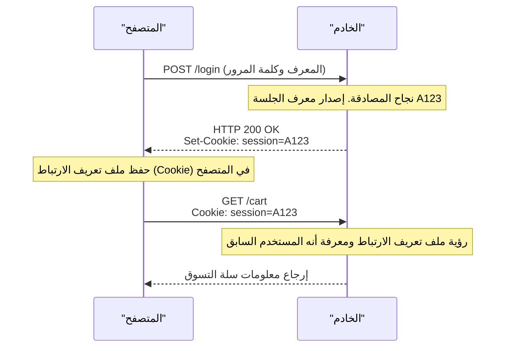

## 1. لغة التواصل المشتركة للشبكة العنكبوتية العالمية (World Wide Web)

السلسلة النصية `http://` أو `https://` التي نكتبها في شريط عنوان المتصفح. هذا إعلان يقول: "سنقوم الآن بالتواصل باستخدام قواعد بروتوكول **HTTP (HyperText Transfer Protocol)**".

في عام 1989، ابتكر الدكتور تيم بيرنرز لي (Tim Berners-Lee) في المنظمة الأوروبية للأبحاث النووية (CERN) نظام "الشبكة العنكبوتية العالمية" (World Wide Web)، وهو نظام يربط الأوراق البحثية (النصوص) التي كتبها الباحثون في جميع أنحاء العالم باستخدام الارتباطات التشعبية (Hyperlinks) وكأنها شبكة متداخلة.
وُلد بروتوكول HTTP كقاعدة اتصال بسيطة جدًا لتتبع تلك الروابط وجلب مستندات HTML من خوادم بعيدة.

كيف تطور بروتوكول HTTP، الذي كان في البداية مجرد شاحنة لنقل المستندات النصية، ليصبح البنية التحتية الضخمة التي تدعم تدفق مقاطع فيديو YouTube الحديثة وتطبيقات الويب المعقدة على المتصفحات؟

## 2. البنية الأساسية لـ HTTP ومفهوم "عديم الحالة" (Stateless)

نموذج الاتصال في HTTP بسيط بشكل مذهل.
"العميل (المتصفح) يرسل طلبًا (Request)، والخادم (السيرفر) يرسل استجابة (Response)"
يتكون هذا الأمر فقط من جولة واحدة من أخذ ورد.

### محتويات الطلب والاستجابة
يتم بناء محتوى الاتصال في HTTP على أساس نصي يمكن للبشر قراءته (※ في حالة الإصدارات حتى HTTP/1.1).

**مثال على طلب من العميل:**
```http
GET /index.html HTTP/1.1
Host: kenji.blog
User-Agent: Mozilla/5.0
```
(الترجمة: "أيها الخادم kenji.blog، أرجو إرسال الملف index.html. أنا متصفح من عائلة Mozilla")

**مثال على استجابة من الخادم:**
```http
HTTP/1.1 200 OK
Content-Type: text/html
Content-Length: 1024

<html><body>مرحباً!</body></html>
```
(الترجمة: "نجح الطلب (200 OK). المحتوى بصيغة HTML، وحجمه 1024 بايت. تفضل!")

### "عديم الحالة" (Stateless): السلاح الأقوى
أهم مفهوم في تصميم HTTP هو أنه "**عديم الحالة (Stateless)**".
لا يتذكر الخادم أي شيء من تفاعلات الاتصال السابقة (الحالة = State). سواء كان الطلب الأول أو الطلب رقم 100، يتعامل الخادم مع كل طلب دائمًا كطلب مستقل وكأنه "أول لقاء".

قد يبدو عدم وجود ذاكرة أمرًا غير مريح، ولكن في الواقع هذا هو السبب الأكبر الذي جعل الويب قادرًا على النمو إلى هذا الحجم العالمي. نظرًا لأن الخادم لا يستهلك الذاكرة لتذكر "مع من تحدث وإلى أين وصل في المحادثة"، فإنه لا ينهار بسهولة حتى عند تلقي ملايين الزيارات في نفس الوقت، وكان من السهل جدًا زيادة عدد الخوادم (التوسع الأفقي - Scale out).

## 3. اختراع ملفات تعريف الارتباط (Cookie): السحر الذي يمنح الذاكرة

ومع ذلك، عندما تطور الويب من مجرد "نظام لعرض الأوراق البحثية" إلى "مواقع للتسوق عبر الإنترنت"، اصطدم بجدار "انعدام الحالة".
عند الانتقال من صفحة "إضافة منتج إلى سلة التسوق" إلى صفحة "الذهاب إلى الدفع"، ينسى الخادم التفاعل السابق مباشرة، لذا تصبح سلة التسوق فارغة في اللحظة التي تصل فيها إلى نقطة الدفع.

لحل هذه المشكلة، ابتكر لو مونتولي (Lou Montulli)، المهندس في شركة Netscape في عام 1994، "**ملفات تعريف الارتباط (Cookie)**".



أصبح الخادم يعطي المتصفح "هذه الملاحظة (Cookie) واحتفظ بها"، وأصبح المتصفح يرفق هذه الملاحظة ويرسلها في كل طلب لاحق. بفضل هذا، أصبح من الممكن تزويد تطبيقات الويب بذاكرة افتراضية (جلسة - Session) مثل "حالة تسجيل الدخول" أو "محتويات سلة التسوق"، مع الحفاظ على التصميم الخفيف لبروتوكول HTTP والمتمثل في كونه "عديم الحالة".

## 4. تاريخ التحديثات والتطور

شهد بروتوكول HTTP تطورًا هائلاً لتلبية متطلبات العصر.

### HTTP/1.1 (1997): الاتصال المستمر
في إصدار HTTP/1.0 الأولي، عند عرض صفحة تحتوي على 10 صور، كان يتم إعادة تأسيس اتصال TCP في كل مرة: "اتصال ← جلب الصورة 1 ← قطع"، "اتصال ← جلب الصورة 2 ← قطع". ونظرًا لأن هذا كان بطيئًا جدًا، تم تقديم آلية "**Keep-Alive**" في HTTP/1.1، والتي سمحت بإعادة استخدام اتصال TCP بمجرد إنشائه، مما أتاح جلب ملفات متعددة بشكل متتالٍ.

### HTTP/2 (2015): التدفق وتعدد الإرسال
تتطلب مواقع الويب الحديثة عشرات إلى مئات الملفات مثل CSS وJavaScript وعدد لا يحصى من الصور لعرض صفحة واحدة. في HTTP/1.1، كانت الطلبات تُصطف في "طابور واحد" داخل الاتصال وتُعالج بالترتيب، مما تسبب في مشكلة تُعرف باسم "حظر رأس الخط" (Head-of-Line Blocking)، حيث يتوقف كل شيء في الخلف إذا تعطل ملف ثقيل في المقدمة.
في HTTP/2، تم تغيير الاتصال من نص إلى "ثنائي" (Binary)، وأصبح من الممكن تبادل ملفات متعددة **بالتوازي (تعدد الإرسال - Multiplexing)** في وقت واحد ضمن اتصال واحد، مما أدى إلى تحسين سرعة عرض الويب بشكل كبير.

### HTTP/3 (2022): التخلي عن TCP واعتماد QUIC
وفي أحدث إصدار HTTP/3، تم التخلي تمامًا عن بروتوكول "TCP" الذي استُخدم لعقود كبروتوكول طبقة النقل الأساسي للإنترنت، والانتقال إلى "**QUIC**" المبني على أساس UDP.
وبفضل هذا، تطور إلى بروتوكول اتصال مثالي تم تحسينه لعصر الأجهزة المحمولة، حيث لا ينقطع الاتصال حتى عند تحول الهاتف الذكي من شبكة Wi-Fi إلى شبكة الهاتف المحمول (4G/5G).

## 5. الخلاصة

بروتوكول HTTP، الذي بدأ بمجرد أسطر قليلة من الأوامر النصية (`GET / HTTP/1.1`)، أصبح الآن أساسًا لاتصالات واجهات برمجة التطبيقات (API) (مثل REST وGraphQL)، ويربط بين الخدمات المصغرة (Microservices)، وأصبح بمثابة الدم الذي يشغل كل برامج العالم.

يُظهر تاريخه انتصارًا للبنية الجميلة التي دعا إليها تيم بيرنرز لي: "بسيطة، يمكن لأي شخص تنفيذها، وعديمة الحالة".
بغض النظر عن مدى تعقيد تقنية الويب، فإن بروتوكول HTTP المتين والقوي هذا سيظل ينبض دائمًا في جذورها.
