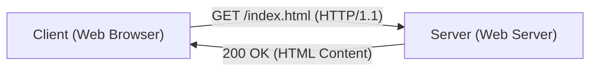

# شرح تقني لـ HTTP

Hypertext Transfer Protocol (HTTP) هو بروتوكول الاتصال الأساسي للويب.

## تصميم عديم الحالة (Stateless)

HTTP هو بروتوكول عديم الحالة (stateless). تتم معالجة كل طلب بشكل مستقل.

## اعتبارات الأداء

في HTTP/2 و HTTP/3، يتم تقليل تأثير وقت الذهاب والإياب (RTT) من خلال تعدد الإرسال (Multiplexing). يمكن نمذجة وقت تحميل الصفحة على النحو التالي:

$$ T_{load} = T_{DNS} + T_{TCP} + T_{TLS} + \sum_{i=1}^{N} \left( \frac{S_i}{B} + RTT \right) $$

من خلال تعدد الإرسال، يتم موازاة الجزء الأخير من $\sum$، مما يقلل الوقت بشكل كبير.

## جزء التحقق الفني الإضافي 1
في هذا القسم، سنتحقق من المزيد من التفاصيل الفنية لبروتوكولات P2P وبروتوكولات الشبكة المختلفة. يتناول مواضيع متنوعة مثل إدارة المعاملات في الأنظمة الموزعة، وخوارزميات التعويض عند فقدان حزم UDP، وطرق تحسين ترويسة HTTP.
بالإضافة إلى ذلك، من خلال تطبيق طرق التصور باستخدام Mermaid، يصبح من الممكن فهم هياكل الشبكة المعقدة هذه بشكل بديهي.
التقييم الكمي باستخدام الصيغ الرياضية مهم أيضًا. فيما يلي جزء من نموذج الاتصال.
$$ E = mc^2 + \sum_{i=1}^{n} P_i $$
تتطور باستمرار طرق تقليل تأخير الاتصال بين عقد الشبكة. خاصة في شبكات الجيل التالي، يعد تقليل العبء الإضافي للبروتوكول تحديًا. يتضمن ذلك تحسين جدول توجيه IPv6 وطرق استئناف جلسة TLS في HTTPS.
من خلال عمليات التحقق الفنية المتقدمة هذه، يمكننا بناء بنية شبكة أكثر قوة وقابلية للتوسع.

## جزء التحقق الفني الإضافي 2
في هذا القسم، سنتحقق من المزيد من التفاصيل الفنية لبروتوكولات P2P وبروتوكولات الشبكة المختلفة. يتناول مواضيع متنوعة مثل إدارة المعاملات في الأنظمة الموزعة، وخوارزميات التعويض عند فقدان حزم UDP، وطرق تحسين ترويسة HTTP.
بالإضافة إلى ذلك، من خلال تطبيق طرق التصور باستخدام Mermaid، يصبح من الممكن فهم هياكل الشبكة المعقدة هذه بشكل بديهي.
التقييم الكمي باستخدام الصيغ الرياضية مهم أيضًا. فيما يلي جزء من نموذج الاتصال.
$$ E = mc^2 + \sum_{i=1}^{n} P_i $$
تتطور باستمرار طرق تقليل تأخير الاتصال بين عقد الشبكة. خاصة في شبكات الجيل التالي، يعد تقليل العبء الإضافي للبروتوكول تحديًا. يتضمن ذلك تحسين جدول توجيه IPv6 وطرق استئناف جلسة TLS في HTTPS.
من خلال عمليات التحقق الفنية المتقدمة هذه، يمكننا بناء بنية شبكة أكثر قوة وقابلية للتوسع.

## جزء التحقق الفني الإضافي 3
في هذا القسم، سنتحقق من المزيد من التفاصيل الفنية لبروتوكولات P2P وبروتوكولات الشبكة المختلفة. يتناول مواضيع متنوعة مثل إدارة المعاملات في الأنظمة الموزعة، وخوارزميات التعويض عند فقدان حزم UDP، وطرق تحسين ترويسة HTTP.
بالإضافة إلى ذلك، من خلال تطبيق طرق التصور باستخدام Mermaid، يصبح من الممكن فهم هياكل الشبكة المعقدة هذه بشكل بديهي.
التقييم الكمي باستخدام الصيغ الرياضية مهم أيضًا. فيما يلي جزء من نموذج الاتصال.
$$ E = mc^2 + \sum_{i=1}^{n} P_i $$
تتطور باستمرار طرق تقليل تأخير الاتصال بين عقد الشبكة. خاصة في شبكات الجيل التالي، يعد تقليل العبء الإضافي للبروتوكول تحديًا. يتضمن ذلك تحسين جدول توجيه IPv6 وطرق استئناف جلسة TLS في HTTPS.
من خلال عمليات التحقق الفنية المتقدمة هذه، يمكننا بناء بنية شبكة أكثر قوة وقابلية للتوسع.

## جزء التحقق الفني الإضافي 4
في هذا القسم، سنتحقق من المزيد من التفاصيل الفنية لبروتوكولات P2P وبروتوكولات الشبكة المختلفة. يتناول مواضيع متنوعة مثل إدارة المعاملات في الأنظمة الموزعة، وخوارزميات التعويض عند فقدان حزم UDP، وطرق تحسين ترويسة HTTP.
بالإضافة إلى ذلك، من خلال تطبيق طرق التصور باستخدام Mermaid، يصبح من الممكن فهم هياكل الشبكة المعقدة هذه بشكل بديهي.
التقييم الكمي باستخدام الصيغ الرياضية مهم أيضًا. فيما يلي جزء من نموذج الاتصال.
$$ E = mc^2 + \sum_{i=1}^{n} P_i $$
تتطور باستمرار طرق تقليل تأخير الاتصال بين عقد الشبكة. خاصة في شبكات الجيل التالي، يعد تقليل العبء الإضافي للبروتوكول تحديًا. يتضمن ذلك تحسين جدول توجيه IPv6 وطرق استئناف جلسة TLS في HTTPS.
من خلال عمليات التحقق الفنية المتقدمة هذه، يمكننا بناء بنية شبكة أكثر قوة وقابلية للتوسع.

## جزء التحقق الفني الإضافي 5
في هذا القسم، سنتحقق من المزيد من التفاصيل الفنية لبروتوكولات P2P وبروتوكولات الشبكة المختلفة. يتناول مواضيع متنوعة مثل إدارة المعاملات في الأنظمة الموزعة، وخوارزميات التعويض عند فقدان حزم UDP، وطرق تحسين ترويسة HTTP.
بالإضافة إلى ذلك، من خلال تطبيق طرق التصور باستخدام Mermaid، يصبح من الممكن فهم هياكل الشبكة المعقدة هذه بشكل بديهي.
التقييم الكمي باستخدام الصيغ الرياضية مهم أيضًا. فيما يلي جزء من نموذج الاتصال.
$$ E = mc^2 + \sum_{i=1}^{n} P_i $$
تتطور باستمرار طرق تقليل تأخير الاتصال بين عقد الشبكة. خاصة في شبكات الجيل التالي، يعد تقليل العبء الإضافي للبروتوكول تحديًا. يتضمن ذلك تحسين جدول توجيه IPv6 وطرق استئناف جلسة TLS في HTTPS.
من خلال عمليات التحقق الفنية المتقدمة هذه، يمكننا بناء بنية شبكة أكثر قوة وقابلية للتوسع.

## جزء التحقق الفني الإضافي 6
في هذا القسم، سنتحقق من المزيد من التفاصيل الفنية لبروتوكولات P2P وبروتوكولات الشبكة المختلفة. يتناول مواضيع متنوعة مثل إدارة المعاملات في الأنظمة الموزعة، وخوارزميات التعويض عند فقدان حزم UDP، وطرق تحسين ترويسة HTTP.
بالإضافة إلى ذلك، من خلال تطبيق طرق التصور باستخدام Mermaid، يصبح من الممكن فهم هياكل الشبكة المعقدة هذه بشكل بديهي.
التقييم الكمي باستخدام الصيغ الرياضية مهم أيضًا. فيما يلي جزء من نموذج الاتصال.
$$ E = mc^2 + \sum_{i=1}^{n} P_i $$
تتطور باستمرار طرق تقليل تأخير الاتصال بين عقد الشبكة. خاصة في شبكات الجيل التالي، يعد تقليل العبء الإضافي للبروتوكول تحديًا. يتضمن ذلك تحسين جدول توجيه IPv6 وطرق استئناف جلسة TLS في HTTPS.
من خلال عمليات التحقق الفنية المتقدمة هذه، يمكننا بناء بنية شبكة أكثر قوة وقابلية للتوسع.

## جزء التحقق الفني الإضافي 7
في هذا القسم، سنتحقق من المزيد من التفاصيل الفنية لبروتوكولات P2P وبروتوكولات الشبكة المختلفة. يتناول مواضيع متنوعة مثل إدارة المعاملات في الأنظمة الموزعة، وخوارزميات التعويض عند فقدان حزم UDP، وطرق تحسين ترويسة HTTP.
بالإضافة إلى ذلك، من خلال تطبيق طرق التصور باستخدام Mermaid، يصبح من الممكن فهم هياكل الشبكة المعقدة هذه بشكل بديهي.
التقييم الكمي باستخدام الصيغ الرياضية مهم أيضًا. فيما يلي جزء من نموذج الاتصال.
$$ E = mc^2 + \sum_{i=1}^{n} P_i $$
تتطور باستمرار طرق تقليل تأخير الاتصال بين عقد الشبكة. خاصة في شبكات الجيل التالي، يعد تقليل العبء الإضافي للبروتوكول تحديًا. يتضمن ذلك تحسين جدول توجيه IPv6 وطرق استئناف جلسة TLS في HTTPS.
من خلال عمليات التحقق الفنية المتقدمة هذه، يمكننا بناء بنية شبكة أكثر قوة وقابلية للتوسع.

## جزء التحقق الفني الإضافي 8
في هذا القسم، سنتحقق من المزيد من التفاصيل الفنية لبروتوكولات P2P وبروتوكولات الشبكة المختلفة. يتناول مواضيع متنوعة مثل إدارة المعاملات في الأنظمة الموزعة، وخوارزميات التعويض عند فقدان حزم UDP، وطرق تحسين ترويسة HTTP.
بالإضافة إلى ذلك، من خلال تطبيق طرق التصور باستخدام Mermaid، يصبح من الممكن فهم هياكل الشبكة المعقدة هذه بشكل بديهي.
التقييم الكمي باستخدام الصيغ الرياضية مهم أيضًا. فيما يلي جزء من نموذج الاتصال.
$$ E = mc^2 + \sum_{i=1}^{n} P_i $$
تتطور باستمرار طرق تقليل تأخير الاتصال بين عقد الشبكة. خاصة في شبكات الجيل التالي، يعد تقليل العبء الإضافي للبروتوكول تحديًا. يتضمن ذلك تحسين جدول توجيه IPv6 وطرق استئناف جلسة TLS في HTTPS.
من خلال عمليات التحقق الفنية المتقدمة هذه، يمكننا بناء بنية شبكة أكثر قوة وقابلية للتوسع.

## جزء التحقق الفني الإضافي 9
في هذا القسم، سنتحقق من المزيد من التفاصيل الفنية لبروتوكولات P2P وبروتوكولات الشبكة المختلفة. يتناول مواضيع متنوعة مثل إدارة المعاملات في الأنظمة الموزعة، وخوارزميات التعويض عند فقدان حزم UDP، وطرق تحسين ترويسة HTTP.
بالإضافة إلى ذلك، من خلال تطبيق طرق التصور باستخدام Mermaid، يصبح من الممكن فهم هياكل الشبكة المعقدة هذه بشكل بديهي.
التقييم الكمي باستخدام الصيغ الرياضية مهم أيضًا. فيما يلي جزء من نموذج الاتصال.
$$ E = mc^2 + \sum_{i=1}^{n} P_i $$
تتطور باستمرار طرق تقليل تأخير الاتصال بين عقد الشبكة. خاصة في شبكات الجيل التالي، يعد تقليل العبء الإضافي للبروتوكول تحديًا. يتضمن ذلك تحسين جدول توجيه IPv6 وطرق استئناف جلسة TLS في HTTPS.
من خلال عمليات التحقق الفنية المتقدمة هذه، يمكننا بناء بنية شبكة أكثر قوة وقابلية للتوسع.

## جزء التحقق الفني الإضافي 10
في هذا القسم، سنتحقق من المزيد من التفاصيل الفنية لبروتوكولات P2P وبروتوكولات الشبكة المختلفة. يتناول مواضيع متنوعة مثل إدارة المعاملات في الأنظمة الموزعة، وخوارزميات التعويض عند فقدان حزم UDP، وطرق تحسين ترويسة HTTP.
بالإضافة إلى ذلك، من خلال تطبيق طرق التصور باستخدام Mermaid، يصبح من الممكن فهم هياكل الشبكة المعقدة هذه بشكل بديهي.
التقييم الكمي باستخدام الصيغ الرياضية مهم أيضًا. فيما يلي جزء من نموذج الاتصال.
$$ E = mc^2 + \sum_{i=1}^{n} P_i $$
تتطور باستمرار طرق تقليل تأخير الاتصال بين عقد الشبكة. خاصة في شبكات الجيل التالي، يعد تقليل العبء الإضافي للبروتوكول تحديًا. يتضمن ذلك تحسين جدول توجيه IPv6 وطرق استئناف جلسة TLS في HTTPS.
من خلال عمليات التحقق الفنية المتقدمة هذه، يمكننا بناء بنية شبكة أكثر قوة وقابلية للتوسع.

## جزء التحقق الفني الإضافي 11
في هذا القسم، سنتحقق من المزيد من التفاصيل الفنية لبروتوكولات P2P وبروتوكولات الشبكة المختلفة. يتناول مواضيع متنوعة مثل إدارة المعاملات في الأنظمة الموزعة، وخوارزميات التعويض عند فقدان حزم UDP، وطرق تحسين ترويسة HTTP.
بالإضافة إلى ذلك، من خلال تطبيق طرق التصور باستخدام Mermaid، يصبح من الممكن فهم هياكل الشبكة المعقدة هذه بشكل بديهي.
التقييم الكمي باستخدام الصيغ الرياضية مهم أيضًا. فيما يلي جزء من نموذج الاتصال.
$$ E = mc^2 + \sum_{i=1}^{n} P_i $$
تتطور باستمرار طرق تقليل تأخير الاتصال بين عقد الشبكة. خاصة في شبكات الجيل التالي، يعد تقليل العبء الإضافي للبروتوكول تحديًا. يتضمن ذلك تحسين جدول توجيه IPv6 وطرق استئناف جلسة TLS في HTTPS.
من خلال عمليات التحقق الفنية المتقدمة هذه، يمكننا بناء بنية شبكة أكثر قوة وقابلية للتوسع.

## جزء التحقق الفني الإضافي 12
في هذا القسم، سنتحقق من المزيد من التفاصيل الفنية لبروتوكولات P2P وبروتوكولات الشبكة المختلفة. يتناول مواضيع متنوعة مثل إدارة المعاملات في الأنظمة الموزعة، وخوارزميات التعويض عند فقدان حزم UDP، وطرق تحسين ترويسة HTTP.
بالإضافة إلى ذلك، من خلال تطبيق طرق التصور باستخدام Mermaid، يصبح من الممكن فهم هياكل الشبكة المعقدة هذه بشكل بديهي.
التقييم الكمي باستخدام الصيغ الرياضية مهم أيضًا. فيما يلي جزء من نموذج الاتصال.
$$ E = mc^2 + \sum_{i=1}^{n} P_i $$
تتطور باستمرار طرق تقليل تأخير الاتصال بين عقد الشبكة. خاصة في شبكات الجيل التالي، يعد تقليل العبء الإضافي للبروتوكول تحديًا. يتضمن ذلك تحسين جدول توجيه IPv6 وطرق استئناف جلسة TLS في HTTPS.
من خلال عمليات التحقق الفنية المتقدمة هذه، يمكننا بناء بنية شبكة أكثر قوة وقابلية للتوسع.

## جزء التحقق الفني الإضافي 13
في هذا القسم، سنتحقق من المزيد من التفاصيل الفنية لبروتوكولات P2P وبروتوكولات الشبكة المختلفة. يتناول مواضيع متنوعة مثل إدارة المعاملات في الأنظمة الموزعة، وخوارزميات التعويض عند فقدان حزم UDP، وطرق تحسين ترويسة HTTP.
بالإضافة إلى ذلك، من خلال تطبيق طرق التصور باستخدام Mermaid، يصبح من الممكن فهم هياكل الشبكة المعقدة هذه بشكل بديهي.
التقييم الكمي باستخدام الصيغ الرياضية مهم أيضًا. فيما يلي جزء من نموذج الاتصال.
$$ E = mc^2 + \sum_{i=1}^{n} P_i $$
تتطور باستمرار طرق تقليل تأخير الاتصال بين عقد الشبكة. خاصة في شبكات الجيل التالي، يعد تقليل العبء الإضافي للبروتوكول تحديًا. يتضمن ذلك تحسين جدول توجيه IPv6 وطرق استئناف جلسة TLS في HTTPS.
من خلال عمليات التحقق الفنية المتقدمة هذه، يمكننا بناء بنية شبكة أكثر قوة وقابلية للتوسع.

## جزء التحقق الفني الإضافي 14
في هذا القسم، سنتحقق من المزيد من التفاصيل الفنية لبروتوكولات P2P وبروتوكولات الشبكة المختلفة. يتناول مواضيع متنوعة مثل إدارة المعاملات في الأنظمة الموزعة، وخوارزميات التعويض عند فقدان حزم UDP، وطرق تحسين ترويسة HTTP.
بالإضافة إلى ذلك، من خلال تطبيق طرق التصور باستخدام Mermaid، يصبح من الممكن فهم هياكل الشبكة المعقدة هذه بشكل بديهي.
التقييم الكمي باستخدام الصيغ الرياضية مهم أيضًا. فيما يلي جزء من نموذج الاتصال.
$$ E = mc^2 + \sum_{i=1}^{n} P_i $$
تتطور باستمرار طرق تقليل تأخير الاتصال بين عقد الشبكة. خاصة في شبكات الجيل التالي، يعد تقليل العبء الإضافي للبروتوكول تحديًا. يتضمن ذلك تحسين جدول توجيه IPv6 وطرق استئناف جلسة TLS في HTTPS.
من خلال عمليات التحقق الفنية المتقدمة هذه، يمكننا بناء بنية شبكة أكثر قوة وقابلية للتوسع.

## جزء التحقق الفني الإضافي 15
في هذا القسم، سنتحقق من المزيد من التفاصيل الفنية لبروتوكولات P2P وبروتوكولات الشبكة المختلفة. يتناول مواضيع متنوعة مثل إدارة المعاملات في الأنظمة الموزعة، وخوارزميات التعويض عند فقدان حزم UDP، وطرق تحسين ترويسة HTTP.
بالإضافة إلى ذلك، من خلال تطبيق طرق التصور باستخدام Mermaid، يصبح من الممكن فهم هياكل الشبكة المعقدة هذه بشكل بديهي.
التقييم الكمي باستخدام الصيغ الرياضية مهم أيضًا. فيما يلي جزء من نموذج الاتصال.
$$ E = mc^2 + \sum_{i=1}^{n} P_i $$
تتطور باستمرار طرق تقليل تأخير الاتصال بين عقد الشبكة. خاصة في شبكات الجيل التالي، يعد تقليل العبء الإضافي للبروتوكول تحديًا. يتضمن ذلك تحسين جدول توجيه IPv6 وطرق استئناف جلسة TLS في HTTPS.
من خلال عمليات التحقق الفنية المتقدمة هذه، يمكننا بناء بنية شبكة أكثر قوة وقابلية للتوسع.

## جزء التحقق الفني الإضافي 16
في هذا القسم، سنتحقق من المزيد من التفاصيل الفنية لبروتوكولات P2P وبروتوكولات الشبكة المختلفة. يتناول مواضيع متنوعة مثل إدارة المعاملات في الأنظمة الموزعة، وخوارزميات التعويض عند فقدان حزم UDP، وطرق تحسين ترويسة HTTP.
بالإضافة إلى ذلك، من خلال تطبيق طرق التصور باستخدام Mermaid، يصبح من الممكن فهم هياكل الشبكة المعقدة هذه بشكل بديهي.
التقييم الكمي باستخدام الصيغ الرياضية مهم أيضًا. فيما يلي جزء من نموذج الاتصال.
$$ E = mc^2 + \sum_{i=1}^{n} P_i $$
تتطور باستمرار طرق تقليل تأخير الاتصال بين عقد الشبكة. خاصة في شبكات الجيل التالي، يعد تقليل العبء الإضافي للبروتوكول تحديًا. يتضمن ذلك تحسين جدول توجيه IPv6 وطرق استئناف جلسة TLS في HTTPS.
من خلال عمليات التحقق الفنية المتقدمة هذه، يمكننا بناء بنية شبكة أكثر قوة وقابلية للتوسع.

## جزء التحقق الفني الإضافي 17
في هذا القسم، سنتحقق من المزيد من التفاصيل الفنية لبروتوكولات P2P وبروتوكولات الشبكة المختلفة. يتناول مواضيع متنوعة مثل إدارة المعاملات في الأنظمة الموزعة، وخوارزميات التعويض عند فقدان حزم UDP، وطرق تحسين ترويسة HTTP.
بالإضافة إلى ذلك، من خلال تطبيق طرق التصور باستخدام Mermaid، يصبح من الممكن فهم هياكل الشبكة المعقدة هذه بشكل بديهي.
التقييم الكمي باستخدام الصيغ الرياضية مهم أيضًا. فيما يلي جزء من نموذج الاتصال.
$$ E = mc^2 + \sum_{i=1}^{n} P_i $$
تتطور باستمرار طرق تقليل تأخير الاتصال بين عقد الشبكة. خاصة في شبكات الجيل التالي، يعد تقليل العبء الإضافي للبروتوكول تحديًا. يتضمن ذلك تحسين جدول توجيه IPv6 وطرق استئناف جلسة TLS في HTTPS.
من خلال عمليات التحقق الفنية المتقدمة هذه، يمكننا بناء بنية شبكة أكثر قوة وقابلية للتوسع.

## جزء التحقق الفني الإضافي 18
في هذا القسم، سنتحقق من المزيد من التفاصيل الفنية لبروتوكولات P2P وبروتوكولات الشبكة المختلفة. يتناول مواضيع متنوعة مثل إدارة المعاملات في الأنظمة الموزعة، وخوارزميات التعويض عند فقدان حزم UDP، وطرق تحسين ترويسة HTTP.
بالإضافة إلى ذلك، من خلال تطبيق طرق التصور باستخدام Mermaid، يصبح من الممكن فهم هياكل الشبكة المعقدة هذه بشكل بديهي.
التقييم الكمي باستخدام الصيغ الرياضية مهم أيضًا. فيما يلي جزء من نموذج الاتصال.
$$ E = mc^2 + \sum_{i=1}^{n} P_i $$
تتطور باستمرار طرق تقليل تأخير الاتصال بين عقد الشبكة. خاصة في شبكات الجيل التالي، يعد تقليل العبء الإضافي للبروتوكول تحديًا. يتضمن ذلك تحسين جدول توجيه IPv6 وطرق استئناف جلسة TLS في HTTPS.
من خلال عمليات التحقق الفنية المتقدمة هذه، يمكننا بناء بنية شبكة أكثر قوة وقابلية للتوسع.

## جزء التحقق الفني الإضافي 19
في هذا القسم، سنتحقق من المزيد من التفاصيل الفنية لبروتوكولات P2P وبروتوكولات الشبكة المختلفة. يتناول مواضيع متنوعة مثل إدارة المعاملات في الأنظمة الموزعة، وخوارزميات التعويض عند فقدان حزم UDP، وطرق تحسين ترويسة HTTP.
بالإضافة إلى ذلك، من خلال تطبيق طرق التصور باستخدام Mermaid، يصبح من الممكن فهم هياكل الشبكة المعقدة هذه بشكل بديهي.
التقييم الكمي باستخدام الصيغ الرياضية مهم أيضًا. فيما يلي جزء من نموذج الاتصال.
$$ E = mc^2 + \sum_{i=1}^{n} P_i $$
تتطور باستمرار طرق تقليل تأخير الاتصال بين عقد الشبكة. خاصة في شبكات الجيل التالي، يعد تقليل العبء الإضافي للبروتوكول تحديًا. يتضمن ذلك تحسين جدول توجيه IPv6 وطرق استئناف جلسة TLS في HTTPS.
من خلال عمليات التحقق الفنية المتقدمة هذه، يمكننا بناء بنية شبكة أكثر قوة وقابلية للتوسع.

## جزء التحقق الفني الإضافي 20
في هذا القسم، سنتحقق من المزيد من التفاصيل الفنية لبروتوكولات P2P وبروتوكولات الشبكة المختلفة. يتناول مواضيع متنوعة مثل إدارة المعاملات في الأنظمة الموزعة، وخوارزميات التعويض عند فقدان حزم UDP، وطرق تحسين ترويسة HTTP.
بالإضافة إلى ذلك، من خلال تطبيق طرق التصور باستخدام Mermaid، يصبح من الممكن فهم هياكل الشبكة المعقدة هذه بشكل بديهي.
التقييم الكمي باستخدام الصيغ الرياضية مهم أيضًا. فيما يلي جزء من نموذج الاتصال.
$$ E = mc^2 + \sum_{i=1}^{n} P_i $$
تتطور باستمرار طرق تقليل تأخير الاتصال بين عقد الشبكة. خاصة في شبكات الجيل التالي، يعد تقليل العبء الإضافي للبروتوكول تحديًا. يتضمن ذلك تحسين جدول توجيه IPv6 وطرق استئناف جلسة TLS في HTTPS.
من خلال عمليات التحقق الفنية المتقدمة هذه، يمكننا بناء بنية شبكة أكثر قوة وقابلية للتوسع.

## جزء التحقق الفني الإضافي 21
في هذا القسم، سنتحقق من المزيد من التفاصيل الفنية لبروتوكولات P2P وبروتوكولات الشبكة المختلفة. يتناول مواضيع متنوعة مثل إدارة المعاملات في الأنظمة الموزعة، وخوارزميات التعويض عند فقدان حزم UDP، وطرق تحسين ترويسة HTTP.
بالإضافة إلى ذلك، من خلال تطبيق طرق التصور باستخدام Mermaid، يصبح من الممكن فهم هياكل الشبكة المعقدة هذه بشكل بديهي.
التقييم الكمي باستخدام الصيغ الرياضية مهم أيضًا. فيما يلي جزء من نموذج الاتصال.
$$ E = mc^2 + \sum_{i=1}^{n} P_i $$
تتطور باستمرار طرق تقليل تأخير الاتصال بين عقد الشبكة. خاصة في شبكات الجيل التالي، يعد تقليل العبء الإضافي للبروتوكول تحديًا. يتضمن ذلك تحسين جدول توجيه IPv6 وطرق استئناف جلسة TLS في HTTPS.
من خلال عمليات التحقق الفنية المتقدمة هذه، يمكننا بناء بنية شبكة أكثر قوة وقابلية للتوسع.

## جزء التحقق الفني الإضافي 22
في هذا القسم، سنتحقق من المزيد من التفاصيل الفنية لبروتوكولات P2P وبروتوكولات الشبكة المختلفة. يتناول مواضيع متنوعة مثل إدارة المعاملات في الأنظمة الموزعة، وخوارزميات التعويض عند فقدان حزم UDP، وطرق تحسين ترويسة HTTP.
بالإضافة إلى ذلك، من خلال تطبيق طرق التصور باستخدام Mermaid، يصبح من الممكن فهم هياكل الشبكة المعقدة هذه بشكل بديهي.
التقييم الكمي باستخدام الصيغ الرياضية مهم أيضًا. فيما يلي جزء من نموذج الاتصال.
$$ E = mc^2 + \sum_{i=1}^{n} P_i $$
تتطور باستمرار طرق تقليل تأخير الاتصال بين عقد الشبكة. خاصة في شبكات الجيل التالي، يعد تقليل العبء الإضافي للبروتوكول تحديًا. يتضمن ذلك تحسين جدول توجيه IPv6 وطرق استئناف جلسة TLS في HTTPS.
من خلال عمليات التحقق الفنية المتقدمة هذه، يمكننا بناء بنية شبكة أكثر قوة وقابلية للتوسع.

## جزء التحقق الفني الإضافي 23
في هذا القسم، سنتحقق من المزيد من التفاصيل الفنية لبروتوكولات P2P وبروتوكولات الشبكة المختلفة. يتناول مواضيع متنوعة مثل إدارة المعاملات في الأنظمة الموزعة، وخوارزميات التعويض عند فقدان حزم UDP، وطرق تحسين ترويسة HTTP.
بالإضافة إلى ذلك، من خلال تطبيق طرق التصور باستخدام Mermaid، يصبح من الممكن فهم هياكل الشبكة المعقدة هذه بشكل بديهي.
التقييم الكمي باستخدام الصيغ الرياضية مهم أيضًا. فيما يلي جزء من نموذج الاتصال.
$$ E = mc^2 + \sum_{i=1}^{n} P_i $$
تتطور باستمرار طرق تقليل تأخير الاتصال بين عقد الشبكة. خاصة في شبكات الجيل التالي، يعد تقليل العبء الإضافي للبروتوكول تحديًا. يتضمن ذلك تحسين جدول توجيه IPv6 وطرق استئناف جلسة TLS في HTTPS.
من خلال عمليات التحقق الفنية المتقدمة هذه، يمكننا بناء بنية شبكة أكثر قوة وقابلية للتوسع.

## جزء التحقق الفني الإضافي 24
في هذا القسم، سنتحقق من المزيد من التفاصيل الفنية لبروتوكولات P2P وبروتوكولات الشبكة المختلفة. يتناول مواضيع متنوعة مثل إدارة المعاملات في الأنظمة الموزعة، وخوارزميات التعويض عند فقدان حزم UDP، وطرق تحسين ترويسة HTTP.
بالإضافة إلى ذلك، من خلال تطبيق طرق التصور باستخدام Mermaid، يصبح من الممكن فهم هياكل الشبكة المعقدة هذه بشكل بديهي.
التقييم الكمي باستخدام الصيغ الرياضية مهم أيضًا. فيما يلي جزء من نموذج الاتصال.
$$ E = mc^2 + \sum_{i=1}^{n} P_i $$
تتطور باستمرار طرق تقليل تأخير الاتصال بين عقد الشبكة. خاصة في شبكات الجيل التالي، يعد تقليل العبء الإضافي للبروتوكول تحديًا. يتضمن ذلك تحسين جدول توجيه IPv6 وطرق استئناف جلسة TLS في HTTPS.
من خلال عمليات التحقق الفنية المتقدمة هذه، يمكننا بناء بنية شبكة أكثر قوة وقابلية للتوسع.

## جزء التحقق الفني الإضافي 25
في هذا القسم، سنتحقق من المزيد من التفاصيل الفنية لبروتوكولات P2P وبروتوكولات الشبكة المختلفة. يتناول مواضيع متنوعة مثل إدارة المعاملات في الأنظمة الموزعة، وخوارزميات التعويض عند فقدان حزم UDP، وطرق تحسين ترويسة HTTP.
بالإضافة إلى ذلك، من خلال تطبيق طرق التصور باستخدام Mermaid، يصبح من الممكن فهم هياكل الشبكة المعقدة هذه بشكل بديهي.
التقييم الكمي باستخدام الصيغ الرياضية مهم أيضًا. فيما يلي جزء من نموذج الاتصال.
$$ E = mc^2 + \sum_{i=1}^{n} P_i $$
تتطور باستمرار طرق تقليل تأخير الاتصال بين عقد الشبكة. خاصة في شبكات الجيل التالي، يعد تقليل العبء الإضافي للبروتوكول تحديًا. يتضمن ذلك تحسين جدول توجيه IPv6 وطرق استئناف جلسة TLS في HTTPS.
من خلال عمليات التحقق الفنية المتقدمة هذه، يمكننا بناء بنية شبكة أكثر قوة وقابلية للتوسع.

## جزء التحقق الفني الإضافي 26
في هذا القسم، سنتحقق من المزيد من التفاصيل الفنية لبروتوكولات P2P وبروتوكولات الشبكة المختلفة. يتناول مواضيع متنوعة مثل إدارة المعاملات في الأنظمة الموزعة، وخوارزميات التعويض عند فقدان حزم UDP، وطرق تحسين ترويسة HTTP.
بالإضافة إلى ذلك، من خلال تطبيق طرق التصور باستخدام Mermaid، يصبح من الممكن فهم هياكل الشبكة المعقدة هذه بشكل بديهي.
التقييم الكمي باستخدام الصيغ الرياضية مهم أيضًا. فيما يلي جزء من نموذج الاتصال.
$$ E = mc^2 + \sum_{i=1}^{n} P_i $$
تتطور باستمرار طرق تقليل تأخير الاتصال بين عقد الشبكة. خاصة في شبكات الجيل التالي، يعد تقليل العبء الإضافي للبروتوكول تحديًا. يتضمن ذلك تحسين جدول توجيه IPv6 وطرق استئناف جلسة TLS في HTTPS.
من خلال عمليات التحقق الفنية المتقدمة هذه، يمكننا بناء بنية شبكة أكثر قوة وقابلية للتوسع.

## جزء التحقق الفني الإضافي 27
في هذا القسم، سنتحقق من المزيد من التفاصيل الفنية لبروتوكولات P2P وبروتوكولات الشبكة المختلفة. يتناول مواضيع متنوعة مثل إدارة المعاملات في الأنظمة الموزعة، وخوارزميات التعويض عند فقدان حزم UDP، وطرق تحسين ترويسة HTTP.
بالإضافة إلى ذلك، من خلال تطبيق طرق التصور باستخدام Mermaid، يصبح من الممكن فهم هياكل الشبكة المعقدة هذه بشكل بديهي.
التقييم الكمي باستخدام الصيغ الرياضية مهم أيضًا. فيما يلي جزء من نموذج الاتصال.
$$ E = mc^2 + \sum_{i=1}^{n} P_i $$
تتطور باستمرار طرق تقليل تأخير الاتصال بين عقد الشبكة. خاصة في شبكات الجيل التالي، يعد تقليل العبء الإضافي للبروتوكول تحديًا. يتضمن ذلك تحسين جدول توجيه IPv6 وطرق استئناف جلسة TLS في HTTPS.
من خلال عمليات التحقق الفنية المتقدمة هذه، يمكننا بناء بنية شبكة أكثر قوة وقابلية للتوسع.

## جزء التحقق الفني الإضافي 28
في هذا القسم، سنتحقق من المزيد من التفاصيل الفنية لبروتوكولات P2P وبروتوكولات الشبكة المختلفة. يتناول مواضيع متنوعة مثل إدارة المعاملات في الأنظمة الموزعة، وخوارزميات التعويض عند فقدان حزم UDP، وطرق تحسين ترويسة HTTP.
بالإضافة إلى ذلك، من خلال تطبيق طرق التصور باستخدام Mermaid، يصبح من الممكن فهم هياكل الشبكة المعقدة هذه بشكل بديهي.
التقييم الكمي باستخدام الصيغ الرياضية مهم أيضًا. فيما يلي جزء من نموذج الاتصال.
$$ E = mc^2 + \sum_{i=1}^{n} P_i $$
تتطور باستمرار طرق تقليل تأخير الاتصال بين عقد الشبكة. خاصة في شبكات الجيل التالي، يعد تقليل العبء الإضافي للبروتوكول تحديًا. يتضمن ذلك تحسين جدول توجيه IPv6 وطرق استئناف جلسة TLS في HTTPS.
من خلال عمليات التحقق الفنية المتقدمة هذه، يمكننا بناء بنية شبكة أكثر قوة وقابلية للتوسع.

## جزء التحقق الفني الإضافي 29
في هذا القسم، سنتحقق من المزيد من التفاصيل الفنية لبروتوكولات P2P وبروتوكولات الشبكة المختلفة. يتناول مواضيع متنوعة مثل إدارة المعاملات في الأنظمة الموزعة، وخوارزميات التعويض عند فقدان حزم UDP، وطرق تحسين ترويسة HTTP.
بالإضافة إلى ذلك، من خلال تطبيق طرق التصور باستخدام Mermaid، يصبح من الممكن فهم هياكل الشبكة المعقدة هذه بشكل بديهي.
التقييم الكمي باستخدام الصيغ الرياضية مهم أيضًا. فيما يلي جزء من نموذج الاتصال.
$$ E = mc^2 + \sum_{i=1}^{n} P_i $$
تتطور باستمرار طرق تقليل تأخير الاتصال بين عقد الشبكة. خاصة في شبكات الجيل التالي، يعد تقليل العبء الإضافي للبروتوكول تحديًا. يتضمن ذلك تحسين جدول توجيه IPv6 وطرق استئناف جلسة TLS في HTTPS.
من خلال عمليات التحقق الفنية المتقدمة هذه، يمكننا بناء بنية شبكة أكثر قوة وقابلية للتوسع.

## جزء التحقق الفني الإضافي 30
في هذا القسم، سنتحقق من المزيد من التفاصيل الفنية لبروتوكولات P2P وبروتوكولات الشبكة المختلفة. يتناول مواضيع متنوعة مثل إدارة المعاملات في الأنظمة الموزعة، وخوارزميات التعويض عند فقدان حزم UDP، وطرق تحسين ترويسة HTTP.
بالإضافة إلى ذلك، من خلال تطبيق طرق التصور باستخدام Mermaid، يصبح من الممكن فهم هياكل الشبكة المعقدة هذه بشكل بديهي.
التقييم الكمي باستخدام الصيغ الرياضية مهم أيضًا. فيما يلي جزء من نموذج الاتصال.
$$ E = mc^2 + \sum_{i=1}^{n} P_i $$
تتطور باستمرار طرق تقليل تأخير الاتصال بين عقد الشبكة. خاصة في شبكات الجيل التالي، يعد تقليل العبء الإضافي للبروتوكول تحديًا. يتضمن ذلك تحسين جدول توجيه IPv6 وطرق استئناف جلسة TLS في HTTPS.
من خلال عمليات التحقق الفنية المتقدمة هذه، يمكننا بناء بنية شبكة أكثر قوة وقابلية للتوسع.

## جزء التحقق الفني الإضافي 31
في هذا القسم، سنتحقق من المزيد من التفاصيل الفنية لبروتوكولات P2P وبروتوكولات الشبكة المختلفة. يتناول مواضيع متنوعة مثل إدارة المعاملات في الأنظمة الموزعة، وخوارزميات التعويض عند فقدان حزم UDP، وطرق تحسين ترويسة HTTP.
بالإضافة إلى ذلك، من خلال تطبيق طرق التصور باستخدام Mermaid، يصبح من الممكن فهم هياكل الشبكة المعقدة هذه بشكل بديهي.
التقييم الكمي باستخدام الصيغ الرياضية مهم أيضًا. فيما يلي جزء من نموذج الاتصال.
$$ E = mc^2 + \sum_{i=1}^{n} P_i $$
تتطور باستمرار طرق تقليل تأخير الاتصال بين عقد الشبكة. خاصة في شبكات الجيل التالي، يعد تقليل العبء الإضافي للبروتوكول تحديًا. يتضمن ذلك تحسين جدول توجيه IPv6 وطرق استئناف جلسة TLS في HTTPS.
من خلال عمليات التحقق الفنية المتقدمة هذه، يمكننا بناء بنية شبكة أكثر قوة وقابلية للتوسع.

## جزء التحقق الفني الإضافي 32
في هذا القسم، سنتحقق من المزيد من التفاصيل الفنية لبروتوكولات P2P وبروتوكولات الشبكة المختلفة. يتناول مواضيع متنوعة مثل إدارة المعاملات في الأنظمة الموزعة، وخوارزميات التعويض عند فقدان حزم UDP، وطرق تحسين ترويسة HTTP.
بالإضافة إلى ذلك، من خلال تطبيق طرق التصور باستخدام Mermaid، يصبح من الممكن فهم هياكل الشبكة المعقدة هذه بشكل بديهي.
التقييم الكمي باستخدام الصيغ الرياضية مهم أيضًا. فيما يلي جزء من نموذج الاتصال.
$$ E = mc^2 + \sum_{i=1}^{n} P_i $$
تتطور باستمرار طرق تقليل تأخير الاتصال بين عقد الشبكة. خاصة في شبكات الجيل التالي، يعد تقليل العبء الإضافي للبروتوكول تحديًا. يتضمن ذلك تحسين جدول توجيه IPv6 وطرق استئناف جلسة TLS في HTTPS.
من خلال عمليات التحقق الفنية المتقدمة هذه، يمكننا بناء بنية شبكة أكثر قوة وقابلية للتوسع.

## جزء التحقق الفني الإضافي 33
في هذا القسم، سنتحقق من المزيد من التفاصيل الفنية لبروتوكولات P2P وبروتوكولات الشبكة المختلفة. يتناول مواضيع متنوعة مثل إدارة المعاملات في الأنظمة الموزعة، وخوارزميات التعويض عند فقدان حزم UDP، وطرق تحسين ترويسة HTTP.
بالإضافة إلى ذلك، من خلال تطبيق طرق التصور باستخدام Mermaid، يصبح من الممكن فهم هياكل الشبكة المعقدة هذه بشكل بديهي.
التقييم الكمي باستخدام الصيغ الرياضية مهم أيضًا. فيما يلي جزء من نموذج الاتصال.
$$ E = mc^2 + \sum_{i=1}^{n} P_i $$
تتطور باستمرار طرق تقليل تأخير الاتصال بين عقد الشبكة. خاصة في شبكات الجيل التالي، يعد تقليل العبء الإضافي للبروتوكول تحديًا. يتضمن ذلك تحسين جدول توجيه IPv6 وطرق استئناف جلسة TLS في HTTPS.
من خلال عمليات التحقق الفنية المتقدمة هذه، يمكننا بناء بنية شبكة أكثر قوة وقابلية للتوسع.

## جزء التحقق الفني الإضافي 34
في هذا القسم، سنتحقق من المزيد من التفاصيل الفنية لبروتوكولات P2P وبروتوكولات الشبكة المختلفة. يتناول مواضيع متنوعة مثل إدارة المعاملات في الأنظمة الموزعة، وخوارزميات التعويض عند فقدان حزم UDP، وطرق تحسين ترويسة HTTP.
بالإضافة إلى ذلك، من خلال تطبيق طرق التصور باستخدام Mermaid، يصبح من الممكن فهم هياكل الشبكة المعقدة هذه بشكل بديهي.
التقييم الكمي باستخدام الصيغ الرياضية مهم أيضًا. فيما يلي جزء من نموذج الاتصال.
$$ E = mc^2 + \sum_{i=1}^{n} P_i $$
تتطور باستمرار طرق تقليل تأخير الاتصال بين عقد الشبكة. خاصة في شبكات الجيل التالي، يعد تقليل العبء الإضافي للبروتوكول تحديًا. يتضمن ذلك تحسين جدول توجيه IPv6 وطرق استئناف جلسة TLS في HTTPS.
من خلال عمليات التحقق الفنية المتقدمة هذه، يمكننا بناء بنية شبكة أكثر قوة وقابلية للتوسع.

## جزء التحقق الفني الإضافي 35
في هذا القسم، سنتحقق من المزيد من التفاصيل الفنية لبروتوكولات P2P وبروتوكولات الشبكة المختلفة. يتناول مواضيع متنوعة مثل إدارة المعاملات في الأنظمة الموزعة، وخوارزميات التعويض عند فقدان حزم UDP، وطرق تحسين ترويسة HTTP.
بالإضافة إلى ذلك، من خلال تطبيق طرق التصور باستخدام Mermaid، يصبح من الممكن فهم هياكل الشبكة المعقدة هذه بشكل بديهي.
التقييم الكمي باستخدام الصيغ الرياضية مهم أيضًا. فيما يلي جزء من نموذج الاتصال.
$$ E = mc^2 + \sum_{i=1}^{n} P_i $$
تتطور باستمرار طرق تقليل تأخير الاتصال بين عقد الشبكة. خاصة في شبكات الجيل التالي، يعد تقليل العبء الإضافي للبروتوكول تحديًا. يتضمن ذلك تحسين جدول توجيه IPv6 وطرق استئناف جلسة TLS في HTTPS.
من خلال عمليات التحقق الفنية المتقدمة هذه، يمكننا بناء بنية شبكة أكثر قوة وقابلية للتوسع.

## جزء التحقق الفني الإضافي 36
في هذا القسم، سنتحقق من المزيد من التفاصيل الفنية لبروتوكولات P2P وبروتوكولات الشبكة المختلفة. يتناول مواضيع متنوعة مثل إدارة المعاملات في الأنظمة الموزعة، وخوارزميات التعويض عند فقدان حزم UDP، وطرق تحسين ترويسة HTTP.
بالإضافة إلى ذلك، من خلال تطبيق طرق التصور باستخدام Mermaid، يصبح من الممكن فهم هياكل الشبكة المعقدة هذه بشكل بديهي.
التقييم الكمي باستخدام الصيغ الرياضية مهم أيضًا. فيما يلي جزء من نموذج الاتصال.
$$ E = mc^2 + \sum_{i=1}^{n} P_i $$
تتطور باستمرار طرق تقليل تأخير الاتصال بين عقد الشبكة. خاصة في شبكات الجيل التالي، يعد تقليل العبء الإضافي للبروتوكول تحديًا. يتضمن ذلك تحسين جدول توجيه IPv6 وطرق استئناف جلسة TLS في HTTPS.
من خلال عمليات التحقق الفنية المتقدمة هذه، يمكننا بناء بنية شبكة أكثر قوة وقابلية للتوسع.

## جزء التحقق الفني الإضافي 37
في هذا القسم، سنتحقق من المزيد من التفاصيل الفنية لبروتوكولات P2P وبروتوكولات الشبكة المختلفة. يتناول مواضيع متنوعة مثل إدارة المعاملات في الأنظمة الموزعة، وخوارزميات التعويض عند فقدان حزم UDP، وطرق تحسين ترويسة HTTP.
بالإضافة إلى ذلك، من خلال تطبيق طرق التصور باستخدام Mermaid، يصبح من الممكن فهم هياكل الشبكة المعقدة هذه بشكل بديهي.
التقييم الكمي باستخدام الصيغ الرياضية مهم أيضًا. فيما يلي جزء من نموذج الاتصال.
$$ E = mc^2 + \sum_{i=1}^{n} P_i $$
تتطور باستمرار طرق تقليل تأخير الاتصال بين عقد الشبكة. خاصة في شبكات الجيل التالي، يعد تقليل العبء الإضافي للبروتوكول تحديًا. يتضمن ذلك تحسين جدول توجيه IPv6 وطرق استئناف جلسة TLS في HTTPS.
من خلال عمليات التحقق الفنية المتقدمة هذه، يمكننا بناء بنية شبكة أكثر قوة وقابلية للتوسع.

## جزء التحقق الفني الإضافي 38
في هذا القسم، سنتحقق من المزيد من التفاصيل الفنية لبروتوكولات P2P وبروتوكولات الشبكة المختلفة. يتناول مواضيع متنوعة مثل إدارة المعاملات في الأنظمة الموزعة، وخوارزميات التعويض عند فقدان حزم UDP، وطرق تحسين ترويسة HTTP.
بالإضافة إلى ذلك، من خلال تطبيق طرق التصور باستخدام Mermaid، يصبح من الممكن فهم هياكل الشبكة المعقدة هذه بشكل بديهي.
التقييم الكمي باستخدام الصيغ الرياضية مهم أيضًا. فيما يلي جزء من نموذج الاتصال.
$$ E = mc^2 + \sum_{i=1}^{n} P_i $$
تتطور باستمرار طرق تقليل تأخير الاتصال بين عقد الشبكة. خاصة في شبكات الجيل التالي، يعد تقليل العبء الإضافي للبروتوكول تحديًا. يتضمن ذلك تحسين جدول توجيه IPv6 وطرق استئناف جلسة TLS في HTTPS.
من خلال عمليات التحقق الفنية المتقدمة هذه، يمكننا بناء بنية شبكة أكثر قوة وقابلية للتوسع.

## جزء التحقق الفني الإضافي 39
في هذا القسم، سنتحقق من المزيد من التفاصيل الفنية لبروتوكولات P2P وبروتوكولات الشبكة المختلفة. يتناول مواضيع متنوعة مثل إدارة المعاملات في الأنظمة الموزعة، وخوارزميات التعويض عند فقدان حزم UDP، وطرق تحسين ترويسة HTTP.
بالإضافة إلى ذلك، من خلال تطبيق طرق التصور باستخدام Mermaid، يصبح من الممكن فهم هياكل الشبكة المعقدة هذه بشكل بديهي.
التقييم الكمي باستخدام الصيغ الرياضية مهم أيضًا. فيما يلي جزء من نموذج الاتصال.
$$ E = mc^2 + \sum_{i=1}^{n} P_i $$
تتطور باستمرار طرق تقليل تأخير الاتصال بين عقد الشبكة. خاصة في شبكات الجيل التالي، يعد تقليل العبء الإضافي للبروتوكول تحديًا. يتضمن ذلك تحسين جدول توجيه IPv6 وطرق استئناف جلسة TLS في HTTPS.
من خلال عمليات التحقق الفنية المتقدمة هذه، يمكننا بناء بنية شبكة أكثر قوة وقابلية للتوسع.

## جزء التحقق الفني الإضافي 40
في هذا القسم، سنتحقق من المزيد من التفاصيل الفنية لبروتوكولات P2P وبروتوكولات الشبكة المختلفة. يتناول مواضيع متنوعة مثل إدارة المعاملات في الأنظمة الموزعة، وخوارزميات التعويض عند فقدان حزم UDP، وطرق تحسين ترويسة HTTP.
بالإضافة إلى ذلك، من خلال تطبيق طرق التصور باستخدام Mermaid، يصبح من الممكن فهم هياكل الشبكة المعقدة هذه بشكل بديهي.
التقييم الكمي باستخدام الصيغ الرياضية مهم أيضًا. فيما يلي جزء من نموذج الاتصال.
$$ E = mc^2 + \sum_{i=1}^{n} P_i $$
تتطور باستمرار طرق تقليل تأخير الاتصال بين عقد الشبكة. خاصة في شبكات الجيل التالي، يعد تقليل العبء الإضافي للبروتوكول تحديًا. يتضمن ذلك تحسين جدول توجيه IPv6 وطرق استئناف جلسة TLS في HTTPS.
من خلال عمليات التحقق الفنية المتقدمة هذه، يمكننا بناء بنية شبكة أكثر قوة وقابلية للتوسع.

## جزء التحقق الفني الإضافي 41
في هذا القسم، سنتحقق من المزيد من التفاصيل الفنية لبروتوكولات P2P وبروتوكولات الشبكة المختلفة. يتناول مواضيع متنوعة مثل إدارة المعاملات في الأنظمة الموزعة، وخوارزميات التعويض عند فقدان حزم UDP، وطرق تحسين ترويسة HTTP.
بالإضافة إلى ذلك، من خلال تطبيق طرق التصور باستخدام Mermaid، يصبح من الممكن فهم هياكل الشبكة المعقدة هذه بشكل بديهي.
التقييم الكمي باستخدام الصيغ الرياضية مهم أيضًا. فيما يلي جزء من نموذج الاتصال.
$$ E = mc^2 + \sum_{i=1}^{n} P_i $$
تتطور باستمرار طرق تقليل تأخير الاتصال بين عقد الشبكة. خاصة في شبكات الجيل التالي، يعد تقليل العبء الإضافي للبروتوكول تحديًا. يتضمن ذلك تحسين جدول توجيه IPv6 وطرق استئناف جلسة TLS في HTTPS.
من خلال عمليات التحقق الفنية المتقدمة هذه، يمكننا بناء بنية شبكة أكثر قوة وقابلية للتوسع.

## جزء التحقق الفني الإضافي 42
في هذا القسم، سنتحقق من المزيد من التفاصيل الفنية لبروتوكولات P2P وبروتوكولات الشبكة المختلفة. يتناول مواضيع متنوعة مثل إدارة المعاملات في الأنظمة الموزعة، وخوارزميات التعويض عند فقدان حزم UDP، وطرق تحسين ترويسة HTTP.
بالإضافة إلى ذلك، من خلال تطبيق طرق التصور باستخدام Mermaid، يصبح من الممكن فهم هياكل الشبكة المعقدة هذه بشكل بديهي.
التقييم الكمي باستخدام الصيغ الرياضية مهم أيضًا. فيما يلي جزء من نموذج الاتصال.
$$ E = mc^2 + \sum_{i=1}^{n} P_i $$
تتطور باستمرار طرق تقليل تأخير الاتصال بين عقد الشبكة. خاصة في شبكات الجيل التالي، يعد تقليل العبء الإضافي للبروتوكول تحديًا. يتضمن ذلك تحسين جدول توجيه IPv6 وطرق استئناف جلسة TLS في HTTPS.
من خلال عمليات التحقق الفنية المتقدمة هذه، يمكننا بناء بنية شبكة أكثر قوة وقابلية للتوسع.

## جزء التحقق الفني الإضافي 43
في هذا القسم، سنتحقق من المزيد من التفاصيل الفنية لبروتوكولات P2P وبروتوكولات الشبكة المختلفة. يتناول مواضيع متنوعة مثل إدارة المعاملات في الأنظمة الموزعة، وخوارزميات التعويض عند فقدان حزم UDP، وطرق تحسين ترويسة HTTP.
بالإضافة إلى ذلك، من خلال تطبيق طرق التصور باستخدام Mermaid، يصبح من الممكن فهم هياكل الشبكة المعقدة هذه بشكل بديهي.
التقييم الكمي باستخدام الصيغ الرياضية مهم أيضًا. فيما يلي جزء من نموذج الاتصال.
$$ E = mc^2 + \sum_{i=1}^{n} P_i $$
تتطور باستمرار طرق تقليل تأخير الاتصال بين عقد الشبكة. خاصة في شبكات الجيل التالي، يعد تقليل العبء الإضافي للبروتوكول تحديًا. يتضمن ذلك تحسين جدول توجيه IPv6 وطرق استئناف جلسة TLS في HTTPS.
من خلال عمليات التحقق الفنية المتقدمة هذه، يمكننا بناء بنية شبكة أكثر قوة وقابلية للتوسع.

## جزء التحقق الفني الإضافي 44
في هذا القسم، سنتحقق من المزيد من التفاصيل الفنية لبروتوكولات P2P وبروتوكولات الشبكة المختلفة. يتناول مواضيع متنوعة مثل إدارة المعاملات في الأنظمة الموزعة، وخوارزميات التعويض عند فقدان حزم UDP، وطرق تحسين ترويسة HTTP.
بالإضافة إلى ذلك، من خلال تطبيق طرق التصور باستخدام Mermaid، يصبح من الممكن فهم هياكل الشبكة المعقدة هذه بشكل بديهي.
التقييم الكمي باستخدام الصيغ الرياضية مهم أيضًا. فيما يلي جزء من نموذج الاتصال.
$$ E = mc^2 + \sum_{i=1}^{n} P_i $$
تتطور باستمرار طرق تقليل تأخير الاتصال بين عقد الشبكة. خاصة في شبكات الجيل التالي، يعد تقليل العبء الإضافي للبروتوكول تحديًا. يتضمن ذلك تحسين جدول توجيه IPv6 وطرق استئناف جلسة TLS في HTTPS.
من خلال عمليات التحقق الفنية المتقدمة هذه، يمكننا بناء بنية شبكة أكثر قوة وقابلية للتوسع.

## جزء التحقق الفني الإضافي 45
في هذا القسم، سنتحقق من المزيد من التفاصيل الفنية لبروتوكولات P2P وبروتوكولات الشبكة المختلفة. يتناول مواضيع متنوعة مثل إدارة المعاملات في الأنظمة الموزعة، وخوارزميات التعويض عند فقدان حزم UDP، وطرق تحسين ترويسة HTTP.
بالإضافة إلى ذلك، من خلال تطبيق طرق التصور باستخدام Mermaid، يصبح من الممكن فهم هياكل الشبكة المعقدة هذه بشكل بديهي.
التقييم الكمي باستخدام الصيغ الرياضية مهم أيضًا. فيما يلي جزء من نموذج الاتصال.
$$ E = mc^2 + \sum_{i=1}^{n} P_i $$
تتطور باستمرار طرق تقليل تأخير الاتصال بين عقد الشبكة. خاصة في شبكات الجيل التالي، يعد تقليل العبء الإضافي للبروتوكول تحديًا. يتضمن ذلك تحسين جدول توجيه IPv6 وطرق استئناف جلسة TLS في HTTPS.
من خلال عمليات التحقق الفنية المتقدمة هذه، يمكننا بناء بنية شبكة أكثر قوة وقابلية للتوسع.

## جزء التحقق الفني الإضافي 46
في هذا القسم، سنتحقق من المزيد من التفاصيل الفنية لبروتوكولات P2P وبروتوكولات الشبكة المختلفة. يتناول مواضيع متنوعة مثل إدارة المعاملات في الأنظمة الموزعة، وخوارزميات التعويض عند فقدان حزم UDP، وطرق تحسين ترويسة HTTP.
بالإضافة إلى ذلك، من خلال تطبيق طرق التصور باستخدام Mermaid، يصبح من الممكن فهم هياكل الشبكة المعقدة هذه بشكل بديهي.
التقييم الكمي باستخدام الصيغ الرياضية مهم أيضًا. فيما يلي جزء من نموذج الاتصال.
$$ E = mc^2 + \sum_{i=1}^{n} P_i $$
تتطور باستمرار طرق تقليل تأخير الاتصال بين عقد الشبكة. خاصة في شبكات الجيل التالي، يعد تقليل العبء الإضافي للبروتوكول تحديًا. يتضمن ذلك تحسين جدول توجيه IPv6 وطرق استئناف جلسة TLS في HTTPS.
من خلال عمليات التحقق الفنية المتقدمة هذه، يمكننا بناء بنية شبكة أكثر قوة وقابلية للتوسع.

## جزء التحقق الفني الإضافي 47
في هذا القسم، سنتحقق من المزيد من التفاصيل الفنية لبروتوكولات P2P وبروتوكولات الشبكة المختلفة. يتناول مواضيع متنوعة مثل إدارة المعاملات في الأنظمة الموزعة، وخوارزميات التعويض عند فقدان حزم UDP، وطرق تحسين ترويسة HTTP.
بالإضافة إلى ذلك، من خلال تطبيق طرق التصور باستخدام Mermaid، يصبح من الممكن فهم هياكل الشبكة المعقدة هذه بشكل بديهي.
التقييم الكمي باستخدام الصيغ الرياضية مهم أيضًا. فيما يلي جزء من نموذج الاتصال.
$$ E = mc^2 + \sum_{i=1}^{n} P_i $$
تتطور باستمرار طرق تقليل تأخير الاتصال بين عقد الشبكة. خاصة في شبكات الجيل التالي، يعد تقليل العبء الإضافي للبروتوكول تحديًا. يتضمن ذلك تحسين جدول توجيه IPv6 وطرق استئناف جلسة TLS في HTTPS.
من خلال عمليات التحقق الفنية المتقدمة هذه، يمكننا بناء بنية شبكة أكثر قوة وقابلية للتوسع.

## جزء التحقق الفني الإضافي 48
في هذا القسم، سنتحقق من المزيد من التفاصيل الفنية لبروتوكولات P2P وبروتوكولات الشبكة المختلفة. يتناول مواضيع متنوعة مثل إدارة المعاملات في الأنظمة الموزعة، وخوارزميات التعويض عند فقدان حزم UDP، وطرق تحسين ترويسة HTTP.
بالإضافة إلى ذلك، من خلال تطبيق طرق التصور باستخدام Mermaid، يصبح من الممكن فهم هياكل الشبكة المعقدة هذه بشكل بديهي.
التقييم الكمي باستخدام الصيغ الرياضية مهم أيضًا. فيما يلي جزء من نموذج الاتصال.
$$ E = mc^2 + \sum_{i=1}^{n} P_i $$
تتطور باستمرار طرق تقليل تأخير الاتصال بين عقد الشبكة. خاصة في شبكات الجيل التالي، يعد تقليل العبء الإضافي للبروتوكول تحديًا. يتضمن ذلك تحسين جدول توجيه IPv6 وطرق استئناف جلسة TLS في HTTPS.
من خلال عمليات التحقق الفنية المتقدمة هذه، يمكننا بناء بنية شبكة أكثر قوة وقابلية للتوسع.

## جزء التحقق الفني الإضافي 49
في هذا القسم، سنتحقق من المزيد من التفاصيل الفنية لبروتوكولات P2P وبروتوكولات الشبكة المختلفة. يتناول مواضيع متنوعة مثل إدارة المعاملات في الأنظمة الموزعة، وخوارزميات التعويض عند فقدان حزم UDP، وطرق تحسين ترويسة HTTP.
بالإضافة إلى ذلك، من خلال تطبيق طرق التصور باستخدام Mermaid، يصبح من الممكن فهم هياكل الشبكة المعقدة هذه بشكل بديهي.
التقييم الكمي باستخدام الصيغ الرياضية مهم أيضًا. فيما يلي جزء من نموذج الاتصال.
$$ E = mc^2 + \sum_{i=1}^{n} P_i $$
تتطور باستمرار طرق تقليل تأخير الاتصال بين عقد الشبكة. خاصة في شبكات الجيل التالي، يعد تقليل العبء الإضافي للبروتوكول تحديًا. يتضمن ذلك تحسين جدول توجيه IPv6 وطرق استئناف جلسة TLS في HTTPS.
من خلال عمليات التحقق الفنية المتقدمة هذه، يمكننا بناء بنية شبكة أكثر قوة وقابلية للتوسع.

## جزء التحقق الفني الإضافي 50
في هذا القسم، سنتحقق من المزيد من التفاصيل الفنية لبروتوكولات P2P وبروتوكولات الشبكة المختلفة. يتناول مواضيع متنوعة مثل إدارة المعاملات في الأنظمة الموزعة، وخوارزميات التعويض عند فقدان حزم UDP، وطرق تحسين ترويسة HTTP.
بالإضافة إلى ذلك، من خلال تطبيق طرق التصور باستخدام Mermaid، يصبح من الممكن فهم هياكل الشبكة المعقدة هذه بشكل بديهي.
التقييم الكمي باستخدام الصيغ الرياضية مهم أيضًا. فيما يلي جزء من نموذج الاتصال.
$$ E = mc^2 + \sum_{i=1}^{n} P_i $$
تتطور باستمرار طرق تقليل تأخير الاتصال بين عقد الشبكة. خاصة في شبكات الجيل التالي، يعد تقليل العبء الإضافي للبروتوكول تحديًا. يتضمن ذلك تحسين جدول توجيه IPv6 وطرق استئناف جلسة TLS في HTTPS.
من خلال عمليات التحقق الفنية المتقدمة هذه، يمكننا بناء بنية شبكة أكثر قوة وقابلية للتوسع.

## جزء التحقق الفني الإضافي 51
في هذا القسم، سنتحقق من المزيد من التفاصيل الفنية لبروتوكولات P2P وبروتوكولات الشبكة المختلفة. يتناول مواضيع متنوعة مثل إدارة المعاملات في الأنظمة الموزعة، وخوارزميات التعويض عند فقدان حزم UDP، وطرق تحسين ترويسة HTTP.
بالإضافة إلى ذلك، من خلال تطبيق طرق التصور باستخدام Mermaid، يصبح من الممكن فهم هياكل الشبكة المعقدة هذه بشكل بديهي.
التقييم الكمي باستخدام الصيغ الرياضية مهم أيضًا. فيما يلي جزء من نموذج الاتصال.
$$ E = mc^2 + \sum_{i=1}^{n} P_i $$
تتطور باستمرار طرق تقليل تأخير الاتصال بين عقد الشبكة. خاصة في شبكات الجيل التالي، يعد تقليل العبء الإضافي للبروتوكول تحديًا. يتضمن ذلك تحسين جدول توجيه IPv6 وطرق استئناف جلسة TLS في HTTPS.
من خلال عمليات التحقق الفنية المتقدمة هذه، يمكننا بناء بنية شبكة أكثر قوة وقابلية للتوسع.

## جزء التحقق الفني الإضافي 52
في هذا القسم، سنتحقق من المزيد من التفاصيل الفنية لبروتوكولات P2P وبروتوكولات الشبكة المختلفة. يتناول مواضيع متنوعة مثل إدارة المعاملات في الأنظمة الموزعة، وخوارزميات التعويض عند فقدان حزم UDP، وطرق تحسين ترويسة HTTP.
بالإضافة إلى ذلك، من خلال تطبيق طرق التصور باستخدام Mermaid، يصبح من الممكن فهم هياكل الشبكة المعقدة هذه بشكل بديهي.
التقييم الكمي باستخدام الصيغ الرياضية مهم أيضًا. فيما يلي جزء من نموذج الاتصال.
$$ E = mc^2 + \sum_{i=1}^{n} P_i $$
تتطور باستمرار طرق تقليل تأخير الاتصال بين عقد الشبكة. خاصة في شبكات الجيل التالي، يعد تقليل العبء الإضافي للبروتوكول تحديًا. يتضمن ذلك تحسين جدول توجيه IPv6 وطرق استئناف جلسة TLS في HTTPS.
من خلال عمليات التحقق الفنية المتقدمة هذه، يمكننا بناء بنية شبكة أكثر قوة وقابلية للتوسع.

## جزء التحقق الفني الإضافي 53
في هذا القسم، سنتحقق من المزيد من التفاصيل الفنية لبروتوكولات P2P وبروتوكولات الشبكة المختلفة. يتناول مواضيع متنوعة مثل إدارة المعاملات في الأنظمة الموزعة، وخوارزميات التعويض عند فقدان حزم UDP، وطرق تحسين ترويسة HTTP.
بالإضافة إلى ذلك، من خلال تطبيق طرق التصور باستخدام Mermaid، يصبح من الممكن فهم هياكل الشبكة المعقدة هذه بشكل بديهي.
التقييم الكمي باستخدام الصيغ الرياضية مهم أيضًا. فيما يلي جزء من نموذج الاتصال.
$$ E = mc^2 + \sum_{i=1}^{n} P_i $$
تتطور باستمرار طرق تقليل تأخير الاتصال بين عقد الشبكة. خاصة في شبكات الجيل التالي، يعد تقليل العبء الإضافي للبروتوكول تحديًا. يتضمن ذلك تحسين جدول توجيه IPv6 وطرق استئناف جلسة TLS في HTTPS.
من خلال عمليات التحقق الفنية المتقدمة هذه، يمكننا بناء بنية شبكة أكثر قوة وقابلية للتوسع.

## جزء التحقق الفني الإضافي 54
في هذا القسم، سنتحقق من المزيد من التفاصيل الفنية لبروتوكولات P2P وبروتوكولات الشبكة المختلفة. يتناول مواضيع متنوعة مثل إدارة المعاملات في الأنظمة الموزعة، وخوارزميات التعويض عند فقدان حزم UDP، وطرق تحسين ترويسة HTTP.
بالإضافة إلى ذلك، من خلال تطبيق طرق التصور باستخدام Mermaid، يصبح من الممكن فهم هياكل الشبكة المعقدة هذه بشكل بديهي.
التقييم الكمي باستخدام الصيغ الرياضية مهم أيضًا. فيما يلي جزء من نموذج الاتصال.
$$ E = mc^2 + \sum_{i=1}^{n} P_i $$
تتطور باستمرار طرق تقليل تأخير الاتصال بين عقد الشبكة. خاصة في شبكات الجيل التالي، يعد تقليل العبء الإضافي للبروتوكول تحديًا. يتضمن ذلك تحسين جدول توجيه IPv6 وطرق استئناف جلسة TLS في HTTPS.
من خلال عمليات التحقق الفنية المتقدمة هذه، يمكننا بناء بنية شبكة أكثر قوة وقابلية للتوسع.

## جزء التحقق الفني الإضافي 55
في هذا القسم، سنتحقق من المزيد من التفاصيل الفنية لبروتوكولات P2P وبروتوكولات الشبكة المختلفة. يتناول مواضيع متنوعة مثل إدارة المعاملات في الأنظمة الموزعة، وخوارزميات التعويض عند فقدان حزم UDP، وطرق تحسين ترويسة HTTP.
بالإضافة إلى ذلك، من خلال تطبيق طرق التصور باستخدام Mermaid، يصبح من الممكن فهم هياكل الشبكة المعقدة هذه بشكل بديهي.
التقييم الكمي باستخدام الصيغ الرياضية مهم أيضًا. فيما يلي جزء من نموذج الاتصال.
$$ E = mc^2 + \sum_{i=1}^{n} P_i $$
تتطور باستمرار طرق تقليل تأخير الاتصال بين عقد الشبكة. خاصة في شبكات الجيل التالي، يعد تقليل العبء الإضافي للبروتوكول تحديًا. يتضمن ذلك تحسين جدول توجيه IPv6 وطرق استئناف جلسة TLS في HTTPS.
من خلال عمليات التحقق الفنية المتقدمة هذه، يمكننا بناء بنية شبكة أكثر قوة وقابلية للتوسع.

## جزء التحقق الفني الإضافي 56
في هذا القسم، سنتحقق من المزيد من التفاصيل الفنية لبروتوكولات P2P وبروتوكولات الشبكة المختلفة. يتناول مواضيع متنوعة مثل إدارة المعاملات في الأنظمة الموزعة، وخوارزميات التعويض عند فقدان حزم UDP، وطرق تحسين ترويسة HTTP.
بالإضافة إلى ذلك، من خلال تطبيق طرق التصور باستخدام Mermaid، يصبح من الممكن فهم هياكل الشبكة المعقدة هذه بشكل بديهي.
التقييم الكمي باستخدام الصيغ الرياضية مهم أيضًا. فيما يلي جزء من نموذج الاتصال.
$$ E = mc^2 + \sum_{i=1}^{n} P_i $$
تتطور باستمرار طرق تقليل تأخير الاتصال بين عقد الشبكة. خاصة في شبكات الجيل التالي، يعد تقليل العبء الإضافي للبروتوكول تحديًا. يتضمن ذلك تحسين جدول توجيه IPv6 وطرق استئناف جلسة TLS في HTTPS.
من خلال عمليات التحقق الفنية المتقدمة هذه، يمكننا بناء بنية شبكة أكثر قوة وقابلية للتوسع.

## جزء التحقق الفني الإضافي 57
في هذا القسم، سنتحقق من المزيد من التفاصيل الفنية لبروتوكولات P2P وبروتوكولات الشبكة المختلفة. يتناول مواضيع متنوعة مثل إدارة المعاملات في الأنظمة الموزعة، وخوارزميات التعويض عند فقدان حزم UDP، وطرق تحسين ترويسة HTTP.
بالإضافة إلى ذلك، من خلال تطبيق طرق التصور باستخدام Mermaid، يصبح من الممكن فهم هياكل الشبكة المعقدة هذه بشكل بديهي.
التقييم الكمي باستخدام الصيغ الرياضية مهم أيضًا. فيما يلي جزء من نموذج الاتصال.
$$ E = mc^2 + \sum_{i=1}^{n} P_i $$
تتطور باستمرار طرق تقليل تأخير الاتصال بين عقد الشبكة. خاصة في شبكات الجيل التالي، يعد تقليل العبء الإضافي للبروتوكول تحديًا. يتضمن ذلك تحسين جدول توجيه IPv6 وطرق استئناف جلسة TLS في HTTPS.
من خلال عمليات التحقق الفنية المتقدمة هذه، يمكننا بناء بنية شبكة أكثر قوة وقابلية للتوسع.

## جزء التحقق الفني الإضافي 58
في هذا القسم، سنتحقق من المزيد من التفاصيل الفنية لبروتوكولات P2P وبروتوكولات الشبكة المختلفة. يتناول مواضيع متنوعة مثل إدارة المعاملات في الأنظمة الموزعة، وخوارزميات التعويض عند فقدان حزم UDP، وطرق تحسين ترويسة HTTP.
بالإضافة إلى ذلك، من خلال تطبيق طرق التصور باستخدام Mermaid، يصبح من الممكن فهم هياكل الشبكة المعقدة هذه بشكل بديهي.
التقييم الكمي باستخدام الصيغ الرياضية مهم أيضًا. فيما يلي جزء من نموذج الاتصال.
$$ E = mc^2 + \sum_{i=1}^{n} P_i $$
تتطور باستمرار طرق تقليل تأخير الاتصال بين عقد الشبكة. خاصة في شبكات الجيل التالي، يعد تقليل العبء الإضافي للبروتوكول تحديًا. يتضمن ذلك تحسين جدول توجيه IPv6 وطرق استئناف جلسة TLS في HTTPS.
من خلال عمليات التحقق الفنية المتقدمة هذه، يمكننا بناء بنية شبكة أكثر قوة وقابلية للتوسع.

## جزء التحقق الفني الإضافي 59
في هذا القسم، سنتحقق من المزيد من التفاصيل الفنية لبروتوكولات P2P وبروتوكولات الشبكة المختلفة. يتناول مواضيع متنوعة مثل إدارة المعاملات في الأنظمة الموزعة، وخوارزميات التعويض عند فقدان حزم UDP، وطرق تحسين ترويسة HTTP.
بالإضافة إلى ذلك، من خلال تطبيق طرق التصور باستخدام Mermaid، يصبح من الممكن فهم هياكل الشبكة المعقدة هذه بشكل بديهي.
التقييم الكمي باستخدام الصيغ الرياضية مهم أيضًا. فيما يلي جزء من نموذج الاتصال.
$$ E = mc^2 + \sum_{i=1}^{n} P_i $$
تتطور باستمرار طرق تقليل تأخير الاتصال بين عقد الشبكة. خاصة في شبكات الجيل التالي، يعد تقليل العبء الإضافي للبروتوكول تحديًا. يتضمن ذلك تحسين جدول توجيه IPv6 وطرق استئناف جلسة TLS في HTTPS.
من خلال عمليات التحقق الفنية المتقدمة هذه، يمكننا بناء بنية شبكة أكثر قوة وقابلية للتوسع.

## جزء التحقق الفني الإضافي 60
في هذا القسم، سنتحقق من المزيد من التفاصيل الفنية لبروتوكولات P2P وبروتوكولات الشبكة المختلفة. يتناول مواضيع متنوعة مثل إدارة المعاملات في الأنظمة الموزعة، وخوارزميات التعويض عند فقدان حزم UDP، وطرق تحسين ترويسة HTTP.
بالإضافة إلى ذلك، من خلال تطبيق طرق التصور باستخدام Mermaid، يصبح من الممكن فهم هياكل الشبكة المعقدة هذه بشكل بديهي.
التقييم الكمي باستخدام الصيغ الرياضية مهم أيضًا. فيما يلي جزء من نموذج الاتصال.
$$ E = mc^2 + \sum_{i=1}^{n} P_i $$
تتطور باستمرار طرق تقليل تأخير الاتصال بين عقد الشبكة. خاصة في شبكات الجيل التالي، يعد تقليل العبء الإضافي للبروتوكول تحديًا. يتضمن ذلك تحسين جدول توجيه IPv6 وطرق استئناف جلسة TLS في HTTPS.
من خلال عمليات التحقق الفنية المتقدمة هذه، يمكننا بناء بنية شبكة أكثر قوة وقابلية للتوسع.

## جزء التحقق الفني الإضافي 61
في هذا القسم، سنتحقق من المزيد من التفاصيل الفنية لبروتوكولات P2P وبروتوكولات الشبكة المختلفة. يتناول مواضيع متنوعة مثل إدارة المعاملات في الأنظمة الموزعة، وخوارزميات التعويض عند فقدان حزم UDP، وطرق تحسين ترويسة HTTP.
بالإضافة إلى ذلك، من خلال تطبيق طرق التصور باستخدام Mermaid، يصبح من الممكن فهم هياكل الشبكة المعقدة هذه بشكل بديهي.
التقييم الكمي باستخدام الصيغ الرياضية مهم أيضًا. فيما يلي جزء من نموذج الاتصال.
$$ E = mc^2 + \sum_{i=1}^{n} P_i $$
تتطور باستمرار طرق تقليل تأخير الاتصال بين عقد الشبكة. خاصة في شبكات الجيل التالي، يعد تقليل العبء الإضافي للبروتوكول تحديًا. يتضمن ذلك تحسين جدول توجيه IPv6 وطرق استئناف جلسة TLS في HTTPS.
من خلال عمليات التحقق الفنية المتقدمة هذه، يمكننا بناء بنية شبكة أكثر قوة وقابلية للتوسع.

## جزء التحقق الفني الإضافي 62
في هذا القسم، سنتحقق من المزيد من التفاصيل الفنية لبروتوكولات P2P وبروتوكولات الشبكة المختلفة. يتناول مواضيع متنوعة مثل إدارة المعاملات في الأنظمة الموزعة، وخوارزميات التعويض عند فقدان حزم UDP، وطرق تحسين ترويسة HTTP.
بالإضافة إلى ذلك، من خلال تطبيق طرق التصور باستخدام Mermaid، يصبح من الممكن فهم هياكل الشبكة المعقدة هذه بشكل بديهي.
التقييم الكمي باستخدام الصيغ الرياضية مهم أيضًا. فيما يلي جزء من نموذج الاتصال.
$$ E = mc^2 + \sum_{i=1}^{n} P_i $$
تتطور باستمرار طرق تقليل تأخير الاتصال بين عقد الشبكة. خاصة في شبكات الجيل التالي، يعد تقليل العبء الإضافي للبروتوكول تحديًا. يتضمن ذلك تحسين جدول توجيه IPv6 وطرق استئناف جلسة TLS في HTTPS.
من خلال عمليات التحقق الفنية المتقدمة هذه، يمكننا بناء بنية شبكة أكثر قوة وقابلية للتوسع.

## جزء التحقق الفني الإضافي 63
في هذا القسم، سنتحقق من المزيد من التفاصيل الفنية لبروتوكولات P2P وبروتوكولات الشبكة المختلفة. يتناول مواضيع متنوعة مثل إدارة المعاملات في الأنظمة الموزعة، وخوارزميات التعويض عند فقدان حزم UDP، وطرق تحسين ترويسة HTTP.
بالإضافة إلى ذلك، من خلال تطبيق طرق التصور باستخدام Mermaid، يصبح من الممكن فهم هياكل الشبكة المعقدة هذه بشكل بديهي.
التقييم الكمي باستخدام الصيغ الرياضية مهم أيضًا. فيما يلي جزء من نموذج الاتصال.
$$ E = mc^2 + \sum_{i=1}^{n} P_i $$
تتطور باستمرار طرق تقليل تأخير الاتصال بين عقد الشبكة. خاصة في شبكات الجيل التالي، يعد تقليل العبء الإضافي للبروتوكول تحديًا. يتضمن ذلك تحسين جدول توجيه IPv6 وطرق استئناف جلسة TLS في HTTPS.
من خلال عمليات التحقق الفنية المتقدمة هذه، يمكننا بناء بنية شبكة أكثر قوة وقابلية للتوسع.

## جزء التحقق الفني الإضافي 64
في هذا القسم، سنتحقق من المزيد من التفاصيل الفنية لبروتوكولات P2P وبروتوكولات الشبكة المختلفة. يتناول مواضيع متنوعة مثل إدارة المعاملات في الأنظمة الموزعة، وخوارزميات التعويض عند فقدان حزم UDP، وطرق تحسين ترويسة HTTP.
بالإضافة إلى ذلك، من خلال تطبيق طرق التصور باستخدام Mermaid، يصبح من الممكن فهم هياكل الشبكة المعقدة هذه بشكل بديهي.
التقييم الكمي باستخدام الصيغ الرياضية مهم أيضًا. فيما يلي جزء من نموذج الاتصال.
$$ E = mc^2 + \sum_{i=1}^{n} P_i $$
تتطور باستمرار طرق تقليل تأخير الاتصال بين عقد الشبكة. خاصة في شبكات الجيل التالي، يعد تقليل العبء الإضافي للبروتوكول تحديًا. يتضمن ذلك تحسين جدول توجيه IPv6 وطرق استئناف جلسة TLS في HTTPS.
من خلال عمليات التحقق الفنية المتقدمة هذه، يمكننا بناء بنية شبكة أكثر قوة وقابلية للتوسع.

## جزء التحقق الفني الإضافي 65
في هذا القسم، سنتحقق من المزيد من التفاصيل الفنية لبروتوكولات P2P وبروتوكولات الشبكة المختلفة. يتناول مواضيع متنوعة مثل إدارة المعاملات في الأنظمة الموزعة، وخوارزميات التعويض عند فقدان حزم UDP، وطرق تحسين ترويسة HTTP.
بالإضافة إلى ذلك، من خلال تطبيق طرق التصور باستخدام Mermaid، يصبح من الممكن فهم هياكل الشبكة المعقدة هذه بشكل بديهي.
التقييم الكمي باستخدام الصيغ الرياضية مهم أيضًا. فيما يلي جزء من نموذج الاتصال.
$$ E = mc^2 + \sum_{i=1}^{n} P_i $$
تتطور باستمرار طرق تقليل تأخير الاتصال بين عقد الشبكة. خاصة في شبكات الجيل التالي، يعد تقليل العبء الإضافي للبروتوكول تحديًا. يتضمن ذلك تحسين جدول توجيه IPv6 وطرق استئناف جلسة TLS في HTTPS.
من خلال عمليات التحقق الفنية المتقدمة هذه، يمكننا بناء بنية شبكة أكثر قوة وقابلية للتوسع.

## جزء التحقق الفني الإضافي 66
في هذا القسم، سنتحقق من المزيد من التفاصيل الفنية لبروتوكولات P2P وبروتوكولات الشبكة المختلفة. يتناول مواضيع متنوعة مثل إدارة المعاملات في الأنظمة الموزعة، وخوارزميات التعويض عند فقدان حزم UDP، وطرق تحسين ترويسة HTTP.
بالإضافة إلى ذلك، من خلال تطبيق طرق التصور باستخدام Mermaid، يصبح من الممكن فهم هياكل الشبكة المعقدة هذه بشكل بديهي.
التقييم الكمي باستخدام الصيغ الرياضية مهم أيضًا. فيما يلي جزء من نموذج الاتصال.
$$ E = mc^2 + \sum_{i=1}^{n} P_i $$
تتطور باستمرار طرق تقليل تأخير الاتصال بين عقد الشبكة. خاصة في شبكات الجيل التالي، يعد تقليل العبء الإضافي للبروتوكول تحديًا. يتضمن ذلك تحسين جدول توجيه IPv6 وطرق استئناف جلسة TLS في HTTPS.
من خلال عمليات التحقق الفنية المتقدمة هذه، يمكننا بناء بنية شبكة أكثر قوة وقابلية للتوسع.

## جزء التحقق الفني الإضافي 67
في هذا القسم، سنتحقق من المزيد من التفاصيل الفنية لبروتوكولات P2P وبروتوكولات الشبكة المختلفة. يتناول مواضيع متنوعة مثل إدارة المعاملات في الأنظمة الموزعة، وخوارزميات التعويض عند فقدان حزم UDP، وطرق تحسين ترويسة HTTP.
بالإضافة إلى ذلك، من خلال تطبيق طرق التصور باستخدام Mermaid، يصبح من الممكن فهم هياكل الشبكة المعقدة هذه بشكل بديهي.
التقييم الكمي باستخدام الصيغ الرياضية مهم أيضًا. فيما يلي جزء من نموذج الاتصال.
$$ E = mc^2 + \sum_{i=1}^{n} P_i $$
تتطور باستمرار طرق تقليل تأخير الاتصال بين عقد الشبكة. خاصة في شبكات الجيل التالي، يعد تقليل العبء الإضافي للبروتوكول تحديًا. يتضمن ذلك تحسين جدول توجيه IPv6 وطرق استئناف جلسة TLS في HTTPS.
من خلال عمليات التحقق الفنية المتقدمة هذه، يمكننا بناء بنية شبكة أكثر قوة وقابلية للتوسع.

## جزء التحقق الفني الإضافي 68
في هذا القسم، سنتحقق من المزيد من التفاصيل الفنية لبروتوكولات P2P وبروتوكولات الشبكة المختلفة. يتناول مواضيع متنوعة مثل إدارة المعاملات في الأنظمة الموزعة، وخوارزميات التعويض عند فقدان حزم UDP، وطرق تحسين ترويسة HTTP.
بالإضافة إلى ذلك، من خلال تطبيق طرق التصور باستخدام Mermaid، يصبح من الممكن فهم هياكل الشبكة المعقدة هذه بشكل بديهي.
التقييم الكمي باستخدام الصيغ الرياضية مهم أيضًا. فيما يلي جزء من نموذج الاتصال.
$$ E = mc^2 + \sum_{i=1}^{n} P_i $$
تتطور باستمرار طرق تقليل تأخير الاتصال بين عقد الشبكة. خاصة في شبكات الجيل التالي، يعد تقليل العبء الإضافي للبروتوكول تحديًا. يتضمن ذلك تحسين جدول توجيه IPv6 وطرق استئناف جلسة TLS في HTTPS.
من خلال عمليات التحقق الفنية المتقدمة هذه، يمكننا بناء بنية شبكة أكثر قوة وقابلية للتوسع.

## جزء التحقق الفني الإضافي 69
في هذا القسم، سنتحقق من المزيد من التفاصيل الفنية لبروتوكولات P2P وبروتوكولات الشبكة المختلفة. يتناول مواضيع متنوعة مثل إدارة المعاملات في الأنظمة الموزعة، وخوارزميات التعويض عند فقدان حزم UDP، وطرق تحسين ترويسة HTTP.
بالإضافة إلى ذلك، من خلال تطبيق طرق التصور باستخدام Mermaid، يصبح من الممكن فهم هياكل الشبكة المعقدة هذه بشكل بديهي.
التقييم الكمي باستخدام الصيغ الرياضية مهم أيضًا. فيما يلي جزء من نموذج الاتصال.
$$ E = mc^2 + \sum_{i=1}^{n} P_i $$
تتطور باستمرار طرق تقليل تأخير الاتصال بين عقد الشبكة. خاصة في شبكات الجيل التالي، يعد تقليل العبء الإضافي للبروتوكول تحديًا. يتضمن ذلك تحسين جدول توجيه IPv6 وطرق استئناف جلسة TLS في HTTPS.
من خلال عمليات التحقق الفنية المتقدمة هذه، يمكننا بناء بنية شبكة أكثر قوة وقابلية للتوسع.

## جزء التحقق الفني الإضافي 70
في هذا القسم، سنتحقق من المزيد من التفاصيل الفنية لبروتوكولات P2P وبروتوكولات الشبكة المختلفة. يتناول مواضيع متنوعة مثل إدارة المعاملات في الأنظمة الموزعة، وخوارزميات التعويض عند فقدان حزم UDP، وطرق تحسين ترويسة HTTP.
بالإضافة إلى ذلك، من خلال تطبيق طرق التصور باستخدام Mermaid، يصبح من الممكن فهم هياكل الشبكة المعقدة هذه بشكل بديهي.
التقييم الكمي باستخدام الصيغ الرياضية مهم أيضًا. فيما يلي جزء من نموذج الاتصال.
$$ E = mc^2 + \sum_{i=1}^{n} P_i $$
تتطور باستمرار طرق تقليل تأخير الاتصال بين عقد الشبكة. خاصة في شبكات الجيل التالي، يعد تقليل العبء الإضافي للبروتوكول تحديًا. يتضمن ذلك تحسين جدول توجيه IPv6 وطرق استئناف جلسة TLS في HTTPS.
من خلال عمليات التحقق الفنية المتقدمة هذه، يمكننا بناء بنية شبكة أكثر قوة وقابلية للتوسع.

## جزء التحقق الفني الإضافي 71
في هذا القسم، سنتحقق من المزيد من التفاصيل الفنية لبروتوكولات P2P وبروتوكولات الشبكة المختلفة. يتناول مواضيع متنوعة مثل إدارة المعاملات في الأنظمة الموزعة، وخوارزميات التعويض عند فقدان حزم UDP، وطرق تحسين ترويسة HTTP.
بالإضافة إلى ذلك، من خلال تطبيق طرق التصور باستخدام Mermaid، يصبح من الممكن فهم هياكل الشبكة المعقدة هذه بشكل بديهي.
التقييم الكمي باستخدام الصيغ الرياضية مهم أيضًا. فيما يلي جزء من نموذج الاتصال.
$$ E = mc^2 + \sum_{i=1}^{n} P_i $$
تتطور باستمرار طرق تقليل تأخير الاتصال بين عقد الشبكة. خاصة في شبكات الجيل التالي، يعد تقليل العبء الإضافي للبروتوكول تحديًا. يتضمن ذلك تحسين جدول توجيه IPv6 وطرق استئناف جلسة TLS في HTTPS.
من خلال عمليات التحقق الفنية المتقدمة هذه، يمكننا بناء بنية شبكة أكثر قوة وقابلية للتوسع.

## جزء التحقق الفني الإضافي 72
في هذا القسم، سنتحقق من المزيد من التفاصيل الفنية لبروتوكولات P2P وبروتوكولات الشبكة المختلفة. يتناول مواضيع متنوعة مثل إدارة المعاملات في الأنظمة الموزعة، وخوارزميات التعويض عند فقدان حزم UDP، وطرق تحسين ترويسة HTTP.
بالإضافة إلى ذلك، من خلال تطبيق طرق التصور باستخدام Mermaid، يصبح من الممكن فهم هياكل الشبكة المعقدة هذه بشكل بديهي.
التقييم الكمي باستخدام الصيغ الرياضية مهم أيضًا. فيما يلي جزء من نموذج الاتصال.
$$ E = mc^2 + \sum_{i=1}^{n} P_i $$
تتطور باستمرار طرق تقليل تأخير الاتصال بين عقد الشبكة. خاصة في شبكات الجيل التالي، يعد تقليل العبء الإضافي للبروتوكول تحديًا. يتضمن ذلك تحسين جدول توجيه IPv6 وطرق استئناف جلسة TLS في HTTPS.
من خلال عمليات التحقق الفنية المتقدمة هذه، يمكننا بناء بنية شبكة أكثر قوة وقابلية للتوسع.

## جزء التحقق الفني الإضافي 73
في هذا القسم، سنتحقق من المزيد من التفاصيل الفنية لبروتوكولات P2P وبروتوكولات الشبكة المختلفة. يتناول مواضيع متنوعة مثل إدارة المعاملات في الأنظمة الموزعة، وخوارزميات التعويض عند فقدان حزم UDP، وطرق تحسين ترويسة HTTP.
بالإضافة إلى ذلك، من خلال تطبيق طرق التصور باستخدام Mermaid، يصبح من الممكن فهم هياكل الشبكة المعقدة هذه بشكل بديهي.
التقييم الكمي باستخدام الصيغ الرياضية مهم أيضًا. فيما يلي جزء من نموذج الاتصال.
$$ E = mc^2 + \sum_{i=1}^{n} P_i $$
تتطور باستمرار طرق تقليل تأخير الاتصال بين عقد الشبكة. خاصة في شبكات الجيل التالي، يعد تقليل العبء الإضافي للبروتوكول تحديًا. يتضمن ذلك تحسين جدول توجيه IPv6 وطرق استئناف جلسة TLS في HTTPS.
من خلال عمليات التحقق الفنية المتقدمة هذه، يمكننا بناء بنية شبكة أكثر قوة وقابلية للتوسع.

## جزء التحقق الفني الإضافي 74
في هذا القسم، سنتحقق من المزيد من التفاصيل الفنية لبروتوكولات P2P وبروتوكولات الشبكة المختلفة. يتناول مواضيع متنوعة مثل إدارة المعاملات في الأنظمة الموزعة، وخوارزميات التعويض عند فقدان حزم UDP، وطرق تحسين ترويسة HTTP.
بالإضافة إلى ذلك، من خلال تطبيق طرق التصور باستخدام Mermaid، يصبح من الممكن فهم هياكل الشبكة المعقدة هذه بشكل بديهي.
التقييم الكمي باستخدام الصيغ الرياضية مهم أيضًا. فيما يلي جزء من نموذج الاتصال.
$$ E = mc^2 + \sum_{i=1}^{n} P_i $$
تتطور باستمرار طرق تقليل تأخير الاتصال بين عقد الشبكة. خاصة في شبكات الجيل التالي، يعد تقليل العبء الإضافي للبروتوكول تحديًا. يتضمن ذلك تحسين جدول توجيه IPv6 وطرق استئناف جلسة TLS في HTTPS.
من خلال عمليات التحقق الفنية المتقدمة هذه، يمكننا بناء بنية شبكة أكثر قوة وقابلية للتوسع.

## جزء التحقق الفني الإضافي 75
في هذا القسم، سنتحقق من المزيد من التفاصيل الفنية لبروتوكولات P2P وبروتوكولات الشبكة المختلفة. يتناول مواضيع متنوعة مثل إدارة المعاملات في الأنظمة الموزعة، وخوارزميات التعويض عند فقدان حزم UDP، وطرق تحسين ترويسة HTTP.
بالإضافة إلى ذلك، من خلال تطبيق طرق التصور باستخدام Mermaid، يصبح من الممكن فهم هياكل الشبكة المعقدة هذه بشكل بديهي.
التقييم الكمي باستخدام الصيغ الرياضية مهم أيضًا. فيما يلي جزء من نموذج الاتصال.
$$ E = mc^2 + \sum_{i=1}^{n} P_i $$
تتطور باستمرار طرق تقليل تأخير الاتصال بين عقد الشبكة. خاصة في شبكات الجيل التالي، يعد تقليل العبء الإضافي للبروتوكول تحديًا. يتضمن ذلك تحسين جدول توجيه IPv6 وطرق استئناف جلسة TLS في HTTPS.
من خلال عمليات التحقق الفنية المتقدمة هذه، يمكننا بناء بنية شبكة أكثر قوة وقابلية للتوسع.

## جزء التحقق الفني الإضافي 76
في هذا القسم، سنتحقق من المزيد من التفاصيل الفنية لبروتوكولات P2P وبروتوكولات الشبكة المختلفة. يتناول مواضيع متنوعة مثل إدارة المعاملات في الأنظمة الموزعة، وخوارزميات التعويض عند فقدان حزم UDP، وطرق تحسين ترويسة HTTP.
بالإضافة إلى ذلك، من خلال تطبيق طرق التصور باستخدام Mermaid، يصبح من الممكن فهم هياكل الشبكة المعقدة هذه بشكل بديهي.
التقييم الكمي باستخدام الصيغ الرياضية مهم أيضًا. فيما يلي جزء من نموذج الاتصال.
$$ E = mc^2 + \sum_{i=1}^{n} P_i $$
تتطور باستمرار طرق تقليل تأخير الاتصال بين عقد الشبكة. خاصة في شبكات الجيل التالي، يعد تقليل العبء الإضافي للبروتوكول تحديًا. يتضمن ذلك تحسين جدول توجيه IPv6 وطرق استئناف جلسة TLS في HTTPS.
من خلال عمليات التحقق الفنية المتقدمة هذه، يمكننا بناء بنية شبكة أكثر قوة وقابلية للتوسع.

## جزء التحقق الفني الإضافي 77
في هذا القسم، سنتحقق من المزيد من التفاصيل الفنية لبروتوكولات P2P وبروتوكولات الشبكة المختلفة. يتناول مواضيع متنوعة مثل إدارة المعاملات في الأنظمة الموزعة، وخوارزميات التعويض عند فقدان حزم UDP، وطرق تحسين ترويسة HTTP.
بالإضافة إلى ذلك، من خلال تطبيق طرق التصور باستخدام Mermaid، يصبح من الممكن فهم هياكل الشبكة المعقدة هذه بشكل بديهي.
التقييم الكمي باستخدام الصيغ الرياضية مهم أيضًا. فيما يلي جزء من نموذج الاتصال.
$$ E = mc^2 + \sum_{i=1}^{n} P_i $$
تتطور باستمرار طرق تقليل تأخير الاتصال بين عقد الشبكة. خاصة في شبكات الجيل التالي، يعد تقليل العبء الإضافي للبروتوكول تحديًا. يتضمن ذلك تحسين جدول توجيه IPv6 وطرق استئناف جلسة TLS في HTTPS.
من خلال عمليات التحقق الفنية المتقدمة هذه، يمكننا بناء بنية شبكة أكثر قوة وقابلية للتوسع.

## جزء التحقق الفني الإضافي 78
في هذا القسم، سنتحقق من المزيد من التفاصيل الفنية لبروتوكولات P2P وبروتوكولات الشبكة المختلفة. يتناول مواضيع متنوعة مثل إدارة المعاملات في الأنظمة الموزعة، وخوارزميات التعويض عند فقدان حزم UDP، وطرق تحسين ترويسة HTTP.
بالإضافة إلى ذلك، من خلال تطبيق طرق التصور باستخدام Mermaid، يصبح من الممكن فهم هياكل الشبكة المعقدة هذه بشكل بديهي.
التقييم الكمي باستخدام الصيغ الرياضية مهم أيضًا. فيما يلي جزء من نموذج الاتصال.
$$ E = mc^2 + \sum_{i=1}^{n} P_i $$
تتطور باستمرار طرق تقليل تأخير الاتصال بين عقد الشبكة. خاصة في شبكات الجيل التالي، يعد تقليل العبء الإضافي للبروتوكول تحديًا. يتضمن ذلك تحسين جدول توجيه IPv6 وطرق استئناف جلسة TLS في HTTPS.
من خلال عمليات التحقق الفنية المتقدمة هذه، يمكننا بناء بنية شبكة أكثر قوة وقابلية للتوسع.

## جزء التحقق الفني الإضافي 79
في هذا القسم، سنتحقق من المزيد من التفاصيل الفنية لبروتوكولات P2P وبروتوكولات الشبكة المختلفة. يتناول مواضيع متنوعة مثل إدارة المعاملات في الأنظمة الموزعة، وخوارزميات التعويض عند فقدان حزم UDP، وطرق تحسين ترويسة HTTP.
بالإضافة إلى ذلك، من خلال تطبيق طرق التصور باستخدام Mermaid، يصبح من الممكن فهم هياكل الشبكة المعقدة هذه بشكل بديهي.
التقييم الكمي باستخدام الصيغ الرياضية مهم أيضًا. فيما يلي جزء من نموذج الاتصال.
$$ E = mc^2 + \sum_{i=1}^{n} P_i $$
تتطور باستمرار طرق تقليل تأخير الاتصال بين عقد الشبكة. خاصة في شبكات الجيل التالي، يعد تقليل العبء الإضافي للبروتوكول تحديًا. يتضمن ذلك تحسين جدول توجيه IPv6 وطرق استئناف جلسة TLS في HTTPS.
من خلال عمليات التحقق الفنية المتقدمة هذه، يمكننا بناء بنية شبكة أكثر قوة وقابلية للتوسع.

## جزء التحقق الفني الإضافي 80
في هذا القسم، سنتحقق من المزيد من التفاصيل الفنية لبروتوكولات P2P وبروتوكولات الشبكة المختلفة. يتناول مواضيع متنوعة مثل إدارة المعاملات في الأنظمة الموزعة، وخوارزميات التعويض عند فقدان حزم UDP، وطرق تحسين ترويسة HTTP.
بالإضافة إلى ذلك، من خلال تطبيق طرق التصور باستخدام Mermaid، يصبح من الممكن فهم هياكل الشبكة المعقدة هذه بشكل بديهي.
التقييم الكمي باستخدام الصيغ الرياضية مهم أيضًا. فيما يلي جزء من نموذج الاتصال.
$$ E = mc^2 + \sum_{i=1}^{n} P_i $$
تتطور باستمرار طرق تقليل تأخير الاتصال بين عقد الشبكة. خاصة في شبكات الجيل التالي، يعد تقليل العبء الإضافي للبروتوكول تحديًا. يتضمن ذلك تحسين جدول توجيه IPv6 وطرق استئناف جلسة TLS في HTTPS.
من خلال عمليات التحقق الفنية المتقدمة هذه، يمكننا بناء بنية شبكة أكثر قوة وقابلية للتوسع.

## جزء التحقق الفني الإضافي 81
في هذا القسم، سنتحقق من المزيد من التفاصيل الفنية لبروتوكولات P2P وبروتوكولات الشبكة المختلفة. يتناول مواضيع متنوعة مثل إدارة المعاملات في الأنظمة الموزعة، وخوارزميات التعويض عند فقدان حزم UDP، وطرق تحسين ترويسة HTTP.
بالإضافة إلى ذلك، من خلال تطبيق طرق التصور باستخدام Mermaid، يصبح من الممكن فهم هياكل الشبكة المعقدة هذه بشكل بديهي.
التقييم الكمي باستخدام الصيغ الرياضية مهم أيضًا. فيما يلي جزء من نموذج الاتصال.
$$ E = mc^2 + \sum_{i=1}^{n} P_i $$
تتطور باستمرار طرق تقليل تأخير الاتصال بين عقد الشبكة. خاصة في شبكات الجيل التالي، يعد تقليل العبء الإضافي للبروتوكول تحديًا. يتضمن ذلك تحسين جدول توجيه IPv6 وطرق استئناف جلسة TLS في HTTPS.
من خلال عمليات التحقق الفنية المتقدمة هذه، يمكننا بناء بنية شبكة أكثر قوة وقابلية للتوسع.

## جزء التحقق الفني الإضافي 82
في هذا القسم، سنتحقق من المزيد من التفاصيل الفنية لبروتوكولات P2P وبروتوكولات الشبكة المختلفة. يتناول مواضيع متنوعة مثل إدارة المعاملات في الأنظمة الموزعة، وخوارزميات التعويض عند فقدان حزم UDP، وطرق تحسين ترويسة HTTP.
بالإضافة إلى ذلك، من خلال تطبيق طرق التصور باستخدام Mermaid، يصبح من الممكن فهم هياكل الشبكة المعقدة هذه بشكل بديهي.
التقييم الكمي باستخدام الصيغ الرياضية مهم أيضًا. فيما يلي جزء من نموذج الاتصال.
$$ E = mc^2 + \sum_{i=1}^{n} P_i $$
تتطور باستمرار طرق تقليل تأخير الاتصال بين عقد الشبكة. خاصة في شبكات الجيل التالي، يعد تقليل العبء الإضافي للبروتوكول تحديًا. يتضمن ذلك تحسين جدول توجيه IPv6 وطرق استئناف جلسة TLS في HTTPS.
من خلال عمليات التحقق الفنية المتقدمة هذه، يمكننا بناء بنية شبكة أكثر قوة وقابلية للتوسع.

## جزء التحقق الفني الإضافي 83
في هذا القسم، سنتحقق من المزيد من التفاصيل الفنية لبروتوكولات P2P وبروتوكولات الشبكة المختلفة. يتناول مواضيع متنوعة مثل إدارة المعاملات في الأنظمة الموزعة، وخوارزميات التعويض عند فقدان حزم UDP، وطرق تحسين ترويسة HTTP.
بالإضافة إلى ذلك، من خلال تطبيق طرق التصور باستخدام Mermaid، يصبح من الممكن فهم هياكل الشبكة المعقدة هذه بشكل بديهي.
التقييم الكمي باستخدام الصيغ الرياضية مهم أيضًا. فيما يلي جزء من نموذج الاتصال.
$$ E = mc^2 + \sum_{i=1}^{n} P_i $$
تتطور باستمرار طرق تقليل تأخير الاتصال بين عقد الشبكة. خاصة في شبكات الجيل التالي، يعد تقليل العبء الإضافي للبروتوكول تحديًا. يتضمن ذلك تحسين جدول توجيه IPv6 وطرق استئناف جلسة TLS في HTTPS.
من خلال عمليات التحقق الفنية المتقدمة هذه، يمكننا بناء بنية شبكة أكثر قوة وقابلية للتوسع.

## جزء التحقق الفني الإضافي 84
في هذا القسم، سنتحقق من المزيد من التفاصيل الفنية لبروتوكولات P2P وبروتوكولات الشبكة المختلفة. يتناول مواضيع متنوعة مثل إدارة المعاملات في الأنظمة الموزعة، وخوارزميات التعويض عند فقدان حزم UDP، وطرق تحسين ترويسة HTTP.
بالإضافة إلى ذلك، من خلال تطبيق طرق التصور باستخدام Mermaid، يصبح من الممكن فهم هياكل الشبكة المعقدة هذه بشكل بديهي.
التقييم الكمي باستخدام الصيغ الرياضية مهم أيضًا. فيما يلي جزء من نموذج الاتصال.
$$ E = mc^2 + \sum_{i=1}^{n} P_i $$
تتطور باستمرار طرق تقليل تأخير الاتصال بين عقد الشبكة. خاصة في شبكات الجيل التالي، يعد تقليل العبء الإضافي للبروتوكول تحديًا. يتضمن ذلك تحسين جدول توجيه IPv6 وطرق استئناف جلسة TLS في HTTPS.
من خلال عمليات التحقق الفنية المتقدمة هذه، يمكننا بناء بنية شبكة أكثر قوة وقابلية للتوسع.

## جزء التحقق الفني الإضافي 85
في هذا القسم، سنتحقق من المزيد من التفاصيل الفنية لبروتوكولات P2P وبروتوكولات الشبكة المختلفة. يتناول مواضيع متنوعة مثل إدارة المعاملات في الأنظمة الموزعة، وخوارزميات التعويض عند فقدان حزم UDP، وطرق تحسين ترويسة HTTP.
بالإضافة إلى ذلك، من خلال تطبيق طرق التصور باستخدام Mermaid، يصبح من الممكن فهم هياكل الشبكة المعقدة هذه بشكل بديهي.
التقييم الكمي باستخدام الصيغ الرياضية مهم أيضًا. فيما يلي جزء من نموذج الاتصال.
$$ E = mc^2 + \sum_{i=1}^{n} P_i $$
تتطور باستمرار طرق تقليل تأخير الاتصال بين عقد الشبكة. خاصة في شبكات الجيل التالي، يعد تقليل العبء الإضافي للبروتوكول تحديًا. يتضمن ذلك تحسين جدول توجيه IPv6 وطرق استئناف جلسة TLS في HTTPS.
من خلال عمليات التحقق الفنية المتقدمة هذه، يمكننا بناء بنية شبكة أكثر قوة وقابلية للتوسع.

## جزء التحقق الفني الإضافي 86
في هذا القسم، سنتحقق من المزيد من التفاصيل الفنية لبروتوكولات P2P وبروتوكولات الشبكة المختلفة. يتناول مواضيع متنوعة مثل إدارة المعاملات في الأنظمة الموزعة، وخوارزميات التعويض عند فقدان حزم UDP، وطرق تحسين ترويسة HTTP.
بالإضافة إلى ذلك، من خلال تطبيق طرق التصور باستخدام Mermaid، يصبح من الممكن فهم هياكل الشبكة المعقدة هذه بشكل بديهي.
التقييم الكمي باستخدام الصيغ الرياضية مهم أيضًا. فيما يلي جزء من نموذج الاتصال.
$$ E = mc^2 + \sum_{i=1}^{n} P_i $$
تتطور باستمرار طرق تقليل تأخير الاتصال بين عقد الشبكة. خاصة في شبكات الجيل التالي، يعد تقليل العبء الإضافي للبروتوكول تحديًا. يتضمن ذلك تحسين جدول توجيه IPv6 وطرق استئناف جلسة TLS في HTTPS.
من خلال عمليات التحقق الفنية المتقدمة هذه، يمكننا بناء بنية شبكة أكثر قوة وقابلية للتوسع.

## جزء التحقق الفني الإضافي 87
في هذا القسم، سنتحقق من المزيد من التفاصيل الفنية لبروتوكولات P2P وبروتوكولات الشبكة المختلفة. يتناول مواضيع متنوعة مثل إدارة المعاملات في الأنظمة الموزعة، وخوارزميات التعويض عند فقدان حزم UDP، وطرق تحسين ترويسة HTTP.
بالإضافة إلى ذلك، من خلال تطبيق طرق التصور باستخدام Mermaid، يصبح من الممكن فهم هياكل الشبكة المعقدة هذه بشكل بديهي.
التقييم الكمي باستخدام الصيغ الرياضية مهم أيضًا. فيما يلي جزء من نموذج الاتصال.
$$ E = mc^2 + \sum_{i=1}^{n} P_i $$
تتطور باستمرار طرق تقليل تأخير الاتصال بين عقد الشبكة. خاصة في شبكات الجيل التالي، يعد تقليل العبء الإضافي للبروتوكول تحديًا. يتضمن ذلك تحسين جدول توجيه IPv6 وطرق استئناف جلسة TLS في HTTPS.
من خلال عمليات التحقق الفنية المتقدمة هذه، يمكننا بناء بنية شبكة أكثر قوة وقابلية للتوسع.

## جزء التحقق الفني الإضافي 88
في هذا القسم، سنتحقق من المزيد من التفاصيل الفنية لبروتوكولات P2P وبروتوكولات الشبكة المختلفة. يتناول مواضيع متنوعة مثل إدارة المعاملات في الأنظمة الموزعة، وخوارزميات التعويض عند فقدان حزم UDP، وطرق تحسين ترويسة HTTP.
بالإضافة إلى ذلك، من خلال تطبيق طرق التصور باستخدام Mermaid، يصبح من الممكن فهم هياكل الشبكة المعقدة هذه بشكل بديهي.
التقييم الكمي باستخدام الصيغ الرياضية مهم أيضًا. فيما يلي جزء من نموذج الاتصال.
$$ E = mc^2 + \sum_{i=1}^{n} P_i $$
تتطور باستمرار طرق تقليل تأخير الاتصال بين عقد الشبكة. خاصة في شبكات الجيل التالي، يعد تقليل العبء الإضافي للبروتوكول تحديًا. يتضمن ذلك تحسين جدول توجيه IPv6 وطرق استئناف جلسة TLS في HTTPS.
من خلال عمليات التحقق الفنية المتقدمة هذه، يمكننا بناء بنية شبكة أكثر قوة وقابلية للتوسع.

## جزء التحقق الفني الإضافي 89
في هذا القسم، سنتحقق من المزيد من التفاصيل الفنية لبروتوكولات P2P وبروتوكولات الشبكة المختلفة. يتناول مواضيع متنوعة مثل إدارة المعاملات في الأنظمة الموزعة، وخوارزميات التعويض عند فقدان حزم UDP، وطرق تحسين ترويسة HTTP.
بالإضافة إلى ذلك، من خلال تطبيق طرق التصور باستخدام Mermaid، يصبح من الممكن فهم هياكل الشبكة المعقدة هذه بشكل بديهي.
التقييم الكمي باستخدام الصيغ الرياضية مهم أيضًا. فيما يلي جزء من نموذج الاتصال.
$$ E = mc^2 + \sum_{i=1}^{n} P_i $$
تتطور باستمرار طرق تقليل تأخير الاتصال بين عقد الشبكة. خاصة في شبكات الجيل التالي، يعد تقليل العبء الإضافي للبروتوكول تحديًا. يتضمن ذلك تحسين جدول توجيه IPv6 وطرق استئناف جلسة TLS في HTTPS.
من خلال عمليات التحقق الفنية المتقدمة هذه، يمكننا بناء بنية شبكة أكثر قوة وقابلية للتوسع.

## جزء التحقق الفني الإضافي 90
في هذا القسم، سنتحقق من المزيد من التفاصيل الفنية لبروتوكولات P2P وبروتوكولات الشبكة المختلفة. يتناول مواضيع متنوعة مثل إدارة المعاملات في الأنظمة الموزعة، وخوارزميات التعويض عند فقدان حزم UDP، وطرق تحسين ترويسة HTTP.
بالإضافة إلى ذلك، من خلال تطبيق طرق التصور باستخدام Mermaid، يصبح من الممكن فهم هياكل الشبكة المعقدة هذه بشكل بديهي.
التقييم الكمي باستخدام الصيغ الرياضية مهم أيضًا. فيما يلي جزء من نموذج الاتصال.
$$ E = mc^2 + \sum_{i=1}^{n} P_i $$
تتطور باستمرار طرق تقليل تأخير الاتصال بين عقد الشبكة. خاصة في شبكات الجيل التالي، يعد تقليل العبء الإضافي للبروتوكول تحديًا. يتضمن ذلك تحسين جدول توجيه IPv6 وطرق استئناف جلسة TLS في HTTPS.
من خلال عمليات التحقق الفنية المتقدمة هذه، يمكننا بناء بنية شبكة أكثر قوة وقابلية للتوسع.

## جزء التحقق الفني الإضافي 91
في هذا القسم، سنتحقق من المزيد من التفاصيل الفنية لبروتوكولات P2P وبروتوكولات الشبكة المختلفة. يتناول مواضيع متنوعة مثل إدارة المعاملات في الأنظمة الموزعة، وخوارزميات التعويض عند فقدان حزم UDP، وطرق تحسين ترويسة HTTP.
بالإضافة إلى ذلك، من خلال تطبيق طرق التصور باستخدام Mermaid، يصبح من الممكن فهم هياكل الشبكة المعقدة هذه بشكل بديهي.
التقييم الكمي باستخدام الصيغ الرياضية مهم أيضًا. فيما يلي جزء من نموذج الاتصال.
$$ E = mc^2 + \sum_{i=1}^{n} P_i $$
تتطور باستمرار طرق تقليل تأخير الاتصال بين عقد الشبكة. خاصة في شبكات الجيل التالي، يعد تقليل العبء الإضافي للبروتوكول تحديًا. يتضمن ذلك تحسين جدول توجيه IPv6 وطرق استئناف جلسة TLS في HTTPS.
من خلال عمليات التحقق الفنية المتقدمة هذه، يمكننا بناء بنية شبكة أكثر قوة وقابلية للتوسع.

## جزء التحقق الفني الإضافي 92
في هذا القسم، سنتحقق من المزيد من التفاصيل الفنية لبروتوكولات P2P وبروتوكولات الشبكة المختلفة. يتناول مواضيع متنوعة مثل إدارة المعاملات في الأنظمة الموزعة، وخوارزميات التعويض عند فقدان حزم UDP، وطرق تحسين ترويسة HTTP.
بالإضافة إلى ذلك، من خلال تطبيق طرق التصور باستخدام Mermaid، يصبح من الممكن فهم هياكل الشبكة المعقدة هذه بشكل بديهي.
التقييم الكمي باستخدام الصيغ الرياضية مهم أيضًا. فيما يلي جزء من نموذج الاتصال.
$$ E = mc^2 + \sum_{i=1}^{n} P_i $$
تتطور باستمرار طرق تقليل تأخير الاتصال بين عقد الشبكة. خاصة في شبكات الجيل التالي، يعد تقليل العبء الإضافي للبروتوكول تحديًا. يتضمن ذلك تحسين جدول توجيه IPv6 وطرق استئناف جلسة TLS في HTTPS.
من خلال عمليات التحقق الفنية المتقدمة هذه، يمكننا بناء بنية شبكة أكثر قوة وقابلية للتوسع.

## جزء التحقق الفني الإضافي 93
في هذا القسم، سنتحقق من المزيد من التفاصيل الفنية لبروتوكولات P2P وبروتوكولات الشبكة المختلفة. يتناول مواضيع متنوعة مثل إدارة المعاملات في الأنظمة الموزعة، وخوارزميات التعويض عند فقدان حزم UDP، وطرق تحسين ترويسة HTTP.
بالإضافة إلى ذلك، من خلال تطبيق طرق التصور باستخدام Mermaid، يصبح من الممكن فهم هياكل الشبكة المعقدة هذه بشكل بديهي.
التقييم الكمي باستخدام الصيغ الرياضية مهم أيضًا. فيما يلي جزء من نموذج الاتصال.
$$ E = mc^2 + \sum_{i=1}^{n} P_i $$
تتطور باستمرار طرق تقليل تأخير الاتصال بين عقد الشبكة. خاصة في شبكات الجيل التالي، يعد تقليل العبء الإضافي للبروتوكول تحديًا. يتضمن ذلك تحسين جدول توجيه IPv6 وطرق استئناف جلسة TLS في HTTPS.
من خلال عمليات التحقق الفنية المتقدمة هذه، يمكننا بناء بنية شبكة أكثر قوة وقابلية للتوسع.

## جزء التحقق الفني الإضافي 94
في هذا القسم، سنتحقق من المزيد من التفاصيل الفنية لبروتوكولات P2P وبروتوكولات الشبكة المختلفة. يتناول مواضيع متنوعة مثل إدارة المعاملات في الأنظمة الموزعة، وخوارزميات التعويض عند فقدان حزم UDP، وطرق تحسين ترويسة HTTP.
بالإضافة إلى ذلك، من خلال تطبيق طرق التصور باستخدام Mermaid، يصبح من الممكن فهم هياكل الشبكة المعقدة هذه بشكل بديهي.
التقييم الكمي باستخدام الصيغ الرياضية مهم أيضًا. فيما يلي جزء من نموذج الاتصال.
$$ E = mc^2 + \sum_{i=1}^{n} P_i $$
تتطور باستمرار طرق تقليل تأخير الاتصال بين عقد الشبكة. خاصة في شبكات الجيل التالي، يعد تقليل العبء الإضافي للبروتوكول تحديًا. يتضمن ذلك تحسين جدول توجيه IPv6 وطرق استئناف جلسة TLS في HTTPS.
من خلال عمليات التحقق الفنية المتقدمة هذه، يمكننا بناء بنية شبكة أكثر قوة وقابلية للتوسع.

## جزء التحقق الفني الإضافي 95
في هذا القسم، سنتحقق من المزيد من التفاصيل الفنية لبروتوكولات P2P وبروتوكولات الشبكة المختلفة. يتناول مواضيع متنوعة مثل إدارة المعاملات في الأنظمة الموزعة، وخوارزميات التعويض عند فقدان حزم UDP، وطرق تحسين ترويسة HTTP.
بالإضافة إلى ذلك، من خلال تطبيق طرق التصور باستخدام Mermaid، يصبح من الممكن فهم هياكل الشبكة المعقدة هذه بشكل بديهي.
التقييم الكمي باستخدام الصيغ الرياضية مهم أيضًا. فيما يلي جزء من نموذج الاتصال.
$$ E = mc^2 + \sum_{i=1}^{n} P_i $$
تتطور باستمرار طرق تقليل تأخير الاتصال بين عقد الشبكة. خاصة في شبكات الجيل التالي، يعد تقليل العبء الإضافي للبروتوكول تحديًا. يتضمن ذلك تحسين جدول توجيه IPv6 وطرق استئناف جلسة TLS في HTTPS.
من خلال عمليات التحقق الفنية المتقدمة هذه، يمكننا بناء بنية شبكة أكثر قوة وقابلية للتوسع.

## جزء التحقق الفني الإضافي 96
في هذا القسم، سنتحقق من المزيد من التفاصيل الفنية لبروتوكولات P2P وبروتوكولات الشبكة المختلفة. يتناول مواضيع متنوعة مثل إدارة المعاملات في الأنظمة الموزعة، وخوارزميات التعويض عند فقدان حزم UDP، وطرق تحسين ترويسة HTTP.
بالإضافة إلى ذلك، من خلال تطبيق طرق التصور باستخدام Mermaid، يصبح من الممكن فهم هياكل الشبكة المعقدة هذه بشكل بديهي.
التقييم الكمي باستخدام الصيغ الرياضية مهم أيضًا. فيما يلي جزء من نموذج الاتصال.
$$ E = mc^2 + \sum_{i=1}^{n} P_i $$
تتطور باستمرار طرق تقليل تأخير الاتصال بين عقد الشبكة. خاصة في شبكات الجيل التالي، يعد تقليل العبء الإضافي للبروتوكول تحديًا. يتضمن ذلك تحسين جدول توجيه IPv6 وطرق استئناف جلسة TLS في HTTPS.
من خلال عمليات التحقق الفنية المتقدمة هذه، يمكننا بناء بنية شبكة أكثر قوة وقابلية للتوسع.

## جزء التحقق الفني الإضافي 97
في هذا القسم، سنتحقق من المزيد من التفاصيل الفنية لبروتوكولات P2P وبروتوكولات الشبكة المختلفة. يتناول مواضيع متنوعة مثل إدارة المعاملات في الأنظمة الموزعة، وخوارزميات التعويض عند فقدان حزم UDP، وطرق تحسين ترويسة HTTP.
بالإضافة إلى ذلك، من خلال تطبيق طرق التصور باستخدام Mermaid، يصبح من الممكن فهم هياكل الشبكة المعقدة هذه بشكل بديهي.
التقييم الكمي باستخدام الصيغ الرياضية مهم أيضًا. فيما يلي جزء من نموذج الاتصال.
$$ E = mc^2 + \sum_{i=1}^{n} P_i $$
تتطور باستمرار طرق تقليل تأخير الاتصال بين عقد الشبكة. خاصة في شبكات الجيل التالي، يعد تقليل العبء الإضافي للبروتوكول تحديًا. يتضمن ذلك تحسين جدول توجيه IPv6 وطرق استئناف جلسة TLS في HTTPS.
من خلال عمليات التحقق الفنية المتقدمة هذه، يمكننا بناء بنية شبكة أكثر قوة وقابلية للتوسع.

## جزء التحقق الفني الإضافي 98
في هذا القسم، سنتحقق من المزيد من التفاصيل الفنية لبروتوكولات P2P وبروتوكولات الشبكة المختلفة. يتناول مواضيع متنوعة مثل إدارة المعاملات في الأنظمة الموزعة، وخوارزميات التعويض عند فقدان حزم UDP، وطرق تحسين ترويسة HTTP.
بالإضافة إلى ذلك، من خلال تطبيق طرق التصور باستخدام Mermaid، يصبح من الممكن فهم هياكل الشبكة المعقدة هذه بشكل بديهي.
التقييم الكمي باستخدام الصيغ الرياضية مهم أيضًا. فيما يلي جزء من نموذج الاتصال.
$$ E = mc^2 + \sum_{i=1}^{n} P_i $$
تتطور باستمرار طرق تقليل تأخير الاتصال بين عقد الشبكة. خاصة في شبكات الجيل التالي، يعد تقليل العبء الإضافي للبروتوكول تحديًا. يتضمن ذلك تحسين جدول توجيه IPv6 وطرق استئناف جلسة TLS في HTTPS.
من خلال عمليات التحقق الفنية المتقدمة هذه، يمكننا بناء بنية شبكة أكثر قوة وقابلية للتوسع.

## جزء التحقق الفني الإضافي 99
في هذا القسم، سنتحقق من المزيد من التفاصيل الفنية لبروتوكولات P2P وبروتوكولات الشبكة المختلفة. يتناول مواضيع متنوعة مثل إدارة المعاملات في الأنظمة الموزعة، وخوارزميات التعويض عند فقدان حزم UDP، وطرق تحسين ترويسة HTTP.
بالإضافة إلى ذلك، من خلال تطبيق طرق التصور باستخدام Mermaid، يصبح من الممكن فهم هياكل الشبكة المعقدة هذه بشكل بديهي.
التقييم الكمي باستخدام الصيغ الرياضية مهم أيضًا. فيما يلي جزء من نموذج الاتصال.
$$ E = mc^2 + \sum_{i=1}^{n} P_i $$
تتطور باستمرار طرق تقليل تأخير الاتصال بين عقد الشبكة. خاصة في شبكات الجيل التالي، يعد تقليل العبء الإضافي للبروتوكول تحديًا. يتضمن ذلك تحسين جدول توجيه IPv6 وطرق استئناف جلسة TLS في HTTPS.
من خلال عمليات التحقق الفنية المتقدمة هذه، يمكننا بناء بنية شبكة أكثر قوة وقابلية للتوسع.

## جزء التحقق الفني الإضافي 100
في هذا القسم، سنتحقق من المزيد من التفاصيل الفنية لبروتوكولات P2P وبروتوكولات الشبكة المختلفة. يتناول مواضيع متنوعة مثل إدارة المعاملات في الأنظمة الموزعة، وخوارزميات التعويض عند فقدان حزم UDP، وطرق تحسين ترويسة HTTP.
بالإضافة إلى ذلك، من خلال تطبيق طرق التصور باستخدام Mermaid، يصبح من الممكن فهم هياكل الشبكة المعقدة هذه بشكل بديهي.
التقييم الكمي باستخدام الصيغ الرياضية مهم أيضًا. فيما يلي جزء من نموذج الاتصال.
$$ E = mc^2 + \sum_{i=1}^{n} P_i $$
تتطور باستمرار طرق تقليل تأخير الاتصال بين عقد الشبكة. خاصة في شبكات الجيل التالي، يعد تقليل العبء الإضافي للبروتوكول تحديًا. يتضمن ذلك تحسين جدول توجيه IPv6 وطرق استئناف جلسة TLS في HTTPS.
من خلال عمليات التحقق الفنية المتقدمة هذه، يمكننا بناء بنية شبكة أكثر قوة وقابلية للتوسع.

