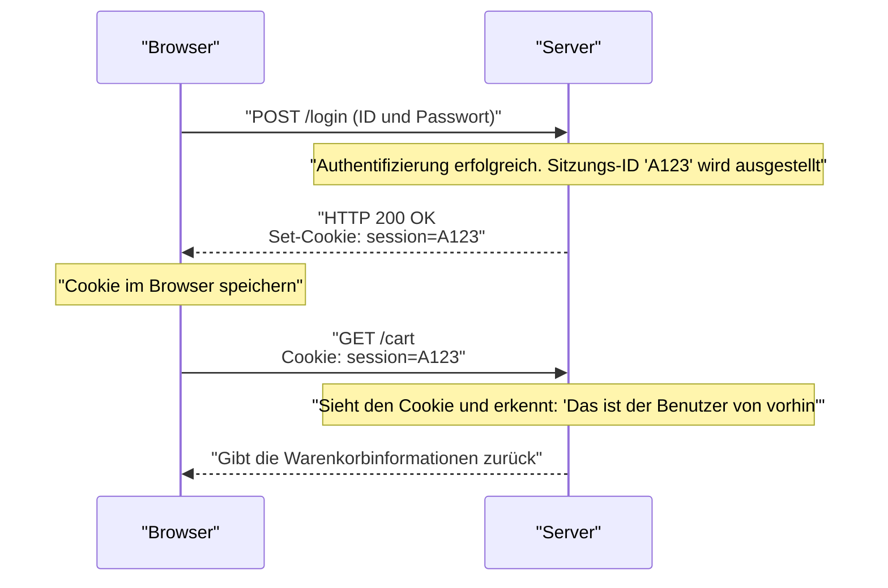

## 1. Die gemeinsame Sprache des World Wide Web

Die Zeichenfolge `http://` oder `https://`, die wir in die Adressleiste unseres Browsers eingeben, ist eine Deklaration: „Von nun an kommuniziere ich über die Regeln von **HTTP (HyperText Transfer Protocol)**.“

Im Jahr 1989 entwarf Dr. Tim Berners-Lee von der Europäischen Organisation für Kernforschung (CERN) das „World Wide Web“, ein System, das von Forschern auf der ganzen Welt geschriebene Arbeiten (Texte) in einem netzartigen Geflecht mit Hyperlinks verband.
HTTP wurde als ein extrem einfaches Kommunikationsprotokoll entwickelt, um diesen Links zu folgen und HTML-Dokumente von entfernten Servern abzurufen.

Wie hat sich HTTP, das anfangs nur ein LKW war, der reine Textdokumente transportierte, zu der gigantischen Infrastruktur entwickelt, die das heutige YouTube-Videostreaming und komplexe Webanwendungen in Browsern unterstützt?

## 2. Die grundlegende Struktur von HTTP und das Konzept der „Zustandslosigkeit“

Das Kommunikationsmodell von HTTP ist erstaunlich einfach.
„Der Client (Browser) stellt eine Anforderung (Request), und der Server sendet eine Antwort (Response) zurück.“
Es besteht nur aus diesem einen Hin- und Her-Spiel.

### Der Inhalt von Request und Response
Die HTTP-Kommunikationsinhalte sind textbasiert und für Menschen lesbar (※ bis HTTP/1.1).

**Beispiel für einen Request vom Client:**
```http
GET /index.html HTTP/1.1
Host: kenji.blog
User-Agent: Mozilla/5.0
```
(Übersetzung: „Hallo Server kenji.blog, bitte geben Sie mir die Datei index.html. Ich bin ein Mozilla-basierter Browser.“)

**Beispiel für eine Response vom Server:**
```http
HTTP/1.1 200 OK
Content-Type: text/html
Content-Length: 1024

<html><body>Hallo!</body></html>
```
(Übersetzung: „Request erfolgreich (200 OK). Der Inhalt ist HTML und die Größe beträgt 1024 Byte. Bitte sehr!“)

### Zustandslos (ohne Zustand): Die stärkste Waffe
Das wichtigste Designkonzept von HTTP ist, dass es „**zustandslos (Stateless)**“ ist.
Der Server merkt sich keine vergangenen Kommunikationsinteraktionen (Zustand = State). Sowohl der 1. Request als auch der 100. Request werden vom Server immer als unabhängige „Schön, Sie kennenzulernen“-Requests behandelt.

Das Fehlen eines Gedächtnisses mag unpraktisch erscheinen, aber dies ist tatsächlich der Hauptgrund, warum das Web auf globaler Ebene so gigantisch wachsen konnte. Da der Server keinen Speicherplatz verbraucht, um sich zu merken, „mit wem er bis zu welchem Punkt gesprochen hat“, bricht er nicht so leicht zusammen, selbst wenn Millionen von Zugriffen gleichzeitig erfolgen, und es war sehr einfach, die Anzahl der Server zu erhöhen (Scale-out).

## 3. Die Erfindung des Cookies: Die Magie, Erinnerungen zu behalten

Als sich das Web jedoch von einem bloßen „System zum Lesen von wissenschaftlichen Arbeiten“ zu einer „Online-Shopping-Website“ entwickelte, stieß es an die Grenze der Zustandslosigkeit.
Wenn man von der Seite „Artikel in den Warenkorb legen“ zu „Zur Kasse gehen“ navigiert, vergisst der Server die vorherige Interaktion, sodass der Warenkorb in dem Moment, in dem man an der Kasse ankommt, leer ist.

Um dieses Problem zu lösen, erfand Lou Montulli, ein Ingenieur bei Netscape, 1994 den „**Cookie**“.



Der Server übergibt dem Browser eine Notiz (Cookie) und sagt: „Behalte diese Notiz“, und der Browser sendet von nun an bei jedem nachfolgenden Request diese Notiz mit. Dies ermöglichte es Webanwendungen, eine pseudo-Erinnerung (Sitzung) wie einen „Anmeldestatus“ oder „Warenkorbinhalt“ zu behalten, während das leichtgewichtige, zustandslose Design von HTTP aufrechterhalten wurde.

## 4. Die Geschichte der Versions-Updates und der Evolution

HTTP hat sich im Einklang mit den Anforderungen der Zeit dramatisch weiterentwickelt.

### HTTP/1.1 (1997): Persistente Verbindungen
Im frühen HTTP/1.0, wenn eine Seite mit 10 Bildern angezeigt wurde, wurde die TCP-Verbindung jedes Mal neu hergestellt: „Verbinden → Bild 1 abrufen → Trennen“, „Verbinden → Bild 2 abrufen → Trennen“. Da dies zu langsam war, führte HTTP/1.1 einen Mechanismus namens „**Keep-Alive**“ ein, der es ermöglichte, eine einmal hergestellte TCP-Verbindung wiederzuverwenden, um fortlaufend mehrere Dateien abzurufen.

### HTTP/2 (2015): Streams und Multiplexing
Heutige Websites erfordern Dutzende bis Hunderte von Dateien, wie CSS, JavaScript und unzählige Bilder, um eine einzige Seite anzuzeigen. Da HTTP/1.1 Requests in einer „einzigen Warteschlange“ innerhalb einer Verbindung der Reihe nach verarbeitete, gab es ein Problem namens „Head-of-Line Blocking“, bei dem eine große Datei ganz vorne alles dahinter blockierte.
In HTTP/2 wurde die Kommunikation von Text auf „binär“ umgestellt, und mehrere Dateien konnten **parallel (Multiplexing)** innerhalb einer einzigen Verbindung gleichzeitig ausgetauscht werden, was die Ladegeschwindigkeit des Webs drastisch verbesserte.

### HTTP/3 (2022): Abkehr von TCP und Einführung von QUIC
Im neuesten HTTP/3 wurde das Transportprotokoll, das die Grundlage des Internets bildet, vollständig von „TCP“, das jahrzehntelang verwendet wurde, auf das UDP-basierte „**QUIC**“ umgestellt.
Dadurch hat es sich zum ultimativen, für das mobile Zeitalter optimierten Kommunikationsprotokoll entwickelt, bei dem die Verbindung beispielsweise nicht getrennt wird, selbst wenn ein Smartphone von Wi-Fi auf ein Mobilfunknetz (4G/5G) wechselt.

## 5. Zusammenfassung

HTTP, das mit nur wenigen Zeilen Textbefehlen (`GET / HTTP/1.1`) begann, ist nun zur Grundlage für die API-Kommunikation (REST und GraphQL) geworden, verbindet Microservices und fungiert als Lebenselixier, das Software auf der ganzen Welt antreibt.

Seine Geschichte demonstriert den Triumph der schönen Architektur, die Tim Berners-Lee vorgeschlagen hat: „Einfach, für jedermann implementierbar und zustandslos“.
Egal wie komplex die Web-Technologie wird, dieses robuste HTTP-Protokoll fließt stets an ihrer Basis.
