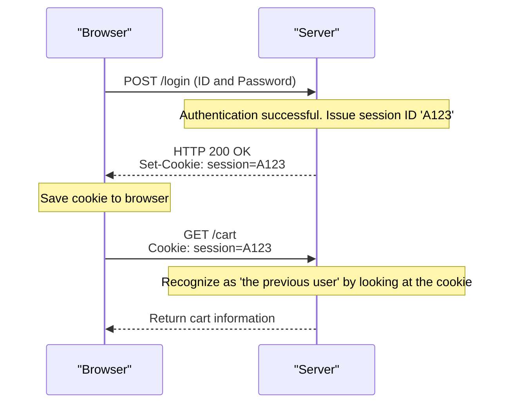

## 1. The Common Language of the World Wide Web

The string `http://` or `https://` that we enter into the browser's address bar is a declaration: "I am going to communicate using the rules of **HTTP (HyperText Transfer Protocol)**."

In 1989, Dr. Tim Berners-Lee of the European Organization for Nuclear Research (CERN) devised the "World Wide Web", a system to connect papers (texts) written by researchers around the world like a mesh through hyperlinks.
HTTP was created as an extremely simple communication protocol to follow those links and pull HTML documents from distant servers.

How did HTTP, which was initially just a truck carrying text documents, evolve into a massive infrastructure supporting today's YouTube video streaming and complex web applications on browsers?

## 2. The Basic Structure of HTTP and the "Stateless" Philosophy

The communication model of HTTP is surprisingly simple.
"The client (browser) sends a request, and the server returns a response."
It consists of just this one round-trip exchange.

### Contents of Requests and Responses
The communication content of HTTP is text-based and readable by humans (*up to HTTP/1.1).

**Example of a request from a client:**
```http
GET /index.html HTTP/1.1
Host: kenji.blog
User-Agent: Mozilla/5.0
```
(Translation: "Server kenji.blog, please give me the file index.html. I am a Mozilla-based browser.")

**Example of a response from a server:**
```http
HTTP/1.1 200 OK
Content-Type: text/html
Content-Length: 1024

<html><body>Hello!</body></html>
```
(Translation: "Request successful (200 OK). The content is HTML, and the size is 1024 bytes. Here you go!")

### The Ultimate Weapon of Being "Stateless"
The most important design philosophy of HTTP is being "**Stateless**".
The server does not remember any past communication interactions (state) at all. Whether it's the 1st request or the 100th request, it is always treated as an independent "nice to meet you" request by the server.

Having no memory might seem inconvenient, but this is actually the biggest reason why the Web was able to grow to a global scale. Because the server does not consume memory to remember "who it talked to and how far," it is less likely to crash even with millions of simultaneous accesses, making it very easy to increase the number of servers (scale out).

## 3. The Invention of Cookies: The Magic to Provide Memory

However, as the Web evolved from a mere "paper viewing system" into "online shopping sites," it hit the wall of being stateless.
When navigating pages from "Add item to cart" to "Proceed to checkout," the server forgets the previous interaction, so the moment you arrive at the checkout, your cart becomes empty.

To solve this problem, Lou Montulli, an engineer at Netscape, invented the "**Cookie**" in 1994.



The server hands the browser a "memo" (Cookie) saying "Keep this," and the browser starts sending that memo attached to every subsequent request. This made it possible to give web applications pseudo-memory (sessions) such as "login state" and "cart contents" while maintaining the lightweight stateless design of HTTP.

## 4. History and Evolution of Upgrades

HTTP has undergone dramatic evolution to meet the demands of the times.

### HTTP/1.1 (1997): Persistent Connections
In the early HTTP/1.0, when displaying a page with 10 images, the TCP connection was re-established every time: "Connect -> Get Image 1 -> Disconnect", "Connect -> Get Image 2 -> Disconnect". Because this was too slow, HTTP/1.1 introduced a mechanism called "**Keep-Alive**", which allowed a single TCP connection to be reused to retrieve multiple files sequentially.

### HTTP/2 (2015): Streams and Multiplexing
Modern websites request dozens to hundreds of files, such as CSS, JavaScript, and countless images, just to display a single page. In HTTP/1.1, requests were lined up in a "single file" within a connection and processed sequentially. This caused a problem called "Head-of-Line Blocking", where if a heavy file at the front gets stuck, everything behind it stops.
In HTTP/2, communication was changed from text to "binary", and multiple files could be exchanged simultaneously in **parallel (multiplexing)** within a single connection, dramatically improving web page loading speeds.

### HTTP/3 (2022): Breaking Away from TCP and Adopting QUIC
In the latest HTTP/3, the transport layer protocol, which is the foundation of the internet, was completely switched from "TCP", which had been used for decades, to "**QUIC**", which is based on UDP.
As a result, it has evolved into the ultimate communication protocol optimized for the mobile era, preventing disconnections even when a smartphone switches from Wi-Fi to a mobile network (4G/5G).

## 5. Summary

HTTP, which started with just a few lines of text commands (`GET / HTTP/1.1`), has now become the foundation for API communication (REST and GraphQL), connects microservices, and serves as the lifeblood running all software in the world.

Its history shows the triumph of the beautiful architecture proposed by Tim Berners-Lee: "simple, implementable by anyone, and stateless".
No matter how complex web technology becomes, this robust and sturdy HTTP protocol is always flowing at its roots.
