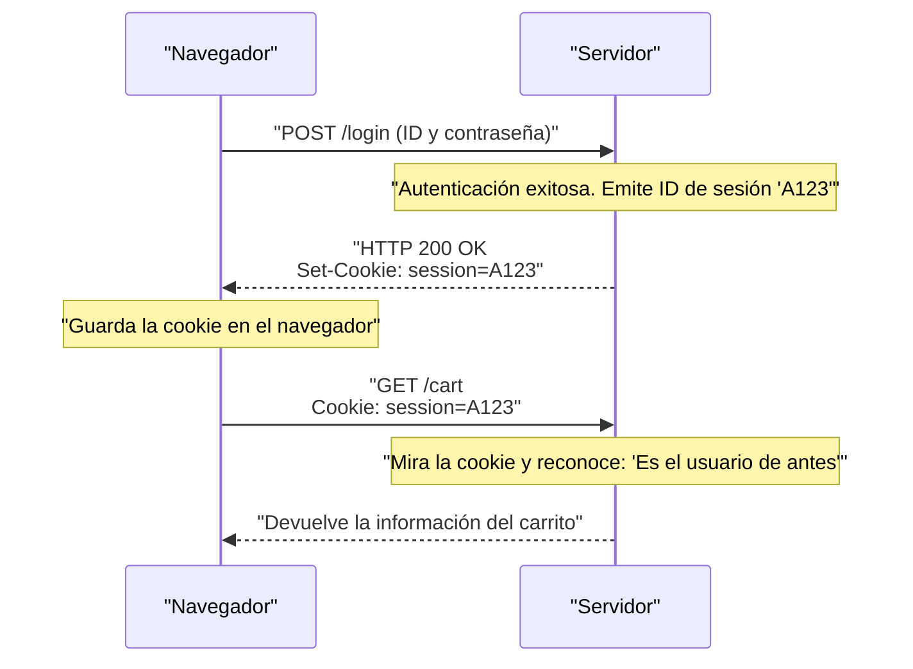

## 1. El lenguaje común de la World Wide Web

La cadena `http://` o `https://` que ingresamos en la barra de direcciones de nuestro navegador. Esta es una declaración que dice: "De ahora en adelante, nos comunicaremos usando la regla **HTTP (HyperText Transfer Protocol)**".

En 1989, el Dr. Tim Berners-Lee de la Organización Europea para la Investigación Nuclear (CERN) ideó un sistema llamado "World Wide Web" que conectaba como una red, mediante hipervínculos, los artículos (textos) escritos por investigadores de todo el mundo.
HTTP se creó como un protocolo de comunicación extremadamente simple para seguir esos enlaces y traer documentos HTML desde servidores distantes.

¿Cómo evolucionó HTTP, que al principio era solo un camión que transportaba documentos de texto sin formato, hasta convertirse en la enorme infraestructura que hoy en día sostiene el streaming de video de YouTube y las complejas aplicaciones web en los navegadores?

## 2. La estructura básica de HTTP y la filosofía de "sin estado" (Stateless)

El modelo de comunicación de HTTP es sorprendentemente simple.
"El cliente (navegador) envía una solicitud (request) y el servidor devuelve una respuesta (response)"
Consiste en este simple intercambio de ida y vuelta.

### El contenido de las solicitudes y respuestas
El contenido de la comunicación HTTP está basado en texto legible por humanos (*en el caso de hasta HTTP/1.1).

**Ejemplo de solicitud desde un cliente:**
```http
GET /index.html HTTP/1.1
Host: kenji.blog
User-Agent: Mozilla/5.0
```
(Traducción: "Servidor kenji.blog, por favor envíeme el archivo index.html. Soy un navegador basado en Mozilla")

**Ejemplo de respuesta desde el servidor:**
```http
HTTP/1.1 200 OK
Content-Type: text/html
Content-Length: 1024

<html><body>¡Hola!</body></html>
```
(Traducción: "Solicitud exitosa (200 OK). El contenido es HTML y el tamaño es de 1024 bytes. ¡Aquí tiene!")

### La mayor arma: "Sin estado" (Stateless)
La filosofía de diseño más importante de HTTP es ser "**sin estado (Stateless)**".
El servidor no recuerda en absoluto el estado de las comunicaciones pasadas (estado = state). Tanto la primera solicitud como la centésima solicitud son siempre procesadas por el servidor como solicitudes independientes de "encantado de conocerte".

No tener memoria puede parecer inconveniente, pero en realidad, esta es la principal razón por la que la Web pudo crecer a una escala global. Dado que el servidor no consume memoria recordando "con quién y hasta dónde ha hablado", es menos probable que colapse incluso si hay millones de accesos simultáneos, y fue muy fácil aumentar el número de servidores (escalabilidad horizontal).

## 3. La invención de las cookies (Cookie): Magia para tener memoria

Sin embargo, a medida que la Web evolucionó de un simple "sistema de visualización de artículos" a un "sitio de compras en línea", chocó contra la barrera del sistema sin estado.
Al navegar desde "Agregar un producto al carrito" hasta "Ir a la caja", el servidor olvida la interacción anterior, por lo que en el momento en que se llega a la caja, el carrito está completamente vacío.

Para resolver este problema, en 1994, Lou Montulli, un ingeniero de Netscape, inventó la "**Cookie (galleta)**".



El servidor le da al navegador una nota (Cookie) diciendo: "Guarda esta nota", y el navegador adjunta y envía esa nota con cada solicitud desde entonces. De esta manera, mientras se mantiene el diseño ligero y sin estado de HTTP, se hizo posible dar a las aplicaciones web una memoria pseudo-estado (sesión) como "estado de inicio de sesión" o "contenido del carrito".

## 4. La historia de las actualizaciones de versión y evolución

HTTP ha experimentado una evolución dramática para satisfacer las demandas de la época.

### HTTP/1.1 (1997): Conexiones persistentes
En los primeros tiempos de HTTP/1.0, al mostrar una página con 10 imágenes, la conexión TCP se reiniciaba cada vez: "conectar -> obtener imagen 1 -> desconectar", "conectar -> obtener imagen 2 -> desconectar". Dado que esto era demasiado lento, HTTP/1.1 introdujo el mecanismo "**Keep-Alive**", que permitía reutilizar una conexión TCP una vez establecida para obtener múltiples archivos consecutivamente.

### HTTP/2 (2015): Flujos y multiplexación
Los sitios web modernos requieren decenas a cientos de archivos, como CSS, JavaScript e innumerables imágenes, para mostrar una sola página. En HTTP/1.1, dado que las solicitudes se procesaban en orden en "una sola fila" dentro de la conexión, existía el problema del "Head-of-Line Blocking", donde si un archivo pesado en la parte delantera se atascaba, todo lo de atrás se detenía.
En HTTP/2, la comunicación cambió de texto a "binario", y múltiples archivos se pueden intercambiar simultáneamente en **paralelo (multiplexación)** dentro de una sola conexión, mejorando drásticamente la velocidad de visualización de la Web.

### HTTP/3 (2022): La salida de TCP y la adopción de QUIC
Y en el más reciente HTTP/3, el protocolo de la capa de transporte, que es la base de Internet, cambió completamente de "TCP", que se había utilizado durante décadas, a "**QUIC**", que está basado en UDP.
Como resultado, ha evolucionado hacia el protocolo de comunicación definitivo optimizado para la era móvil, donde las conexiones no se caen incluso cuando un teléfono inteligente cambia de Wi-Fi a una red móvil (4G/5G).

## 5. Resumen

HTTP, que comenzó con unas pocas líneas de comandos de texto (GET / HTTP/1.1), se ha convertido ahora en la base de las comunicaciones de API (REST y GraphQL), conectando microservicios y convirtiéndose en la sangre que impulsa todo el software del mundo.

Su historia muestra el triunfo de la hermosa arquitectura propuesta por Tim Berners-Lee: "Simple, implementable por cualquiera y sin estado".
No importa cuán complejas se vuelvan las tecnologías web, en su base siempre fluye constantemente este robusto protocolo HTTP.
