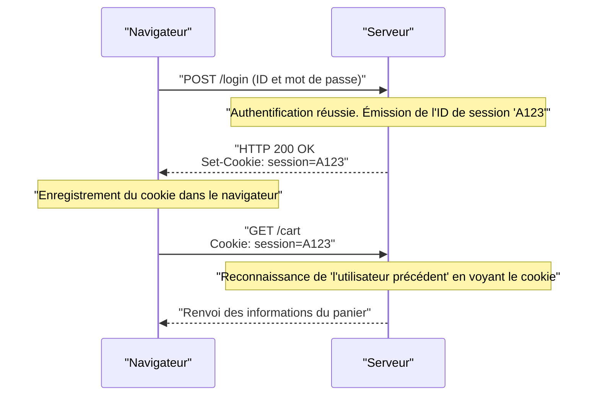

## 1. La langue commune du World Wide Web

La chaîne de caractères `http://` ou `https://` que nous saisissons dans la barre d'adresse de notre navigateur. C'est une déclaration qui dit : "Nous allons maintenant communiquer en utilisant les règles **HTTP (HyperText Transfer Protocol)**".

En 1989, le Dr Tim Berners-Lee du Conseil européen pour la recherche nucléaire (CERN) a inventé le "World Wide Web", un système qui reliait les articles (textes) rédigés par des chercheurs du monde entier à la manière d'une toile d'araignée grâce à des hyperliens.
HTTP a été créé comme un protocole de communication extrêmement simple pour suivre ces liens et récupérer des documents HTML depuis des serveurs distants.

Comment HTTP, qui n'était à l'origine qu'un camion transportant de simples documents texte, a-t-il évolué pour devenir l'infrastructure massive qui prend en charge le streaming vidéo de YouTube et les applications Web complexes sur les navigateurs d'aujourd'hui ?

## 2. La structure de base de HTTP et le concept "sans état"

Le modèle de communication de HTTP est étonnamment simple.
"Le client (navigateur) émet une requête, et le serveur renvoie une réponse."
Il est composé uniquement de cet aller-retour.

### Le contenu des requêtes et des réponses
Le contenu de la communication HTTP est basé sur du texte lisible par l'homme (※ jusqu'à HTTP/1.1).

**Exemple de requête du client :**
```http
GET /index.html HTTP/1.1
Host: kenji.blog
User-Agent: Mozilla/5.0
```
(Traduction : "Serveur kenji.blog, veuillez me donner le fichier index.html. Je suis un navigateur de type Mozilla.")

**Exemple de réponse du serveur :**
```http
HTTP/1.1 200 OK
Content-Type: text/html
Content-Length: 1024

<html><body>Bonjour !</body></html>
```
(Traduction : "Requête réussie (200 OK). Le contenu est du HTML et la taille est de 1024 octets. Voici !")

### "Sans état" (Stateless) : L'arme la plus puissante
La philosophie de conception la plus importante de HTTP est qu'il est "**sans état (Stateless)**".
Le serveur ne mémorise aucune trace des communications passées (état = state). Que ce soit la 1ère ou la 100ème requête, elle est toujours traitée par le serveur comme une requête indépendante, comme un "enchanté".

Ne pas avoir de mémoire peut sembler gênant, mais c'est en fait la principale raison pour laquelle le Web a pu atteindre une échelle mondiale. Comme le serveur ne consomme pas de mémoire pour se souvenir de "qui a parlé de quoi et jusqu'où", il ne tombe pas facilement en panne même avec des millions d'accès simultanés, et il a été très facile d'augmenter le nombre de serveurs (scale-out).

## 3. L'invention du Cookie : La magie de la mémoire

Cependant, lorsque le Web est passé d'un simple "système de consultation d'articles" à des "sites d'achat en ligne", il s'est heurté au mur du sans état.
Lors du passage de la page "Ajouter un article au panier" à "Passer à la caisse", le serveur oublie l'interaction précédente, ce qui fait que le panier se vide au moment où l'on arrive à la caisse.

Pour résoudre ce problème, l'ingénieur de Netscape, Lou Montulli, a inventé le "**Cookie**" en 1994.



Le serveur remet au navigateur un message du type "Garde ce mémo (Cookie)", et le navigateur joint ce mémo à chaque requête suivante. Cela a permis de donner aux applications Web une mémoire pseudo-persistante (session) telle que "l'état de connexion" ou "le contenu du panier", tout en conservant la conception légère du sans état de HTTP.

## 4. L'histoire et l'évolution des versions

HTTP a subi une évolution spectaculaire pour répondre aux exigences de son temps.

### HTTP/1.1 (1997) : Connexions persistantes
Dans le HTTP/1.0 initial, pour afficher une page contenant 10 images, la connexion TCP devait être refaite à chaque fois : "Connexion -> Obtention de l'image 1 -> Déconnexion", "Connexion -> Obtention de l'image 2 -> Déconnexion". Comme cela était trop lent, le mécanisme "**Keep-Alive**" a été introduit dans HTTP/1.1, permettant de réutiliser une connexion TCP une fois établie pour récupérer plusieurs fichiers en continu.

### HTTP/2 (2015) : Flux et multiplexage
Les sites Web modernes nécessitent des dizaines à des centaines de fichiers, tels que des CSS, du JavaScript et d'innombrables images, pour afficher une seule page. Dans HTTP/1.1, les requêtes étaient traitées "en ligne" les unes après les autres dans une connexion, ce qui entraînait le problème de "Head-of-Line Blocking" (blocage en tête de ligne) : si un fichier lourd situé à l'avant était bloqué, tout ce qui suivait s'arrêtait.
Dans HTTP/2, la communication est passée du texte au "binaire", permettant à plusieurs fichiers d'être échangés simultanément et **en parallèle (multiplexage)** au sein d'une même connexion, ce qui a considérablement amélioré la vitesse d'affichage du Web.

### HTTP/3 (2022) : S'affranchir de TCP et adopter QUIC
Et avec le dernier HTTP/3, le protocole de la couche de transport, qui est la base d'Internet, est passé complètement de "TCP", utilisé pendant des décennies, à "**QUIC**", basé sur UDP.
Grâce à cela, la communication ne se coupe pas même si un smartphone passe du Wi-Fi à un réseau mobile (4G/5G), évoluant vers le protocole de communication ultime optimisé pour l'ère mobile.

## 5. Résumé

HTTP, qui a commencé avec seulement quelques lignes de commandes textuelles (GET / HTTP/1.1), est maintenant devenu la base de la communication API (REST et GraphQL), connectant les microservices et devenant le sang qui fait fonctionner tous les logiciels du monde.

Son histoire démontre le triomphe de la belle architecture de Tim Berners-Lee : "Simple, implémentable par tous, et sans état".
Peu importe la complexité des technologies Web, ce protocole HTTP robuste et simple continuera de couler de manière continue à sa base.
