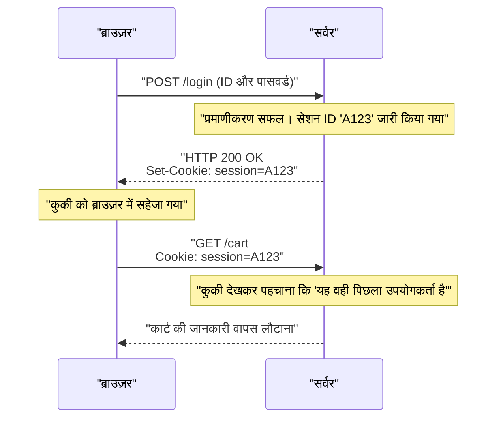

## 1. वर्ल्ड वाइड वेब की आम भाषा

हम अपने ब्राउज़र के एड्रेस बार में जो `http://` या `https://` स्ट्रिंग दर्ज करते हैं, वह इस बात की घोषणा है कि "अब हम **HTTP (HyperText Transfer Protocol)** नामक नियम का उपयोग करके संचार करने जा रहे हैं।"

1989 में, यूरोपीय परमाणु अनुसंधान संगठन (CERN) के डॉ. टिम बर्नर्स-ली ने एक ऐसी प्रणाली का आविष्कार किया जो दुनिया भर के शोधकर्ताओं द्वारा लिखे गए शोध पत्रों (टेक्स्ट) को हाइपरलिंक के माध्यम से एक जाल की तरह जोड़ती थी, जिसे "वर्ल्ड वाइड वेब" कहा गया।
उस लिंक का अनुसरण करके दूर के सर्वर से HTML दस्तावेज़ खींचने के लिए एक अत्यंत सरल संचार प्रोटोकॉल के रूप में HTTP को बनाया गया था।

शुरुआत में केवल टेक्स्ट दस्तावेज़ों को ले जाने वाले एक ट्रक के रूप में काम करने वाला HTTP, कैसे विकसित होकर आधुनिक YouTube वीडियो स्ट्रीमिंग और ब्राउज़र पर चलने वाले जटिल वेब एप्लिकेशनों को सपोर्ट करने वाले एक विशाल इंफ्रास्ट्रक्चर में बदल गया?

## 2. HTTP की मूल संरचना और "स्टेटलेस" की विचारधारा

HTTP का संचार मॉडल आश्चर्यजनक रूप से सरल है।
"क्लाइंट (ब्राउज़र) एक अनुरोध (रिक्वेस्ट) भेजता है, और सर्वर एक उत्तर (रिस्पॉन्स) देता है।"
यह केवल इसी एक तरफ़ा कैच-बॉल पर आधारित है।

### रिक्वेस्ट और रिस्पॉन्स की सामग्री
HTTP संचार सामग्री मानव-पठनीय टेक्स्ट पर आधारित होती है (※HTTP/1.1 तक के मामले में)।

**क्लाइंट से रिक्वेस्ट का उदाहरण:**
```http
GET /index.html HTTP/1.1
Host: kenji.blog
User-Agent: Mozilla/5.0
```
(अनुवाद: "kenji.blog नामक सर्वर, कृपया मुझे index.html फ़ाइल दें। मैं Mozilla-आधारित ब्राउज़र हूँ।")

**सर्वर से रिस्पॉन्स का उदाहरण:**
```http
HTTP/1.1 200 OK
Content-Type: text/html
Content-Length: 1024

<html><body>नमस्ते!</body></html>
```
(अनुवाद: "रिक्वेस्ट सफल रही (200 OK)। सामग्री HTML है, और साइज़ 1024 बाइट्स है। यह लीजिए!")

### स्टेटलेस (बिना स्थिति वाला) नामक सबसे शक्तिशाली हथियार
HTTP की सबसे महत्वपूर्ण डिज़ाइन विचारधारा इसका **स्टेटलेस (Stateless)** होना है।
सर्वर पिछले संचार लेन-देन (स्थिति = स्टेट) को बिल्कुल याद नहीं रखता है। पहला अनुरोध हो या 100वाँ अनुरोध, सर्वर के लिए हमेशा एक स्वतंत्र "आपसे मिलकर खुशी हुई" वाले अनुरोध के रूप में प्रोसेस किया जाता है।

याददाश्त न होना असुविधाजनक लग सकता है, लेकिन वास्तव में यही सबसे बड़ा कारण है कि वेब विश्व स्तर पर इतना विशाल हो सका। चूंकि सर्वर यह याद रखने के लिए मेमोरी खर्च नहीं करता कि "किसके साथ और कहाँ तक बातचीत हुई", इसलिए एक साथ लाखों एक्सेस आने पर भी यह क्रैश नहीं होता है, और सर्वर की संख्या बढ़ाना (स्केल आउट करना) बहुत आसान था।

## 3. कुकी (Cookie) का आविष्कार: याददाश्त देने वाला जादू

हालाँकि, जब वेब केवल एक "शोध पत्र देखने की प्रणाली" से एक "ऑनलाइन शॉपिंग साइट" में विकसित हुआ, तो यह स्टेटलेसनेस की दीवार से टकरा गया।
जब आप "कार्ट में आइटम जोड़ें" -> "चेकआउट के लिए आगे बढ़ें" के रूप में पेजों के बीच जाते हैं, तो सर्वर पिछले इंटरैक्शन को भूल जाता है, और जैसे ही आप चेकआउट पर पहुँचते हैं, कार्ट खाली हो जाती है।

इस समस्या को हल करने के लिए, नेटस्केप (Netscape) के इंजीनियर लू मोंटुली (Lou Montulli) ने 1994 में **Cookie (कुकी)** का आविष्कार किया।



सर्वर ब्राउज़र को कहता है, "इस मेमो (Cookie) को अपने पास रखें", और ब्राउज़र अब हर अगले अनुरोध के साथ उस मेमो को चिपकाकर भेजने लगा। इससे, HTTP की स्टेटलेस नामक हल्की-फुल्की डिज़ाइन को बनाए रखते हुए, वेब एप्लिकेशनों को "लॉगिन स्थिति" और "कार्ट की सामग्री" जैसी कृत्रिम याददाश्त (सेशन) देना संभव हो गया।

## 4. वर्ज़न अपडेट का इतिहास और विकास

HTTP ने समय की माँगों के अनुसार नाटकीय रूप से विकास किया है।

### HTTP/1.1 (1997): निरंतर कनेक्शन
शुरुआती HTTP/1.0 में, 10 छवियों वाला पेज प्रदर्शित करते समय, "कनेक्ट -> छवि 1 प्राप्त करें -> डिस्कनेक्ट", "कनेक्ट -> छवि 2 प्राप्त करें -> डिस्कनेक्ट" के रूप में हर बार TCP कनेक्शन को फिर से स्थापित किया जाता था। चूंकि यह बहुत धीमा था, इसलिए HTTP/1.1 में **Keep-Alive** नामक तंत्र पेश किया गया, जिसने एक बार स्थापित TCP कनेक्शन का पुन: उपयोग करके लगातार कई फ़ाइलें प्राप्त करना संभव बना दिया।

### HTTP/2 (2015): स्ट्रीम और मल्टीप्लेक्सिंग
आज की वेबसाइटें एक पेज को प्रदर्शित करने के लिए CSS, JavaScript, अनगिनत छवियों आदि सहित दर्जनों से लेकर सैकड़ों फ़ाइलों का अनुरोध करती हैं। चूंकि HTTP/1.1 में कनेक्शन के भीतर अनुरोधों को "एक पंक्ति" में रखकर क्रमिक रूप से संसाधित किया जाता था, इसलिए एक समस्या थी जिसे "Head-of-Line Blocking" कहा जाता था, जहां आगे की किसी भारी फ़ाइल के अटक जाने पर पीछे की सभी फ़ाइलें रुक जाती थीं।
HTTP/2 में, संचार को टेक्स्ट से "बाइनरी" में बदल दिया गया था, जिससे एक ही कनेक्शन के भीतर कई फ़ाइलों का **समानांतर (मल्टीप्लेक्सिंग)** रूप से एक साथ आदान-प्रदान करना संभव हो गया, और वेब की डिस्प्ले गति में नाटकीय रूप से सुधार हुआ।

### HTTP/3 (2022): TCP से आज़ादी और QUIC को अपनाना
और नवीनतम HTTP/3 में, इंटरनेट की नींव यानी ट्रांसपोर्ट लेयर प्रोटोकॉल को पूरी तरह से "TCP" से बदल दिया गया है, जिसका उपयोग दशकों से किया जा रहा था, और अब यह UDP पर आधारित **QUIC** बन गया है।
इसके परिणामस्वरूप, यह एक ऐसे बेहतरीन संचार प्रोटोकॉल के रूप में विकसित हुआ है जो मोबाइल युग के लिए अनुकूलित है, जहाँ स्मार्टफोन के वाई-फाई (Wi-Fi) से मोबाइल नेटवर्क (4G/5G) पर स्विच करने पर भी संचार डिस्कनेक्ट नहीं होता है।

## 5. निष्कर्ष

केवल कुछ पंक्तियों के टेक्स्ट कमांड (GET / HTTP/1.1) से शुरू होने वाला HTTP अब API संचार (REST और GraphQL) का आधार बन गया है, जो माइक्रो-सेवाओं को जोड़ता है और दुनिया भर के सभी सॉफ़्टवेयर को चलाने वाले रक्त के रूप में काम करता है।

इसका इतिहास टिम बर्नर्स-ली द्वारा पेश किए गए उस सुंदर आर्किटेक्चर की जीत को दर्शाता है, जो "सरल, कोई भी लागू कर सकता है, और स्थिति-रहित" है।
भले ही वेब तकनीक कितनी भी जटिल क्यों न हो जाए, लेकिन इसके मूल में हमेशा यह मजबूत और सरल HTTP प्रोटोकॉल निर्बाध रूप से प्रवाहित होता रहता है।
