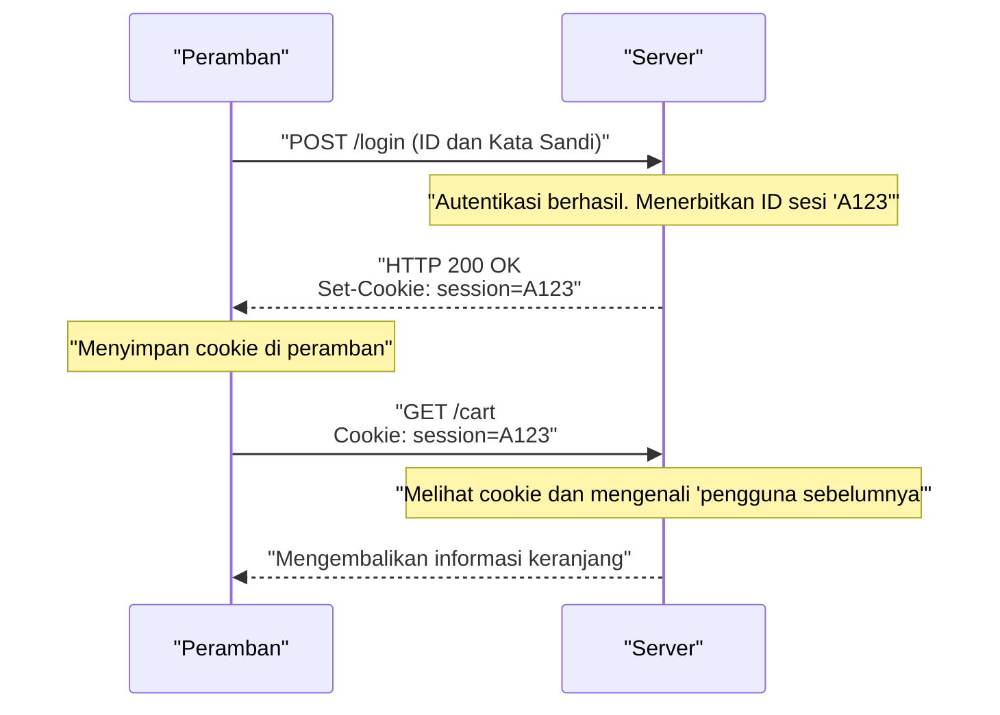

## 1. Bahasa Umum World Wide Web

String `http://` atau `https://` yang kita masukkan ke bilah alamat peramban (browser). Ini adalah sebuah deklarasi, "Mulai sekarang, kita akan berkomunikasi menggunakan aturan **HTTP (HyperText Transfer Protocol)**."

Pada tahun 1989, Dr. Tim Berners-Lee dari Organisasi Riset Nuklir Eropa (CERN) menemukan "World Wide Web", sebuah sistem yang menghubungkan makalah (teks) yang ditulis oleh para peneliti di seluruh dunia seperti jaring laba-laba menggunakan tanda hubung hiper (hyperlink).
HTTP diciptakan sebagai protokol komunikasi yang sangat sederhana untuk mengikuti tautan tersebut dan menarik dokumen HTML dari server yang jauh.

Bagaimana HTTP, yang awalnya hanya sebagai truk pengangkut dokumen teks biasa, berevolusi menjadi infrastruktur raksasa yang mendukung streaming video YouTube modern dan aplikasi Web kompleks di peramban?

## 2. Struktur Dasar HTTP dan Konsep "Stateless"

Model komunikasi HTTP sangatlah sederhana.
"Klien (peramban) mengirimkan permintaan (request), dan server mengembalikan tanggapan (response)."
Hanya terdiri dari satu siklus lempar-tangkap ini.

### Isi dari Request dan Response
Konten komunikasi HTTP dibuat berbasis teks yang dapat dibaca oleh manusia (*khusus hingga HTTP/1.1).

**Contoh request dari klien:**
```http
GET /index.html HTTP/1.1
Host: kenji.blog
User-Agent: Mozilla/5.0
```
(Terjemahan: "Halo server kenji.blog, tolong berikan file index.html. Saya adalah peramban berbasis Mozilla.")

**Contoh response dari server:**
```http
HTTP/1.1 200 OK
Content-Type: text/html
Content-Length: 1024

<html><body>Halo!</body></html>
```
(Terjemahan: "Request berhasil (200 OK). Isinya adalah HTML, dengan ukuran 1024 bita. Silakan!")

### "Stateless" (Tanpa Status), Senjata Terkuat
Konsep desain HTTP yang paling penting adalah "**Stateless (Tanpa Status)**".
Server tidak mengingat pertukaran komunikasi di masa lalu (status = state) sama sekali. Baik request pertama maupun request ke-100, akan selalu diproses oleh server sebagai request independen seolah-olah "baru pertama kali bertemu".

Tidak memiliki memori (ingatan) mungkin terasa tidak praktis, tetapi sebenarnya inilah alasan utama mengapa Web bisa berkembang menjadi skala global. Karena server tidak memakan memori untuk mengingat "siapa dan sejauh mana mereka berbicara", server menjadi tidak mudah kelebihan beban meskipun menerima jutaan akses secara bersamaan, dan sangat mudah untuk menambah jumlah server (scale-out).

## 3. Penemuan Cookie: Keajaiban Memberikan Ingatan

Namun, ketika Web berevolusi dari sekadar "sistem penelusuran makalah" menjadi "situs belanja online", kita menemui hambatan dari sifat stateless.
Saat berpindah halaman dari "memasukkan barang ke keranjang" → "lanjut ke kasir", server akan melupakan interaksi sebelumnya, sehingga keranjang menjadi kosong pada saat kita tiba di kasir.

Untuk menyelesaikan masalah ini, pada tahun 1994, seorang insinyur Netscape, Lou Montulli, menemukan "**Cookie (Kuki)**".



Server memberikan instruksi kepada peramban, "Simpan catatan (Cookie) ini," dan peramban akan melampirkan serta mengirimkan catatan tersebut pada setiap request berikutnya. Hal ini memungkinkan aplikasi Web untuk memiliki ingatan semu (sesi) seperti "status login" atau "isi keranjang" sambil tetap mempertahankan desain HTTP yang ringan dan stateless.

## 4. Sejarah dan Evolusi Pembaruan Versi

HTTP telah mengalami evolusi dramatis untuk memenuhi tuntutan zaman.

### HTTP/1.1 (1997): Koneksi Persisten
Pada HTTP/1.0 awal, ketika menampilkan halaman yang berisi 10 gambar, koneksi TCP dilakukan berulang kali: "hubungkan → ambil gambar 1 → putuskan", "hubungkan → ambil gambar 2 → putuskan". Karena ini terlalu lambat, mekanisme "**Keep-Alive**" diperkenalkan di HTTP/1.1, memungkinkan satu koneksi TCP yang telah dibuat untuk digunakan kembali sehingga beberapa file dapat diambil secara berurutan.

### HTTP/2 (2015): Streaming dan Multiplexing
Situs Web modern memerlukan puluhan hingga ratusan file, seperti CSS, JavaScript, dan gambar yang tak terhitung jumlahnya, hanya untuk menampilkan satu halaman. Pada HTTP/1.1, karena request disusun dalam "satu barisan" dalam koneksi dan diproses secara berurutan, terdapat masalah yang disebut "Head-of-Line Blocking" di mana jika ada file berat yang macet di depan, semua proses di belakangnya akan ikut berhenti.
Pada HTTP/2, komunikasi diubah dari teks menjadi "biner", memungkinkan beberapa file untuk bertukar data secara **paralel (multiplexing)** di dalam satu koneksi secara bersamaan, sehingga secara dramatis meningkatkan kecepatan pemuatan Web.

### HTTP/3 (2022): Lepas dari TCP dan Adopsi QUIC
Dan pada HTTP/3 terbaru, protokol layer transport yang menjadi fondasi internet sepenuhnya beralih dari "TCP" yang telah digunakan selama beberapa dekade ke "**QUIC**" yang berbasis UDP.
Hasilnya, protokol ini telah berevolusi menjadi protokol komunikasi terhebat yang dioptimalkan untuk era seluler, memastikan bahwa komunikasi tidak terputus meskipun ponsel pintar beralih dari Wi-Fi ke jaringan seluler (4G/5G).

## 5. Kesimpulan

HTTP, yang dimulai hanya dengan beberapa baris instruksi teks (GET / HTTP/1.1), sekarang telah menjadi fondasi dari komunikasi API (REST dan GraphQL), menghubungkan antar layanan mikro (microservices), dan menjadi darah yang menjalankan semua perangkat lunak di dunia.

Sejarahnya menunjukkan kemenangan dari arsitektur indah yang diusung oleh Tim Berners-Lee: "sederhana, dapat diimplementasikan oleh siapa saja, dan tanpa status".
Tidak peduli seberapa rumitnya teknologi Web, protokol HTTP yang kuat dan tangguh ini selalu mengalir tanpa henti di dasarnya.
