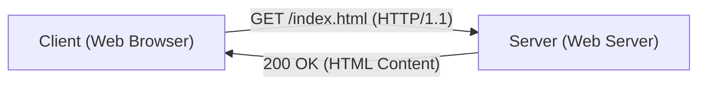

# Penjelasan Teknis HTTP

Hypertext Transfer Protocol (HTTP) adalah protokol komunikasi yang menjadi fondasi Web.

## Desain Stateless

HTTP adalah protokol yang tidak memiliki status (stateless). Setiap permintaan diproses secara independen.

## Pertimbangan Performa

Pada HTTP/2 dan HTTP/3, dampak Round-Trip Time (RTT) dikurangi melalui multiplexing. Waktu muat halaman dapat dimodelkan sebagai berikut.

$$ T_{load} = T_{DNS} + T_{TCP} + T_{TLS} + \sum_{i=1}^{N} \left( rac{S_i}{B} + RTT 
ight) $$

Dengan multiplexing, bagian $\sum$ di akhir diparalelkan, sehingga waktu dipersingkat secara drastis.
