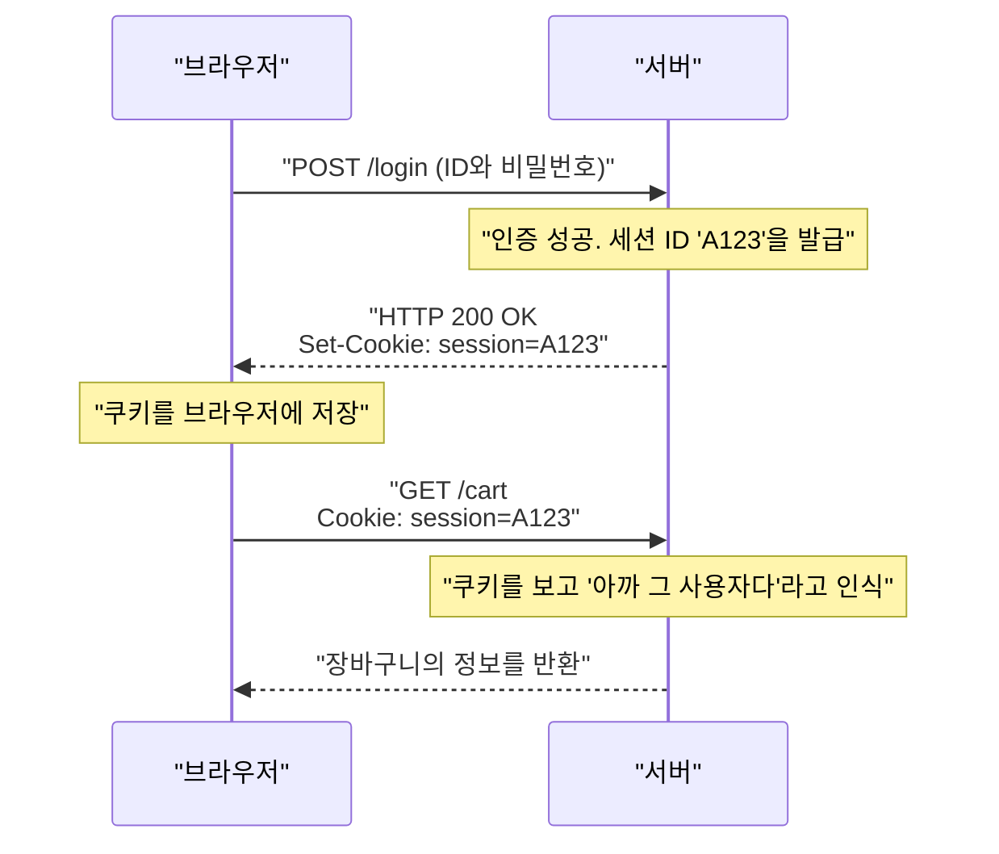

## 1. World Wide Web의 공통 언어

우리가 브라우저의 주소창에 입력하는 `http://` 또는 `https://` 라는 문자열. 이것은 "앞으로 **HTTP (HyperText Transfer Protocol)** 이라는 규칙을 사용하여 통신을 하겠습니다"라는 선언입니다.

1989년, 유럽 입자 물리 연구소(CERN)의 팀 버너스리 박사는 전 세계의 연구자가 쓴 논문(텍스트)을 하이퍼링크로 그물망처럼 연결하는 시스템인 'World Wide Web'을 고안했습니다.
그 링크를 따라가, 멀리 있는 서버로부터 HTML 문서를 가져오기 위한 극히 단순한 통신 규약으로서 만들어진 것이 HTTP입니다.

애초에는 단순한 텍스트 문서만 나르는 트럭이었던 HTTP는, 어떻게 현대의 유튜브 동영상 스트리밍이나 브라우저 상의 복잡한 웹 애플리케이션을 지탱하는 거대한 인프라로 진화했을까요?

## 2. HTTP의 기본 구조와 '스테이트리스'라는 사상

HTTP의 통신 모델은 놀라울 정도로 단순합니다.
"클라이언트(브라우저)가 요청(리퀘스트)을 보내고, 서버가 응답(리스폰스)을 반환한다"
이 1왕복의 캐치볼만으로 성립되어 있습니다.

### 요청과 응답의 내용
HTTP의 통신 내용은 사람이 읽을 수 있는 텍스트 기반으로 만들어져 있습니다(※HTTP/1.1까지의 경우).

**클라이언트로부터의 요청 예:**
```http
GET /index.html HTTP/1.1
Host: kenji.blog
User-Agent: Mozilla/5.0
```
(역: "kenji.blog라는 서버님, index.html이라는 파일을 주세요. 저는 Mozilla 계열의 브라우저입니다")

**서버로부터의 응답 예:**
```http
HTTP/1.1 200 OK
Content-Type: text/html
Content-Length: 1024

<html><body>안녕하세요!</body></html>
```
(역: "요청 성공(200 OK)입니다. 내용은 HTML이고, 크기는 1024바이트입니다. 여기 있습니다!")

### 스테이트리스(상태를 가지지 않음)라는 최강의 무기
HTTP의 가장 중요한 설계 사상은 ' **스테이트리스(Stateless)** '라는 것입니다.
서버는 과거의 통신 기록(상태=스테이트)을 전혀 기억하지 않습니다. 첫 번째 요청도, 100번째 요청도 서버에게는 항상 "처음 뵙겠습니다"와 같은 독립적인 요청으로 처리됩니다.

기억력이 없는 것은 불편해 보이지만, 사실 이것이야말로 웹이 세계적 규모로 거대해질 수 있었던 가장 큰 이유입니다. 서버가 '누구와 어디까지 대화했는지'를 기억하는 메모리를 소비하지 않기 때문에, 동시에 수백만 건의 접속이 와도 마비되기 어렵고, 서버를 여러 대로 늘리는(스케일 아웃하는) 것이 매우 간단했던 것입니다.

## 3. 쿠키(Cookie)의 발명: 기억을 갖게 하는 마법

하지만, 웹이 단순한 '논문 열람 시스템'에서 '온라인 쇼핑몰'로 진화하면서 스테이트리스의 벽에 부딪혔습니다.
'상품을 장바구니에 담기' → '결제로 넘어가기'라는 페이지 이동을 할 때, 서버가 직전의 상호작용을 잊어버리기 때문에 결제 페이지에 도착하는 순간 장바구니가 텅 비어버리게 되는 것입니다.

이 문제를 해결하기 위해, 1994년에 넷스케이프사의 엔지니어 루 몬툴리가 발명한 것이 ' **Cookie(쿠키)** '입니다.



서버는 브라우저에게 "이 메모(Cookie)를 가지고 있어"라고 건네주고, 브라우저는 다음 요청부터 매번 그 메모를 붙여서 보내게 되었습니다. 이로써 HTTP의 스테이트리스라는 가벼운 설계를 유지한 채, 웹 애플리케이션에 '로그인 상태'나 '장바구니의 내용물' 같은 유사적인 기억(세션)을 가지게 하는 것이 가능해졌습니다.

## 4. 버전 업의 역사와 진화

HTTP는 시대의 요구에 맞춰 극적인 진화를 이룩해 왔습니다.

### HTTP/1.1 (1997년): 지속적 연결
초기의 HTTP/1.0에서는 이미지가 10장 있는 페이지를 표시할 때, "연결 → 이미지1 가져오기 → 끊기", "연결 → 이미지2 가져오기 → 끊기"와 같이 매번 TCP 연결을 다시 해야 했습니다. 이렇게 하면 너무 느리기 때문에, HTTP/1.1에서는 ' **Keep-Alive** '라는 메커니즘이 도입되어, 한 번 연결한 TCP 커넥션을 재사용하여 여러 개의 파일을 연속으로 가져올 수 있게 되었습니다.

### HTTP/2 (2015년): 스트림과 다중화
현대의 웹사이트는 1페이지를 표시하기 위해 CSS, JavaScript, 무수한 이미지 등 수십~수백 개의 파일을 요구합니다. HTTP/1.1에서는 커넥션 내에서 요청을 '한 줄'로 세워 순서대로 처리했기 때문에, 앞의 무거운 파일이 막히면 뒤의 모든 것이 멈추는 'Head-of-Line Blocking'이라는 문제가 있었습니다.
HTTP/2에서는 통신을 텍스트에서 '바이너리'로 변경하고, 하나의 커넥션 내에서 여러 파일을 **병렬(다중화)** 하여 동시에 주고받을 수 있게 되어, 웹의 표시 속도가 극적으로 향상되었습니다.

### HTTP/3 (2022년): TCP로부터의 탈피와 QUIC 도입
그리고 최신의 HTTP/3에서는 인터넷의 토대인 전송 계층 프로토콜을 수십 년간 계속 사용하던 'TCP'에서 UDP를 기반으로 한 ' **QUIC** '으로 완전히 전환했습니다.
이로써 스마트폰이 Wi-Fi에서 모바일 네트워크(4G/5G)로 전환되어도 통신이 끊어지지 않는 등, 모바일 시대에 최적화된 궁극의 통신 프로토콜로 진화를 이룩하고 있습니다.

## 5. 요약

단 몇 줄의 텍스트 명령(GET / HTTP/1.1)에서 시작된 HTTP는 이제 API 통신(REST나 GraphQL)의 기반이 되어 마이크로서비스 간을 연결하고 세계의 모든 소프트웨어를 움직이는 혈액이 되었습니다.

그 역사는 팀 버너스리가 내세운 "단순하고 누구나 구현할 수 있으며 상태를 가지지 않는다"는 아름다운 아키텍처의 승리를 보여줍니다.
웹 기술이 아무리 복잡해지더라도 그 근저에는 항상 이 질실강건한 HTTP 프로토콜이 면면히 흐르고 있는 것입니다.
