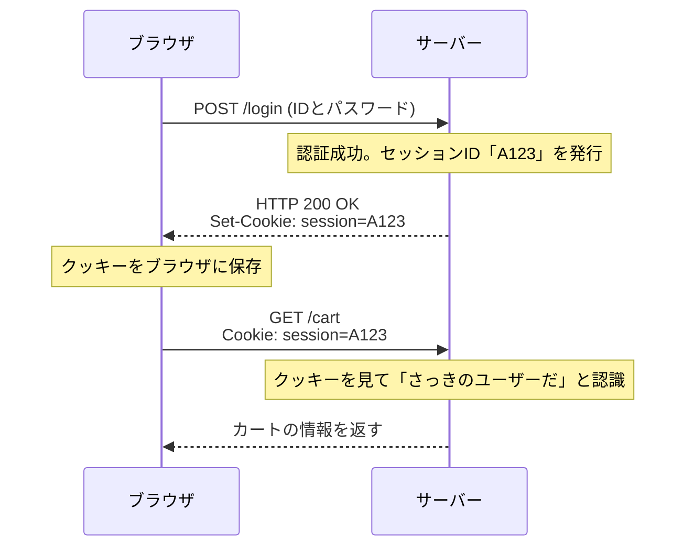

## 1. World Wide Webの共通言語

私たちがブラウザのアドレスバーに入力する `http://` または `https://` という文字列。これは、「これから **HTTP (HyperText Transfer Protocol)** というルールを使って通信をしますよ」という宣言です。

1989年、欧州原子核研究機構 (CERN) のティム・バーナーズ＝リー博士は、世界中の研究者が書いた論文（テキスト）を、ハイパーリンクで網の目のように繋ぎ合わせるシステム「World Wide Web」を考案しました。
そのリンクを辿って、遠くのサーバーからHTML文書を引っ張ってくるための極めてシンプルな通信規約として生み出されたのが、HTTPです。

当初はただのテキスト文書を運ぶだけのトラックだったHTTPは、どのようにして現代のYouTubeの動画ストリーミングや、ブラウザ上の複雑なWebアプリケーションを支える巨大なインフラへと進化したのでしょうか。

## 2. HTTPの基本構造と「ステートレス」という思想

HTTPの通信モデルは、驚くほどシンプルです。
「クライアント（ブラウザ）が要求（リクエスト）を出し、サーバーが応答（レスポンス）を返す」
この1往復のキャッチボールだけで成り立っています。

### リクエストとレスポンスの中身
HTTPの通信内容は、人間が読めるテキストベースで作られています（※HTTP/1.1までの場合）。

**クライアントからのリクエスト例:**
```http
GET /index.html HTTP/1.1
Host: kenji.blog
User-Agent: Mozilla/5.0
```
（訳：「kenji.blogというサーバーさん、index.htmlというファイルをください。私はMozilla系のブラウザです」）

**サーバーからのレスポンス例:**
```http
HTTP/1.1 200 OK
Content-Type: text/html
Content-Length: 1024

<html><body>こんにちは！</body></html>
```
（訳：「リクエスト成功（200 OK）です。中身はHTMLで、サイズは1024バイトです。どうぞ！」）

### ステートレス（状態を持たない）という最強の武器
HTTPの最も重要な設計思想は「**ステートレス（Stateless）**」であることです。
サーバーは、過去の通信のやり取り（状態＝ステート）を一切記憶しません。1回目のリクエストも、100回目のリクエストも、サーバーにとっては常に「はじめまして」の独立したリクエストとして処理されます。

記憶力がないのは不便に思えますが、実はこれこそがWebが世界規模に巨大化できた最大の理由です。サーバーが「誰とどこまで会話したか」を記憶するメモリを消費しないため、同時に何百万アクセスが来てもパンクしにくく、サーバーを複数台に増やす（スケールアウトする）のが非常に簡単だったのです。

## 3. クッキー（Cookie）の発明：記憶を持たせる魔法

しかし、Webが単なる「論文の閲覧システム」から「オンラインショッピングサイト」へ進化すると、ステートレスの壁にぶつかりました。
「商品をカートに入れる」→「レジへ進む」というページ遷移をする際、サーバーが直前のやり取りを忘れてしまうため、レジに着いた瞬間にカートが空っぽになってしまうのです。

この問題を解決するために、1994年にNetscape社のエンジニア、ルー・モントゥリが発明したのが「**Cookie（クッキー）**」です。



サーバーはブラウザに「このメモ（Cookie）を持っておいて」と渡し、ブラウザは次からのリクエストに毎回そのメモを貼り付けて送るようになりました。これにより、HTTPのステートレスという軽量な設計を維持したまま、Webアプリケーションに「ログイン状態」や「カートの中身」といった擬似的な記憶（セッション）を持たせることが可能になったのです。

## 4. バージョンアップの歴史と進化

HTTPは、時代の要求に合わせて劇的な進化を遂げてきました。

### HTTP/1.1 (1997年)：持続的接続
初期のHTTP/1.0では、画像が10枚あるページを表示する際、「接続→画像1取得→切断」「接続→画像2取得→切断」と、毎回TCPの接続をやり直していました。これでは遅すぎるため、HTTP/1.1では「**Keep-Alive**」という仕組みが導入され、一度繋いだTCPコネクションを使い回して、複数のファイルを連続で取得できるようになりました。

### HTTP/2 (2015年)：ストリームと多重化
現代のWebサイトは、1ページを表示するためにCSS、JavaScript、無数の画像など、数十〜数百のファイルを要求します。HTTP/1.1ではコネクションの中でリクエストを「1列」に並べて順番に処理していたため、前方の重いファイルが詰まると後方が全てストップする「Head-of-Line Blocking」という問題がありました。
HTTP/2では、通信をテキストから「バイナリ」に変更し、1つのコネクションの中で複数のファイルを**並列（多重化）**して同時にやり取りできるようになり、Webの表示速度が劇的に向上しました。

### HTTP/3 (2022年)：TCPからの脱却とQUICの採用
そして最新のHTTP/3では、インターネットの土台であるトランスポート層のプロトコルを、数十年間使い続けた「TCP」から、UDPをベースにした「**QUIC**」へと完全に切り替えました。
これにより、スマートフォンがWi-Fiからモバイル回線（4G/5G）へ切り替わっても通信が切断されないなど、モバイル時代に最適化された究極の通信プロトコルへと進化を遂げています。

## 5. まとめ

たった数行のテキスト命令（GET / HTTP/1.1）から始まったHTTPは、今やAPI通信（RESTやGraphQL）の基盤となり、マイクロサービス間を繋ぎ、世界のあらゆるソフトウェアを動かす血液となりました。

その歴史は、ティム・バーナーズ＝リーが掲げた「シンプルで、誰もが実装でき、状態を持たない」という美しいアーキテクチャの勝利を示しています。
Webの技術がいかに複雑になろうとも、その根底には常に、この質実剛健なHTTPプロトコルが脈々と流れているのです。
