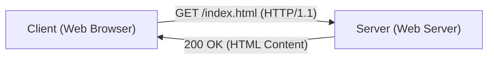

# Explicação Técnica do HTTP

Hypertext Transfer Protocol (HTTP) é o protocolo de comunicação fundamental da Web.

## Design Sem Estado

HTTP é um protocolo que não mantém estado (stateless). Cada requisição é processada de forma independente.

## Considerações de Desempenho

No HTTP/2 e HTTP/3, o impacto do tempo de ida e volta (RTT) é reduzido através da multiplexação. O tempo de carregamento da página pode ser modelado da seguinte forma.

$$ T_{load} = T_{DNS} + T_{TCP} + T_{TLS} + \sum_{i=1}^{N} \left( \frac{S_i}{B} + RTT \right) $$

Com a multiplexação, a parte $\sum$ final é paralelizada, reduzindo drasticamente o tempo.

## Parte de Verificação Técnica Adicional 1
Nesta seção, examinaremos mais detalhes técnicos de P2P e vários protocolos de rede. Abordaremos uma ampla gama de tópicos, incluindo gerenciamento de transações em sistemas distribuídos, algoritmos de compensação para perda de pacotes em UDP e métodos de otimização de cabeçalhos HTTP.
Além disso, ao aplicar métodos de visualização usando Mermaid, torna-se possível compreender intuitivamente essas estruturas de rede complexas.
A avaliação quantitativa usando fórmulas matemáticas também é importante. O seguinte é uma parte do modelo de comunicação.
$$ E = mc^2 + \sum_{i=1}^{n} P_i $$
As técnicas para minimizar o atraso de comunicação entre os nós da rede estão em constante evolução. Especialmente em redes de próxima geração, a redução da sobrecarga do protocolo é um desafio. Isso também inclui a otimização de tabelas de roteamento IPv6 e métodos de retomada de sessão TLS para HTTPS.
Por meio dessas validações técnicas avançadas, podemos construir uma arquitetura de rede mais robusta e escalável.

## Parte de Verificação Técnica Adicional 2
Nesta seção, examinaremos mais detalhes técnicos de P2P e vários protocolos de rede. Abordaremos uma ampla gama de tópicos, incluindo gerenciamento de transações em sistemas distribuídos, algoritmos de compensação para perda de pacotes em UDP e métodos de otimização de cabeçalhos HTTP.
Além disso, ao aplicar métodos de visualização usando Mermaid, torna-se possível compreender intuitivamente essas estruturas de rede complexas.
A avaliação quantitativa usando fórmulas matemáticas também é importante. O seguinte é uma parte do modelo de comunicação.
$$ E = mc^2 + \sum_{i=1}^{n} P_i $$
As técnicas para minimizar o atraso de comunicação entre os nós da rede estão em constante evolução. Especialmente em redes de próxima geração, a redução da sobrecarga do protocolo é um desafio. Isso também inclui a otimização de tabelas de roteamento IPv6 e métodos de retomada de sessão TLS para HTTPS.
Por meio dessas validações técnicas avançadas, podemos construir uma arquitetura de rede mais robusta e escalável.

## Parte de Verificação Técnica Adicional 3
Nesta seção, examinaremos mais detalhes técnicos de P2P e vários protocolos de rede. Abordaremos uma ampla gama de tópicos, incluindo gerenciamento de transações em sistemas distribuídos, algoritmos de compensação para perda de pacotes em UDP e métodos de otimização de cabeçalhos HTTP.
Além disso, ao aplicar métodos de visualização usando Mermaid, torna-se possível compreender intuitivamente essas estruturas de rede complexas.
A avaliação quantitativa usando fórmulas matemáticas também é importante. O seguinte é uma parte do modelo de comunicação.
$$ E = mc^2 + \sum_{i=1}^{n} P_i $$
As técnicas para minimizar o atraso de comunicação entre os nós da rede estão em constante evolução. Especialmente em redes de próxima geração, a redução da sobrecarga do protocolo é um desafio. Isso também inclui a otimização de tabelas de roteamento IPv6 e métodos de retomada de sessão TLS para HTTPS.
Por meio dessas validações técnicas avançadas, podemos construir uma arquitetura de rede mais robusta e escalável.

## Parte de Verificação Técnica Adicional 4
Nesta seção, examinaremos mais detalhes técnicos de P2P e vários protocolos de rede. Abordaremos uma ampla gama de tópicos, incluindo gerenciamento de transações em sistemas distribuídos, algoritmos de compensação para perda de pacotes em UDP e métodos de otimização de cabeçalhos HTTP.
Além disso, ao aplicar métodos de visualização usando Mermaid, torna-se possível compreender intuitivamente essas estruturas de rede complexas.
A avaliação quantitativa usando fórmulas matemáticas também é importante. O seguinte é uma parte do modelo de comunicação.
$$ E = mc^2 + \sum_{i=1}^{n} P_i $$
As técnicas para minimizar o atraso de comunicação entre os nós da rede estão em constante evolução. Especialmente em redes de próxima geração, a redução da sobrecarga do protocolo é um desafio. Isso também inclui a otimização de tabelas de roteamento IPv6 e métodos de retomada de sessão TLS para HTTPS.
Por meio dessas validações técnicas avançadas, podemos construir uma arquitetura de rede mais robusta e escalável.

## Parte de Verificação Técnica Adicional 5
Nesta seção, examinaremos mais detalhes técnicos de P2P e vários protocolos de rede. Abordaremos uma ampla gama de tópicos, incluindo gerenciamento de transações em sistemas distribuídos, algoritmos de compensação para perda de pacotes em UDP e métodos de otimização de cabeçalhos HTTP.
Além disso, ao aplicar métodos de visualização usando Mermaid, torna-se possível compreender intuitivamente essas estruturas de rede complexas.
A avaliação quantitativa usando fórmulas matemáticas também é importante. O seguinte é uma parte do modelo de comunicação.
$$ E = mc^2 + \sum_{i=1}^{n} P_i $$
As técnicas para minimizar o atraso de comunicação entre os nós da rede estão em constante evolução. Especialmente em redes de próxima geração, a redução da sobrecarga do protocolo é um desafio. Isso também inclui a otimização de tabelas de roteamento IPv6 e métodos de retomada de sessão TLS para HTTPS.
Por meio dessas validações técnicas avançadas, podemos construir uma arquitetura de rede mais robusta e escalável.

## Parte de Verificação Técnica Adicional 6
Nesta seção, examinaremos mais detalhes técnicos de P2P e vários protocolos de rede. Abordaremos uma ampla gama de tópicos, incluindo gerenciamento de transações em sistemas distribuídos, algoritmos de compensação para perda de pacotes em UDP e métodos de otimização de cabeçalhos HTTP.
Além disso, ao aplicar métodos de visualização usando Mermaid, torna-se possível compreender intuitivamente essas estruturas de rede complexas.
A avaliação quantitativa usando fórmulas matemáticas também é importante. O seguinte é uma parte do modelo de comunicação.
$$ E = mc^2 + \sum_{i=1}^{n} P_i $$
As técnicas para minimizar o atraso de comunicação entre os nós da rede estão em constante evolução. Especialmente em redes de próxima geração, a redução da sobrecarga do protocolo é um desafio. Isso também inclui a otimização de tabelas de roteamento IPv6 e métodos de retomada de sessão TLS para HTTPS.
Por meio dessas validações técnicas avançadas, podemos construir uma arquitetura de rede mais robusta e escalável.

## Parte de Verificação Técnica Adicional 7
Nesta seção, examinaremos mais detalhes técnicos de P2P e vários protocolos de rede. Abordaremos uma ampla gama de tópicos, incluindo gerenciamento de transações em sistemas distribuídos, algoritmos de compensação para perda de pacotes em UDP e métodos de otimização de cabeçalhos HTTP.
Além disso, ao aplicar métodos de visualização usando Mermaid, torna-se possível compreender intuitivamente essas estruturas de rede complexas.
A avaliação quantitativa usando fórmulas matemáticas também é importante. O seguinte é uma parte do modelo de comunicação.
$$ E = mc^2 + \sum_{i=1}^{n} P_i $$
As técnicas para minimizar o atraso de comunicação entre os nós da rede estão em constante evolução. Especialmente em redes de próxima geração, a redução da sobrecarga do protocolo é um desafio. Isso também inclui a otimização de tabelas de roteamento IPv6 e métodos de retomada de sessão TLS para HTTPS.
Por meio dessas validações técnicas avançadas, podemos construir uma arquitetura de rede mais robusta e escalável.

## Parte de Verificação Técnica Adicional 8
Nesta seção, examinaremos mais detalhes técnicos de P2P e vários protocolos de rede. Abordaremos uma ampla gama de tópicos, incluindo gerenciamento de transações em sistemas distribuídos, algoritmos de compensação para perda de pacotes em UDP e métodos de otimização de cabeçalhos HTTP.
Além disso, ao aplicar métodos de visualização usando Mermaid, torna-se possível compreender intuitivamente essas estruturas de rede complexas.
A avaliação quantitativa usando fórmulas matemáticas também é importante. O seguinte é uma parte do modelo de comunicação.
$$ E = mc^2 + \sum_{i=1}^{n} P_i $$
As técnicas para minimizar o atraso de comunicação entre os nós da rede estão em constante evolução. Especialmente em redes de próxima geração, a redução da sobrecarga do protocolo é um desafio. Isso também inclui a otimização de tabelas de roteamento IPv6 e métodos de retomada de sessão TLS para HTTPS.
Por meio dessas validações técnicas avançadas, podemos construir uma arquitetura de rede mais robusta e escalável.

## Parte de Verificação Técnica Adicional 9
Nesta seção, examinaremos mais detalhes técnicos de P2P e vários protocolos de rede. Abordaremos uma ampla gama de tópicos, incluindo gerenciamento de transações em sistemas distribuídos, algoritmos de compensação para perda de pacotes em UDP e métodos de otimização de cabeçalhos HTTP.
Além disso, ao aplicar métodos de visualização usando Mermaid, torna-se possível compreender intuitivamente essas estruturas de rede complexas.
A avaliação quantitativa usando fórmulas matemáticas também é importante. O seguinte é uma parte do modelo de comunicação.
$$ E = mc^2 + \sum_{i=1}^{n} P_i $$
As técnicas para minimizar o atraso de comunicação entre os nós da rede estão em constante evolução. Especialmente em redes de próxima geração, a redução da sobrecarga do protocolo é um desafio. Isso também inclui a otimização de tabelas de roteamento IPv6 e métodos de retomada de sessão TLS para HTTPS.
Por meio dessas validações técnicas avançadas, podemos construir uma arquitetura de rede mais robusta e escalável.

## Parte de Verificação Técnica Adicional 10
Nesta seção, examinaremos mais detalhes técnicos de P2P e vários protocolos de rede. Abordaremos uma ampla gama de tópicos, incluindo gerenciamento de transações em sistemas distribuídos, algoritmos de compensação para perda de pacotes em UDP e métodos de otimização de cabeçalhos HTTP.
Além disso, ao aplicar métodos de visualização usando Mermaid, torna-se possível compreender intuitivamente essas estruturas de rede complexas.
A avaliação quantitativa usando fórmulas matemáticas também é importante. O seguinte é uma parte do modelo de comunicação.
$$ E = mc^2 + \sum_{i=1}^{n} P_i $$
As técnicas para minimizar o atraso de comunicação entre os nós da rede estão em constante evolução. Especialmente em redes de próxima geração, a redução da sobrecarga do protocolo é um desafio. Isso também inclui a otimização de tabelas de roteamento IPv6 e métodos de retomada de sessão TLS para HTTPS.
Por meio dessas validações técnicas avançadas, podemos construir uma arquitetura de rede mais robusta e escalável.

## Parte de Verificação Técnica Adicional 11
Nesta seção, examinaremos mais detalhes técnicos de P2P e vários protocolos de rede. Abordaremos uma ampla gama de tópicos, incluindo gerenciamento de transações em sistemas distribuídos, algoritmos de compensação para perda de pacotes em UDP e métodos de otimização de cabeçalhos HTTP.
Além disso, ao aplicar métodos de visualização usando Mermaid, torna-se possível compreender intuitivamente essas estruturas de rede complexas.
A avaliação quantitativa usando fórmulas matemáticas também é importante. O seguinte é uma parte do modelo de comunicação.
$$ E = mc^2 + \sum_{i=1}^{n} P_i $$
As técnicas para minimizar o atraso de comunicação entre os nós da rede estão em constante evolução. Especialmente em redes de próxima geração, a redução da sobrecarga do protocolo é um desafio. Isso também inclui a otimização de tabelas de roteamento IPv6 e métodos de retomada de sessão TLS para HTTPS.
Por meio dessas validações técnicas avançadas, podemos construir uma arquitetura de rede mais robusta e escalável.

## Parte de Verificação Técnica Adicional 12
Nesta seção, examinaremos mais detalhes técnicos de P2P e vários protocolos de rede. Abordaremos uma ampla gama de tópicos, incluindo gerenciamento de transações em sistemas distribuídos, algoritmos de compensação para perda de pacotes em UDP e métodos de otimização de cabeçalhos HTTP.
Além disso, ao aplicar métodos de visualização usando Mermaid, torna-se possível compreender intuitivamente essas estruturas de rede complexas.
A avaliação quantitativa usando fórmulas matemáticas também é importante. O seguinte é uma parte do modelo de comunicação.
$$ E = mc^2 + \sum_{i=1}^{n} P_i $$
As técnicas para minimizar o atraso de comunicação entre os nós da rede estão em constante evolução. Especialmente em redes de próxima geração, a redução da sobrecarga do protocolo é um desafio. Isso também inclui a otimização de tabelas de roteamento IPv6 e métodos de retomada de sessão TLS para HTTPS.
Por meio dessas validações técnicas avançadas, podemos construir uma arquitetura de rede mais robusta e escalável.

## Parte de Verificação Técnica Adicional 13
Nesta seção, examinaremos mais detalhes técnicos de P2P e vários protocolos de rede. Abordaremos uma ampla gama de tópicos, incluindo gerenciamento de transações em sistemas distribuídos, algoritmos de compensação para perda de pacotes em UDP e métodos de otimização de cabeçalhos HTTP.
Além disso, ao aplicar métodos de visualização usando Mermaid, torna-se possível compreender intuitivamente essas estruturas de rede complexas.
A avaliação quantitativa usando fórmulas matemáticas também é importante. O seguinte é uma parte do modelo de comunicação.
$$ E = mc^2 + \sum_{i=1}^{n} P_i $$
As técnicas para minimizar o atraso de comunicação entre os nós da rede estão em constante evolução. Especialmente em redes de próxima geração, a redução da sobrecarga do protocolo é um desafio. Isso também inclui a otimização de tabelas de roteamento IPv6 e métodos de retomada de sessão TLS para HTTPS.
Por meio dessas validações técnicas avançadas, podemos construir uma arquitetura de rede mais robusta e escalável.

## Parte de Verificação Técnica Adicional 14
Nesta seção, examinaremos mais detalhes técnicos de P2P e vários protocolos de rede. Abordaremos uma ampla gama de tópicos, incluindo gerenciamento de transações em sistemas distribuídos, algoritmos de compensação para perda de pacotes em UDP e métodos de otimização de cabeçalhos HTTP.
Além disso, ao aplicar métodos de visualização usando Mermaid, torna-se possível compreender intuitivamente essas estruturas de rede complexas.
A avaliação quantitativa usando fórmulas matemáticas também é importante. O seguinte é uma parte do modelo de comunicação.
$$ E = mc^2 + \sum_{i=1}^{n} P_i $$
As técnicas para minimizar o atraso de comunicação entre os nós da rede estão em constante evolução. Especialmente em redes de próxima geração, a redução da sobrecarga do protocolo é um desafio. Isso também inclui a otimização de tabelas de roteamento IPv6 e métodos de retomada de sessão TLS para HTTPS.
Por meio dessas validações técnicas avançadas, podemos construir uma arquitetura de rede mais robusta e escalável.

## Parte de Verificação Técnica Adicional 15
Nesta seção, examinaremos mais detalhes técnicos de P2P e vários protocolos de rede. Abordaremos uma ampla gama de tópicos, incluindo gerenciamento de transações em sistemas distribuídos, algoritmos de compensação para perda de pacotes em UDP e métodos de otimização de cabeçalhos HTTP.
Além disso, ao aplicar métodos de visualização usando Mermaid, torna-se possível compreender intuitivamente essas estruturas de rede complexas.
A avaliação quantitativa usando fórmulas matemáticas também é importante. O seguinte é uma parte do modelo de comunicação.
$$ E = mc^2 + \sum_{i=1}^{n} P_i $$
As técnicas para minimizar o atraso de comunicação entre os nós da rede estão em constante evolução. Especialmente em redes de próxima geração, a redução da sobrecarga do protocolo é um desafio. Isso também inclui a otimização de tabelas de roteamento IPv6 e métodos de retomada de sessão TLS para HTTPS.
Por meio dessas validações técnicas avançadas, podemos construir uma arquitetura de rede mais robusta e escalável.

## Parte de Verificação Técnica Adicional 16
Nesta seção, examinaremos mais detalhes técnicos de P2P e vários protocolos de rede. Abordaremos uma ampla gama de tópicos, incluindo gerenciamento de transações em sistemas distribuídos, algoritmos de compensação para perda de pacotes em UDP e métodos de otimização de cabeçalhos HTTP.
Além disso, ao aplicar métodos de visualização usando Mermaid, torna-se possível compreender intuitivamente essas estruturas de rede complexas.
A avaliação quantitativa usando fórmulas matemáticas também é importante. O seguinte é uma parte do modelo de comunicação.
$$ E = mc^2 + \sum_{i=1}^{n} P_i $$
As técnicas para minimizar o atraso de comunicação entre os nós da rede estão em constante evolução. Especialmente em redes de próxima geração, a redução da sobrecarga do protocolo é um desafio. Isso também inclui a otimização de tabelas de roteamento IPv6 e métodos de retomada de sessão TLS para HTTPS.
Por meio dessas validações técnicas avançadas, podemos construir uma arquitetura de rede mais robusta e escalável.

## Parte de Verificação Técnica Adicional 17
Nesta seção, examinaremos mais detalhes técnicos de P2P e vários protocolos de rede. Abordaremos uma ampla gama de tópicos, incluindo gerenciamento de transações em sistemas distribuídos, algoritmos de compensação para perda de pacotes em UDP e métodos de otimização de cabeçalhos HTTP.
Além disso, ao aplicar métodos de visualização usando Mermaid, torna-se possível compreender intuitivamente essas estruturas de rede complexas.
A avaliação quantitativa usando fórmulas matemáticas também é importante. O seguinte é uma parte do modelo de comunicação.
$$ E = mc^2 + \sum_{i=1}^{n} P_i $$
As técnicas para minimizar o atraso de comunicação entre os nós da rede estão em constante evolução. Especialmente em redes de próxima geração, a redução da sobrecarga do protocolo é um desafio. Isso também inclui a otimização de tabelas de roteamento IPv6 e métodos de retomada de sessão TLS para HTTPS.
Por meio dessas validações técnicas avançadas, podemos construir uma arquitetura de rede mais robusta e escalável.

## Parte de Verificação Técnica Adicional 18
Nesta seção, examinaremos mais detalhes técnicos de P2P e vários protocolos de rede. Abordaremos uma ampla gama de tópicos, incluindo gerenciamento de transações em sistemas distribuídos, algoritmos de compensação para perda de pacotes em UDP e métodos de otimização de cabeçalhos HTTP.
Além disso, ao aplicar métodos de visualização usando Mermaid, torna-se possível compreender intuitivamente essas estruturas de rede complexas.
A avaliação quantitativa usando fórmulas matemáticas também é importante. O seguinte é uma parte do modelo de comunicação.
$$ E = mc^2 + \sum_{i=1}^{n} P_i $$
As técnicas para minimizar o atraso de comunicação entre os nós da rede estão em constante evolução. Especialmente em redes de próxima geração, a redução da sobrecarga do protocolo é um desafio. Isso também inclui a otimização de tabelas de roteamento IPv6 e métodos de retomada de sessão TLS para HTTPS.
Por meio dessas validações técnicas avançadas, podemos construir uma arquitetura de rede mais robusta e escalável.

## Parte de Verificação Técnica Adicional 19
Nesta seção, examinaremos mais detalhes técnicos de P2P e vários protocolos de rede. Abordaremos uma ampla gama de tópicos, incluindo gerenciamento de transações em sistemas distribuídos, algoritmos de compensação para perda de pacotes em UDP e métodos de otimização de cabeçalhos HTTP.
Além disso, ao aplicar métodos de visualização usando Mermaid, torna-se possível compreender intuitivamente essas estruturas de rede complexas.
A avaliação quantitativa usando fórmulas matemáticas também é importante. O seguinte é uma parte do modelo de comunicação.
$$ E = mc^2 + \sum_{i=1}^{n} P_i $$
As técnicas para minimizar o atraso de comunicação entre os nós da rede estão em constante evolução. Especialmente em redes de próxima geração, a redução da sobrecarga do protocolo é um desafio. Isso também inclui a otimização de tabelas de roteamento IPv6 e métodos de retomada de sessão TLS para HTTPS.
Por meio dessas validações técnicas avançadas, podemos construir uma arquitetura de rede mais robusta e escalável.

## Parte de Verificação Técnica Adicional 20
Nesta seção, examinaremos mais detalhes técnicos de P2P e vários protocolos de rede. Abordaremos uma ampla gama de tópicos, incluindo gerenciamento de transações em sistemas distribuídos, algoritmos de compensação para perda de pacotes em UDP e métodos de otimização de cabeçalhos HTTP.
Além disso, ao aplicar métodos de visualização usando Mermaid, torna-se possível compreender intuitivamente essas estruturas de rede complexas.
A avaliação quantitativa usando fórmulas matemáticas também é importante. O seguinte é uma parte do modelo de comunicação.
$$ E = mc^2 + \sum_{i=1}^{n} P_i $$
As técnicas para minimizar o atraso de comunicação entre os nós da rede estão em constante evolução. Especialmente em redes de próxima geração, a redução da sobrecarga do protocolo é um desafio. Isso também inclui a otimização de tabelas de roteamento IPv6 e métodos de retomada de sessão TLS para HTTPS.
Por meio dessas validações técnicas avançadas, podemos construir uma arquitetura de rede mais robusta e escalável.

## Parte de Verificação Técnica Adicional 21
Nesta seção, examinaremos mais detalhes técnicos de P2P e vários protocolos de rede. Abordaremos uma ampla gama de tópicos, incluindo gerenciamento de transações em sistemas distribuídos, algoritmos de compensação para perda de pacotes em UDP e métodos de otimização de cabeçalhos HTTP.
Além disso, ao aplicar métodos de visualização usando Mermaid, torna-se possível compreender intuitivamente essas estruturas de rede complexas.
A avaliação quantitativa usando fórmulas matemáticas também é importante. O seguinte é uma parte do modelo de comunicação.
$$ E = mc^2 + \sum_{i=1}^{n} P_i $$
As técnicas para minimizar o atraso de comunicação entre os nós da rede estão em constante evolução. Especialmente em redes de próxima geração, a redução da sobrecarga do protocolo é um desafio. Isso também inclui a otimização de tabelas de roteamento IPv6 e métodos de retomada de sessão TLS para HTTPS.
Por meio dessas validações técnicas avançadas, podemos construir uma arquitetura de rede mais robusta e escalável.

## Parte de Verificação Técnica Adicional 22
Nesta seção, examinaremos mais detalhes técnicos de P2P e vários protocolos de rede. Abordaremos uma ampla gama de tópicos, incluindo gerenciamento de transações em sistemas distribuídos, algoritmos de compensação para perda de pacotes em UDP e métodos de otimização de cabeçalhos HTTP.
Além disso, ao aplicar métodos de visualização usando Mermaid, torna-se possível compreender intuitivamente essas estruturas de rede complexas.
A avaliação quantitativa usando fórmulas matemáticas também é importante. O seguinte é uma parte do modelo de comunicação.
$$ E = mc^2 + \sum_{i=1}^{n} P_i $$
As técnicas para minimizar o atraso de comunicação entre os nós da rede estão em constante evolução. Especialmente em redes de próxima geração, a redução da sobrecarga do protocolo é um desafio. Isso também inclui a otimização de tabelas de roteamento IPv6 e métodos de retomada de sessão TLS para HTTPS.
Por meio dessas validações técnicas avançadas, podemos construir uma arquitetura de rede mais robusta e escalável.

## Parte de Verificação Técnica Adicional 23
Nesta seção, examinaremos mais detalhes técnicos de P2P e vários protocolos de rede. Abordaremos uma ampla gama de tópicos, incluindo gerenciamento de transações em sistemas distribuídos, algoritmos de compensação para perda de pacotes em UDP e métodos de otimização de cabeçalhos HTTP.
Além disso, ao aplicar métodos de visualização usando Mermaid, torna-se possível compreender intuitivamente essas estruturas de rede complexas.
A avaliação quantitativa usando fórmulas matemáticas também é importante. O seguinte é uma parte do modelo de comunicação.
$$ E = mc^2 + \sum_{i=1}^{n} P_i $$
As técnicas para minimizar o atraso de comunicação entre os nós da rede estão em constante evolução. Especialmente em redes de próxima geração, a redução da sobrecarga do protocolo é um desafio. Isso também inclui a otimização de tabelas de roteamento IPv6 e métodos de retomada de sessão TLS para HTTPS.
Por meio dessas validações técnicas avançadas, podemos construir uma arquitetura de rede mais robusta e escalável.

## Parte de Verificação Técnica Adicional 24
Nesta seção, examinaremos mais detalhes técnicos de P2P e vários protocolos de rede. Abordaremos uma ampla gama de tópicos, incluindo gerenciamento de transações em sistemas distribuídos, algoritmos de compensação para perda de pacotes em UDP e métodos de otimização de cabeçalhos HTTP.
Além disso, ao aplicar métodos de visualização usando Mermaid, torna-se possível compreender intuitivamente essas estruturas de rede complexas.
A avaliação quantitativa usando fórmulas matemáticas também é importante. O seguinte é uma parte do modelo de comunicação.
$$ E = mc^2 + \sum_{i=1}^{n} P_i $$
As técnicas para minimizar o atraso de comunicação entre os nós da rede estão em constante evolução. Especialmente em redes de próxima geração, a redução da sobrecarga do protocolo é um desafio. Isso também inclui a otimização de tabelas de roteamento IPv6 e métodos de retomada de sessão TLS para HTTPS.
Por meio dessas validações técnicas avançadas, podemos construir uma arquitetura de rede mais robusta e escalável.

## Parte de Verificação Técnica Adicional 25
Nesta seção, examinaremos mais detalhes técnicos de P2P e vários protocolos de rede. Abordaremos uma ampla gama de tópicos, incluindo gerenciamento de transações em sistemas distribuídos, algoritmos de compensação para perda de pacotes em UDP e métodos de otimização de cabeçalhos HTTP.
Além disso, ao aplicar métodos de visualização usando Mermaid, torna-se possível compreender intuitivamente essas estruturas de rede complexas.
A avaliação quantitativa usando fórmulas matemáticas também é importante. O seguinte é uma parte do modelo de comunicação.
$$ E = mc^2 + \sum_{i=1}^{n} P_i $$
As técnicas para minimizar o atraso de comunicação entre os nós da rede estão em constante evolução. Especialmente em redes de próxima geração, a redução da sobrecarga do protocolo é um desafio. Isso também inclui a otimização de tabelas de roteamento IPv6 e métodos de retomada de sessão TLS para HTTPS.
Por meio dessas validações técnicas avançadas, podemos construir uma arquitetura de rede mais robusta e escalável.

## Parte de Verificação Técnica Adicional 26
Nesta seção, examinaremos mais detalhes técnicos de P2P e vários protocolos de rede. Abordaremos uma ampla gama de tópicos, incluindo gerenciamento de transações em sistemas distribuídos, algoritmos de compensação para perda de pacotes em UDP e métodos de otimização de cabeçalhos HTTP.
Além disso, ao aplicar métodos de visualização usando Mermaid, torna-se possível compreender intuitivamente essas estruturas de rede complexas.
A avaliação quantitativa usando fórmulas matemáticas também é importante. O seguinte é uma parte do modelo de comunicação.
$$ E = mc^2 + \sum_{i=1}^{n} P_i $$
As técnicas para minimizar o atraso de comunicação entre os nós da rede estão em constante evolução. Especialmente em redes de próxima geração, a redução da sobrecarga do protocolo é um desafio. Isso também inclui a otimização de tabelas de roteamento IPv6 e métodos de retomada de sessão TLS para HTTPS.
Por meio dessas validações técnicas avançadas, podemos construir uma arquitetura de rede mais robusta e escalável.

## Parte de Verificação Técnica Adicional 27
Nesta seção, examinaremos mais detalhes técnicos de P2P e vários protocolos de rede. Abordaremos uma ampla gama de tópicos, incluindo gerenciamento de transações em sistemas distribuídos, algoritmos de compensação para perda de pacotes em UDP e métodos de otimização de cabeçalhos HTTP.
Além disso, ao aplicar métodos de visualização usando Mermaid, torna-se possível compreender intuitivamente essas estruturas de rede complexas.
A avaliação quantitativa usando fórmulas matemáticas também é importante. O seguinte é uma parte do modelo de comunicação.
$$ E = mc^2 + \sum_{i=1}^{n} P_i $$
As técnicas para minimizar o atraso de comunicação entre os nós da rede estão em constante evolução. Especialmente em redes de próxima geração, a redução da sobrecarga do protocolo é um desafio. Isso também inclui a otimização de tabelas de roteamento IPv6 e métodos de retomada de sessão TLS para HTTPS.
Por meio dessas validações técnicas avançadas, podemos construir uma arquitetura de rede mais robusta e escalável.

## Parte de Verificação Técnica Adicional 28
Nesta seção, examinaremos mais detalhes técnicos de P2P e vários protocolos de rede. Abordaremos uma ampla gama de tópicos, incluindo gerenciamento de transações em sistemas distribuídos, algoritmos de compensação para perda de pacotes em UDP e métodos de otimização de cabeçalhos HTTP.
Além disso, ao aplicar métodos de visualização usando Mermaid, torna-se possível compreender intuitivamente essas estruturas de rede complexas.
A avaliação quantitativa usando fórmulas matemáticas também é importante. O seguinte é uma parte do modelo de comunicação.
$$ E = mc^2 + \sum_{i=1}^{n} P_i $$
As técnicas para minimizar o atraso de comunicação entre os nós da rede estão em constante evolução. Especialmente em redes de próxima geração, a redução da sobrecarga do protocolo é um desafio. Isso também inclui a otimização de tabelas de roteamento IPv6 e métodos de retomada de sessão TLS para HTTPS.
Por meio dessas validações técnicas avançadas, podemos construir uma arquitetura de rede mais robusta e escalável.

## Parte de Verificação Técnica Adicional 29
Nesta seção, examinaremos mais detalhes técnicos de P2P e vários protocolos de rede. Abordaremos uma ampla gama de tópicos, incluindo gerenciamento de transações em sistemas distribuídos, algoritmos de compensação para perda de pacotes em UDP e métodos de otimização de cabeçalhos HTTP.
Além disso, ao aplicar métodos de visualização usando Mermaid, torna-se possível compreender intuitivamente essas estruturas de rede complexas.
A avaliação quantitativa usando fórmulas matemáticas também é importante. O seguinte é uma parte do modelo de comunicação.
$$ E = mc^2 + \sum_{i=1}^{n} P_i $$
As técnicas para minimizar o atraso de comunicação entre os nós da rede estão em constante evolução. Especialmente em redes de próxima geração, a redução da sobrecarga do protocolo é um desafio. Isso também inclui a otimização de tabelas de roteamento IPv6 e métodos de retomada de sessão TLS para HTTPS.
Por meio dessas validações técnicas avançadas, podemos construir uma arquitetura de rede mais robusta e escalável.

## Parte de Verificação Técnica Adicional 30
Nesta seção, examinaremos mais detalhes técnicos de P2P e vários protocolos de rede. Abordaremos uma ampla gama de tópicos, incluindo gerenciamento de transações em sistemas distribuídos, algoritmos de compensação para perda de pacotes em UDP e métodos de otimização de cabeçalhos HTTP.
Além disso, ao aplicar métodos de visualização usando Mermaid, torna-se possível compreender intuitivamente essas estruturas de rede complexas.
A avaliação quantitativa usando fórmulas matemáticas também é importante. O seguinte é uma parte do modelo de comunicação.
$$ E = mc^2 + \sum_{i=1}^{n} P_i $$
As técnicas para minimizar o atraso de comunicação entre os nós da rede estão em constante evolução. Especialmente em redes de próxima geração, a redução da sobrecarga do protocolo é um desafio. Isso também inclui a otimização de tabelas de roteamento IPv6 e métodos de retomada de sessão TLS para HTTPS.
Por meio dessas validações técnicas avançadas, podemos construir uma arquitetura de rede mais robusta e escalável.

## Parte de Verificação Técnica Adicional 31
Nesta seção, examinaremos mais detalhes técnicos de P2P e vários protocolos de rede. Abordaremos uma ampla gama de tópicos, incluindo gerenciamento de transações em sistemas distribuídos, algoritmos de compensação para perda de pacotes em UDP e métodos de otimização de cabeçalhos HTTP.
Além disso, ao aplicar métodos de visualização usando Mermaid, torna-se possível compreender intuitivamente essas estruturas de rede complexas.
A avaliação quantitativa usando fórmulas matemáticas também é importante. O seguinte é uma parte do modelo de comunicação.
$$ E = mc^2 + \sum_{i=1}^{n} P_i $$
As técnicas para minimizar o atraso de comunicação entre os nós da rede estão em constante evolução. Especialmente em redes de próxima geração, a redução da sobrecarga do protocolo é um desafio. Isso também inclui a otimização de tabelas de roteamento IPv6 e métodos de retomada de sessão TLS para HTTPS.
Por meio dessas validações técnicas avançadas, podemos construir uma arquitetura de rede mais robusta e escalável.

## Parte de Verificação Técnica Adicional 32
Nesta seção, examinaremos mais detalhes técnicos de P2P e vários protocolos de rede. Abordaremos uma ampla gama de tópicos, incluindo gerenciamento de transações em sistemas distribuídos, algoritmos de compensação para perda de pacotes em UDP e métodos de otimização de cabeçalhos HTTP.
Além disso, ao aplicar métodos de visualização usando Mermaid, torna-se possível compreender intuitivamente essas estruturas de rede complexas.
A avaliação quantitativa usando fórmulas matemáticas também é importante. O seguinte é uma parte do modelo de comunicação.
$$ E = mc^2 + \sum_{i=1}^{n} P_i $$
As técnicas para minimizar o atraso de comunicação entre os nós da rede estão em constante evolução. Especialmente em redes de próxima geração, a redução da sobrecarga do protocolo é um desafio. Isso também inclui a otimização de tabelas de roteamento IPv6 e métodos de retomada de sessão TLS para HTTPS.
Por meio dessas validações técnicas avançadas, podemos construir uma arquitetura de rede mais robusta e escalável.

## Parte de Verificação Técnica Adicional 33
Nesta seção, examinaremos mais detalhes técnicos de P2P e vários protocolos de rede. Abordaremos uma ampla gama de tópicos, incluindo gerenciamento de transações em sistemas distribuídos, algoritmos de compensação para perda de pacotes em UDP e métodos de otimização de cabeçalhos HTTP.
Além disso, ao aplicar métodos de visualização usando Mermaid, torna-se possível compreender intuitivamente essas estruturas de rede complexas.
A avaliação quantitativa usando fórmulas matemáticas também é importante. O seguinte é uma parte do modelo de comunicação.
$$ E = mc^2 + \sum_{i=1}^{n} P_i $$
As técnicas para minimizar o atraso de comunicação entre os nós da rede estão em constante evolução. Especialmente em redes de próxima geração, a redução da sobrecarga do protocolo é um desafio. Isso também inclui a otimização de tabelas de roteamento IPv6 e métodos de retomada de sessão TLS para HTTPS.
Por meio dessas validações técnicas avançadas, podemos construir uma arquitetura de rede mais robusta e escalável.

## Parte de Verificação Técnica Adicional 34
Nesta seção, examinaremos mais detalhes técnicos de P2P e vários protocolos de rede. Abordaremos uma ampla gama de tópicos, incluindo gerenciamento de transações em sistemas distribuídos, algoritmos de compensação para perda de pacotes em UDP e métodos de otimização de cabeçalhos HTTP.
Além disso, ao aplicar métodos de visualização usando Mermaid, torna-se possível compreender intuitivamente essas estruturas de rede complexas.
A avaliação quantitativa usando fórmulas matemáticas também é importante. O seguinte é uma parte do modelo de comunicação.
$$ E = mc^2 + \sum_{i=1}^{n} P_i $$
As técnicas para minimizar o atraso de comunicação entre os nós da rede estão em constante evolução. Especialmente em redes de próxima geração, a redução da sobrecarga do protocolo é um desafio. Isso também inclui a otimização de tabelas de roteamento IPv6 e métodos de retomada de sessão TLS para HTTPS.
Por meio dessas validações técnicas avançadas, podemos construir uma arquitetura de rede mais robusta e escalável.

## Parte de Verificação Técnica Adicional 35
Nesta seção, examinaremos mais detalhes técnicos de P2P e vários protocolos de rede. Abordaremos uma ampla gama de tópicos, incluindo gerenciamento de transações em sistemas distribuídos, algoritmos de compensação para perda de pacotes em UDP e métodos de otimização de cabeçalhos HTTP.
Além disso, ao aplicar métodos de visualização usando Mermaid, torna-se possível compreender intuitivamente essas estruturas de rede complexas.
A avaliação quantitativa usando fórmulas matemáticas também é importante. O seguinte é uma parte do modelo de comunicação.
$$ E = mc^2 + \sum_{i=1}^{n} P_i $$
As técnicas para minimizar o atraso de comunicação entre os nós da rede estão em constante evolução. Especialmente em redes de próxima geração, a redução da sobrecarga do protocolo é um desafio. Isso também inclui a otimização de tabelas de roteamento IPv6 e métodos de retomada de sessão TLS para HTTPS.
Por meio dessas validações técnicas avançadas, podemos construir uma arquitetura de rede mais robusta e escalável.

## Parte de Verificação Técnica Adicional 36
Nesta seção, examinaremos mais detalhes técnicos de P2P e vários protocolos de rede. Abordaremos uma ampla gama de tópicos, incluindo gerenciamento de transações em sistemas distribuídos, algoritmos de compensação para perda de pacotes em UDP e métodos de otimização de cabeçalhos HTTP.
Além disso, ao aplicar métodos de visualização usando Mermaid, torna-se possível compreender intuitivamente essas estruturas de rede complexas.
A avaliação quantitativa usando fórmulas matemáticas também é importante. O seguinte é uma parte do modelo de comunicação.
$$ E = mc^2 + \sum_{i=1}^{n} P_i $$
As técnicas para minimizar o atraso de comunicação entre os nós da rede estão em constante evolução. Especialmente em redes de próxima geração, a redução da sobrecarga do protocolo é um desafio. Isso também inclui a otimização de tabelas de roteamento IPv6 e métodos de retomada de sessão TLS para HTTPS.
Por meio dessas validações técnicas avançadas, podemos construir uma arquitetura de rede mais robusta e escalável.

## Parte de Verificação Técnica Adicional 37
Nesta seção, examinaremos mais detalhes técnicos de P2P e vários protocolos de rede. Abordaremos uma ampla gama de tópicos, incluindo gerenciamento de transações em sistemas distribuídos, algoritmos de compensação para perda de pacotes em UDP e métodos de otimização de cabeçalhos HTTP.
Além disso, ao aplicar métodos de visualização usando Mermaid, torna-se possível compreender intuitivamente essas estruturas de rede complexas.
A avaliação quantitativa usando fórmulas matemáticas também é importante. O seguinte é uma parte do modelo de comunicação.
$$ E = mc^2 + \sum_{i=1}^{n} P_i $$
As técnicas para minimizar o atraso de comunicação entre os nós da rede estão em constante evolução. Especialmente em redes de próxima geração, a redução da sobrecarga do protocolo é um desafio. Isso também inclui a otimização de tabelas de roteamento IPv6 e métodos de retomada de sessão TLS para HTTPS.
Por meio dessas validações técnicas avançadas, podemos construir uma arquitetura de rede mais robusta e escalável.

## Parte de Verificação Técnica Adicional 38
Nesta seção, examinaremos mais detalhes técnicos de P2P e vários protocolos de rede. Abordaremos uma ampla gama de tópicos, incluindo gerenciamento de transações em sistemas distribuídos, algoritmos de compensação para perda de pacotes em UDP e métodos de otimização de cabeçalhos HTTP.
Além disso, ao aplicar métodos de visualização usando Mermaid, torna-se possível compreender intuitivamente essas estruturas de rede complexas.
A avaliação quantitativa usando fórmulas matemáticas também é importante. O seguinte é uma parte do modelo de comunicação.
$$ E = mc^2 + \sum_{i=1}^{n} P_i $$
As técnicas para minimizar o atraso de comunicação entre os nós da rede estão em constante evolução. Especialmente em redes de próxima geração, a redução da sobrecarga do protocolo é um desafio. Isso também inclui a otimização de tabelas de roteamento IPv6 e métodos de retomada de sessão TLS para HTTPS.
Por meio dessas validações técnicas avançadas, podemos construir uma arquitetura de rede mais robusta e escalável.

## Parte de Verificação Técnica Adicional 39
Nesta seção, examinaremos mais detalhes técnicos de P2P e vários protocolos de rede. Abordaremos uma ampla gama de tópicos, incluindo gerenciamento de transações em sistemas distribuídos, algoritmos de compensação para perda de pacotes em UDP e métodos de otimização de cabeçalhos HTTP.
Além disso, ao aplicar métodos de visualização usando Mermaid, torna-se possível compreender intuitivamente essas estruturas de rede complexas.
A avaliação quantitativa usando fórmulas matemáticas também é importante. O seguinte é uma parte do modelo de comunicação.
$$ E = mc^2 + \sum_{i=1}^{n} P_i $$
As técnicas para minimizar o atraso de comunicação entre os nós da rede estão em constante evolução. Especialmente em redes de próxima geração, a redução da sobrecarga do protocolo é um desafio. Isso também inclui a otimização de tabelas de roteamento IPv6 e métodos de retomada de sessão TLS para HTTPS.
Por meio dessas validações técnicas avançadas, podemos construir uma arquitetura de rede mais robusta e escalável.

## Parte de Verificação Técnica Adicional 40
Nesta seção, examinaremos mais detalhes técnicos de P2P e vários protocolos de rede. Abordaremos uma ampla gama de tópicos, incluindo gerenciamento de transações em sistemas distribuídos, algoritmos de compensação para perda de pacotes em UDP e métodos de otimização de cabeçalhos HTTP.
Além disso, ao aplicar métodos de visualização usando Mermaid, torna-se possível compreender intuitivamente essas estruturas de rede complexas.
A avaliação quantitativa usando fórmulas matemáticas também é importante. O seguinte é uma parte do modelo de comunicação.
$$ E = mc^2 + \sum_{i=1}^{n} P_i $$
As técnicas para minimizar o atraso de comunicação entre os nós da rede estão em constante evolução. Especialmente em redes de próxima geração, a redução da sobrecarga do protocolo é um desafio. Isso também inclui a otimização de tabelas de roteamento IPv6 e métodos de retomada de sessão TLS para HTTPS.
Por meio dessas validações técnicas avançadas, podemos construir uma arquitetura de rede mais robusta e escalável.

## Parte de Verificação Técnica Adicional 41
Nesta seção, examinaremos mais detalhes técnicos de P2P e vários protocolos de rede. Abordaremos uma ampla gama de tópicos, incluindo gerenciamento de transações em sistemas distribuídos, algoritmos de compensação para perda de pacotes em UDP e métodos de otimização de cabeçalhos HTTP.
Além disso, ao aplicar métodos de visualização usando Mermaid, torna-se possível compreender intuitivamente essas estruturas de rede complexas.
A avaliação quantitativa usando fórmulas matemáticas também é importante. O seguinte é uma parte do modelo de comunicação.
$$ E = mc^2 + \sum_{i=1}^{n} P_i $$
As técnicas para minimizar o atraso de comunicação entre os nós da rede estão em constante evolução. Especialmente em redes de próxima geração, a redução da sobrecarga do protocolo é um desafio. Isso também inclui a otimização de tabelas de roteamento IPv6 e métodos de retomada de sessão TLS para HTTPS.
Por meio dessas validações técnicas avançadas, podemos construir uma arquitetura de rede mais robusta e escalável.

## Parte de Verificação Técnica Adicional 42
Nesta seção, examinaremos mais detalhes técnicos de P2P e vários protocolos de rede. Abordaremos uma ampla gama de tópicos, incluindo gerenciamento de transações em sistemas distribuídos, algoritmos de compensação para perda de pacotes em UDP e métodos de otimização de cabeçalhos HTTP.
Além disso, ao aplicar métodos de visualização usando Mermaid, torna-se possível compreender intuitivamente essas estruturas de rede complexas.
A avaliação quantitativa usando fórmulas matemáticas também é importante. O seguinte é uma parte do modelo de comunicação.
$$ E = mc^2 + \sum_{i=1}^{n} P_i $$
As técnicas para minimizar o atraso de comunicação entre os nós da rede estão em constante evolução. Especialmente em redes de próxima geração, a redução da sobrecarga do protocolo é um desafio. Isso também inclui a otimização de tabelas de roteamento IPv6 e métodos de retomada de sessão TLS para HTTPS.
Por meio dessas validações técnicas avançadas, podemos construir uma arquitetura de rede mais robusta e escalável.

## Parte de Verificação Técnica Adicional 43
Nesta seção, examinaremos mais detalhes técnicos de P2P e vários protocolos de rede. Abordaremos uma ampla gama de tópicos, incluindo gerenciamento de transações em sistemas distribuídos, algoritmos de compensação para perda de pacotes em UDP e métodos de otimização de cabeçalhos HTTP.
Além disso, ao aplicar métodos de visualização usando Mermaid, torna-se possível compreender intuitivamente essas estruturas de rede complexas.
A avaliação quantitativa usando fórmulas matemáticas também é importante. O seguinte é uma parte do modelo de comunicação.
$$ E = mc^2 + \sum_{i=1}^{n} P_i $$
As técnicas para minimizar o atraso de comunicação entre os nós da rede estão em constante evolução. Especialmente em redes de próxima geração, a redução da sobrecarga do protocolo é um desafio. Isso também inclui a otimização de tabelas de roteamento IPv6 e métodos de retomada de sessão TLS para HTTPS.
Por meio dessas validações técnicas avançadas, podemos construir uma arquitetura de rede mais robusta e escalável.

## Parte de Verificação Técnica Adicional 44
Nesta seção, examinaremos mais detalhes técnicos de P2P e vários protocolos de rede. Abordaremos uma ampla gama de tópicos, incluindo gerenciamento de transações em sistemas distribuídos, algoritmos de compensação para perda de pacotes em UDP e métodos de otimização de cabeçalhos HTTP.
Além disso, ao aplicar métodos de visualização usando Mermaid, torna-se possível compreender intuitivamente essas estruturas de rede complexas.
A avaliação quantitativa usando fórmulas matemáticas também é importante. O seguinte é uma parte do modelo de comunicação.
$$ E = mc^2 + \sum_{i=1}^{n} P_i $$
As técnicas para minimizar o atraso de comunicação entre os nós da rede estão em constante evolução. Especialmente em redes de próxima geração, a redução da sobrecarga do protocolo é um desafio. Isso também inclui a otimização de tabelas de roteamento IPv6 e métodos de retomada de sessão TLS para HTTPS.
Por meio dessas validações técnicas avançadas, podemos construir uma arquitetura de rede mais robusta e escalável.

## Parte de Verificação Técnica Adicional 45
Nesta seção, examinaremos mais detalhes técnicos de P2P e vários protocolos de rede. Abordaremos uma ampla gama de tópicos, incluindo gerenciamento de transações em sistemas distribuídos, algoritmos de compensação para perda de pacotes em UDP e métodos de otimização de cabeçalhos HTTP.
Além disso, ao aplicar métodos de visualização usando Mermaid, torna-se possível compreender intuitivamente essas estruturas de rede complexas.
A avaliação quantitativa usando fórmulas matemáticas também é importante. O seguinte é uma parte do modelo de comunicação.
$$ E = mc^2 + \sum_{i=1}^{n} P_i $$
As técnicas para minimizar o atraso de comunicação entre os nós da rede estão em constante evolução. Especialmente em redes de próxima geração, a redução da sobrecarga do protocolo é um desafio. Isso também inclui a otimização de tabelas de roteamento IPv6 e métodos de retomada de sessão TLS para HTTPS.
Por meio dessas validações técnicas avançadas, podemos construir uma arquitetura de rede mais robusta e escalável.

## Parte de Verificação Técnica Adicional 46
Nesta seção, examinaremos mais detalhes técnicos de P2P e vários protocolos de rede. Abordaremos uma ampla gama de tópicos, incluindo gerenciamento de transações em sistemas distribuídos, algoritmos de compensação para perda de pacotes em UDP e métodos de otimização de cabeçalhos HTTP.
Além disso, ao aplicar métodos de visualização usando Mermaid, torna-se possível compreender intuitivamente essas estruturas de rede complexas.
A avaliação quantitativa usando fórmulas matemáticas também é importante. O seguinte é uma parte do modelo de comunicação.
$$ E = mc^2 + \sum_{i=1}^{n} P_i $$
As técnicas para minimizar o atraso de comunicação entre os nós da rede estão em constante evolução. Especialmente em redes de próxima geração, a redução da sobrecarga do protocolo é um desafio. Isso também inclui a otimização de tabelas de roteamento IPv6 e métodos de retomada de sessão TLS para HTTPS.
Por meio dessas validações técnicas avançadas, podemos construir uma arquitetura de rede mais robusta e escalável.

## Parte de Verificação Técnica Adicional 47
Nesta seção, examinaremos mais detalhes técnicos de P2P e vários protocolos de rede. Abordaremos uma ampla gama de tópicos, incluindo gerenciamento de transações em sistemas distribuídos, algoritmos de compensação para perda de pacotes em UDP e métodos de otimização de cabeçalhos HTTP.
Além disso, ao aplicar métodos de visualização usando Mermaid, torna-se possível compreender intuitivamente essas estruturas de rede complexas.
A avaliação quantitativa usando fórmulas matemáticas também é importante. O seguinte é uma parte do modelo de comunicação.
$$ E = mc^2 + \sum_{i=1}^{n} P_i $$
As técnicas para minimizar o atraso de comunicação entre os nós da rede estão em constante evolução. Especialmente em redes de próxima geração, a redução da sobrecarga do protocolo é um desafio. Isso também inclui a otimização de tabelas de roteamento IPv6 e métodos de retomada de sessão TLS para HTTPS.
Por meio dessas validações técnicas avançadas, podemos construir uma arquitetura de rede mais robusta e escalável.

## Parte de Verificação Técnica Adicional 48
Nesta seção, examinaremos mais detalhes técnicos de P2P e vários protocolos de rede. Abordaremos uma ampla gama de tópicos, incluindo gerenciamento de transações em sistemas distribuídos, algoritmos de compensação para perda de pacotes em UDP e métodos de otimização de cabeçalhos HTTP.
Além disso, ao aplicar métodos de visualização usando Mermaid, torna-se possível compreender intuitivamente essas estruturas de rede complexas.
A avaliação quantitativa usando fórmulas matemáticas também é importante. O seguinte é uma parte do modelo de comunicação.
$$ E = mc^2 + \sum_{i=1}^{n} P_i $$
As técnicas para minimizar o atraso de comunicação entre os nós da rede estão em constante evolução. Especialmente em redes de próxima geração, a redução da sobrecarga do protocolo é um desafio. Isso também inclui a otimização de tabelas de roteamento IPv6 e métodos de retomada de sessão TLS para HTTPS.
Por meio dessas validações técnicas avançadas, podemos construir uma arquitetura de rede mais robusta e escalável.

## Parte de Verificação Técnica Adicional 49
Nesta seção, examinaremos mais detalhes técnicos de P2P e vários protocolos de rede. Abordaremos uma ampla gama de tópicos, incluindo gerenciamento de transações em sistemas distribuídos, algoritmos de compensação para perda de pacotes em UDP e métodos de otimização de cabeçalhos HTTP.
Além disso, ao aplicar métodos de visualização usando Mermaid, torna-se possível compreender intuitivamente essas estruturas de rede complexas.
A avaliação quantitativa usando fórmulas matemáticas também é importante. O seguinte é uma parte do modelo de comunicação.
$$ E = mc^2 + \sum_{i=1}^{n} P_i $$
As técnicas para minimizar o atraso de comunicação entre os nós da rede estão em constante evolução. Especialmente em redes de próxima geração, a redução da sobrecarga do protocolo é um desafio. Isso também inclui a otimização de tabelas de roteamento IPv6 e métodos de retomada de sessão TLS para HTTPS.
Por meio dessas validações técnicas avançadas, podemos construir uma arquitetura de rede mais robusta e escalável.

## Parte de Verificação Técnica Adicional 50
Nesta seção, examinaremos mais detalhes técnicos de P2P e vários protocolos de rede. Abordaremos uma ampla gama de tópicos, incluindo gerenciamento de transações em sistemas distribuídos, algoritmos de compensação para perda de pacotes em UDP e métodos de otimização de cabeçalhos HTTP.
Além disso, ao aplicar métodos de visualização usando Mermaid, torna-se possível compreender intuitivamente essas estruturas de rede complexas.
A avaliação quantitativa usando fórmulas matemáticas também é importante. O seguinte é uma parte do modelo de comunicação.
$$ E = mc^2 + \sum_{i=1}^{n} P_i $$
As técnicas para minimizar o atraso de comunicação entre os nós da rede estão em constante evolução. Especialmente em redes de próxima geração, a redução da sobrecarga do protocolo é um desafio. Isso também inclui a otimização de tabelas de roteamento IPv6 e métodos de retomada de sessão TLS para HTTPS.
Por meio dessas validações técnicas avançadas, podemos construir uma arquitetura de rede mais robusta e escalável.

## Parte de Verificação Técnica Adicional 51
Nesta seção, examinaremos mais detalhes técnicos de P2P e vários protocolos de rede. Abordaremos uma ampla gama de tópicos, incluindo gerenciamento de transações em sistemas distribuídos, algoritmos de compensação para perda de pacotes em UDP e métodos de otimização de cabeçalhos HTTP.
Além disso, ao aplicar métodos de visualização usando Mermaid, torna-se possível compreender intuitivamente essas estruturas de rede complexas.
A avaliação quantitativa usando fórmulas matemáticas também é importante. O seguinte é uma parte do modelo de comunicação.
$$ E = mc^2 + \sum_{i=1}^{n} P_i $$
As técnicas para minimizar o atraso de comunicação entre os nós da rede estão em constante evolução. Especialmente em redes de próxima geração, a redução da sobrecarga do protocolo é um desafio. Isso também inclui a otimização de tabelas de roteamento IPv6 e métodos de retomada de sessão TLS para HTTPS.
Por meio dessas validações técnicas avançadas, podemos construir uma arquitetura de rede mais robusta e escalável.

## Parte de Verificação Técnica Adicional 52
Nesta seção, examinaremos mais detalhes técnicos de P2P e vários protocolos de rede. Abordaremos uma ampla gama de tópicos, incluindo gerenciamento de transações em sistemas distribuídos, algoritmos de compensação para perda de pacotes em UDP e métodos de otimização de cabeçalhos HTTP.
Além disso, ao aplicar métodos de visualização usando Mermaid, torna-se possível compreender intuitivamente essas estruturas de rede complexas.
A avaliação quantitativa usando fórmulas matemáticas também é importante. O seguinte é uma parte do modelo de comunicação.
$$ E = mc^2 + \sum_{i=1}^{n} P_i $$
As técnicas para minimizar o atraso de comunicação entre os nós da rede estão em constante evolução. Especialmente em redes de próxima geração, a redução da sobrecarga do protocolo é um desafio. Isso também inclui a otimização de tabelas de roteamento IPv6 e métodos de retomada de sessão TLS para HTTPS.
Por meio dessas validações técnicas avançadas, podemos construir uma arquitetura de rede mais robusta e escalável.

## Parte de Verificação Técnica Adicional 53
Nesta seção, examinaremos mais detalhes técnicos de P2P e vários protocolos de rede. Abordaremos uma ampla gama de tópicos, incluindo gerenciamento de transações em sistemas distribuídos, algoritmos de compensação para perda de pacotes em UDP e métodos de otimização de cabeçalhos HTTP.
Além disso, ao aplicar métodos de visualização usando Mermaid, torna-se possível compreender intuitivamente essas estruturas de rede complexas.
A avaliação quantitativa usando fórmulas matemáticas também é importante. O seguinte é uma parte do modelo de comunicação.
$$ E = mc^2 + \sum_{i=1}^{n} P_i $$
As técnicas para minimizar o atraso de comunicação entre os nós da rede estão em constante evolução. Especialmente em redes de próxima geração, a redução da sobrecarga do protocolo é um desafio. Isso também inclui a otimização de tabelas de roteamento IPv6 e métodos de retomada de sessão TLS para HTTPS.
Por meio dessas validações técnicas avançadas, podemos construir uma arquitetura de rede mais robusta e escalável.

## Parte de Verificação Técnica Adicional 54
Nesta seção, examinaremos mais detalhes técnicos de P2P e vários protocolos de rede. Abordaremos uma ampla gama de tópicos, incluindo gerenciamento de transações em sistemas distribuídos, algoritmos de compensação para perda de pacotes em UDP e métodos de otimização de cabeçalhos HTTP.
Além disso, ao aplicar métodos de visualização usando Mermaid, torna-se possível compreender intuitivamente essas estruturas de rede complexas.
A avaliação quantitativa usando fórmulas matemáticas também é importante. O seguinte é uma parte do modelo de comunicação.
$$ E = mc^2 + \sum_{i=1}^{n} P_i $$
As técnicas para minimizar o atraso de comunicação entre os nós da rede estão em constante evolução. Especialmente em redes de próxima geração, a redução da sobrecarga do protocolo é um desafio. Isso também inclui a otimização de tabelas de roteamento IPv6 e métodos de retomada de sessão TLS para HTTPS.
Por meio dessas validações técnicas avançadas, podemos construir uma arquitetura de rede mais robusta e escalável.

## Parte de Verificação Técnica Adicional 55
Nesta seção, examinaremos mais detalhes técnicos de P2P e vários protocolos de rede. Abordaremos uma ampla gama de tópicos, incluindo gerenciamento de transações em sistemas distribuídos, algoritmos de compensação para perda de pacotes em UDP e métodos de otimização de cabeçalhos HTTP.
Além disso, ao aplicar métodos de visualização usando Mermaid, torna-se possível compreender intuitivamente essas estruturas de rede complexas.
A avaliação quantitativa usando fórmulas matemáticas também é importante. O seguinte é uma parte do modelo de comunicação.
$$ E = mc^2 + \sum_{i=1}^{n} P_i $$
As técnicas para minimizar o atraso de comunicação entre os nós da rede estão em constante evolução. Especialmente em redes de próxima geração, a redução da sobrecarga do protocolo é um desafio. Isso também inclui a otimização de tabelas de roteamento IPv6 e métodos de retomada de sessão TLS para HTTPS.
Por meio dessas validações técnicas avançadas, podemos construir uma arquitetura de rede mais robusta e escalável.

## Parte de Verificação Técnica Adicional 56
Nesta seção, examinaremos mais detalhes técnicos de P2P e vários protocolos de rede. Abordaremos uma ampla gama de tópicos, incluindo gerenciamento de transações em sistemas distribuídos, algoritmos de compensação para perda de pacotes em UDP e métodos de otimização de cabeçalhos HTTP.
Além disso, ao aplicar métodos de visualização usando Mermaid, torna-se possível compreender intuitivamente essas estruturas de rede complexas.
A avaliação quantitativa usando fórmulas matemáticas também é importante. O seguinte é uma parte do modelo de comunicação.
$$ E = mc^2 + \sum_{i=1}^{n} P_i $$
As técnicas para minimizar o atraso de comunicação entre os nós da rede estão em constante evolução. Especialmente em redes de próxima geração, a redução da sobrecarga do protocolo é um desafio. Isso também inclui a otimização de tabelas de roteamento IPv6 e métodos de retomada de sessão TLS para HTTPS.
Por meio dessas validações técnicas avançadas, podemos construir uma arquitetura de rede mais robusta e escalável.

## Parte de Verificação Técnica Adicional 57
Nesta seção, examinaremos mais detalhes técnicos de P2P e vários protocolos de rede. Abordaremos uma ampla gama de tópicos, incluindo gerenciamento de transações em sistemas distribuídos, algoritmos de compensação para perda de pacotes em UDP e métodos de otimização de cabeçalhos HTTP.
Além disso, ao aplicar métodos de visualização usando Mermaid, torna-se possível compreender intuitivamente essas estruturas de rede complexas.
A avaliação quantitativa usando fórmulas matemáticas também é importante. O seguinte é uma parte do modelo de comunicação.
$$ E = mc^2 + \sum_{i=1}^{n} P_i $$
As técnicas para minimizar o atraso de comunicação entre os nós da rede estão em constante evolução. Especialmente em redes de próxima geração, a redução da sobrecarga do protocolo é um desafio. Isso também inclui a otimização de tabelas de roteamento IPv6 e métodos de retomada de sessão TLS para HTTPS.
Por meio dessas validações técnicas avançadas, podemos construir uma arquitetura de rede mais robusta e escalável.

## Parte de Verificação Técnica Adicional 58
Nesta seção, examinaremos mais detalhes técnicos de P2P e vários protocolos de rede. Abordaremos uma ampla gama de tópicos, incluindo gerenciamento de transações em sistemas distribuídos, algoritmos de compensação para perda de pacotes em UDP e métodos de otimização de cabeçalhos HTTP.
Além disso, ao aplicar métodos de visualização usando Mermaid, torna-se possível compreender intuitivamente essas estruturas de rede complexas.
A avaliação quantitativa usando fórmulas matemáticas também é importante. O seguinte é uma parte do modelo de comunicação.
$$ E = mc^2 + \sum_{i=1}^{n} P_i $$
As técnicas para minimizar o atraso de comunicação entre os nós da rede estão em constante evolução. Especialmente em redes de próxima geração, a redução da sobrecarga do protocolo é um desafio. Isso também inclui a otimização de tabelas de roteamento IPv6 e métodos de retomada de sessão TLS para HTTPS.
Por meio dessas validações técnicas avançadas, podemos construir uma arquitetura de rede mais robusta e escalável.

## Parte de Verificação Técnica Adicional 59
Nesta seção, examinaremos mais detalhes técnicos de P2P e vários protocolos de rede. Abordaremos uma ampla gama de tópicos, incluindo gerenciamento de transações em sistemas distribuídos, algoritmos de compensação para perda de pacotes em UDP e métodos de otimização de cabeçalhos HTTP.
Além disso, ao aplicar métodos de visualização usando Mermaid, torna-se possível compreender intuitivamente essas estruturas de rede complexas.
A avaliação quantitativa usando fórmulas matemáticas também é importante. O seguinte é uma parte do modelo de comunicação.
$$ E = mc^2 + \sum_{i=1}^{n} P_i $$
As técnicas para minimizar o atraso de comunicação entre os nós da rede estão em constante evolução. Especialmente em redes de próxima geração, a redução da sobrecarga do protocolo é um desafio. Isso também inclui a otimização de tabelas de roteamento IPv6 e métodos de retomada de sessão TLS para HTTPS.
Por meio dessas validações técnicas avançadas, podemos construir uma arquitetura de rede mais robusta e escalável.

## Parte de Verificação Técnica Adicional 60
Nesta seção, examinaremos mais detalhes técnicos de P2P e vários protocolos de rede. Abordaremos uma ampla gama de tópicos, incluindo gerenciamento de transações em sistemas distribuídos, algoritmos de compensação para perda de pacotes em UDP e métodos de otimização de cabeçalhos HTTP.
Além disso, ao aplicar métodos de visualização usando Mermaid, torna-se possível compreender intuitivamente essas estruturas de rede complexas.
A avaliação quantitativa usando fórmulas matemáticas também é importante. O seguinte é uma parte do modelo de comunicação.
$$ E = mc^2 + \sum_{i=1}^{n} P_i $$
As técnicas para minimizar o atraso de comunicação entre os nós da rede estão em constante evolução. Especialmente em redes de próxima geração, a redução da sobrecarga do protocolo é um desafio. Isso também inclui a otimização de tabelas de roteamento IPv6 e métodos de retomada de sessão TLS para HTTPS.
Por meio dessas validações técnicas avançadas, podemos construir uma arquitetura de rede mais robusta e escalável.

## Parte de Verificação Técnica Adicional 61
Nesta seção, examinaremos mais detalhes técnicos de P2P e vários protocolos de rede. Abordaremos uma ampla gama de tópicos, incluindo gerenciamento de transações em sistemas distribuídos, algoritmos de compensação para perda de pacotes em UDP e métodos de otimização de cabeçalhos HTTP.
Além disso, ao aplicar métodos de visualização usando Mermaid, torna-se possível compreender intuitivamente essas estruturas de rede complexas.
A avaliação quantitativa usando fórmulas matemáticas também é importante. O seguinte é uma parte do modelo de comunicação.
$$ E = mc^2 + \sum_{i=1}^{n} P_i $$
As técnicas para minimizar o atraso de comunicação entre os nós da rede estão em constante evolução. Especialmente em redes de próxima geração, a redução da sobrecarga do protocolo é um desafio. Isso também inclui a otimização de tabelas de roteamento IPv6 e métodos de retomada de sessão TLS para HTTPS.
Por meio dessas validações técnicas avançadas, podemos construir uma arquitetura de rede mais robusta e escalável.

## Parte de Verificação Técnica Adicional 62
Nesta seção, examinaremos mais detalhes técnicos de P2P e vários protocolos de rede. Abordaremos uma ampla gama de tópicos, incluindo gerenciamento de transações em sistemas distribuídos, algoritmos de compensação para perda de pacotes em UDP e métodos de otimização de cabeçalhos HTTP.
Além disso, ao aplicar métodos de visualização usando Mermaid, torna-se possível compreender intuitivamente essas estruturas de rede complexas.
A avaliação quantitativa usando fórmulas matemáticas também é importante. O seguinte é uma parte do modelo de comunicação.
$$ E = mc^2 + \sum_{i=1}^{n} P_i $$
As técnicas para minimizar o atraso de comunicação entre os nós da rede estão em constante evolução. Especialmente em redes de próxima geração, a redução da sobrecarga do protocolo é um desafio. Isso também inclui a otimização de tabelas de roteamento IPv6 e métodos de retomada de sessão TLS para HTTPS.
Por meio dessas validações técnicas avançadas, podemos construir uma arquitetura de rede mais robusta e escalável.

## Parte de Verificação Técnica Adicional 63
Nesta seção, examinaremos mais detalhes técnicos de P2P e vários protocolos de rede. Abordaremos uma ampla gama de tópicos, incluindo gerenciamento de transações em sistemas distribuídos, algoritmos de compensação para perda de pacotes em UDP e métodos de otimização de cabeçalhos HTTP.
Além disso, ao aplicar métodos de visualização usando Mermaid, torna-se possível compreender intuitivamente essas estruturas de rede complexas.
A avaliação quantitativa usando fórmulas matemáticas também é importante. O seguinte é uma parte do modelo de comunicação.
$$ E = mc^2 + \sum_{i=1}^{n} P_i $$
As técnicas para minimizar o atraso de comunicação entre os nós da rede estão em constante evolução. Especialmente em redes de próxima geração, a redução da sobrecarga do protocolo é um desafio. Isso também inclui a otimização de tabelas de roteamento IPv6 e métodos de retomada de sessão TLS para HTTPS.
Por meio dessas validações técnicas avançadas, podemos construir uma arquitetura de rede mais robusta e escalável.

## Parte de Verificação Técnica Adicional 64
Nesta seção, examinaremos mais detalhes técnicos de P2P e vários protocolos de rede. Abordaremos uma ampla gama de tópicos, incluindo gerenciamento de transações em sistemas distribuídos, algoritmos de compensação para perda de pacotes em UDP e métodos de otimização de cabeçalhos HTTP.
Além disso, ao aplicar métodos de visualização usando Mermaid, torna-se possível compreender intuitivamente essas estruturas de rede complexas.
A avaliação quantitativa usando fórmulas matemáticas também é importante. O seguinte é uma parte do modelo de comunicação.
$$ E = mc^2 + \sum_{i=1}^{n} P_i $$
As técnicas para minimizar o atraso de comunicação entre os nós da rede estão em constante evolução. Especialmente em redes de próxima geração, a redução da sobrecarga do protocolo é um desafio. Isso também inclui a otimização de tabelas de roteamento IPv6 e métodos de retomada de sessão TLS para HTTPS.
Por meio dessas validações técnicas avançadas, podemos construir uma arquitetura de rede mais robusta e escalável.

## Parte de Verificação Técnica Adicional 65
Nesta seção, examinaremos mais detalhes técnicos de P2P e vários protocolos de rede. Abordaremos uma ampla gama de tópicos, incluindo gerenciamento de transações em sistemas distribuídos, algoritmos de compensação para perda de pacotes em UDP e métodos de otimização de cabeçalhos HTTP.
Além disso, ao aplicar métodos de visualização usando Mermaid, torna-se possível compreender intuitivamente essas estruturas de rede complexas.
A avaliação quantitativa usando fórmulas matemáticas também é importante. O seguinte é uma parte do modelo de comunicação.
$$ E = mc^2 + \sum_{i=1}^{n} P_i $$
As técnicas para minimizar o atraso de comunicação entre os nós da rede estão em constante evolução. Especialmente em redes de próxima geração, a redução da sobrecarga do protocolo é um desafio. Isso também inclui a otimização de tabelas de roteamento IPv6 e métodos de retomada de sessão TLS para HTTPS.
Por meio dessas validações técnicas avançadas, podemos construir uma arquitetura de rede mais robusta e escalável.

## Parte de Verificação Técnica Adicional 66
Nesta seção, examinaremos mais detalhes técnicos de P2P e vários protocolos de rede. Abordaremos uma ampla gama de tópicos, incluindo gerenciamento de transações em sistemas distribuídos, algoritmos de compensação para perda de pacotes em UDP e métodos de otimização de cabeçalhos HTTP.
Além disso, ao aplicar métodos de visualização usando Mermaid, torna-se possível compreender intuitivamente essas estruturas de rede complexas.
A avaliação quantitativa usando fórmulas matemáticas também é importante. O seguinte é uma parte do modelo de comunicação.
$$ E = mc^2 + \sum_{i=1}^{n} P_i $$
As técnicas para minimizar o atraso de comunicação entre os nós da rede estão em constante evolução. Especialmente em redes de próxima geração, a redução da sobrecarga do protocolo é um desafio. Isso também inclui a otimização de tabelas de roteamento IPv6 e métodos de retomada de sessão TLS para HTTPS.
Por meio dessas validações técnicas avançadas, podemos construir uma arquitetura de rede mais robusta e escalável.

## Parte de Verificação Técnica Adicional 67
Nesta seção, examinaremos mais detalhes técnicos de P2P e vários protocolos de rede. Abordaremos uma ampla gama de tópicos, incluindo gerenciamento de transações em sistemas distribuídos, algoritmos de compensação para perda de pacotes em UDP e métodos de otimização de cabeçalhos HTTP.
Além disso, ao aplicar métodos de visualização usando Mermaid, torna-se possível compreender intuitivamente essas estruturas de rede complexas.
A avaliação quantitativa usando fórmulas matemáticas também é importante. O seguinte é uma parte do modelo de comunicação.
$$ E = mc^2 + \sum_{i=1}^{n} P_i $$
As técnicas para minimizar o atraso de comunicação entre os nós da rede estão em constante evolução. Especialmente em redes de próxima geração, a redução da sobrecarga do protocolo é um desafio. Isso também inclui a otimização de tabelas de roteamento IPv6 e métodos de retomada de sessão TLS para HTTPS.
Por meio dessas validações técnicas avançadas, podemos construir uma arquitetura de rede mais robusta e escalável.

## Parte de Verificação Técnica Adicional 68
Nesta seção, examinaremos mais detalhes técnicos de P2P e vários protocolos de rede. Abordaremos uma ampla gama de tópicos, incluindo gerenciamento de transações em sistemas distribuídos, algoritmos de compensação para perda de pacotes em UDP e métodos de otimização de cabeçalhos HTTP.
Além disso, ao aplicar métodos de visualização usando Mermaid, torna-se possível compreender intuitivamente essas estruturas de rede complexas.
A avaliação quantitativa usando fórmulas matemáticas também é importante. O seguinte é uma parte do modelo de comunicação.
$$ E = mc^2 + \sum_{i=1}^{n} P_i $$
As técnicas para minimizar o atraso de comunicação entre os nós da rede estão em constante evolução. Especialmente em redes de próxima geração, a redução da sobrecarga do protocolo é um desafio. Isso também inclui a otimização de tabelas de roteamento IPv6 e métodos de retomada de sessão TLS para HTTPS.
Por meio dessas validações técnicas avançadas, podemos construir uma arquitetura de rede mais robusta e escalável.

## Parte de Verificação Técnica Adicional 69
Nesta seção, examinaremos mais detalhes técnicos de P2P e vários protocolos de rede. Abordaremos uma ampla gama de tópicos, incluindo gerenciamento de transações em sistemas distribuídos, algoritmos de compensação para perda de pacotes em UDP e métodos de otimização de cabeçalhos HTTP.
Além disso, ao aplicar métodos de visualização usando Mermaid, torna-se possível compreender intuitivamente essas estruturas de rede complexas.
A avaliação quantitativa usando fórmulas matemáticas também é importante. O seguinte é uma parte do modelo de comunicação.
$$ E = mc^2 + \sum_{i=1}^{n} P_i $$
As técnicas para minimizar o atraso de comunicação entre os nós da rede estão em constante evolução. Especialmente em redes de próxima geração, a redução da sobrecarga do protocolo é um desafio. Isso também inclui a otimização de tabelas de roteamento IPv6 e métodos de retomada de sessão TLS para HTTPS.
Por meio dessas validações técnicas avançadas, podemos construir uma arquitetura de rede mais robusta e escalável.

## Parte de Verificação Técnica Adicional 70
Nesta seção, examinaremos mais detalhes técnicos de P2P e vários protocolos de rede. Abordaremos uma ampla gama de tópicos, incluindo gerenciamento de transações em sistemas distribuídos, algoritmos de compensação para perda de pacotes em UDP e métodos de otimização de cabeçalhos HTTP.
Além disso, ao aplicar métodos de visualização usando Mermaid, torna-se possível compreender intuitivamente essas estruturas de rede complexas.
A avaliação quantitativa usando fórmulas matemáticas também é importante. O seguinte é uma parte do modelo de comunicação.
$$ E = mc^2 + \sum_{i=1}^{n} P_i $$
As técnicas para minimizar o atraso de comunicação entre os nós da rede estão em constante evolução. Especialmente em redes de próxima geração, a redução da sobrecarga do protocolo é um desafio. Isso também inclui a otimização de tabelas de roteamento IPv6 e métodos de retomada de sessão TLS para HTTPS.
Por meio dessas validações técnicas avançadas, podemos construir uma arquitetura de rede mais robusta e escalável.

## Parte de Verificação Técnica Adicional 71
Nesta seção, examinaremos mais detalhes técnicos de P2P e vários protocolos de rede. Abordaremos uma ampla gama de tópicos, incluindo gerenciamento de transações em sistemas distribuídos, algoritmos de compensação para perda de pacotes em UDP e métodos de otimização de cabeçalhos HTTP.
Além disso, ao aplicar métodos de visualização usando Mermaid, torna-se possível compreender intuitivamente essas estruturas de rede complexas.
A avaliação quantitativa usando fórmulas matemáticas também é importante. O seguinte é uma parte do modelo de comunicação.
$$ E = mc^2 + \sum_{i=1}^{n} P_i $$
As técnicas para minimizar o atraso de comunicação entre os nós da rede estão em constante evolução. Especialmente em redes de próxima geração, a redução da sobrecarga do protocolo é um desafio. Isso também inclui a otimização de tabelas de roteamento IPv6 e métodos de retomada de sessão TLS para HTTPS.
Por meio dessas validações técnicas avançadas, podemos construir uma arquitetura de rede mais robusta e escalável.

## Parte de Verificação Técnica Adicional 72
Nesta seção, examinaremos mais detalhes técnicos de P2P e vários protocolos de rede. Abordaremos uma ampla gama de tópicos, incluindo gerenciamento de transações em sistemas distribuídos, algoritmos de compensação para perda de pacotes em UDP e métodos de otimização de cabeçalhos HTTP.
Além disso, ao aplicar métodos de visualização usando Mermaid, torna-se possível compreender intuitivamente essas estruturas de rede complexas.
A avaliação quantitativa usando fórmulas matemáticas também é importante. O seguinte é uma parte do modelo de comunicação.
$$ E = mc^2 + \sum_{i=1}^{n} P_i $$
As técnicas para minimizar o atraso de comunicação entre os nós da rede estão em constante evolução. Especialmente em redes de próxima geração, a redução da sobrecarga do protocolo é um desafio. Isso também inclui a otimização de tabelas de roteamento IPv6 e métodos de retomada de sessão TLS para HTTPS.
Por meio dessas validações técnicas avançadas, podemos construir uma arquitetura de rede mais robusta e escalável.

## Parte de Verificação Técnica Adicional 73
Nesta seção, examinaremos mais detalhes técnicos de P2P e vários protocolos de rede. Abordaremos uma ampla gama de tópicos, incluindo gerenciamento de transações em sistemas distribuídos, algoritmos de compensação para perda de pacotes em UDP e métodos de otimização de cabeçalhos HTTP.
Além disso, ao aplicar métodos de visualização usando Mermaid, torna-se possível compreender intuitivamente essas estruturas de rede complexas.
A avaliação quantitativa usando fórmulas matemáticas também é importante. O seguinte é uma parte do modelo de comunicação.
$$ E = mc^2 + \sum_{i=1}^{n} P_i $$
As técnicas para minimizar o atraso de comunicação entre os nós da rede estão em constante evolução. Especialmente em redes de próxima geração, a redução da sobrecarga do protocolo é um desafio. Isso também inclui a otimização de tabelas de roteamento IPv6 e métodos de retomada de sessão TLS para HTTPS.
Por meio dessas validações técnicas avançadas, podemos construir uma arquitetura de rede mais robusta e escalável.

## Parte de Verificação Técnica Adicional 74
Nesta seção, examinaremos mais detalhes técnicos de P2P e vários protocolos de rede. Abordaremos uma ampla gama de tópicos, incluindo gerenciamento de transações em sistemas distribuídos, algoritmos de compensação para perda de pacotes em UDP e métodos de otimização de cabeçalhos HTTP.
Além disso, ao aplicar métodos de visualização usando Mermaid, torna-se possível compreender intuitivamente essas estruturas de rede complexas.
A avaliação quantitativa usando fórmulas matemáticas também é importante. O seguinte é uma parte do modelo de comunicação.
$$ E = mc^2 + \sum_{i=1}^{n} P_i $$
As técnicas para minimizar o atraso de comunicação entre os nós da rede estão em constante evolução. Especialmente em redes de próxima geração, a redução da sobrecarga do protocolo é um desafio. Isso também inclui a otimização de tabelas de roteamento IPv6 e métodos de retomada de sessão TLS para HTTPS.
Por meio dessas validações técnicas avançadas, podemos construir uma arquitetura de rede mais robusta e escalável.

## Parte de Verificação Técnica Adicional 75
Nesta seção, examinaremos mais detalhes técnicos de P2P e vários protocolos de rede. Abordaremos uma ampla gama de tópicos, incluindo gerenciamento de transações em sistemas distribuídos, algoritmos de compensação para perda de pacotes em UDP e métodos de otimização de cabeçalhos HTTP.
Além disso, ao aplicar métodos de visualização usando Mermaid, torna-se possível compreender intuitivamente essas estruturas de rede complexas.
A avaliação quantitativa usando fórmulas matemáticas também é importante. O seguinte é uma parte do modelo de comunicação.
$$ E = mc^2 + \sum_{i=1}^{n} P_i $$
As técnicas para minimizar o atraso de comunicação entre os nós da rede estão em constante evolução. Especialmente em redes de próxima geração, a redução da sobrecarga do protocolo é um desafio. Isso também inclui a otimização de tabelas de roteamento IPv6 e métodos de retomada de sessão TLS para HTTPS.
Por meio dessas validações técnicas avançadas, podemos construir uma arquitetura de rede mais robusta e escalável.

## Parte de Verificação Técnica Adicional 76
Nesta seção, examinaremos mais detalhes técnicos de P2P e vários protocolos de rede. Abordaremos uma ampla gama de tópicos, incluindo gerenciamento de transações em sistemas distribuídos, algoritmos de compensação para perda de pacotes em UDP e métodos de otimização de cabeçalhos HTTP.
Além disso, ao aplicar métodos de visualização usando Mermaid, torna-se possível compreender intuitivamente essas estruturas de rede complexas.
A avaliação quantitativa usando fórmulas matemáticas também é importante. O seguinte é uma parte do modelo de comunicação.
$$ E = mc^2 + \sum_{i=1}^{n} P_i $$
As técnicas para minimizar o atraso de comunicação entre os nós da rede estão em constante evolução. Especialmente em redes de próxima geração, a redução da sobrecarga do protocolo é um desafio. Isso também inclui a otimização de tabelas de roteamento IPv6 e métodos de retomada de sessão TLS para HTTPS.
Por meio dessas validações técnicas avançadas, podemos construir uma arquitetura de rede mais robusta e escalável.

## Parte de Verificação Técnica Adicional 77
Nesta seção, examinaremos mais detalhes técnicos de P2P e vários protocolos de rede. Abordaremos uma ampla gama de tópicos, incluindo gerenciamento de transações em sistemas distribuídos, algoritmos de compensação para perda de pacotes em UDP e métodos de otimização de cabeçalhos HTTP.
Além disso, ao aplicar métodos de visualização usando Mermaid, torna-se possível compreender intuitivamente essas estruturas de rede complexas.
A avaliação quantitativa usando fórmulas matemáticas também é importante. O seguinte é uma parte do modelo de comunicação.
$$ E = mc^2 + \sum_{i=1}^{n} P_i $$
As técnicas para minimizar o atraso de comunicação entre os nós da rede estão em constante evolução. Especialmente em redes de próxima geração, a redução da sobrecarga do protocolo é um desafio. Isso também inclui a otimização de tabelas de roteamento IPv6 e métodos de retomada de sessão TLS para HTTPS.
Por meio dessas validações técnicas avançadas, podemos construir uma arquitetura de rede mais robusta e escalável.

## Parte de Verificação Técnica Adicional 78
Nesta seção, examinaremos mais detalhes técnicos de P2P e vários protocolos de rede. Abordaremos uma ampla gama de tópicos, incluindo gerenciamento de transações em sistemas distribuídos, algoritmos de compensação para perda de pacotes em UDP e métodos de otimização de cabeçalhos HTTP.
Além disso, ao aplicar métodos de visualização usando Mermaid, torna-se possível compreender intuitivamente essas estruturas de rede complexas.
A avaliação quantitativa usando fórmulas matemáticas também é importante. O seguinte é uma parte do modelo de comunicação.
$$ E = mc^2 + \sum_{i=1}^{n} P_i $$
As técnicas para minimizar o atraso de comunicação entre os nós da rede estão em constante evolução. Especialmente em redes de próxima geração, a redução da sobrecarga do protocolo é um desafio. Isso também inclui a otimização de tabelas de roteamento IPv6 e métodos de retomada de sessão TLS para HTTPS.
Por meio dessas validações técnicas avançadas, podemos construir uma arquitetura de rede mais robusta e escalável.

## Parte de Verificação Técnica Adicional 79
Nesta seção, examinaremos mais detalhes técnicos de P2P e vários protocolos de rede. Abordaremos uma ampla gama de tópicos, incluindo gerenciamento de transações em sistemas distribuídos, algoritmos de compensação para perda de pacotes em UDP e métodos de otimização de cabeçalhos HTTP.
Além disso, ao aplicar métodos de visualização usando Mermaid, torna-se possível compreender intuitivamente essas estruturas de rede complexas.
A avaliação quantitativa usando fórmulas matemáticas também é importante. O seguinte é uma parte do modelo de comunicação.
$$ E = mc^2 + \sum_{i=1}^{n} P_i $$
As técnicas para minimizar o atraso de comunicação entre os nós da rede estão em constante evolução. Especialmente em redes de próxima geração, a redução da sobrecarga do protocolo é um desafio. Isso também inclui a otimização de tabelas de roteamento IPv6 e métodos de retomada de sessão TLS para HTTPS.
Por meio dessas validações técnicas avançadas, podemos construir uma arquitetura de rede mais robusta e escalável.

## Parte de Verificação Técnica Adicional 80
Nesta seção, examinaremos mais detalhes técnicos de P2P e vários protocolos de rede. Abordaremos uma ampla gama de tópicos, incluindo gerenciamento de transações em sistemas distribuídos, algoritmos de compensação para perda de pacotes em UDP e métodos de otimização de cabeçalhos HTTP.
Além disso, ao aplicar métodos de visualização usando Mermaid, torna-se possível compreender intuitivamente essas estruturas de rede complexas.
A avaliação quantitativa usando fórmulas matemáticas também é importante. O seguinte é uma parte do modelo de comunicação.
$$ E = mc^2 + \sum_{i=1}^{n} P_i $$
As técnicas para minimizar o atraso de comunicação entre os nós da rede estão em constante evolução. Especialmente em redes de próxima geração, a redução da sobrecarga do protocolo é um desafio. Isso também inclui a otimização de tabelas de roteamento IPv6 e métodos de retomada de sessão TLS para HTTPS.
Por meio dessas validações técnicas avançadas, podemos construir uma arquitetura de rede mais robusta e escalável.

## Parte de Verificação Técnica Adicional 81
Nesta seção, examinaremos mais detalhes técnicos de P2P e vários protocolos de rede. Abordaremos uma ampla gama de tópicos, incluindo gerenciamento de transações em sistemas distribuídos, algoritmos de compensação para perda de pacotes em UDP e métodos de otimização de cabeçalhos HTTP.
Além disso, ao aplicar métodos de visualização usando Mermaid, torna-se possível compreender intuitivamente essas estruturas de rede complexas.
A avaliação quantitativa usando fórmulas matemáticas também é importante. O seguinte é uma parte do modelo de comunicação.
$$ E = mc^2 + \sum_{i=1}^{n} P_i $$
As técnicas para minimizar o atraso de comunicação entre os nós da rede estão em constante evolução. Especialmente em redes de próxima geração, a redução da sobrecarga do protocolo é um desafio. Isso também inclui a otimização de tabelas de roteamento IPv6 e métodos de retomada de sessão TLS para HTTPS.
Por meio dessas validações técnicas avançadas, podemos construir uma arquitetura de rede mais robusta e escalável.

## Parte de Verificação Técnica Adicional 82
Nesta seção, examinaremos mais detalhes técnicos de P2P e vários protocolos de rede. Abordaremos uma ampla gama de tópicos, incluindo gerenciamento de transações em sistemas distribuídos, algoritmos de compensação para perda de pacotes em UDP e métodos de otimização de cabeçalhos HTTP.
Além disso, ao aplicar métodos de visualização usando Mermaid, torna-se possível compreender intuitivamente essas estruturas de rede complexas.
A avaliação quantitativa usando fórmulas matemáticas também é importante. O seguinte é uma parte do modelo de comunicação.
$$ E = mc^2 + \sum_{i=1}^{n} P_i $$
As técnicas para minimizar o atraso de comunicação entre os nós da rede estão em constante evolução. Especialmente em redes de próxima geração, a redução da sobrecarga do protocolo é um desafio. Isso também inclui a otimização de tabelas de roteamento IPv6 e métodos de retomada de sessão TLS para HTTPS.
Por meio dessas validações técnicas avançadas, podemos construir uma arquitetura de rede mais robusta e escalável.

## Parte de Verificação Técnica Adicional 83
Nesta seção, examinaremos mais detalhes técnicos de P2P e vários protocolos de rede. Abordaremos uma ampla gama de tópicos, incluindo gerenciamento de transações em sistemas distribuídos, algoritmos de compensação para perda de pacotes em UDP e métodos de otimização de cabeçalhos HTTP.
Além disso, ao aplicar métodos de visualização usando Mermaid, torna-se possível compreender intuitivamente essas estruturas de rede complexas.
A avaliação quantitativa usando fórmulas matemáticas também é importante. O seguinte é uma parte do modelo de comunicação.
$$ E = mc^2 + \sum_{i=1}^{n} P_i $$
As técnicas para minimizar o atraso de comunicação entre os nós da rede estão em constante evolução. Especialmente em redes de próxima geração, a redução da sobrecarga do protocolo é um desafio. Isso também inclui a otimização de tabelas de roteamento IPv6 e métodos de retomada de sessão TLS para HTTPS.
Por meio dessas validações técnicas avançadas, podemos construir uma arquitetura de rede mais robusta e escalável.

## Parte de Verificação Técnica Adicional 84
Nesta seção, examinaremos mais detalhes técnicos de P2P e vários protocolos de rede. Abordaremos uma ampla gama de tópicos, incluindo gerenciamento de transações em sistemas distribuídos, algoritmos de compensação para perda de pacotes em UDP e métodos de otimização de cabeçalhos HTTP.
Além disso, ao aplicar métodos de visualização usando Mermaid, torna-se possível compreender intuitivamente essas estruturas de rede complexas.
A avaliação quantitativa usando fórmulas matemáticas também é importante. O seguinte é uma parte do modelo de comunicação.
$$ E = mc^2 + \sum_{i=1}^{n} P_i $$
As técnicas para minimizar o atraso de comunicação entre os nós da rede estão em constante evolução. Especialmente em redes de próxima geração, a redução da sobrecarga do protocolo é um desafio. Isso também inclui a otimização de tabelas de roteamento IPv6 e métodos de retomada de sessão TLS para HTTPS.
Por meio dessas validações técnicas avançadas, podemos construir uma arquitetura de rede mais robusta e escalável.

## Parte de Verificação Técnica Adicional 85
Nesta seção, examinaremos mais detalhes técnicos de P2P e vários protocolos de rede. Abordaremos uma ampla gama de tópicos, incluindo gerenciamento de transações em sistemas distribuídos, algoritmos de compensação para perda de pacotes em UDP e métodos de otimização de cabeçalhos HTTP.
Além disso, ao aplicar métodos de visualização usando Mermaid, torna-se possível compreender intuitivamente essas estruturas de rede complexas.
A avaliação quantitativa usando fórmulas matemáticas também é importante. O seguinte é uma parte do modelo de comunicação.
$$ E = mc^2 + \sum_{i=1}^{n} P_i $$
As técnicas para minimizar o atraso de comunicação entre os nós da rede estão em constante evolução. Especialmente em redes de próxima geração, a redução da sobrecarga do protocolo é um desafio. Isso também inclui a otimização de tabelas de roteamento IPv6 e métodos de retomada de sessão TLS para HTTPS.
Por meio dessas validações técnicas avançadas, podemos construir uma arquitetura de rede mais robusta e escalável.

## Parte de Verificação Técnica Adicional 86
Nesta seção, examinaremos mais detalhes técnicos de P2P e vários protocolos de rede. Abordaremos uma ampla gama de tópicos, incluindo gerenciamento de transações em sistemas distribuídos, algoritmos de compensação para perda de pacotes em UDP e métodos de otimização de cabeçalhos HTTP.
Além disso, ao aplicar métodos de visualização usando Mermaid, torna-se possível compreender intuitivamente essas estruturas de rede complexas.
A avaliação quantitativa usando fórmulas matemáticas também é importante. O seguinte é uma parte do modelo de comunicação.
$$ E = mc^2 + \sum_{i=1}^{n} P_i $$
As técnicas para minimizar o atraso de comunicação entre os nós da rede estão em constante evolução. Especialmente em redes de próxima geração, a redução da sobrecarga do protocolo é um desafio. Isso também inclui a otimização de tabelas de roteamento IPv6 e métodos de retomada de sessão TLS para HTTPS.
Por meio dessas validações técnicas avançadas, podemos construir uma arquitetura de rede mais robusta e escalável.

## Parte de Verificação Técnica Adicional 87
Nesta seção, examinaremos mais detalhes técnicos de P2P e vários protocolos de rede. Abordaremos uma ampla gama de tópicos, incluindo gerenciamento de transações em sistemas distribuídos, algoritmos de compensação para perda de pacotes em UDP e métodos de otimização de cabeçalhos HTTP.
Além disso, ao aplicar métodos de visualização usando Mermaid, torna-se possível compreender intuitivamente essas estruturas de rede complexas.
A avaliação quantitativa usando fórmulas matemáticas também é importante. O seguinte é uma parte do modelo de comunicação.
$$ E = mc^2 + \sum_{i=1}^{n} P_i $$
As técnicas para minimizar o atraso de comunicação entre os nós da rede estão em constante evolução. Especialmente em redes de próxima geração, a redução da sobrecarga do protocolo é um desafio. Isso também inclui a otimização de tabelas de roteamento IPv6 e métodos de retomada de sessão TLS para HTTPS.
Por meio dessas validações técnicas avançadas, podemos construir uma arquitetura de rede mais robusta e escalável.

## Parte de Verificação Técnica Adicional 88
Nesta seção, examinaremos mais detalhes técnicos de P2P e vários protocolos de rede. Abordaremos uma ampla gama de tópicos, incluindo gerenciamento de transações em sistemas distribuídos, algoritmos de compensação para perda de pacotes em UDP e métodos de otimização de cabeçalhos HTTP.
Além disso, ao aplicar métodos de visualização usando Mermaid, torna-se possível compreender intuitivamente essas estruturas de rede complexas.
A avaliação quantitativa usando fórmulas matemáticas também é importante. O seguinte é uma parte do modelo de comunicação.
$$ E = mc^2 + \sum_{i=1}^{n} P_i $$
As técnicas para minimizar o atraso de comunicação entre os nós da rede estão em constante evolução. Especialmente em redes de próxima geração, a redução da sobrecarga do protocolo é um desafio. Isso também inclui a otimização de tabelas de roteamento IPv6 e métodos de retomada de sessão TLS para HTTPS.
Por meio dessas validações técnicas avançadas, podemos construir uma arquitetura de rede mais robusta e escalável.

## Parte de Verificação Técnica Adicional 89
Nesta seção, examinaremos mais detalhes técnicos de P2P e vários protocolos de rede. Abordaremos uma ampla gama de tópicos, incluindo gerenciamento de transações em sistemas distribuídos, algoritmos de compensação para perda de pacotes em UDP e métodos de otimização de cabeçalhos HTTP.
Além disso, ao aplicar métodos de visualização usando Mermaid, torna-se possível compreender intuitivamente essas estruturas de rede complexas.
A avaliação quantitativa usando fórmulas matemáticas também é importante. O seguinte é uma parte do modelo de comunicação.
$$ E = mc^2 + \sum_{i=1}^{n} P_i $$
As técnicas para minimizar o atraso de comunicação entre os nós da rede estão em constante evolução. Especialmente em redes de próxima geração, a redução da sobrecarga do protocolo é um desafio. Isso também inclui a otimização de tabelas de roteamento IPv6 e métodos de retomada de sessão TLS para HTTPS.
Por meio dessas validações técnicas avançadas, podemos construir uma arquitetura de rede mais robusta e escalável.

## Parte de Verificação Técnica Adicional 90
Nesta seção, examinaremos mais detalhes técnicos de P2P e vários protocolos de rede. Abordaremos uma ampla gama de tópicos, incluindo gerenciamento de transações em sistemas distribuídos, algoritmos de compensação para perda de pacotes em UDP e métodos de otimização de cabeçalhos HTTP.
Além disso, ao aplicar métodos de visualização usando Mermaid, torna-se possível compreender intuitivamente essas estruturas de rede complexas.
A avaliação quantitativa usando fórmulas matemáticas também é importante. O seguinte é uma parte do modelo de comunicação.
$$ E = mc^2 + \sum_{i=1}^{n} P_i $$
As técnicas para minimizar o atraso de comunicação entre os nós da rede estão em constante evolução. Especialmente em redes de próxima geração, a redução da sobrecarga do protocolo é um desafio. Isso também inclui a otimização de tabelas de roteamento IPv6 e métodos de retomada de sessão TLS para HTTPS.
Por meio dessas validações técnicas avançadas, podemos construir uma arquitetura de rede mais robusta e escalável.

## Parte de Verificação Técnica Adicional 91
Nesta seção, examinaremos mais detalhes técnicos de P2P e vários protocolos de rede. Abordaremos uma ampla gama de tópicos, incluindo gerenciamento de transações em sistemas distribuídos, algoritmos de compensação para perda de pacotes em UDP e métodos de otimização de cabeçalhos HTTP.
Além disso, ao aplicar métodos de visualização usando Mermaid, torna-se possível compreender intuitivamente essas estruturas de rede complexas.
A avaliação quantitativa usando fórmulas matemáticas também é importante. O seguinte é uma parte do modelo de comunicação.
$$ E = mc^2 + \sum_{i=1}^{n} P_i $$
As técnicas para minimizar o atraso de comunicação entre os nós da rede estão em constante evolução. Especialmente em redes de próxima geração, a redução da sobrecarga do protocolo é um desafio. Isso também inclui a otimização de tabelas de roteamento IPv6 e métodos de retomada de sessão TLS para HTTPS.
Por meio dessas validações técnicas avançadas, podemos construir uma arquitetura de rede mais robusta e escalável.

## Parte de Verificação Técnica Adicional 92
Nesta seção, examinaremos mais detalhes técnicos de P2P e vários protocolos de rede. Abordaremos uma ampla gama de tópicos, incluindo gerenciamento de transações em sistemas distribuídos, algoritmos de compensação para perda de pacotes em UDP e métodos de otimização de cabeçalhos HTTP.
Além disso, ao aplicar métodos de visualização usando Mermaid, torna-se possível compreender intuitivamente essas estruturas de rede complexas.
A avaliação quantitativa usando fórmulas matemáticas também é importante. O seguinte é uma parte do modelo de comunicação.
$$ E = mc^2 + \sum_{i=1}^{n} P_i $$
As técnicas para minimizar o atraso de comunicação entre os nós da rede estão em constante evolução. Especialmente em redes de próxima geração, a redução da sobrecarga do protocolo é um desafio. Isso também inclui a otimização de tabelas de roteamento IPv6 e métodos de retomada de sessão TLS para HTTPS.
Por meio dessas validações técnicas avançadas, podemos construir uma arquitetura de rede mais robusta e escalável.

## Parte de Verificação Técnica Adicional 93
Nesta seção, examinaremos mais detalhes técnicos de P2P e vários protocolos de rede. Abordaremos uma ampla gama de tópicos, incluindo gerenciamento de transações em sistemas distribuídos, algoritmos de compensação para perda de pacotes em UDP e métodos de otimização de cabeçalhos HTTP.
Além disso, ao aplicar métodos de visualização usando Mermaid, torna-se possível compreender intuitivamente essas estruturas de rede complexas.
A avaliação quantitativa usando fórmulas matemáticas também é importante. O seguinte é uma parte do modelo de comunicação.
$$ E = mc^2 + \sum_{i=1}^{n} P_i $$
As técnicas para minimizar o atraso de comunicação entre os nós da rede estão em constante evolução. Especialmente em redes de próxima geração, a redução da sobrecarga do protocolo é um desafio. Isso também inclui a otimização de tabelas de roteamento IPv6 e métodos de retomada de sessão TLS para HTTPS.
Por meio dessas validações técnicas avançadas, podemos construir uma arquitetura de rede mais robusta e escalável.

## Parte de Verificação Técnica Adicional 94
Nesta seção, examinaremos mais detalhes técnicos de P2P e vários protocolos de rede. Abordaremos uma ampla gama de tópicos, incluindo gerenciamento de transações em sistemas distribuídos, algoritmos de compensação para perda de pacotes em UDP e métodos de otimização de cabeçalhos HTTP.
Além disso, ao aplicar métodos de visualização usando Mermaid, torna-se possível compreender intuitivamente essas estruturas de rede complexas.
A avaliação quantitativa usando fórmulas matemáticas também é importante. O seguinte é uma parte do modelo de comunicação.
$$ E = mc^2 + \sum_{i=1}^{n} P_i $$
As técnicas para minimizar o atraso de comunicação entre os nós da rede estão em constante evolução. Especialmente em redes de próxima geração, a redução da sobrecarga do protocolo é um desafio. Isso também inclui a otimização de tabelas de roteamento IPv6 e métodos de retomada de sessão TLS para HTTPS.
Por meio dessas validações técnicas avançadas, podemos construir uma arquitetura de rede mais robusta e escalável.

## Parte de Verificação Técnica Adicional 95
Nesta seção, examinaremos mais detalhes técnicos de P2P e vários protocolos de rede. Abordaremos uma ampla gama de tópicos, incluindo gerenciamento de transações em sistemas distribuídos, algoritmos de compensação para perda de pacotes em UDP e métodos de otimização de cabeçalhos HTTP.
Além disso, ao aplicar métodos de visualização usando Mermaid, torna-se possível compreender intuitivamente essas estruturas de rede complexas.
A avaliação quantitativa usando fórmulas matemáticas também é importante. O seguinte é uma parte do modelo de comunicação.
$$ E = mc^2 + \sum_{i=1}^{n} P_i $$
As técnicas para minimizar o atraso de comunicação entre os nós da rede estão em constante evolução. Especialmente em redes de próxima geração, a redução da sobrecarga do protocolo é um desafio. Isso também inclui a otimização de tabelas de roteamento IPv6 e métodos de retomada de sessão TLS para HTTPS.
Por meio dessas validações técnicas avançadas, podemos construir uma arquitetura de rede mais robusta e escalável.

## Parte de Verificação Técnica Adicional 96
Nesta seção, examinaremos mais detalhes técnicos de P2P e vários protocolos de rede. Abordaremos uma ampla gama de tópicos, incluindo gerenciamento de transações em sistemas distribuídos, algoritmos de compensação para perda de pacotes em UDP e métodos de otimização de cabeçalhos HTTP.
Além disso, ao aplicar métodos de visualização usando Mermaid, torna-se possível compreender intuitivamente essas estruturas de rede complexas.
A avaliação quantitativa usando fórmulas matemáticas também é importante. O seguinte é uma parte do modelo de comunicação.
$$ E = mc^2 + \sum_{i=1}^{n} P_i $$
As técnicas para minimizar o atraso de comunicação entre os nós da rede estão em constante evolução. Especialmente em redes de próxima geração, a redução da sobrecarga do protocolo é um desafio. Isso também inclui a otimização de tabelas de roteamento IPv6 e métodos de retomada de sessão TLS para HTTPS.
Por meio dessas validações técnicas avançadas, podemos construir uma arquitetura de rede mais robusta e escalável.

## Parte de Verificação Técnica Adicional 97
Nesta seção, examinaremos mais detalhes técnicos de P2P e vários protocolos de rede. Abordaremos uma ampla gama de tópicos, incluindo gerenciamento de transações em sistemas distribuídos, algoritmos de compensação para perda de pacotes em UDP e métodos de otimização de cabeçalhos HTTP.
Além disso, ao aplicar métodos de visualização usando Mermaid, torna-se possível compreender intuitivamente essas estruturas de rede complexas.
A avaliação quantitativa usando fórmulas matemáticas também é importante. O seguinte é uma parte do modelo de comunicação.
$$ E = mc^2 + \sum_{i=1}^{n} P_i $$
As técnicas para minimizar o atraso de comunicação entre os nós da rede estão em constante evolução. Especialmente em redes de próxima geração, a redução da sobrecarga do protocolo é um desafio. Isso também inclui a otimização de tabelas de roteamento IPv6 e métodos de retomada de sessão TLS para HTTPS.
Por meio dessas validações técnicas avançadas, podemos construir uma arquitetura de rede mais robusta e escalável.

## Parte de Verificação Técnica Adicional 98
Nesta seção, examinaremos mais detalhes técnicos de P2P e vários protocolos de rede. Abordaremos uma ampla gama de tópicos, incluindo gerenciamento de transações em sistemas distribuídos, algoritmos de compensação para perda de pacotes em UDP e métodos de otimização de cabeçalhos HTTP.
Além disso, ao aplicar métodos de visualização usando Mermaid, torna-se possível compreender intuitivamente essas estruturas de rede complexas.
A avaliação quantitativa usando fórmulas matemáticas também é importante. O seguinte é uma parte do modelo de comunicação.
$$ E = mc^2 + \sum_{i=1}^{n} P_i $$
As técnicas para minimizar o atraso de comunicação entre os nós da rede estão em constante evolução. Especialmente em redes de próxima geração, a redução da sobrecarga do protocolo é um desafio. Isso também inclui a otimização de tabelas de roteamento IPv6 e métodos de retomada de sessão TLS para HTTPS.
Por meio dessas validações técnicas avançadas, podemos construir uma arquitetura de rede mais robusta e escalável.

## Parte de Verificação Técnica Adicional 99
Nesta seção, examinaremos mais detalhes técnicos de P2P e vários protocolos de rede. Abordaremos uma ampla gama de tópicos, incluindo gerenciamento de transações em sistemas distribuídos, algoritmos de compensação para perda de pacotes em UDP e métodos de otimização de cabeçalhos HTTP.
Além disso, ao aplicar métodos de visualização usando Mermaid, torna-se possível compreender intuitivamente essas estruturas de rede complexas.
A avaliação quantitativa usando fórmulas matemáticas também é importante. O seguinte é uma parte do modelo de comunicação.
$$ E = mc^2 + \sum_{i=1}^{n} P_i $$
As técnicas para minimizar o atraso de comunicação entre os nós da rede estão em constante evolução. Especialmente em redes de próxima geração, a redução da sobrecarga do protocolo é um desafio. Isso também inclui a otimização de tabelas de roteamento IPv6 e métodos de retomada de sessão TLS para HTTPS.
Por meio dessas validações técnicas avançadas, podemos construir uma arquitetura de rede mais robusta e escalável.

## Parte de Verificação Técnica Adicional 100
Nesta seção, examinaremos mais detalhes técnicos de P2P e vários protocolos de rede. Abordaremos uma ampla gama de tópicos, incluindo gerenciamento de transações em sistemas distribuídos, algoritmos de compensação para perda de pacotes em UDP e métodos de otimização de cabeçalhos HTTP.
Além disso, ao aplicar métodos de visualização usando Mermaid, torna-se possível compreender intuitivamente essas estruturas de rede complexas.
A avaliação quantitativa usando fórmulas matemáticas também é importante. O seguinte é uma parte do modelo de comunicação.
$$ E = mc^2 + \sum_{i=1}^{n} P_i $$
As técnicas para minimizar o atraso de comunicação entre os nós da rede estão em constante evolução. Especialmente em redes de próxima geração, a redução da sobrecarga do protocolo é um desafio. Isso também inclui a otimização de tabelas de roteamento IPv6 e métodos de retomada de sessão TLS para HTTPS.
Por meio dessas validações técnicas avançadas, podemos construir uma arquitetura de rede mais robusta e escalável.
