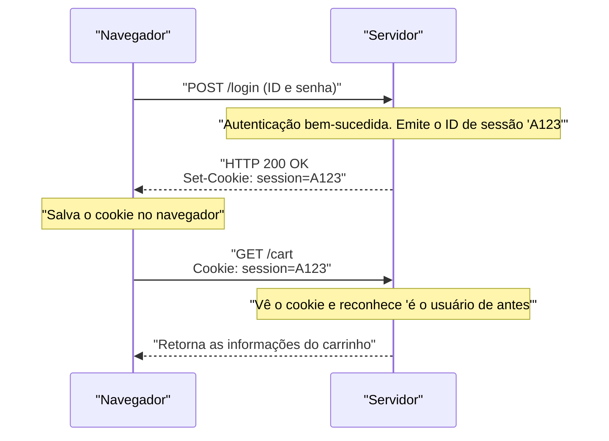

## 1. A Linguagem Comum da World Wide Web

A string `http://` ou `https://` que digitamos na barra de endereços do nosso navegador. Esta é uma declaração: "A partir de agora, usarei as regras do **HTTP (HyperText Transfer Protocol)** para me comunicar".

Em 1989, o Dr. Tim Berners-Lee, da Organização Europeia para a Pesquisa Nuclear (CERN), concebeu a "World Wide Web", um sistema que interligava artigos (textos) escritos por pesquisadores de todo o mundo como uma teia através de hiperlinks.
O HTTP foi criado como um protocolo de comunicação extremamente simples para, ao seguir esses links, buscar documentos HTML em servidores distantes.

Como o HTTP, que inicialmente era apenas um caminhão para o transporte de documentos de texto simples, evoluiu para a gigantesca infraestrutura que sustenta o streaming de vídeo do YouTube e as complexas aplicações web nos navegadores de hoje?

## 2. A Estrutura Básica do HTTP e o Conceito "Stateless"

O modelo de comunicação do HTTP é incrivelmente simples.
"O cliente (navegador) faz um pedido (request) e o servidor devolve uma resposta (response)"
Ele é formado apenas por essa simples troca de ida e volta.

### O Conteúdo do Request e do Response
O conteúdo da comunicação HTTP é baseado em texto legível para humanos (※até o HTTP/1.1).

**Exemplo de request do cliente:**
```http
GET /index.html HTTP/1.1
Host: kenji.blog
User-Agent: Mozilla/5.0
```
(Tradução: "Servidor kenji.blog, por favor, me dê o arquivo index.html. Eu sou um navegador da família Mozilla")

**Exemplo de response do servidor:**
```http
HTTP/1.1 200 OK
Content-Type: text/html
Content-Length: 1024

<html><body>Olá!</body></html>
```
(Tradução: "Request bem-sucedido (200 OK). O conteúdo é HTML e o tamanho é de 1024 bytes. Aqui está!")

### "Stateless" (Sem Estado): A Arma Mais Poderosa
A filosofia de design mais importante do HTTP é ser "**Stateless (Sem Estado)**".
O servidor não lembra de nenhuma interação de comunicação passada (estado = state). O primeiro request e o centésimo request são sempre processados pelo servidor como requests independentes de "prazer em conhecê-lo".

A falta de memória pode parecer um inconveniente, mas, na verdade, esse foi o principal motivo pelo qual a Web pôde crescer em escala global. Como o servidor não consome memória para lembrar "com quem e até onde conversei", ele não sobrecarrega facilmente, mesmo se receber milhões de acessos simultâneos, o que tornou muito fácil expandir (scale out) o número de servidores.

## 3. A Invenção dos Cookies: A Magia de Ter Memória

No entanto, à medida que a Web evoluiu de um mero "sistema de visualização de artigos" para "sites de compras online", ela esbarrou na parede do stateless.
Ao navegar pelas páginas "adicionar produto ao carrinho" → "ir para o caixa", o servidor esquece a interação anterior, então, no momento em que você chega ao caixa, o carrinho fica vazio.

Para resolver esse problema, "Cookies" foram inventados em 1994 por Lou Montulli, um engenheiro da Netscape.



O servidor entrega uma anotação ao navegador, dizendo "guarde este bilhete (Cookie)", e o navegador passa a anexar e enviar esse bilhete em todos os requests subsequentes. Com isso, tornou-se possível para as aplicações web terem uma memória pseudo-fictícia (sessão), como o "estado de login" ou o "conteúdo do carrinho", enquanto mantêm o design leve e sem estado do HTTP.

## 4. Histórico de Atualizações de Versão e Evolução

O HTTP passou por uma evolução drástica para atender às demandas de seu tempo.

### HTTP/1.1 (1997): Conexão Persistente
No HTTP/1.0 inicial, ao exibir uma página com 10 imagens, a conexão TCP era refeita todas as vezes: "conectar → obter imagem 1 → desconectar", "conectar → obter imagem 2 → desconectar". Como isso era muito lento, o HTTP/1.1 introduziu um mecanismo chamado "**Keep-Alive**", que permitia que uma conexão TCP fosse reutilizada depois de estabelecida, permitindo que vários arquivos fossem obtidos em sucessão.

### HTTP/2 (2015): Streams e Multiplexação
Os sites modernos exigem dezenas a centenas de arquivos para exibir uma única página, incluindo CSS, JavaScript e inúmeras imagens. No HTTP/1.1, os requests eram alinhados em "uma única fila" dentro da conexão e processados em ordem, então havia um problema chamado "Head-of-Line Blocking", em que se o arquivo pesado da frente ficasse travado, tudo atrás pararia.
O HTTP/2 mudou a comunicação de texto para "binária", permitindo que vários arquivos fossem trocados simultaneamente em **paralelo (multiplexação)** em uma única conexão, o que melhorou drasticamente a velocidade de exibição da Web.

### HTTP/3 (2022): Afastamento do TCP e Adoção do QUIC
No mais recente HTTP/3, o protocolo da camada de transporte, que é a base da Internet, foi completamente mudado de "TCP", que era usado há décadas, para "**QUIC**", que é baseado em UDP.
Isso o fez evoluir para o protocolo de comunicação definitivo otimizado para a era móvel, de modo que a comunicação não seja desconectada, mesmo quando um smartphone muda de Wi-Fi para uma rede móvel (4G/5G).

## 5. Conclusão

O HTTP, que começou com apenas algumas linhas de comando de texto (GET / HTTP/1.1), tornou-se agora a base da comunicação de API (REST e GraphQL), conectando microsserviços e se tornando o sangue que move todo o software do mundo.

Sua história ilustra o triunfo da bela arquitetura idealizada por Tim Berners-Lee: "simples, implementável por qualquer um e sem estado".
Não importa quão complexa a tecnologia da Web se torne, o protocolo HTTP, resistente e robusto, sempre fluirá no seu âmago.
