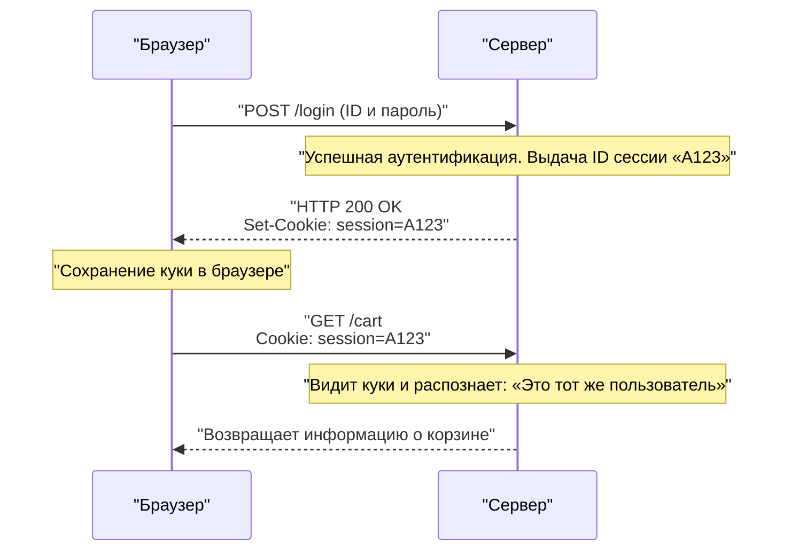

## 1. Общий язык World Wide Web

Строка `http://` или `https://`, которую мы вводим в адресную строку браузера. Это заявление: «Сейчас я буду осуществлять связь по правилам **HTTP (HyperText Transfer Protocol)**».

В 1989 году доктор Тим Бернерс-Ли из Европейской организации по ядерным исследованиям (CERN) придумал систему «World Wide Web», которая с помощью гиперссылок связала в единую сеть документы (тексты), написанные исследователями со всего мира.
HTTP был создан как чрезвычайно простой протокол связи для перехода по этим ссылкам и извлечения HTML-документов с удаленных серверов.

Как же HTTP, который изначально был просто средством доставки простых текстовых документов, превратился в гигантскую инфраструктуру, поддерживающую современный потоковый видеоконтент YouTube и сложные веб-приложения в браузерах?

## 2. Базовая структура HTTP и концепция «Без сохранения состояния» (Stateless)

Модель связи HTTP удивительно проста.
«Клиент (браузер) отправляет запрос (request), а сервер возвращает ответ (response)»
Она состоит только из одного этого цикла приема и передачи.

### Содержимое запроса и ответа
Содержимое связи HTTP создано на текстовой основе, которую может прочитать человек (※ до версии HTTP/1.1 включительно).

**Пример запроса от клиента:**
```http
GET /index.html HTTP/1.1
Host: kenji.blog
User-Agent: Mozilla/5.0
```
(Перевод: «Сервер kenji.blog, пожалуйста, предоставьте файл index.html. Я браузер семейства Mozilla»)

**Пример ответа от сервера:**
```http
HTTP/1.1 200 OK
Content-Type: text/html
Content-Length: 1024

<html><body>Привет!</body></html>
```
(Перевод: «Запрос успешен (200 OK). Содержимое в формате HTML, размер 1024 байта. Пожалуйста!»)

### Без сохранения состояния (Stateless) как самое мощное оружие
Важнейшей концепцией архитектуры HTTP является то, что он работает «**без сохранения состояния (Stateless)**».
Сервер совершенно не запоминает предыдущие обмены данными (состояние = state). И первый запрос, и сотый запрос обрабатываются сервером как всегда независимый запрос «приятно познакомиться».

Отсутствие памяти может показаться неудобным, но на самом деле именно это является главной причиной того, что Web смог вырасти до мировых масштабов. Поскольку сервер не расходует память на то, чтобы запоминать, «с кем и до какого момента он разговаривал», он не перегружается даже при миллионах одновременных обращений, а также было очень легко увеличить количество серверов (масштабировать вширь - scale out).

## 3. Изобретение файлов Cookie: Магия, дарующая память

Однако, когда Web эволюционировал от простой «системы просмотра статей» к «сайтам онлайн-покупок», он столкнулся с барьером отсутствия сохранения состояния.
При переходе на страницы «Добавить товар в корзину» → «Перейти к кассе», поскольку сервер забывает предыдущий обмен, в тот момент, когда вы добираетесь до кассы, ваша корзина оказывается пустой.

Чтобы решить эту проблему, в 1994 году Лу Монтулли, инженер компании Netscape, изобрел «**Cookie (куки)**».



Сервер передает браузеру эту записку (Cookie) со словами: «Держи эту записку у себя», и с тех пор браузер прикрепляет и отправляет эту записку при каждом следующем запросе. Это позволило сохранить легкую архитектуру HTTP без сохранения состояния и одновременно предоставить веб-приложениям возможность иметь псевдо-память (сессию), такую как «статус входа в систему» или «содержимое корзины».

## 4. История обновлений и эволюции

HTTP претерпел радикальную эволюцию в соответствии с требованиями времени.

### HTTP/1.1 (1997 год): Постоянные соединения
В раннем HTTP/1.0, при отображении страницы с 10 изображениями, каждый раз происходило повторное подключение TCP: «подключение → получение изображения 1 → отключение», «подключение → получение изображения 2 → отключение». Поскольку это было слишком медленно, в HTTP/1.1 был внедрен механизм «**Keep-Alive**», который позволил повторно использовать однажды установленное TCP-соединение для непрерывного получения нескольких файлов.

### HTTP/2 (2015 год): Потоки и мультиплексирование
Современные веб-сайты запрашивают десятки и сотни файлов, таких как CSS, JavaScript и бесчисленные изображения, для отображения одной страницы. Поскольку в HTTP/1.1 запросы выстраивались в «одну линию» внутри соединения и обрабатывались по очереди, возникала проблема «Head-of-Line Blocking», когда при задержке тяжелого файла в начале, все остальные позади полностью останавливались.
В HTTP/2 коммуникация была изменена с текстовой на «бинарную», и несколько файлов стало возможно обрабатывать одновременно **параллельно (мультиплексирование)** внутри одного соединения, что резко повысило скорость отображения веб-страниц.

### HTTP/3 (2022 год): Отказ от TCP и внедрение QUIC
В новейшем HTTP/3 протокол транспортного уровня, являющийся фундаментом Интернета, был полностью переведен с «TCP», который использовался десятилетиями, на «**QUIC**», основанный на UDP.
В результате он превратился в идеальный протокол связи, оптимизированный для мобильной эры, например, соединение не обрывается даже при переключении смартфона с Wi-Fi на мобильную сеть (4G/5G).

## 5. Заключение

HTTP, начавшийся всего с нескольких строк текстовых команд (GET / HTTP/1.1), теперь стал основой для связи API (REST и GraphQL), связывает микросервисы и стал кровью, обеспечивающей работу любого программного обеспечения в мире.

Его история демонстрирует триумф прекрасной архитектуры, предложенной Тимом Бернерсом-Ли: «простой, каждый может реализовать и не имеет состояния».
Какими бы сложными ни становились веб-технологии, в их основе всегда непрерывно течет этот простой и надежный протокол HTTP.
