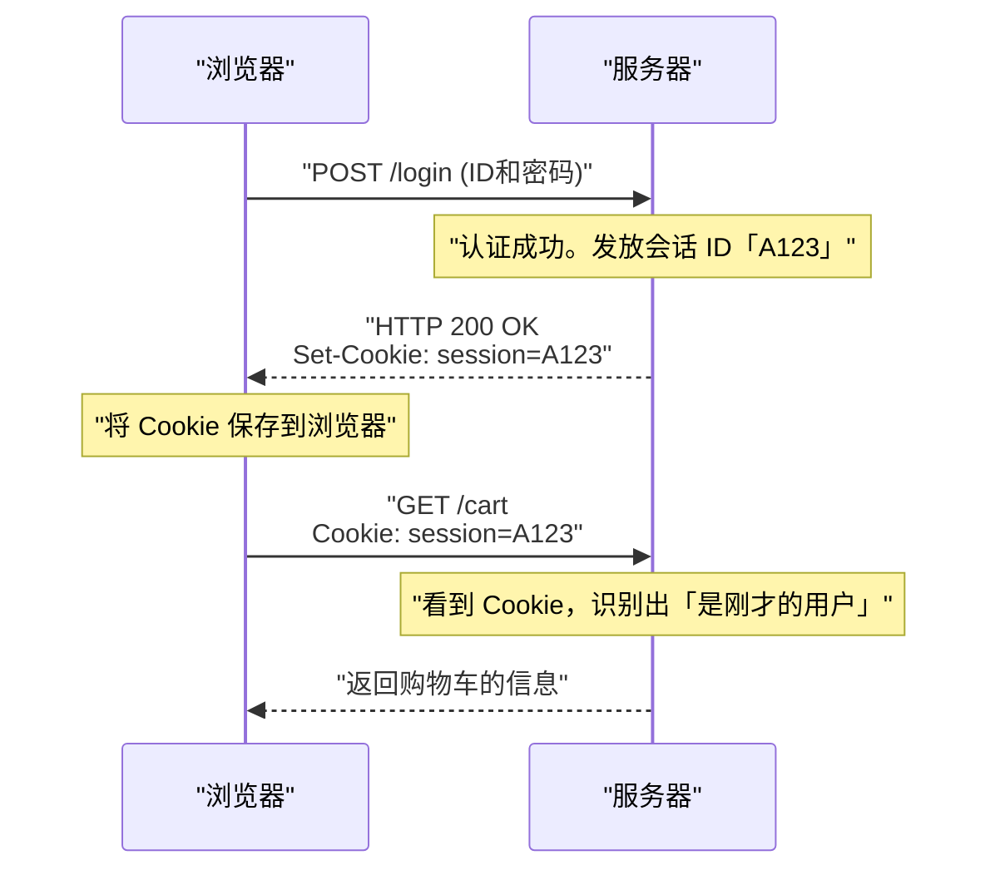

## 1. World Wide Web 的通用语言

我们在浏览器地址栏中输入的 `http://` 或 `https://` 字符串。这是一种声明：“接下来我们将使用 **HTTP (HyperText Transfer Protocol)** 这个规则来进行通信”。

1989 年，欧洲核子研究中心 (CERN) 的蒂姆·伯纳斯-李 (Tim Berners-Lee) 博士构思了“World Wide Web”，这是一个通过超链接将世界各地研究人员撰写的论文（文本）像网一样连接起来的系统。
顺着这些链接，为了从远端的服务器拉取 HTML 文档，创造出了一种极其简单的通信规范，这就是 HTTP。

起初只是用于运送普通文本文档的 HTTP，是如何演变成支撑现代 YouTube 视频流和浏览器上复杂 Web 应用程序的巨大基础设施的呢？

## 2. HTTP 的基本结构与“无状态”的思想

HTTP 的通信模型惊人地简单。
“客户端（浏览器）发出请求（Request），服务器返回响应（Response）”
仅仅依靠这一来一回的抛接球游戏就构成了。

### 请求与响应的内容
HTTP 的通信内容是基于人类可读的文本构建的（※仅限 HTTP/1.1 及以前版本）。

**来自客户端的请求示例：**
```http
GET /index.html HTTP/1.1
Host: kenji.blog
User-Agent: Mozilla/5.0
```
（译：“kenji.blog 服务器，请给我 index.html 这个文件。我是 Mozilla 核心的浏览器。”）

**来自服务器的响应示例：**
```http
HTTP/1.1 200 OK
Content-Type: text/html
Content-Length: 1024

<html><body>你好！</body></html>
```
（译：“请求成功（200 OK）。内容是 HTML，大小是 1024 字节。请查收！”）

### 无状态（Stateless）——最强的武器
HTTP 最重要的设计思想是“ **无状态（Stateless）** ”。
服务器绝对不会记住过去的通信交互（状态＝State）。不论是第 1 次请求，还是第 100 次请求，对服务器而言总是作为“初次见面”的独立请求来处理。

没有记忆力似乎很不方便，但这恰恰是 Web 能够扩展到全球规模的最大原因。因为服务器不会消耗内存来记住“和谁对话到了哪一步”，所以即使同时有数百万次访问涌入也不容易崩溃，而且增加多台服务器（横向扩展）变得非常简单。

## 3. Cookie 的发明：赋予记忆的魔法

然而，当 Web 从单纯的“论文阅览系统”进化为“在线购物网站”时，就撞上了无状态的墙壁。
在进行“将商品加入购物车”→“前往结账”的页面跳转时，因为服务器会忘记刚才的交互，所以在到达结账页面的瞬间，购物车就会变空。

为了解决这个问题，Netscape 公司的工程师卢·蒙特利 (Lou Montulli) 在 1994 年发明了“ **Cookie** ”。



服务器会交给浏览器说“请把这张纸条（Cookie）拿好”，从此浏览器每次发送请求时都会贴上那张纸条。通过这种方式，在维持 HTTP 无状态这一轻量级设计的同时，使得 Web 应用程序能够拥有“登录状态”或“购物车内容”等伪记忆（会话）。

## 4. 版本升级的历史与演进

为了适应时代的需求，HTTP 经历了戏剧性的演进。

### HTTP/1.1 (1997 年)：持久连接
在早期的 HTTP/1.0 中，当显示包含 10 张图片的页面时，会重复“连接→获取图片1→断开”、“连接→获取图片2→断开”，每次都要重新建立 TCP 连接。因为这样太慢了，所以在 HTTP/1.1 中引入了“ **Keep-Alive** ”机制，能够复用已经建立的 TCP 连接，连续获取多个文件。

### HTTP/2 (2015 年)：流与多路复用
现代的 Web 网站为了显示一个页面，需要请求 CSS、JavaScript、无数图片等几十到几百个文件。在 HTTP/1.1 中，请求在连接中“排成一列”依次处理，所以存在前面的大型文件阻塞会导致后面所有请求都停滞的“队头阻塞（Head-of-Line Blocking）”问题。
HTTP/2 将通信从文本改为了“二进制”，并允许在一个连接中 **并行（多路复用）** 地同时交互多个文件，使得 Web 的显示速度得到了极大的提升。

### HTTP/3 (2022 年)：摆脱 TCP，采用 QUIC
而在最新的 HTTP/3 中，互联网基础的传输层协议从使用了数十年的“TCP”，彻底切换成了基于 UDP 的“ **QUIC** ”。
由此一来，即使智能手机从 Wi-Fi 切换到移动网络（4G/5G），通信也不会断开，它已经进化成了针对移动时代优化的终极通信协议。

## 5. 总结

仅由几行文本命令（GET / HTTP/1.1）起步的 HTTP，如今已成为 API 通信（REST 和 GraphQL）的基础，连接着各个微服务，成为了驱动世界上所有软件的血液。

它的历史证明了蒂姆·伯纳斯-李所提出的“简单、任何人都能实现、无状态”这一优美架构的胜利。
无论 Web 技术变得多么复杂，其底层始终流淌着这坚实刚健的 HTTP 协议。
