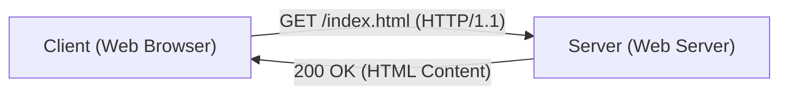

# HTTP技術解說

Hypertext Transfer Protocol (HTTP) 是作為Web基礎的通訊協定。

## 無狀態設計

HTTP是無狀態（Stateless）協定。每個請求都會被獨立處理。

## 效能考察

在HTTP/2與HTTP/3中，透過多工（Multiplexing）減輕了來回通訊延遲（RTT）的影響。頁面的載入時間可以使用以下模型表示：

$$ T_{load} = T_{DNS} + T_{TCP} + T_{TLS} + \sum_{i=1}^{N} \left( \frac{S_i}{B} + RTT \right) $$

透過多工，後半部的 $\sum$ 部分可以被平行處理，從而大幅縮短時間。
