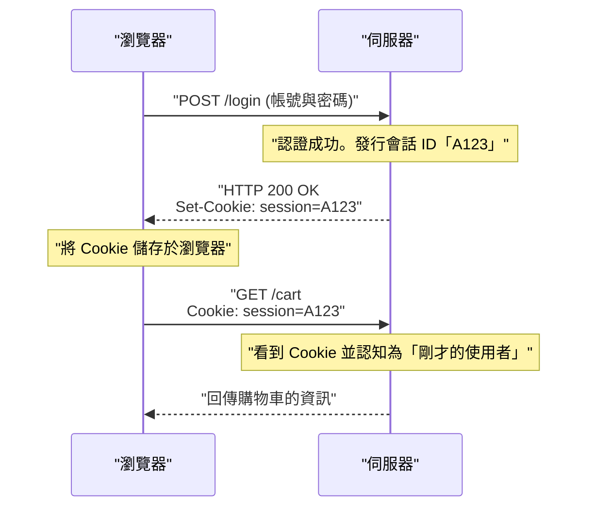

## 1. World Wide Web 的共通語言

我們在瀏覽器網址列輸入的 `http://` 或 `https://` 字串。這是一種宣告：「接下來將使用 **HTTP (HyperText Transfer Protocol)** 這個規則來進行通訊喔」。

1989 年，歐洲核子研究組織 (CERN) 的提姆·柏內茲-李博士，發明了將世界各地研究人員所撰寫的論文（文字），像網目一樣用超連結串接起來的系統「World Wide Web」。
為了循著這些連結，從遠端的伺服器將 HTML 文件拉取過來，HTTP 就作為一種極為單純的通訊協定而誕生了。

當初只是用來運送單純文字文件的卡車，HTTP 是如何演進成支撐現代 YouTube 影片串流，以及瀏覽器上複雜 Web 應用程式的巨大基礎設施的呢？

## 2. HTTP 的基本結構與「無狀態」的思想

HTTP 的通訊模型，令人驚訝地單純。
「客戶端（瀏覽器）發出請求（Request），伺服器回傳回應（Response）」
僅靠這 1 次往返的傳接球就能成立。

### 請求與回應的內容
HTTP 的通訊內容，是以人類可讀的文字為基礎建立的（※直到 HTTP/1.1 為止）。

**來自客戶端的請求範例：**
```http
GET /index.html HTTP/1.1
Host: kenji.blog
User-Agent: Mozilla/5.0
```
（譯：「kenji.blog 這個伺服器，請給我 index.html 這個檔案。我是 Mozilla 系的瀏覽器」）

**來自伺服器的回應範例：**
```http
HTTP/1.1 200 OK
Content-Type: text/html
Content-Length: 1024

<html><body>你好！</body></html>
```
（譯：「請求成功（200 OK）。內容是 HTML，大小是 1024 位元組。請用！」）

### 無狀態（不持有狀態）這個最強的武器
HTTP 最重要的設計思想，就是它是「 **無狀態（Stateless）** 」。
伺服器完全不會記憶過去的通訊過程（狀態 = State）。無論是第 1 次請求，還是第 100 次請求，對伺服器來說都會被當作「初次見面」的獨立請求來處理。

沒有記憶力雖然看起來很不方便，但實際上這正是 Web 能夠發展到世界級規模的最大理由。因為伺服器不會消耗記憶體去記住「和誰對話到哪裡」，所以即使同時有數百萬次存取湧入也不容易崩潰，而且要增加伺服器數量（Scale Out）也非常簡單。

## 3. Cookie（餅乾）的發明：賦予記憶的魔法

然而，當 Web 從單純的「論文閱覽系統」演進為「線上購物網站」時，就撞上了無狀態的牆壁。
在進行「將商品放入購物車」→「前往結帳」的頁面跳轉時，因為伺服器會忘記剛才的互動，所以抵達結帳頁面的瞬間購物車就會變空。

為了解決這個問題，1994 年 Netscape 公司的工程師，盧·蒙特利（Lou Montulli）發明了「 **Cookie（餅乾）** 」。



伺服器將「請帶著這個備忘錄（Cookie）」交給瀏覽器，瀏覽器在接下來的每次請求中，都會貼上這個備忘錄傳送出去。藉由這個機制，在維持 HTTP 無狀態這個輕量設計的同時，也讓 Web 應用程式能夠擁有「登入狀態」或「購物車內容」等擬似記憶（會話）的功能了。

## 4. 版本更新的歷史與演進

HTTP 配合時代的要求，實現了劇烈的演進。

### HTTP/1.1 (1997 年)：持續性連線
在早期的 HTTP/1.0 中，要顯示一個有 10 張圖片的頁面時，會重複進行「連線 → 取得圖片 1 → 斷線」「連線 → 取得圖片 2 → 斷線」，每次都重新建立 TCP 連線。因為這樣實在太慢了，所以在 HTTP/1.1 中導入了「 **Keep-Alive** 」的機制，能夠重複使用建立好的 TCP 連線，連續取得多個檔案。

### HTTP/2 (2015 年)：串流與多工
現代的 Web 網站為了顯示單一頁面，會要求 CSS、JavaScript、無數的圖片等數十到數百個檔案。HTTP/1.1 因為在連線中會將請求排成「一列」依序處理，所以如果前面遇到龐大的檔案卡住，後面的全部都會停擺，這被稱為「Head-of-Line Blocking」問題。
HTTP/2 則將通訊從文字改為「二進位」，在單一連線中可以 **平行（多工）** 地同時交換多個檔案，讓 Web 的顯示速度有了飛躍性的提升。

### HTTP/3 (2022 年)：擺脫 TCP 並採用 QUIC
而在最新的 HTTP/3 中，作為網際網路基礎的傳輸層協定，從使用了幾十年的「TCP」，完全切換為以 UDP 為基礎的「 **QUIC** 」。
藉由這個改變，即使智慧型手機從 Wi-Fi 切換到行動網路（4G/5G），通訊也不會中斷，演進成為針對行動時代最佳化的終極通訊協定。

## 5. 總結

從僅僅數行的文字指令（GET / HTTP/1.1）開始的 HTTP，現在已成為 API 通訊（REST 或 GraphQL）的基礎，串接微服務，化作驅動全世界所有軟體的血液。

這段歷史展示了提姆·柏內茲-李所提出的「單純、任何人都能實作、不持有狀態」這個優美架構的勝利。
無論 Web 的技術變得多麼複雜，在其根基之中，始終流淌著這個質樸剛健的 HTTP 協定。
