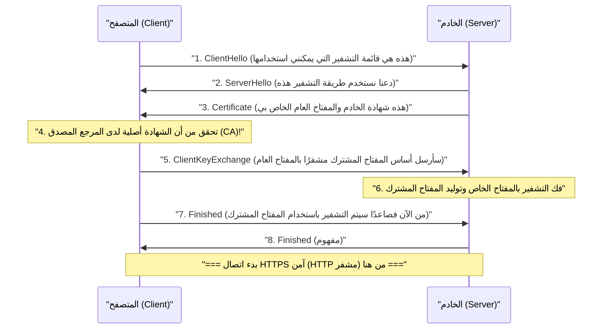

## 1. الإنترنت عبارة عن "بطاقة بريدية"

بروتوكول الاتصال للويب "HTTP" الذي نستخدمه عادةً مفيد للغاية، ولكنه يعاني من نقطة ضعف قاتلة من الناحية الأمنية. وهي أن "**جميع محتويات الاتصال يتم إرسالها واستقبالها كنص عادي (نص مجرد غير مشفر)**".

بيانات HTTP التي تتدفق عبر كابلات الشبكة وموجات Wi-Fi يمكن بسهولة اختلاس النظر إلى محتوياتها من قبل أجهزة التوجيه (الراوتر) ومزودي الخدمة في المنتصف، أو من قبل قراصنة خبيثين (متشممي الحزم).

إذا شبهنا ذلك، فهو يشبه كتابة رقم بطاقة الائتمان أو كلمة المرور على "**بطاقة بريدية مكشوفة الظهر بالكامل**" ووضعها في صندوق البريد.

التقنية التي تحل هذا الموقف المخيف وترسل البطاقة البريدية داخل "خزنة متينة (مغلف) لا يمكن فتحها أبدًا"، هي "**HTTPS (HTTP Secure)**" والتي أضافت حرف "S" الذي يرمز للأمان (Secure) إلى HTTP.

## 2. SSL/TLS: الدرع الذي يحميك من ثلاثة تهديدات

لم يقم HTTPS بإعادة كتابة بروتوكول HTTP نفسه. بل إنه يدرج طبقة بروتوكول التشفير **SSL/TLS** "قبل" إجراء اتصال HTTP، ويبني نفقًا آمنًا هناك، ثم يتدفق نص HTTP داخله، هذا هو الهيكل.

تم تطوير SSL (Secure Sockets Layer) في عام 1994 بواسطة شركة Netscape، وتم توحيده لاحقًا وتغيير اسمه إلى TLS (Transport Layer Security)، لكنه لا يزال يُسمى تقليديًا "SSL/TLS" حتى اليوم.

يحمينا SSL/TLS من ثلاثة تهديدات ضخمة على الإنترنت.
1. **التنصت (Eavesdropping)**: يمنع رؤية محتويات الاتصال (التشفير)
2. **التلاعب (Tampering)**: يمنع تعديل البيانات في المنتصف (مصادقة الرسائل)
3. **الانتحال (Spoofing)**: يثبت أن الطرف الآخر في الاتصال ليس موقعًا مزيفًا (الشهادة الرقمية)

## 3. معضلة التشفير: المفتاح المشترك والمفتاح العام

لتشفير الاتصال، نحتاج إلى "مفتاح". ولكن تظهر هنا معضلة كبيرة.

طريقة التشفير الأسرع والأكثر كفاءة هي "**تشفير المفتاح المشترك** (مثل: AES)". في هذه الطريقة، يمتلك المرسل والمستقبل "نفس المفتاح الواحد" للقيام بالتشفير وفك التشفير (نفس فكرة مفتاح المنزل).

ومع ذلك، عند التسوق لأول مرة على موقع Amazon عبر الإنترنت، كيف يمكنك أنت وAmazon مشاركة هذا "المفتاح المشترك" بأمان؟ إذا قمت بإرسال المفتاح نفسه عبر الإنترنت، فسيتم سرقته أيضًا من قبل القراصنة (مشكلة توزيع المفاتيح).

حلت تقنية "**تشفير المفتاح العام** (مثل: RSA، تشفير المنحنى الإهليلجي)" هذه المشكلة ببراعة بقوة الرياضيات.

في تشفير المفتاح العام، يتم إنشاء زوج من المفاتيح: "قفل (مفتاح عام)" يمكن توزيعه على أي شخص، و"مفتاح للفتح (مفتاح خاص)" تمتلكه أنت فقط.

تقوم Amazon بنشر "مفتاحها العام" في جميع أنحاء العالم. يستخدم متصفحك المفتاح العام (القفل) الخاص بـ Amazon لقفل الصندوق الذي يحتوي على "المفتاح المشترك" للاستخدام مرة واحدة، ويرسله إلى Amazon.

هذا الصندوق لا يمكن فتحه أبدًا إلا من خلال "المفتاح الخاص" الذي تمتلكه Amazon فقط في جميع أنحاء العالم. حتى لو سرق القراصنة الصندوق في الطريق، فلا معنى لذلك لأنه لا يوجد مفتاح لفتحه.

## 4. خلف كواليس اتصال HTTPS: مصافحة SSL/TLS

في اللحظة التي تصل فيها إلى `https://...` باستخدام متصفحك، تجري مفاوضات متقدمة تُعرف باسم "**مصافحة SSL/TLS**" بين المتصفح والخادم في الخلفية في غضون أجزاء قليلة من الثانية.

نظرًا لأن تشفير المفتاح العام يتطلب معالجة حسابية ثقيلة للغاية، فإن إجراء جميع الاتصالات باستخدام المفتاح العام سيؤدي إلى تعطل الخادم.

لذلك، يعتمد HTTPS على طريقة هجينة ذكية للغاية، وهي "**استخدام تشفير المفتاح العام فقط لتبادل المفاتيح بأمان، واستخدام تشفير المفتاح المشترك السريع لاتصالات البيانات الضخمة الفعلية**".

## 5. البنية التحتية للمفاتيح العامة (PKI) والمرجع المصدق (CA)

هنا تتبقى المشكلة الأخيرة، وهي "الانتحال".

ماذا سيحدث لو قام قرصان خبيث بإنشاء موقع مزيف مطابق تمامًا لموقع Amazon، وأرسل لك مفتاحه العام؟ سيقوم متصفحك بإنشاء اتصال مشفر وآمن مع الموقع المزيف، وسيقوم بتشفير كلمة المرور وتوصيلها "بأمان" إلى القرصان.

ما يمنع ذلك هو آلية **PKI (Public Key Infrastructure: البنية التحتية للمفاتيح العامة)** و**CA (Certificate Authority: المرجع المصدق)**.

يوجد في العالم "جهات خارجية (مراجع مصدقة)" موثوقة من جميع أنحاء العالم، مثل DigiCert و GlobalSign و Let's Encrypt. تخضع الشركات مثل Amazon لفحص صارم من قبل هذه المراجع المصدقة، وتحصل على "شهادة خادم" تحمل توقيعًا رقميًا يفيد بأن "هذا المفتاح العام يخص Amazon الحقيقية دون أدنى شك".

داخل أجهزة الكمبيوتر والهواتف الذكية الخاصة بنا (في نظام التشغيل والمتصفح)، توجد "شهادات الجذر" لهذه المراجع المصدقة الموثوقة مثبتة مسبقًا.

عندما يتلقى المتصفح شهادة من الخادم، فإنه يقارنها بشهادة الجذر التي يمتلكها، وفقط عندما يتأكد من أنها "شهادة أصلية موقعة بالفعل من قبل مرجع مصدق CA موثوق"، فإنه يعرض "رمز القفل الآمن" في شريط العناوين.

## 6. الخلاصة: نحو عصر التشفير الدائم (Always-on SSL)

في الماضي، كان HTTPS شيئًا خاصًا يُستخدم فقط في صفحات قليلة جدًا، مثل شاشات الدفع حيث يتم إدخال أرقام بطاقات الائتمان. وذلك لأنه كان يُعتقد أن عملية التشفير تضع عبئًا على الخادم.

ومع ذلك، مع تحسن أداء وحدة المعالجة المركزية (CPU) والتطور التكنولوجي (ظهور HTTP/2 و HTTP/3)، وقبل كل شيء بسبب زيادة المتطلبات الاجتماعية لحماية الخصوصية، أصبح اليوم "تحويل جميع صفحات الويب إلى HTTPS (التشفير الدائم)" معيارًا عالميًا بقيادة شركات مثل Google. حاليًا، يتم تشفير أكثر من 90% من حركة مرور الويب على الإنترنت باستخدام HTTPS.

يتشكل HTTPS من خلال تعاون خوارزميات رياضية معقدة غير مرئية وشبكة ثقة عالمية (PKI). وخلف شاشة الهاتف الذكي التي نضغط عليها دون تفكير، هناك جدار تشفير دفاعي قوي صاغته أفضل العقول في العالم، يواصل حماية بياناتنا بصمت اليوم أيضًا.
