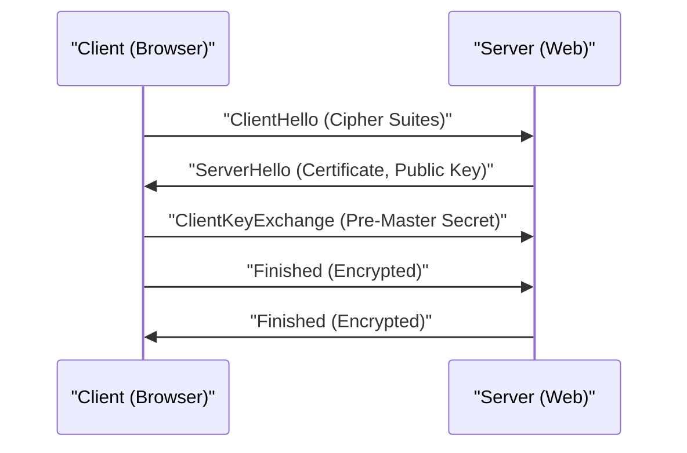

# شرح تقني لـ HTTPS

HTTPS (HTTP Secure) هي تقنية تستخدم بروتوكولات SSL/TLS لتشفير اتصالات HTTP.

## آلية المصافحة

يتم الجمع بين تشفير المفتاح العام وتشفير المفتاح المتماثل لإنشاء قناة اتصال آمنة.

## الأساس الرياضي لقوة التشفير

يعتمد أمان تشفير RSA على صعوبة تحليل الأعداد المركبة الضخمة إلى عواملها الأولية. بالنسبة للمفتاح العام $(e, n)$ والمفتاح الخاص $d$، فإن العلاقة بين النص العادي $M$ والنص المشفر $C$ هي كما يلي:

$$ C \equiv M^e \pmod{n} $$
$$ M \equiv C^d \pmod{n} $$

## جزء التحقق التقني الإضافي 1
في هذا القسم، نتحقق من المزيد من التفاصيل التقنية حول P2P ومختلف بروتوكولات الشبكة. نتناول مجموعة واسعة من المواضيع، مثل إدارة المعاملات في الأنظمة الموزعة، وخوارزميات التعويض عند فقدان الحزم في UDP، وتقنيات تحسين رؤوس HTTP.
بالإضافة إلى ذلك، من خلال تطبيق أساليب التصور باستخدام Mermaid، يصبح من الممكن فهم هذه الهياكل الشبكية المعقدة بشكل بديهي.
التقييم الكمي باستخدام الصيغ الرياضية مهم أيضًا. فيما يلي جزء من نموذج الاتصال.
$$ E = mc^2 + \sum_{i=1}^{n} P_i $$
تتطور دائمًا الأساليب المستخدمة لتقليل تأخير الاتصال بين عقد الشبكة إلى الحد الأدنى. خاصة في شبكات الجيل القادم، يمثل تقليل النفقات الإضافية للبروتوكول تحديًا. يشمل ذلك تحسين جداول توجيه IPv6 وتقنيات استئناف جلسات TLS في HTTPS.
من خلال هذه التحققات التقنية المتقدمة، يمكننا بناء بنية شبكة أكثر قوة وقابلية للتوسع.

## جزء التحقق التقني الإضافي 2
في هذا القسم، نتحقق من المزيد من التفاصيل التقنية حول P2P ومختلف بروتوكولات الشبكة. نتناول مجموعة واسعة من المواضيع، مثل إدارة المعاملات في الأنظمة الموزعة، وخوارزميات التعويض عند فقدان الحزم في UDP، وتقنيات تحسين رؤوس HTTP.
بالإضافة إلى ذلك، من خلال تطبيق أساليب التصور باستخدام Mermaid، يصبح من الممكن فهم هذه الهياكل الشبكية المعقدة بشكل بديهي.
التقييم الكمي باستخدام الصيغ الرياضية مهم أيضًا. فيما يلي جزء من نموذج الاتصال.
$$ E = mc^2 + \sum_{i=1}^{n} P_i $$
تتطور دائمًا الأساليب المستخدمة لتقليل تأخير الاتصال بين عقد الشبكة إلى الحد الأدنى. خاصة في شبكات الجيل القادم، يمثل تقليل النفقات الإضافية للبروتوكول تحديًا. يشمل ذلك تحسين جداول توجيه IPv6 وتقنيات استئناف جلسات TLS في HTTPS.
من خلال هذه التحققات التقنية المتقدمة، يمكننا بناء بنية شبكة أكثر قوة وقابلية للتوسع.

## جزء التحقق التقني الإضافي 3
في هذا القسم، نتحقق من المزيد من التفاصيل التقنية حول P2P ومختلف بروتوكولات الشبكة. نتناول مجموعة واسعة من المواضيع، مثل إدارة المعاملات في الأنظمة الموزعة، وخوارزميات التعويض عند فقدان الحزم في UDP، وتقنيات تحسين رؤوس HTTP.
بالإضافة إلى ذلك، من خلال تطبيق أساليب التصور باستخدام Mermaid، يصبح من الممكن فهم هذه الهياكل الشبكية المعقدة بشكل بديهي.
التقييم الكمي باستخدام الصيغ الرياضية مهم أيضًا. فيما يلي جزء من نموذج الاتصال.
$$ E = mc^2 + \sum_{i=1}^{n} P_i $$
تتطور دائمًا الأساليب المستخدمة لتقليل تأخير الاتصال بين عقد الشبكة إلى الحد الأدنى. خاصة في شبكات الجيل القادم، يمثل تقليل النفقات الإضافية للبروتوكول تحديًا. يشمل ذلك تحسين جداول توجيه IPv6 وتقنيات استئناف جلسات TLS في HTTPS.
من خلال هذه التحققات التقنية المتقدمة، يمكننا بناء بنية شبكة أكثر قوة وقابلية للتوسع.

## جزء التحقق التقني الإضافي 4
في هذا القسم، نتحقق من المزيد من التفاصيل التقنية حول P2P ومختلف بروتوكولات الشبكة. نتناول مجموعة واسعة من المواضيع، مثل إدارة المعاملات في الأنظمة الموزعة، وخوارزميات التعويض عند فقدان الحزم في UDP، وتقنيات تحسين رؤوس HTTP.
بالإضافة إلى ذلك، من خلال تطبيق أساليب التصور باستخدام Mermaid، يصبح من الممكن فهم هذه الهياكل الشبكية المعقدة بشكل بديهي.
التقييم الكمي باستخدام الصيغ الرياضية مهم أيضًا. فيما يلي جزء من نموذج الاتصال.
$$ E = mc^2 + \sum_{i=1}^{n} P_i $$
تتطور دائمًا الأساليب المستخدمة لتقليل تأخير الاتصال بين عقد الشبكة إلى الحد الأدنى. خاصة في شبكات الجيل القادم، يمثل تقليل النفقات الإضافية للبروتوكول تحديًا. يشمل ذلك تحسين جداول توجيه IPv6 وتقنيات استئناف جلسات TLS في HTTPS.
من خلال هذه التحققات التقنية المتقدمة، يمكننا بناء بنية شبكة أكثر قوة وقابلية للتوسع.

## جزء التحقق التقني الإضافي 5
في هذا القسم، نتحقق من المزيد من التفاصيل التقنية حول P2P ومختلف بروتوكولات الشبكة. نتناول مجموعة واسعة من المواضيع، مثل إدارة المعاملات في الأنظمة الموزعة، وخوارزميات التعويض عند فقدان الحزم في UDP، وتقنيات تحسين رؤوس HTTP.
بالإضافة إلى ذلك، من خلال تطبيق أساليب التصور باستخدام Mermaid، يصبح من الممكن فهم هذه الهياكل الشبكية المعقدة بشكل بديهي.
التقييم الكمي باستخدام الصيغ الرياضية مهم أيضًا. فيما يلي جزء من نموذج الاتصال.
$$ E = mc^2 + \sum_{i=1}^{n} P_i $$
تتطور دائمًا الأساليب المستخدمة لتقليل تأخير الاتصال بين عقد الشبكة إلى الحد الأدنى. خاصة في شبكات الجيل القادم، يمثل تقليل النفقات الإضافية للبروتوكول تحديًا. يشمل ذلك تحسين جداول توجيه IPv6 وتقنيات استئناف جلسات TLS في HTTPS.
من خلال هذه التحققات التقنية المتقدمة، يمكننا بناء بنية شبكة أكثر قوة وقابلية للتوسع.

## جزء التحقق التقني الإضافي 6
في هذا القسم، نتحقق من المزيد من التفاصيل التقنية حول P2P ومختلف بروتوكولات الشبكة. نتناول مجموعة واسعة من المواضيع، مثل إدارة المعاملات في الأنظمة الموزعة، وخوارزميات التعويض عند فقدان الحزم في UDP، وتقنيات تحسين رؤوس HTTP.
بالإضافة إلى ذلك، من خلال تطبيق أساليب التصور باستخدام Mermaid، يصبح من الممكن فهم هذه الهياكل الشبكية المعقدة بشكل بديهي.
التقييم الكمي باستخدام الصيغ الرياضية مهم أيضًا. فيما يلي جزء من نموذج الاتصال.
$$ E = mc^2 + \sum_{i=1}^{n} P_i $$
تتطور دائمًا الأساليب المستخدمة لتقليل تأخير الاتصال بين عقد الشبكة إلى الحد الأدنى. خاصة في شبكات الجيل القادم، يمثل تقليل النفقات الإضافية للبروتوكول تحديًا. يشمل ذلك تحسين جداول توجيه IPv6 وتقنيات استئناف جلسات TLS في HTTPS.
من خلال هذه التحققات التقنية المتقدمة، يمكننا بناء بنية شبكة أكثر قوة وقابلية للتوسع.

## جزء التحقق التقني الإضافي 7
في هذا القسم، نتحقق من المزيد من التفاصيل التقنية حول P2P ومختلف بروتوكولات الشبكة. نتناول مجموعة واسعة من المواضيع، مثل إدارة المعاملات في الأنظمة الموزعة، وخوارزميات التعويض عند فقدان الحزم في UDP، وتقنيات تحسين رؤوس HTTP.
بالإضافة إلى ذلك، من خلال تطبيق أساليب التصور باستخدام Mermaid، يصبح من الممكن فهم هذه الهياكل الشبكية المعقدة بشكل بديهي.
التقييم الكمي باستخدام الصيغ الرياضية مهم أيضًا. فيما يلي جزء من نموذج الاتصال.
$$ E = mc^2 + \sum_{i=1}^{n} P_i $$
تتطور دائمًا الأساليب المستخدمة لتقليل تأخير الاتصال بين عقد الشبكة إلى الحد الأدنى. خاصة في شبكات الجيل القادم، يمثل تقليل النفقات الإضافية للبروتوكول تحديًا. يشمل ذلك تحسين جداول توجيه IPv6 وتقنيات استئناف جلسات TLS في HTTPS.
من خلال هذه التحققات التقنية المتقدمة، يمكننا بناء بنية شبكة أكثر قوة وقابلية للتوسع.

## جزء التحقق التقني الإضافي 8
في هذا القسم، نتحقق من المزيد من التفاصيل التقنية حول P2P ومختلف بروتوكولات الشبكة. نتناول مجموعة واسعة من المواضيع، مثل إدارة المعاملات في الأنظمة الموزعة، وخوارزميات التعويض عند فقدان الحزم في UDP، وتقنيات تحسين رؤوس HTTP.
بالإضافة إلى ذلك، من خلال تطبيق أساليب التصور باستخدام Mermaid، يصبح من الممكن فهم هذه الهياكل الشبكية المعقدة بشكل بديهي.
التقييم الكمي باستخدام الصيغ الرياضية مهم أيضًا. فيما يلي جزء من نموذج الاتصال.
$$ E = mc^2 + \sum_{i=1}^{n} P_i $$
تتطور دائمًا الأساليب المستخدمة لتقليل تأخير الاتصال بين عقد الشبكة إلى الحد الأدنى. خاصة في شبكات الجيل القادم، يمثل تقليل النفقات الإضافية للبروتوكول تحديًا. يشمل ذلك تحسين جداول توجيه IPv6 وتقنيات استئناف جلسات TLS في HTTPS.
من خلال هذه التحققات التقنية المتقدمة، يمكننا بناء بنية شبكة أكثر قوة وقابلية للتوسع.

## جزء التحقق التقني الإضافي 9
في هذا القسم، نتحقق من المزيد من التفاصيل التقنية حول P2P ومختلف بروتوكولات الشبكة. نتناول مجموعة واسعة من المواضيع، مثل إدارة المعاملات في الأنظمة الموزعة، وخوارزميات التعويض عند فقدان الحزم في UDP، وتقنيات تحسين رؤوس HTTP.
بالإضافة إلى ذلك، من خلال تطبيق أساليب التصور باستخدام Mermaid، يصبح من الممكن فهم هذه الهياكل الشبكية المعقدة بشكل بديهي.
التقييم الكمي باستخدام الصيغ الرياضية مهم أيضًا. فيما يلي جزء من نموذج الاتصال.
$$ E = mc^2 + \sum_{i=1}^{n} P_i $$
تتطور دائمًا الأساليب المستخدمة لتقليل تأخير الاتصال بين عقد الشبكة إلى الحد الأدنى. خاصة في شبكات الجيل القادم، يمثل تقليل النفقات الإضافية للبروتوكول تحديًا. يشمل ذلك تحسين جداول توجيه IPv6 وتقنيات استئناف جلسات TLS في HTTPS.
من خلال هذه التحققات التقنية المتقدمة، يمكننا بناء بنية شبكة أكثر قوة وقابلية للتوسع.

## جزء التحقق التقني الإضافي 10
في هذا القسم، نتحقق من المزيد من التفاصيل التقنية حول P2P ومختلف بروتوكولات الشبكة. نتناول مجموعة واسعة من المواضيع، مثل إدارة المعاملات في الأنظمة الموزعة، وخوارزميات التعويض عند فقدان الحزم في UDP، وتقنيات تحسين رؤوس HTTP.
بالإضافة إلى ذلك، من خلال تطبيق أساليب التصور باستخدام Mermaid، يصبح من الممكن فهم هذه الهياكل الشبكية المعقدة بشكل بديهي.
التقييم الكمي باستخدام الصيغ الرياضية مهم أيضًا. فيما يلي جزء من نموذج الاتصال.
$$ E = mc^2 + \sum_{i=1}^{n} P_i $$
تتطور دائمًا الأساليب المستخدمة لتقليل تأخير الاتصال بين عقد الشبكة إلى الحد الأدنى. خاصة في شبكات الجيل القادم، يمثل تقليل النفقات الإضافية للبروتوكول تحديًا. يشمل ذلك تحسين جداول توجيه IPv6 وتقنيات استئناف جلسات TLS في HTTPS.
من خلال هذه التحققات التقنية المتقدمة، يمكننا بناء بنية شبكة أكثر قوة وقابلية للتوسع.

## جزء التحقق التقني الإضافي 11
في هذا القسم، نتحقق من المزيد من التفاصيل التقنية حول P2P ومختلف بروتوكولات الشبكة. نتناول مجموعة واسعة من المواضيع، مثل إدارة المعاملات في الأنظمة الموزعة، وخوارزميات التعويض عند فقدان الحزم في UDP، وتقنيات تحسين رؤوس HTTP.
بالإضافة إلى ذلك، من خلال تطبيق أساليب التصور باستخدام Mermaid، يصبح من الممكن فهم هذه الهياكل الشبكية المعقدة بشكل بديهي.
التقييم الكمي باستخدام الصيغ الرياضية مهم أيضًا. فيما يلي جزء من نموذج الاتصال.
$$ E = mc^2 + \sum_{i=1}^{n} P_i $$
تتطور دائمًا الأساليب المستخدمة لتقليل تأخير الاتصال بين عقد الشبكة إلى الحد الأدنى. خاصة في شبكات الجيل القادم، يمثل تقليل النفقات الإضافية للبروتوكول تحديًا. يشمل ذلك تحسين جداول توجيه IPv6 وتقنيات استئناف جلسات TLS في HTTPS.
من خلال هذه التحققات التقنية المتقدمة، يمكننا بناء بنية شبكة أكثر قوة وقابلية للتوسع.

## جزء التحقق التقني الإضافي 12
في هذا القسم، نتحقق من المزيد من التفاصيل التقنية حول P2P ومختلف بروتوكولات الشبكة. نتناول مجموعة واسعة من المواضيع، مثل إدارة المعاملات في الأنظمة الموزعة، وخوارزميات التعويض عند فقدان الحزم في UDP، وتقنيات تحسين رؤوس HTTP.
بالإضافة إلى ذلك، من خلال تطبيق أساليب التصور باستخدام Mermaid، يصبح من الممكن فهم هذه الهياكل الشبكية المعقدة بشكل بديهي.
التقييم الكمي باستخدام الصيغ الرياضية مهم أيضًا. فيما يلي جزء من نموذج الاتصال.
$$ E = mc^2 + \sum_{i=1}^{n} P_i $$
تتطور دائمًا الأساليب المستخدمة لتقليل تأخير الاتصال بين عقد الشبكة إلى الحد الأدنى. خاصة في شبكات الجيل القادم، يمثل تقليل النفقات الإضافية للبروتوكول تحديًا. يشمل ذلك تحسين جداول توجيه IPv6 وتقنيات استئناف جلسات TLS في HTTPS.
من خلال هذه التحققات التقنية المتقدمة، يمكننا بناء بنية شبكة أكثر قوة وقابلية للتوسع.

## جزء التحقق التقني الإضافي 13
في هذا القسم، نتحقق من المزيد من التفاصيل التقنية حول P2P ومختلف بروتوكولات الشبكة. نتناول مجموعة واسعة من المواضيع، مثل إدارة المعاملات في الأنظمة الموزعة، وخوارزميات التعويض عند فقدان الحزم في UDP، وتقنيات تحسين رؤوس HTTP.
بالإضافة إلى ذلك، من خلال تطبيق أساليب التصور باستخدام Mermaid، يصبح من الممكن فهم هذه الهياكل الشبكية المعقدة بشكل بديهي.
التقييم الكمي باستخدام الصيغ الرياضية مهم أيضًا. فيما يلي جزء من نموذج الاتصال.
$$ E = mc^2 + \sum_{i=1}^{n} P_i $$
تتطور دائمًا الأساليب المستخدمة لتقليل تأخير الاتصال بين عقد الشبكة إلى الحد الأدنى. خاصة في شبكات الجيل القادم، يمثل تقليل النفقات الإضافية للبروتوكول تحديًا. يشمل ذلك تحسين جداول توجيه IPv6 وتقنيات استئناف جلسات TLS في HTTPS.
من خلال هذه التحققات التقنية المتقدمة، يمكننا بناء بنية شبكة أكثر قوة وقابلية للتوسع.

## جزء التحقق التقني الإضافي 14
في هذا القسم، نتحقق من المزيد من التفاصيل التقنية حول P2P ومختلف بروتوكولات الشبكة. نتناول مجموعة واسعة من المواضيع، مثل إدارة المعاملات في الأنظمة الموزعة، وخوارزميات التعويض عند فقدان الحزم في UDP، وتقنيات تحسين رؤوس HTTP.
بالإضافة إلى ذلك، من خلال تطبيق أساليب التصور باستخدام Mermaid، يصبح من الممكن فهم هذه الهياكل الشبكية المعقدة بشكل بديهي.
التقييم الكمي باستخدام الصيغ الرياضية مهم أيضًا. فيما يلي جزء من نموذج الاتصال.
$$ E = mc^2 + \sum_{i=1}^{n} P_i $$
تتطور دائمًا الأساليب المستخدمة لتقليل تأخير الاتصال بين عقد الشبكة إلى الحد الأدنى. خاصة في شبكات الجيل القادم، يمثل تقليل النفقات الإضافية للبروتوكول تحديًا. يشمل ذلك تحسين جداول توجيه IPv6 وتقنيات استئناف جلسات TLS في HTTPS.
من خلال هذه التحققات التقنية المتقدمة، يمكننا بناء بنية شبكة أكثر قوة وقابلية للتوسع.

## جزء التحقق التقني الإضافي 15
في هذا القسم، نتحقق من المزيد من التفاصيل التقنية حول P2P ومختلف بروتوكولات الشبكة. نتناول مجموعة واسعة من المواضيع، مثل إدارة المعاملات في الأنظمة الموزعة، وخوارزميات التعويض عند فقدان الحزم في UDP، وتقنيات تحسين رؤوس HTTP.
بالإضافة إلى ذلك، من خلال تطبيق أساليب التصور باستخدام Mermaid، يصبح من الممكن فهم هذه الهياكل الشبكية المعقدة بشكل بديهي.
التقييم الكمي باستخدام الصيغ الرياضية مهم أيضًا. فيما يلي جزء من نموذج الاتصال.
$$ E = mc^2 + \sum_{i=1}^{n} P_i $$
تتطور دائمًا الأساليب المستخدمة لتقليل تأخير الاتصال بين عقد الشبكة إلى الحد الأدنى. خاصة في شبكات الجيل القادم، يمثل تقليل النفقات الإضافية للبروتوكول تحديًا. يشمل ذلك تحسين جداول توجيه IPv6 وتقنيات استئناف جلسات TLS في HTTPS.
من خلال هذه التحققات التقنية المتقدمة، يمكننا بناء بنية شبكة أكثر قوة وقابلية للتوسع.

## جزء التحقق التقني الإضافي 16
في هذا القسم، نتحقق من المزيد من التفاصيل التقنية حول P2P ومختلف بروتوكولات الشبكة. نتناول مجموعة واسعة من المواضيع، مثل إدارة المعاملات في الأنظمة الموزعة، وخوارزميات التعويض عند فقدان الحزم في UDP، وتقنيات تحسين رؤوس HTTP.
بالإضافة إلى ذلك، من خلال تطبيق أساليب التصور باستخدام Mermaid، يصبح من الممكن فهم هذه الهياكل الشبكية المعقدة بشكل بديهي.
التقييم الكمي باستخدام الصيغ الرياضية مهم أيضًا. فيما يلي جزء من نموذج الاتصال.
$$ E = mc^2 + \sum_{i=1}^{n} P_i $$
تتطور دائمًا الأساليب المستخدمة لتقليل تأخير الاتصال بين عقد الشبكة إلى الحد الأدنى. خاصة في شبكات الجيل القادم، يمثل تقليل النفقات الإضافية للبروتوكول تحديًا. يشمل ذلك تحسين جداول توجيه IPv6 وتقنيات استئناف جلسات TLS في HTTPS.
من خلال هذه التحققات التقنية المتقدمة، يمكننا بناء بنية شبكة أكثر قوة وقابلية للتوسع.

## جزء التحقق التقني الإضافي 17
في هذا القسم، نتحقق من المزيد من التفاصيل التقنية حول P2P ومختلف بروتوكولات الشبكة. نتناول مجموعة واسعة من المواضيع، مثل إدارة المعاملات في الأنظمة الموزعة، وخوارزميات التعويض عند فقدان الحزم في UDP، وتقنيات تحسين رؤوس HTTP.
بالإضافة إلى ذلك، من خلال تطبيق أساليب التصور باستخدام Mermaid، يصبح من الممكن فهم هذه الهياكل الشبكية المعقدة بشكل بديهي.
التقييم الكمي باستخدام الصيغ الرياضية مهم أيضًا. فيما يلي جزء من نموذج الاتصال.
$$ E = mc^2 + \sum_{i=1}^{n} P_i $$
تتطور دائمًا الأساليب المستخدمة لتقليل تأخير الاتصال بين عقد الشبكة إلى الحد الأدنى. خاصة في شبكات الجيل القادم، يمثل تقليل النفقات الإضافية للبروتوكول تحديًا. يشمل ذلك تحسين جداول توجيه IPv6 وتقنيات استئناف جلسات TLS في HTTPS.
من خلال هذه التحققات التقنية المتقدمة، يمكننا بناء بنية شبكة أكثر قوة وقابلية للتوسع.

## جزء التحقق التقني الإضافي 18
في هذا القسم، نتحقق من المزيد من التفاصيل التقنية حول P2P ومختلف بروتوكولات الشبكة. نتناول مجموعة واسعة من المواضيع، مثل إدارة المعاملات في الأنظمة الموزعة، وخوارزميات التعويض عند فقدان الحزم في UDP، وتقنيات تحسين رؤوس HTTP.
بالإضافة إلى ذلك، من خلال تطبيق أساليب التصور باستخدام Mermaid، يصبح من الممكن فهم هذه الهياكل الشبكية المعقدة بشكل بديهي.
التقييم الكمي باستخدام الصيغ الرياضية مهم أيضًا. فيما يلي جزء من نموذج الاتصال.
$$ E = mc^2 + \sum_{i=1}^{n} P_i $$
تتطور دائمًا الأساليب المستخدمة لتقليل تأخير الاتصال بين عقد الشبكة إلى الحد الأدنى. خاصة في شبكات الجيل القادم، يمثل تقليل النفقات الإضافية للبروتوكول تحديًا. يشمل ذلك تحسين جداول توجيه IPv6 وتقنيات استئناف جلسات TLS في HTTPS.
من خلال هذه التحققات التقنية المتقدمة، يمكننا بناء بنية شبكة أكثر قوة وقابلية للتوسع.

## جزء التحقق التقني الإضافي 19
في هذا القسم، نتحقق من المزيد من التفاصيل التقنية حول P2P ومختلف بروتوكولات الشبكة. نتناول مجموعة واسعة من المواضيع، مثل إدارة المعاملات في الأنظمة الموزعة، وخوارزميات التعويض عند فقدان الحزم في UDP، وتقنيات تحسين رؤوس HTTP.
بالإضافة إلى ذلك، من خلال تطبيق أساليب التصور باستخدام Mermaid، يصبح من الممكن فهم هذه الهياكل الشبكية المعقدة بشكل بديهي.
التقييم الكمي باستخدام الصيغ الرياضية مهم أيضًا. فيما يلي جزء من نموذج الاتصال.
$$ E = mc^2 + \sum_{i=1}^{n} P_i $$
تتطور دائمًا الأساليب المستخدمة لتقليل تأخير الاتصال بين عقد الشبكة إلى الحد الأدنى. خاصة في شبكات الجيل القادم، يمثل تقليل النفقات الإضافية للبروتوكول تحديًا. يشمل ذلك تحسين جداول توجيه IPv6 وتقنيات استئناف جلسات TLS في HTTPS.
من خلال هذه التحققات التقنية المتقدمة، يمكننا بناء بنية شبكة أكثر قوة وقابلية للتوسع.

## جزء التحقق التقني الإضافي 20
في هذا القسم، نتحقق من المزيد من التفاصيل التقنية حول P2P ومختلف بروتوكولات الشبكة. نتناول مجموعة واسعة من المواضيع، مثل إدارة المعاملات في الأنظمة الموزعة، وخوارزميات التعويض عند فقدان الحزم في UDP، وتقنيات تحسين رؤوس HTTP.
بالإضافة إلى ذلك، من خلال تطبيق أساليب التصور باستخدام Mermaid، يصبح من الممكن فهم هذه الهياكل الشبكية المعقدة بشكل بديهي.
التقييم الكمي باستخدام الصيغ الرياضية مهم أيضًا. فيما يلي جزء من نموذج الاتصال.
$$ E = mc^2 + \sum_{i=1}^{n} P_i $$
تتطور دائمًا الأساليب المستخدمة لتقليل تأخير الاتصال بين عقد الشبكة إلى الحد الأدنى. خاصة في شبكات الجيل القادم، يمثل تقليل النفقات الإضافية للبروتوكول تحديًا. يشمل ذلك تحسين جداول توجيه IPv6 وتقنيات استئناف جلسات TLS في HTTPS.
من خلال هذه التحققات التقنية المتقدمة، يمكننا بناء بنية شبكة أكثر قوة وقابلية للتوسع.

## جزء التحقق التقني الإضافي 21
في هذا القسم، نتحقق من المزيد من التفاصيل التقنية حول P2P ومختلف بروتوكولات الشبكة. نتناول مجموعة واسعة من المواضيع، مثل إدارة المعاملات في الأنظمة الموزعة، وخوارزميات التعويض عند فقدان الحزم في UDP، وتقنيات تحسين رؤوس HTTP.
بالإضافة إلى ذلك، من خلال تطبيق أساليب التصور باستخدام Mermaid، يصبح من الممكن فهم هذه الهياكل الشبكية المعقدة بشكل بديهي.
التقييم الكمي باستخدام الصيغ الرياضية مهم أيضًا. فيما يلي جزء من نموذج الاتصال.
$$ E = mc^2 + \sum_{i=1}^{n} P_i $$
تتطور دائمًا الأساليب المستخدمة لتقليل تأخير الاتصال بين عقد الشبكة إلى الحد الأدنى. خاصة في شبكات الجيل القادم، يمثل تقليل النفقات الإضافية للبروتوكول تحديًا. يشمل ذلك تحسين جداول توجيه IPv6 وتقنيات استئناف جلسات TLS في HTTPS.
من خلال هذه التحققات التقنية المتقدمة، يمكننا بناء بنية شبكة أكثر قوة وقابلية للتوسع.

## جزء التحقق التقني الإضافي 22
في هذا القسم، نتحقق من المزيد من التفاصيل التقنية حول P2P ومختلف بروتوكولات الشبكة. نتناول مجموعة واسعة من المواضيع، مثل إدارة المعاملات في الأنظمة الموزعة، وخوارزميات التعويض عند فقدان الحزم في UDP، وتقنيات تحسين رؤوس HTTP.
بالإضافة إلى ذلك، من خلال تطبيق أساليب التصور باستخدام Mermaid، يصبح من الممكن فهم هذه الهياكل الشبكية المعقدة بشكل بديهي.
التقييم الكمي باستخدام الصيغ الرياضية مهم أيضًا. فيما يلي جزء من نموذج الاتصال.
$$ E = mc^2 + \sum_{i=1}^{n} P_i $$
تتطور دائمًا الأساليب المستخدمة لتقليل تأخير الاتصال بين عقد الشبكة إلى الحد الأدنى. خاصة في شبكات الجيل القادم، يمثل تقليل النفقات الإضافية للبروتوكول تحديًا. يشمل ذلك تحسين جداول توجيه IPv6 وتقنيات استئناف جلسات TLS في HTTPS.
من خلال هذه التحققات التقنية المتقدمة، يمكننا بناء بنية شبكة أكثر قوة وقابلية للتوسع.

## جزء التحقق التقني الإضافي 23
في هذا القسم، نتحقق من المزيد من التفاصيل التقنية حول P2P ومختلف بروتوكولات الشبكة. نتناول مجموعة واسعة من المواضيع، مثل إدارة المعاملات في الأنظمة الموزعة، وخوارزميات التعويض عند فقدان الحزم في UDP، وتقنيات تحسين رؤوس HTTP.
بالإضافة إلى ذلك، من خلال تطبيق أساليب التصور باستخدام Mermaid، يصبح من الممكن فهم هذه الهياكل الشبكية المعقدة بشكل بديهي.
التقييم الكمي باستخدام الصيغ الرياضية مهم أيضًا. فيما يلي جزء من نموذج الاتصال.
$$ E = mc^2 + \sum_{i=1}^{n} P_i $$
تتطور دائمًا الأساليب المستخدمة لتقليل تأخير الاتصال بين عقد الشبكة إلى الحد الأدنى. خاصة في شبكات الجيل القادم، يمثل تقليل النفقات الإضافية للبروتوكول تحديًا. يشمل ذلك تحسين جداول توجيه IPv6 وتقنيات استئناف جلسات TLS في HTTPS.
من خلال هذه التحققات التقنية المتقدمة، يمكننا بناء بنية شبكة أكثر قوة وقابلية للتوسع.

## جزء التحقق التقني الإضافي 24
في هذا القسم، نتحقق من المزيد من التفاصيل التقنية حول P2P ومختلف بروتوكولات الشبكة. نتناول مجموعة واسعة من المواضيع، مثل إدارة المعاملات في الأنظمة الموزعة، وخوارزميات التعويض عند فقدان الحزم في UDP، وتقنيات تحسين رؤوس HTTP.
بالإضافة إلى ذلك، من خلال تطبيق أساليب التصور باستخدام Mermaid، يصبح من الممكن فهم هذه الهياكل الشبكية المعقدة بشكل بديهي.
التقييم الكمي باستخدام الصيغ الرياضية مهم أيضًا. فيما يلي جزء من نموذج الاتصال.
$$ E = mc^2 + \sum_{i=1}^{n} P_i $$
تتطور دائمًا الأساليب المستخدمة لتقليل تأخير الاتصال بين عقد الشبكة إلى الحد الأدنى. خاصة في شبكات الجيل القادم، يمثل تقليل النفقات الإضافية للبروتوكول تحديًا. يشمل ذلك تحسين جداول توجيه IPv6 وتقنيات استئناف جلسات TLS في HTTPS.
من خلال هذه التحققات التقنية المتقدمة، يمكننا بناء بنية شبكة أكثر قوة وقابلية للتوسع.

## جزء التحقق التقني الإضافي 25
في هذا القسم، نتحقق من المزيد من التفاصيل التقنية حول P2P ومختلف بروتوكولات الشبكة. نتناول مجموعة واسعة من المواضيع، مثل إدارة المعاملات في الأنظمة الموزعة، وخوارزميات التعويض عند فقدان الحزم في UDP، وتقنيات تحسين رؤوس HTTP.
بالإضافة إلى ذلك، من خلال تطبيق أساليب التصور باستخدام Mermaid، يصبح من الممكن فهم هذه الهياكل الشبكية المعقدة بشكل بديهي.
التقييم الكمي باستخدام الصيغ الرياضية مهم أيضًا. فيما يلي جزء من نموذج الاتصال.
$$ E = mc^2 + \sum_{i=1}^{n} P_i $$
تتطور دائمًا الأساليب المستخدمة لتقليل تأخير الاتصال بين عقد الشبكة إلى الحد الأدنى. خاصة في شبكات الجيل القادم، يمثل تقليل النفقات الإضافية للبروتوكول تحديًا. يشمل ذلك تحسين جداول توجيه IPv6 وتقنيات استئناف جلسات TLS في HTTPS.
من خلال هذه التحققات التقنية المتقدمة، يمكننا بناء بنية شبكة أكثر قوة وقابلية للتوسع.

## جزء التحقق التقني الإضافي 26
في هذا القسم، نتحقق من المزيد من التفاصيل التقنية حول P2P ومختلف بروتوكولات الشبكة. نتناول مجموعة واسعة من المواضيع، مثل إدارة المعاملات في الأنظمة الموزعة، وخوارزميات التعويض عند فقدان الحزم في UDP، وتقنيات تحسين رؤوس HTTP.
بالإضافة إلى ذلك، من خلال تطبيق أساليب التصور باستخدام Mermaid، يصبح من الممكن فهم هذه الهياكل الشبكية المعقدة بشكل بديهي.
التقييم الكمي باستخدام الصيغ الرياضية مهم أيضًا. فيما يلي جزء من نموذج الاتصال.
$$ E = mc^2 + \sum_{i=1}^{n} P_i $$
تتطور دائمًا الأساليب المستخدمة لتقليل تأخير الاتصال بين عقد الشبكة إلى الحد الأدنى. خاصة في شبكات الجيل القادم، يمثل تقليل النفقات الإضافية للبروتوكول تحديًا. يشمل ذلك تحسين جداول توجيه IPv6 وتقنيات استئناف جلسات TLS في HTTPS.
من خلال هذه التحققات التقنية المتقدمة، يمكننا بناء بنية شبكة أكثر قوة وقابلية للتوسع.

## جزء التحقق التقني الإضافي 27
في هذا القسم، نتحقق من المزيد من التفاصيل التقنية حول P2P ومختلف بروتوكولات الشبكة. نتناول مجموعة واسعة من المواضيع، مثل إدارة المعاملات في الأنظمة الموزعة، وخوارزميات التعويض عند فقدان الحزم في UDP، وتقنيات تحسين رؤوس HTTP.
بالإضافة إلى ذلك، من خلال تطبيق أساليب التصور باستخدام Mermaid، يصبح من الممكن فهم هذه الهياكل الشبكية المعقدة بشكل بديهي.
التقييم الكمي باستخدام الصيغ الرياضية مهم أيضًا. فيما يلي جزء من نموذج الاتصال.
$$ E = mc^2 + \sum_{i=1}^{n} P_i $$
تتطور دائمًا الأساليب المستخدمة لتقليل تأخير الاتصال بين عقد الشبكة إلى الحد الأدنى. خاصة في شبكات الجيل القادم، يمثل تقليل النفقات الإضافية للبروتوكول تحديًا. يشمل ذلك تحسين جداول توجيه IPv6 وتقنيات استئناف جلسات TLS في HTTPS.
من خلال هذه التحققات التقنية المتقدمة، يمكننا بناء بنية شبكة أكثر قوة وقابلية للتوسع.

## جزء التحقق التقني الإضافي 28
في هذا القسم، نتحقق من المزيد من التفاصيل التقنية حول P2P ومختلف بروتوكولات الشبكة. نتناول مجموعة واسعة من المواضيع، مثل إدارة المعاملات في الأنظمة الموزعة، وخوارزميات التعويض عند فقدان الحزم في UDP، وتقنيات تحسين رؤوس HTTP.
بالإضافة إلى ذلك، من خلال تطبيق أساليب التصور باستخدام Mermaid، يصبح من الممكن فهم هذه الهياكل الشبكية المعقدة بشكل بديهي.
التقييم الكمي باستخدام الصيغ الرياضية مهم أيضًا. فيما يلي جزء من نموذج الاتصال.
$$ E = mc^2 + \sum_{i=1}^{n} P_i $$
تتطور دائمًا الأساليب المستخدمة لتقليل تأخير الاتصال بين عقد الشبكة إلى الحد الأدنى. خاصة في شبكات الجيل القادم، يمثل تقليل النفقات الإضافية للبروتوكول تحديًا. يشمل ذلك تحسين جداول توجيه IPv6 وتقنيات استئناف جلسات TLS في HTTPS.
من خلال هذه التحققات التقنية المتقدمة، يمكننا بناء بنية شبكة أكثر قوة وقابلية للتوسع.

## جزء التحقق التقني الإضافي 29
في هذا القسم، نتحقق من المزيد من التفاصيل التقنية حول P2P ومختلف بروتوكولات الشبكة. نتناول مجموعة واسعة من المواضيع، مثل إدارة المعاملات في الأنظمة الموزعة، وخوارزميات التعويض عند فقدان الحزم في UDP، وتقنيات تحسين رؤوس HTTP.
بالإضافة إلى ذلك، من خلال تطبيق أساليب التصور باستخدام Mermaid، يصبح من الممكن فهم هذه الهياكل الشبكية المعقدة بشكل بديهي.
التقييم الكمي باستخدام الصيغ الرياضية مهم أيضًا. فيما يلي جزء من نموذج الاتصال.
$$ E = mc^2 + \sum_{i=1}^{n} P_i $$
تتطور دائمًا الأساليب المستخدمة لتقليل تأخير الاتصال بين عقد الشبكة إلى الحد الأدنى. خاصة في شبكات الجيل القادم، يمثل تقليل النفقات الإضافية للبروتوكول تحديًا. يشمل ذلك تحسين جداول توجيه IPv6 وتقنيات استئناف جلسات TLS في HTTPS.
من خلال هذه التحققات التقنية المتقدمة، يمكننا بناء بنية شبكة أكثر قوة وقابلية للتوسع.

## جزء التحقق التقني الإضافي 30
في هذا القسم، نتحقق من المزيد من التفاصيل التقنية حول P2P ومختلف بروتوكولات الشبكة. نتناول مجموعة واسعة من المواضيع، مثل إدارة المعاملات في الأنظمة الموزعة، وخوارزميات التعويض عند فقدان الحزم في UDP، وتقنيات تحسين رؤوس HTTP.
بالإضافة إلى ذلك، من خلال تطبيق أساليب التصور باستخدام Mermaid، يصبح من الممكن فهم هذه الهياكل الشبكية المعقدة بشكل بديهي.
التقييم الكمي باستخدام الصيغ الرياضية مهم أيضًا. فيما يلي جزء من نموذج الاتصال.
$$ E = mc^2 + \sum_{i=1}^{n} P_i $$
تتطور دائمًا الأساليب المستخدمة لتقليل تأخير الاتصال بين عقد الشبكة إلى الحد الأدنى. خاصة في شبكات الجيل القادم، يمثل تقليل النفقات الإضافية للبروتوكول تحديًا. يشمل ذلك تحسين جداول توجيه IPv6 وتقنيات استئناف جلسات TLS في HTTPS.
من خلال هذه التحققات التقنية المتقدمة، يمكننا بناء بنية شبكة أكثر قوة وقابلية للتوسع.

## جزء التحقق التقني الإضافي 31
في هذا القسم، نتحقق من المزيد من التفاصيل التقنية حول P2P ومختلف بروتوكولات الشبكة. نتناول مجموعة واسعة من المواضيع، مثل إدارة المعاملات في الأنظمة الموزعة، وخوارزميات التعويض عند فقدان الحزم في UDP، وتقنيات تحسين رؤوس HTTP.
بالإضافة إلى ذلك، من خلال تطبيق أساليب التصور باستخدام Mermaid، يصبح من الممكن فهم هذه الهياكل الشبكية المعقدة بشكل بديهي.
التقييم الكمي باستخدام الصيغ الرياضية مهم أيضًا. فيما يلي جزء من نموذج الاتصال.
$$ E = mc^2 + \sum_{i=1}^{n} P_i $$
تتطور دائمًا الأساليب المستخدمة لتقليل تأخير الاتصال بين عقد الشبكة إلى الحد الأدنى. خاصة في شبكات الجيل القادم، يمثل تقليل النفقات الإضافية للبروتوكول تحديًا. يشمل ذلك تحسين جداول توجيه IPv6 وتقنيات استئناف جلسات TLS في HTTPS.
من خلال هذه التحققات التقنية المتقدمة، يمكننا بناء بنية شبكة أكثر قوة وقابلية للتوسع.

## جزء التحقق التقني الإضافي 32
في هذا القسم، نتحقق من المزيد من التفاصيل التقنية حول P2P ومختلف بروتوكولات الشبكة. نتناول مجموعة واسعة من المواضيع، مثل إدارة المعاملات في الأنظمة الموزعة، وخوارزميات التعويض عند فقدان الحزم في UDP، وتقنيات تحسين رؤوس HTTP.
بالإضافة إلى ذلك، من خلال تطبيق أساليب التصور باستخدام Mermaid، يصبح من الممكن فهم هذه الهياكل الشبكية المعقدة بشكل بديهي.
التقييم الكمي باستخدام الصيغ الرياضية مهم أيضًا. فيما يلي جزء من نموذج الاتصال.
$$ E = mc^2 + \sum_{i=1}^{n} P_i $$
تتطور دائمًا الأساليب المستخدمة لتقليل تأخير الاتصال بين عقد الشبكة إلى الحد الأدنى. خاصة في شبكات الجيل القادم، يمثل تقليل النفقات الإضافية للبروتوكول تحديًا. يشمل ذلك تحسين جداول توجيه IPv6 وتقنيات استئناف جلسات TLS في HTTPS.
من خلال هذه التحققات التقنية المتقدمة، يمكننا بناء بنية شبكة أكثر قوة وقابلية للتوسع.

## جزء التحقق التقني الإضافي 33
في هذا القسم، نتحقق من المزيد من التفاصيل التقنية حول P2P ومختلف بروتوكولات الشبكة. نتناول مجموعة واسعة من المواضيع، مثل إدارة المعاملات في الأنظمة الموزعة، وخوارزميات التعويض عند فقدان الحزم في UDP، وتقنيات تحسين رؤوس HTTP.
بالإضافة إلى ذلك، من خلال تطبيق أساليب التصور باستخدام Mermaid، يصبح من الممكن فهم هذه الهياكل الشبكية المعقدة بشكل بديهي.
التقييم الكمي باستخدام الصيغ الرياضية مهم أيضًا. فيما يلي جزء من نموذج الاتصال.
$$ E = mc^2 + \sum_{i=1}^{n} P_i $$
تتطور دائمًا الأساليب المستخدمة لتقليل تأخير الاتصال بين عقد الشبكة إلى الحد الأدنى. خاصة في شبكات الجيل القادم، يمثل تقليل النفقات الإضافية للبروتوكول تحديًا. يشمل ذلك تحسين جداول توجيه IPv6 وتقنيات استئناف جلسات TLS في HTTPS.
من خلال هذه التحققات التقنية المتقدمة، يمكننا بناء بنية شبكة أكثر قوة وقابلية للتوسع.

## جزء التحقق التقني الإضافي 34
في هذا القسم، نتحقق من المزيد من التفاصيل التقنية حول P2P ومختلف بروتوكولات الشبكة. نتناول مجموعة واسعة من المواضيع، مثل إدارة المعاملات في الأنظمة الموزعة، وخوارزميات التعويض عند فقدان الحزم في UDP، وتقنيات تحسين رؤوس HTTP.
بالإضافة إلى ذلك، من خلال تطبيق أساليب التصور باستخدام Mermaid، يصبح من الممكن فهم هذه الهياكل الشبكية المعقدة بشكل بديهي.
التقييم الكمي باستخدام الصيغ الرياضية مهم أيضًا. فيما يلي جزء من نموذج الاتصال.
$$ E = mc^2 + \sum_{i=1}^{n} P_i $$
تتطور دائمًا الأساليب المستخدمة لتقليل تأخير الاتصال بين عقد الشبكة إلى الحد الأدنى. خاصة في شبكات الجيل القادم، يمثل تقليل النفقات الإضافية للبروتوكول تحديًا. يشمل ذلك تحسين جداول توجيه IPv6 وتقنيات استئناف جلسات TLS في HTTPS.
من خلال هذه التحققات التقنية المتقدمة، يمكننا بناء بنية شبكة أكثر قوة وقابلية للتوسع.

## جزء التحقق التقني الإضافي 35
في هذا القسم، نتحقق من المزيد من التفاصيل التقنية حول P2P ومختلف بروتوكولات الشبكة. نتناول مجموعة واسعة من المواضيع، مثل إدارة المعاملات في الأنظمة الموزعة، وخوارزميات التعويض عند فقدان الحزم في UDP، وتقنيات تحسين رؤوس HTTP.
بالإضافة إلى ذلك، من خلال تطبيق أساليب التصور باستخدام Mermaid، يصبح من الممكن فهم هذه الهياكل الشبكية المعقدة بشكل بديهي.
التقييم الكمي باستخدام الصيغ الرياضية مهم أيضًا. فيما يلي جزء من نموذج الاتصال.
$$ E = mc^2 + \sum_{i=1}^{n} P_i $$
تتطور دائمًا الأساليب المستخدمة لتقليل تأخير الاتصال بين عقد الشبكة إلى الحد الأدنى. خاصة في شبكات الجيل القادم، يمثل تقليل النفقات الإضافية للبروتوكول تحديًا. يشمل ذلك تحسين جداول توجيه IPv6 وتقنيات استئناف جلسات TLS في HTTPS.
من خلال هذه التحققات التقنية المتقدمة، يمكننا بناء بنية شبكة أكثر قوة وقابلية للتوسع.

## جزء التحقق التقني الإضافي 36
في هذا القسم، نتحقق من المزيد من التفاصيل التقنية حول P2P ومختلف بروتوكولات الشبكة. نتناول مجموعة واسعة من المواضيع، مثل إدارة المعاملات في الأنظمة الموزعة، وخوارزميات التعويض عند فقدان الحزم في UDP، وتقنيات تحسين رؤوس HTTP.
بالإضافة إلى ذلك، من خلال تطبيق أساليب التصور باستخدام Mermaid، يصبح من الممكن فهم هذه الهياكل الشبكية المعقدة بشكل بديهي.
التقييم الكمي باستخدام الصيغ الرياضية مهم أيضًا. فيما يلي جزء من نموذج الاتصال.
$$ E = mc^2 + \sum_{i=1}^{n} P_i $$
تتطور دائمًا الأساليب المستخدمة لتقليل تأخير الاتصال بين عقد الشبكة إلى الحد الأدنى. خاصة في شبكات الجيل القادم، يمثل تقليل النفقات الإضافية للبروتوكول تحديًا. يشمل ذلك تحسين جداول توجيه IPv6 وتقنيات استئناف جلسات TLS في HTTPS.
من خلال هذه التحققات التقنية المتقدمة، يمكننا بناء بنية شبكة أكثر قوة وقابلية للتوسع.

## جزء التحقق التقني الإضافي 37
في هذا القسم، نتحقق من المزيد من التفاصيل التقنية حول P2P ومختلف بروتوكولات الشبكة. نتناول مجموعة واسعة من المواضيع، مثل إدارة المعاملات في الأنظمة الموزعة، وخوارزميات التعويض عند فقدان الحزم في UDP، وتقنيات تحسين رؤوس HTTP.
بالإضافة إلى ذلك، من خلال تطبيق أساليب التصور باستخدام Mermaid، يصبح من الممكن فهم هذه الهياكل الشبكية المعقدة بشكل بديهي.
التقييم الكمي باستخدام الصيغ الرياضية مهم أيضًا. فيما يلي جزء من نموذج الاتصال.
$$ E = mc^2 + \sum_{i=1}^{n} P_i $$
تتطور دائمًا الأساليب المستخدمة لتقليل تأخير الاتصال بين عقد الشبكة إلى الحد الأدنى. خاصة في شبكات الجيل القادم، يمثل تقليل النفقات الإضافية للبروتوكول تحديًا. يشمل ذلك تحسين جداول توجيه IPv6 وتقنيات استئناف جلسات TLS في HTTPS.
من خلال هذه التحققات التقنية المتقدمة، يمكننا بناء بنية شبكة أكثر قوة وقابلية للتوسع.

## جزء التحقق التقني الإضافي 38
في هذا القسم، نتحقق من المزيد من التفاصيل التقنية حول P2P ومختلف بروتوكولات الشبكة. نتناول مجموعة واسعة من المواضيع، مثل إدارة المعاملات في الأنظمة الموزعة، وخوارزميات التعويض عند فقدان الحزم في UDP، وتقنيات تحسين رؤوس HTTP.
بالإضافة إلى ذلك، من خلال تطبيق أساليب التصور باستخدام Mermaid، يصبح من الممكن فهم هذه الهياكل الشبكية المعقدة بشكل بديهي.
التقييم الكمي باستخدام الصيغ الرياضية مهم أيضًا. فيما يلي جزء من نموذج الاتصال.
$$ E = mc^2 + \sum_{i=1}^{n} P_i $$
تتطور دائمًا الأساليب المستخدمة لتقليل تأخير الاتصال بين عقد الشبكة إلى الحد الأدنى. خاصة في شبكات الجيل القادم، يمثل تقليل النفقات الإضافية للبروتوكول تحديًا. يشمل ذلك تحسين جداول توجيه IPv6 وتقنيات استئناف جلسات TLS في HTTPS.
من خلال هذه التحققات التقنية المتقدمة، يمكننا بناء بنية شبكة أكثر قوة وقابلية للتوسع.

## جزء التحقق التقني الإضافي 39
في هذا القسم، نتحقق من المزيد من التفاصيل التقنية حول P2P ومختلف بروتوكولات الشبكة. نتناول مجموعة واسعة من المواضيع، مثل إدارة المعاملات في الأنظمة الموزعة، وخوارزميات التعويض عند فقدان الحزم في UDP، وتقنيات تحسين رؤوس HTTP.
بالإضافة إلى ذلك، من خلال تطبيق أساليب التصور باستخدام Mermaid، يصبح من الممكن فهم هذه الهياكل الشبكية المعقدة بشكل بديهي.
التقييم الكمي باستخدام الصيغ الرياضية مهم أيضًا. فيما يلي جزء من نموذج الاتصال.
$$ E = mc^2 + \sum_{i=1}^{n} P_i $$
تتطور دائمًا الأساليب المستخدمة لتقليل تأخير الاتصال بين عقد الشبكة إلى الحد الأدنى. خاصة في شبكات الجيل القادم، يمثل تقليل النفقات الإضافية للبروتوكول تحديًا. يشمل ذلك تحسين جداول توجيه IPv6 وتقنيات استئناف جلسات TLS في HTTPS.
من خلال هذه التحققات التقنية المتقدمة، يمكننا بناء بنية شبكة أكثر قوة وقابلية للتوسع.

## جزء التحقق التقني الإضافي 40
في هذا القسم، نتحقق من المزيد من التفاصيل التقنية حول P2P ومختلف بروتوكولات الشبكة. نتناول مجموعة واسعة من المواضيع، مثل إدارة المعاملات في الأنظمة الموزعة، وخوارزميات التعويض عند فقدان الحزم في UDP، وتقنيات تحسين رؤوس HTTP.
بالإضافة إلى ذلك، من خلال تطبيق أساليب التصور باستخدام Mermaid، يصبح من الممكن فهم هذه الهياكل الشبكية المعقدة بشكل بديهي.
التقييم الكمي باستخدام الصيغ الرياضية مهم أيضًا. فيما يلي جزء من نموذج الاتصال.
$$ E = mc^2 + \sum_{i=1}^{n} P_i $$
تتطور دائمًا الأساليب المستخدمة لتقليل تأخير الاتصال بين عقد الشبكة إلى الحد الأدنى. خاصة في شبكات الجيل القادم، يمثل تقليل النفقات الإضافية للبروتوكول تحديًا. يشمل ذلك تحسين جداول توجيه IPv6 وتقنيات استئناف جلسات TLS في HTTPS.
من خلال هذه التحققات التقنية المتقدمة، يمكننا بناء بنية شبكة أكثر قوة وقابلية للتوسع.

## جزء التحقق التقني الإضافي 41
في هذا القسم، نتحقق من المزيد من التفاصيل التقنية حول P2P ومختلف بروتوكولات الشبكة. نتناول مجموعة واسعة من المواضيع، مثل إدارة المعاملات في الأنظمة الموزعة، وخوارزميات التعويض عند فقدان الحزم في UDP، وتقنيات تحسين رؤوس HTTP.
بالإضافة إلى ذلك، من خلال تطبيق أساليب التصور باستخدام Mermaid، يصبح من الممكن فهم هذه الهياكل الشبكية المعقدة بشكل بديهي.
التقييم الكمي باستخدام الصيغ الرياضية مهم أيضًا. فيما يلي جزء من نموذج الاتصال.
$$ E = mc^2 + \sum_{i=1}^{n} P_i $$
تتطور دائمًا الأساليب المستخدمة لتقليل تأخير الاتصال بين عقد الشبكة إلى الحد الأدنى. خاصة في شبكات الجيل القادم، يمثل تقليل النفقات الإضافية للبروتوكول تحديًا. يشمل ذلك تحسين جداول توجيه IPv6 وتقنيات استئناف جلسات TLS في HTTPS.
من خلال هذه التحققات التقنية المتقدمة، يمكننا بناء بنية شبكة أكثر قوة وقابلية للتوسع.

## جزء التحقق التقني الإضافي 42
في هذا القسم، نتحقق من المزيد من التفاصيل التقنية حول P2P ومختلف بروتوكولات الشبكة. نتناول مجموعة واسعة من المواضيع، مثل إدارة المعاملات في الأنظمة الموزعة، وخوارزميات التعويض عند فقدان الحزم في UDP، وتقنيات تحسين رؤوس HTTP.
بالإضافة إلى ذلك، من خلال تطبيق أساليب التصور باستخدام Mermaid، يصبح من الممكن فهم هذه الهياكل الشبكية المعقدة بشكل بديهي.
التقييم الكمي باستخدام الصيغ الرياضية مهم أيضًا. فيما يلي جزء من نموذج الاتصال.
$$ E = mc^2 + \sum_{i=1}^{n} P_i $$
تتطور دائمًا الأساليب المستخدمة لتقليل تأخير الاتصال بين عقد الشبكة إلى الحد الأدنى. خاصة في شبكات الجيل القادم، يمثل تقليل النفقات الإضافية للبروتوكول تحديًا. يشمل ذلك تحسين جداول توجيه IPv6 وتقنيات استئناف جلسات TLS في HTTPS.
من خلال هذه التحققات التقنية المتقدمة، يمكننا بناء بنية شبكة أكثر قوة وقابلية للتوسع.

## جزء التحقق التقني الإضافي 43
في هذا القسم، نتحقق من المزيد من التفاصيل التقنية حول P2P ومختلف بروتوكولات الشبكة. نتناول مجموعة واسعة من المواضيع، مثل إدارة المعاملات في الأنظمة الموزعة، وخوارزميات التعويض عند فقدان الحزم في UDP، وتقنيات تحسين رؤوس HTTP.
بالإضافة إلى ذلك، من خلال تطبيق أساليب التصور باستخدام Mermaid، يصبح من الممكن فهم هذه الهياكل الشبكية المعقدة بشكل بديهي.
التقييم الكمي باستخدام الصيغ الرياضية مهم أيضًا. فيما يلي جزء من نموذج الاتصال.
$$ E = mc^2 + \sum_{i=1}^{n} P_i $$
تتطور دائمًا الأساليب المستخدمة لتقليل تأخير الاتصال بين عقد الشبكة إلى الحد الأدنى. خاصة في شبكات الجيل القادم، يمثل تقليل النفقات الإضافية للبروتوكول تحديًا. يشمل ذلك تحسين جداول توجيه IPv6 وتقنيات استئناف جلسات TLS في HTTPS.
من خلال هذه التحققات التقنية المتقدمة، يمكننا بناء بنية شبكة أكثر قوة وقابلية للتوسع.

## جزء التحقق التقني الإضافي 44
في هذا القسم، نتحقق من المزيد من التفاصيل التقنية حول P2P ومختلف بروتوكولات الشبكة. نتناول مجموعة واسعة من المواضيع، مثل إدارة المعاملات في الأنظمة الموزعة، وخوارزميات التعويض عند فقدان الحزم في UDP، وتقنيات تحسين رؤوس HTTP.
بالإضافة إلى ذلك، من خلال تطبيق أساليب التصور باستخدام Mermaid، يصبح من الممكن فهم هذه الهياكل الشبكية المعقدة بشكل بديهي.
التقييم الكمي باستخدام الصيغ الرياضية مهم أيضًا. فيما يلي جزء من نموذج الاتصال.
$$ E = mc^2 + \sum_{i=1}^{n} P_i $$
تتطور دائمًا الأساليب المستخدمة لتقليل تأخير الاتصال بين عقد الشبكة إلى الحد الأدنى. خاصة في شبكات الجيل القادم، يمثل تقليل النفقات الإضافية للبروتوكول تحديًا. يشمل ذلك تحسين جداول توجيه IPv6 وتقنيات استئناف جلسات TLS في HTTPS.
من خلال هذه التحققات التقنية المتقدمة، يمكننا بناء بنية شبكة أكثر قوة وقابلية للتوسع.

## جزء التحقق التقني الإضافي 45
في هذا القسم، نتحقق من المزيد من التفاصيل التقنية حول P2P ومختلف بروتوكولات الشبكة. نتناول مجموعة واسعة من المواضيع، مثل إدارة المعاملات في الأنظمة الموزعة، وخوارزميات التعويض عند فقدان الحزم في UDP، وتقنيات تحسين رؤوس HTTP.
بالإضافة إلى ذلك، من خلال تطبيق أساليب التصور باستخدام Mermaid، يصبح من الممكن فهم هذه الهياكل الشبكية المعقدة بشكل بديهي.
التقييم الكمي باستخدام الصيغ الرياضية مهم أيضًا. فيما يلي جزء من نموذج الاتصال.
$$ E = mc^2 + \sum_{i=1}^{n} P_i $$
تتطور دائمًا الأساليب المستخدمة لتقليل تأخير الاتصال بين عقد الشبكة إلى الحد الأدنى. خاصة في شبكات الجيل القادم، يمثل تقليل النفقات الإضافية للبروتوكول تحديًا. يشمل ذلك تحسين جداول توجيه IPv6 وتقنيات استئناف جلسات TLS في HTTPS.
من خلال هذه التحققات التقنية المتقدمة، يمكننا بناء بنية شبكة أكثر قوة وقابلية للتوسع.

## جزء التحقق التقني الإضافي 46
في هذا القسم، نتحقق من المزيد من التفاصيل التقنية حول P2P ومختلف بروتوكولات الشبكة. نتناول مجموعة واسعة من المواضيع، مثل إدارة المعاملات في الأنظمة الموزعة، وخوارزميات التعويض عند فقدان الحزم في UDP، وتقنيات تحسين رؤوس HTTP.
بالإضافة إلى ذلك، من خلال تطبيق أساليب التصور باستخدام Mermaid، يصبح من الممكن فهم هذه الهياكل الشبكية المعقدة بشكل بديهي.
التقييم الكمي باستخدام الصيغ الرياضية مهم أيضًا. فيما يلي جزء من نموذج الاتصال.
$$ E = mc^2 + \sum_{i=1}^{n} P_i $$
تتطور دائمًا الأساليب المستخدمة لتقليل تأخير الاتصال بين عقد الشبكة إلى الحد الأدنى. خاصة في شبكات الجيل القادم، يمثل تقليل النفقات الإضافية للبروتوكول تحديًا. يشمل ذلك تحسين جداول توجيه IPv6 وتقنيات استئناف جلسات TLS في HTTPS.
من خلال هذه التحققات التقنية المتقدمة، يمكننا بناء بنية شبكة أكثر قوة وقابلية للتوسع.

## جزء التحقق التقني الإضافي 47
في هذا القسم، نتحقق من المزيد من التفاصيل التقنية حول P2P ومختلف بروتوكولات الشبكة. نتناول مجموعة واسعة من المواضيع، مثل إدارة المعاملات في الأنظمة الموزعة، وخوارزميات التعويض عند فقدان الحزم في UDP، وتقنيات تحسين رؤوس HTTP.
بالإضافة إلى ذلك، من خلال تطبيق أساليب التصور باستخدام Mermaid، يصبح من الممكن فهم هذه الهياكل الشبكية المعقدة بشكل بديهي.
التقييم الكمي باستخدام الصيغ الرياضية مهم أيضًا. فيما يلي جزء من نموذج الاتصال.
$$ E = mc^2 + \sum_{i=1}^{n} P_i $$
تتطور دائمًا الأساليب المستخدمة لتقليل تأخير الاتصال بين عقد الشبكة إلى الحد الأدنى. خاصة في شبكات الجيل القادم، يمثل تقليل النفقات الإضافية للبروتوكول تحديًا. يشمل ذلك تحسين جداول توجيه IPv6 وتقنيات استئناف جلسات TLS في HTTPS.
من خلال هذه التحققات التقنية المتقدمة، يمكننا بناء بنية شبكة أكثر قوة وقابلية للتوسع.

## جزء التحقق التقني الإضافي 48
في هذا القسم، نتحقق من المزيد من التفاصيل التقنية حول P2P ومختلف بروتوكولات الشبكة. نتناول مجموعة واسعة من المواضيع، مثل إدارة المعاملات في الأنظمة الموزعة، وخوارزميات التعويض عند فقدان الحزم في UDP، وتقنيات تحسين رؤوس HTTP.
بالإضافة إلى ذلك، من خلال تطبيق أساليب التصور باستخدام Mermaid، يصبح من الممكن فهم هذه الهياكل الشبكية المعقدة بشكل بديهي.
التقييم الكمي باستخدام الصيغ الرياضية مهم أيضًا. فيما يلي جزء من نموذج الاتصال.
$$ E = mc^2 + \sum_{i=1}^{n} P_i $$
تتطور دائمًا الأساليب المستخدمة لتقليل تأخير الاتصال بين عقد الشبكة إلى الحد الأدنى. خاصة في شبكات الجيل القادم، يمثل تقليل النفقات الإضافية للبروتوكول تحديًا. يشمل ذلك تحسين جداول توجيه IPv6 وتقنيات استئناف جلسات TLS في HTTPS.
من خلال هذه التحققات التقنية المتقدمة، يمكننا بناء بنية شبكة أكثر قوة وقابلية للتوسع.

## جزء التحقق التقني الإضافي 49
في هذا القسم، نتحقق من المزيد من التفاصيل التقنية حول P2P ومختلف بروتوكولات الشبكة. نتناول مجموعة واسعة من المواضيع، مثل إدارة المعاملات في الأنظمة الموزعة، وخوارزميات التعويض عند فقدان الحزم في UDP، وتقنيات تحسين رؤوس HTTP.
بالإضافة إلى ذلك، من خلال تطبيق أساليب التصور باستخدام Mermaid، يصبح من الممكن فهم هذه الهياكل الشبكية المعقدة بشكل بديهي.
التقييم الكمي باستخدام الصيغ الرياضية مهم أيضًا. فيما يلي جزء من نموذج الاتصال.
$$ E = mc^2 + \sum_{i=1}^{n} P_i $$
تتطور دائمًا الأساليب المستخدمة لتقليل تأخير الاتصال بين عقد الشبكة إلى الحد الأدنى. خاصة في شبكات الجيل القادم، يمثل تقليل النفقات الإضافية للبروتوكول تحديًا. يشمل ذلك تحسين جداول توجيه IPv6 وتقنيات استئناف جلسات TLS في HTTPS.
من خلال هذه التحققات التقنية المتقدمة، يمكننا بناء بنية شبكة أكثر قوة وقابلية للتوسع.

## جزء التحقق التقني الإضافي 50
في هذا القسم، نتحقق من المزيد من التفاصيل التقنية حول P2P ومختلف بروتوكولات الشبكة. نتناول مجموعة واسعة من المواضيع، مثل إدارة المعاملات في الأنظمة الموزعة، وخوارزميات التعويض عند فقدان الحزم في UDP، وتقنيات تحسين رؤوس HTTP.
بالإضافة إلى ذلك، من خلال تطبيق أساليب التصور باستخدام Mermaid، يصبح من الممكن فهم هذه الهياكل الشبكية المعقدة بشكل بديهي.
التقييم الكمي باستخدام الصيغ الرياضية مهم أيضًا. فيما يلي جزء من نموذج الاتصال.
$$ E = mc^2 + \sum_{i=1}^{n} P_i $$
تتطور دائمًا الأساليب المستخدمة لتقليل تأخير الاتصال بين عقد الشبكة إلى الحد الأدنى. خاصة في شبكات الجيل القادم، يمثل تقليل النفقات الإضافية للبروتوكول تحديًا. يشمل ذلك تحسين جداول توجيه IPv6 وتقنيات استئناف جلسات TLS في HTTPS.
من خلال هذه التحققات التقنية المتقدمة، يمكننا بناء بنية شبكة أكثر قوة وقابلية للتوسع.

## جزء التحقق التقني الإضافي 51
في هذا القسم، نتحقق من المزيد من التفاصيل التقنية حول P2P ومختلف بروتوكولات الشبكة. نتناول مجموعة واسعة من المواضيع، مثل إدارة المعاملات في الأنظمة الموزعة، وخوارزميات التعويض عند فقدان الحزم في UDP، وتقنيات تحسين رؤوس HTTP.
بالإضافة إلى ذلك، من خلال تطبيق أساليب التصور باستخدام Mermaid، يصبح من الممكن فهم هذه الهياكل الشبكية المعقدة بشكل بديهي.
التقييم الكمي باستخدام الصيغ الرياضية مهم أيضًا. فيما يلي جزء من نموذج الاتصال.
$$ E = mc^2 + \sum_{i=1}^{n} P_i $$
تتطور دائمًا الأساليب المستخدمة لتقليل تأخير الاتصال بين عقد الشبكة إلى الحد الأدنى. خاصة في شبكات الجيل القادم، يمثل تقليل النفقات الإضافية للبروتوكول تحديًا. يشمل ذلك تحسين جداول توجيه IPv6 وتقنيات استئناف جلسات TLS في HTTPS.
من خلال هذه التحققات التقنية المتقدمة، يمكننا بناء بنية شبكة أكثر قوة وقابلية للتوسع.

## جزء التحقق التقني الإضافي 52
في هذا القسم، نتحقق من المزيد من التفاصيل التقنية حول P2P ومختلف بروتوكولات الشبكة. نتناول مجموعة واسعة من المواضيع، مثل إدارة المعاملات في الأنظمة الموزعة، وخوارزميات التعويض عند فقدان الحزم في UDP، وتقنيات تحسين رؤوس HTTP.
بالإضافة إلى ذلك، من خلال تطبيق أساليب التصور باستخدام Mermaid، يصبح من الممكن فهم هذه الهياكل الشبكية المعقدة بشكل بديهي.
التقييم الكمي باستخدام الصيغ الرياضية مهم أيضًا. فيما يلي جزء من نموذج الاتصال.
$$ E = mc^2 + \sum_{i=1}^{n} P_i $$
تتطور دائمًا الأساليب المستخدمة لتقليل تأخير الاتصال بين عقد الشبكة إلى الحد الأدنى. خاصة في شبكات الجيل القادم، يمثل تقليل النفقات الإضافية للبروتوكول تحديًا. يشمل ذلك تحسين جداول توجيه IPv6 وتقنيات استئناف جلسات TLS في HTTPS.
من خلال هذه التحققات التقنية المتقدمة، يمكننا بناء بنية شبكة أكثر قوة وقابلية للتوسع.

## جزء التحقق التقني الإضافي 53
في هذا القسم، نتحقق من المزيد من التفاصيل التقنية حول P2P ومختلف بروتوكولات الشبكة. نتناول مجموعة واسعة من المواضيع، مثل إدارة المعاملات في الأنظمة الموزعة، وخوارزميات التعويض عند فقدان الحزم في UDP، وتقنيات تحسين رؤوس HTTP.
بالإضافة إلى ذلك، من خلال تطبيق أساليب التصور باستخدام Mermaid، يصبح من الممكن فهم هذه الهياكل الشبكية المعقدة بشكل بديهي.
التقييم الكمي باستخدام الصيغ الرياضية مهم أيضًا. فيما يلي جزء من نموذج الاتصال.
$$ E = mc^2 + \sum_{i=1}^{n} P_i $$
تتطور دائمًا الأساليب المستخدمة لتقليل تأخير الاتصال بين عقد الشبكة إلى الحد الأدنى. خاصة في شبكات الجيل القادم، يمثل تقليل النفقات الإضافية للبروتوكول تحديًا. يشمل ذلك تحسين جداول توجيه IPv6 وتقنيات استئناف جلسات TLS في HTTPS.
من خلال هذه التحققات التقنية المتقدمة، يمكننا بناء بنية شبكة أكثر قوة وقابلية للتوسع.

## جزء التحقق التقني الإضافي 54
في هذا القسم، نتحقق من المزيد من التفاصيل التقنية حول P2P ومختلف بروتوكولات الشبكة. نتناول مجموعة واسعة من المواضيع، مثل إدارة المعاملات في الأنظمة الموزعة، وخوارزميات التعويض عند فقدان الحزم في UDP، وتقنيات تحسين رؤوس HTTP.
بالإضافة إلى ذلك، من خلال تطبيق أساليب التصور باستخدام Mermaid، يصبح من الممكن فهم هذه الهياكل الشبكية المعقدة بشكل بديهي.
التقييم الكمي باستخدام الصيغ الرياضية مهم أيضًا. فيما يلي جزء من نموذج الاتصال.
$$ E = mc^2 + \sum_{i=1}^{n} P_i $$
تتطور دائمًا الأساليب المستخدمة لتقليل تأخير الاتصال بين عقد الشبكة إلى الحد الأدنى. خاصة في شبكات الجيل القادم، يمثل تقليل النفقات الإضافية للبروتوكول تحديًا. يشمل ذلك تحسين جداول توجيه IPv6 وتقنيات استئناف جلسات TLS في HTTPS.
من خلال هذه التحققات التقنية المتقدمة، يمكننا بناء بنية شبكة أكثر قوة وقابلية للتوسع.

## جزء التحقق التقني الإضافي 55
في هذا القسم، نتحقق من المزيد من التفاصيل التقنية حول P2P ومختلف بروتوكولات الشبكة. نتناول مجموعة واسعة من المواضيع، مثل إدارة المعاملات في الأنظمة الموزعة، وخوارزميات التعويض عند فقدان الحزم في UDP، وتقنيات تحسين رؤوس HTTP.
بالإضافة إلى ذلك، من خلال تطبيق أساليب التصور باستخدام Mermaid، يصبح من الممكن فهم هذه الهياكل الشبكية المعقدة بشكل بديهي.
التقييم الكمي باستخدام الصيغ الرياضية مهم أيضًا. فيما يلي جزء من نموذج الاتصال.
$$ E = mc^2 + \sum_{i=1}^{n} P_i $$
تتطور دائمًا الأساليب المستخدمة لتقليل تأخير الاتصال بين عقد الشبكة إلى الحد الأدنى. خاصة في شبكات الجيل القادم، يمثل تقليل النفقات الإضافية للبروتوكول تحديًا. يشمل ذلك تحسين جداول توجيه IPv6 وتقنيات استئناف جلسات TLS في HTTPS.
من خلال هذه التحققات التقنية المتقدمة، يمكننا بناء بنية شبكة أكثر قوة وقابلية للتوسع.

## جزء التحقق التقني الإضافي 56
في هذا القسم، نتحقق من المزيد من التفاصيل التقنية حول P2P ومختلف بروتوكولات الشبكة. نتناول مجموعة واسعة من المواضيع، مثل إدارة المعاملات في الأنظمة الموزعة، وخوارزميات التعويض عند فقدان الحزم في UDP، وتقنيات تحسين رؤوس HTTP.
بالإضافة إلى ذلك، من خلال تطبيق أساليب التصور باستخدام Mermaid، يصبح من الممكن فهم هذه الهياكل الشبكية المعقدة بشكل بديهي.
التقييم الكمي باستخدام الصيغ الرياضية مهم أيضًا. فيما يلي جزء من نموذج الاتصال.
$$ E = mc^2 + \sum_{i=1}^{n} P_i $$
تتطور دائمًا الأساليب المستخدمة لتقليل تأخير الاتصال بين عقد الشبكة إلى الحد الأدنى. خاصة في شبكات الجيل القادم، يمثل تقليل النفقات الإضافية للبروتوكول تحديًا. يشمل ذلك تحسين جداول توجيه IPv6 وتقنيات استئناف جلسات TLS في HTTPS.
من خلال هذه التحققات التقنية المتقدمة، يمكننا بناء بنية شبكة أكثر قوة وقابلية للتوسع.

## جزء التحقق التقني الإضافي 57
في هذا القسم، نتحقق من المزيد من التفاصيل التقنية حول P2P ومختلف بروتوكولات الشبكة. نتناول مجموعة واسعة من المواضيع، مثل إدارة المعاملات في الأنظمة الموزعة، وخوارزميات التعويض عند فقدان الحزم في UDP، وتقنيات تحسين رؤوس HTTP.
بالإضافة إلى ذلك، من خلال تطبيق أساليب التصور باستخدام Mermaid، يصبح من الممكن فهم هذه الهياكل الشبكية المعقدة بشكل بديهي.
التقييم الكمي باستخدام الصيغ الرياضية مهم أيضًا. فيما يلي جزء من نموذج الاتصال.
$$ E = mc^2 + \sum_{i=1}^{n} P_i $$
تتطور دائمًا الأساليب المستخدمة لتقليل تأخير الاتصال بين عقد الشبكة إلى الحد الأدنى. خاصة في شبكات الجيل القادم، يمثل تقليل النفقات الإضافية للبروتوكول تحديًا. يشمل ذلك تحسين جداول توجيه IPv6 وتقنيات استئناف جلسات TLS في HTTPS.
من خلال هذه التحققات التقنية المتقدمة، يمكننا بناء بنية شبكة أكثر قوة وقابلية للتوسع.

## جزء التحقق التقني الإضافي 58
في هذا القسم، نتحقق من المزيد من التفاصيل التقنية حول P2P ومختلف بروتوكولات الشبكة. نتناول مجموعة واسعة من المواضيع، مثل إدارة المعاملات في الأنظمة الموزعة، وخوارزميات التعويض عند فقدان الحزم في UDP، وتقنيات تحسين رؤوس HTTP.
بالإضافة إلى ذلك، من خلال تطبيق أساليب التصور باستخدام Mermaid، يصبح من الممكن فهم هذه الهياكل الشبكية المعقدة بشكل بديهي.
التقييم الكمي باستخدام الصيغ الرياضية مهم أيضًا. فيما يلي جزء من نموذج الاتصال.
$$ E = mc^2 + \sum_{i=1}^{n} P_i $$
تتطور دائمًا الأساليب المستخدمة لتقليل تأخير الاتصال بين عقد الشبكة إلى الحد الأدنى. خاصة في شبكات الجيل القادم، يمثل تقليل النفقات الإضافية للبروتوكول تحديًا. يشمل ذلك تحسين جداول توجيه IPv6 وتقنيات استئناف جلسات TLS في HTTPS.
من خلال هذه التحققات التقنية المتقدمة، يمكننا بناء بنية شبكة أكثر قوة وقابلية للتوسع.

## جزء التحقق التقني الإضافي 59
في هذا القسم، نتحقق من المزيد من التفاصيل التقنية حول P2P ومختلف بروتوكولات الشبكة. نتناول مجموعة واسعة من المواضيع، مثل إدارة المعاملات في الأنظمة الموزعة، وخوارزميات التعويض عند فقدان الحزم في UDP، وتقنيات تحسين رؤوس HTTP.
بالإضافة إلى ذلك، من خلال تطبيق أساليب التصور باستخدام Mermaid، يصبح من الممكن فهم هذه الهياكل الشبكية المعقدة بشكل بديهي.
التقييم الكمي باستخدام الصيغ الرياضية مهم أيضًا. فيما يلي جزء من نموذج الاتصال.
$$ E = mc^2 + \sum_{i=1}^{n} P_i $$
تتطور دائمًا الأساليب المستخدمة لتقليل تأخير الاتصال بين عقد الشبكة إلى الحد الأدنى. خاصة في شبكات الجيل القادم، يمثل تقليل النفقات الإضافية للبروتوكول تحديًا. يشمل ذلك تحسين جداول توجيه IPv6 وتقنيات استئناف جلسات TLS في HTTPS.
من خلال هذه التحققات التقنية المتقدمة، يمكننا بناء بنية شبكة أكثر قوة وقابلية للتوسع.

## جزء التحقق التقني الإضافي 60
في هذا القسم، نتحقق من المزيد من التفاصيل التقنية حول P2P ومختلف بروتوكولات الشبكة. نتناول مجموعة واسعة من المواضيع، مثل إدارة المعاملات في الأنظمة الموزعة، وخوارزميات التعويض عند فقدان الحزم في UDP، وتقنيات تحسين رؤوس HTTP.
بالإضافة إلى ذلك، من خلال تطبيق أساليب التصور باستخدام Mermaid، يصبح من الممكن فهم هذه الهياكل الشبكية المعقدة بشكل بديهي.
التقييم الكمي باستخدام الصيغ الرياضية مهم أيضًا. فيما يلي جزء من نموذج الاتصال.
$$ E = mc^2 + \sum_{i=1}^{n} P_i $$
تتطور دائمًا الأساليب المستخدمة لتقليل تأخير الاتصال بين عقد الشبكة إلى الحد الأدنى. خاصة في شبكات الجيل القادم، يمثل تقليل النفقات الإضافية للبروتوكول تحديًا. يشمل ذلك تحسين جداول توجيه IPv6 وتقنيات استئناف جلسات TLS في HTTPS.
من خلال هذه التحققات التقنية المتقدمة، يمكننا بناء بنية شبكة أكثر قوة وقابلية للتوسع.

## جزء التحقق التقني الإضافي 61
في هذا القسم، نتحقق من المزيد من التفاصيل التقنية حول P2P ومختلف بروتوكولات الشبكة. نتناول مجموعة واسعة من المواضيع، مثل إدارة المعاملات في الأنظمة الموزعة، وخوارزميات التعويض عند فقدان الحزم في UDP، وتقنيات تحسين رؤوس HTTP.
بالإضافة إلى ذلك، من خلال تطبيق أساليب التصور باستخدام Mermaid، يصبح من الممكن فهم هذه الهياكل الشبكية المعقدة بشكل بديهي.
التقييم الكمي باستخدام الصيغ الرياضية مهم أيضًا. فيما يلي جزء من نموذج الاتصال.
$$ E = mc^2 + \sum_{i=1}^{n} P_i $$
تتطور دائمًا الأساليب المستخدمة لتقليل تأخير الاتصال بين عقد الشبكة إلى الحد الأدنى. خاصة في شبكات الجيل القادم، يمثل تقليل النفقات الإضافية للبروتوكول تحديًا. يشمل ذلك تحسين جداول توجيه IPv6 وتقنيات استئناف جلسات TLS في HTTPS.
من خلال هذه التحققات التقنية المتقدمة، يمكننا بناء بنية شبكة أكثر قوة وقابلية للتوسع.

## جزء التحقق التقني الإضافي 62
في هذا القسم، نتحقق من المزيد من التفاصيل التقنية حول P2P ومختلف بروتوكولات الشبكة. نتناول مجموعة واسعة من المواضيع، مثل إدارة المعاملات في الأنظمة الموزعة، وخوارزميات التعويض عند فقدان الحزم في UDP، وتقنيات تحسين رؤوس HTTP.
بالإضافة إلى ذلك، من خلال تطبيق أساليب التصور باستخدام Mermaid، يصبح من الممكن فهم هذه الهياكل الشبكية المعقدة بشكل بديهي.
التقييم الكمي باستخدام الصيغ الرياضية مهم أيضًا. فيما يلي جزء من نموذج الاتصال.
$$ E = mc^2 + \sum_{i=1}^{n} P_i $$
تتطور دائمًا الأساليب المستخدمة لتقليل تأخير الاتصال بين عقد الشبكة إلى الحد الأدنى. خاصة في شبكات الجيل القادم، يمثل تقليل النفقات الإضافية للبروتوكول تحديًا. يشمل ذلك تحسين جداول توجيه IPv6 وتقنيات استئناف جلسات TLS في HTTPS.
من خلال هذه التحققات التقنية المتقدمة، يمكننا بناء بنية شبكة أكثر قوة وقابلية للتوسع.

## جزء التحقق التقني الإضافي 63
في هذا القسم، نتحقق من المزيد من التفاصيل التقنية حول P2P ومختلف بروتوكولات الشبكة. نتناول مجموعة واسعة من المواضيع، مثل إدارة المعاملات في الأنظمة الموزعة، وخوارزميات التعويض عند فقدان الحزم في UDP، وتقنيات تحسين رؤوس HTTP.
بالإضافة إلى ذلك، من خلال تطبيق أساليب التصور باستخدام Mermaid، يصبح من الممكن فهم هذه الهياكل الشبكية المعقدة بشكل بديهي.
التقييم الكمي باستخدام الصيغ الرياضية مهم أيضًا. فيما يلي جزء من نموذج الاتصال.
$$ E = mc^2 + \sum_{i=1}^{n} P_i $$
تتطور دائمًا الأساليب المستخدمة لتقليل تأخير الاتصال بين عقد الشبكة إلى الحد الأدنى. خاصة في شبكات الجيل القادم، يمثل تقليل النفقات الإضافية للبروتوكول تحديًا. يشمل ذلك تحسين جداول توجيه IPv6 وتقنيات استئناف جلسات TLS في HTTPS.
من خلال هذه التحققات التقنية المتقدمة، يمكننا بناء بنية شبكة أكثر قوة وقابلية للتوسع.

## جزء التحقق التقني الإضافي 64
في هذا القسم، نتحقق من المزيد من التفاصيل التقنية حول P2P ومختلف بروتوكولات الشبكة. نتناول مجموعة واسعة من المواضيع، مثل إدارة المعاملات في الأنظمة الموزعة، وخوارزميات التعويض عند فقدان الحزم في UDP، وتقنيات تحسين رؤوس HTTP.
بالإضافة إلى ذلك، من خلال تطبيق أساليب التصور باستخدام Mermaid، يصبح من الممكن فهم هذه الهياكل الشبكية المعقدة بشكل بديهي.
التقييم الكمي باستخدام الصيغ الرياضية مهم أيضًا. فيما يلي جزء من نموذج الاتصال.
$$ E = mc^2 + \sum_{i=1}^{n} P_i $$
تتطور دائمًا الأساليب المستخدمة لتقليل تأخير الاتصال بين عقد الشبكة إلى الحد الأدنى. خاصة في شبكات الجيل القادم، يمثل تقليل النفقات الإضافية للبروتوكول تحديًا. يشمل ذلك تحسين جداول توجيه IPv6 وتقنيات استئناف جلسات TLS في HTTPS.
من خلال هذه التحققات التقنية المتقدمة، يمكننا بناء بنية شبكة أكثر قوة وقابلية للتوسع.

## جزء التحقق التقني الإضافي 65
في هذا القسم، نتحقق من المزيد من التفاصيل التقنية حول P2P ومختلف بروتوكولات الشبكة. نتناول مجموعة واسعة من المواضيع، مثل إدارة المعاملات في الأنظمة الموزعة، وخوارزميات التعويض عند فقدان الحزم في UDP، وتقنيات تحسين رؤوس HTTP.
بالإضافة إلى ذلك، من خلال تطبيق أساليب التصور باستخدام Mermaid، يصبح من الممكن فهم هذه الهياكل الشبكية المعقدة بشكل بديهي.
التقييم الكمي باستخدام الصيغ الرياضية مهم أيضًا. فيما يلي جزء من نموذج الاتصال.
$$ E = mc^2 + \sum_{i=1}^{n} P_i $$
تتطور دائمًا الأساليب المستخدمة لتقليل تأخير الاتصال بين عقد الشبكة إلى الحد الأدنى. خاصة في شبكات الجيل القادم، يمثل تقليل النفقات الإضافية للبروتوكول تحديًا. يشمل ذلك تحسين جداول توجيه IPv6 وتقنيات استئناف جلسات TLS في HTTPS.
من خلال هذه التحققات التقنية المتقدمة، يمكننا بناء بنية شبكة أكثر قوة وقابلية للتوسع.

## جزء التحقق التقني الإضافي 66
في هذا القسم، نتحقق من المزيد من التفاصيل التقنية حول P2P ومختلف بروتوكولات الشبكة. نتناول مجموعة واسعة من المواضيع، مثل إدارة المعاملات في الأنظمة الموزعة، وخوارزميات التعويض عند فقدان الحزم في UDP، وتقنيات تحسين رؤوس HTTP.
بالإضافة إلى ذلك، من خلال تطبيق أساليب التصور باستخدام Mermaid، يصبح من الممكن فهم هذه الهياكل الشبكية المعقدة بشكل بديهي.
التقييم الكمي باستخدام الصيغ الرياضية مهم أيضًا. فيما يلي جزء من نموذج الاتصال.
$$ E = mc^2 + \sum_{i=1}^{n} P_i $$
تتطور دائمًا الأساليب المستخدمة لتقليل تأخير الاتصال بين عقد الشبكة إلى الحد الأدنى. خاصة في شبكات الجيل القادم، يمثل تقليل النفقات الإضافية للبروتوكول تحديًا. يشمل ذلك تحسين جداول توجيه IPv6 وتقنيات استئناف جلسات TLS في HTTPS.
من خلال هذه التحققات التقنية المتقدمة، يمكننا بناء بنية شبكة أكثر قوة وقابلية للتوسع.

## جزء التحقق التقني الإضافي 67
في هذا القسم، نتحقق من المزيد من التفاصيل التقنية حول P2P ومختلف بروتوكولات الشبكة. نتناول مجموعة واسعة من المواضيع، مثل إدارة المعاملات في الأنظمة الموزعة، وخوارزميات التعويض عند فقدان الحزم في UDP، وتقنيات تحسين رؤوس HTTP.
بالإضافة إلى ذلك، من خلال تطبيق أساليب التصور باستخدام Mermaid، يصبح من الممكن فهم هذه الهياكل الشبكية المعقدة بشكل بديهي.
التقييم الكمي باستخدام الصيغ الرياضية مهم أيضًا. فيما يلي جزء من نموذج الاتصال.
$$ E = mc^2 + \sum_{i=1}^{n} P_i $$
تتطور دائمًا الأساليب المستخدمة لتقليل تأخير الاتصال بين عقد الشبكة إلى الحد الأدنى. خاصة في شبكات الجيل القادم، يمثل تقليل النفقات الإضافية للبروتوكول تحديًا. يشمل ذلك تحسين جداول توجيه IPv6 وتقنيات استئناف جلسات TLS في HTTPS.
من خلال هذه التحققات التقنية المتقدمة، يمكننا بناء بنية شبكة أكثر قوة وقابلية للتوسع.

## جزء التحقق التقني الإضافي 68
في هذا القسم، نتحقق من المزيد من التفاصيل التقنية حول P2P ومختلف بروتوكولات الشبكة. نتناول مجموعة واسعة من المواضيع، مثل إدارة المعاملات في الأنظمة الموزعة، وخوارزميات التعويض عند فقدان الحزم في UDP، وتقنيات تحسين رؤوس HTTP.
بالإضافة إلى ذلك، من خلال تطبيق أساليب التصور باستخدام Mermaid، يصبح من الممكن فهم هذه الهياكل الشبكية المعقدة بشكل بديهي.
التقييم الكمي باستخدام الصيغ الرياضية مهم أيضًا. فيما يلي جزء من نموذج الاتصال.
$$ E = mc^2 + \sum_{i=1}^{n} P_i $$
تتطور دائمًا الأساليب المستخدمة لتقليل تأخير الاتصال بين عقد الشبكة إلى الحد الأدنى. خاصة في شبكات الجيل القادم، يمثل تقليل النفقات الإضافية للبروتوكول تحديًا. يشمل ذلك تحسين جداول توجيه IPv6 وتقنيات استئناف جلسات TLS في HTTPS.
من خلال هذه التحققات التقنية المتقدمة، يمكننا بناء بنية شبكة أكثر قوة وقابلية للتوسع.

## جزء التحقق التقني الإضافي 69
في هذا القسم، نتحقق من المزيد من التفاصيل التقنية حول P2P ومختلف بروتوكولات الشبكة. نتناول مجموعة واسعة من المواضيع، مثل إدارة المعاملات في الأنظمة الموزعة، وخوارزميات التعويض عند فقدان الحزم في UDP، وتقنيات تحسين رؤوس HTTP.
بالإضافة إلى ذلك، من خلال تطبيق أساليب التصور باستخدام Mermaid، يصبح من الممكن فهم هذه الهياكل الشبكية المعقدة بشكل بديهي.
التقييم الكمي باستخدام الصيغ الرياضية مهم أيضًا. فيما يلي جزء من نموذج الاتصال.
$$ E = mc^2 + \sum_{i=1}^{n} P_i $$
تتطور دائمًا الأساليب المستخدمة لتقليل تأخير الاتصال بين عقد الشبكة إلى الحد الأدنى. خاصة في شبكات الجيل القادم، يمثل تقليل النفقات الإضافية للبروتوكول تحديًا. يشمل ذلك تحسين جداول توجيه IPv6 وتقنيات استئناف جلسات TLS في HTTPS.
من خلال هذه التحققات التقنية المتقدمة، يمكننا بناء بنية شبكة أكثر قوة وقابلية للتوسع.

## جزء التحقق التقني الإضافي 70
في هذا القسم، نتحقق من المزيد من التفاصيل التقنية حول P2P ومختلف بروتوكولات الشبكة. نتناول مجموعة واسعة من المواضيع، مثل إدارة المعاملات في الأنظمة الموزعة، وخوارزميات التعويض عند فقدان الحزم في UDP، وتقنيات تحسين رؤوس HTTP.
بالإضافة إلى ذلك، من خلال تطبيق أساليب التصور باستخدام Mermaid، يصبح من الممكن فهم هذه الهياكل الشبكية المعقدة بشكل بديهي.
التقييم الكمي باستخدام الصيغ الرياضية مهم أيضًا. فيما يلي جزء من نموذج الاتصال.
$$ E = mc^2 + \sum_{i=1}^{n} P_i $$
تتطور دائمًا الأساليب المستخدمة لتقليل تأخير الاتصال بين عقد الشبكة إلى الحد الأدنى. خاصة في شبكات الجيل القادم، يمثل تقليل النفقات الإضافية للبروتوكول تحديًا. يشمل ذلك تحسين جداول توجيه IPv6 وتقنيات استئناف جلسات TLS في HTTPS.
من خلال هذه التحققات التقنية المتقدمة، يمكننا بناء بنية شبكة أكثر قوة وقابلية للتوسع.

## جزء التحقق التقني الإضافي 71
في هذا القسم، نتحقق من المزيد من التفاصيل التقنية حول P2P ومختلف بروتوكولات الشبكة. نتناول مجموعة واسعة من المواضيع، مثل إدارة المعاملات في الأنظمة الموزعة، وخوارزميات التعويض عند فقدان الحزم في UDP، وتقنيات تحسين رؤوس HTTP.
بالإضافة إلى ذلك، من خلال تطبيق أساليب التصور باستخدام Mermaid، يصبح من الممكن فهم هذه الهياكل الشبكية المعقدة بشكل بديهي.
التقييم الكمي باستخدام الصيغ الرياضية مهم أيضًا. فيما يلي جزء من نموذج الاتصال.
$$ E = mc^2 + \sum_{i=1}^{n} P_i $$
تتطور دائمًا الأساليب المستخدمة لتقليل تأخير الاتصال بين عقد الشبكة إلى الحد الأدنى. خاصة في شبكات الجيل القادم، يمثل تقليل النفقات الإضافية للبروتوكول تحديًا. يشمل ذلك تحسين جداول توجيه IPv6 وتقنيات استئناف جلسات TLS في HTTPS.
من خلال هذه التحققات التقنية المتقدمة، يمكننا بناء بنية شبكة أكثر قوة وقابلية للتوسع.

## جزء التحقق التقني الإضافي 72
في هذا القسم، نتحقق من المزيد من التفاصيل التقنية حول P2P ومختلف بروتوكولات الشبكة. نتناول مجموعة واسعة من المواضيع، مثل إدارة المعاملات في الأنظمة الموزعة، وخوارزميات التعويض عند فقدان الحزم في UDP، وتقنيات تحسين رؤوس HTTP.
بالإضافة إلى ذلك، من خلال تطبيق أساليب التصور باستخدام Mermaid، يصبح من الممكن فهم هذه الهياكل الشبكية المعقدة بشكل بديهي.
التقييم الكمي باستخدام الصيغ الرياضية مهم أيضًا. فيما يلي جزء من نموذج الاتصال.
$$ E = mc^2 + \sum_{i=1}^{n} P_i $$
تتطور دائمًا الأساليب المستخدمة لتقليل تأخير الاتصال بين عقد الشبكة إلى الحد الأدنى. خاصة في شبكات الجيل القادم، يمثل تقليل النفقات الإضافية للبروتوكول تحديًا. يشمل ذلك تحسين جداول توجيه IPv6 وتقنيات استئناف جلسات TLS في HTTPS.
من خلال هذه التحققات التقنية المتقدمة، يمكننا بناء بنية شبكة أكثر قوة وقابلية للتوسع.

## جزء التحقق التقني الإضافي 73
في هذا القسم، نتحقق من المزيد من التفاصيل التقنية حول P2P ومختلف بروتوكولات الشبكة. نتناول مجموعة واسعة من المواضيع، مثل إدارة المعاملات في الأنظمة الموزعة، وخوارزميات التعويض عند فقدان الحزم في UDP، وتقنيات تحسين رؤوس HTTP.
بالإضافة إلى ذلك، من خلال تطبيق أساليب التصور باستخدام Mermaid، يصبح من الممكن فهم هذه الهياكل الشبكية المعقدة بشكل بديهي.
التقييم الكمي باستخدام الصيغ الرياضية مهم أيضًا. فيما يلي جزء من نموذج الاتصال.
$$ E = mc^2 + \sum_{i=1}^{n} P_i $$
تتطور دائمًا الأساليب المستخدمة لتقليل تأخير الاتصال بين عقد الشبكة إلى الحد الأدنى. خاصة في شبكات الجيل القادم، يمثل تقليل النفقات الإضافية للبروتوكول تحديًا. يشمل ذلك تحسين جداول توجيه IPv6 وتقنيات استئناف جلسات TLS في HTTPS.
من خلال هذه التحققات التقنية المتقدمة، يمكننا بناء بنية شبكة أكثر قوة وقابلية للتوسع.

## جزء التحقق التقني الإضافي 74
في هذا القسم، نتحقق من المزيد من التفاصيل التقنية حول P2P ومختلف بروتوكولات الشبكة. نتناول مجموعة واسعة من المواضيع، مثل إدارة المعاملات في الأنظمة الموزعة، وخوارزميات التعويض عند فقدان الحزم في UDP، وتقنيات تحسين رؤوس HTTP.
بالإضافة إلى ذلك، من خلال تطبيق أساليب التصور باستخدام Mermaid، يصبح من الممكن فهم هذه الهياكل الشبكية المعقدة بشكل بديهي.
التقييم الكمي باستخدام الصيغ الرياضية مهم أيضًا. فيما يلي جزء من نموذج الاتصال.
$$ E = mc^2 + \sum_{i=1}^{n} P_i $$
تتطور دائمًا الأساليب المستخدمة لتقليل تأخير الاتصال بين عقد الشبكة إلى الحد الأدنى. خاصة في شبكات الجيل القادم، يمثل تقليل النفقات الإضافية للبروتوكول تحديًا. يشمل ذلك تحسين جداول توجيه IPv6 وتقنيات استئناف جلسات TLS في HTTPS.
من خلال هذه التحققات التقنية المتقدمة، يمكننا بناء بنية شبكة أكثر قوة وقابلية للتوسع.

## جزء التحقق التقني الإضافي 75
في هذا القسم، نتحقق من المزيد من التفاصيل التقنية حول P2P ومختلف بروتوكولات الشبكة. نتناول مجموعة واسعة من المواضيع، مثل إدارة المعاملات في الأنظمة الموزعة، وخوارزميات التعويض عند فقدان الحزم في UDP، وتقنيات تحسين رؤوس HTTP.
بالإضافة إلى ذلك، من خلال تطبيق أساليب التصور باستخدام Mermaid، يصبح من الممكن فهم هذه الهياكل الشبكية المعقدة بشكل بديهي.
التقييم الكمي باستخدام الصيغ الرياضية مهم أيضًا. فيما يلي جزء من نموذج الاتصال.
$$ E = mc^2 + \sum_{i=1}^{n} P_i $$
تتطور دائمًا الأساليب المستخدمة لتقليل تأخير الاتصال بين عقد الشبكة إلى الحد الأدنى. خاصة في شبكات الجيل القادم، يمثل تقليل النفقات الإضافية للبروتوكول تحديًا. يشمل ذلك تحسين جداول توجيه IPv6 وتقنيات استئناف جلسات TLS في HTTPS.
من خلال هذه التحققات التقنية المتقدمة، يمكننا بناء بنية شبكة أكثر قوة وقابلية للتوسع.

## جزء التحقق التقني الإضافي 76
في هذا القسم، نتحقق من المزيد من التفاصيل التقنية حول P2P ومختلف بروتوكولات الشبكة. نتناول مجموعة واسعة من المواضيع، مثل إدارة المعاملات في الأنظمة الموزعة، وخوارزميات التعويض عند فقدان الحزم في UDP، وتقنيات تحسين رؤوس HTTP.
بالإضافة إلى ذلك، من خلال تطبيق أساليب التصور باستخدام Mermaid، يصبح من الممكن فهم هذه الهياكل الشبكية المعقدة بشكل بديهي.
التقييم الكمي باستخدام الصيغ الرياضية مهم أيضًا. فيما يلي جزء من نموذج الاتصال.
$$ E = mc^2 + \sum_{i=1}^{n} P_i $$
تتطور دائمًا الأساليب المستخدمة لتقليل تأخير الاتصال بين عقد الشبكة إلى الحد الأدنى. خاصة في شبكات الجيل القادم، يمثل تقليل النفقات الإضافية للبروتوكول تحديًا. يشمل ذلك تحسين جداول توجيه IPv6 وتقنيات استئناف جلسات TLS في HTTPS.
من خلال هذه التحققات التقنية المتقدمة، يمكننا بناء بنية شبكة أكثر قوة وقابلية للتوسع.

## جزء التحقق التقني الإضافي 77
في هذا القسم، نتحقق من المزيد من التفاصيل التقنية حول P2P ومختلف بروتوكولات الشبكة. نتناول مجموعة واسعة من المواضيع، مثل إدارة المعاملات في الأنظمة الموزعة، وخوارزميات التعويض عند فقدان الحزم في UDP، وتقنيات تحسين رؤوس HTTP.
بالإضافة إلى ذلك، من خلال تطبيق أساليب التصور باستخدام Mermaid، يصبح من الممكن فهم هذه الهياكل الشبكية المعقدة بشكل بديهي.
التقييم الكمي باستخدام الصيغ الرياضية مهم أيضًا. فيما يلي جزء من نموذج الاتصال.
$$ E = mc^2 + \sum_{i=1}^{n} P_i $$
تتطور دائمًا الأساليب المستخدمة لتقليل تأخير الاتصال بين عقد الشبكة إلى الحد الأدنى. خاصة في شبكات الجيل القادم، يمثل تقليل النفقات الإضافية للبروتوكول تحديًا. يشمل ذلك تحسين جداول توجيه IPv6 وتقنيات استئناف جلسات TLS في HTTPS.
من خلال هذه التحققات التقنية المتقدمة، يمكننا بناء بنية شبكة أكثر قوة وقابلية للتوسع.

## جزء التحقق التقني الإضافي 78
في هذا القسم، نتحقق من المزيد من التفاصيل التقنية حول P2P ومختلف بروتوكولات الشبكة. نتناول مجموعة واسعة من المواضيع، مثل إدارة المعاملات في الأنظمة الموزعة، وخوارزميات التعويض عند فقدان الحزم في UDP، وتقنيات تحسين رؤوس HTTP.
بالإضافة إلى ذلك، من خلال تطبيق أساليب التصور باستخدام Mermaid، يصبح من الممكن فهم هذه الهياكل الشبكية المعقدة بشكل بديهي.
التقييم الكمي باستخدام الصيغ الرياضية مهم أيضًا. فيما يلي جزء من نموذج الاتصال.
$$ E = mc^2 + \sum_{i=1}^{n} P_i $$
تتطور دائمًا الأساليب المستخدمة لتقليل تأخير الاتصال بين عقد الشبكة إلى الحد الأدنى. خاصة في شبكات الجيل القادم، يمثل تقليل النفقات الإضافية للبروتوكول تحديًا. يشمل ذلك تحسين جداول توجيه IPv6 وتقنيات استئناف جلسات TLS في HTTPS.
من خلال هذه التحققات التقنية المتقدمة، يمكننا بناء بنية شبكة أكثر قوة وقابلية للتوسع.

## جزء التحقق التقني الإضافي 79
في هذا القسم، نتحقق من المزيد من التفاصيل التقنية حول P2P ومختلف بروتوكولات الشبكة. نتناول مجموعة واسعة من المواضيع، مثل إدارة المعاملات في الأنظمة الموزعة، وخوارزميات التعويض عند فقدان الحزم في UDP، وتقنيات تحسين رؤوس HTTP.
بالإضافة إلى ذلك، من خلال تطبيق أساليب التصور باستخدام Mermaid، يصبح من الممكن فهم هذه الهياكل الشبكية المعقدة بشكل بديهي.
التقييم الكمي باستخدام الصيغ الرياضية مهم أيضًا. فيما يلي جزء من نموذج الاتصال.
$$ E = mc^2 + \sum_{i=1}^{n} P_i $$
تتطور دائمًا الأساليب المستخدمة لتقليل تأخير الاتصال بين عقد الشبكة إلى الحد الأدنى. خاصة في شبكات الجيل القادم، يمثل تقليل النفقات الإضافية للبروتوكول تحديًا. يشمل ذلك تحسين جداول توجيه IPv6 وتقنيات استئناف جلسات TLS في HTTPS.
من خلال هذه التحققات التقنية المتقدمة، يمكننا بناء بنية شبكة أكثر قوة وقابلية للتوسع.

## جزء التحقق التقني الإضافي 80
في هذا القسم، نتحقق من المزيد من التفاصيل التقنية حول P2P ومختلف بروتوكولات الشبكة. نتناول مجموعة واسعة من المواضيع، مثل إدارة المعاملات في الأنظمة الموزعة، وخوارزميات التعويض عند فقدان الحزم في UDP، وتقنيات تحسين رؤوس HTTP.
بالإضافة إلى ذلك، من خلال تطبيق أساليب التصور باستخدام Mermaid، يصبح من الممكن فهم هذه الهياكل الشبكية المعقدة بشكل بديهي.
التقييم الكمي باستخدام الصيغ الرياضية مهم أيضًا. فيما يلي جزء من نموذج الاتصال.
$$ E = mc^2 + \sum_{i=1}^{n} P_i $$
تتطور دائمًا الأساليب المستخدمة لتقليل تأخير الاتصال بين عقد الشبكة إلى الحد الأدنى. خاصة في شبكات الجيل القادم، يمثل تقليل النفقات الإضافية للبروتوكول تحديًا. يشمل ذلك تحسين جداول توجيه IPv6 وتقنيات استئناف جلسات TLS في HTTPS.
من خلال هذه التحققات التقنية المتقدمة، يمكننا بناء بنية شبكة أكثر قوة وقابلية للتوسع.

## جزء التحقق التقني الإضافي 81
في هذا القسم، نتحقق من المزيد من التفاصيل التقنية حول P2P ومختلف بروتوكولات الشبكة. نتناول مجموعة واسعة من المواضيع، مثل إدارة المعاملات في الأنظمة الموزعة، وخوارزميات التعويض عند فقدان الحزم في UDP، وتقنيات تحسين رؤوس HTTP.
بالإضافة إلى ذلك، من خلال تطبيق أساليب التصور باستخدام Mermaid، يصبح من الممكن فهم هذه الهياكل الشبكية المعقدة بشكل بديهي.
التقييم الكمي باستخدام الصيغ الرياضية مهم أيضًا. فيما يلي جزء من نموذج الاتصال.
$$ E = mc^2 + \sum_{i=1}^{n} P_i $$
تتطور دائمًا الأساليب المستخدمة لتقليل تأخير الاتصال بين عقد الشبكة إلى الحد الأدنى. خاصة في شبكات الجيل القادم، يمثل تقليل النفقات الإضافية للبروتوكول تحديًا. يشمل ذلك تحسين جداول توجيه IPv6 وتقنيات استئناف جلسات TLS في HTTPS.
من خلال هذه التحققات التقنية المتقدمة، يمكننا بناء بنية شبكة أكثر قوة وقابلية للتوسع.

## جزء التحقق التقني الإضافي 82
في هذا القسم، نتحقق من المزيد من التفاصيل التقنية حول P2P ومختلف بروتوكولات الشبكة. نتناول مجموعة واسعة من المواضيع، مثل إدارة المعاملات في الأنظمة الموزعة، وخوارزميات التعويض عند فقدان الحزم في UDP، وتقنيات تحسين رؤوس HTTP.
بالإضافة إلى ذلك، من خلال تطبيق أساليب التصور باستخدام Mermaid، يصبح من الممكن فهم هذه الهياكل الشبكية المعقدة بشكل بديهي.
التقييم الكمي باستخدام الصيغ الرياضية مهم أيضًا. فيما يلي جزء من نموذج الاتصال.
$$ E = mc^2 + \sum_{i=1}^{n} P_i $$
تتطور دائمًا الأساليب المستخدمة لتقليل تأخير الاتصال بين عقد الشبكة إلى الحد الأدنى. خاصة في شبكات الجيل القادم، يمثل تقليل النفقات الإضافية للبروتوكول تحديًا. يشمل ذلك تحسين جداول توجيه IPv6 وتقنيات استئناف جلسات TLS في HTTPS.
من خلال هذه التحققات التقنية المتقدمة، يمكننا بناء بنية شبكة أكثر قوة وقابلية للتوسع.

## جزء التحقق التقني الإضافي 83
في هذا القسم، نتحقق من المزيد من التفاصيل التقنية حول P2P ومختلف بروتوكولات الشبكة. نتناول مجموعة واسعة من المواضيع، مثل إدارة المعاملات في الأنظمة الموزعة، وخوارزميات التعويض عند فقدان الحزم في UDP، وتقنيات تحسين رؤوس HTTP.
بالإضافة إلى ذلك، من خلال تطبيق أساليب التصور باستخدام Mermaid، يصبح من الممكن فهم هذه الهياكل الشبكية المعقدة بشكل بديهي.
التقييم الكمي باستخدام الصيغ الرياضية مهم أيضًا. فيما يلي جزء من نموذج الاتصال.
$$ E = mc^2 + \sum_{i=1}^{n} P_i $$
تتطور دائمًا الأساليب المستخدمة لتقليل تأخير الاتصال بين عقد الشبكة إلى الحد الأدنى. خاصة في شبكات الجيل القادم، يمثل تقليل النفقات الإضافية للبروتوكول تحديًا. يشمل ذلك تحسين جداول توجيه IPv6 وتقنيات استئناف جلسات TLS في HTTPS.
من خلال هذه التحققات التقنية المتقدمة، يمكننا بناء بنية شبكة أكثر قوة وقابلية للتوسع.

## جزء التحقق التقني الإضافي 84
في هذا القسم، نتحقق من المزيد من التفاصيل التقنية حول P2P ومختلف بروتوكولات الشبكة. نتناول مجموعة واسعة من المواضيع، مثل إدارة المعاملات في الأنظمة الموزعة، وخوارزميات التعويض عند فقدان الحزم في UDP، وتقنيات تحسين رؤوس HTTP.
بالإضافة إلى ذلك، من خلال تطبيق أساليب التصور باستخدام Mermaid، يصبح من الممكن فهم هذه الهياكل الشبكية المعقدة بشكل بديهي.
التقييم الكمي باستخدام الصيغ الرياضية مهم أيضًا. فيما يلي جزء من نموذج الاتصال.
$$ E = mc^2 + \sum_{i=1}^{n} P_i $$
تتطور دائمًا الأساليب المستخدمة لتقليل تأخير الاتصال بين عقد الشبكة إلى الحد الأدنى. خاصة في شبكات الجيل القادم، يمثل تقليل النفقات الإضافية للبروتوكول تحديًا. يشمل ذلك تحسين جداول توجيه IPv6 وتقنيات استئناف جلسات TLS في HTTPS.
من خلال هذه التحققات التقنية المتقدمة، يمكننا بناء بنية شبكة أكثر قوة وقابلية للتوسع.

## جزء التحقق التقني الإضافي 85
في هذا القسم، نتحقق من المزيد من التفاصيل التقنية حول P2P ومختلف بروتوكولات الشبكة. نتناول مجموعة واسعة من المواضيع، مثل إدارة المعاملات في الأنظمة الموزعة، وخوارزميات التعويض عند فقدان الحزم في UDP، وتقنيات تحسين رؤوس HTTP.
بالإضافة إلى ذلك، من خلال تطبيق أساليب التصور باستخدام Mermaid، يصبح من الممكن فهم هذه الهياكل الشبكية المعقدة بشكل بديهي.
التقييم الكمي باستخدام الصيغ الرياضية مهم أيضًا. فيما يلي جزء من نموذج الاتصال.
$$ E = mc^2 + \sum_{i=1}^{n} P_i $$
تتطور دائمًا الأساليب المستخدمة لتقليل تأخير الاتصال بين عقد الشبكة إلى الحد الأدنى. خاصة في شبكات الجيل القادم، يمثل تقليل النفقات الإضافية للبروتوكول تحديًا. يشمل ذلك تحسين جداول توجيه IPv6 وتقنيات استئناف جلسات TLS في HTTPS.
من خلال هذه التحققات التقنية المتقدمة، يمكننا بناء بنية شبكة أكثر قوة وقابلية للتوسع.

## جزء التحقق التقني الإضافي 86
في هذا القسم، نتحقق من المزيد من التفاصيل التقنية حول P2P ومختلف بروتوكولات الشبكة. نتناول مجموعة واسعة من المواضيع، مثل إدارة المعاملات في الأنظمة الموزعة، وخوارزميات التعويض عند فقدان الحزم في UDP، وتقنيات تحسين رؤوس HTTP.
بالإضافة إلى ذلك، من خلال تطبيق أساليب التصور باستخدام Mermaid، يصبح من الممكن فهم هذه الهياكل الشبكية المعقدة بشكل بديهي.
التقييم الكمي باستخدام الصيغ الرياضية مهم أيضًا. فيما يلي جزء من نموذج الاتصال.
$$ E = mc^2 + \sum_{i=1}^{n} P_i $$
تتطور دائمًا الأساليب المستخدمة لتقليل تأخير الاتصال بين عقد الشبكة إلى الحد الأدنى. خاصة في شبكات الجيل القادم، يمثل تقليل النفقات الإضافية للبروتوكول تحديًا. يشمل ذلك تحسين جداول توجيه IPv6 وتقنيات استئناف جلسات TLS في HTTPS.
من خلال هذه التحققات التقنية المتقدمة، يمكننا بناء بنية شبكة أكثر قوة وقابلية للتوسع.

## جزء التحقق التقني الإضافي 87
في هذا القسم، نتحقق من المزيد من التفاصيل التقنية حول P2P ومختلف بروتوكولات الشبكة. نتناول مجموعة واسعة من المواضيع، مثل إدارة المعاملات في الأنظمة الموزعة، وخوارزميات التعويض عند فقدان الحزم في UDP، وتقنيات تحسين رؤوس HTTP.
بالإضافة إلى ذلك، من خلال تطبيق أساليب التصور باستخدام Mermaid، يصبح من الممكن فهم هذه الهياكل الشبكية المعقدة بشكل بديهي.
التقييم الكمي باستخدام الصيغ الرياضية مهم أيضًا. فيما يلي جزء من نموذج الاتصال.
$$ E = mc^2 + \sum_{i=1}^{n} P_i $$
تتطور دائمًا الأساليب المستخدمة لتقليل تأخير الاتصال بين عقد الشبكة إلى الحد الأدنى. خاصة في شبكات الجيل القادم، يمثل تقليل النفقات الإضافية للبروتوكول تحديًا. يشمل ذلك تحسين جداول توجيه IPv6 وتقنيات استئناف جلسات TLS في HTTPS.
من خلال هذه التحققات التقنية المتقدمة، يمكننا بناء بنية شبكة أكثر قوة وقابلية للتوسع.

## جزء التحقق التقني الإضافي 88
في هذا القسم، نتحقق من المزيد من التفاصيل التقنية حول P2P ومختلف بروتوكولات الشبكة. نتناول مجموعة واسعة من المواضيع، مثل إدارة المعاملات في الأنظمة الموزعة، وخوارزميات التعويض عند فقدان الحزم في UDP، وتقنيات تحسين رؤوس HTTP.
بالإضافة إلى ذلك، من خلال تطبيق أساليب التصور باستخدام Mermaid، يصبح من الممكن فهم هذه الهياكل الشبكية المعقدة بشكل بديهي.
التقييم الكمي باستخدام الصيغ الرياضية مهم أيضًا. فيما يلي جزء من نموذج الاتصال.
$$ E = mc^2 + \sum_{i=1}^{n} P_i $$
تتطور دائمًا الأساليب المستخدمة لتقليل تأخير الاتصال بين عقد الشبكة إلى الحد الأدنى. خاصة في شبكات الجيل القادم، يمثل تقليل النفقات الإضافية للبروتوكول تحديًا. يشمل ذلك تحسين جداول توجيه IPv6 وتقنيات استئناف جلسات TLS في HTTPS.
من خلال هذه التحققات التقنية المتقدمة، يمكننا بناء بنية شبكة أكثر قوة وقابلية للتوسع.

## جزء التحقق التقني الإضافي 89
في هذا القسم، نتحقق من المزيد من التفاصيل التقنية حول P2P ومختلف بروتوكولات الشبكة. نتناول مجموعة واسعة من المواضيع، مثل إدارة المعاملات في الأنظمة الموزعة، وخوارزميات التعويض عند فقدان الحزم في UDP، وتقنيات تحسين رؤوس HTTP.
بالإضافة إلى ذلك، من خلال تطبيق أساليب التصور باستخدام Mermaid، يصبح من الممكن فهم هذه الهياكل الشبكية المعقدة بشكل بديهي.
التقييم الكمي باستخدام الصيغ الرياضية مهم أيضًا. فيما يلي جزء من نموذج الاتصال.
$$ E = mc^2 + \sum_{i=1}^{n} P_i $$
تتطور دائمًا الأساليب المستخدمة لتقليل تأخير الاتصال بين عقد الشبكة إلى الحد الأدنى. خاصة في شبكات الجيل القادم، يمثل تقليل النفقات الإضافية للبروتوكول تحديًا. يشمل ذلك تحسين جداول توجيه IPv6 وتقنيات استئناف جلسات TLS في HTTPS.
من خلال هذه التحققات التقنية المتقدمة، يمكننا بناء بنية شبكة أكثر قوة وقابلية للتوسع.

## جزء التحقق التقني الإضافي 90
في هذا القسم، نتحقق من المزيد من التفاصيل التقنية حول P2P ومختلف بروتوكولات الشبكة. نتناول مجموعة واسعة من المواضيع، مثل إدارة المعاملات في الأنظمة الموزعة، وخوارزميات التعويض عند فقدان الحزم في UDP، وتقنيات تحسين رؤوس HTTP.
بالإضافة إلى ذلك، من خلال تطبيق أساليب التصور باستخدام Mermaid، يصبح من الممكن فهم هذه الهياكل الشبكية المعقدة بشكل بديهي.
التقييم الكمي باستخدام الصيغ الرياضية مهم أيضًا. فيما يلي جزء من نموذج الاتصال.
$$ E = mc^2 + \sum_{i=1}^{n} P_i $$
تتطور دائمًا الأساليب المستخدمة لتقليل تأخير الاتصال بين عقد الشبكة إلى الحد الأدنى. خاصة في شبكات الجيل القادم، يمثل تقليل النفقات الإضافية للبروتوكول تحديًا. يشمل ذلك تحسين جداول توجيه IPv6 وتقنيات استئناف جلسات TLS في HTTPS.
من خلال هذه التحققات التقنية المتقدمة، يمكننا بناء بنية شبكة أكثر قوة وقابلية للتوسع.

## جزء التحقق التقني الإضافي 91
في هذا القسم، نتحقق من المزيد من التفاصيل التقنية حول P2P ومختلف بروتوكولات الشبكة. نتناول مجموعة واسعة من المواضيع، مثل إدارة المعاملات في الأنظمة الموزعة، وخوارزميات التعويض عند فقدان الحزم في UDP، وتقنيات تحسين رؤوس HTTP.
بالإضافة إلى ذلك، من خلال تطبيق أساليب التصور باستخدام Mermaid، يصبح من الممكن فهم هذه الهياكل الشبكية المعقدة بشكل بديهي.
التقييم الكمي باستخدام الصيغ الرياضية مهم أيضًا. فيما يلي جزء من نموذج الاتصال.
$$ E = mc^2 + \sum_{i=1}^{n} P_i $$
تتطور دائمًا الأساليب المستخدمة لتقليل تأخير الاتصال بين عقد الشبكة إلى الحد الأدنى. خاصة في شبكات الجيل القادم، يمثل تقليل النفقات الإضافية للبروتوكول تحديًا. يشمل ذلك تحسين جداول توجيه IPv6 وتقنيات استئناف جلسات TLS في HTTPS.
من خلال هذه التحققات التقنية المتقدمة، يمكننا بناء بنية شبكة أكثر قوة وقابلية للتوسع.

## جزء التحقق التقني الإضافي 92
في هذا القسم، نتحقق من المزيد من التفاصيل التقنية حول P2P ومختلف بروتوكولات الشبكة. نتناول مجموعة واسعة من المواضيع، مثل إدارة المعاملات في الأنظمة الموزعة، وخوارزميات التعويض عند فقدان الحزم في UDP، وتقنيات تحسين رؤوس HTTP.
بالإضافة إلى ذلك، من خلال تطبيق أساليب التصور باستخدام Mermaid، يصبح من الممكن فهم هذه الهياكل الشبكية المعقدة بشكل بديهي.
التقييم الكمي باستخدام الصيغ الرياضية مهم أيضًا. فيما يلي جزء من نموذج الاتصال.
$$ E = mc^2 + \sum_{i=1}^{n} P_i $$
تتطور دائمًا الأساليب المستخدمة لتقليل تأخير الاتصال بين عقد الشبكة إلى الحد الأدنى. خاصة في شبكات الجيل القادم، يمثل تقليل النفقات الإضافية للبروتوكول تحديًا. يشمل ذلك تحسين جداول توجيه IPv6 وتقنيات استئناف جلسات TLS في HTTPS.
من خلال هذه التحققات التقنية المتقدمة، يمكننا بناء بنية شبكة أكثر قوة وقابلية للتوسع.

## جزء التحقق التقني الإضافي 93
في هذا القسم، نتحقق من المزيد من التفاصيل التقنية حول P2P ومختلف بروتوكولات الشبكة. نتناول مجموعة واسعة من المواضيع، مثل إدارة المعاملات في الأنظمة الموزعة، وخوارزميات التعويض عند فقدان الحزم في UDP، وتقنيات تحسين رؤوس HTTP.
بالإضافة إلى ذلك، من خلال تطبيق أساليب التصور باستخدام Mermaid، يصبح من الممكن فهم هذه الهياكل الشبكية المعقدة بشكل بديهي.
التقييم الكمي باستخدام الصيغ الرياضية مهم أيضًا. فيما يلي جزء من نموذج الاتصال.
$$ E = mc^2 + \sum_{i=1}^{n} P_i $$
تتطور دائمًا الأساليب المستخدمة لتقليل تأخير الاتصال بين عقد الشبكة إلى الحد الأدنى. خاصة في شبكات الجيل القادم، يمثل تقليل النفقات الإضافية للبروتوكول تحديًا. يشمل ذلك تحسين جداول توجيه IPv6 وتقنيات استئناف جلسات TLS في HTTPS.
من خلال هذه التحققات التقنية المتقدمة، يمكننا بناء بنية شبكة أكثر قوة وقابلية للتوسع.

## جزء التحقق التقني الإضافي 94
في هذا القسم، نتحقق من المزيد من التفاصيل التقنية حول P2P ومختلف بروتوكولات الشبكة. نتناول مجموعة واسعة من المواضيع، مثل إدارة المعاملات في الأنظمة الموزعة، وخوارزميات التعويض عند فقدان الحزم في UDP، وتقنيات تحسين رؤوس HTTP.
بالإضافة إلى ذلك، من خلال تطبيق أساليب التصور باستخدام Mermaid، يصبح من الممكن فهم هذه الهياكل الشبكية المعقدة بشكل بديهي.
التقييم الكمي باستخدام الصيغ الرياضية مهم أيضًا. فيما يلي جزء من نموذج الاتصال.
$$ E = mc^2 + \sum_{i=1}^{n} P_i $$
تتطور دائمًا الأساليب المستخدمة لتقليل تأخير الاتصال بين عقد الشبكة إلى الحد الأدنى. خاصة في شبكات الجيل القادم، يمثل تقليل النفقات الإضافية للبروتوكول تحديًا. يشمل ذلك تحسين جداول توجيه IPv6 وتقنيات استئناف جلسات TLS في HTTPS.
من خلال هذه التحققات التقنية المتقدمة، يمكننا بناء بنية شبكة أكثر قوة وقابلية للتوسع.

## جزء التحقق التقني الإضافي 95
في هذا القسم، نتحقق من المزيد من التفاصيل التقنية حول P2P ومختلف بروتوكولات الشبكة. نتناول مجموعة واسعة من المواضيع، مثل إدارة المعاملات في الأنظمة الموزعة، وخوارزميات التعويض عند فقدان الحزم في UDP، وتقنيات تحسين رؤوس HTTP.
بالإضافة إلى ذلك، من خلال تطبيق أساليب التصور باستخدام Mermaid، يصبح من الممكن فهم هذه الهياكل الشبكية المعقدة بشكل بديهي.
التقييم الكمي باستخدام الصيغ الرياضية مهم أيضًا. فيما يلي جزء من نموذج الاتصال.
$$ E = mc^2 + \sum_{i=1}^{n} P_i $$
تتطور دائمًا الأساليب المستخدمة لتقليل تأخير الاتصال بين عقد الشبكة إلى الحد الأدنى. خاصة في شبكات الجيل القادم، يمثل تقليل النفقات الإضافية للبروتوكول تحديًا. يشمل ذلك تحسين جداول توجيه IPv6 وتقنيات استئناف جلسات TLS في HTTPS.
من خلال هذه التحققات التقنية المتقدمة، يمكننا بناء بنية شبكة أكثر قوة وقابلية للتوسع.

## جزء التحقق التقني الإضافي 96
في هذا القسم، نتحقق من المزيد من التفاصيل التقنية حول P2P ومختلف بروتوكولات الشبكة. نتناول مجموعة واسعة من المواضيع، مثل إدارة المعاملات في الأنظمة الموزعة، وخوارزميات التعويض عند فقدان الحزم في UDP، وتقنيات تحسين رؤوس HTTP.
بالإضافة إلى ذلك، من خلال تطبيق أساليب التصور باستخدام Mermaid، يصبح من الممكن فهم هذه الهياكل الشبكية المعقدة بشكل بديهي.
التقييم الكمي باستخدام الصيغ الرياضية مهم أيضًا. فيما يلي جزء من نموذج الاتصال.
$$ E = mc^2 + \sum_{i=1}^{n} P_i $$
تتطور دائمًا الأساليب المستخدمة لتقليل تأخير الاتصال بين عقد الشبكة إلى الحد الأدنى. خاصة في شبكات الجيل القادم، يمثل تقليل النفقات الإضافية للبروتوكول تحديًا. يشمل ذلك تحسين جداول توجيه IPv6 وتقنيات استئناف جلسات TLS في HTTPS.
من خلال هذه التحققات التقنية المتقدمة، يمكننا بناء بنية شبكة أكثر قوة وقابلية للتوسع.

## جزء التحقق التقني الإضافي 97
في هذا القسم، نتحقق من المزيد من التفاصيل التقنية حول P2P ومختلف بروتوكولات الشبكة. نتناول مجموعة واسعة من المواضيع، مثل إدارة المعاملات في الأنظمة الموزعة، وخوارزميات التعويض عند فقدان الحزم في UDP، وتقنيات تحسين رؤوس HTTP.
بالإضافة إلى ذلك، من خلال تطبيق أساليب التصور باستخدام Mermaid، يصبح من الممكن فهم هذه الهياكل الشبكية المعقدة بشكل بديهي.
التقييم الكمي باستخدام الصيغ الرياضية مهم أيضًا. فيما يلي جزء من نموذج الاتصال.
$$ E = mc^2 + \sum_{i=1}^{n} P_i $$
تتطور دائمًا الأساليب المستخدمة لتقليل تأخير الاتصال بين عقد الشبكة إلى الحد الأدنى. خاصة في شبكات الجيل القادم، يمثل تقليل النفقات الإضافية للبروتوكول تحديًا. يشمل ذلك تحسين جداول توجيه IPv6 وتقنيات استئناف جلسات TLS في HTTPS.
من خلال هذه التحققات التقنية المتقدمة، يمكننا بناء بنية شبكة أكثر قوة وقابلية للتوسع.

## جزء التحقق التقني الإضافي 98
في هذا القسم، نتحقق من المزيد من التفاصيل التقنية حول P2P ومختلف بروتوكولات الشبكة. نتناول مجموعة واسعة من المواضيع، مثل إدارة المعاملات في الأنظمة الموزعة، وخوارزميات التعويض عند فقدان الحزم في UDP، وتقنيات تحسين رؤوس HTTP.
بالإضافة إلى ذلك، من خلال تطبيق أساليب التصور باستخدام Mermaid، يصبح من الممكن فهم هذه الهياكل الشبكية المعقدة بشكل بديهي.
التقييم الكمي باستخدام الصيغ الرياضية مهم أيضًا. فيما يلي جزء من نموذج الاتصال.
$$ E = mc^2 + \sum_{i=1}^{n} P_i $$
تتطور دائمًا الأساليب المستخدمة لتقليل تأخير الاتصال بين عقد الشبكة إلى الحد الأدنى. خاصة في شبكات الجيل القادم، يمثل تقليل النفقات الإضافية للبروتوكول تحديًا. يشمل ذلك تحسين جداول توجيه IPv6 وتقنيات استئناف جلسات TLS في HTTPS.
من خلال هذه التحققات التقنية المتقدمة، يمكننا بناء بنية شبكة أكثر قوة وقابلية للتوسع.

## جزء التحقق التقني الإضافي 99
في هذا القسم، نتحقق من المزيد من التفاصيل التقنية حول P2P ومختلف بروتوكولات الشبكة. نتناول مجموعة واسعة من المواضيع، مثل إدارة المعاملات في الأنظمة الموزعة، وخوارزميات التعويض عند فقدان الحزم في UDP، وتقنيات تحسين رؤوس HTTP.
بالإضافة إلى ذلك، من خلال تطبيق أساليب التصور باستخدام Mermaid، يصبح من الممكن فهم هذه الهياكل الشبكية المعقدة بشكل بديهي.
التقييم الكمي باستخدام الصيغ الرياضية مهم أيضًا. فيما يلي جزء من نموذج الاتصال.
$$ E = mc^2 + \sum_{i=1}^{n} P_i $$
تتطور دائمًا الأساليب المستخدمة لتقليل تأخير الاتصال بين عقد الشبكة إلى الحد الأدنى. خاصة في شبكات الجيل القادم، يمثل تقليل النفقات الإضافية للبروتوكول تحديًا. يشمل ذلك تحسين جداول توجيه IPv6 وتقنيات استئناف جلسات TLS في HTTPS.
من خلال هذه التحققات التقنية المتقدمة، يمكننا بناء بنية شبكة أكثر قوة وقابلية للتوسع.

## جزء التحقق التقني الإضافي 100
في هذا القسم، نتحقق من المزيد من التفاصيل التقنية حول P2P ومختلف بروتوكولات الشبكة. نتناول مجموعة واسعة من المواضيع، مثل إدارة المعاملات في الأنظمة الموزعة، وخوارزميات التعويض عند فقدان الحزم في UDP، وتقنيات تحسين رؤوس HTTP.
بالإضافة إلى ذلك، من خلال تطبيق أساليب التصور باستخدام Mermaid، يصبح من الممكن فهم هذه الهياكل الشبكية المعقدة بشكل بديهي.
التقييم الكمي باستخدام الصيغ الرياضية مهم أيضًا. فيما يلي جزء من نموذج الاتصال.
$$ E = mc^2 + \sum_{i=1}^{n} P_i $$
تتطور دائمًا الأساليب المستخدمة لتقليل تأخير الاتصال بين عقد الشبكة إلى الحد الأدنى. خاصة في شبكات الجيل القادم، يمثل تقليل النفقات الإضافية للبروتوكول تحديًا. يشمل ذلك تحسين جداول توجيه IPv6 وتقنيات استئناف جلسات TLS في HTTPS.
من خلال هذه التحققات التقنية المتقدمة، يمكننا بناء بنية شبكة أكثر قوة وقابلية للتوسع.

