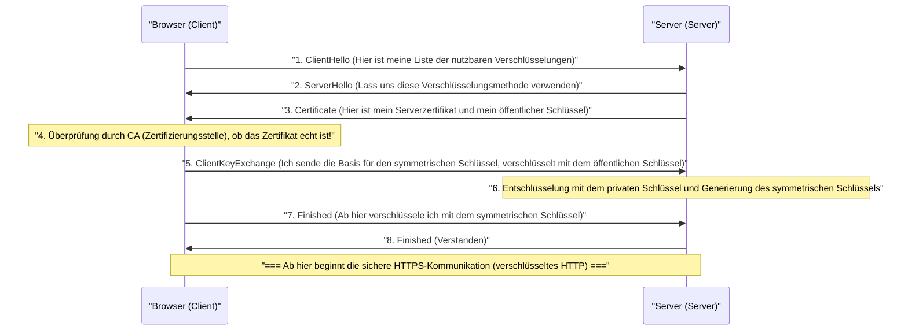

## 1. Das Internet ist eine „Postkarte“

Das von uns gewöhnlich genutzte Web-Kommunikationsprotokoll „HTTP“ ist zwar äußerst praktisch, hat jedoch eine fatale Schwachstelle im Hinblick auf die Sicherheit. Und zwar: „**Sämtliche Kommunikationsinhalte werden als Klartext (unverschlüsselte, einfache Zeichen) gesendet und empfangen**“.

Die HTTP-Daten, die durch Netzwerkkabel oder WLAN-Radiowellen fließen, können von zwischengeschalteten Routern, Providern oder böswilligen Hackern (Packet Sniffern) leicht eingesehen werden.
Das ist vergleichbar damit, als würde man seine Kreditkartennummer oder sein Passwort auf eine „**Postkarte, deren Rückseite für alle sichtbar ist**“, schreiben und in einen Briefkasten werfen.

Die Technologie, die diese beängstigende Situation löst und die Postkarte in einem „absolut unzugänglichen, robusten Tresor (Umschlag)“ verschickt, ist „**HTTPS (HTTP Secure)**“, bei dem dem HTTP ein „S“ für Sicherheit (Secure) hinzugefügt wurde.

## 2. SSL/TLS: Ein Schild zum Schutz vor 3 Bedrohungen

HTTPS hat das HTTP-Protokoll an sich nicht umgeschrieben. „Bevor“ die HTTP-Kommunikation stattfindet, wird eine Verschlüsselungsprotokoll-Schicht namens **SSL/TLS** eingefügt, in der ein sicherer Tunnel erstellt wird, in den anschließend der HTTP-Text geleitet wird.

SSL (Secure Sockets Layer) wurde 1994 von Netscape entwickelt und später standardisiert und in TLS (Transport Layer Security) umbenannt, wird aber aus Gewohnheit heute noch „SSL/TLS“ genannt.

SSL/TLS schützt uns vor 3 riesigen Bedrohungen im Internet.
1. **Abhören (Eavesdropping)**: Verhindert, dass Kommunikationsinhalte eingesehen werden können (Verschlüsselung)
2. **Manipulation (Tampering)**: Verhindert, dass Daten auf dem Weg verändert werden (Nachrichtenauthentifizierung)
3. **Identitätsdiebstahl (Spoofing)**: Beweist, dass der Kommunikationspartner keine gefälschte Website ist (Digitale Zertifikate)

## 3. Das Dilemma der Verschlüsselung: Symmetrische Schlüssel und asymmetrische Schlüssel

Um die Kommunikation zu verschlüsseln, wird ein „Schlüssel“ benötigt. Hier entsteht jedoch ein großes Dilemma.

Die schnellste und effizienteste Verschlüsselungsmethode ist die „**symmetrische Verschlüsselung** (z. B.: AES)“. Dabei besitzen der Sender und der Empfänger „denselben einen Schlüssel“, um zu verschlüsseln und zu entschlüsseln (genau wie bei einem Haustürschlüssel).
Aber wie sollen Sie und Amazon diesen „gemeinsamen Schlüssel“ sicher teilen, wenn Sie zum ersten Mal online bei Amazon einkaufen? Würden Sie den Schlüssel selbst über das Internet senden, würde auch dieser von Hackern gestohlen werden (Schlüsselverteilungsproblem).

Ein Ansatz, der dieses Problem mit der Macht der Mathematik meisterhaft gelöst hat, ist die „**asymmetrische Verschlüsselung** (Public-Key-Kryptographie, z. B.: RSA, Elliptische-Kurven-Kryptographie)“.

Bei der asymmetrischen Verschlüsselung wird ein Paar aus zwei Schlüsseln erstellt: ein „Vorhängeschloss (öffentlicher Schlüssel)“, das an jeden verteilt werden kann, und ein „Schlüssel zum Öffnen (privater Schlüssel)“, den nur Sie selbst besitzen.
Amazon verteilt seinen „öffentlichen Schlüssel“ auf der ganzen Welt. Ihr Browser verwendet den öffentlichen Schlüssel (Vorhängeschloss) von Amazon, legt einen einmaligen „symmetrischen Schlüssel“ in eine Kiste, verschließt sie mit einem Klick und sendet sie an Amazon.
Diese Kiste kann weltweit nur mit dem „privaten Schlüssel“ geöffnet werden, den Amazon besitzt. Selbst wenn ein Hacker die Kiste unterwegs stiehlt, ist sie nutzlos, da er nicht den Schlüssel hat, um sie zu öffnen.

## 4. Die Hintergründe der HTTPS-Kommunikation: SSL/TLS-Handshake

In dem Moment, in dem Sie in Ihrem Browser auf `https://...` zugreifen, findet im Hintergrund innerhalb von Sekundenbruchteilen eine komplexe Verhandlung zwischen dem Browser und dem Server statt, die als „**SSL/TLS-Handshake**“ bezeichnet wird.

Da die asymmetrische Verschlüsselung extrem rechenintensiv ist, würden die Server überlastet werden, wenn die gesamte Kommunikation asymmetrisch erfolgen würde.
Daher verwendet HTTPS eine äußerst clevere Hybridmethode: „**Die asymmetrische Verschlüsselung wird nur für die sichere Schlüsselübergabe verwendet, während für die eigentliche große Datenkommunikation die schnelle symmetrische Verschlüsselung zum Einsatz kommt**“.

## 5. Public-Key-Infrastruktur (PKI) und Zertifizierungsstelle (CA)

Hier bleibt ein letztes Problem. Der „Identitätsdiebstahl“.
Was würde passieren, wenn ein böswilliger Hacker eine gefälschte Website erstellt, die genau wie Amazon aussieht, und Ihnen seinen eigenen öffentlichen Schlüssel sendet? Ihr Browser würde eine sichere verschlüsselte Kommunikation mit der gefälschten Website aufbauen, Ihr Passwort verschlüsseln und es „sicher“ an den Hacker senden.

Um dies zu verhindern, gibt es die Mechanismen der **PKI (Public Key Infrastructure)** und der **CA (Certificate Authority)**.

Auf der Welt gibt es „Drittanbieter-Organisationen (Zertifizierungsstellen)“, denen weltweit vertraut wird, wie DigiCert, GlobalSign und Let's Encrypt. Unternehmen wie Amazon unterziehen sich strengen Prüfungen durch diese Zertifizierungsstellen und lassen sich ein „Serverzertifikat“ ausstellen, das eine digitale Signatur enthält, die besagt: „Dieser öffentliche Schlüssel gehört zweifellos zum echten Amazon“.

In unseren Computern und Smartphones (Betriebssystemen und Browsern) sind die „Stammzertifikate“ dieser vertrauenswürdigen Zertifizierungsstellen im Voraus installiert.
Wenn der Browser ein Zertifikat vom Server erhält, vergleicht er es mit seinen eigenen Stammzertifikaten und zeigt das „sichere Schloss-Symbol“ in der Adressleiste nur dann an, wenn er bestätigen kann, dass es sich um „ein echtes Zertifikat handelt, das zweifellos von einer vertrauenswürdigen CA signiert wurde“.

## 6. Fazit: Das Zeitalter von Always-On SSL

Früher war HTTPS etwas Besonderes, das nur auf einem sehr kleinen Teil der Seiten verwendet wurde, wie beispielsweise auf Zahlungsseiten, wo Kreditkartennummern eingegeben werden. Dies lag daran, dass man dachte, der Verschlüsselungsprozess würde die Server belasten.

Aufgrund der Verbesserung der CPU-Leistung und der technologischen Entwicklung (wie dem Aufkommen von HTTP/2 und HTTP/3) sowie vor allem der steigenden gesellschaftlichen Nachfrage nach Datenschutz ist es heute, unter der Führung von Unternehmen wie Google, zum weltweiten Standard geworden, „alle Webseiten auf HTTPS umzustellen (Always-On SSL)“. Derzeit sind über 90 % des Web-Traffics im Internet mit HTTPS verschlüsselt.

HTTPS wird durch die Zusammenarbeit unsichtbarer, komplexer mathematischer Algorithmen und einem weltweiten Vertrauensnetzwerk (PKI) geschaffen. Hinter den Bildschirmen unserer Smartphones, auf die wir beiläufig tippen, schützen die starken kryptografischen Barrieren, die von den klügsten Köpfen der Welt errichtet wurden, auch heute leise unsere Daten.
