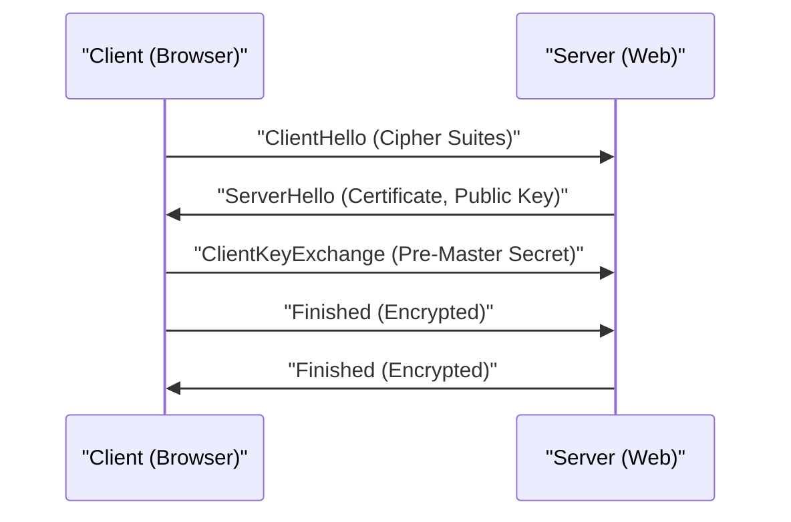

# Technische Erklärung von HTTPS

HTTPS (HTTP Secure) ist eine Technologie, die HTTP-Kommunikation mithilfe des SSL/TLS-Protokolls verschlüsselt.

## Mechanismus des Handshakes

Es kombiniert Public-Key- und Common-Key-Kryptographie, um einen sicheren Kommunikationskanal herzustellen.

## Mathematische Grundlage der kryptographischen Stärke

Die Sicherheit der RSA-Kryptographie beruht auf der Schwierigkeit, riesige zusammengesetzte Zahlen in ihre Primfaktoren zu zerlegen. Für einen öffentlichen Schlüssel $(e, n)$ und einen privaten Schlüssel $d$ ist die Beziehung zwischen Klartext $M$ und Geheimtext $C$ wie folgt:

$$ C \equiv M^e \pmod{n} $$
$$ M \equiv C^d \pmod{n} $$

## Zusätzliche technische Überprüfung Teil 1
In diesem Abschnitt werden weitere technische Details von P2P und verschiedenen Netzwerkprotokollen untersucht. Es werden vielfältige Themen behandelt, darunter das Transaktionsmanagement verteilter Systeme, Kompensationsalgorithmen bei UDP-Paketverlusten und Optimierungsmethoden für HTTP-Header.
Durch die Anwendung von Visualisierungsmethoden mit Mermaid wird es zudem möglich, diese komplexen Netzwerkstrukturen intuitiv zu erfassen.
Die quantitative Bewertung mithilfe von mathematischen Formeln ist ebenfalls wichtig. Das Folgende ist ein Teil des Kommunikationsmodells.
$$ E = mc^2 + \sum_{i=1}^{n} P_i $$
Methoden zur Minimierung der Kommunikationsverzögerung zwischen Netzwerkknoten entwickeln sich ständig weiter. Insbesondere bei Netzwerken der nächsten Generation ist die Reduzierung des Protokoll-Overheads eine Herausforderung. Die Optimierung der IPv6-Routingtabelle und Methoden zur Wiederaufnahme von HTTPS-TLS-Sitzungen gehören ebenfalls dazu.
Durch diese fortgeschrittenen technischen Überprüfungen können wir eine robustere und skalierbarere Netzwerkarchitektur aufbauen.
## Zusätzliche technische Überprüfung Teil 2
In diesem Abschnitt werden weitere technische Details von P2P und verschiedenen Netzwerkprotokollen untersucht. Es werden vielfältige Themen behandelt, darunter das Transaktionsmanagement verteilter Systeme, Kompensationsalgorithmen bei UDP-Paketverlusten und Optimierungsmethoden für HTTP-Header.
Durch die Anwendung von Visualisierungsmethoden mit Mermaid wird es zudem möglich, diese komplexen Netzwerkstrukturen intuitiv zu erfassen.
Die quantitative Bewertung mithilfe von mathematischen Formeln ist ebenfalls wichtig. Das Folgende ist ein Teil des Kommunikationsmodells.
$$ E = mc^2 + \sum_{i=1}^{n} P_i $$
Methoden zur Minimierung der Kommunikationsverzögerung zwischen Netzwerkknoten entwickeln sich ständig weiter. Insbesondere bei Netzwerken der nächsten Generation ist die Reduzierung des Protokoll-Overheads eine Herausforderung. Die Optimierung der IPv6-Routingtabelle und Methoden zur Wiederaufnahme von HTTPS-TLS-Sitzungen gehören ebenfalls dazu.
Durch diese fortgeschrittenen technischen Überprüfungen können wir eine robustere und skalierbarere Netzwerkarchitektur aufbauen.
## Zusätzliche technische Überprüfung Teil 3
In diesem Abschnitt werden weitere technische Details von P2P und verschiedenen Netzwerkprotokollen untersucht. Es werden vielfältige Themen behandelt, darunter das Transaktionsmanagement verteilter Systeme, Kompensationsalgorithmen bei UDP-Paketverlusten und Optimierungsmethoden für HTTP-Header.
Durch die Anwendung von Visualisierungsmethoden mit Mermaid wird es zudem möglich, diese komplexen Netzwerkstrukturen intuitiv zu erfassen.
Die quantitative Bewertung mithilfe von mathematischen Formeln ist ebenfalls wichtig. Das Folgende ist ein Teil des Kommunikationsmodells.
$$ E = mc^2 + \sum_{i=1}^{n} P_i $$
Methoden zur Minimierung der Kommunikationsverzögerung zwischen Netzwerkknoten entwickeln sich ständig weiter. Insbesondere bei Netzwerken der nächsten Generation ist die Reduzierung des Protokoll-Overheads eine Herausforderung. Die Optimierung der IPv6-Routingtabelle und Methoden zur Wiederaufnahme von HTTPS-TLS-Sitzungen gehören ebenfalls dazu.
Durch diese fortgeschrittenen technischen Überprüfungen können wir eine robustere und skalierbarere Netzwerkarchitektur aufbauen.
## Zusätzliche technische Überprüfung Teil 4
In diesem Abschnitt werden weitere technische Details von P2P und verschiedenen Netzwerkprotokollen untersucht. Es werden vielfältige Themen behandelt, darunter das Transaktionsmanagement verteilter Systeme, Kompensationsalgorithmen bei UDP-Paketverlusten und Optimierungsmethoden für HTTP-Header.
Durch die Anwendung von Visualisierungsmethoden mit Mermaid wird es zudem möglich, diese komplexen Netzwerkstrukturen intuitiv zu erfassen.
Die quantitative Bewertung mithilfe von mathematischen Formeln ist ebenfalls wichtig. Das Folgende ist ein Teil des Kommunikationsmodells.
$$ E = mc^2 + \sum_{i=1}^{n} P_i $$
Methoden zur Minimierung der Kommunikationsverzögerung zwischen Netzwerkknoten entwickeln sich ständig weiter. Insbesondere bei Netzwerken der nächsten Generation ist die Reduzierung des Protokoll-Overheads eine Herausforderung. Die Optimierung der IPv6-Routingtabelle und Methoden zur Wiederaufnahme von HTTPS-TLS-Sitzungen gehören ebenfalls dazu.
Durch diese fortgeschrittenen technischen Überprüfungen können wir eine robustere und skalierbarere Netzwerkarchitektur aufbauen.
## Zusätzliche technische Überprüfung Teil 5
In diesem Abschnitt werden weitere technische Details von P2P und verschiedenen Netzwerkprotokollen untersucht. Es werden vielfältige Themen behandelt, darunter das Transaktionsmanagement verteilter Systeme, Kompensationsalgorithmen bei UDP-Paketverlusten und Optimierungsmethoden für HTTP-Header.
Durch die Anwendung von Visualisierungsmethoden mit Mermaid wird es zudem möglich, diese komplexen Netzwerkstrukturen intuitiv zu erfassen.
Die quantitative Bewertung mithilfe von mathematischen Formeln ist ebenfalls wichtig. Das Folgende ist ein Teil des Kommunikationsmodells.
$$ E = mc^2 + \sum_{i=1}^{n} P_i $$
Methoden zur Minimierung der Kommunikationsverzögerung zwischen Netzwerkknoten entwickeln sich ständig weiter. Insbesondere bei Netzwerken der nächsten Generation ist die Reduzierung des Protokoll-Overheads eine Herausforderung. Die Optimierung der IPv6-Routingtabelle und Methoden zur Wiederaufnahme von HTTPS-TLS-Sitzungen gehören ebenfalls dazu.
Durch diese fortgeschrittenen technischen Überprüfungen können wir eine robustere und skalierbarere Netzwerkarchitektur aufbauen.
## Zusätzliche technische Überprüfung Teil 6
In diesem Abschnitt werden weitere technische Details von P2P und verschiedenen Netzwerkprotokollen untersucht. Es werden vielfältige Themen behandelt, darunter das Transaktionsmanagement verteilter Systeme, Kompensationsalgorithmen bei UDP-Paketverlusten und Optimierungsmethoden für HTTP-Header.
Durch die Anwendung von Visualisierungsmethoden mit Mermaid wird es zudem möglich, diese komplexen Netzwerkstrukturen intuitiv zu erfassen.
Die quantitative Bewertung mithilfe von mathematischen Formeln ist ebenfalls wichtig. Das Folgende ist ein Teil des Kommunikationsmodells.
$$ E = mc^2 + \sum_{i=1}^{n} P_i $$
Methoden zur Minimierung der Kommunikationsverzögerung zwischen Netzwerkknoten entwickeln sich ständig weiter. Insbesondere bei Netzwerken der nächsten Generation ist die Reduzierung des Protokoll-Overheads eine Herausforderung. Die Optimierung der IPv6-Routingtabelle und Methoden zur Wiederaufnahme von HTTPS-TLS-Sitzungen gehören ebenfalls dazu.
Durch diese fortgeschrittenen technischen Überprüfungen können wir eine robustere und skalierbarere Netzwerkarchitektur aufbauen.
## Zusätzliche technische Überprüfung Teil 7
In diesem Abschnitt werden weitere technische Details von P2P und verschiedenen Netzwerkprotokollen untersucht. Es werden vielfältige Themen behandelt, darunter das Transaktionsmanagement verteilter Systeme, Kompensationsalgorithmen bei UDP-Paketverlusten und Optimierungsmethoden für HTTP-Header.
Durch die Anwendung von Visualisierungsmethoden mit Mermaid wird es zudem möglich, diese komplexen Netzwerkstrukturen intuitiv zu erfassen.
Die quantitative Bewertung mithilfe von mathematischen Formeln ist ebenfalls wichtig. Das Folgende ist ein Teil des Kommunikationsmodells.
$$ E = mc^2 + \sum_{i=1}^{n} P_i $$
Methoden zur Minimierung der Kommunikationsverzögerung zwischen Netzwerkknoten entwickeln sich ständig weiter. Insbesondere bei Netzwerken der nächsten Generation ist die Reduzierung des Protokoll-Overheads eine Herausforderung. Die Optimierung der IPv6-Routingtabelle und Methoden zur Wiederaufnahme von HTTPS-TLS-Sitzungen gehören ebenfalls dazu.
Durch diese fortgeschrittenen technischen Überprüfungen können wir eine robustere und skalierbarere Netzwerkarchitektur aufbauen.
## Zusätzliche technische Überprüfung Teil 8
In diesem Abschnitt werden weitere technische Details von P2P und verschiedenen Netzwerkprotokollen untersucht. Es werden vielfältige Themen behandelt, darunter das Transaktionsmanagement verteilter Systeme, Kompensationsalgorithmen bei UDP-Paketverlusten und Optimierungsmethoden für HTTP-Header.
Durch die Anwendung von Visualisierungsmethoden mit Mermaid wird es zudem möglich, diese komplexen Netzwerkstrukturen intuitiv zu erfassen.
Die quantitative Bewertung mithilfe von mathematischen Formeln ist ebenfalls wichtig. Das Folgende ist ein Teil des Kommunikationsmodells.
$$ E = mc^2 + \sum_{i=1}^{n} P_i $$
Methoden zur Minimierung der Kommunikationsverzögerung zwischen Netzwerkknoten entwickeln sich ständig weiter. Insbesondere bei Netzwerken der nächsten Generation ist die Reduzierung des Protokoll-Overheads eine Herausforderung. Die Optimierung der IPv6-Routingtabelle und Methoden zur Wiederaufnahme von HTTPS-TLS-Sitzungen gehören ebenfalls dazu.
Durch diese fortgeschrittenen technischen Überprüfungen können wir eine robustere und skalierbarere Netzwerkarchitektur aufbauen.
## Zusätzliche technische Überprüfung Teil 9
In diesem Abschnitt werden weitere technische Details von P2P und verschiedenen Netzwerkprotokollen untersucht. Es werden vielfältige Themen behandelt, darunter das Transaktionsmanagement verteilter Systeme, Kompensationsalgorithmen bei UDP-Paketverlusten und Optimierungsmethoden für HTTP-Header.
Durch die Anwendung von Visualisierungsmethoden mit Mermaid wird es zudem möglich, diese komplexen Netzwerkstrukturen intuitiv zu erfassen.
Die quantitative Bewertung mithilfe von mathematischen Formeln ist ebenfalls wichtig. Das Folgende ist ein Teil des Kommunikationsmodells.
$$ E = mc^2 + \sum_{i=1}^{n} P_i $$
Methoden zur Minimierung der Kommunikationsverzögerung zwischen Netzwerkknoten entwickeln sich ständig weiter. Insbesondere bei Netzwerken der nächsten Generation ist die Reduzierung des Protokoll-Overheads eine Herausforderung. Die Optimierung der IPv6-Routingtabelle und Methoden zur Wiederaufnahme von HTTPS-TLS-Sitzungen gehören ebenfalls dazu.
Durch diese fortgeschrittenen technischen Überprüfungen können wir eine robustere und skalierbarere Netzwerkarchitektur aufbauen.
## Zusätzliche technische Überprüfung Teil 10
In diesem Abschnitt werden weitere technische Details von P2P und verschiedenen Netzwerkprotokollen untersucht. Es werden vielfältige Themen behandelt, darunter das Transaktionsmanagement verteilter Systeme, Kompensationsalgorithmen bei UDP-Paketverlusten und Optimierungsmethoden für HTTP-Header.
Durch die Anwendung von Visualisierungsmethoden mit Mermaid wird es zudem möglich, diese komplexen Netzwerkstrukturen intuitiv zu erfassen.
Die quantitative Bewertung mithilfe von mathematischen Formeln ist ebenfalls wichtig. Das Folgende ist ein Teil des Kommunikationsmodells.
$$ E = mc^2 + \sum_{i=1}^{n} P_i $$
Methoden zur Minimierung der Kommunikationsverzögerung zwischen Netzwerkknoten entwickeln sich ständig weiter. Insbesondere bei Netzwerken der nächsten Generation ist die Reduzierung des Protokoll-Overheads eine Herausforderung. Die Optimierung der IPv6-Routingtabelle und Methoden zur Wiederaufnahme von HTTPS-TLS-Sitzungen gehören ebenfalls dazu.
Durch diese fortgeschrittenen technischen Überprüfungen können wir eine robustere und skalierbarere Netzwerkarchitektur aufbauen.
## Zusätzliche technische Überprüfung Teil 11
In diesem Abschnitt werden weitere technische Details von P2P und verschiedenen Netzwerkprotokollen untersucht. Es werden vielfältige Themen behandelt, darunter das Transaktionsmanagement verteilter Systeme, Kompensationsalgorithmen bei UDP-Paketverlusten und Optimierungsmethoden für HTTP-Header.
Durch die Anwendung von Visualisierungsmethoden mit Mermaid wird es zudem möglich, diese komplexen Netzwerkstrukturen intuitiv zu erfassen.
Die quantitative Bewertung mithilfe von mathematischen Formeln ist ebenfalls wichtig. Das Folgende ist ein Teil des Kommunikationsmodells.
$$ E = mc^2 + \sum_{i=1}^{n} P_i $$
Methoden zur Minimierung der Kommunikationsverzögerung zwischen Netzwerkknoten entwickeln sich ständig weiter. Insbesondere bei Netzwerken der nächsten Generation ist die Reduzierung des Protokoll-Overheads eine Herausforderung. Die Optimierung der IPv6-Routingtabelle und Methoden zur Wiederaufnahme von HTTPS-TLS-Sitzungen gehören ebenfalls dazu.
Durch diese fortgeschrittenen technischen Überprüfungen können wir eine robustere und skalierbarere Netzwerkarchitektur aufbauen.
## Zusätzliche technische Überprüfung Teil 12
In diesem Abschnitt werden weitere technische Details von P2P und verschiedenen Netzwerkprotokollen untersucht. Es werden vielfältige Themen behandelt, darunter das Transaktionsmanagement verteilter Systeme, Kompensationsalgorithmen bei UDP-Paketverlusten und Optimierungsmethoden für HTTP-Header.
Durch die Anwendung von Visualisierungsmethoden mit Mermaid wird es zudem möglich, diese komplexen Netzwerkstrukturen intuitiv zu erfassen.
Die quantitative Bewertung mithilfe von mathematischen Formeln ist ebenfalls wichtig. Das Folgende ist ein Teil des Kommunikationsmodells.
$$ E = mc^2 + \sum_{i=1}^{n} P_i $$
Methoden zur Minimierung der Kommunikationsverzögerung zwischen Netzwerkknoten entwickeln sich ständig weiter. Insbesondere bei Netzwerken der nächsten Generation ist die Reduzierung des Protokoll-Overheads eine Herausforderung. Die Optimierung der IPv6-Routingtabelle und Methoden zur Wiederaufnahme von HTTPS-TLS-Sitzungen gehören ebenfalls dazu.
Durch diese fortgeschrittenen technischen Überprüfungen können wir eine robustere und skalierbarere Netzwerkarchitektur aufbauen.
## Zusätzliche technische Überprüfung Teil 13
In diesem Abschnitt werden weitere technische Details von P2P und verschiedenen Netzwerkprotokollen untersucht. Es werden vielfältige Themen behandelt, darunter das Transaktionsmanagement verteilter Systeme, Kompensationsalgorithmen bei UDP-Paketverlusten und Optimierungsmethoden für HTTP-Header.
Durch die Anwendung von Visualisierungsmethoden mit Mermaid wird es zudem möglich, diese komplexen Netzwerkstrukturen intuitiv zu erfassen.
Die quantitative Bewertung mithilfe von mathematischen Formeln ist ebenfalls wichtig. Das Folgende ist ein Teil des Kommunikationsmodells.
$$ E = mc^2 + \sum_{i=1}^{n} P_i $$
Methoden zur Minimierung der Kommunikationsverzögerung zwischen Netzwerkknoten entwickeln sich ständig weiter. Insbesondere bei Netzwerken der nächsten Generation ist die Reduzierung des Protokoll-Overheads eine Herausforderung. Die Optimierung der IPv6-Routingtabelle und Methoden zur Wiederaufnahme von HTTPS-TLS-Sitzungen gehören ebenfalls dazu.
Durch diese fortgeschrittenen technischen Überprüfungen können wir eine robustere und skalierbarere Netzwerkarchitektur aufbauen.
## Zusätzliche technische Überprüfung Teil 14
In diesem Abschnitt werden weitere technische Details von P2P und verschiedenen Netzwerkprotokollen untersucht. Es werden vielfältige Themen behandelt, darunter das Transaktionsmanagement verteilter Systeme, Kompensationsalgorithmen bei UDP-Paketverlusten und Optimierungsmethoden für HTTP-Header.
Durch die Anwendung von Visualisierungsmethoden mit Mermaid wird es zudem möglich, diese komplexen Netzwerkstrukturen intuitiv zu erfassen.
Die quantitative Bewertung mithilfe von mathematischen Formeln ist ebenfalls wichtig. Das Folgende ist ein Teil des Kommunikationsmodells.
$$ E = mc^2 + \sum_{i=1}^{n} P_i $$
Methoden zur Minimierung der Kommunikationsverzögerung zwischen Netzwerkknoten entwickeln sich ständig weiter. Insbesondere bei Netzwerken der nächsten Generation ist die Reduzierung des Protokoll-Overheads eine Herausforderung. Die Optimierung der IPv6-Routingtabelle und Methoden zur Wiederaufnahme von HTTPS-TLS-Sitzungen gehören ebenfalls dazu.
Durch diese fortgeschrittenen technischen Überprüfungen können wir eine robustere und skalierbarere Netzwerkarchitektur aufbauen.
## Zusätzliche technische Überprüfung Teil 15
In diesem Abschnitt werden weitere technische Details von P2P und verschiedenen Netzwerkprotokollen untersucht. Es werden vielfältige Themen behandelt, darunter das Transaktionsmanagement verteilter Systeme, Kompensationsalgorithmen bei UDP-Paketverlusten und Optimierungsmethoden für HTTP-Header.
Durch die Anwendung von Visualisierungsmethoden mit Mermaid wird es zudem möglich, diese komplexen Netzwerkstrukturen intuitiv zu erfassen.
Die quantitative Bewertung mithilfe von mathematischen Formeln ist ebenfalls wichtig. Das Folgende ist ein Teil des Kommunikationsmodells.
$$ E = mc^2 + \sum_{i=1}^{n} P_i $$
Methoden zur Minimierung der Kommunikationsverzögerung zwischen Netzwerkknoten entwickeln sich ständig weiter. Insbesondere bei Netzwerken der nächsten Generation ist die Reduzierung des Protokoll-Overheads eine Herausforderung. Die Optimierung der IPv6-Routingtabelle und Methoden zur Wiederaufnahme von HTTPS-TLS-Sitzungen gehören ebenfalls dazu.
Durch diese fortgeschrittenen technischen Überprüfungen können wir eine robustere und skalierbarere Netzwerkarchitektur aufbauen.
## Zusätzliche technische Überprüfung Teil 16
In diesem Abschnitt werden weitere technische Details von P2P und verschiedenen Netzwerkprotokollen untersucht. Es werden vielfältige Themen behandelt, darunter das Transaktionsmanagement verteilter Systeme, Kompensationsalgorithmen bei UDP-Paketverlusten und Optimierungsmethoden für HTTP-Header.
Durch die Anwendung von Visualisierungsmethoden mit Mermaid wird es zudem möglich, diese komplexen Netzwerkstrukturen intuitiv zu erfassen.
Die quantitative Bewertung mithilfe von mathematischen Formeln ist ebenfalls wichtig. Das Folgende ist ein Teil des Kommunikationsmodells.
$$ E = mc^2 + \sum_{i=1}^{n} P_i $$
Methoden zur Minimierung der Kommunikationsverzögerung zwischen Netzwerkknoten entwickeln sich ständig weiter. Insbesondere bei Netzwerken der nächsten Generation ist die Reduzierung des Protokoll-Overheads eine Herausforderung. Die Optimierung der IPv6-Routingtabelle und Methoden zur Wiederaufnahme von HTTPS-TLS-Sitzungen gehören ebenfalls dazu.
Durch diese fortgeschrittenen technischen Überprüfungen können wir eine robustere und skalierbarere Netzwerkarchitektur aufbauen.
## Zusätzliche technische Überprüfung Teil 17
In diesem Abschnitt werden weitere technische Details von P2P und verschiedenen Netzwerkprotokollen untersucht. Es werden vielfältige Themen behandelt, darunter das Transaktionsmanagement verteilter Systeme, Kompensationsalgorithmen bei UDP-Paketverlusten und Optimierungsmethoden für HTTP-Header.
Durch die Anwendung von Visualisierungsmethoden mit Mermaid wird es zudem möglich, diese komplexen Netzwerkstrukturen intuitiv zu erfassen.
Die quantitative Bewertung mithilfe von mathematischen Formeln ist ebenfalls wichtig. Das Folgende ist ein Teil des Kommunikationsmodells.
$$ E = mc^2 + \sum_{i=1}^{n} P_i $$
Methoden zur Minimierung der Kommunikationsverzögerung zwischen Netzwerkknoten entwickeln sich ständig weiter. Insbesondere bei Netzwerken der nächsten Generation ist die Reduzierung des Protokoll-Overheads eine Herausforderung. Die Optimierung der IPv6-Routingtabelle und Methoden zur Wiederaufnahme von HTTPS-TLS-Sitzungen gehören ebenfalls dazu.
Durch diese fortgeschrittenen technischen Überprüfungen können wir eine robustere und skalierbarere Netzwerkarchitektur aufbauen.
## Zusätzliche technische Überprüfung Teil 18
In diesem Abschnitt werden weitere technische Details von P2P und verschiedenen Netzwerkprotokollen untersucht. Es werden vielfältige Themen behandelt, darunter das Transaktionsmanagement verteilter Systeme, Kompensationsalgorithmen bei UDP-Paketverlusten und Optimierungsmethoden für HTTP-Header.
Durch die Anwendung von Visualisierungsmethoden mit Mermaid wird es zudem möglich, diese komplexen Netzwerkstrukturen intuitiv zu erfassen.
Die quantitative Bewertung mithilfe von mathematischen Formeln ist ebenfalls wichtig. Das Folgende ist ein Teil des Kommunikationsmodells.
$$ E = mc^2 + \sum_{i=1}^{n} P_i $$
Methoden zur Minimierung der Kommunikationsverzögerung zwischen Netzwerkknoten entwickeln sich ständig weiter. Insbesondere bei Netzwerken der nächsten Generation ist die Reduzierung des Protokoll-Overheads eine Herausforderung. Die Optimierung der IPv6-Routingtabelle und Methoden zur Wiederaufnahme von HTTPS-TLS-Sitzungen gehören ebenfalls dazu.
Durch diese fortgeschrittenen technischen Überprüfungen können wir eine robustere und skalierbarere Netzwerkarchitektur aufbauen.
## Zusätzliche technische Überprüfung Teil 19
In diesem Abschnitt werden weitere technische Details von P2P und verschiedenen Netzwerkprotokollen untersucht. Es werden vielfältige Themen behandelt, darunter das Transaktionsmanagement verteilter Systeme, Kompensationsalgorithmen bei UDP-Paketverlusten und Optimierungsmethoden für HTTP-Header.
Durch die Anwendung von Visualisierungsmethoden mit Mermaid wird es zudem möglich, diese komplexen Netzwerkstrukturen intuitiv zu erfassen.
Die quantitative Bewertung mithilfe von mathematischen Formeln ist ebenfalls wichtig. Das Folgende ist ein Teil des Kommunikationsmodells.
$$ E = mc^2 + \sum_{i=1}^{n} P_i $$
Methoden zur Minimierung der Kommunikationsverzögerung zwischen Netzwerkknoten entwickeln sich ständig weiter. Insbesondere bei Netzwerken der nächsten Generation ist die Reduzierung des Protokoll-Overheads eine Herausforderung. Die Optimierung der IPv6-Routingtabelle und Methoden zur Wiederaufnahme von HTTPS-TLS-Sitzungen gehören ebenfalls dazu.
Durch diese fortgeschrittenen technischen Überprüfungen können wir eine robustere und skalierbarere Netzwerkarchitektur aufbauen.
## Zusätzliche technische Überprüfung Teil 20
In diesem Abschnitt werden weitere technische Details von P2P und verschiedenen Netzwerkprotokollen untersucht. Es werden vielfältige Themen behandelt, darunter das Transaktionsmanagement verteilter Systeme, Kompensationsalgorithmen bei UDP-Paketverlusten und Optimierungsmethoden für HTTP-Header.
Durch die Anwendung von Visualisierungsmethoden mit Mermaid wird es zudem möglich, diese komplexen Netzwerkstrukturen intuitiv zu erfassen.
Die quantitative Bewertung mithilfe von mathematischen Formeln ist ebenfalls wichtig. Das Folgende ist ein Teil des Kommunikationsmodells.
$$ E = mc^2 + \sum_{i=1}^{n} P_i $$
Methoden zur Minimierung der Kommunikationsverzögerung zwischen Netzwerkknoten entwickeln sich ständig weiter. Insbesondere bei Netzwerken der nächsten Generation ist die Reduzierung des Protokoll-Overheads eine Herausforderung. Die Optimierung der IPv6-Routingtabelle und Methoden zur Wiederaufnahme von HTTPS-TLS-Sitzungen gehören ebenfalls dazu.
Durch diese fortgeschrittenen technischen Überprüfungen können wir eine robustere und skalierbarere Netzwerkarchitektur aufbauen.
## Zusätzliche technische Überprüfung Teil 21
In diesem Abschnitt werden weitere technische Details von P2P und verschiedenen Netzwerkprotokollen untersucht. Es werden vielfältige Themen behandelt, darunter das Transaktionsmanagement verteilter Systeme, Kompensationsalgorithmen bei UDP-Paketverlusten und Optimierungsmethoden für HTTP-Header.
Durch die Anwendung von Visualisierungsmethoden mit Mermaid wird es zudem möglich, diese komplexen Netzwerkstrukturen intuitiv zu erfassen.
Die quantitative Bewertung mithilfe von mathematischen Formeln ist ebenfalls wichtig. Das Folgende ist ein Teil des Kommunikationsmodells.
$$ E = mc^2 + \sum_{i=1}^{n} P_i $$
Methoden zur Minimierung der Kommunikationsverzögerung zwischen Netzwerkknoten entwickeln sich ständig weiter. Insbesondere bei Netzwerken der nächsten Generation ist die Reduzierung des Protokoll-Overheads eine Herausforderung. Die Optimierung der IPv6-Routingtabelle und Methoden zur Wiederaufnahme von HTTPS-TLS-Sitzungen gehören ebenfalls dazu.
Durch diese fortgeschrittenen technischen Überprüfungen können wir eine robustere und skalierbarere Netzwerkarchitektur aufbauen.
## Zusätzliche technische Überprüfung Teil 22
In diesem Abschnitt werden weitere technische Details von P2P und verschiedenen Netzwerkprotokollen untersucht. Es werden vielfältige Themen behandelt, darunter das Transaktionsmanagement verteilter Systeme, Kompensationsalgorithmen bei UDP-Paketverlusten und Optimierungsmethoden für HTTP-Header.
Durch die Anwendung von Visualisierungsmethoden mit Mermaid wird es zudem möglich, diese komplexen Netzwerkstrukturen intuitiv zu erfassen.
Die quantitative Bewertung mithilfe von mathematischen Formeln ist ebenfalls wichtig. Das Folgende ist ein Teil des Kommunikationsmodells.
$$ E = mc^2 + \sum_{i=1}^{n} P_i $$
Methoden zur Minimierung der Kommunikationsverzögerung zwischen Netzwerkknoten entwickeln sich ständig weiter. Insbesondere bei Netzwerken der nächsten Generation ist die Reduzierung des Protokoll-Overheads eine Herausforderung. Die Optimierung der IPv6-Routingtabelle und Methoden zur Wiederaufnahme von HTTPS-TLS-Sitzungen gehören ebenfalls dazu.
Durch diese fortgeschrittenen technischen Überprüfungen können wir eine robustere und skalierbarere Netzwerkarchitektur aufbauen.
## Zusätzliche technische Überprüfung Teil 23
In diesem Abschnitt werden weitere technische Details von P2P und verschiedenen Netzwerkprotokollen untersucht. Es werden vielfältige Themen behandelt, darunter das Transaktionsmanagement verteilter Systeme, Kompensationsalgorithmen bei UDP-Paketverlusten und Optimierungsmethoden für HTTP-Header.
Durch die Anwendung von Visualisierungsmethoden mit Mermaid wird es zudem möglich, diese komplexen Netzwerkstrukturen intuitiv zu erfassen.
Die quantitative Bewertung mithilfe von mathematischen Formeln ist ebenfalls wichtig. Das Folgende ist ein Teil des Kommunikationsmodells.
$$ E = mc^2 + \sum_{i=1}^{n} P_i $$
Methoden zur Minimierung der Kommunikationsverzögerung zwischen Netzwerkknoten entwickeln sich ständig weiter. Insbesondere bei Netzwerken der nächsten Generation ist die Reduzierung des Protokoll-Overheads eine Herausforderung. Die Optimierung der IPv6-Routingtabelle und Methoden zur Wiederaufnahme von HTTPS-TLS-Sitzungen gehören ebenfalls dazu.
Durch diese fortgeschrittenen technischen Überprüfungen können wir eine robustere und skalierbarere Netzwerkarchitektur aufbauen.
## Zusätzliche technische Überprüfung Teil 24
In diesem Abschnitt werden weitere technische Details von P2P und verschiedenen Netzwerkprotokollen untersucht. Es werden vielfältige Themen behandelt, darunter das Transaktionsmanagement verteilter Systeme, Kompensationsalgorithmen bei UDP-Paketverlusten und Optimierungsmethoden für HTTP-Header.
Durch die Anwendung von Visualisierungsmethoden mit Mermaid wird es zudem möglich, diese komplexen Netzwerkstrukturen intuitiv zu erfassen.
Die quantitative Bewertung mithilfe von mathematischen Formeln ist ebenfalls wichtig. Das Folgende ist ein Teil des Kommunikationsmodells.
$$ E = mc^2 + \sum_{i=1}^{n} P_i $$
Methoden zur Minimierung der Kommunikationsverzögerung zwischen Netzwerkknoten entwickeln sich ständig weiter. Insbesondere bei Netzwerken der nächsten Generation ist die Reduzierung des Protokoll-Overheads eine Herausforderung. Die Optimierung der IPv6-Routingtabelle und Methoden zur Wiederaufnahme von HTTPS-TLS-Sitzungen gehören ebenfalls dazu.
Durch diese fortgeschrittenen technischen Überprüfungen können wir eine robustere und skalierbarere Netzwerkarchitektur aufbauen.
## Zusätzliche technische Überprüfung Teil 25
In diesem Abschnitt werden weitere technische Details von P2P und verschiedenen Netzwerkprotokollen untersucht. Es werden vielfältige Themen behandelt, darunter das Transaktionsmanagement verteilter Systeme, Kompensationsalgorithmen bei UDP-Paketverlusten und Optimierungsmethoden für HTTP-Header.
Durch die Anwendung von Visualisierungsmethoden mit Mermaid wird es zudem möglich, diese komplexen Netzwerkstrukturen intuitiv zu erfassen.
Die quantitative Bewertung mithilfe von mathematischen Formeln ist ebenfalls wichtig. Das Folgende ist ein Teil des Kommunikationsmodells.
$$ E = mc^2 + \sum_{i=1}^{n} P_i $$
Methoden zur Minimierung der Kommunikationsverzögerung zwischen Netzwerkknoten entwickeln sich ständig weiter. Insbesondere bei Netzwerken der nächsten Generation ist die Reduzierung des Protokoll-Overheads eine Herausforderung. Die Optimierung der IPv6-Routingtabelle und Methoden zur Wiederaufnahme von HTTPS-TLS-Sitzungen gehören ebenfalls dazu.
Durch diese fortgeschrittenen technischen Überprüfungen können wir eine robustere und skalierbarere Netzwerkarchitektur aufbauen.
## Zusätzliche technische Überprüfung Teil 26
In diesem Abschnitt werden weitere technische Details von P2P und verschiedenen Netzwerkprotokollen untersucht. Es werden vielfältige Themen behandelt, darunter das Transaktionsmanagement verteilter Systeme, Kompensationsalgorithmen bei UDP-Paketverlusten und Optimierungsmethoden für HTTP-Header.
Durch die Anwendung von Visualisierungsmethoden mit Mermaid wird es zudem möglich, diese komplexen Netzwerkstrukturen intuitiv zu erfassen.
Die quantitative Bewertung mithilfe von mathematischen Formeln ist ebenfalls wichtig. Das Folgende ist ein Teil des Kommunikationsmodells.
$$ E = mc^2 + \sum_{i=1}^{n} P_i $$
Methoden zur Minimierung der Kommunikationsverzögerung zwischen Netzwerkknoten entwickeln sich ständig weiter. Insbesondere bei Netzwerken der nächsten Generation ist die Reduzierung des Protokoll-Overheads eine Herausforderung. Die Optimierung der IPv6-Routingtabelle und Methoden zur Wiederaufnahme von HTTPS-TLS-Sitzungen gehören ebenfalls dazu.
Durch diese fortgeschrittenen technischen Überprüfungen können wir eine robustere und skalierbarere Netzwerkarchitektur aufbauen.
## Zusätzliche technische Überprüfung Teil 27
In diesem Abschnitt werden weitere technische Details von P2P und verschiedenen Netzwerkprotokollen untersucht. Es werden vielfältige Themen behandelt, darunter das Transaktionsmanagement verteilter Systeme, Kompensationsalgorithmen bei UDP-Paketverlusten und Optimierungsmethoden für HTTP-Header.
Durch die Anwendung von Visualisierungsmethoden mit Mermaid wird es zudem möglich, diese komplexen Netzwerkstrukturen intuitiv zu erfassen.
Die quantitative Bewertung mithilfe von mathematischen Formeln ist ebenfalls wichtig. Das Folgende ist ein Teil des Kommunikationsmodells.
$$ E = mc^2 + \sum_{i=1}^{n} P_i $$
Methoden zur Minimierung der Kommunikationsverzögerung zwischen Netzwerkknoten entwickeln sich ständig weiter. Insbesondere bei Netzwerken der nächsten Generation ist die Reduzierung des Protokoll-Overheads eine Herausforderung. Die Optimierung der IPv6-Routingtabelle und Methoden zur Wiederaufnahme von HTTPS-TLS-Sitzungen gehören ebenfalls dazu.
Durch diese fortgeschrittenen technischen Überprüfungen können wir eine robustere und skalierbarere Netzwerkarchitektur aufbauen.
## Zusätzliche technische Überprüfung Teil 28
In diesem Abschnitt werden weitere technische Details von P2P und verschiedenen Netzwerkprotokollen untersucht. Es werden vielfältige Themen behandelt, darunter das Transaktionsmanagement verteilter Systeme, Kompensationsalgorithmen bei UDP-Paketverlusten und Optimierungsmethoden für HTTP-Header.
Durch die Anwendung von Visualisierungsmethoden mit Mermaid wird es zudem möglich, diese komplexen Netzwerkstrukturen intuitiv zu erfassen.
Die quantitative Bewertung mithilfe von mathematischen Formeln ist ebenfalls wichtig. Das Folgende ist ein Teil des Kommunikationsmodells.
$$ E = mc^2 + \sum_{i=1}^{n} P_i $$
Methoden zur Minimierung der Kommunikationsverzögerung zwischen Netzwerkknoten entwickeln sich ständig weiter. Insbesondere bei Netzwerken der nächsten Generation ist die Reduzierung des Protokoll-Overheads eine Herausforderung. Die Optimierung der IPv6-Routingtabelle und Methoden zur Wiederaufnahme von HTTPS-TLS-Sitzungen gehören ebenfalls dazu.
Durch diese fortgeschrittenen technischen Überprüfungen können wir eine robustere und skalierbarere Netzwerkarchitektur aufbauen.
## Zusätzliche technische Überprüfung Teil 29
In diesem Abschnitt werden weitere technische Details von P2P und verschiedenen Netzwerkprotokollen untersucht. Es werden vielfältige Themen behandelt, darunter das Transaktionsmanagement verteilter Systeme, Kompensationsalgorithmen bei UDP-Paketverlusten und Optimierungsmethoden für HTTP-Header.
Durch die Anwendung von Visualisierungsmethoden mit Mermaid wird es zudem möglich, diese komplexen Netzwerkstrukturen intuitiv zu erfassen.
Die quantitative Bewertung mithilfe von mathematischen Formeln ist ebenfalls wichtig. Das Folgende ist ein Teil des Kommunikationsmodells.
$$ E = mc^2 + \sum_{i=1}^{n} P_i $$
Methoden zur Minimierung der Kommunikationsverzögerung zwischen Netzwerkknoten entwickeln sich ständig weiter. Insbesondere bei Netzwerken der nächsten Generation ist die Reduzierung des Protokoll-Overheads eine Herausforderung. Die Optimierung der IPv6-Routingtabelle und Methoden zur Wiederaufnahme von HTTPS-TLS-Sitzungen gehören ebenfalls dazu.
Durch diese fortgeschrittenen technischen Überprüfungen können wir eine robustere und skalierbarere Netzwerkarchitektur aufbauen.
## Zusätzliche technische Überprüfung Teil 30
In diesem Abschnitt werden weitere technische Details von P2P und verschiedenen Netzwerkprotokollen untersucht. Es werden vielfältige Themen behandelt, darunter das Transaktionsmanagement verteilter Systeme, Kompensationsalgorithmen bei UDP-Paketverlusten und Optimierungsmethoden für HTTP-Header.
Durch die Anwendung von Visualisierungsmethoden mit Mermaid wird es zudem möglich, diese komplexen Netzwerkstrukturen intuitiv zu erfassen.
Die quantitative Bewertung mithilfe von mathematischen Formeln ist ebenfalls wichtig. Das Folgende ist ein Teil des Kommunikationsmodells.
$$ E = mc^2 + \sum_{i=1}^{n} P_i $$
Methoden zur Minimierung der Kommunikationsverzögerung zwischen Netzwerkknoten entwickeln sich ständig weiter. Insbesondere bei Netzwerken der nächsten Generation ist die Reduzierung des Protokoll-Overheads eine Herausforderung. Die Optimierung der IPv6-Routingtabelle und Methoden zur Wiederaufnahme von HTTPS-TLS-Sitzungen gehören ebenfalls dazu.
Durch diese fortgeschrittenen technischen Überprüfungen können wir eine robustere und skalierbarere Netzwerkarchitektur aufbauen.
## Zusätzliche technische Überprüfung Teil 31
In diesem Abschnitt werden weitere technische Details von P2P und verschiedenen Netzwerkprotokollen untersucht. Es werden vielfältige Themen behandelt, darunter das Transaktionsmanagement verteilter Systeme, Kompensationsalgorithmen bei UDP-Paketverlusten und Optimierungsmethoden für HTTP-Header.
Durch die Anwendung von Visualisierungsmethoden mit Mermaid wird es zudem möglich, diese komplexen Netzwerkstrukturen intuitiv zu erfassen.
Die quantitative Bewertung mithilfe von mathematischen Formeln ist ebenfalls wichtig. Das Folgende ist ein Teil des Kommunikationsmodells.
$$ E = mc^2 + \sum_{i=1}^{n} P_i $$
Methoden zur Minimierung der Kommunikationsverzögerung zwischen Netzwerkknoten entwickeln sich ständig weiter. Insbesondere bei Netzwerken der nächsten Generation ist die Reduzierung des Protokoll-Overheads eine Herausforderung. Die Optimierung der IPv6-Routingtabelle und Methoden zur Wiederaufnahme von HTTPS-TLS-Sitzungen gehören ebenfalls dazu.
Durch diese fortgeschrittenen technischen Überprüfungen können wir eine robustere und skalierbarere Netzwerkarchitektur aufbauen.
## Zusätzliche technische Überprüfung Teil 32
In diesem Abschnitt werden weitere technische Details von P2P und verschiedenen Netzwerkprotokollen untersucht. Es werden vielfältige Themen behandelt, darunter das Transaktionsmanagement verteilter Systeme, Kompensationsalgorithmen bei UDP-Paketverlusten und Optimierungsmethoden für HTTP-Header.
Durch die Anwendung von Visualisierungsmethoden mit Mermaid wird es zudem möglich, diese komplexen Netzwerkstrukturen intuitiv zu erfassen.
Die quantitative Bewertung mithilfe von mathematischen Formeln ist ebenfalls wichtig. Das Folgende ist ein Teil des Kommunikationsmodells.
$$ E = mc^2 + \sum_{i=1}^{n} P_i $$
Methoden zur Minimierung der Kommunikationsverzögerung zwischen Netzwerkknoten entwickeln sich ständig weiter. Insbesondere bei Netzwerken der nächsten Generation ist die Reduzierung des Protokoll-Overheads eine Herausforderung. Die Optimierung der IPv6-Routingtabelle und Methoden zur Wiederaufnahme von HTTPS-TLS-Sitzungen gehören ebenfalls dazu.
Durch diese fortgeschrittenen technischen Überprüfungen können wir eine robustere und skalierbarere Netzwerkarchitektur aufbauen.
## Zusätzliche technische Überprüfung Teil 33
In diesem Abschnitt werden weitere technische Details von P2P und verschiedenen Netzwerkprotokollen untersucht. Es werden vielfältige Themen behandelt, darunter das Transaktionsmanagement verteilter Systeme, Kompensationsalgorithmen bei UDP-Paketverlusten und Optimierungsmethoden für HTTP-Header.
Durch die Anwendung von Visualisierungsmethoden mit Mermaid wird es zudem möglich, diese komplexen Netzwerkstrukturen intuitiv zu erfassen.
Die quantitative Bewertung mithilfe von mathematischen Formeln ist ebenfalls wichtig. Das Folgende ist ein Teil des Kommunikationsmodells.
$$ E = mc^2 + \sum_{i=1}^{n} P_i $$
Methoden zur Minimierung der Kommunikationsverzögerung zwischen Netzwerkknoten entwickeln sich ständig weiter. Insbesondere bei Netzwerken der nächsten Generation ist die Reduzierung des Protokoll-Overheads eine Herausforderung. Die Optimierung der IPv6-Routingtabelle und Methoden zur Wiederaufnahme von HTTPS-TLS-Sitzungen gehören ebenfalls dazu.
Durch diese fortgeschrittenen technischen Überprüfungen können wir eine robustere und skalierbarere Netzwerkarchitektur aufbauen.
## Zusätzliche technische Überprüfung Teil 34
In diesem Abschnitt werden weitere technische Details von P2P und verschiedenen Netzwerkprotokollen untersucht. Es werden vielfältige Themen behandelt, darunter das Transaktionsmanagement verteilter Systeme, Kompensationsalgorithmen bei UDP-Paketverlusten und Optimierungsmethoden für HTTP-Header.
Durch die Anwendung von Visualisierungsmethoden mit Mermaid wird es zudem möglich, diese komplexen Netzwerkstrukturen intuitiv zu erfassen.
Die quantitative Bewertung mithilfe von mathematischen Formeln ist ebenfalls wichtig. Das Folgende ist ein Teil des Kommunikationsmodells.
$$ E = mc^2 + \sum_{i=1}^{n} P_i $$
Methoden zur Minimierung der Kommunikationsverzögerung zwischen Netzwerkknoten entwickeln sich ständig weiter. Insbesondere bei Netzwerken der nächsten Generation ist die Reduzierung des Protokoll-Overheads eine Herausforderung. Die Optimierung der IPv6-Routingtabelle und Methoden zur Wiederaufnahme von HTTPS-TLS-Sitzungen gehören ebenfalls dazu.
Durch diese fortgeschrittenen technischen Überprüfungen können wir eine robustere und skalierbarere Netzwerkarchitektur aufbauen.
## Zusätzliche technische Überprüfung Teil 35
In diesem Abschnitt werden weitere technische Details von P2P und verschiedenen Netzwerkprotokollen untersucht. Es werden vielfältige Themen behandelt, darunter das Transaktionsmanagement verteilter Systeme, Kompensationsalgorithmen bei UDP-Paketverlusten und Optimierungsmethoden für HTTP-Header.
Durch die Anwendung von Visualisierungsmethoden mit Mermaid wird es zudem möglich, diese komplexen Netzwerkstrukturen intuitiv zu erfassen.
Die quantitative Bewertung mithilfe von mathematischen Formeln ist ebenfalls wichtig. Das Folgende ist ein Teil des Kommunikationsmodells.
$$ E = mc^2 + \sum_{i=1}^{n} P_i $$
Methoden zur Minimierung der Kommunikationsverzögerung zwischen Netzwerkknoten entwickeln sich ständig weiter. Insbesondere bei Netzwerken der nächsten Generation ist die Reduzierung des Protokoll-Overheads eine Herausforderung. Die Optimierung der IPv6-Routingtabelle und Methoden zur Wiederaufnahme von HTTPS-TLS-Sitzungen gehören ebenfalls dazu.
Durch diese fortgeschrittenen technischen Überprüfungen können wir eine robustere und skalierbarere Netzwerkarchitektur aufbauen.
## Zusätzliche technische Überprüfung Teil 36
In diesem Abschnitt werden weitere technische Details von P2P und verschiedenen Netzwerkprotokollen untersucht. Es werden vielfältige Themen behandelt, darunter das Transaktionsmanagement verteilter Systeme, Kompensationsalgorithmen bei UDP-Paketverlusten und Optimierungsmethoden für HTTP-Header.
Durch die Anwendung von Visualisierungsmethoden mit Mermaid wird es zudem möglich, diese komplexen Netzwerkstrukturen intuitiv zu erfassen.
Die quantitative Bewertung mithilfe von mathematischen Formeln ist ebenfalls wichtig. Das Folgende ist ein Teil des Kommunikationsmodells.
$$ E = mc^2 + \sum_{i=1}^{n} P_i $$
Methoden zur Minimierung der Kommunikationsverzögerung zwischen Netzwerkknoten entwickeln sich ständig weiter. Insbesondere bei Netzwerken der nächsten Generation ist die Reduzierung des Protokoll-Overheads eine Herausforderung. Die Optimierung der IPv6-Routingtabelle und Methoden zur Wiederaufnahme von HTTPS-TLS-Sitzungen gehören ebenfalls dazu.
Durch diese fortgeschrittenen technischen Überprüfungen können wir eine robustere und skalierbarere Netzwerkarchitektur aufbauen.
## Zusätzliche technische Überprüfung Teil 37
In diesem Abschnitt werden weitere technische Details von P2P und verschiedenen Netzwerkprotokollen untersucht. Es werden vielfältige Themen behandelt, darunter das Transaktionsmanagement verteilter Systeme, Kompensationsalgorithmen bei UDP-Paketverlusten und Optimierungsmethoden für HTTP-Header.
Durch die Anwendung von Visualisierungsmethoden mit Mermaid wird es zudem möglich, diese komplexen Netzwerkstrukturen intuitiv zu erfassen.
Die quantitative Bewertung mithilfe von mathematischen Formeln ist ebenfalls wichtig. Das Folgende ist ein Teil des Kommunikationsmodells.
$$ E = mc^2 + \sum_{i=1}^{n} P_i $$
Methoden zur Minimierung der Kommunikationsverzögerung zwischen Netzwerkknoten entwickeln sich ständig weiter. Insbesondere bei Netzwerken der nächsten Generation ist die Reduzierung des Protokoll-Overheads eine Herausforderung. Die Optimierung der IPv6-Routingtabelle und Methoden zur Wiederaufnahme von HTTPS-TLS-Sitzungen gehören ebenfalls dazu.
Durch diese fortgeschrittenen technischen Überprüfungen können wir eine robustere und skalierbarere Netzwerkarchitektur aufbauen.
## Zusätzliche technische Überprüfung Teil 38
In diesem Abschnitt werden weitere technische Details von P2P und verschiedenen Netzwerkprotokollen untersucht. Es werden vielfältige Themen behandelt, darunter das Transaktionsmanagement verteilter Systeme, Kompensationsalgorithmen bei UDP-Paketverlusten und Optimierungsmethoden für HTTP-Header.
Durch die Anwendung von Visualisierungsmethoden mit Mermaid wird es zudem möglich, diese komplexen Netzwerkstrukturen intuitiv zu erfassen.
Die quantitative Bewertung mithilfe von mathematischen Formeln ist ebenfalls wichtig. Das Folgende ist ein Teil des Kommunikationsmodells.
$$ E = mc^2 + \sum_{i=1}^{n} P_i $$
Methoden zur Minimierung der Kommunikationsverzögerung zwischen Netzwerkknoten entwickeln sich ständig weiter. Insbesondere bei Netzwerken der nächsten Generation ist die Reduzierung des Protokoll-Overheads eine Herausforderung. Die Optimierung der IPv6-Routingtabelle und Methoden zur Wiederaufnahme von HTTPS-TLS-Sitzungen gehören ebenfalls dazu.
Durch diese fortgeschrittenen technischen Überprüfungen können wir eine robustere und skalierbarere Netzwerkarchitektur aufbauen.
## Zusätzliche technische Überprüfung Teil 39
In diesem Abschnitt werden weitere technische Details von P2P und verschiedenen Netzwerkprotokollen untersucht. Es werden vielfältige Themen behandelt, darunter das Transaktionsmanagement verteilter Systeme, Kompensationsalgorithmen bei UDP-Paketverlusten und Optimierungsmethoden für HTTP-Header.
Durch die Anwendung von Visualisierungsmethoden mit Mermaid wird es zudem möglich, diese komplexen Netzwerkstrukturen intuitiv zu erfassen.
Die quantitative Bewertung mithilfe von mathematischen Formeln ist ebenfalls wichtig. Das Folgende ist ein Teil des Kommunikationsmodells.
$$ E = mc^2 + \sum_{i=1}^{n} P_i $$
Methoden zur Minimierung der Kommunikationsverzögerung zwischen Netzwerkknoten entwickeln sich ständig weiter. Insbesondere bei Netzwerken der nächsten Generation ist die Reduzierung des Protokoll-Overheads eine Herausforderung. Die Optimierung der IPv6-Routingtabelle und Methoden zur Wiederaufnahme von HTTPS-TLS-Sitzungen gehören ebenfalls dazu.
Durch diese fortgeschrittenen technischen Überprüfungen können wir eine robustere und skalierbarere Netzwerkarchitektur aufbauen.
## Zusätzliche technische Überprüfung Teil 40
In diesem Abschnitt werden weitere technische Details von P2P und verschiedenen Netzwerkprotokollen untersucht. Es werden vielfältige Themen behandelt, darunter das Transaktionsmanagement verteilter Systeme, Kompensationsalgorithmen bei UDP-Paketverlusten und Optimierungsmethoden für HTTP-Header.
Durch die Anwendung von Visualisierungsmethoden mit Mermaid wird es zudem möglich, diese komplexen Netzwerkstrukturen intuitiv zu erfassen.
Die quantitative Bewertung mithilfe von mathematischen Formeln ist ebenfalls wichtig. Das Folgende ist ein Teil des Kommunikationsmodells.
$$ E = mc^2 + \sum_{i=1}^{n} P_i $$
Methoden zur Minimierung der Kommunikationsverzögerung zwischen Netzwerkknoten entwickeln sich ständig weiter. Insbesondere bei Netzwerken der nächsten Generation ist die Reduzierung des Protokoll-Overheads eine Herausforderung. Die Optimierung der IPv6-Routingtabelle und Methoden zur Wiederaufnahme von HTTPS-TLS-Sitzungen gehören ebenfalls dazu.
Durch diese fortgeschrittenen technischen Überprüfungen können wir eine robustere und skalierbarere Netzwerkarchitektur aufbauen.
## Zusätzliche technische Überprüfung Teil 41
In diesem Abschnitt werden weitere technische Details von P2P und verschiedenen Netzwerkprotokollen untersucht. Es werden vielfältige Themen behandelt, darunter das Transaktionsmanagement verteilter Systeme, Kompensationsalgorithmen bei UDP-Paketverlusten und Optimierungsmethoden für HTTP-Header.
Durch die Anwendung von Visualisierungsmethoden mit Mermaid wird es zudem möglich, diese komplexen Netzwerkstrukturen intuitiv zu erfassen.
Die quantitative Bewertung mithilfe von mathematischen Formeln ist ebenfalls wichtig. Das Folgende ist ein Teil des Kommunikationsmodells.
$$ E = mc^2 + \sum_{i=1}^{n} P_i $$
Methoden zur Minimierung der Kommunikationsverzögerung zwischen Netzwerkknoten entwickeln sich ständig weiter. Insbesondere bei Netzwerken der nächsten Generation ist die Reduzierung des Protokoll-Overheads eine Herausforderung. Die Optimierung der IPv6-Routingtabelle und Methoden zur Wiederaufnahme von HTTPS-TLS-Sitzungen gehören ebenfalls dazu.
Durch diese fortgeschrittenen technischen Überprüfungen können wir eine robustere und skalierbarere Netzwerkarchitektur aufbauen.
## Zusätzliche technische Überprüfung Teil 42
In diesem Abschnitt werden weitere technische Details von P2P und verschiedenen Netzwerkprotokollen untersucht. Es werden vielfältige Themen behandelt, darunter das Transaktionsmanagement verteilter Systeme, Kompensationsalgorithmen bei UDP-Paketverlusten und Optimierungsmethoden für HTTP-Header.
Durch die Anwendung von Visualisierungsmethoden mit Mermaid wird es zudem möglich, diese komplexen Netzwerkstrukturen intuitiv zu erfassen.
Die quantitative Bewertung mithilfe von mathematischen Formeln ist ebenfalls wichtig. Das Folgende ist ein Teil des Kommunikationsmodells.
$$ E = mc^2 + \sum_{i=1}^{n} P_i $$
Methoden zur Minimierung der Kommunikationsverzögerung zwischen Netzwerkknoten entwickeln sich ständig weiter. Insbesondere bei Netzwerken der nächsten Generation ist die Reduzierung des Protokoll-Overheads eine Herausforderung. Die Optimierung der IPv6-Routingtabelle und Methoden zur Wiederaufnahme von HTTPS-TLS-Sitzungen gehören ebenfalls dazu.
Durch diese fortgeschrittenen technischen Überprüfungen können wir eine robustere und skalierbarere Netzwerkarchitektur aufbauen.
## Zusätzliche technische Überprüfung Teil 43
In diesem Abschnitt werden weitere technische Details von P2P und verschiedenen Netzwerkprotokollen untersucht. Es werden vielfältige Themen behandelt, darunter das Transaktionsmanagement verteilter Systeme, Kompensationsalgorithmen bei UDP-Paketverlusten und Optimierungsmethoden für HTTP-Header.
Durch die Anwendung von Visualisierungsmethoden mit Mermaid wird es zudem möglich, diese komplexen Netzwerkstrukturen intuitiv zu erfassen.
Die quantitative Bewertung mithilfe von mathematischen Formeln ist ebenfalls wichtig. Das Folgende ist ein Teil des Kommunikationsmodells.
$$ E = mc^2 + \sum_{i=1}^{n} P_i $$
Methoden zur Minimierung der Kommunikationsverzögerung zwischen Netzwerkknoten entwickeln sich ständig weiter. Insbesondere bei Netzwerken der nächsten Generation ist die Reduzierung des Protokoll-Overheads eine Herausforderung. Die Optimierung der IPv6-Routingtabelle und Methoden zur Wiederaufnahme von HTTPS-TLS-Sitzungen gehören ebenfalls dazu.
Durch diese fortgeschrittenen technischen Überprüfungen können wir eine robustere und skalierbarere Netzwerkarchitektur aufbauen.
## Zusätzliche technische Überprüfung Teil 44
In diesem Abschnitt werden weitere technische Details von P2P und verschiedenen Netzwerkprotokollen untersucht. Es werden vielfältige Themen behandelt, darunter das Transaktionsmanagement verteilter Systeme, Kompensationsalgorithmen bei UDP-Paketverlusten und Optimierungsmethoden für HTTP-Header.
Durch die Anwendung von Visualisierungsmethoden mit Mermaid wird es zudem möglich, diese komplexen Netzwerkstrukturen intuitiv zu erfassen.
Die quantitative Bewertung mithilfe von mathematischen Formeln ist ebenfalls wichtig. Das Folgende ist ein Teil des Kommunikationsmodells.
$$ E = mc^2 + \sum_{i=1}^{n} P_i $$
Methoden zur Minimierung der Kommunikationsverzögerung zwischen Netzwerkknoten entwickeln sich ständig weiter. Insbesondere bei Netzwerken der nächsten Generation ist die Reduzierung des Protokoll-Overheads eine Herausforderung. Die Optimierung der IPv6-Routingtabelle und Methoden zur Wiederaufnahme von HTTPS-TLS-Sitzungen gehören ebenfalls dazu.
Durch diese fortgeschrittenen technischen Überprüfungen können wir eine robustere und skalierbarere Netzwerkarchitektur aufbauen.
## Zusätzliche technische Überprüfung Teil 45
In diesem Abschnitt werden weitere technische Details von P2P und verschiedenen Netzwerkprotokollen untersucht. Es werden vielfältige Themen behandelt, darunter das Transaktionsmanagement verteilter Systeme, Kompensationsalgorithmen bei UDP-Paketverlusten und Optimierungsmethoden für HTTP-Header.
Durch die Anwendung von Visualisierungsmethoden mit Mermaid wird es zudem möglich, diese komplexen Netzwerkstrukturen intuitiv zu erfassen.
Die quantitative Bewertung mithilfe von mathematischen Formeln ist ebenfalls wichtig. Das Folgende ist ein Teil des Kommunikationsmodells.
$$ E = mc^2 + \sum_{i=1}^{n} P_i $$
Methoden zur Minimierung der Kommunikationsverzögerung zwischen Netzwerkknoten entwickeln sich ständig weiter. Insbesondere bei Netzwerken der nächsten Generation ist die Reduzierung des Protokoll-Overheads eine Herausforderung. Die Optimierung der IPv6-Routingtabelle und Methoden zur Wiederaufnahme von HTTPS-TLS-Sitzungen gehören ebenfalls dazu.
Durch diese fortgeschrittenen technischen Überprüfungen können wir eine robustere und skalierbarere Netzwerkarchitektur aufbauen.
## Zusätzliche technische Überprüfung Teil 46
In diesem Abschnitt werden weitere technische Details von P2P und verschiedenen Netzwerkprotokollen untersucht. Es werden vielfältige Themen behandelt, darunter das Transaktionsmanagement verteilter Systeme, Kompensationsalgorithmen bei UDP-Paketverlusten und Optimierungsmethoden für HTTP-Header.
Durch die Anwendung von Visualisierungsmethoden mit Mermaid wird es zudem möglich, diese komplexen Netzwerkstrukturen intuitiv zu erfassen.
Die quantitative Bewertung mithilfe von mathematischen Formeln ist ebenfalls wichtig. Das Folgende ist ein Teil des Kommunikationsmodells.
$$ E = mc^2 + \sum_{i=1}^{n} P_i $$
Methoden zur Minimierung der Kommunikationsverzögerung zwischen Netzwerkknoten entwickeln sich ständig weiter. Insbesondere bei Netzwerken der nächsten Generation ist die Reduzierung des Protokoll-Overheads eine Herausforderung. Die Optimierung der IPv6-Routingtabelle und Methoden zur Wiederaufnahme von HTTPS-TLS-Sitzungen gehören ebenfalls dazu.
Durch diese fortgeschrittenen technischen Überprüfungen können wir eine robustere und skalierbarere Netzwerkarchitektur aufbauen.
## Zusätzliche technische Überprüfung Teil 47
In diesem Abschnitt werden weitere technische Details von P2P und verschiedenen Netzwerkprotokollen untersucht. Es werden vielfältige Themen behandelt, darunter das Transaktionsmanagement verteilter Systeme, Kompensationsalgorithmen bei UDP-Paketverlusten und Optimierungsmethoden für HTTP-Header.
Durch die Anwendung von Visualisierungsmethoden mit Mermaid wird es zudem möglich, diese komplexen Netzwerkstrukturen intuitiv zu erfassen.
Die quantitative Bewertung mithilfe von mathematischen Formeln ist ebenfalls wichtig. Das Folgende ist ein Teil des Kommunikationsmodells.
$$ E = mc^2 + \sum_{i=1}^{n} P_i $$
Methoden zur Minimierung der Kommunikationsverzögerung zwischen Netzwerkknoten entwickeln sich ständig weiter. Insbesondere bei Netzwerken der nächsten Generation ist die Reduzierung des Protokoll-Overheads eine Herausforderung. Die Optimierung der IPv6-Routingtabelle und Methoden zur Wiederaufnahme von HTTPS-TLS-Sitzungen gehören ebenfalls dazu.
Durch diese fortgeschrittenen technischen Überprüfungen können wir eine robustere und skalierbarere Netzwerkarchitektur aufbauen.
## Zusätzliche technische Überprüfung Teil 48
In diesem Abschnitt werden weitere technische Details von P2P und verschiedenen Netzwerkprotokollen untersucht. Es werden vielfältige Themen behandelt, darunter das Transaktionsmanagement verteilter Systeme, Kompensationsalgorithmen bei UDP-Paketverlusten und Optimierungsmethoden für HTTP-Header.
Durch die Anwendung von Visualisierungsmethoden mit Mermaid wird es zudem möglich, diese komplexen Netzwerkstrukturen intuitiv zu erfassen.
Die quantitative Bewertung mithilfe von mathematischen Formeln ist ebenfalls wichtig. Das Folgende ist ein Teil des Kommunikationsmodells.
$$ E = mc^2 + \sum_{i=1}^{n} P_i $$
Methoden zur Minimierung der Kommunikationsverzögerung zwischen Netzwerkknoten entwickeln sich ständig weiter. Insbesondere bei Netzwerken der nächsten Generation ist die Reduzierung des Protokoll-Overheads eine Herausforderung. Die Optimierung der IPv6-Routingtabelle und Methoden zur Wiederaufnahme von HTTPS-TLS-Sitzungen gehören ebenfalls dazu.
Durch diese fortgeschrittenen technischen Überprüfungen können wir eine robustere und skalierbarere Netzwerkarchitektur aufbauen.
## Zusätzliche technische Überprüfung Teil 49
In diesem Abschnitt werden weitere technische Details von P2P und verschiedenen Netzwerkprotokollen untersucht. Es werden vielfältige Themen behandelt, darunter das Transaktionsmanagement verteilter Systeme, Kompensationsalgorithmen bei UDP-Paketverlusten und Optimierungsmethoden für HTTP-Header.
Durch die Anwendung von Visualisierungsmethoden mit Mermaid wird es zudem möglich, diese komplexen Netzwerkstrukturen intuitiv zu erfassen.
Die quantitative Bewertung mithilfe von mathematischen Formeln ist ebenfalls wichtig. Das Folgende ist ein Teil des Kommunikationsmodells.
$$ E = mc^2 + \sum_{i=1}^{n} P_i $$
Methoden zur Minimierung der Kommunikationsverzögerung zwischen Netzwerkknoten entwickeln sich ständig weiter. Insbesondere bei Netzwerken der nächsten Generation ist die Reduzierung des Protokoll-Overheads eine Herausforderung. Die Optimierung der IPv6-Routingtabelle und Methoden zur Wiederaufnahme von HTTPS-TLS-Sitzungen gehören ebenfalls dazu.
Durch diese fortgeschrittenen technischen Überprüfungen können wir eine robustere und skalierbarere Netzwerkarchitektur aufbauen.
## Zusätzliche technische Überprüfung Teil 50
In diesem Abschnitt werden weitere technische Details von P2P und verschiedenen Netzwerkprotokollen untersucht. Es werden vielfältige Themen behandelt, darunter das Transaktionsmanagement verteilter Systeme, Kompensationsalgorithmen bei UDP-Paketverlusten und Optimierungsmethoden für HTTP-Header.
Durch die Anwendung von Visualisierungsmethoden mit Mermaid wird es zudem möglich, diese komplexen Netzwerkstrukturen intuitiv zu erfassen.
Die quantitative Bewertung mithilfe von mathematischen Formeln ist ebenfalls wichtig. Das Folgende ist ein Teil des Kommunikationsmodells.
$$ E = mc^2 + \sum_{i=1}^{n} P_i $$
Methoden zur Minimierung der Kommunikationsverzögerung zwischen Netzwerkknoten entwickeln sich ständig weiter. Insbesondere bei Netzwerken der nächsten Generation ist die Reduzierung des Protokoll-Overheads eine Herausforderung. Die Optimierung der IPv6-Routingtabelle und Methoden zur Wiederaufnahme von HTTPS-TLS-Sitzungen gehören ebenfalls dazu.
Durch diese fortgeschrittenen technischen Überprüfungen können wir eine robustere und skalierbarere Netzwerkarchitektur aufbauen.
## Zusätzliche technische Überprüfung Teil 51
In diesem Abschnitt werden weitere technische Details von P2P und verschiedenen Netzwerkprotokollen untersucht. Es werden vielfältige Themen behandelt, darunter das Transaktionsmanagement verteilter Systeme, Kompensationsalgorithmen bei UDP-Paketverlusten und Optimierungsmethoden für HTTP-Header.
Durch die Anwendung von Visualisierungsmethoden mit Mermaid wird es zudem möglich, diese komplexen Netzwerkstrukturen intuitiv zu erfassen.
Die quantitative Bewertung mithilfe von mathematischen Formeln ist ebenfalls wichtig. Das Folgende ist ein Teil des Kommunikationsmodells.
$$ E = mc^2 + \sum_{i=1}^{n} P_i $$
Methoden zur Minimierung der Kommunikationsverzögerung zwischen Netzwerkknoten entwickeln sich ständig weiter. Insbesondere bei Netzwerken der nächsten Generation ist die Reduzierung des Protokoll-Overheads eine Herausforderung. Die Optimierung der IPv6-Routingtabelle und Methoden zur Wiederaufnahme von HTTPS-TLS-Sitzungen gehören ebenfalls dazu.
Durch diese fortgeschrittenen technischen Überprüfungen können wir eine robustere und skalierbarere Netzwerkarchitektur aufbauen.
## Zusätzliche technische Überprüfung Teil 52
In diesem Abschnitt werden weitere technische Details von P2P und verschiedenen Netzwerkprotokollen untersucht. Es werden vielfältige Themen behandelt, darunter das Transaktionsmanagement verteilter Systeme, Kompensationsalgorithmen bei UDP-Paketverlusten und Optimierungsmethoden für HTTP-Header.
Durch die Anwendung von Visualisierungsmethoden mit Mermaid wird es zudem möglich, diese komplexen Netzwerkstrukturen intuitiv zu erfassen.
Die quantitative Bewertung mithilfe von mathematischen Formeln ist ebenfalls wichtig. Das Folgende ist ein Teil des Kommunikationsmodells.
$$ E = mc^2 + \sum_{i=1}^{n} P_i $$
Methoden zur Minimierung der Kommunikationsverzögerung zwischen Netzwerkknoten entwickeln sich ständig weiter. Insbesondere bei Netzwerken der nächsten Generation ist die Reduzierung des Protokoll-Overheads eine Herausforderung. Die Optimierung der IPv6-Routingtabelle und Methoden zur Wiederaufnahme von HTTPS-TLS-Sitzungen gehören ebenfalls dazu.
Durch diese fortgeschrittenen technischen Überprüfungen können wir eine robustere und skalierbarere Netzwerkarchitektur aufbauen.
## Zusätzliche technische Überprüfung Teil 53
In diesem Abschnitt werden weitere technische Details von P2P und verschiedenen Netzwerkprotokollen untersucht. Es werden vielfältige Themen behandelt, darunter das Transaktionsmanagement verteilter Systeme, Kompensationsalgorithmen bei UDP-Paketverlusten und Optimierungsmethoden für HTTP-Header.
Durch die Anwendung von Visualisierungsmethoden mit Mermaid wird es zudem möglich, diese komplexen Netzwerkstrukturen intuitiv zu erfassen.
Die quantitative Bewertung mithilfe von mathematischen Formeln ist ebenfalls wichtig. Das Folgende ist ein Teil des Kommunikationsmodells.
$$ E = mc^2 + \sum_{i=1}^{n} P_i $$
Methoden zur Minimierung der Kommunikationsverzögerung zwischen Netzwerkknoten entwickeln sich ständig weiter. Insbesondere bei Netzwerken der nächsten Generation ist die Reduzierung des Protokoll-Overheads eine Herausforderung. Die Optimierung der IPv6-Routingtabelle und Methoden zur Wiederaufnahme von HTTPS-TLS-Sitzungen gehören ebenfalls dazu.
Durch diese fortgeschrittenen technischen Überprüfungen können wir eine robustere und skalierbarere Netzwerkarchitektur aufbauen.
## Zusätzliche technische Überprüfung Teil 54
In diesem Abschnitt werden weitere technische Details von P2P und verschiedenen Netzwerkprotokollen untersucht. Es werden vielfältige Themen behandelt, darunter das Transaktionsmanagement verteilter Systeme, Kompensationsalgorithmen bei UDP-Paketverlusten und Optimierungsmethoden für HTTP-Header.
Durch die Anwendung von Visualisierungsmethoden mit Mermaid wird es zudem möglich, diese komplexen Netzwerkstrukturen intuitiv zu erfassen.
Die quantitative Bewertung mithilfe von mathematischen Formeln ist ebenfalls wichtig. Das Folgende ist ein Teil des Kommunikationsmodells.
$$ E = mc^2 + \sum_{i=1}^{n} P_i $$
Methoden zur Minimierung der Kommunikationsverzögerung zwischen Netzwerkknoten entwickeln sich ständig weiter. Insbesondere bei Netzwerken der nächsten Generation ist die Reduzierung des Protokoll-Overheads eine Herausforderung. Die Optimierung der IPv6-Routingtabelle und Methoden zur Wiederaufnahme von HTTPS-TLS-Sitzungen gehören ebenfalls dazu.
Durch diese fortgeschrittenen technischen Überprüfungen können wir eine robustere und skalierbarere Netzwerkarchitektur aufbauen.
## Zusätzliche technische Überprüfung Teil 55
In diesem Abschnitt werden weitere technische Details von P2P und verschiedenen Netzwerkprotokollen untersucht. Es werden vielfältige Themen behandelt, darunter das Transaktionsmanagement verteilter Systeme, Kompensationsalgorithmen bei UDP-Paketverlusten und Optimierungsmethoden für HTTP-Header.
Durch die Anwendung von Visualisierungsmethoden mit Mermaid wird es zudem möglich, diese komplexen Netzwerkstrukturen intuitiv zu erfassen.
Die quantitative Bewertung mithilfe von mathematischen Formeln ist ebenfalls wichtig. Das Folgende ist ein Teil des Kommunikationsmodells.
$$ E = mc^2 + \sum_{i=1}^{n} P_i $$
Methoden zur Minimierung der Kommunikationsverzögerung zwischen Netzwerkknoten entwickeln sich ständig weiter. Insbesondere bei Netzwerken der nächsten Generation ist die Reduzierung des Protokoll-Overheads eine Herausforderung. Die Optimierung der IPv6-Routingtabelle und Methoden zur Wiederaufnahme von HTTPS-TLS-Sitzungen gehören ebenfalls dazu.
Durch diese fortgeschrittenen technischen Überprüfungen können wir eine robustere und skalierbarere Netzwerkarchitektur aufbauen.
## Zusätzliche technische Überprüfung Teil 56
In diesem Abschnitt werden weitere technische Details von P2P und verschiedenen Netzwerkprotokollen untersucht. Es werden vielfältige Themen behandelt, darunter das Transaktionsmanagement verteilter Systeme, Kompensationsalgorithmen bei UDP-Paketverlusten und Optimierungsmethoden für HTTP-Header.
Durch die Anwendung von Visualisierungsmethoden mit Mermaid wird es zudem möglich, diese komplexen Netzwerkstrukturen intuitiv zu erfassen.
Die quantitative Bewertung mithilfe von mathematischen Formeln ist ebenfalls wichtig. Das Folgende ist ein Teil des Kommunikationsmodells.
$$ E = mc^2 + \sum_{i=1}^{n} P_i $$
Methoden zur Minimierung der Kommunikationsverzögerung zwischen Netzwerkknoten entwickeln sich ständig weiter. Insbesondere bei Netzwerken der nächsten Generation ist die Reduzierung des Protokoll-Overheads eine Herausforderung. Die Optimierung der IPv6-Routingtabelle und Methoden zur Wiederaufnahme von HTTPS-TLS-Sitzungen gehören ebenfalls dazu.
Durch diese fortgeschrittenen technischen Überprüfungen können wir eine robustere und skalierbarere Netzwerkarchitektur aufbauen.
## Zusätzliche technische Überprüfung Teil 57
In diesem Abschnitt werden weitere technische Details von P2P und verschiedenen Netzwerkprotokollen untersucht. Es werden vielfältige Themen behandelt, darunter das Transaktionsmanagement verteilter Systeme, Kompensationsalgorithmen bei UDP-Paketverlusten und Optimierungsmethoden für HTTP-Header.
Durch die Anwendung von Visualisierungsmethoden mit Mermaid wird es zudem möglich, diese komplexen Netzwerkstrukturen intuitiv zu erfassen.
Die quantitative Bewertung mithilfe von mathematischen Formeln ist ebenfalls wichtig. Das Folgende ist ein Teil des Kommunikationsmodells.
$$ E = mc^2 + \sum_{i=1}^{n} P_i $$
Methoden zur Minimierung der Kommunikationsverzögerung zwischen Netzwerkknoten entwickeln sich ständig weiter. Insbesondere bei Netzwerken der nächsten Generation ist die Reduzierung des Protokoll-Overheads eine Herausforderung. Die Optimierung der IPv6-Routingtabelle und Methoden zur Wiederaufnahme von HTTPS-TLS-Sitzungen gehören ebenfalls dazu.
Durch diese fortgeschrittenen technischen Überprüfungen können wir eine robustere und skalierbarere Netzwerkarchitektur aufbauen.
## Zusätzliche technische Überprüfung Teil 58
In diesem Abschnitt werden weitere technische Details von P2P und verschiedenen Netzwerkprotokollen untersucht. Es werden vielfältige Themen behandelt, darunter das Transaktionsmanagement verteilter Systeme, Kompensationsalgorithmen bei UDP-Paketverlusten und Optimierungsmethoden für HTTP-Header.
Durch die Anwendung von Visualisierungsmethoden mit Mermaid wird es zudem möglich, diese komplexen Netzwerkstrukturen intuitiv zu erfassen.
Die quantitative Bewertung mithilfe von mathematischen Formeln ist ebenfalls wichtig. Das Folgende ist ein Teil des Kommunikationsmodells.
$$ E = mc^2 + \sum_{i=1}^{n} P_i $$
Methoden zur Minimierung der Kommunikationsverzögerung zwischen Netzwerkknoten entwickeln sich ständig weiter. Insbesondere bei Netzwerken der nächsten Generation ist die Reduzierung des Protokoll-Overheads eine Herausforderung. Die Optimierung der IPv6-Routingtabelle und Methoden zur Wiederaufnahme von HTTPS-TLS-Sitzungen gehören ebenfalls dazu.
Durch diese fortgeschrittenen technischen Überprüfungen können wir eine robustere und skalierbarere Netzwerkarchitektur aufbauen.
## Zusätzliche technische Überprüfung Teil 59
In diesem Abschnitt werden weitere technische Details von P2P und verschiedenen Netzwerkprotokollen untersucht. Es werden vielfältige Themen behandelt, darunter das Transaktionsmanagement verteilter Systeme, Kompensationsalgorithmen bei UDP-Paketverlusten und Optimierungsmethoden für HTTP-Header.
Durch die Anwendung von Visualisierungsmethoden mit Mermaid wird es zudem möglich, diese komplexen Netzwerkstrukturen intuitiv zu erfassen.
Die quantitative Bewertung mithilfe von mathematischen Formeln ist ebenfalls wichtig. Das Folgende ist ein Teil des Kommunikationsmodells.
$$ E = mc^2 + \sum_{i=1}^{n} P_i $$
Methoden zur Minimierung der Kommunikationsverzögerung zwischen Netzwerkknoten entwickeln sich ständig weiter. Insbesondere bei Netzwerken der nächsten Generation ist die Reduzierung des Protokoll-Overheads eine Herausforderung. Die Optimierung der IPv6-Routingtabelle und Methoden zur Wiederaufnahme von HTTPS-TLS-Sitzungen gehören ebenfalls dazu.
Durch diese fortgeschrittenen technischen Überprüfungen können wir eine robustere und skalierbarere Netzwerkarchitektur aufbauen.
## Zusätzliche technische Überprüfung Teil 60
In diesem Abschnitt werden weitere technische Details von P2P und verschiedenen Netzwerkprotokollen untersucht. Es werden vielfältige Themen behandelt, darunter das Transaktionsmanagement verteilter Systeme, Kompensationsalgorithmen bei UDP-Paketverlusten und Optimierungsmethoden für HTTP-Header.
Durch die Anwendung von Visualisierungsmethoden mit Mermaid wird es zudem möglich, diese komplexen Netzwerkstrukturen intuitiv zu erfassen.
Die quantitative Bewertung mithilfe von mathematischen Formeln ist ebenfalls wichtig. Das Folgende ist ein Teil des Kommunikationsmodells.
$$ E = mc^2 + \sum_{i=1}^{n} P_i $$
Methoden zur Minimierung der Kommunikationsverzögerung zwischen Netzwerkknoten entwickeln sich ständig weiter. Insbesondere bei Netzwerken der nächsten Generation ist die Reduzierung des Protokoll-Overheads eine Herausforderung. Die Optimierung der IPv6-Routingtabelle und Methoden zur Wiederaufnahme von HTTPS-TLS-Sitzungen gehören ebenfalls dazu.
Durch diese fortgeschrittenen technischen Überprüfungen können wir eine robustere und skalierbarere Netzwerkarchitektur aufbauen.
## Zusätzliche technische Überprüfung Teil 61
In diesem Abschnitt werden weitere technische Details von P2P und verschiedenen Netzwerkprotokollen untersucht. Es werden vielfältige Themen behandelt, darunter das Transaktionsmanagement verteilter Systeme, Kompensationsalgorithmen bei UDP-Paketverlusten und Optimierungsmethoden für HTTP-Header.
Durch die Anwendung von Visualisierungsmethoden mit Mermaid wird es zudem möglich, diese komplexen Netzwerkstrukturen intuitiv zu erfassen.
Die quantitative Bewertung mithilfe von mathematischen Formeln ist ebenfalls wichtig. Das Folgende ist ein Teil des Kommunikationsmodells.
$$ E = mc^2 + \sum_{i=1}^{n} P_i $$
Methoden zur Minimierung der Kommunikationsverzögerung zwischen Netzwerkknoten entwickeln sich ständig weiter. Insbesondere bei Netzwerken der nächsten Generation ist die Reduzierung des Protokoll-Overheads eine Herausforderung. Die Optimierung der IPv6-Routingtabelle und Methoden zur Wiederaufnahme von HTTPS-TLS-Sitzungen gehören ebenfalls dazu.
Durch diese fortgeschrittenen technischen Überprüfungen können wir eine robustere und skalierbarere Netzwerkarchitektur aufbauen.
## Zusätzliche technische Überprüfung Teil 62
In diesem Abschnitt werden weitere technische Details von P2P und verschiedenen Netzwerkprotokollen untersucht. Es werden vielfältige Themen behandelt, darunter das Transaktionsmanagement verteilter Systeme, Kompensationsalgorithmen bei UDP-Paketverlusten und Optimierungsmethoden für HTTP-Header.
Durch die Anwendung von Visualisierungsmethoden mit Mermaid wird es zudem möglich, diese komplexen Netzwerkstrukturen intuitiv zu erfassen.
Die quantitative Bewertung mithilfe von mathematischen Formeln ist ebenfalls wichtig. Das Folgende ist ein Teil des Kommunikationsmodells.
$$ E = mc^2 + \sum_{i=1}^{n} P_i $$
Methoden zur Minimierung der Kommunikationsverzögerung zwischen Netzwerkknoten entwickeln sich ständig weiter. Insbesondere bei Netzwerken der nächsten Generation ist die Reduzierung des Protokoll-Overheads eine Herausforderung. Die Optimierung der IPv6-Routingtabelle und Methoden zur Wiederaufnahme von HTTPS-TLS-Sitzungen gehören ebenfalls dazu.
Durch diese fortgeschrittenen technischen Überprüfungen können wir eine robustere und skalierbarere Netzwerkarchitektur aufbauen.
## Zusätzliche technische Überprüfung Teil 63
In diesem Abschnitt werden weitere technische Details von P2P und verschiedenen Netzwerkprotokollen untersucht. Es werden vielfältige Themen behandelt, darunter das Transaktionsmanagement verteilter Systeme, Kompensationsalgorithmen bei UDP-Paketverlusten und Optimierungsmethoden für HTTP-Header.
Durch die Anwendung von Visualisierungsmethoden mit Mermaid wird es zudem möglich, diese komplexen Netzwerkstrukturen intuitiv zu erfassen.
Die quantitative Bewertung mithilfe von mathematischen Formeln ist ebenfalls wichtig. Das Folgende ist ein Teil des Kommunikationsmodells.
$$ E = mc^2 + \sum_{i=1}^{n} P_i $$
Methoden zur Minimierung der Kommunikationsverzögerung zwischen Netzwerkknoten entwickeln sich ständig weiter. Insbesondere bei Netzwerken der nächsten Generation ist die Reduzierung des Protokoll-Overheads eine Herausforderung. Die Optimierung der IPv6-Routingtabelle und Methoden zur Wiederaufnahme von HTTPS-TLS-Sitzungen gehören ebenfalls dazu.
Durch diese fortgeschrittenen technischen Überprüfungen können wir eine robustere und skalierbarere Netzwerkarchitektur aufbauen.
## Zusätzliche technische Überprüfung Teil 64
In diesem Abschnitt werden weitere technische Details von P2P und verschiedenen Netzwerkprotokollen untersucht. Es werden vielfältige Themen behandelt, darunter das Transaktionsmanagement verteilter Systeme, Kompensationsalgorithmen bei UDP-Paketverlusten und Optimierungsmethoden für HTTP-Header.
Durch die Anwendung von Visualisierungsmethoden mit Mermaid wird es zudem möglich, diese komplexen Netzwerkstrukturen intuitiv zu erfassen.
Die quantitative Bewertung mithilfe von mathematischen Formeln ist ebenfalls wichtig. Das Folgende ist ein Teil des Kommunikationsmodells.
$$ E = mc^2 + \sum_{i=1}^{n} P_i $$
Methoden zur Minimierung der Kommunikationsverzögerung zwischen Netzwerkknoten entwickeln sich ständig weiter. Insbesondere bei Netzwerken der nächsten Generation ist die Reduzierung des Protokoll-Overheads eine Herausforderung. Die Optimierung der IPv6-Routingtabelle und Methoden zur Wiederaufnahme von HTTPS-TLS-Sitzungen gehören ebenfalls dazu.
Durch diese fortgeschrittenen technischen Überprüfungen können wir eine robustere und skalierbarere Netzwerkarchitektur aufbauen.
## Zusätzliche technische Überprüfung Teil 65
In diesem Abschnitt werden weitere technische Details von P2P und verschiedenen Netzwerkprotokollen untersucht. Es werden vielfältige Themen behandelt, darunter das Transaktionsmanagement verteilter Systeme, Kompensationsalgorithmen bei UDP-Paketverlusten und Optimierungsmethoden für HTTP-Header.
Durch die Anwendung von Visualisierungsmethoden mit Mermaid wird es zudem möglich, diese komplexen Netzwerkstrukturen intuitiv zu erfassen.
Die quantitative Bewertung mithilfe von mathematischen Formeln ist ebenfalls wichtig. Das Folgende ist ein Teil des Kommunikationsmodells.
$$ E = mc^2 + \sum_{i=1}^{n} P_i $$
Methoden zur Minimierung der Kommunikationsverzögerung zwischen Netzwerkknoten entwickeln sich ständig weiter. Insbesondere bei Netzwerken der nächsten Generation ist die Reduzierung des Protokoll-Overheads eine Herausforderung. Die Optimierung der IPv6-Routingtabelle und Methoden zur Wiederaufnahme von HTTPS-TLS-Sitzungen gehören ebenfalls dazu.
Durch diese fortgeschrittenen technischen Überprüfungen können wir eine robustere und skalierbarere Netzwerkarchitektur aufbauen.
## Zusätzliche technische Überprüfung Teil 66
In diesem Abschnitt werden weitere technische Details von P2P und verschiedenen Netzwerkprotokollen untersucht. Es werden vielfältige Themen behandelt, darunter das Transaktionsmanagement verteilter Systeme, Kompensationsalgorithmen bei UDP-Paketverlusten und Optimierungsmethoden für HTTP-Header.
Durch die Anwendung von Visualisierungsmethoden mit Mermaid wird es zudem möglich, diese komplexen Netzwerkstrukturen intuitiv zu erfassen.
Die quantitative Bewertung mithilfe von mathematischen Formeln ist ebenfalls wichtig. Das Folgende ist ein Teil des Kommunikationsmodells.
$$ E = mc^2 + \sum_{i=1}^{n} P_i $$
Methoden zur Minimierung der Kommunikationsverzögerung zwischen Netzwerkknoten entwickeln sich ständig weiter. Insbesondere bei Netzwerken der nächsten Generation ist die Reduzierung des Protokoll-Overheads eine Herausforderung. Die Optimierung der IPv6-Routingtabelle und Methoden zur Wiederaufnahme von HTTPS-TLS-Sitzungen gehören ebenfalls dazu.
Durch diese fortgeschrittenen technischen Überprüfungen können wir eine robustere und skalierbarere Netzwerkarchitektur aufbauen.
## Zusätzliche technische Überprüfung Teil 67
In diesem Abschnitt werden weitere technische Details von P2P und verschiedenen Netzwerkprotokollen untersucht. Es werden vielfältige Themen behandelt, darunter das Transaktionsmanagement verteilter Systeme, Kompensationsalgorithmen bei UDP-Paketverlusten und Optimierungsmethoden für HTTP-Header.
Durch die Anwendung von Visualisierungsmethoden mit Mermaid wird es zudem möglich, diese komplexen Netzwerkstrukturen intuitiv zu erfassen.
Die quantitative Bewertung mithilfe von mathematischen Formeln ist ebenfalls wichtig. Das Folgende ist ein Teil des Kommunikationsmodells.
$$ E = mc^2 + \sum_{i=1}^{n} P_i $$
Methoden zur Minimierung der Kommunikationsverzögerung zwischen Netzwerkknoten entwickeln sich ständig weiter. Insbesondere bei Netzwerken der nächsten Generation ist die Reduzierung des Protokoll-Overheads eine Herausforderung. Die Optimierung der IPv6-Routingtabelle und Methoden zur Wiederaufnahme von HTTPS-TLS-Sitzungen gehören ebenfalls dazu.
Durch diese fortgeschrittenen technischen Überprüfungen können wir eine robustere und skalierbarere Netzwerkarchitektur aufbauen.
## Zusätzliche technische Überprüfung Teil 68
In diesem Abschnitt werden weitere technische Details von P2P und verschiedenen Netzwerkprotokollen untersucht. Es werden vielfältige Themen behandelt, darunter das Transaktionsmanagement verteilter Systeme, Kompensationsalgorithmen bei UDP-Paketverlusten und Optimierungsmethoden für HTTP-Header.
Durch die Anwendung von Visualisierungsmethoden mit Mermaid wird es zudem möglich, diese komplexen Netzwerkstrukturen intuitiv zu erfassen.
Die quantitative Bewertung mithilfe von mathematischen Formeln ist ebenfalls wichtig. Das Folgende ist ein Teil des Kommunikationsmodells.
$$ E = mc^2 + \sum_{i=1}^{n} P_i $$
Methoden zur Minimierung der Kommunikationsverzögerung zwischen Netzwerkknoten entwickeln sich ständig weiter. Insbesondere bei Netzwerken der nächsten Generation ist die Reduzierung des Protokoll-Overheads eine Herausforderung. Die Optimierung der IPv6-Routingtabelle und Methoden zur Wiederaufnahme von HTTPS-TLS-Sitzungen gehören ebenfalls dazu.
Durch diese fortgeschrittenen technischen Überprüfungen können wir eine robustere und skalierbarere Netzwerkarchitektur aufbauen.
## Zusätzliche technische Überprüfung Teil 69
In diesem Abschnitt werden weitere technische Details von P2P und verschiedenen Netzwerkprotokollen untersucht. Es werden vielfältige Themen behandelt, darunter das Transaktionsmanagement verteilter Systeme, Kompensationsalgorithmen bei UDP-Paketverlusten und Optimierungsmethoden für HTTP-Header.
Durch die Anwendung von Visualisierungsmethoden mit Mermaid wird es zudem möglich, diese komplexen Netzwerkstrukturen intuitiv zu erfassen.
Die quantitative Bewertung mithilfe von mathematischen Formeln ist ebenfalls wichtig. Das Folgende ist ein Teil des Kommunikationsmodells.
$$ E = mc^2 + \sum_{i=1}^{n} P_i $$
Methoden zur Minimierung der Kommunikationsverzögerung zwischen Netzwerkknoten entwickeln sich ständig weiter. Insbesondere bei Netzwerken der nächsten Generation ist die Reduzierung des Protokoll-Overheads eine Herausforderung. Die Optimierung der IPv6-Routingtabelle und Methoden zur Wiederaufnahme von HTTPS-TLS-Sitzungen gehören ebenfalls dazu.
Durch diese fortgeschrittenen technischen Überprüfungen können wir eine robustere und skalierbarere Netzwerkarchitektur aufbauen.
## Zusätzliche technische Überprüfung Teil 70
In diesem Abschnitt werden weitere technische Details von P2P und verschiedenen Netzwerkprotokollen untersucht. Es werden vielfältige Themen behandelt, darunter das Transaktionsmanagement verteilter Systeme, Kompensationsalgorithmen bei UDP-Paketverlusten und Optimierungsmethoden für HTTP-Header.
Durch die Anwendung von Visualisierungsmethoden mit Mermaid wird es zudem möglich, diese komplexen Netzwerkstrukturen intuitiv zu erfassen.
Die quantitative Bewertung mithilfe von mathematischen Formeln ist ebenfalls wichtig. Das Folgende ist ein Teil des Kommunikationsmodells.
$$ E = mc^2 + \sum_{i=1}^{n} P_i $$
Methoden zur Minimierung der Kommunikationsverzögerung zwischen Netzwerkknoten entwickeln sich ständig weiter. Insbesondere bei Netzwerken der nächsten Generation ist die Reduzierung des Protokoll-Overheads eine Herausforderung. Die Optimierung der IPv6-Routingtabelle und Methoden zur Wiederaufnahme von HTTPS-TLS-Sitzungen gehören ebenfalls dazu.
Durch diese fortgeschrittenen technischen Überprüfungen können wir eine robustere und skalierbarere Netzwerkarchitektur aufbauen.
## Zusätzliche technische Überprüfung Teil 71
In diesem Abschnitt werden weitere technische Details von P2P und verschiedenen Netzwerkprotokollen untersucht. Es werden vielfältige Themen behandelt, darunter das Transaktionsmanagement verteilter Systeme, Kompensationsalgorithmen bei UDP-Paketverlusten und Optimierungsmethoden für HTTP-Header.
Durch die Anwendung von Visualisierungsmethoden mit Mermaid wird es zudem möglich, diese komplexen Netzwerkstrukturen intuitiv zu erfassen.
Die quantitative Bewertung mithilfe von mathematischen Formeln ist ebenfalls wichtig. Das Folgende ist ein Teil des Kommunikationsmodells.
$$ E = mc^2 + \sum_{i=1}^{n} P_i $$
Methoden zur Minimierung der Kommunikationsverzögerung zwischen Netzwerkknoten entwickeln sich ständig weiter. Insbesondere bei Netzwerken der nächsten Generation ist die Reduzierung des Protokoll-Overheads eine Herausforderung. Die Optimierung der IPv6-Routingtabelle und Methoden zur Wiederaufnahme von HTTPS-TLS-Sitzungen gehören ebenfalls dazu.
Durch diese fortgeschrittenen technischen Überprüfungen können wir eine robustere und skalierbarere Netzwerkarchitektur aufbauen.
## Zusätzliche technische Überprüfung Teil 72
In diesem Abschnitt werden weitere technische Details von P2P und verschiedenen Netzwerkprotokollen untersucht. Es werden vielfältige Themen behandelt, darunter das Transaktionsmanagement verteilter Systeme, Kompensationsalgorithmen bei UDP-Paketverlusten und Optimierungsmethoden für HTTP-Header.
Durch die Anwendung von Visualisierungsmethoden mit Mermaid wird es zudem möglich, diese komplexen Netzwerkstrukturen intuitiv zu erfassen.
Die quantitative Bewertung mithilfe von mathematischen Formeln ist ebenfalls wichtig. Das Folgende ist ein Teil des Kommunikationsmodells.
$$ E = mc^2 + \sum_{i=1}^{n} P_i $$
Methoden zur Minimierung der Kommunikationsverzögerung zwischen Netzwerkknoten entwickeln sich ständig weiter. Insbesondere bei Netzwerken der nächsten Generation ist die Reduzierung des Protokoll-Overheads eine Herausforderung. Die Optimierung der IPv6-Routingtabelle und Methoden zur Wiederaufnahme von HTTPS-TLS-Sitzungen gehören ebenfalls dazu.
Durch diese fortgeschrittenen technischen Überprüfungen können wir eine robustere und skalierbarere Netzwerkarchitektur aufbauen.
## Zusätzliche technische Überprüfung Teil 73
In diesem Abschnitt werden weitere technische Details von P2P und verschiedenen Netzwerkprotokollen untersucht. Es werden vielfältige Themen behandelt, darunter das Transaktionsmanagement verteilter Systeme, Kompensationsalgorithmen bei UDP-Paketverlusten und Optimierungsmethoden für HTTP-Header.
Durch die Anwendung von Visualisierungsmethoden mit Mermaid wird es zudem möglich, diese komplexen Netzwerkstrukturen intuitiv zu erfassen.
Die quantitative Bewertung mithilfe von mathematischen Formeln ist ebenfalls wichtig. Das Folgende ist ein Teil des Kommunikationsmodells.
$$ E = mc^2 + \sum_{i=1}^{n} P_i $$
Methoden zur Minimierung der Kommunikationsverzögerung zwischen Netzwerkknoten entwickeln sich ständig weiter. Insbesondere bei Netzwerken der nächsten Generation ist die Reduzierung des Protokoll-Overheads eine Herausforderung. Die Optimierung der IPv6-Routingtabelle und Methoden zur Wiederaufnahme von HTTPS-TLS-Sitzungen gehören ebenfalls dazu.
Durch diese fortgeschrittenen technischen Überprüfungen können wir eine robustere und skalierbarere Netzwerkarchitektur aufbauen.
## Zusätzliche technische Überprüfung Teil 74
In diesem Abschnitt werden weitere technische Details von P2P und verschiedenen Netzwerkprotokollen untersucht. Es werden vielfältige Themen behandelt, darunter das Transaktionsmanagement verteilter Systeme, Kompensationsalgorithmen bei UDP-Paketverlusten und Optimierungsmethoden für HTTP-Header.
Durch die Anwendung von Visualisierungsmethoden mit Mermaid wird es zudem möglich, diese komplexen Netzwerkstrukturen intuitiv zu erfassen.
Die quantitative Bewertung mithilfe von mathematischen Formeln ist ebenfalls wichtig. Das Folgende ist ein Teil des Kommunikationsmodells.
$$ E = mc^2 + \sum_{i=1}^{n} P_i $$
Methoden zur Minimierung der Kommunikationsverzögerung zwischen Netzwerkknoten entwickeln sich ständig weiter. Insbesondere bei Netzwerken der nächsten Generation ist die Reduzierung des Protokoll-Overheads eine Herausforderung. Die Optimierung der IPv6-Routingtabelle und Methoden zur Wiederaufnahme von HTTPS-TLS-Sitzungen gehören ebenfalls dazu.
Durch diese fortgeschrittenen technischen Überprüfungen können wir eine robustere und skalierbarere Netzwerkarchitektur aufbauen.
## Zusätzliche technische Überprüfung Teil 75
In diesem Abschnitt werden weitere technische Details von P2P und verschiedenen Netzwerkprotokollen untersucht. Es werden vielfältige Themen behandelt, darunter das Transaktionsmanagement verteilter Systeme, Kompensationsalgorithmen bei UDP-Paketverlusten und Optimierungsmethoden für HTTP-Header.
Durch die Anwendung von Visualisierungsmethoden mit Mermaid wird es zudem möglich, diese komplexen Netzwerkstrukturen intuitiv zu erfassen.
Die quantitative Bewertung mithilfe von mathematischen Formeln ist ebenfalls wichtig. Das Folgende ist ein Teil des Kommunikationsmodells.
$$ E = mc^2 + \sum_{i=1}^{n} P_i $$
Methoden zur Minimierung der Kommunikationsverzögerung zwischen Netzwerkknoten entwickeln sich ständig weiter. Insbesondere bei Netzwerken der nächsten Generation ist die Reduzierung des Protokoll-Overheads eine Herausforderung. Die Optimierung der IPv6-Routingtabelle und Methoden zur Wiederaufnahme von HTTPS-TLS-Sitzungen gehören ebenfalls dazu.
Durch diese fortgeschrittenen technischen Überprüfungen können wir eine robustere und skalierbarere Netzwerkarchitektur aufbauen.
## Zusätzliche technische Überprüfung Teil 76
In diesem Abschnitt werden weitere technische Details von P2P und verschiedenen Netzwerkprotokollen untersucht. Es werden vielfältige Themen behandelt, darunter das Transaktionsmanagement verteilter Systeme, Kompensationsalgorithmen bei UDP-Paketverlusten und Optimierungsmethoden für HTTP-Header.
Durch die Anwendung von Visualisierungsmethoden mit Mermaid wird es zudem möglich, diese komplexen Netzwerkstrukturen intuitiv zu erfassen.
Die quantitative Bewertung mithilfe von mathematischen Formeln ist ebenfalls wichtig. Das Folgende ist ein Teil des Kommunikationsmodells.
$$ E = mc^2 + \sum_{i=1}^{n} P_i $$
Methoden zur Minimierung der Kommunikationsverzögerung zwischen Netzwerkknoten entwickeln sich ständig weiter. Insbesondere bei Netzwerken der nächsten Generation ist die Reduzierung des Protokoll-Overheads eine Herausforderung. Die Optimierung der IPv6-Routingtabelle und Methoden zur Wiederaufnahme von HTTPS-TLS-Sitzungen gehören ebenfalls dazu.
Durch diese fortgeschrittenen technischen Überprüfungen können wir eine robustere und skalierbarere Netzwerkarchitektur aufbauen.
## Zusätzliche technische Überprüfung Teil 77
In diesem Abschnitt werden weitere technische Details von P2P und verschiedenen Netzwerkprotokollen untersucht. Es werden vielfältige Themen behandelt, darunter das Transaktionsmanagement verteilter Systeme, Kompensationsalgorithmen bei UDP-Paketverlusten und Optimierungsmethoden für HTTP-Header.
Durch die Anwendung von Visualisierungsmethoden mit Mermaid wird es zudem möglich, diese komplexen Netzwerkstrukturen intuitiv zu erfassen.
Die quantitative Bewertung mithilfe von mathematischen Formeln ist ebenfalls wichtig. Das Folgende ist ein Teil des Kommunikationsmodells.
$$ E = mc^2 + \sum_{i=1}^{n} P_i $$
Methoden zur Minimierung der Kommunikationsverzögerung zwischen Netzwerkknoten entwickeln sich ständig weiter. Insbesondere bei Netzwerken der nächsten Generation ist die Reduzierung des Protokoll-Overheads eine Herausforderung. Die Optimierung der IPv6-Routingtabelle und Methoden zur Wiederaufnahme von HTTPS-TLS-Sitzungen gehören ebenfalls dazu.
Durch diese fortgeschrittenen technischen Überprüfungen können wir eine robustere und skalierbarere Netzwerkarchitektur aufbauen.
## Zusätzliche technische Überprüfung Teil 78
In diesem Abschnitt werden weitere technische Details von P2P und verschiedenen Netzwerkprotokollen untersucht. Es werden vielfältige Themen behandelt, darunter das Transaktionsmanagement verteilter Systeme, Kompensationsalgorithmen bei UDP-Paketverlusten und Optimierungsmethoden für HTTP-Header.
Durch die Anwendung von Visualisierungsmethoden mit Mermaid wird es zudem möglich, diese komplexen Netzwerkstrukturen intuitiv zu erfassen.
Die quantitative Bewertung mithilfe von mathematischen Formeln ist ebenfalls wichtig. Das Folgende ist ein Teil des Kommunikationsmodells.
$$ E = mc^2 + \sum_{i=1}^{n} P_i $$
Methoden zur Minimierung der Kommunikationsverzögerung zwischen Netzwerkknoten entwickeln sich ständig weiter. Insbesondere bei Netzwerken der nächsten Generation ist die Reduzierung des Protokoll-Overheads eine Herausforderung. Die Optimierung der IPv6-Routingtabelle und Methoden zur Wiederaufnahme von HTTPS-TLS-Sitzungen gehören ebenfalls dazu.
Durch diese fortgeschrittenen technischen Überprüfungen können wir eine robustere und skalierbarere Netzwerkarchitektur aufbauen.
## Zusätzliche technische Überprüfung Teil 79
In diesem Abschnitt werden weitere technische Details von P2P und verschiedenen Netzwerkprotokollen untersucht. Es werden vielfältige Themen behandelt, darunter das Transaktionsmanagement verteilter Systeme, Kompensationsalgorithmen bei UDP-Paketverlusten und Optimierungsmethoden für HTTP-Header.
Durch die Anwendung von Visualisierungsmethoden mit Mermaid wird es zudem möglich, diese komplexen Netzwerkstrukturen intuitiv zu erfassen.
Die quantitative Bewertung mithilfe von mathematischen Formeln ist ebenfalls wichtig. Das Folgende ist ein Teil des Kommunikationsmodells.
$$ E = mc^2 + \sum_{i=1}^{n} P_i $$
Methoden zur Minimierung der Kommunikationsverzögerung zwischen Netzwerkknoten entwickeln sich ständig weiter. Insbesondere bei Netzwerken der nächsten Generation ist die Reduzierung des Protokoll-Overheads eine Herausforderung. Die Optimierung der IPv6-Routingtabelle und Methoden zur Wiederaufnahme von HTTPS-TLS-Sitzungen gehören ebenfalls dazu.
Durch diese fortgeschrittenen technischen Überprüfungen können wir eine robustere und skalierbarere Netzwerkarchitektur aufbauen.
## Zusätzliche technische Überprüfung Teil 80
In diesem Abschnitt werden weitere technische Details von P2P und verschiedenen Netzwerkprotokollen untersucht. Es werden vielfältige Themen behandelt, darunter das Transaktionsmanagement verteilter Systeme, Kompensationsalgorithmen bei UDP-Paketverlusten und Optimierungsmethoden für HTTP-Header.
Durch die Anwendung von Visualisierungsmethoden mit Mermaid wird es zudem möglich, diese komplexen Netzwerkstrukturen intuitiv zu erfassen.
Die quantitative Bewertung mithilfe von mathematischen Formeln ist ebenfalls wichtig. Das Folgende ist ein Teil des Kommunikationsmodells.
$$ E = mc^2 + \sum_{i=1}^{n} P_i $$
Methoden zur Minimierung der Kommunikationsverzögerung zwischen Netzwerkknoten entwickeln sich ständig weiter. Insbesondere bei Netzwerken der nächsten Generation ist die Reduzierung des Protokoll-Overheads eine Herausforderung. Die Optimierung der IPv6-Routingtabelle und Methoden zur Wiederaufnahme von HTTPS-TLS-Sitzungen gehören ebenfalls dazu.
Durch diese fortgeschrittenen technischen Überprüfungen können wir eine robustere und skalierbarere Netzwerkarchitektur aufbauen.
## Zusätzliche technische Überprüfung Teil 81
In diesem Abschnitt werden weitere technische Details von P2P und verschiedenen Netzwerkprotokollen untersucht. Es werden vielfältige Themen behandelt, darunter das Transaktionsmanagement verteilter Systeme, Kompensationsalgorithmen bei UDP-Paketverlusten und Optimierungsmethoden für HTTP-Header.
Durch die Anwendung von Visualisierungsmethoden mit Mermaid wird es zudem möglich, diese komplexen Netzwerkstrukturen intuitiv zu erfassen.
Die quantitative Bewertung mithilfe von mathematischen Formeln ist ebenfalls wichtig. Das Folgende ist ein Teil des Kommunikationsmodells.
$$ E = mc^2 + \sum_{i=1}^{n} P_i $$
Methoden zur Minimierung der Kommunikationsverzögerung zwischen Netzwerkknoten entwickeln sich ständig weiter. Insbesondere bei Netzwerken der nächsten Generation ist die Reduzierung des Protokoll-Overheads eine Herausforderung. Die Optimierung der IPv6-Routingtabelle und Methoden zur Wiederaufnahme von HTTPS-TLS-Sitzungen gehören ebenfalls dazu.
Durch diese fortgeschrittenen technischen Überprüfungen können wir eine robustere und skalierbarere Netzwerkarchitektur aufbauen.
## Zusätzliche technische Überprüfung Teil 82
In diesem Abschnitt werden weitere technische Details von P2P und verschiedenen Netzwerkprotokollen untersucht. Es werden vielfältige Themen behandelt, darunter das Transaktionsmanagement verteilter Systeme, Kompensationsalgorithmen bei UDP-Paketverlusten und Optimierungsmethoden für HTTP-Header.
Durch die Anwendung von Visualisierungsmethoden mit Mermaid wird es zudem möglich, diese komplexen Netzwerkstrukturen intuitiv zu erfassen.
Die quantitative Bewertung mithilfe von mathematischen Formeln ist ebenfalls wichtig. Das Folgende ist ein Teil des Kommunikationsmodells.
$$ E = mc^2 + \sum_{i=1}^{n} P_i $$
Methoden zur Minimierung der Kommunikationsverzögerung zwischen Netzwerkknoten entwickeln sich ständig weiter. Insbesondere bei Netzwerken der nächsten Generation ist die Reduzierung des Protokoll-Overheads eine Herausforderung. Die Optimierung der IPv6-Routingtabelle und Methoden zur Wiederaufnahme von HTTPS-TLS-Sitzungen gehören ebenfalls dazu.
Durch diese fortgeschrittenen technischen Überprüfungen können wir eine robustere und skalierbarere Netzwerkarchitektur aufbauen.
## Zusätzliche technische Überprüfung Teil 83
In diesem Abschnitt werden weitere technische Details von P2P und verschiedenen Netzwerkprotokollen untersucht. Es werden vielfältige Themen behandelt, darunter das Transaktionsmanagement verteilter Systeme, Kompensationsalgorithmen bei UDP-Paketverlusten und Optimierungsmethoden für HTTP-Header.
Durch die Anwendung von Visualisierungsmethoden mit Mermaid wird es zudem möglich, diese komplexen Netzwerkstrukturen intuitiv zu erfassen.
Die quantitative Bewertung mithilfe von mathematischen Formeln ist ebenfalls wichtig. Das Folgende ist ein Teil des Kommunikationsmodells.
$$ E = mc^2 + \sum_{i=1}^{n} P_i $$
Methoden zur Minimierung der Kommunikationsverzögerung zwischen Netzwerkknoten entwickeln sich ständig weiter. Insbesondere bei Netzwerken der nächsten Generation ist die Reduzierung des Protokoll-Overheads eine Herausforderung. Die Optimierung der IPv6-Routingtabelle und Methoden zur Wiederaufnahme von HTTPS-TLS-Sitzungen gehören ebenfalls dazu.
Durch diese fortgeschrittenen technischen Überprüfungen können wir eine robustere und skalierbarere Netzwerkarchitektur aufbauen.
## Zusätzliche technische Überprüfung Teil 84
In diesem Abschnitt werden weitere technische Details von P2P und verschiedenen Netzwerkprotokollen untersucht. Es werden vielfältige Themen behandelt, darunter das Transaktionsmanagement verteilter Systeme, Kompensationsalgorithmen bei UDP-Paketverlusten und Optimierungsmethoden für HTTP-Header.
Durch die Anwendung von Visualisierungsmethoden mit Mermaid wird es zudem möglich, diese komplexen Netzwerkstrukturen intuitiv zu erfassen.
Die quantitative Bewertung mithilfe von mathematischen Formeln ist ebenfalls wichtig. Das Folgende ist ein Teil des Kommunikationsmodells.
$$ E = mc^2 + \sum_{i=1}^{n} P_i $$
Methoden zur Minimierung der Kommunikationsverzögerung zwischen Netzwerkknoten entwickeln sich ständig weiter. Insbesondere bei Netzwerken der nächsten Generation ist die Reduzierung des Protokoll-Overheads eine Herausforderung. Die Optimierung der IPv6-Routingtabelle und Methoden zur Wiederaufnahme von HTTPS-TLS-Sitzungen gehören ebenfalls dazu.
Durch diese fortgeschrittenen technischen Überprüfungen können wir eine robustere und skalierbarere Netzwerkarchitektur aufbauen.
## Zusätzliche technische Überprüfung Teil 85
In diesem Abschnitt werden weitere technische Details von P2P und verschiedenen Netzwerkprotokollen untersucht. Es werden vielfältige Themen behandelt, darunter das Transaktionsmanagement verteilter Systeme, Kompensationsalgorithmen bei UDP-Paketverlusten und Optimierungsmethoden für HTTP-Header.
Durch die Anwendung von Visualisierungsmethoden mit Mermaid wird es zudem möglich, diese komplexen Netzwerkstrukturen intuitiv zu erfassen.
Die quantitative Bewertung mithilfe von mathematischen Formeln ist ebenfalls wichtig. Das Folgende ist ein Teil des Kommunikationsmodells.
$$ E = mc^2 + \sum_{i=1}^{n} P_i $$
Methoden zur Minimierung der Kommunikationsverzögerung zwischen Netzwerkknoten entwickeln sich ständig weiter. Insbesondere bei Netzwerken der nächsten Generation ist die Reduzierung des Protokoll-Overheads eine Herausforderung. Die Optimierung der IPv6-Routingtabelle und Methoden zur Wiederaufnahme von HTTPS-TLS-Sitzungen gehören ebenfalls dazu.
Durch diese fortgeschrittenen technischen Überprüfungen können wir eine robustere und skalierbarere Netzwerkarchitektur aufbauen.
## Zusätzliche technische Überprüfung Teil 86
In diesem Abschnitt werden weitere technische Details von P2P und verschiedenen Netzwerkprotokollen untersucht. Es werden vielfältige Themen behandelt, darunter das Transaktionsmanagement verteilter Systeme, Kompensationsalgorithmen bei UDP-Paketverlusten und Optimierungsmethoden für HTTP-Header.
Durch die Anwendung von Visualisierungsmethoden mit Mermaid wird es zudem möglich, diese komplexen Netzwerkstrukturen intuitiv zu erfassen.
Die quantitative Bewertung mithilfe von mathematischen Formeln ist ebenfalls wichtig. Das Folgende ist ein Teil des Kommunikationsmodells.
$$ E = mc^2 + \sum_{i=1}^{n} P_i $$
Methoden zur Minimierung der Kommunikationsverzögerung zwischen Netzwerkknoten entwickeln sich ständig weiter. Insbesondere bei Netzwerken der nächsten Generation ist die Reduzierung des Protokoll-Overheads eine Herausforderung. Die Optimierung der IPv6-Routingtabelle und Methoden zur Wiederaufnahme von HTTPS-TLS-Sitzungen gehören ebenfalls dazu.
Durch diese fortgeschrittenen technischen Überprüfungen können wir eine robustere und skalierbarere Netzwerkarchitektur aufbauen.
## Zusätzliche technische Überprüfung Teil 87
In diesem Abschnitt werden weitere technische Details von P2P und verschiedenen Netzwerkprotokollen untersucht. Es werden vielfältige Themen behandelt, darunter das Transaktionsmanagement verteilter Systeme, Kompensationsalgorithmen bei UDP-Paketverlusten und Optimierungsmethoden für HTTP-Header.
Durch die Anwendung von Visualisierungsmethoden mit Mermaid wird es zudem möglich, diese komplexen Netzwerkstrukturen intuitiv zu erfassen.
Die quantitative Bewertung mithilfe von mathematischen Formeln ist ebenfalls wichtig. Das Folgende ist ein Teil des Kommunikationsmodells.
$$ E = mc^2 + \sum_{i=1}^{n} P_i $$
Methoden zur Minimierung der Kommunikationsverzögerung zwischen Netzwerkknoten entwickeln sich ständig weiter. Insbesondere bei Netzwerken der nächsten Generation ist die Reduzierung des Protokoll-Overheads eine Herausforderung. Die Optimierung der IPv6-Routingtabelle und Methoden zur Wiederaufnahme von HTTPS-TLS-Sitzungen gehören ebenfalls dazu.
Durch diese fortgeschrittenen technischen Überprüfungen können wir eine robustere und skalierbarere Netzwerkarchitektur aufbauen.
## Zusätzliche technische Überprüfung Teil 88
In diesem Abschnitt werden weitere technische Details von P2P und verschiedenen Netzwerkprotokollen untersucht. Es werden vielfältige Themen behandelt, darunter das Transaktionsmanagement verteilter Systeme, Kompensationsalgorithmen bei UDP-Paketverlusten und Optimierungsmethoden für HTTP-Header.
Durch die Anwendung von Visualisierungsmethoden mit Mermaid wird es zudem möglich, diese komplexen Netzwerkstrukturen intuitiv zu erfassen.
Die quantitative Bewertung mithilfe von mathematischen Formeln ist ebenfalls wichtig. Das Folgende ist ein Teil des Kommunikationsmodells.
$$ E = mc^2 + \sum_{i=1}^{n} P_i $$
Methoden zur Minimierung der Kommunikationsverzögerung zwischen Netzwerkknoten entwickeln sich ständig weiter. Insbesondere bei Netzwerken der nächsten Generation ist die Reduzierung des Protokoll-Overheads eine Herausforderung. Die Optimierung der IPv6-Routingtabelle und Methoden zur Wiederaufnahme von HTTPS-TLS-Sitzungen gehören ebenfalls dazu.
Durch diese fortgeschrittenen technischen Überprüfungen können wir eine robustere und skalierbarere Netzwerkarchitektur aufbauen.
## Zusätzliche technische Überprüfung Teil 89
In diesem Abschnitt werden weitere technische Details von P2P und verschiedenen Netzwerkprotokollen untersucht. Es werden vielfältige Themen behandelt, darunter das Transaktionsmanagement verteilter Systeme, Kompensationsalgorithmen bei UDP-Paketverlusten und Optimierungsmethoden für HTTP-Header.
Durch die Anwendung von Visualisierungsmethoden mit Mermaid wird es zudem möglich, diese komplexen Netzwerkstrukturen intuitiv zu erfassen.
Die quantitative Bewertung mithilfe von mathematischen Formeln ist ebenfalls wichtig. Das Folgende ist ein Teil des Kommunikationsmodells.
$$ E = mc^2 + \sum_{i=1}^{n} P_i $$
Methoden zur Minimierung der Kommunikationsverzögerung zwischen Netzwerkknoten entwickeln sich ständig weiter. Insbesondere bei Netzwerken der nächsten Generation ist die Reduzierung des Protokoll-Overheads eine Herausforderung. Die Optimierung der IPv6-Routingtabelle und Methoden zur Wiederaufnahme von HTTPS-TLS-Sitzungen gehören ebenfalls dazu.
Durch diese fortgeschrittenen technischen Überprüfungen können wir eine robustere und skalierbarere Netzwerkarchitektur aufbauen.
## Zusätzliche technische Überprüfung Teil 90
In diesem Abschnitt werden weitere technische Details von P2P und verschiedenen Netzwerkprotokollen untersucht. Es werden vielfältige Themen behandelt, darunter das Transaktionsmanagement verteilter Systeme, Kompensationsalgorithmen bei UDP-Paketverlusten und Optimierungsmethoden für HTTP-Header.
Durch die Anwendung von Visualisierungsmethoden mit Mermaid wird es zudem möglich, diese komplexen Netzwerkstrukturen intuitiv zu erfassen.
Die quantitative Bewertung mithilfe von mathematischen Formeln ist ebenfalls wichtig. Das Folgende ist ein Teil des Kommunikationsmodells.
$$ E = mc^2 + \sum_{i=1}^{n} P_i $$
Methoden zur Minimierung der Kommunikationsverzögerung zwischen Netzwerkknoten entwickeln sich ständig weiter. Insbesondere bei Netzwerken der nächsten Generation ist die Reduzierung des Protokoll-Overheads eine Herausforderung. Die Optimierung der IPv6-Routingtabelle und Methoden zur Wiederaufnahme von HTTPS-TLS-Sitzungen gehören ebenfalls dazu.
Durch diese fortgeschrittenen technischen Überprüfungen können wir eine robustere und skalierbarere Netzwerkarchitektur aufbauen.
## Zusätzliche technische Überprüfung Teil 91
In diesem Abschnitt werden weitere technische Details von P2P und verschiedenen Netzwerkprotokollen untersucht. Es werden vielfältige Themen behandelt, darunter das Transaktionsmanagement verteilter Systeme, Kompensationsalgorithmen bei UDP-Paketverlusten und Optimierungsmethoden für HTTP-Header.
Durch die Anwendung von Visualisierungsmethoden mit Mermaid wird es zudem möglich, diese komplexen Netzwerkstrukturen intuitiv zu erfassen.
Die quantitative Bewertung mithilfe von mathematischen Formeln ist ebenfalls wichtig. Das Folgende ist ein Teil des Kommunikationsmodells.
$$ E = mc^2 + \sum_{i=1}^{n} P_i $$
Methoden zur Minimierung der Kommunikationsverzögerung zwischen Netzwerkknoten entwickeln sich ständig weiter. Insbesondere bei Netzwerken der nächsten Generation ist die Reduzierung des Protokoll-Overheads eine Herausforderung. Die Optimierung der IPv6-Routingtabelle und Methoden zur Wiederaufnahme von HTTPS-TLS-Sitzungen gehören ebenfalls dazu.
Durch diese fortgeschrittenen technischen Überprüfungen können wir eine robustere und skalierbarere Netzwerkarchitektur aufbauen.
## Zusätzliche technische Überprüfung Teil 92
In diesem Abschnitt werden weitere technische Details von P2P und verschiedenen Netzwerkprotokollen untersucht. Es werden vielfältige Themen behandelt, darunter das Transaktionsmanagement verteilter Systeme, Kompensationsalgorithmen bei UDP-Paketverlusten und Optimierungsmethoden für HTTP-Header.
Durch die Anwendung von Visualisierungsmethoden mit Mermaid wird es zudem möglich, diese komplexen Netzwerkstrukturen intuitiv zu erfassen.
Die quantitative Bewertung mithilfe von mathematischen Formeln ist ebenfalls wichtig. Das Folgende ist ein Teil des Kommunikationsmodells.
$$ E = mc^2 + \sum_{i=1}^{n} P_i $$
Methoden zur Minimierung der Kommunikationsverzögerung zwischen Netzwerkknoten entwickeln sich ständig weiter. Insbesondere bei Netzwerken der nächsten Generation ist die Reduzierung des Protokoll-Overheads eine Herausforderung. Die Optimierung der IPv6-Routingtabelle und Methoden zur Wiederaufnahme von HTTPS-TLS-Sitzungen gehören ebenfalls dazu.
Durch diese fortgeschrittenen technischen Überprüfungen können wir eine robustere und skalierbarere Netzwerkarchitektur aufbauen.
## Zusätzliche technische Überprüfung Teil 93
In diesem Abschnitt werden weitere technische Details von P2P und verschiedenen Netzwerkprotokollen untersucht. Es werden vielfältige Themen behandelt, darunter das Transaktionsmanagement verteilter Systeme, Kompensationsalgorithmen bei UDP-Paketverlusten und Optimierungsmethoden für HTTP-Header.
Durch die Anwendung von Visualisierungsmethoden mit Mermaid wird es zudem möglich, diese komplexen Netzwerkstrukturen intuitiv zu erfassen.
Die quantitative Bewertung mithilfe von mathematischen Formeln ist ebenfalls wichtig. Das Folgende ist ein Teil des Kommunikationsmodells.
$$ E = mc^2 + \sum_{i=1}^{n} P_i $$
Methoden zur Minimierung der Kommunikationsverzögerung zwischen Netzwerkknoten entwickeln sich ständig weiter. Insbesondere bei Netzwerken der nächsten Generation ist die Reduzierung des Protokoll-Overheads eine Herausforderung. Die Optimierung der IPv6-Routingtabelle und Methoden zur Wiederaufnahme von HTTPS-TLS-Sitzungen gehören ebenfalls dazu.
Durch diese fortgeschrittenen technischen Überprüfungen können wir eine robustere und skalierbarere Netzwerkarchitektur aufbauen.
## Zusätzliche technische Überprüfung Teil 94
In diesem Abschnitt werden weitere technische Details von P2P und verschiedenen Netzwerkprotokollen untersucht. Es werden vielfältige Themen behandelt, darunter das Transaktionsmanagement verteilter Systeme, Kompensationsalgorithmen bei UDP-Paketverlusten und Optimierungsmethoden für HTTP-Header.
Durch die Anwendung von Visualisierungsmethoden mit Mermaid wird es zudem möglich, diese komplexen Netzwerkstrukturen intuitiv zu erfassen.
Die quantitative Bewertung mithilfe von mathematischen Formeln ist ebenfalls wichtig. Das Folgende ist ein Teil des Kommunikationsmodells.
$$ E = mc^2 + \sum_{i=1}^{n} P_i $$
Methoden zur Minimierung der Kommunikationsverzögerung zwischen Netzwerkknoten entwickeln sich ständig weiter. Insbesondere bei Netzwerken der nächsten Generation ist die Reduzierung des Protokoll-Overheads eine Herausforderung. Die Optimierung der IPv6-Routingtabelle und Methoden zur Wiederaufnahme von HTTPS-TLS-Sitzungen gehören ebenfalls dazu.
Durch diese fortgeschrittenen technischen Überprüfungen können wir eine robustere und skalierbarere Netzwerkarchitektur aufbauen.
## Zusätzliche technische Überprüfung Teil 95
In diesem Abschnitt werden weitere technische Details von P2P und verschiedenen Netzwerkprotokollen untersucht. Es werden vielfältige Themen behandelt, darunter das Transaktionsmanagement verteilter Systeme, Kompensationsalgorithmen bei UDP-Paketverlusten und Optimierungsmethoden für HTTP-Header.
Durch die Anwendung von Visualisierungsmethoden mit Mermaid wird es zudem möglich, diese komplexen Netzwerkstrukturen intuitiv zu erfassen.
Die quantitative Bewertung mithilfe von mathematischen Formeln ist ebenfalls wichtig. Das Folgende ist ein Teil des Kommunikationsmodells.
$$ E = mc^2 + \sum_{i=1}^{n} P_i $$
Methoden zur Minimierung der Kommunikationsverzögerung zwischen Netzwerkknoten entwickeln sich ständig weiter. Insbesondere bei Netzwerken der nächsten Generation ist die Reduzierung des Protokoll-Overheads eine Herausforderung. Die Optimierung der IPv6-Routingtabelle und Methoden zur Wiederaufnahme von HTTPS-TLS-Sitzungen gehören ebenfalls dazu.
Durch diese fortgeschrittenen technischen Überprüfungen können wir eine robustere und skalierbarere Netzwerkarchitektur aufbauen.
## Zusätzliche technische Überprüfung Teil 96
In diesem Abschnitt werden weitere technische Details von P2P und verschiedenen Netzwerkprotokollen untersucht. Es werden vielfältige Themen behandelt, darunter das Transaktionsmanagement verteilter Systeme, Kompensationsalgorithmen bei UDP-Paketverlusten und Optimierungsmethoden für HTTP-Header.
Durch die Anwendung von Visualisierungsmethoden mit Mermaid wird es zudem möglich, diese komplexen Netzwerkstrukturen intuitiv zu erfassen.
Die quantitative Bewertung mithilfe von mathematischen Formeln ist ebenfalls wichtig. Das Folgende ist ein Teil des Kommunikationsmodells.
$$ E = mc^2 + \sum_{i=1}^{n} P_i $$
Methoden zur Minimierung der Kommunikationsverzögerung zwischen Netzwerkknoten entwickeln sich ständig weiter. Insbesondere bei Netzwerken der nächsten Generation ist die Reduzierung des Protokoll-Overheads eine Herausforderung. Die Optimierung der IPv6-Routingtabelle und Methoden zur Wiederaufnahme von HTTPS-TLS-Sitzungen gehören ebenfalls dazu.
Durch diese fortgeschrittenen technischen Überprüfungen können wir eine robustere und skalierbarere Netzwerkarchitektur aufbauen.
## Zusätzliche technische Überprüfung Teil 97
In diesem Abschnitt werden weitere technische Details von P2P und verschiedenen Netzwerkprotokollen untersucht. Es werden vielfältige Themen behandelt, darunter das Transaktionsmanagement verteilter Systeme, Kompensationsalgorithmen bei UDP-Paketverlusten und Optimierungsmethoden für HTTP-Header.
Durch die Anwendung von Visualisierungsmethoden mit Mermaid wird es zudem möglich, diese komplexen Netzwerkstrukturen intuitiv zu erfassen.
Die quantitative Bewertung mithilfe von mathematischen Formeln ist ebenfalls wichtig. Das Folgende ist ein Teil des Kommunikationsmodells.
$$ E = mc^2 + \sum_{i=1}^{n} P_i $$
Methoden zur Minimierung der Kommunikationsverzögerung zwischen Netzwerkknoten entwickeln sich ständig weiter. Insbesondere bei Netzwerken der nächsten Generation ist die Reduzierung des Protokoll-Overheads eine Herausforderung. Die Optimierung der IPv6-Routingtabelle und Methoden zur Wiederaufnahme von HTTPS-TLS-Sitzungen gehören ebenfalls dazu.
Durch diese fortgeschrittenen technischen Überprüfungen können wir eine robustere und skalierbarere Netzwerkarchitektur aufbauen.
## Zusätzliche technische Überprüfung Teil 98
In diesem Abschnitt werden weitere technische Details von P2P und verschiedenen Netzwerkprotokollen untersucht. Es werden vielfältige Themen behandelt, darunter das Transaktionsmanagement verteilter Systeme, Kompensationsalgorithmen bei UDP-Paketverlusten und Optimierungsmethoden für HTTP-Header.
Durch die Anwendung von Visualisierungsmethoden mit Mermaid wird es zudem möglich, diese komplexen Netzwerkstrukturen intuitiv zu erfassen.
Die quantitative Bewertung mithilfe von mathematischen Formeln ist ebenfalls wichtig. Das Folgende ist ein Teil des Kommunikationsmodells.
$$ E = mc^2 + \sum_{i=1}^{n} P_i $$
Methoden zur Minimierung der Kommunikationsverzögerung zwischen Netzwerkknoten entwickeln sich ständig weiter. Insbesondere bei Netzwerken der nächsten Generation ist die Reduzierung des Protokoll-Overheads eine Herausforderung. Die Optimierung der IPv6-Routingtabelle und Methoden zur Wiederaufnahme von HTTPS-TLS-Sitzungen gehören ebenfalls dazu.
Durch diese fortgeschrittenen technischen Überprüfungen können wir eine robustere und skalierbarere Netzwerkarchitektur aufbauen.
## Zusätzliche technische Überprüfung Teil 99
In diesem Abschnitt werden weitere technische Details von P2P und verschiedenen Netzwerkprotokollen untersucht. Es werden vielfältige Themen behandelt, darunter das Transaktionsmanagement verteilter Systeme, Kompensationsalgorithmen bei UDP-Paketverlusten und Optimierungsmethoden für HTTP-Header.
Durch die Anwendung von Visualisierungsmethoden mit Mermaid wird es zudem möglich, diese komplexen Netzwerkstrukturen intuitiv zu erfassen.
Die quantitative Bewertung mithilfe von mathematischen Formeln ist ebenfalls wichtig. Das Folgende ist ein Teil des Kommunikationsmodells.
$$ E = mc^2 + \sum_{i=1}^{n} P_i $$
Methoden zur Minimierung der Kommunikationsverzögerung zwischen Netzwerkknoten entwickeln sich ständig weiter. Insbesondere bei Netzwerken der nächsten Generation ist die Reduzierung des Protokoll-Overheads eine Herausforderung. Die Optimierung der IPv6-Routingtabelle und Methoden zur Wiederaufnahme von HTTPS-TLS-Sitzungen gehören ebenfalls dazu.
Durch diese fortgeschrittenen technischen Überprüfungen können wir eine robustere und skalierbarere Netzwerkarchitektur aufbauen.
## Zusätzliche technische Überprüfung Teil 100
In diesem Abschnitt werden weitere technische Details von P2P und verschiedenen Netzwerkprotokollen untersucht. Es werden vielfältige Themen behandelt, darunter das Transaktionsmanagement verteilter Systeme, Kompensationsalgorithmen bei UDP-Paketverlusten und Optimierungsmethoden für HTTP-Header.
Durch die Anwendung von Visualisierungsmethoden mit Mermaid wird es zudem möglich, diese komplexen Netzwerkstrukturen intuitiv zu erfassen.
Die quantitative Bewertung mithilfe von mathematischen Formeln ist ebenfalls wichtig. Das Folgende ist ein Teil des Kommunikationsmodells.
$$ E = mc^2 + \sum_{i=1}^{n} P_i $$
Methoden zur Minimierung der Kommunikationsverzögerung zwischen Netzwerkknoten entwickeln sich ständig weiter. Insbesondere bei Netzwerken der nächsten Generation ist die Reduzierung des Protokoll-Overheads eine Herausforderung. Die Optimierung der IPv6-Routingtabelle und Methoden zur Wiederaufnahme von HTTPS-TLS-Sitzungen gehören ebenfalls dazu.
Durch diese fortgeschrittenen technischen Überprüfungen können wir eine robustere und skalierbarere Netzwerkarchitektur aufbauen.
