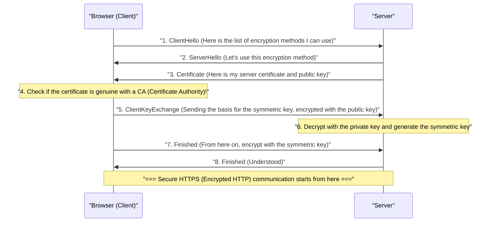

## 1. The Internet is a "Postcard"

While "HTTP", the web communication protocol we usually use, is highly convenient, it has a fatal flaw in terms of security. That is, "**all communication content is sent and received in plaintext (unencrypted plain text)**".

HTTP data flowing through network cables and Wi-Fi signals can easily be peeked at by intermediate routers, ISPs, or malicious hackers (packet sniffers).
To use an analogy, this is like writing your credit card number or password on a "**postcard with its back fully visible**" and dropping it into a mailbox.

The technology that solves this terrifying situation and puts the postcard into an "unbreakable sturdy safe (envelope)", adding the "S" for Security to HTTP, is "**HTTPS (HTTP Secure)**".

## 2. SSL/TLS: A Shield Against Three Threats

HTTPS does not rewrite the HTTP protocol itself. Its structure inserts a layer of an encryption protocol called **SSL/TLS** "before" HTTP communication occurs, creating a secure tunnel there, and then flows HTTP text into it.

SSL (Secure Sockets Layer) was developed by Netscape in 1994, and was later standardized and renamed TLS (Transport Layer Security), but it is still customarily called "SSL/TLS" today.

SSL/TLS protects us from three massive threats on the internet.
1. **Eavesdropping**: Preventing communication content from being seen (Encryption)
2. **Tampering**: Preventing data from being altered in transit (Message Authentication)
3. **Spoofing**: Proving that the communicating party is not a fake site (Digital Certificates)

## 3. The Dilemma of Encryption: Symmetric and Public Keys

To encrypt communication, a "key" is required. However, a major dilemma arises here.

The fastest and most efficient encryption method is "**Symmetric-key cryptography** (e.g., AES)". In this method, the sender and receiver use the "same single key" for encryption and decryption (just like a house key).
However, when shopping on Amazon for the first time over the internet, how can you and Amazon safely share that "symmetric key"? If you send the key itself over the net, it will be stolen by hackers (the key distribution problem).

The technology that brilliantly solved this problem using the power of mathematics is "**Public-key cryptography** (e.g., RSA, Elliptic-curve cryptography)".

In public-key cryptography, a pair of two keys is created: a "padlock (public key)" that can be distributed to anyone, and a "key to open it (private key)" that only you possess.
Amazon scatters its "public key" all over the world. Your browser uses Amazon's public key (padlock) to lock a one-time "symmetric key" into a box with a clunk, and sends it to Amazon.
This box can only ever be opened with the "private key" that only Amazon possesses in the entire world. Even if a hacker steals the box in transit, it is meaningless because they do not have the key to open it.

## 4. Behind HTTPS Communication: The SSL/TLS Handshake

The moment you access `https://...` in your browser, a highly sophisticated negotiation called the "**SSL/TLS Handshake**" takes place behind the scenes between the browser and the server in just fractions of a second.

Because public-key cryptography involves extremely heavy computational processing, encrypting all communication with public keys would overload the server.
Therefore, HTTPS adopts a highly clever hybrid method: "**Use public-key cryptography only for the secure exchange of keys, and use high-speed symmetric-key cryptography for the actual large-volume data communication**".

## 5. Public Key Infrastructure (PKI) and Certificate Authorities (CA)

Here, a final problem remains: "Spoofing".
What if a malicious hacker created a fake site identical to Amazon and sent you their own public key? Your browser would establish secure encrypted communication with the fake site, encrypt your password, and "securely" deliver it to the hacker.

The mechanisms that prevent this are **PKI (Public Key Infrastructure)** and **CA (Certificate Authority)**.

In the world, there are "third-party organizations (Certificate Authorities)" trusted globally, such as DigiCert, GlobalSign, and Let's Encrypt. Companies like Amazon undergo rigorous vetting by these CAs to have a "server certificate" issued, which includes a digital signature stating, "This public key undoubtedly belongs to the real Amazon."

Inside our computers and smartphones (OS and browsers), "root certificates" of these trusted CAs are pre-installed.
When a browser receives a certificate from a server, it compares it against its own root certificates, and only when it can confirm that "this is indeed a genuine certificate signed by a trusted CA," does it display the "secure padlock mark" in the address bar.

## 6. Conclusion: Toward an Era of Always-On SSL

In the past, HTTPS was a special feature used only on a very limited number of pages, such as payment screens where credit card numbers are entered. This was because encryption processing was considered to place a heavy load on servers.

However, due to improvements in CPU performance, technological evolution (the advent of HTTP/2 and HTTP/3), and above all, growing social demands for privacy protection, it has now become a global standard, led by companies like Google, to "make all web pages HTTPS (Always-On SSL)". Today, over 90% of web traffic on the internet is encrypted with HTTPS.

HTTPS is created through the collaboration of invisible, complex mathematical algorithms and a global network of trust (PKI). Behind the screens of the smartphones we casually tap, the robust encryption barriers built by the world's best minds quietly continue to protect our data every day.
