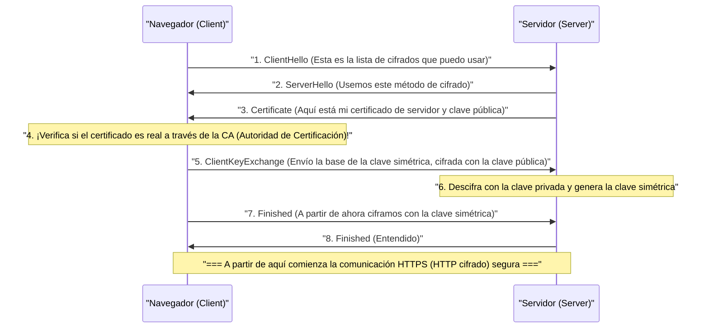

## 1. Internet es una "Postal"

El "HTTP", el protocolo de comunicación web que utilizamos normalmente, es extremadamente conveniente pero tiene una debilidad fatal en términos de seguridad. Y es que "**todo el contenido de la comunicación se envía y recibe en texto plano (texto simple sin cifrar)**".

Los datos HTTP que fluyen a través de los cables de red o las ondas de Wi-Fi pueden ser fácilmente espiados por enrutadores intermedios, proveedores de Internet o hackers maliciosos (sniffers de paquetes).
Esto es comparable a escribir tu número de tarjeta de crédito o contraseña en "**una postal con el reverso completamente visible**" y arrojarla a un buzón de correos.

La tecnología que resuelve esta aterradora situación y envía la postal dentro de una "caja fuerte resistente (sobre) que no se puede abrir bajo ninguna circunstancia", agregando la "S" de Seguridad (Secure) a HTTP, es "**HTTPS (HTTP Secure)**".

## 2. SSL/TLS: El Escudo que nos Protege de Tres Amenazas

HTTPS no reescribe el protocolo HTTP en sí. "Antes" de realizar la comunicación HTTP, interpone una capa del protocolo de cifrado **SSL/TLS**, creando un túnel seguro por el cual se introduce el texto HTTP.

SSL (Secure Sockets Layer) fue desarrollado por Netscape en 1994, y posteriormente estandarizado bajo el nombre de TLS (Transport Layer Security), pero todavía se le llama "SSL/TLS" por costumbre.

SSL/TLS nos protege de tres amenazas gigantescas en Internet:
1. **Espionaje (Eavesdropping)**: Evita que el contenido de la comunicación sea visto (cifrado).
2. **Alteración (Tampering)**: Evita que los datos sean modificados en el camino (autenticación de mensajes).
3. **Suplantación de identidad (Spoofing)**: Demuestra que la otra parte de la comunicación no es un sitio falso (certificados digitales).

## 3. El Dilema del Cifrado: Clave Simétrica y Clave Pública

Para cifrar la comunicación, se necesita una "clave". Sin embargo, aquí surge un gran dilema.

El método de cifrado más rápido y eficiente es el "**cifrado de clave simétrica** (ej. AES)". En este, el remitente y el destinatario poseen "la misma clave única" para cifrar y descifrar (como la llave de tu casa).
Pero, al realizar una compra en Amazon por primera vez en Internet, ¿cómo pueden tú y Amazon compartir esa "clave común" de manera segura? Si envías la clave misma por la red, será robada por un hacker (el problema de distribución de claves).

El "**cifrado de clave pública** (ej. RSA, Criptografía de curva elíptica)" resuelve brillantemente este problema mediante el poder de las matemáticas.

En el cifrado de clave pública, se crea un par compuesto por un "candado (clave pública)" que se puede distribuir a cualquiera, y una "llave para abrirlo (clave privada)" que solo posees tú.
Amazon distribuye su "clave pública" por todo el mundo. Tu navegador utiliza la clave pública de Amazon (el candado) para guardar en una caja la "clave simétrica" que se utilizará solo esta vez, la bloquea y se la envía a Amazon.
Esta caja solo puede ser abierta con la "clave privada" que solo Amazon posee en todo el mundo. Incluso si un hacker roba la caja en el camino, no tiene sentido porque carece de la llave para abrirla.

## 4. El Detrás de Escena de la Comunicación HTTPS: Handshake SSL/TLS

En el instante en que accedes a `https://...` en tu navegador, en fracciones de segundo se lleva a cabo una negociación avanzada llamada "**Handshake SSL/TLS**" entre el navegador y el servidor.

El cifrado de clave pública requiere una gran cantidad de procesamiento computacional, por lo que si todas las comunicaciones se hicieran con clave pública, el servidor colapsaría.
Por ello, HTTPS emplea un método híbrido sumamente inteligente: "**utiliza el cifrado de clave pública solo para el intercambio seguro de claves, y el rápido cifrado de clave simétrica para la transmisión masiva de datos reales**".

## 5. Infraestructura de Clave Pública (PKI) y Autoridad de Certificación (CA)

Queda un último problema: la "suplantación de identidad".
¿Qué sucedería si un hacker malicioso creara un sitio falso idéntico a Amazon y te enviara su propia clave pública? Tu navegador establecería una comunicación cifrada "segura" con el sitio falso, cifraría tu contraseña y se la entregaría "de forma segura" al hacker.

El mecanismo que previene esto es el sistema de **PKI (Public Key Infrastructure: Infraestructura de Clave Pública)** y **CA (Certificate Authority: Autoridad de Certificación)**.

En el mundo existen "instituciones de terceros (Autoridades de Certificación)" en las que se confía globalmente, como DigiCert, GlobalSign o Let's Encrypt. Empresas como Amazon se someten a estrictas revisiones por parte de estas autoridades de certificación para obtener un "certificado de servidor", que es una firma digital que asegura: "esta clave pública pertenece indiscutiblemente al verdadero Amazon".

En nuestras computadoras y teléfonos inteligentes (Sistemas Operativos o navegadores) ya están instalados de antemano los "certificados raíz" de estas autoridades de certificación de confianza.
Cuando el navegador recibe el certificado del servidor, lo compara con el certificado raíz que posee. Solo cuando puede confirmar que "ciertamente es un certificado auténtico firmado por una CA de confianza", muestra la "marca de un candado seguro" en la barra de direcciones.

## 6. Conclusión: Hacia la Era de SSL en Todas Partes (Always-on SSL)

En el pasado, HTTPS era algo especial que se utilizaba solo en un puñado de páginas, como la pantalla de pago donde se ingresaban números de tarjetas de crédito. Esto se debía a que se pensaba que el procesamiento del cifrado sobrecargaría el servidor.

Sin embargo, gracias a la mejora en el rendimiento de los procesadores y la evolución de la tecnología (la llegada de HTTP/2 y HTTP/3), y sobre todo, la creciente demanda social de protección a la privacidad, la iniciativa liderada por entidades como Google de "migrar todas las páginas web a HTTPS (SSL en todo momento)" se ha convertido en el estándar mundial. Hoy en día, más del 90% del tráfico web en Internet está cifrado con HTTPS.

HTTPS es creado a través de la colaboración entre complejos algoritmos matemáticos invisibles y una red mundial de confianza (PKI). Detrás de la pantalla del teléfono inteligente que tocamos casualmente, los robustos escudos criptográficos construidos por las mentes más brillantes del mundo continúan protegiendo silenciosamente nuestros datos día tras día.
