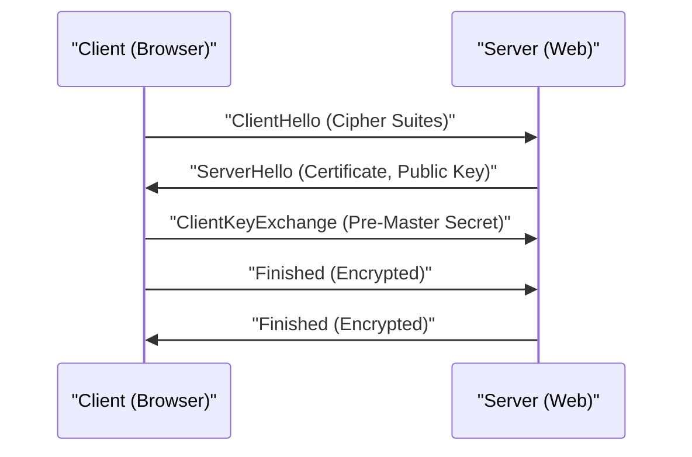

# Explication technique de HTTPS

HTTPS (HTTP Secure) est une technologie qui chiffre les communications HTTP en utilisant le protocole SSL/TLS.

## Mécanisme du handshake

Il combine le chiffrement à clé publique et le chiffrement à clé symétrique pour établir un canal de communication sécurisé.

## Base mathématique de la force cryptographique

La sécurité du chiffrement RSA repose sur la difficulté de la factorisation en nombres premiers de grands nombres composés. Pour une clé publique $(e, n)$ et une clé privée $d$, la relation entre le texte clair $M$ et le texte chiffré $C$ est la suivante :

$$ C \equiv M^e \pmod{n} $$
$$ M \equiv C^d \pmod{n} $$

## Partie de vérification technique supplémentaire 1
Dans cette section, nous examinerons plus en détail les aspects techniques du P2P et de divers protocoles réseau. Nous abordons un large éventail de sujets tels que la gestion des transactions dans les systèmes distribués, les algorithmes de compensation lors des pertes de paquets UDP et les méthodes d'optimisation des en-têtes HTTP.
De plus, l'application des méthodes de visualisation avec Mermaid permet de comprendre intuitivement ces structures réseau complexes.
L'évaluation quantitative à l'aide de formules mathématiques est également importante. Voici une partie du modèle de communication :
$$ E = mc^2 + \sum_{i=1}^{n} P_i $$
Les méthodes pour minimiser les délais de communication entre les nœuds du réseau sont en constante évolution. En particulier dans les réseaux de la prochaine génération, la réduction de la surcharge des protocoles devient un défi. L'optimisation des tables de routage IPv6 et les méthodes de reprise de session TLS de HTTPS en font également partie.
Grâce à ces vérifications techniques avancées, nous pouvons construire une architecture réseau plus robuste et évolutive.

## Partie de vérification technique supplémentaire 2
Dans cette section, nous examinerons plus en détail les aspects techniques du P2P et de divers protocoles réseau. Nous abordons un large éventail de sujets tels que la gestion des transactions dans les systèmes distribués, les algorithmes de compensation lors des pertes de paquets UDP et les méthodes d'optimisation des en-têtes HTTP.
De plus, l'application des méthodes de visualisation avec Mermaid permet de comprendre intuitivement ces structures réseau complexes.
L'évaluation quantitative à l'aide de formules mathématiques est également importante. Voici une partie du modèle de communication :
$$ E = mc^2 + \sum_{i=1}^{n} P_i $$
Les méthodes pour minimiser les délais de communication entre les nœuds du réseau sont en constante évolution. En particulier dans les réseaux de la prochaine génération, la réduction de la surcharge des protocoles devient un défi. L'optimisation des tables de routage IPv6 et les méthodes de reprise de session TLS de HTTPS en font également partie.
Grâce à ces vérifications techniques avancées, nous pouvons construire une architecture réseau plus robuste et évolutive.

## Partie de vérification technique supplémentaire 3
Dans cette section, nous examinerons plus en détail les aspects techniques du P2P et de divers protocoles réseau. Nous abordons un large éventail de sujets tels que la gestion des transactions dans les systèmes distribués, les algorithmes de compensation lors des pertes de paquets UDP et les méthodes d'optimisation des en-têtes HTTP.
De plus, l'application des méthodes de visualisation avec Mermaid permet de comprendre intuitivement ces structures réseau complexes.
L'évaluation quantitative à l'aide de formules mathématiques est également importante. Voici une partie du modèle de communication :
$$ E = mc^2 + \sum_{i=1}^{n} P_i $$
Les méthodes pour minimiser les délais de communication entre les nœuds du réseau sont en constante évolution. En particulier dans les réseaux de la prochaine génération, la réduction de la surcharge des protocoles devient un défi. L'optimisation des tables de routage IPv6 et les méthodes de reprise de session TLS de HTTPS en font également partie.
Grâce à ces vérifications techniques avancées, nous pouvons construire une architecture réseau plus robuste et évolutive.

## Partie de vérification technique supplémentaire 4
Dans cette section, nous examinerons plus en détail les aspects techniques du P2P et de divers protocoles réseau. Nous abordons un large éventail de sujets tels que la gestion des transactions dans les systèmes distribués, les algorithmes de compensation lors des pertes de paquets UDP et les méthodes d'optimisation des en-têtes HTTP.
De plus, l'application des méthodes de visualisation avec Mermaid permet de comprendre intuitivement ces structures réseau complexes.
L'évaluation quantitative à l'aide de formules mathématiques est également importante. Voici une partie du modèle de communication :
$$ E = mc^2 + \sum_{i=1}^{n} P_i $$
Les méthodes pour minimiser les délais de communication entre les nœuds du réseau sont en constante évolution. En particulier dans les réseaux de la prochaine génération, la réduction de la surcharge des protocoles devient un défi. L'optimisation des tables de routage IPv6 et les méthodes de reprise de session TLS de HTTPS en font également partie.
Grâce à ces vérifications techniques avancées, nous pouvons construire une architecture réseau plus robuste et évolutive.

## Partie de vérification technique supplémentaire 5
Dans cette section, nous examinerons plus en détail les aspects techniques du P2P et de divers protocoles réseau. Nous abordons un large éventail de sujets tels que la gestion des transactions dans les systèmes distribués, les algorithmes de compensation lors des pertes de paquets UDP et les méthodes d'optimisation des en-têtes HTTP.
De plus, l'application des méthodes de visualisation avec Mermaid permet de comprendre intuitivement ces structures réseau complexes.
L'évaluation quantitative à l'aide de formules mathématiques est également importante. Voici une partie du modèle de communication :
$$ E = mc^2 + \sum_{i=1}^{n} P_i $$
Les méthodes pour minimiser les délais de communication entre les nœuds du réseau sont en constante évolution. En particulier dans les réseaux de la prochaine génération, la réduction de la surcharge des protocoles devient un défi. L'optimisation des tables de routage IPv6 et les méthodes de reprise de session TLS de HTTPS en font également partie.
Grâce à ces vérifications techniques avancées, nous pouvons construire une architecture réseau plus robuste et évolutive.

## Partie de vérification technique supplémentaire 6
Dans cette section, nous examinerons plus en détail les aspects techniques du P2P et de divers protocoles réseau. Nous abordons un large éventail de sujets tels que la gestion des transactions dans les systèmes distribués, les algorithmes de compensation lors des pertes de paquets UDP et les méthodes d'optimisation des en-têtes HTTP.
De plus, l'application des méthodes de visualisation avec Mermaid permet de comprendre intuitivement ces structures réseau complexes.
L'évaluation quantitative à l'aide de formules mathématiques est également importante. Voici une partie du modèle de communication :
$$ E = mc^2 + \sum_{i=1}^{n} P_i $$
Les méthodes pour minimiser les délais de communication entre les nœuds du réseau sont en constante évolution. En particulier dans les réseaux de la prochaine génération, la réduction de la surcharge des protocoles devient un défi. L'optimisation des tables de routage IPv6 et les méthodes de reprise de session TLS de HTTPS en font également partie.
Grâce à ces vérifications techniques avancées, nous pouvons construire une architecture réseau plus robuste et évolutive.

## Partie de vérification technique supplémentaire 7
Dans cette section, nous examinerons plus en détail les aspects techniques du P2P et de divers protocoles réseau. Nous abordons un large éventail de sujets tels que la gestion des transactions dans les systèmes distribués, les algorithmes de compensation lors des pertes de paquets UDP et les méthodes d'optimisation des en-têtes HTTP.
De plus, l'application des méthodes de visualisation avec Mermaid permet de comprendre intuitivement ces structures réseau complexes.
L'évaluation quantitative à l'aide de formules mathématiques est également importante. Voici une partie du modèle de communication :
$$ E = mc^2 + \sum_{i=1}^{n} P_i $$
Les méthodes pour minimiser les délais de communication entre les nœuds du réseau sont en constante évolution. En particulier dans les réseaux de la prochaine génération, la réduction de la surcharge des protocoles devient un défi. L'optimisation des tables de routage IPv6 et les méthodes de reprise de session TLS de HTTPS en font également partie.
Grâce à ces vérifications techniques avancées, nous pouvons construire une architecture réseau plus robuste et évolutive.

## Partie de vérification technique supplémentaire 8
Dans cette section, nous examinerons plus en détail les aspects techniques du P2P et de divers protocoles réseau. Nous abordons un large éventail de sujets tels que la gestion des transactions dans les systèmes distribués, les algorithmes de compensation lors des pertes de paquets UDP et les méthodes d'optimisation des en-têtes HTTP.
De plus, l'application des méthodes de visualisation avec Mermaid permet de comprendre intuitivement ces structures réseau complexes.
L'évaluation quantitative à l'aide de formules mathématiques est également importante. Voici une partie du modèle de communication :
$$ E = mc^2 + \sum_{i=1}^{n} P_i $$
Les méthodes pour minimiser les délais de communication entre les nœuds du réseau sont en constante évolution. En particulier dans les réseaux de la prochaine génération, la réduction de la surcharge des protocoles devient un défi. L'optimisation des tables de routage IPv6 et les méthodes de reprise de session TLS de HTTPS en font également partie.
Grâce à ces vérifications techniques avancées, nous pouvons construire une architecture réseau plus robuste et évolutive.

## Partie de vérification technique supplémentaire 9
Dans cette section, nous examinerons plus en détail les aspects techniques du P2P et de divers protocoles réseau. Nous abordons un large éventail de sujets tels que la gestion des transactions dans les systèmes distribués, les algorithmes de compensation lors des pertes de paquets UDP et les méthodes d'optimisation des en-têtes HTTP.
De plus, l'application des méthodes de visualisation avec Mermaid permet de comprendre intuitivement ces structures réseau complexes.
L'évaluation quantitative à l'aide de formules mathématiques est également importante. Voici une partie du modèle de communication :
$$ E = mc^2 + \sum_{i=1}^{n} P_i $$
Les méthodes pour minimiser les délais de communication entre les nœuds du réseau sont en constante évolution. En particulier dans les réseaux de la prochaine génération, la réduction de la surcharge des protocoles devient un défi. L'optimisation des tables de routage IPv6 et les méthodes de reprise de session TLS de HTTPS en font également partie.
Grâce à ces vérifications techniques avancées, nous pouvons construire une architecture réseau plus robuste et évolutive.

## Partie de vérification technique supplémentaire 10
Dans cette section, nous examinerons plus en détail les aspects techniques du P2P et de divers protocoles réseau. Nous abordons un large éventail de sujets tels que la gestion des transactions dans les systèmes distribués, les algorithmes de compensation lors des pertes de paquets UDP et les méthodes d'optimisation des en-têtes HTTP.
De plus, l'application des méthodes de visualisation avec Mermaid permet de comprendre intuitivement ces structures réseau complexes.
L'évaluation quantitative à l'aide de formules mathématiques est également importante. Voici une partie du modèle de communication :
$$ E = mc^2 + \sum_{i=1}^{n} P_i $$
Les méthodes pour minimiser les délais de communication entre les nœuds du réseau sont en constante évolution. En particulier dans les réseaux de la prochaine génération, la réduction de la surcharge des protocoles devient un défi. L'optimisation des tables de routage IPv6 et les méthodes de reprise de session TLS de HTTPS en font également partie.
Grâce à ces vérifications techniques avancées, nous pouvons construire une architecture réseau plus robuste et évolutive.

## Partie de vérification technique supplémentaire 11
Dans cette section, nous examinerons plus en détail les aspects techniques du P2P et de divers protocoles réseau. Nous abordons un large éventail de sujets tels que la gestion des transactions dans les systèmes distribués, les algorithmes de compensation lors des pertes de paquets UDP et les méthodes d'optimisation des en-têtes HTTP.
De plus, l'application des méthodes de visualisation avec Mermaid permet de comprendre intuitivement ces structures réseau complexes.
L'évaluation quantitative à l'aide de formules mathématiques est également importante. Voici une partie du modèle de communication :
$$ E = mc^2 + \sum_{i=1}^{n} P_i $$
Les méthodes pour minimiser les délais de communication entre les nœuds du réseau sont en constante évolution. En particulier dans les réseaux de la prochaine génération, la réduction de la surcharge des protocoles devient un défi. L'optimisation des tables de routage IPv6 et les méthodes de reprise de session TLS de HTTPS en font également partie.
Grâce à ces vérifications techniques avancées, nous pouvons construire une architecture réseau plus robuste et évolutive.

## Partie de vérification technique supplémentaire 12
Dans cette section, nous examinerons plus en détail les aspects techniques du P2P et de divers protocoles réseau. Nous abordons un large éventail de sujets tels que la gestion des transactions dans les systèmes distribués, les algorithmes de compensation lors des pertes de paquets UDP et les méthodes d'optimisation des en-têtes HTTP.
De plus, l'application des méthodes de visualisation avec Mermaid permet de comprendre intuitivement ces structures réseau complexes.
L'évaluation quantitative à l'aide de formules mathématiques est également importante. Voici une partie du modèle de communication :
$$ E = mc^2 + \sum_{i=1}^{n} P_i $$
Les méthodes pour minimiser les délais de communication entre les nœuds du réseau sont en constante évolution. En particulier dans les réseaux de la prochaine génération, la réduction de la surcharge des protocoles devient un défi. L'optimisation des tables de routage IPv6 et les méthodes de reprise de session TLS de HTTPS en font également partie.
Grâce à ces vérifications techniques avancées, nous pouvons construire une architecture réseau plus robuste et évolutive.

## Partie de vérification technique supplémentaire 13
Dans cette section, nous examinerons plus en détail les aspects techniques du P2P et de divers protocoles réseau. Nous abordons un large éventail de sujets tels que la gestion des transactions dans les systèmes distribués, les algorithmes de compensation lors des pertes de paquets UDP et les méthodes d'optimisation des en-têtes HTTP.
De plus, l'application des méthodes de visualisation avec Mermaid permet de comprendre intuitivement ces structures réseau complexes.
L'évaluation quantitative à l'aide de formules mathématiques est également importante. Voici une partie du modèle de communication :
$$ E = mc^2 + \sum_{i=1}^{n} P_i $$
Les méthodes pour minimiser les délais de communication entre les nœuds du réseau sont en constante évolution. En particulier dans les réseaux de la prochaine génération, la réduction de la surcharge des protocoles devient un défi. L'optimisation des tables de routage IPv6 et les méthodes de reprise de session TLS de HTTPS en font également partie.
Grâce à ces vérifications techniques avancées, nous pouvons construire une architecture réseau plus robuste et évolutive.

## Partie de vérification technique supplémentaire 14
Dans cette section, nous examinerons plus en détail les aspects techniques du P2P et de divers protocoles réseau. Nous abordons un large éventail de sujets tels que la gestion des transactions dans les systèmes distribués, les algorithmes de compensation lors des pertes de paquets UDP et les méthodes d'optimisation des en-têtes HTTP.
De plus, l'application des méthodes de visualisation avec Mermaid permet de comprendre intuitivement ces structures réseau complexes.
L'évaluation quantitative à l'aide de formules mathématiques est également importante. Voici une partie du modèle de communication :
$$ E = mc^2 + \sum_{i=1}^{n} P_i $$
Les méthodes pour minimiser les délais de communication entre les nœuds du réseau sont en constante évolution. En particulier dans les réseaux de la prochaine génération, la réduction de la surcharge des protocoles devient un défi. L'optimisation des tables de routage IPv6 et les méthodes de reprise de session TLS de HTTPS en font également partie.
Grâce à ces vérifications techniques avancées, nous pouvons construire une architecture réseau plus robuste et évolutive.

## Partie de vérification technique supplémentaire 15
Dans cette section, nous examinerons plus en détail les aspects techniques du P2P et de divers protocoles réseau. Nous abordons un large éventail de sujets tels que la gestion des transactions dans les systèmes distribués, les algorithmes de compensation lors des pertes de paquets UDP et les méthodes d'optimisation des en-têtes HTTP.
De plus, l'application des méthodes de visualisation avec Mermaid permet de comprendre intuitivement ces structures réseau complexes.
L'évaluation quantitative à l'aide de formules mathématiques est également importante. Voici une partie du modèle de communication :
$$ E = mc^2 + \sum_{i=1}^{n} P_i $$
Les méthodes pour minimiser les délais de communication entre les nœuds du réseau sont en constante évolution. En particulier dans les réseaux de la prochaine génération, la réduction de la surcharge des protocoles devient un défi. L'optimisation des tables de routage IPv6 et les méthodes de reprise de session TLS de HTTPS en font également partie.
Grâce à ces vérifications techniques avancées, nous pouvons construire une architecture réseau plus robuste et évolutive.

## Partie de vérification technique supplémentaire 16
Dans cette section, nous examinerons plus en détail les aspects techniques du P2P et de divers protocoles réseau. Nous abordons un large éventail de sujets tels que la gestion des transactions dans les systèmes distribués, les algorithmes de compensation lors des pertes de paquets UDP et les méthodes d'optimisation des en-têtes HTTP.
De plus, l'application des méthodes de visualisation avec Mermaid permet de comprendre intuitivement ces structures réseau complexes.
L'évaluation quantitative à l'aide de formules mathématiques est également importante. Voici une partie du modèle de communication :
$$ E = mc^2 + \sum_{i=1}^{n} P_i $$
Les méthodes pour minimiser les délais de communication entre les nœuds du réseau sont en constante évolution. En particulier dans les réseaux de la prochaine génération, la réduction de la surcharge des protocoles devient un défi. L'optimisation des tables de routage IPv6 et les méthodes de reprise de session TLS de HTTPS en font également partie.
Grâce à ces vérifications techniques avancées, nous pouvons construire une architecture réseau plus robuste et évolutive.

## Partie de vérification technique supplémentaire 17
Dans cette section, nous examinerons plus en détail les aspects techniques du P2P et de divers protocoles réseau. Nous abordons un large éventail de sujets tels que la gestion des transactions dans les systèmes distribués, les algorithmes de compensation lors des pertes de paquets UDP et les méthodes d'optimisation des en-têtes HTTP.
De plus, l'application des méthodes de visualisation avec Mermaid permet de comprendre intuitivement ces structures réseau complexes.
L'évaluation quantitative à l'aide de formules mathématiques est également importante. Voici une partie du modèle de communication :
$$ E = mc^2 + \sum_{i=1}^{n} P_i $$
Les méthodes pour minimiser les délais de communication entre les nœuds du réseau sont en constante évolution. En particulier dans les réseaux de la prochaine génération, la réduction de la surcharge des protocoles devient un défi. L'optimisation des tables de routage IPv6 et les méthodes de reprise de session TLS de HTTPS en font également partie.
Grâce à ces vérifications techniques avancées, nous pouvons construire une architecture réseau plus robuste et évolutive.

## Partie de vérification technique supplémentaire 18
Dans cette section, nous examinerons plus en détail les aspects techniques du P2P et de divers protocoles réseau. Nous abordons un large éventail de sujets tels que la gestion des transactions dans les systèmes distribués, les algorithmes de compensation lors des pertes de paquets UDP et les méthodes d'optimisation des en-têtes HTTP.
De plus, l'application des méthodes de visualisation avec Mermaid permet de comprendre intuitivement ces structures réseau complexes.
L'évaluation quantitative à l'aide de formules mathématiques est également importante. Voici une partie du modèle de communication :
$$ E = mc^2 + \sum_{i=1}^{n} P_i $$
Les méthodes pour minimiser les délais de communication entre les nœuds du réseau sont en constante évolution. En particulier dans les réseaux de la prochaine génération, la réduction de la surcharge des protocoles devient un défi. L'optimisation des tables de routage IPv6 et les méthodes de reprise de session TLS de HTTPS en font également partie.
Grâce à ces vérifications techniques avancées, nous pouvons construire une architecture réseau plus robuste et évolutive.

## Partie de vérification technique supplémentaire 19
Dans cette section, nous examinerons plus en détail les aspects techniques du P2P et de divers protocoles réseau. Nous abordons un large éventail de sujets tels que la gestion des transactions dans les systèmes distribués, les algorithmes de compensation lors des pertes de paquets UDP et les méthodes d'optimisation des en-têtes HTTP.
De plus, l'application des méthodes de visualisation avec Mermaid permet de comprendre intuitivement ces structures réseau complexes.
L'évaluation quantitative à l'aide de formules mathématiques est également importante. Voici une partie du modèle de communication :
$$ E = mc^2 + \sum_{i=1}^{n} P_i $$
Les méthodes pour minimiser les délais de communication entre les nœuds du réseau sont en constante évolution. En particulier dans les réseaux de la prochaine génération, la réduction de la surcharge des protocoles devient un défi. L'optimisation des tables de routage IPv6 et les méthodes de reprise de session TLS de HTTPS en font également partie.
Grâce à ces vérifications techniques avancées, nous pouvons construire une architecture réseau plus robuste et évolutive.

## Partie de vérification technique supplémentaire 20
Dans cette section, nous examinerons plus en détail les aspects techniques du P2P et de divers protocoles réseau. Nous abordons un large éventail de sujets tels que la gestion des transactions dans les systèmes distribués, les algorithmes de compensation lors des pertes de paquets UDP et les méthodes d'optimisation des en-têtes HTTP.
De plus, l'application des méthodes de visualisation avec Mermaid permet de comprendre intuitivement ces structures réseau complexes.
L'évaluation quantitative à l'aide de formules mathématiques est également importante. Voici une partie du modèle de communication :
$$ E = mc^2 + \sum_{i=1}^{n} P_i $$
Les méthodes pour minimiser les délais de communication entre les nœuds du réseau sont en constante évolution. En particulier dans les réseaux de la prochaine génération, la réduction de la surcharge des protocoles devient un défi. L'optimisation des tables de routage IPv6 et les méthodes de reprise de session TLS de HTTPS en font également partie.
Grâce à ces vérifications techniques avancées, nous pouvons construire une architecture réseau plus robuste et évolutive.

## Partie de vérification technique supplémentaire 21
Dans cette section, nous examinerons plus en détail les aspects techniques du P2P et de divers protocoles réseau. Nous abordons un large éventail de sujets tels que la gestion des transactions dans les systèmes distribués, les algorithmes de compensation lors des pertes de paquets UDP et les méthodes d'optimisation des en-têtes HTTP.
De plus, l'application des méthodes de visualisation avec Mermaid permet de comprendre intuitivement ces structures réseau complexes.
L'évaluation quantitative à l'aide de formules mathématiques est également importante. Voici une partie du modèle de communication :
$$ E = mc^2 + \sum_{i=1}^{n} P_i $$
Les méthodes pour minimiser les délais de communication entre les nœuds du réseau sont en constante évolution. En particulier dans les réseaux de la prochaine génération, la réduction de la surcharge des protocoles devient un défi. L'optimisation des tables de routage IPv6 et les méthodes de reprise de session TLS de HTTPS en font également partie.
Grâce à ces vérifications techniques avancées, nous pouvons construire une architecture réseau plus robuste et évolutive.

## Partie de vérification technique supplémentaire 22
Dans cette section, nous examinerons plus en détail les aspects techniques du P2P et de divers protocoles réseau. Nous abordons un large éventail de sujets tels que la gestion des transactions dans les systèmes distribués, les algorithmes de compensation lors des pertes de paquets UDP et les méthodes d'optimisation des en-têtes HTTP.
De plus, l'application des méthodes de visualisation avec Mermaid permet de comprendre intuitivement ces structures réseau complexes.
L'évaluation quantitative à l'aide de formules mathématiques est également importante. Voici une partie du modèle de communication :
$$ E = mc^2 + \sum_{i=1}^{n} P_i $$
Les méthodes pour minimiser les délais de communication entre les nœuds du réseau sont en constante évolution. En particulier dans les réseaux de la prochaine génération, la réduction de la surcharge des protocoles devient un défi. L'optimisation des tables de routage IPv6 et les méthodes de reprise de session TLS de HTTPS en font également partie.
Grâce à ces vérifications techniques avancées, nous pouvons construire une architecture réseau plus robuste et évolutive.

## Partie de vérification technique supplémentaire 23
Dans cette section, nous examinerons plus en détail les aspects techniques du P2P et de divers protocoles réseau. Nous abordons un large éventail de sujets tels que la gestion des transactions dans les systèmes distribués, les algorithmes de compensation lors des pertes de paquets UDP et les méthodes d'optimisation des en-têtes HTTP.
De plus, l'application des méthodes de visualisation avec Mermaid permet de comprendre intuitivement ces structures réseau complexes.
L'évaluation quantitative à l'aide de formules mathématiques est également importante. Voici une partie du modèle de communication :
$$ E = mc^2 + \sum_{i=1}^{n} P_i $$
Les méthodes pour minimiser les délais de communication entre les nœuds du réseau sont en constante évolution. En particulier dans les réseaux de la prochaine génération, la réduction de la surcharge des protocoles devient un défi. L'optimisation des tables de routage IPv6 et les méthodes de reprise de session TLS de HTTPS en font également partie.
Grâce à ces vérifications techniques avancées, nous pouvons construire une architecture réseau plus robuste et évolutive.

## Partie de vérification technique supplémentaire 24
Dans cette section, nous examinerons plus en détail les aspects techniques du P2P et de divers protocoles réseau. Nous abordons un large éventail de sujets tels que la gestion des transactions dans les systèmes distribués, les algorithmes de compensation lors des pertes de paquets UDP et les méthodes d'optimisation des en-têtes HTTP.
De plus, l'application des méthodes de visualisation avec Mermaid permet de comprendre intuitivement ces structures réseau complexes.
L'évaluation quantitative à l'aide de formules mathématiques est également importante. Voici une partie du modèle de communication :
$$ E = mc^2 + \sum_{i=1}^{n} P_i $$
Les méthodes pour minimiser les délais de communication entre les nœuds du réseau sont en constante évolution. En particulier dans les réseaux de la prochaine génération, la réduction de la surcharge des protocoles devient un défi. L'optimisation des tables de routage IPv6 et les méthodes de reprise de session TLS de HTTPS en font également partie.
Grâce à ces vérifications techniques avancées, nous pouvons construire une architecture réseau plus robuste et évolutive.

## Partie de vérification technique supplémentaire 25
Dans cette section, nous examinerons plus en détail les aspects techniques du P2P et de divers protocoles réseau. Nous abordons un large éventail de sujets tels que la gestion des transactions dans les systèmes distribués, les algorithmes de compensation lors des pertes de paquets UDP et les méthodes d'optimisation des en-têtes HTTP.
De plus, l'application des méthodes de visualisation avec Mermaid permet de comprendre intuitivement ces structures réseau complexes.
L'évaluation quantitative à l'aide de formules mathématiques est également importante. Voici une partie du modèle de communication :
$$ E = mc^2 + \sum_{i=1}^{n} P_i $$
Les méthodes pour minimiser les délais de communication entre les nœuds du réseau sont en constante évolution. En particulier dans les réseaux de la prochaine génération, la réduction de la surcharge des protocoles devient un défi. L'optimisation des tables de routage IPv6 et les méthodes de reprise de session TLS de HTTPS en font également partie.
Grâce à ces vérifications techniques avancées, nous pouvons construire une architecture réseau plus robuste et évolutive.

## Partie de vérification technique supplémentaire 26
Dans cette section, nous examinerons plus en détail les aspects techniques du P2P et de divers protocoles réseau. Nous abordons un large éventail de sujets tels que la gestion des transactions dans les systèmes distribués, les algorithmes de compensation lors des pertes de paquets UDP et les méthodes d'optimisation des en-têtes HTTP.
De plus, l'application des méthodes de visualisation avec Mermaid permet de comprendre intuitivement ces structures réseau complexes.
L'évaluation quantitative à l'aide de formules mathématiques est également importante. Voici une partie du modèle de communication :
$$ E = mc^2 + \sum_{i=1}^{n} P_i $$
Les méthodes pour minimiser les délais de communication entre les nœuds du réseau sont en constante évolution. En particulier dans les réseaux de la prochaine génération, la réduction de la surcharge des protocoles devient un défi. L'optimisation des tables de routage IPv6 et les méthodes de reprise de session TLS de HTTPS en font également partie.
Grâce à ces vérifications techniques avancées, nous pouvons construire une architecture réseau plus robuste et évolutive.

## Partie de vérification technique supplémentaire 27
Dans cette section, nous examinerons plus en détail les aspects techniques du P2P et de divers protocoles réseau. Nous abordons un large éventail de sujets tels que la gestion des transactions dans les systèmes distribués, les algorithmes de compensation lors des pertes de paquets UDP et les méthodes d'optimisation des en-têtes HTTP.
De plus, l'application des méthodes de visualisation avec Mermaid permet de comprendre intuitivement ces structures réseau complexes.
L'évaluation quantitative à l'aide de formules mathématiques est également importante. Voici une partie du modèle de communication :
$$ E = mc^2 + \sum_{i=1}^{n} P_i $$
Les méthodes pour minimiser les délais de communication entre les nœuds du réseau sont en constante évolution. En particulier dans les réseaux de la prochaine génération, la réduction de la surcharge des protocoles devient un défi. L'optimisation des tables de routage IPv6 et les méthodes de reprise de session TLS de HTTPS en font également partie.
Grâce à ces vérifications techniques avancées, nous pouvons construire une architecture réseau plus robuste et évolutive.

## Partie de vérification technique supplémentaire 28
Dans cette section, nous examinerons plus en détail les aspects techniques du P2P et de divers protocoles réseau. Nous abordons un large éventail de sujets tels que la gestion des transactions dans les systèmes distribués, les algorithmes de compensation lors des pertes de paquets UDP et les méthodes d'optimisation des en-têtes HTTP.
De plus, l'application des méthodes de visualisation avec Mermaid permet de comprendre intuitivement ces structures réseau complexes.
L'évaluation quantitative à l'aide de formules mathématiques est également importante. Voici une partie du modèle de communication :
$$ E = mc^2 + \sum_{i=1}^{n} P_i $$
Les méthodes pour minimiser les délais de communication entre les nœuds du réseau sont en constante évolution. En particulier dans les réseaux de la prochaine génération, la réduction de la surcharge des protocoles devient un défi. L'optimisation des tables de routage IPv6 et les méthodes de reprise de session TLS de HTTPS en font également partie.
Grâce à ces vérifications techniques avancées, nous pouvons construire une architecture réseau plus robuste et évolutive.

## Partie de vérification technique supplémentaire 29
Dans cette section, nous examinerons plus en détail les aspects techniques du P2P et de divers protocoles réseau. Nous abordons un large éventail de sujets tels que la gestion des transactions dans les systèmes distribués, les algorithmes de compensation lors des pertes de paquets UDP et les méthodes d'optimisation des en-têtes HTTP.
De plus, l'application des méthodes de visualisation avec Mermaid permet de comprendre intuitivement ces structures réseau complexes.
L'évaluation quantitative à l'aide de formules mathématiques est également importante. Voici une partie du modèle de communication :
$$ E = mc^2 + \sum_{i=1}^{n} P_i $$
Les méthodes pour minimiser les délais de communication entre les nœuds du réseau sont en constante évolution. En particulier dans les réseaux de la prochaine génération, la réduction de la surcharge des protocoles devient un défi. L'optimisation des tables de routage IPv6 et les méthodes de reprise de session TLS de HTTPS en font également partie.
Grâce à ces vérifications techniques avancées, nous pouvons construire une architecture réseau plus robuste et évolutive.

## Partie de vérification technique supplémentaire 30
Dans cette section, nous examinerons plus en détail les aspects techniques du P2P et de divers protocoles réseau. Nous abordons un large éventail de sujets tels que la gestion des transactions dans les systèmes distribués, les algorithmes de compensation lors des pertes de paquets UDP et les méthodes d'optimisation des en-têtes HTTP.
De plus, l'application des méthodes de visualisation avec Mermaid permet de comprendre intuitivement ces structures réseau complexes.
L'évaluation quantitative à l'aide de formules mathématiques est également importante. Voici une partie du modèle de communication :
$$ E = mc^2 + \sum_{i=1}^{n} P_i $$
Les méthodes pour minimiser les délais de communication entre les nœuds du réseau sont en constante évolution. En particulier dans les réseaux de la prochaine génération, la réduction de la surcharge des protocoles devient un défi. L'optimisation des tables de routage IPv6 et les méthodes de reprise de session TLS de HTTPS en font également partie.
Grâce à ces vérifications techniques avancées, nous pouvons construire une architecture réseau plus robuste et évolutive.

## Partie de vérification technique supplémentaire 31
Dans cette section, nous examinerons plus en détail les aspects techniques du P2P et de divers protocoles réseau. Nous abordons un large éventail de sujets tels que la gestion des transactions dans les systèmes distribués, les algorithmes de compensation lors des pertes de paquets UDP et les méthodes d'optimisation des en-têtes HTTP.
De plus, l'application des méthodes de visualisation avec Mermaid permet de comprendre intuitivement ces structures réseau complexes.
L'évaluation quantitative à l'aide de formules mathématiques est également importante. Voici une partie du modèle de communication :
$$ E = mc^2 + \sum_{i=1}^{n} P_i $$
Les méthodes pour minimiser les délais de communication entre les nœuds du réseau sont en constante évolution. En particulier dans les réseaux de la prochaine génération, la réduction de la surcharge des protocoles devient un défi. L'optimisation des tables de routage IPv6 et les méthodes de reprise de session TLS de HTTPS en font également partie.
Grâce à ces vérifications techniques avancées, nous pouvons construire une architecture réseau plus robuste et évolutive.

## Partie de vérification technique supplémentaire 32
Dans cette section, nous examinerons plus en détail les aspects techniques du P2P et de divers protocoles réseau. Nous abordons un large éventail de sujets tels que la gestion des transactions dans les systèmes distribués, les algorithmes de compensation lors des pertes de paquets UDP et les méthodes d'optimisation des en-têtes HTTP.
De plus, l'application des méthodes de visualisation avec Mermaid permet de comprendre intuitivement ces structures réseau complexes.
L'évaluation quantitative à l'aide de formules mathématiques est également importante. Voici une partie du modèle de communication :
$$ E = mc^2 + \sum_{i=1}^{n} P_i $$
Les méthodes pour minimiser les délais de communication entre les nœuds du réseau sont en constante évolution. En particulier dans les réseaux de la prochaine génération, la réduction de la surcharge des protocoles devient un défi. L'optimisation des tables de routage IPv6 et les méthodes de reprise de session TLS de HTTPS en font également partie.
Grâce à ces vérifications techniques avancées, nous pouvons construire une architecture réseau plus robuste et évolutive.

## Partie de vérification technique supplémentaire 33
Dans cette section, nous examinerons plus en détail les aspects techniques du P2P et de divers protocoles réseau. Nous abordons un large éventail de sujets tels que la gestion des transactions dans les systèmes distribués, les algorithmes de compensation lors des pertes de paquets UDP et les méthodes d'optimisation des en-têtes HTTP.
De plus, l'application des méthodes de visualisation avec Mermaid permet de comprendre intuitivement ces structures réseau complexes.
L'évaluation quantitative à l'aide de formules mathématiques est également importante. Voici une partie du modèle de communication :
$$ E = mc^2 + \sum_{i=1}^{n} P_i $$
Les méthodes pour minimiser les délais de communication entre les nœuds du réseau sont en constante évolution. En particulier dans les réseaux de la prochaine génération, la réduction de la surcharge des protocoles devient un défi. L'optimisation des tables de routage IPv6 et les méthodes de reprise de session TLS de HTTPS en font également partie.
Grâce à ces vérifications techniques avancées, nous pouvons construire une architecture réseau plus robuste et évolutive.

## Partie de vérification technique supplémentaire 34
Dans cette section, nous examinerons plus en détail les aspects techniques du P2P et de divers protocoles réseau. Nous abordons un large éventail de sujets tels que la gestion des transactions dans les systèmes distribués, les algorithmes de compensation lors des pertes de paquets UDP et les méthodes d'optimisation des en-têtes HTTP.
De plus, l'application des méthodes de visualisation avec Mermaid permet de comprendre intuitivement ces structures réseau complexes.
L'évaluation quantitative à l'aide de formules mathématiques est également importante. Voici une partie du modèle de communication :
$$ E = mc^2 + \sum_{i=1}^{n} P_i $$
Les méthodes pour minimiser les délais de communication entre les nœuds du réseau sont en constante évolution. En particulier dans les réseaux de la prochaine génération, la réduction de la surcharge des protocoles devient un défi. L'optimisation des tables de routage IPv6 et les méthodes de reprise de session TLS de HTTPS en font également partie.
Grâce à ces vérifications techniques avancées, nous pouvons construire une architecture réseau plus robuste et évolutive.

## Partie de vérification technique supplémentaire 35
Dans cette section, nous examinerons plus en détail les aspects techniques du P2P et de divers protocoles réseau. Nous abordons un large éventail de sujets tels que la gestion des transactions dans les systèmes distribués, les algorithmes de compensation lors des pertes de paquets UDP et les méthodes d'optimisation des en-têtes HTTP.
De plus, l'application des méthodes de visualisation avec Mermaid permet de comprendre intuitivement ces structures réseau complexes.
L'évaluation quantitative à l'aide de formules mathématiques est également importante. Voici une partie du modèle de communication :
$$ E = mc^2 + \sum_{i=1}^{n} P_i $$
Les méthodes pour minimiser les délais de communication entre les nœuds du réseau sont en constante évolution. En particulier dans les réseaux de la prochaine génération, la réduction de la surcharge des protocoles devient un défi. L'optimisation des tables de routage IPv6 et les méthodes de reprise de session TLS de HTTPS en font également partie.
Grâce à ces vérifications techniques avancées, nous pouvons construire une architecture réseau plus robuste et évolutive.

## Partie de vérification technique supplémentaire 36
Dans cette section, nous examinerons plus en détail les aspects techniques du P2P et de divers protocoles réseau. Nous abordons un large éventail de sujets tels que la gestion des transactions dans les systèmes distribués, les algorithmes de compensation lors des pertes de paquets UDP et les méthodes d'optimisation des en-têtes HTTP.
De plus, l'application des méthodes de visualisation avec Mermaid permet de comprendre intuitivement ces structures réseau complexes.
L'évaluation quantitative à l'aide de formules mathématiques est également importante. Voici une partie du modèle de communication :
$$ E = mc^2 + \sum_{i=1}^{n} P_i $$
Les méthodes pour minimiser les délais de communication entre les nœuds du réseau sont en constante évolution. En particulier dans les réseaux de la prochaine génération, la réduction de la surcharge des protocoles devient un défi. L'optimisation des tables de routage IPv6 et les méthodes de reprise de session TLS de HTTPS en font également partie.
Grâce à ces vérifications techniques avancées, nous pouvons construire une architecture réseau plus robuste et évolutive.

## Partie de vérification technique supplémentaire 37
Dans cette section, nous examinerons plus en détail les aspects techniques du P2P et de divers protocoles réseau. Nous abordons un large éventail de sujets tels que la gestion des transactions dans les systèmes distribués, les algorithmes de compensation lors des pertes de paquets UDP et les méthodes d'optimisation des en-têtes HTTP.
De plus, l'application des méthodes de visualisation avec Mermaid permet de comprendre intuitivement ces structures réseau complexes.
L'évaluation quantitative à l'aide de formules mathématiques est également importante. Voici une partie du modèle de communication :
$$ E = mc^2 + \sum_{i=1}^{n} P_i $$
Les méthodes pour minimiser les délais de communication entre les nœuds du réseau sont en constante évolution. En particulier dans les réseaux de la prochaine génération, la réduction de la surcharge des protocoles devient un défi. L'optimisation des tables de routage IPv6 et les méthodes de reprise de session TLS de HTTPS en font également partie.
Grâce à ces vérifications techniques avancées, nous pouvons construire une architecture réseau plus robuste et évolutive.

## Partie de vérification technique supplémentaire 38
Dans cette section, nous examinerons plus en détail les aspects techniques du P2P et de divers protocoles réseau. Nous abordons un large éventail de sujets tels que la gestion des transactions dans les systèmes distribués, les algorithmes de compensation lors des pertes de paquets UDP et les méthodes d'optimisation des en-têtes HTTP.
De plus, l'application des méthodes de visualisation avec Mermaid permet de comprendre intuitivement ces structures réseau complexes.
L'évaluation quantitative à l'aide de formules mathématiques est également importante. Voici une partie du modèle de communication :
$$ E = mc^2 + \sum_{i=1}^{n} P_i $$
Les méthodes pour minimiser les délais de communication entre les nœuds du réseau sont en constante évolution. En particulier dans les réseaux de la prochaine génération, la réduction de la surcharge des protocoles devient un défi. L'optimisation des tables de routage IPv6 et les méthodes de reprise de session TLS de HTTPS en font également partie.
Grâce à ces vérifications techniques avancées, nous pouvons construire une architecture réseau plus robuste et évolutive.

## Partie de vérification technique supplémentaire 39
Dans cette section, nous examinerons plus en détail les aspects techniques du P2P et de divers protocoles réseau. Nous abordons un large éventail de sujets tels que la gestion des transactions dans les systèmes distribués, les algorithmes de compensation lors des pertes de paquets UDP et les méthodes d'optimisation des en-têtes HTTP.
De plus, l'application des méthodes de visualisation avec Mermaid permet de comprendre intuitivement ces structures réseau complexes.
L'évaluation quantitative à l'aide de formules mathématiques est également importante. Voici une partie du modèle de communication :
$$ E = mc^2 + \sum_{i=1}^{n} P_i $$
Les méthodes pour minimiser les délais de communication entre les nœuds du réseau sont en constante évolution. En particulier dans les réseaux de la prochaine génération, la réduction de la surcharge des protocoles devient un défi. L'optimisation des tables de routage IPv6 et les méthodes de reprise de session TLS de HTTPS en font également partie.
Grâce à ces vérifications techniques avancées, nous pouvons construire une architecture réseau plus robuste et évolutive.

## Partie de vérification technique supplémentaire 40
Dans cette section, nous examinerons plus en détail les aspects techniques du P2P et de divers protocoles réseau. Nous abordons un large éventail de sujets tels que la gestion des transactions dans les systèmes distribués, les algorithmes de compensation lors des pertes de paquets UDP et les méthodes d'optimisation des en-têtes HTTP.
De plus, l'application des méthodes de visualisation avec Mermaid permet de comprendre intuitivement ces structures réseau complexes.
L'évaluation quantitative à l'aide de formules mathématiques est également importante. Voici une partie du modèle de communication :
$$ E = mc^2 + \sum_{i=1}^{n} P_i $$
Les méthodes pour minimiser les délais de communication entre les nœuds du réseau sont en constante évolution. En particulier dans les réseaux de la prochaine génération, la réduction de la surcharge des protocoles devient un défi. L'optimisation des tables de routage IPv6 et les méthodes de reprise de session TLS de HTTPS en font également partie.
Grâce à ces vérifications techniques avancées, nous pouvons construire une architecture réseau plus robuste et évolutive.

## Partie de vérification technique supplémentaire 41
Dans cette section, nous examinerons plus en détail les aspects techniques du P2P et de divers protocoles réseau. Nous abordons un large éventail de sujets tels que la gestion des transactions dans les systèmes distribués, les algorithmes de compensation lors des pertes de paquets UDP et les méthodes d'optimisation des en-têtes HTTP.
De plus, l'application des méthodes de visualisation avec Mermaid permet de comprendre intuitivement ces structures réseau complexes.
L'évaluation quantitative à l'aide de formules mathématiques est également importante. Voici une partie du modèle de communication :
$$ E = mc^2 + \sum_{i=1}^{n} P_i $$
Les méthodes pour minimiser les délais de communication entre les nœuds du réseau sont en constante évolution. En particulier dans les réseaux de la prochaine génération, la réduction de la surcharge des protocoles devient un défi. L'optimisation des tables de routage IPv6 et les méthodes de reprise de session TLS de HTTPS en font également partie.
Grâce à ces vérifications techniques avancées, nous pouvons construire une architecture réseau plus robuste et évolutive.

## Partie de vérification technique supplémentaire 42
Dans cette section, nous examinerons plus en détail les aspects techniques du P2P et de divers protocoles réseau. Nous abordons un large éventail de sujets tels que la gestion des transactions dans les systèmes distribués, les algorithmes de compensation lors des pertes de paquets UDP et les méthodes d'optimisation des en-têtes HTTP.
De plus, l'application des méthodes de visualisation avec Mermaid permet de comprendre intuitivement ces structures réseau complexes.
L'évaluation quantitative à l'aide de formules mathématiques est également importante. Voici une partie du modèle de communication :
$$ E = mc^2 + \sum_{i=1}^{n} P_i $$
Les méthodes pour minimiser les délais de communication entre les nœuds du réseau sont en constante évolution. En particulier dans les réseaux de la prochaine génération, la réduction de la surcharge des protocoles devient un défi. L'optimisation des tables de routage IPv6 et les méthodes de reprise de session TLS de HTTPS en font également partie.
Grâce à ces vérifications techniques avancées, nous pouvons construire une architecture réseau plus robuste et évolutive.

## Partie de vérification technique supplémentaire 43
Dans cette section, nous examinerons plus en détail les aspects techniques du P2P et de divers protocoles réseau. Nous abordons un large éventail de sujets tels que la gestion des transactions dans les systèmes distribués, les algorithmes de compensation lors des pertes de paquets UDP et les méthodes d'optimisation des en-têtes HTTP.
De plus, l'application des méthodes de visualisation avec Mermaid permet de comprendre intuitivement ces structures réseau complexes.
L'évaluation quantitative à l'aide de formules mathématiques est également importante. Voici une partie du modèle de communication :
$$ E = mc^2 + \sum_{i=1}^{n} P_i $$
Les méthodes pour minimiser les délais de communication entre les nœuds du réseau sont en constante évolution. En particulier dans les réseaux de la prochaine génération, la réduction de la surcharge des protocoles devient un défi. L'optimisation des tables de routage IPv6 et les méthodes de reprise de session TLS de HTTPS en font également partie.
Grâce à ces vérifications techniques avancées, nous pouvons construire une architecture réseau plus robuste et évolutive.

## Partie de vérification technique supplémentaire 44
Dans cette section, nous examinerons plus en détail les aspects techniques du P2P et de divers protocoles réseau. Nous abordons un large éventail de sujets tels que la gestion des transactions dans les systèmes distribués, les algorithmes de compensation lors des pertes de paquets UDP et les méthodes d'optimisation des en-têtes HTTP.
De plus, l'application des méthodes de visualisation avec Mermaid permet de comprendre intuitivement ces structures réseau complexes.
L'évaluation quantitative à l'aide de formules mathématiques est également importante. Voici une partie du modèle de communication :
$$ E = mc^2 + \sum_{i=1}^{n} P_i $$
Les méthodes pour minimiser les délais de communication entre les nœuds du réseau sont en constante évolution. En particulier dans les réseaux de la prochaine génération, la réduction de la surcharge des protocoles devient un défi. L'optimisation des tables de routage IPv6 et les méthodes de reprise de session TLS de HTTPS en font également partie.
Grâce à ces vérifications techniques avancées, nous pouvons construire une architecture réseau plus robuste et évolutive.

## Partie de vérification technique supplémentaire 45
Dans cette section, nous examinerons plus en détail les aspects techniques du P2P et de divers protocoles réseau. Nous abordons un large éventail de sujets tels que la gestion des transactions dans les systèmes distribués, les algorithmes de compensation lors des pertes de paquets UDP et les méthodes d'optimisation des en-têtes HTTP.
De plus, l'application des méthodes de visualisation avec Mermaid permet de comprendre intuitivement ces structures réseau complexes.
L'évaluation quantitative à l'aide de formules mathématiques est également importante. Voici une partie du modèle de communication :
$$ E = mc^2 + \sum_{i=1}^{n} P_i $$
Les méthodes pour minimiser les délais de communication entre les nœuds du réseau sont en constante évolution. En particulier dans les réseaux de la prochaine génération, la réduction de la surcharge des protocoles devient un défi. L'optimisation des tables de routage IPv6 et les méthodes de reprise de session TLS de HTTPS en font également partie.
Grâce à ces vérifications techniques avancées, nous pouvons construire une architecture réseau plus robuste et évolutive.

## Partie de vérification technique supplémentaire 46
Dans cette section, nous examinerons plus en détail les aspects techniques du P2P et de divers protocoles réseau. Nous abordons un large éventail de sujets tels que la gestion des transactions dans les systèmes distribués, les algorithmes de compensation lors des pertes de paquets UDP et les méthodes d'optimisation des en-têtes HTTP.
De plus, l'application des méthodes de visualisation avec Mermaid permet de comprendre intuitivement ces structures réseau complexes.
L'évaluation quantitative à l'aide de formules mathématiques est également importante. Voici une partie du modèle de communication :
$$ E = mc^2 + \sum_{i=1}^{n} P_i $$
Les méthodes pour minimiser les délais de communication entre les nœuds du réseau sont en constante évolution. En particulier dans les réseaux de la prochaine génération, la réduction de la surcharge des protocoles devient un défi. L'optimisation des tables de routage IPv6 et les méthodes de reprise de session TLS de HTTPS en font également partie.
Grâce à ces vérifications techniques avancées, nous pouvons construire une architecture réseau plus robuste et évolutive.

## Partie de vérification technique supplémentaire 47
Dans cette section, nous examinerons plus en détail les aspects techniques du P2P et de divers protocoles réseau. Nous abordons un large éventail de sujets tels que la gestion des transactions dans les systèmes distribués, les algorithmes de compensation lors des pertes de paquets UDP et les méthodes d'optimisation des en-têtes HTTP.
De plus, l'application des méthodes de visualisation avec Mermaid permet de comprendre intuitivement ces structures réseau complexes.
L'évaluation quantitative à l'aide de formules mathématiques est également importante. Voici une partie du modèle de communication :
$$ E = mc^2 + \sum_{i=1}^{n} P_i $$
Les méthodes pour minimiser les délais de communication entre les nœuds du réseau sont en constante évolution. En particulier dans les réseaux de la prochaine génération, la réduction de la surcharge des protocoles devient un défi. L'optimisation des tables de routage IPv6 et les méthodes de reprise de session TLS de HTTPS en font également partie.
Grâce à ces vérifications techniques avancées, nous pouvons construire une architecture réseau plus robuste et évolutive.

## Partie de vérification technique supplémentaire 48
Dans cette section, nous examinerons plus en détail les aspects techniques du P2P et de divers protocoles réseau. Nous abordons un large éventail de sujets tels que la gestion des transactions dans les systèmes distribués, les algorithmes de compensation lors des pertes de paquets UDP et les méthodes d'optimisation des en-têtes HTTP.
De plus, l'application des méthodes de visualisation avec Mermaid permet de comprendre intuitivement ces structures réseau complexes.
L'évaluation quantitative à l'aide de formules mathématiques est également importante. Voici une partie du modèle de communication :
$$ E = mc^2 + \sum_{i=1}^{n} P_i $$
Les méthodes pour minimiser les délais de communication entre les nœuds du réseau sont en constante évolution. En particulier dans les réseaux de la prochaine génération, la réduction de la surcharge des protocoles devient un défi. L'optimisation des tables de routage IPv6 et les méthodes de reprise de session TLS de HTTPS en font également partie.
Grâce à ces vérifications techniques avancées, nous pouvons construire une architecture réseau plus robuste et évolutive.

## Partie de vérification technique supplémentaire 49
Dans cette section, nous examinerons plus en détail les aspects techniques du P2P et de divers protocoles réseau. Nous abordons un large éventail de sujets tels que la gestion des transactions dans les systèmes distribués, les algorithmes de compensation lors des pertes de paquets UDP et les méthodes d'optimisation des en-têtes HTTP.
De plus, l'application des méthodes de visualisation avec Mermaid permet de comprendre intuitivement ces structures réseau complexes.
L'évaluation quantitative à l'aide de formules mathématiques est également importante. Voici une partie du modèle de communication :
$$ E = mc^2 + \sum_{i=1}^{n} P_i $$
Les méthodes pour minimiser les délais de communication entre les nœuds du réseau sont en constante évolution. En particulier dans les réseaux de la prochaine génération, la réduction de la surcharge des protocoles devient un défi. L'optimisation des tables de routage IPv6 et les méthodes de reprise de session TLS de HTTPS en font également partie.
Grâce à ces vérifications techniques avancées, nous pouvons construire une architecture réseau plus robuste et évolutive.

## Partie de vérification technique supplémentaire 50
Dans cette section, nous examinerons plus en détail les aspects techniques du P2P et de divers protocoles réseau. Nous abordons un large éventail de sujets tels que la gestion des transactions dans les systèmes distribués, les algorithmes de compensation lors des pertes de paquets UDP et les méthodes d'optimisation des en-têtes HTTP.
De plus, l'application des méthodes de visualisation avec Mermaid permet de comprendre intuitivement ces structures réseau complexes.
L'évaluation quantitative à l'aide de formules mathématiques est également importante. Voici une partie du modèle de communication :
$$ E = mc^2 + \sum_{i=1}^{n} P_i $$
Les méthodes pour minimiser les délais de communication entre les nœuds du réseau sont en constante évolution. En particulier dans les réseaux de la prochaine génération, la réduction de la surcharge des protocoles devient un défi. L'optimisation des tables de routage IPv6 et les méthodes de reprise de session TLS de HTTPS en font également partie.
Grâce à ces vérifications techniques avancées, nous pouvons construire une architecture réseau plus robuste et évolutive.

## Partie de vérification technique supplémentaire 51
Dans cette section, nous examinerons plus en détail les aspects techniques du P2P et de divers protocoles réseau. Nous abordons un large éventail de sujets tels que la gestion des transactions dans les systèmes distribués, les algorithmes de compensation lors des pertes de paquets UDP et les méthodes d'optimisation des en-têtes HTTP.
De plus, l'application des méthodes de visualisation avec Mermaid permet de comprendre intuitivement ces structures réseau complexes.
L'évaluation quantitative à l'aide de formules mathématiques est également importante. Voici une partie du modèle de communication :
$$ E = mc^2 + \sum_{i=1}^{n} P_i $$
Les méthodes pour minimiser les délais de communication entre les nœuds du réseau sont en constante évolution. En particulier dans les réseaux de la prochaine génération, la réduction de la surcharge des protocoles devient un défi. L'optimisation des tables de routage IPv6 et les méthodes de reprise de session TLS de HTTPS en font également partie.
Grâce à ces vérifications techniques avancées, nous pouvons construire une architecture réseau plus robuste et évolutive.

## Partie de vérification technique supplémentaire 52
Dans cette section, nous examinerons plus en détail les aspects techniques du P2P et de divers protocoles réseau. Nous abordons un large éventail de sujets tels que la gestion des transactions dans les systèmes distribués, les algorithmes de compensation lors des pertes de paquets UDP et les méthodes d'optimisation des en-têtes HTTP.
De plus, l'application des méthodes de visualisation avec Mermaid permet de comprendre intuitivement ces structures réseau complexes.
L'évaluation quantitative à l'aide de formules mathématiques est également importante. Voici une partie du modèle de communication :
$$ E = mc^2 + \sum_{i=1}^{n} P_i $$
Les méthodes pour minimiser les délais de communication entre les nœuds du réseau sont en constante évolution. En particulier dans les réseaux de la prochaine génération, la réduction de la surcharge des protocoles devient un défi. L'optimisation des tables de routage IPv6 et les méthodes de reprise de session TLS de HTTPS en font également partie.
Grâce à ces vérifications techniques avancées, nous pouvons construire une architecture réseau plus robuste et évolutive.

## Partie de vérification technique supplémentaire 53
Dans cette section, nous examinerons plus en détail les aspects techniques du P2P et de divers protocoles réseau. Nous abordons un large éventail de sujets tels que la gestion des transactions dans les systèmes distribués, les algorithmes de compensation lors des pertes de paquets UDP et les méthodes d'optimisation des en-têtes HTTP.
De plus, l'application des méthodes de visualisation avec Mermaid permet de comprendre intuitivement ces structures réseau complexes.
L'évaluation quantitative à l'aide de formules mathématiques est également importante. Voici une partie du modèle de communication :
$$ E = mc^2 + \sum_{i=1}^{n} P_i $$
Les méthodes pour minimiser les délais de communication entre les nœuds du réseau sont en constante évolution. En particulier dans les réseaux de la prochaine génération, la réduction de la surcharge des protocoles devient un défi. L'optimisation des tables de routage IPv6 et les méthodes de reprise de session TLS de HTTPS en font également partie.
Grâce à ces vérifications techniques avancées, nous pouvons construire une architecture réseau plus robuste et évolutive.

## Partie de vérification technique supplémentaire 54
Dans cette section, nous examinerons plus en détail les aspects techniques du P2P et de divers protocoles réseau. Nous abordons un large éventail de sujets tels que la gestion des transactions dans les systèmes distribués, les algorithmes de compensation lors des pertes de paquets UDP et les méthodes d'optimisation des en-têtes HTTP.
De plus, l'application des méthodes de visualisation avec Mermaid permet de comprendre intuitivement ces structures réseau complexes.
L'évaluation quantitative à l'aide de formules mathématiques est également importante. Voici une partie du modèle de communication :
$$ E = mc^2 + \sum_{i=1}^{n} P_i $$
Les méthodes pour minimiser les délais de communication entre les nœuds du réseau sont en constante évolution. En particulier dans les réseaux de la prochaine génération, la réduction de la surcharge des protocoles devient un défi. L'optimisation des tables de routage IPv6 et les méthodes de reprise de session TLS de HTTPS en font également partie.
Grâce à ces vérifications techniques avancées, nous pouvons construire une architecture réseau plus robuste et évolutive.

## Partie de vérification technique supplémentaire 55
Dans cette section, nous examinerons plus en détail les aspects techniques du P2P et de divers protocoles réseau. Nous abordons un large éventail de sujets tels que la gestion des transactions dans les systèmes distribués, les algorithmes de compensation lors des pertes de paquets UDP et les méthodes d'optimisation des en-têtes HTTP.
De plus, l'application des méthodes de visualisation avec Mermaid permet de comprendre intuitivement ces structures réseau complexes.
L'évaluation quantitative à l'aide de formules mathématiques est également importante. Voici une partie du modèle de communication :
$$ E = mc^2 + \sum_{i=1}^{n} P_i $$
Les méthodes pour minimiser les délais de communication entre les nœuds du réseau sont en constante évolution. En particulier dans les réseaux de la prochaine génération, la réduction de la surcharge des protocoles devient un défi. L'optimisation des tables de routage IPv6 et les méthodes de reprise de session TLS de HTTPS en font également partie.
Grâce à ces vérifications techniques avancées, nous pouvons construire une architecture réseau plus robuste et évolutive.

## Partie de vérification technique supplémentaire 56
Dans cette section, nous examinerons plus en détail les aspects techniques du P2P et de divers protocoles réseau. Nous abordons un large éventail de sujets tels que la gestion des transactions dans les systèmes distribués, les algorithmes de compensation lors des pertes de paquets UDP et les méthodes d'optimisation des en-têtes HTTP.
De plus, l'application des méthodes de visualisation avec Mermaid permet de comprendre intuitivement ces structures réseau complexes.
L'évaluation quantitative à l'aide de formules mathématiques est également importante. Voici une partie du modèle de communication :
$$ E = mc^2 + \sum_{i=1}^{n} P_i $$
Les méthodes pour minimiser les délais de communication entre les nœuds du réseau sont en constante évolution. En particulier dans les réseaux de la prochaine génération, la réduction de la surcharge des protocoles devient un défi. L'optimisation des tables de routage IPv6 et les méthodes de reprise de session TLS de HTTPS en font également partie.
Grâce à ces vérifications techniques avancées, nous pouvons construire une architecture réseau plus robuste et évolutive.

## Partie de vérification technique supplémentaire 57
Dans cette section, nous examinerons plus en détail les aspects techniques du P2P et de divers protocoles réseau. Nous abordons un large éventail de sujets tels que la gestion des transactions dans les systèmes distribués, les algorithmes de compensation lors des pertes de paquets UDP et les méthodes d'optimisation des en-têtes HTTP.
De plus, l'application des méthodes de visualisation avec Mermaid permet de comprendre intuitivement ces structures réseau complexes.
L'évaluation quantitative à l'aide de formules mathématiques est également importante. Voici une partie du modèle de communication :
$$ E = mc^2 + \sum_{i=1}^{n} P_i $$
Les méthodes pour minimiser les délais de communication entre les nœuds du réseau sont en constante évolution. En particulier dans les réseaux de la prochaine génération, la réduction de la surcharge des protocoles devient un défi. L'optimisation des tables de routage IPv6 et les méthodes de reprise de session TLS de HTTPS en font également partie.
Grâce à ces vérifications techniques avancées, nous pouvons construire une architecture réseau plus robuste et évolutive.

## Partie de vérification technique supplémentaire 58
Dans cette section, nous examinerons plus en détail les aspects techniques du P2P et de divers protocoles réseau. Nous abordons un large éventail de sujets tels que la gestion des transactions dans les systèmes distribués, les algorithmes de compensation lors des pertes de paquets UDP et les méthodes d'optimisation des en-têtes HTTP.
De plus, l'application des méthodes de visualisation avec Mermaid permet de comprendre intuitivement ces structures réseau complexes.
L'évaluation quantitative à l'aide de formules mathématiques est également importante. Voici une partie du modèle de communication :
$$ E = mc^2 + \sum_{i=1}^{n} P_i $$
Les méthodes pour minimiser les délais de communication entre les nœuds du réseau sont en constante évolution. En particulier dans les réseaux de la prochaine génération, la réduction de la surcharge des protocoles devient un défi. L'optimisation des tables de routage IPv6 et les méthodes de reprise de session TLS de HTTPS en font également partie.
Grâce à ces vérifications techniques avancées, nous pouvons construire une architecture réseau plus robuste et évolutive.

## Partie de vérification technique supplémentaire 59
Dans cette section, nous examinerons plus en détail les aspects techniques du P2P et de divers protocoles réseau. Nous abordons un large éventail de sujets tels que la gestion des transactions dans les systèmes distribués, les algorithmes de compensation lors des pertes de paquets UDP et les méthodes d'optimisation des en-têtes HTTP.
De plus, l'application des méthodes de visualisation avec Mermaid permet de comprendre intuitivement ces structures réseau complexes.
L'évaluation quantitative à l'aide de formules mathématiques est également importante. Voici une partie du modèle de communication :
$$ E = mc^2 + \sum_{i=1}^{n} P_i $$
Les méthodes pour minimiser les délais de communication entre les nœuds du réseau sont en constante évolution. En particulier dans les réseaux de la prochaine génération, la réduction de la surcharge des protocoles devient un défi. L'optimisation des tables de routage IPv6 et les méthodes de reprise de session TLS de HTTPS en font également partie.
Grâce à ces vérifications techniques avancées, nous pouvons construire une architecture réseau plus robuste et évolutive.

## Partie de vérification technique supplémentaire 60
Dans cette section, nous examinerons plus en détail les aspects techniques du P2P et de divers protocoles réseau. Nous abordons un large éventail de sujets tels que la gestion des transactions dans les systèmes distribués, les algorithmes de compensation lors des pertes de paquets UDP et les méthodes d'optimisation des en-têtes HTTP.
De plus, l'application des méthodes de visualisation avec Mermaid permet de comprendre intuitivement ces structures réseau complexes.
L'évaluation quantitative à l'aide de formules mathématiques est également importante. Voici une partie du modèle de communication :
$$ E = mc^2 + \sum_{i=1}^{n} P_i $$
Les méthodes pour minimiser les délais de communication entre les nœuds du réseau sont en constante évolution. En particulier dans les réseaux de la prochaine génération, la réduction de la surcharge des protocoles devient un défi. L'optimisation des tables de routage IPv6 et les méthodes de reprise de session TLS de HTTPS en font également partie.
Grâce à ces vérifications techniques avancées, nous pouvons construire une architecture réseau plus robuste et évolutive.

## Partie de vérification technique supplémentaire 61
Dans cette section, nous examinerons plus en détail les aspects techniques du P2P et de divers protocoles réseau. Nous abordons un large éventail de sujets tels que la gestion des transactions dans les systèmes distribués, les algorithmes de compensation lors des pertes de paquets UDP et les méthodes d'optimisation des en-têtes HTTP.
De plus, l'application des méthodes de visualisation avec Mermaid permet de comprendre intuitivement ces structures réseau complexes.
L'évaluation quantitative à l'aide de formules mathématiques est également importante. Voici une partie du modèle de communication :
$$ E = mc^2 + \sum_{i=1}^{n} P_i $$
Les méthodes pour minimiser les délais de communication entre les nœuds du réseau sont en constante évolution. En particulier dans les réseaux de la prochaine génération, la réduction de la surcharge des protocoles devient un défi. L'optimisation des tables de routage IPv6 et les méthodes de reprise de session TLS de HTTPS en font également partie.
Grâce à ces vérifications techniques avancées, nous pouvons construire une architecture réseau plus robuste et évolutive.

## Partie de vérification technique supplémentaire 62
Dans cette section, nous examinerons plus en détail les aspects techniques du P2P et de divers protocoles réseau. Nous abordons un large éventail de sujets tels que la gestion des transactions dans les systèmes distribués, les algorithmes de compensation lors des pertes de paquets UDP et les méthodes d'optimisation des en-têtes HTTP.
De plus, l'application des méthodes de visualisation avec Mermaid permet de comprendre intuitivement ces structures réseau complexes.
L'évaluation quantitative à l'aide de formules mathématiques est également importante. Voici une partie du modèle de communication :
$$ E = mc^2 + \sum_{i=1}^{n} P_i $$
Les méthodes pour minimiser les délais de communication entre les nœuds du réseau sont en constante évolution. En particulier dans les réseaux de la prochaine génération, la réduction de la surcharge des protocoles devient un défi. L'optimisation des tables de routage IPv6 et les méthodes de reprise de session TLS de HTTPS en font également partie.
Grâce à ces vérifications techniques avancées, nous pouvons construire une architecture réseau plus robuste et évolutive.

## Partie de vérification technique supplémentaire 63
Dans cette section, nous examinerons plus en détail les aspects techniques du P2P et de divers protocoles réseau. Nous abordons un large éventail de sujets tels que la gestion des transactions dans les systèmes distribués, les algorithmes de compensation lors des pertes de paquets UDP et les méthodes d'optimisation des en-têtes HTTP.
De plus, l'application des méthodes de visualisation avec Mermaid permet de comprendre intuitivement ces structures réseau complexes.
L'évaluation quantitative à l'aide de formules mathématiques est également importante. Voici une partie du modèle de communication :
$$ E = mc^2 + \sum_{i=1}^{n} P_i $$
Les méthodes pour minimiser les délais de communication entre les nœuds du réseau sont en constante évolution. En particulier dans les réseaux de la prochaine génération, la réduction de la surcharge des protocoles devient un défi. L'optimisation des tables de routage IPv6 et les méthodes de reprise de session TLS de HTTPS en font également partie.
Grâce à ces vérifications techniques avancées, nous pouvons construire une architecture réseau plus robuste et évolutive.

## Partie de vérification technique supplémentaire 64
Dans cette section, nous examinerons plus en détail les aspects techniques du P2P et de divers protocoles réseau. Nous abordons un large éventail de sujets tels que la gestion des transactions dans les systèmes distribués, les algorithmes de compensation lors des pertes de paquets UDP et les méthodes d'optimisation des en-têtes HTTP.
De plus, l'application des méthodes de visualisation avec Mermaid permet de comprendre intuitivement ces structures réseau complexes.
L'évaluation quantitative à l'aide de formules mathématiques est également importante. Voici une partie du modèle de communication :
$$ E = mc^2 + \sum_{i=1}^{n} P_i $$
Les méthodes pour minimiser les délais de communication entre les nœuds du réseau sont en constante évolution. En particulier dans les réseaux de la prochaine génération, la réduction de la surcharge des protocoles devient un défi. L'optimisation des tables de routage IPv6 et les méthodes de reprise de session TLS de HTTPS en font également partie.
Grâce à ces vérifications techniques avancées, nous pouvons construire une architecture réseau plus robuste et évolutive.

## Partie de vérification technique supplémentaire 65
Dans cette section, nous examinerons plus en détail les aspects techniques du P2P et de divers protocoles réseau. Nous abordons un large éventail de sujets tels que la gestion des transactions dans les systèmes distribués, les algorithmes de compensation lors des pertes de paquets UDP et les méthodes d'optimisation des en-têtes HTTP.
De plus, l'application des méthodes de visualisation avec Mermaid permet de comprendre intuitivement ces structures réseau complexes.
L'évaluation quantitative à l'aide de formules mathématiques est également importante. Voici une partie du modèle de communication :
$$ E = mc^2 + \sum_{i=1}^{n} P_i $$
Les méthodes pour minimiser les délais de communication entre les nœuds du réseau sont en constante évolution. En particulier dans les réseaux de la prochaine génération, la réduction de la surcharge des protocoles devient un défi. L'optimisation des tables de routage IPv6 et les méthodes de reprise de session TLS de HTTPS en font également partie.
Grâce à ces vérifications techniques avancées, nous pouvons construire une architecture réseau plus robuste et évolutive.

## Partie de vérification technique supplémentaire 66
Dans cette section, nous examinerons plus en détail les aspects techniques du P2P et de divers protocoles réseau. Nous abordons un large éventail de sujets tels que la gestion des transactions dans les systèmes distribués, les algorithmes de compensation lors des pertes de paquets UDP et les méthodes d'optimisation des en-têtes HTTP.
De plus, l'application des méthodes de visualisation avec Mermaid permet de comprendre intuitivement ces structures réseau complexes.
L'évaluation quantitative à l'aide de formules mathématiques est également importante. Voici une partie du modèle de communication :
$$ E = mc^2 + \sum_{i=1}^{n} P_i $$
Les méthodes pour minimiser les délais de communication entre les nœuds du réseau sont en constante évolution. En particulier dans les réseaux de la prochaine génération, la réduction de la surcharge des protocoles devient un défi. L'optimisation des tables de routage IPv6 et les méthodes de reprise de session TLS de HTTPS en font également partie.
Grâce à ces vérifications techniques avancées, nous pouvons construire une architecture réseau plus robuste et évolutive.

## Partie de vérification technique supplémentaire 67
Dans cette section, nous examinerons plus en détail les aspects techniques du P2P et de divers protocoles réseau. Nous abordons un large éventail de sujets tels que la gestion des transactions dans les systèmes distribués, les algorithmes de compensation lors des pertes de paquets UDP et les méthodes d'optimisation des en-têtes HTTP.
De plus, l'application des méthodes de visualisation avec Mermaid permet de comprendre intuitivement ces structures réseau complexes.
L'évaluation quantitative à l'aide de formules mathématiques est également importante. Voici une partie du modèle de communication :
$$ E = mc^2 + \sum_{i=1}^{n} P_i $$
Les méthodes pour minimiser les délais de communication entre les nœuds du réseau sont en constante évolution. En particulier dans les réseaux de la prochaine génération, la réduction de la surcharge des protocoles devient un défi. L'optimisation des tables de routage IPv6 et les méthodes de reprise de session TLS de HTTPS en font également partie.
Grâce à ces vérifications techniques avancées, nous pouvons construire une architecture réseau plus robuste et évolutive.

## Partie de vérification technique supplémentaire 68
Dans cette section, nous examinerons plus en détail les aspects techniques du P2P et de divers protocoles réseau. Nous abordons un large éventail de sujets tels que la gestion des transactions dans les systèmes distribués, les algorithmes de compensation lors des pertes de paquets UDP et les méthodes d'optimisation des en-têtes HTTP.
De plus, l'application des méthodes de visualisation avec Mermaid permet de comprendre intuitivement ces structures réseau complexes.
L'évaluation quantitative à l'aide de formules mathématiques est également importante. Voici une partie du modèle de communication :
$$ E = mc^2 + \sum_{i=1}^{n} P_i $$
Les méthodes pour minimiser les délais de communication entre les nœuds du réseau sont en constante évolution. En particulier dans les réseaux de la prochaine génération, la réduction de la surcharge des protocoles devient un défi. L'optimisation des tables de routage IPv6 et les méthodes de reprise de session TLS de HTTPS en font également partie.
Grâce à ces vérifications techniques avancées, nous pouvons construire une architecture réseau plus robuste et évolutive.

## Partie de vérification technique supplémentaire 69
Dans cette section, nous examinerons plus en détail les aspects techniques du P2P et de divers protocoles réseau. Nous abordons un large éventail de sujets tels que la gestion des transactions dans les systèmes distribués, les algorithmes de compensation lors des pertes de paquets UDP et les méthodes d'optimisation des en-têtes HTTP.
De plus, l'application des méthodes de visualisation avec Mermaid permet de comprendre intuitivement ces structures réseau complexes.
L'évaluation quantitative à l'aide de formules mathématiques est également importante. Voici une partie du modèle de communication :
$$ E = mc^2 + \sum_{i=1}^{n} P_i $$
Les méthodes pour minimiser les délais de communication entre les nœuds du réseau sont en constante évolution. En particulier dans les réseaux de la prochaine génération, la réduction de la surcharge des protocoles devient un défi. L'optimisation des tables de routage IPv6 et les méthodes de reprise de session TLS de HTTPS en font également partie.
Grâce à ces vérifications techniques avancées, nous pouvons construire une architecture réseau plus robuste et évolutive.

## Partie de vérification technique supplémentaire 70
Dans cette section, nous examinerons plus en détail les aspects techniques du P2P et de divers protocoles réseau. Nous abordons un large éventail de sujets tels que la gestion des transactions dans les systèmes distribués, les algorithmes de compensation lors des pertes de paquets UDP et les méthodes d'optimisation des en-têtes HTTP.
De plus, l'application des méthodes de visualisation avec Mermaid permet de comprendre intuitivement ces structures réseau complexes.
L'évaluation quantitative à l'aide de formules mathématiques est également importante. Voici une partie du modèle de communication :
$$ E = mc^2 + \sum_{i=1}^{n} P_i $$
Les méthodes pour minimiser les délais de communication entre les nœuds du réseau sont en constante évolution. En particulier dans les réseaux de la prochaine génération, la réduction de la surcharge des protocoles devient un défi. L'optimisation des tables de routage IPv6 et les méthodes de reprise de session TLS de HTTPS en font également partie.
Grâce à ces vérifications techniques avancées, nous pouvons construire une architecture réseau plus robuste et évolutive.

## Partie de vérification technique supplémentaire 71
Dans cette section, nous examinerons plus en détail les aspects techniques du P2P et de divers protocoles réseau. Nous abordons un large éventail de sujets tels que la gestion des transactions dans les systèmes distribués, les algorithmes de compensation lors des pertes de paquets UDP et les méthodes d'optimisation des en-têtes HTTP.
De plus, l'application des méthodes de visualisation avec Mermaid permet de comprendre intuitivement ces structures réseau complexes.
L'évaluation quantitative à l'aide de formules mathématiques est également importante. Voici une partie du modèle de communication :
$$ E = mc^2 + \sum_{i=1}^{n} P_i $$
Les méthodes pour minimiser les délais de communication entre les nœuds du réseau sont en constante évolution. En particulier dans les réseaux de la prochaine génération, la réduction de la surcharge des protocoles devient un défi. L'optimisation des tables de routage IPv6 et les méthodes de reprise de session TLS de HTTPS en font également partie.
Grâce à ces vérifications techniques avancées, nous pouvons construire une architecture réseau plus robuste et évolutive.

## Partie de vérification technique supplémentaire 72
Dans cette section, nous examinerons plus en détail les aspects techniques du P2P et de divers protocoles réseau. Nous abordons un large éventail de sujets tels que la gestion des transactions dans les systèmes distribués, les algorithmes de compensation lors des pertes de paquets UDP et les méthodes d'optimisation des en-têtes HTTP.
De plus, l'application des méthodes de visualisation avec Mermaid permet de comprendre intuitivement ces structures réseau complexes.
L'évaluation quantitative à l'aide de formules mathématiques est également importante. Voici une partie du modèle de communication :
$$ E = mc^2 + \sum_{i=1}^{n} P_i $$
Les méthodes pour minimiser les délais de communication entre les nœuds du réseau sont en constante évolution. En particulier dans les réseaux de la prochaine génération, la réduction de la surcharge des protocoles devient un défi. L'optimisation des tables de routage IPv6 et les méthodes de reprise de session TLS de HTTPS en font également partie.
Grâce à ces vérifications techniques avancées, nous pouvons construire une architecture réseau plus robuste et évolutive.

## Partie de vérification technique supplémentaire 73
Dans cette section, nous examinerons plus en détail les aspects techniques du P2P et de divers protocoles réseau. Nous abordons un large éventail de sujets tels que la gestion des transactions dans les systèmes distribués, les algorithmes de compensation lors des pertes de paquets UDP et les méthodes d'optimisation des en-têtes HTTP.
De plus, l'application des méthodes de visualisation avec Mermaid permet de comprendre intuitivement ces structures réseau complexes.
L'évaluation quantitative à l'aide de formules mathématiques est également importante. Voici une partie du modèle de communication :
$$ E = mc^2 + \sum_{i=1}^{n} P_i $$
Les méthodes pour minimiser les délais de communication entre les nœuds du réseau sont en constante évolution. En particulier dans les réseaux de la prochaine génération, la réduction de la surcharge des protocoles devient un défi. L'optimisation des tables de routage IPv6 et les méthodes de reprise de session TLS de HTTPS en font également partie.
Grâce à ces vérifications techniques avancées, nous pouvons construire une architecture réseau plus robuste et évolutive.

## Partie de vérification technique supplémentaire 74
Dans cette section, nous examinerons plus en détail les aspects techniques du P2P et de divers protocoles réseau. Nous abordons un large éventail de sujets tels que la gestion des transactions dans les systèmes distribués, les algorithmes de compensation lors des pertes de paquets UDP et les méthodes d'optimisation des en-têtes HTTP.
De plus, l'application des méthodes de visualisation avec Mermaid permet de comprendre intuitivement ces structures réseau complexes.
L'évaluation quantitative à l'aide de formules mathématiques est également importante. Voici une partie du modèle de communication :
$$ E = mc^2 + \sum_{i=1}^{n} P_i $$
Les méthodes pour minimiser les délais de communication entre les nœuds du réseau sont en constante évolution. En particulier dans les réseaux de la prochaine génération, la réduction de la surcharge des protocoles devient un défi. L'optimisation des tables de routage IPv6 et les méthodes de reprise de session TLS de HTTPS en font également partie.
Grâce à ces vérifications techniques avancées, nous pouvons construire une architecture réseau plus robuste et évolutive.

## Partie de vérification technique supplémentaire 75
Dans cette section, nous examinerons plus en détail les aspects techniques du P2P et de divers protocoles réseau. Nous abordons un large éventail de sujets tels que la gestion des transactions dans les systèmes distribués, les algorithmes de compensation lors des pertes de paquets UDP et les méthodes d'optimisation des en-têtes HTTP.
De plus, l'application des méthodes de visualisation avec Mermaid permet de comprendre intuitivement ces structures réseau complexes.
L'évaluation quantitative à l'aide de formules mathématiques est également importante. Voici une partie du modèle de communication :
$$ E = mc^2 + \sum_{i=1}^{n} P_i $$
Les méthodes pour minimiser les délais de communication entre les nœuds du réseau sont en constante évolution. En particulier dans les réseaux de la prochaine génération, la réduction de la surcharge des protocoles devient un défi. L'optimisation des tables de routage IPv6 et les méthodes de reprise de session TLS de HTTPS en font également partie.
Grâce à ces vérifications techniques avancées, nous pouvons construire une architecture réseau plus robuste et évolutive.

## Partie de vérification technique supplémentaire 76
Dans cette section, nous examinerons plus en détail les aspects techniques du P2P et de divers protocoles réseau. Nous abordons un large éventail de sujets tels que la gestion des transactions dans les systèmes distribués, les algorithmes de compensation lors des pertes de paquets UDP et les méthodes d'optimisation des en-têtes HTTP.
De plus, l'application des méthodes de visualisation avec Mermaid permet de comprendre intuitivement ces structures réseau complexes.
L'évaluation quantitative à l'aide de formules mathématiques est également importante. Voici une partie du modèle de communication :
$$ E = mc^2 + \sum_{i=1}^{n} P_i $$
Les méthodes pour minimiser les délais de communication entre les nœuds du réseau sont en constante évolution. En particulier dans les réseaux de la prochaine génération, la réduction de la surcharge des protocoles devient un défi. L'optimisation des tables de routage IPv6 et les méthodes de reprise de session TLS de HTTPS en font également partie.
Grâce à ces vérifications techniques avancées, nous pouvons construire une architecture réseau plus robuste et évolutive.

## Partie de vérification technique supplémentaire 77
Dans cette section, nous examinerons plus en détail les aspects techniques du P2P et de divers protocoles réseau. Nous abordons un large éventail de sujets tels que la gestion des transactions dans les systèmes distribués, les algorithmes de compensation lors des pertes de paquets UDP et les méthodes d'optimisation des en-têtes HTTP.
De plus, l'application des méthodes de visualisation avec Mermaid permet de comprendre intuitivement ces structures réseau complexes.
L'évaluation quantitative à l'aide de formules mathématiques est également importante. Voici une partie du modèle de communication :
$$ E = mc^2 + \sum_{i=1}^{n} P_i $$
Les méthodes pour minimiser les délais de communication entre les nœuds du réseau sont en constante évolution. En particulier dans les réseaux de la prochaine génération, la réduction de la surcharge des protocoles devient un défi. L'optimisation des tables de routage IPv6 et les méthodes de reprise de session TLS de HTTPS en font également partie.
Grâce à ces vérifications techniques avancées, nous pouvons construire une architecture réseau plus robuste et évolutive.

## Partie de vérification technique supplémentaire 78
Dans cette section, nous examinerons plus en détail les aspects techniques du P2P et de divers protocoles réseau. Nous abordons un large éventail de sujets tels que la gestion des transactions dans les systèmes distribués, les algorithmes de compensation lors des pertes de paquets UDP et les méthodes d'optimisation des en-têtes HTTP.
De plus, l'application des méthodes de visualisation avec Mermaid permet de comprendre intuitivement ces structures réseau complexes.
L'évaluation quantitative à l'aide de formules mathématiques est également importante. Voici une partie du modèle de communication :
$$ E = mc^2 + \sum_{i=1}^{n} P_i $$
Les méthodes pour minimiser les délais de communication entre les nœuds du réseau sont en constante évolution. En particulier dans les réseaux de la prochaine génération, la réduction de la surcharge des protocoles devient un défi. L'optimisation des tables de routage IPv6 et les méthodes de reprise de session TLS de HTTPS en font également partie.
Grâce à ces vérifications techniques avancées, nous pouvons construire une architecture réseau plus robuste et évolutive.

## Partie de vérification technique supplémentaire 79
Dans cette section, nous examinerons plus en détail les aspects techniques du P2P et de divers protocoles réseau. Nous abordons un large éventail de sujets tels que la gestion des transactions dans les systèmes distribués, les algorithmes de compensation lors des pertes de paquets UDP et les méthodes d'optimisation des en-têtes HTTP.
De plus, l'application des méthodes de visualisation avec Mermaid permet de comprendre intuitivement ces structures réseau complexes.
L'évaluation quantitative à l'aide de formules mathématiques est également importante. Voici une partie du modèle de communication :
$$ E = mc^2 + \sum_{i=1}^{n} P_i $$
Les méthodes pour minimiser les délais de communication entre les nœuds du réseau sont en constante évolution. En particulier dans les réseaux de la prochaine génération, la réduction de la surcharge des protocoles devient un défi. L'optimisation des tables de routage IPv6 et les méthodes de reprise de session TLS de HTTPS en font également partie.
Grâce à ces vérifications techniques avancées, nous pouvons construire une architecture réseau plus robuste et évolutive.

## Partie de vérification technique supplémentaire 80
Dans cette section, nous examinerons plus en détail les aspects techniques du P2P et de divers protocoles réseau. Nous abordons un large éventail de sujets tels que la gestion des transactions dans les systèmes distribués, les algorithmes de compensation lors des pertes de paquets UDP et les méthodes d'optimisation des en-têtes HTTP.
De plus, l'application des méthodes de visualisation avec Mermaid permet de comprendre intuitivement ces structures réseau complexes.
L'évaluation quantitative à l'aide de formules mathématiques est également importante. Voici une partie du modèle de communication :
$$ E = mc^2 + \sum_{i=1}^{n} P_i $$
Les méthodes pour minimiser les délais de communication entre les nœuds du réseau sont en constante évolution. En particulier dans les réseaux de la prochaine génération, la réduction de la surcharge des protocoles devient un défi. L'optimisation des tables de routage IPv6 et les méthodes de reprise de session TLS de HTTPS en font également partie.
Grâce à ces vérifications techniques avancées, nous pouvons construire une architecture réseau plus robuste et évolutive.

## Partie de vérification technique supplémentaire 81
Dans cette section, nous examinerons plus en détail les aspects techniques du P2P et de divers protocoles réseau. Nous abordons un large éventail de sujets tels que la gestion des transactions dans les systèmes distribués, les algorithmes de compensation lors des pertes de paquets UDP et les méthodes d'optimisation des en-têtes HTTP.
De plus, l'application des méthodes de visualisation avec Mermaid permet de comprendre intuitivement ces structures réseau complexes.
L'évaluation quantitative à l'aide de formules mathématiques est également importante. Voici une partie du modèle de communication :
$$ E = mc^2 + \sum_{i=1}^{n} P_i $$
Les méthodes pour minimiser les délais de communication entre les nœuds du réseau sont en constante évolution. En particulier dans les réseaux de la prochaine génération, la réduction de la surcharge des protocoles devient un défi. L'optimisation des tables de routage IPv6 et les méthodes de reprise de session TLS de HTTPS en font également partie.
Grâce à ces vérifications techniques avancées, nous pouvons construire une architecture réseau plus robuste et évolutive.

## Partie de vérification technique supplémentaire 82
Dans cette section, nous examinerons plus en détail les aspects techniques du P2P et de divers protocoles réseau. Nous abordons un large éventail de sujets tels que la gestion des transactions dans les systèmes distribués, les algorithmes de compensation lors des pertes de paquets UDP et les méthodes d'optimisation des en-têtes HTTP.
De plus, l'application des méthodes de visualisation avec Mermaid permet de comprendre intuitivement ces structures réseau complexes.
L'évaluation quantitative à l'aide de formules mathématiques est également importante. Voici une partie du modèle de communication :
$$ E = mc^2 + \sum_{i=1}^{n} P_i $$
Les méthodes pour minimiser les délais de communication entre les nœuds du réseau sont en constante évolution. En particulier dans les réseaux de la prochaine génération, la réduction de la surcharge des protocoles devient un défi. L'optimisation des tables de routage IPv6 et les méthodes de reprise de session TLS de HTTPS en font également partie.
Grâce à ces vérifications techniques avancées, nous pouvons construire une architecture réseau plus robuste et évolutive.

## Partie de vérification technique supplémentaire 83
Dans cette section, nous examinerons plus en détail les aspects techniques du P2P et de divers protocoles réseau. Nous abordons un large éventail de sujets tels que la gestion des transactions dans les systèmes distribués, les algorithmes de compensation lors des pertes de paquets UDP et les méthodes d'optimisation des en-têtes HTTP.
De plus, l'application des méthodes de visualisation avec Mermaid permet de comprendre intuitivement ces structures réseau complexes.
L'évaluation quantitative à l'aide de formules mathématiques est également importante. Voici une partie du modèle de communication :
$$ E = mc^2 + \sum_{i=1}^{n} P_i $$
Les méthodes pour minimiser les délais de communication entre les nœuds du réseau sont en constante évolution. En particulier dans les réseaux de la prochaine génération, la réduction de la surcharge des protocoles devient un défi. L'optimisation des tables de routage IPv6 et les méthodes de reprise de session TLS de HTTPS en font également partie.
Grâce à ces vérifications techniques avancées, nous pouvons construire une architecture réseau plus robuste et évolutive.

## Partie de vérification technique supplémentaire 84
Dans cette section, nous examinerons plus en détail les aspects techniques du P2P et de divers protocoles réseau. Nous abordons un large éventail de sujets tels que la gestion des transactions dans les systèmes distribués, les algorithmes de compensation lors des pertes de paquets UDP et les méthodes d'optimisation des en-têtes HTTP.
De plus, l'application des méthodes de visualisation avec Mermaid permet de comprendre intuitivement ces structures réseau complexes.
L'évaluation quantitative à l'aide de formules mathématiques est également importante. Voici une partie du modèle de communication :
$$ E = mc^2 + \sum_{i=1}^{n} P_i $$
Les méthodes pour minimiser les délais de communication entre les nœuds du réseau sont en constante évolution. En particulier dans les réseaux de la prochaine génération, la réduction de la surcharge des protocoles devient un défi. L'optimisation des tables de routage IPv6 et les méthodes de reprise de session TLS de HTTPS en font également partie.
Grâce à ces vérifications techniques avancées, nous pouvons construire une architecture réseau plus robuste et évolutive.

## Partie de vérification technique supplémentaire 85
Dans cette section, nous examinerons plus en détail les aspects techniques du P2P et de divers protocoles réseau. Nous abordons un large éventail de sujets tels que la gestion des transactions dans les systèmes distribués, les algorithmes de compensation lors des pertes de paquets UDP et les méthodes d'optimisation des en-têtes HTTP.
De plus, l'application des méthodes de visualisation avec Mermaid permet de comprendre intuitivement ces structures réseau complexes.
L'évaluation quantitative à l'aide de formules mathématiques est également importante. Voici une partie du modèle de communication :
$$ E = mc^2 + \sum_{i=1}^{n} P_i $$
Les méthodes pour minimiser les délais de communication entre les nœuds du réseau sont en constante évolution. En particulier dans les réseaux de la prochaine génération, la réduction de la surcharge des protocoles devient un défi. L'optimisation des tables de routage IPv6 et les méthodes de reprise de session TLS de HTTPS en font également partie.
Grâce à ces vérifications techniques avancées, nous pouvons construire une architecture réseau plus robuste et évolutive.

## Partie de vérification technique supplémentaire 86
Dans cette section, nous examinerons plus en détail les aspects techniques du P2P et de divers protocoles réseau. Nous abordons un large éventail de sujets tels que la gestion des transactions dans les systèmes distribués, les algorithmes de compensation lors des pertes de paquets UDP et les méthodes d'optimisation des en-têtes HTTP.
De plus, l'application des méthodes de visualisation avec Mermaid permet de comprendre intuitivement ces structures réseau complexes.
L'évaluation quantitative à l'aide de formules mathématiques est également importante. Voici une partie du modèle de communication :
$$ E = mc^2 + \sum_{i=1}^{n} P_i $$
Les méthodes pour minimiser les délais de communication entre les nœuds du réseau sont en constante évolution. En particulier dans les réseaux de la prochaine génération, la réduction de la surcharge des protocoles devient un défi. L'optimisation des tables de routage IPv6 et les méthodes de reprise de session TLS de HTTPS en font également partie.
Grâce à ces vérifications techniques avancées, nous pouvons construire une architecture réseau plus robuste et évolutive.

## Partie de vérification technique supplémentaire 87
Dans cette section, nous examinerons plus en détail les aspects techniques du P2P et de divers protocoles réseau. Nous abordons un large éventail de sujets tels que la gestion des transactions dans les systèmes distribués, les algorithmes de compensation lors des pertes de paquets UDP et les méthodes d'optimisation des en-têtes HTTP.
De plus, l'application des méthodes de visualisation avec Mermaid permet de comprendre intuitivement ces structures réseau complexes.
L'évaluation quantitative à l'aide de formules mathématiques est également importante. Voici une partie du modèle de communication :
$$ E = mc^2 + \sum_{i=1}^{n} P_i $$
Les méthodes pour minimiser les délais de communication entre les nœuds du réseau sont en constante évolution. En particulier dans les réseaux de la prochaine génération, la réduction de la surcharge des protocoles devient un défi. L'optimisation des tables de routage IPv6 et les méthodes de reprise de session TLS de HTTPS en font également partie.
Grâce à ces vérifications techniques avancées, nous pouvons construire une architecture réseau plus robuste et évolutive.

## Partie de vérification technique supplémentaire 88
Dans cette section, nous examinerons plus en détail les aspects techniques du P2P et de divers protocoles réseau. Nous abordons un large éventail de sujets tels que la gestion des transactions dans les systèmes distribués, les algorithmes de compensation lors des pertes de paquets UDP et les méthodes d'optimisation des en-têtes HTTP.
De plus, l'application des méthodes de visualisation avec Mermaid permet de comprendre intuitivement ces structures réseau complexes.
L'évaluation quantitative à l'aide de formules mathématiques est également importante. Voici une partie du modèle de communication :
$$ E = mc^2 + \sum_{i=1}^{n} P_i $$
Les méthodes pour minimiser les délais de communication entre les nœuds du réseau sont en constante évolution. En particulier dans les réseaux de la prochaine génération, la réduction de la surcharge des protocoles devient un défi. L'optimisation des tables de routage IPv6 et les méthodes de reprise de session TLS de HTTPS en font également partie.
Grâce à ces vérifications techniques avancées, nous pouvons construire une architecture réseau plus robuste et évolutive.

## Partie de vérification technique supplémentaire 89
Dans cette section, nous examinerons plus en détail les aspects techniques du P2P et de divers protocoles réseau. Nous abordons un large éventail de sujets tels que la gestion des transactions dans les systèmes distribués, les algorithmes de compensation lors des pertes de paquets UDP et les méthodes d'optimisation des en-têtes HTTP.
De plus, l'application des méthodes de visualisation avec Mermaid permet de comprendre intuitivement ces structures réseau complexes.
L'évaluation quantitative à l'aide de formules mathématiques est également importante. Voici une partie du modèle de communication :
$$ E = mc^2 + \sum_{i=1}^{n} P_i $$
Les méthodes pour minimiser les délais de communication entre les nœuds du réseau sont en constante évolution. En particulier dans les réseaux de la prochaine génération, la réduction de la surcharge des protocoles devient un défi. L'optimisation des tables de routage IPv6 et les méthodes de reprise de session TLS de HTTPS en font également partie.
Grâce à ces vérifications techniques avancées, nous pouvons construire une architecture réseau plus robuste et évolutive.

## Partie de vérification technique supplémentaire 90
Dans cette section, nous examinerons plus en détail les aspects techniques du P2P et de divers protocoles réseau. Nous abordons un large éventail de sujets tels que la gestion des transactions dans les systèmes distribués, les algorithmes de compensation lors des pertes de paquets UDP et les méthodes d'optimisation des en-têtes HTTP.
De plus, l'application des méthodes de visualisation avec Mermaid permet de comprendre intuitivement ces structures réseau complexes.
L'évaluation quantitative à l'aide de formules mathématiques est également importante. Voici une partie du modèle de communication :
$$ E = mc^2 + \sum_{i=1}^{n} P_i $$
Les méthodes pour minimiser les délais de communication entre les nœuds du réseau sont en constante évolution. En particulier dans les réseaux de la prochaine génération, la réduction de la surcharge des protocoles devient un défi. L'optimisation des tables de routage IPv6 et les méthodes de reprise de session TLS de HTTPS en font également partie.
Grâce à ces vérifications techniques avancées, nous pouvons construire une architecture réseau plus robuste et évolutive.

## Partie de vérification technique supplémentaire 91
Dans cette section, nous examinerons plus en détail les aspects techniques du P2P et de divers protocoles réseau. Nous abordons un large éventail de sujets tels que la gestion des transactions dans les systèmes distribués, les algorithmes de compensation lors des pertes de paquets UDP et les méthodes d'optimisation des en-têtes HTTP.
De plus, l'application des méthodes de visualisation avec Mermaid permet de comprendre intuitivement ces structures réseau complexes.
L'évaluation quantitative à l'aide de formules mathématiques est également importante. Voici une partie du modèle de communication :
$$ E = mc^2 + \sum_{i=1}^{n} P_i $$
Les méthodes pour minimiser les délais de communication entre les nœuds du réseau sont en constante évolution. En particulier dans les réseaux de la prochaine génération, la réduction de la surcharge des protocoles devient un défi. L'optimisation des tables de routage IPv6 et les méthodes de reprise de session TLS de HTTPS en font également partie.
Grâce à ces vérifications techniques avancées, nous pouvons construire une architecture réseau plus robuste et évolutive.

## Partie de vérification technique supplémentaire 92
Dans cette section, nous examinerons plus en détail les aspects techniques du P2P et de divers protocoles réseau. Nous abordons un large éventail de sujets tels que la gestion des transactions dans les systèmes distribués, les algorithmes de compensation lors des pertes de paquets UDP et les méthodes d'optimisation des en-têtes HTTP.
De plus, l'application des méthodes de visualisation avec Mermaid permet de comprendre intuitivement ces structures réseau complexes.
L'évaluation quantitative à l'aide de formules mathématiques est également importante. Voici une partie du modèle de communication :
$$ E = mc^2 + \sum_{i=1}^{n} P_i $$
Les méthodes pour minimiser les délais de communication entre les nœuds du réseau sont en constante évolution. En particulier dans les réseaux de la prochaine génération, la réduction de la surcharge des protocoles devient un défi. L'optimisation des tables de routage IPv6 et les méthodes de reprise de session TLS de HTTPS en font également partie.
Grâce à ces vérifications techniques avancées, nous pouvons construire une architecture réseau plus robuste et évolutive.

## Partie de vérification technique supplémentaire 93
Dans cette section, nous examinerons plus en détail les aspects techniques du P2P et de divers protocoles réseau. Nous abordons un large éventail de sujets tels que la gestion des transactions dans les systèmes distribués, les algorithmes de compensation lors des pertes de paquets UDP et les méthodes d'optimisation des en-têtes HTTP.
De plus, l'application des méthodes de visualisation avec Mermaid permet de comprendre intuitivement ces structures réseau complexes.
L'évaluation quantitative à l'aide de formules mathématiques est également importante. Voici une partie du modèle de communication :
$$ E = mc^2 + \sum_{i=1}^{n} P_i $$
Les méthodes pour minimiser les délais de communication entre les nœuds du réseau sont en constante évolution. En particulier dans les réseaux de la prochaine génération, la réduction de la surcharge des protocoles devient un défi. L'optimisation des tables de routage IPv6 et les méthodes de reprise de session TLS de HTTPS en font également partie.
Grâce à ces vérifications techniques avancées, nous pouvons construire une architecture réseau plus robuste et évolutive.

## Partie de vérification technique supplémentaire 94
Dans cette section, nous examinerons plus en détail les aspects techniques du P2P et de divers protocoles réseau. Nous abordons un large éventail de sujets tels que la gestion des transactions dans les systèmes distribués, les algorithmes de compensation lors des pertes de paquets UDP et les méthodes d'optimisation des en-têtes HTTP.
De plus, l'application des méthodes de visualisation avec Mermaid permet de comprendre intuitivement ces structures réseau complexes.
L'évaluation quantitative à l'aide de formules mathématiques est également importante. Voici une partie du modèle de communication :
$$ E = mc^2 + \sum_{i=1}^{n} P_i $$
Les méthodes pour minimiser les délais de communication entre les nœuds du réseau sont en constante évolution. En particulier dans les réseaux de la prochaine génération, la réduction de la surcharge des protocoles devient un défi. L'optimisation des tables de routage IPv6 et les méthodes de reprise de session TLS de HTTPS en font également partie.
Grâce à ces vérifications techniques avancées, nous pouvons construire une architecture réseau plus robuste et évolutive.

## Partie de vérification technique supplémentaire 95
Dans cette section, nous examinerons plus en détail les aspects techniques du P2P et de divers protocoles réseau. Nous abordons un large éventail de sujets tels que la gestion des transactions dans les systèmes distribués, les algorithmes de compensation lors des pertes de paquets UDP et les méthodes d'optimisation des en-têtes HTTP.
De plus, l'application des méthodes de visualisation avec Mermaid permet de comprendre intuitivement ces structures réseau complexes.
L'évaluation quantitative à l'aide de formules mathématiques est également importante. Voici une partie du modèle de communication :
$$ E = mc^2 + \sum_{i=1}^{n} P_i $$
Les méthodes pour minimiser les délais de communication entre les nœuds du réseau sont en constante évolution. En particulier dans les réseaux de la prochaine génération, la réduction de la surcharge des protocoles devient un défi. L'optimisation des tables de routage IPv6 et les méthodes de reprise de session TLS de HTTPS en font également partie.
Grâce à ces vérifications techniques avancées, nous pouvons construire une architecture réseau plus robuste et évolutive.

## Partie de vérification technique supplémentaire 96
Dans cette section, nous examinerons plus en détail les aspects techniques du P2P et de divers protocoles réseau. Nous abordons un large éventail de sujets tels que la gestion des transactions dans les systèmes distribués, les algorithmes de compensation lors des pertes de paquets UDP et les méthodes d'optimisation des en-têtes HTTP.
De plus, l'application des méthodes de visualisation avec Mermaid permet de comprendre intuitivement ces structures réseau complexes.
L'évaluation quantitative à l'aide de formules mathématiques est également importante. Voici une partie du modèle de communication :
$$ E = mc^2 + \sum_{i=1}^{n} P_i $$
Les méthodes pour minimiser les délais de communication entre les nœuds du réseau sont en constante évolution. En particulier dans les réseaux de la prochaine génération, la réduction de la surcharge des protocoles devient un défi. L'optimisation des tables de routage IPv6 et les méthodes de reprise de session TLS de HTTPS en font également partie.
Grâce à ces vérifications techniques avancées, nous pouvons construire une architecture réseau plus robuste et évolutive.

## Partie de vérification technique supplémentaire 97
Dans cette section, nous examinerons plus en détail les aspects techniques du P2P et de divers protocoles réseau. Nous abordons un large éventail de sujets tels que la gestion des transactions dans les systèmes distribués, les algorithmes de compensation lors des pertes de paquets UDP et les méthodes d'optimisation des en-têtes HTTP.
De plus, l'application des méthodes de visualisation avec Mermaid permet de comprendre intuitivement ces structures réseau complexes.
L'évaluation quantitative à l'aide de formules mathématiques est également importante. Voici une partie du modèle de communication :
$$ E = mc^2 + \sum_{i=1}^{n} P_i $$
Les méthodes pour minimiser les délais de communication entre les nœuds du réseau sont en constante évolution. En particulier dans les réseaux de la prochaine génération, la réduction de la surcharge des protocoles devient un défi. L'optimisation des tables de routage IPv6 et les méthodes de reprise de session TLS de HTTPS en font également partie.
Grâce à ces vérifications techniques avancées, nous pouvons construire une architecture réseau plus robuste et évolutive.

## Partie de vérification technique supplémentaire 98
Dans cette section, nous examinerons plus en détail les aspects techniques du P2P et de divers protocoles réseau. Nous abordons un large éventail de sujets tels que la gestion des transactions dans les systèmes distribués, les algorithmes de compensation lors des pertes de paquets UDP et les méthodes d'optimisation des en-têtes HTTP.
De plus, l'application des méthodes de visualisation avec Mermaid permet de comprendre intuitivement ces structures réseau complexes.
L'évaluation quantitative à l'aide de formules mathématiques est également importante. Voici une partie du modèle de communication :
$$ E = mc^2 + \sum_{i=1}^{n} P_i $$
Les méthodes pour minimiser les délais de communication entre les nœuds du réseau sont en constante évolution. En particulier dans les réseaux de la prochaine génération, la réduction de la surcharge des protocoles devient un défi. L'optimisation des tables de routage IPv6 et les méthodes de reprise de session TLS de HTTPS en font également partie.
Grâce à ces vérifications techniques avancées, nous pouvons construire une architecture réseau plus robuste et évolutive.

## Partie de vérification technique supplémentaire 99
Dans cette section, nous examinerons plus en détail les aspects techniques du P2P et de divers protocoles réseau. Nous abordons un large éventail de sujets tels que la gestion des transactions dans les systèmes distribués, les algorithmes de compensation lors des pertes de paquets UDP et les méthodes d'optimisation des en-têtes HTTP.
De plus, l'application des méthodes de visualisation avec Mermaid permet de comprendre intuitivement ces structures réseau complexes.
L'évaluation quantitative à l'aide de formules mathématiques est également importante. Voici une partie du modèle de communication :
$$ E = mc^2 + \sum_{i=1}^{n} P_i $$
Les méthodes pour minimiser les délais de communication entre les nœuds du réseau sont en constante évolution. En particulier dans les réseaux de la prochaine génération, la réduction de la surcharge des protocoles devient un défi. L'optimisation des tables de routage IPv6 et les méthodes de reprise de session TLS de HTTPS en font également partie.
Grâce à ces vérifications techniques avancées, nous pouvons construire une architecture réseau plus robuste et évolutive.

## Partie de vérification technique supplémentaire 100
Dans cette section, nous examinerons plus en détail les aspects techniques du P2P et de divers protocoles réseau. Nous abordons un large éventail de sujets tels que la gestion des transactions dans les systèmes distribués, les algorithmes de compensation lors des pertes de paquets UDP et les méthodes d'optimisation des en-têtes HTTP.
De plus, l'application des méthodes de visualisation avec Mermaid permet de comprendre intuitivement ces structures réseau complexes.
L'évaluation quantitative à l'aide de formules mathématiques est également importante. Voici une partie du modèle de communication :
$$ E = mc^2 + \sum_{i=1}^{n} P_i $$
Les méthodes pour minimiser les délais de communication entre les nœuds du réseau sont en constante évolution. En particulier dans les réseaux de la prochaine génération, la réduction de la surcharge des protocoles devient un défi. L'optimisation des tables de routage IPv6 et les méthodes de reprise de session TLS de HTTPS en font également partie.
Grâce à ces vérifications techniques avancées, nous pouvons construire une architecture réseau plus robuste et évolutive.

