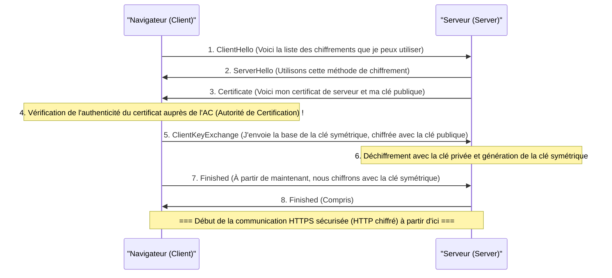

## 1. L'internet est une « carte postale »

Bien que très pratique, le protocole de communication Web que nous utilisons au quotidien, « HTTP », présente une faiblesse fatale en matière de sécurité. Il s'agit du fait que « **tout le contenu des communications est envoyé et reçu en texte clair (un simple texte non chiffré)** ».

Les données HTTP qui circulent à travers les câbles réseau ou les ondes Wi-Fi peuvent facilement être interceptées par les routeurs intermédiaires, les fournisseurs d'accès, ou encore par des pirates informatiques malveillants (sniffers de paquets).
Pour utiliser une comparaison, c'est comme si vous écriviez votre numéro de carte de crédit ou votre mot de passe sur « **une carte postale dont le dos est entièrement visible** » et que vous la déposiez dans une boîte aux lettres.

La technologie qui permet de résoudre cette situation effrayante en plaçant la carte postale dans un « coffre-fort robuste et impossible à ouvrir (une enveloppe) » pour l'envoyer, est « **HTTPS (HTTP Secure)** », qui ajoute le « S » de sécurité (Secure) à HTTP.

## 2. SSL/TLS : Un bouclier pour se protéger contre 3 menaces

HTTPS n'est pas une réécriture du protocole HTTP lui-même. « Avant » d'effectuer la communication HTTP, une couche du protocole de chiffrement appelé **SSL/TLS** est interposée pour créer un tunnel sécurisé, dans lequel le texte HTTP est ensuite diffusé.

SSL (Secure Sockets Layer) a été développé par Netscape en 1994, puis normalisé et renommé TLS (Transport Layer Security), mais il est toujours appelé « SSL/TLS » par habitude.

SSL/TLS nous protège contre 3 menaces majeures sur Internet :
1. **Écoute clandestine (Eavesdropping)** : Empêcher que le contenu de la communication ne soit vu (Chiffrement)
2. **Falsification (Tampering)** : Empêcher que les données ne soient altérées en cours de route (Authentification des messages)
3. **Usurpation d'identité (Spoofing)** : Prouver que le correspondant n'est pas un site frauduleux (Certificat numérique)

## 3. Le dilemme du chiffrement : Clé symétrique et clé publique

Une « clé » est nécessaire pour chiffrer les communications. Cependant, un grand dilemme se pose ici.

La méthode de chiffrement la plus rapide et la plus efficace est le « **chiffrement à clé symétrique** (ex : AES) ». Avec celle-ci, l'expéditeur et le destinataire possèdent « la même et unique clé » pour chiffrer et déchiffrer (tout comme la clé de votre maison).
Cependant, lors de votre premier achat sur Amazon via Internet, comment vous et Amazon pouvez-vous partager en toute sécurité cette « clé commune » ? Si la clé elle-même est envoyée sur le réseau, elle sera également volée par des pirates (problème de distribution des clés).

Ce problème a été brillamment résolu grâce à la puissance des mathématiques par le « **chiffrement à clé publique** (ex : RSA, cryptographie sur les courbes elliptiques) ».

Dans le chiffrement à clé publique, on crée une paire composée d'un « cadenas (clé publique) » qui peut être distribué à n'importe qui, et d'une « clé pour l'ouvrir (clé privée) » que vous seul possédez.
Amazon distribue sa « clé publique » partout dans le monde. Votre navigateur utilise cette clé publique (cadenas) d'Amazon pour enfermer et verrouiller fermement la « clé symétrique » à usage unique dans une boîte, puis l'envoie à Amazon.
Cette boîte ne peut absolument être ouverte qu'avec la « clé privée » qu'Amazon conserve en secret dans le monde. Même si un pirate vole la boîte en cours de route, cela ne lui servira à rien car il n'a pas la clé pour l'ouvrir.

## 4. Les coulisses de la communication HTTPS : Handshake SSL/TLS

Au moment même où vous accédez à `https://...` avec votre navigateur, en arrière-plan et en quelques fractions de seconde, une négociation avancée appelée « **Handshake SSL/TLS** » se déroule entre le navigateur et le serveur.

Le chiffrement à clé publique nécessitant des calculs très lourds, si toutes les communications s'effectuaient avec une clé publique, le serveur serait surchargé.
C'est pourquoi HTTPS adopte un système hybride très astucieux : « **il utilise le chiffrement à clé publique uniquement pour l'échange sécurisé des clés, et le chiffrement à clé symétrique, plus rapide, pour la transmission réelle de grandes quantités de données** ».

## 5. Infrastructure à clés publiques (PKI) et Autorité de certification (AC)

Il reste ici un dernier problème : « l'usurpation d'identité ».
Que se passerait-il si un pirate malveillant créait un faux site ressemblant à s'y méprendre à Amazon et vous envoyait sa propre clé publique ? Votre navigateur établirait une communication chiffrée en toute sécurité avec le faux site, et transmettrait votre mot de passe chiffré « en toute sécurité » au pirate.

Ce qui permet d'éviter cela, c'est le mécanisme de la **PKI (Public Key Infrastructure : Infrastructure à clés publiques)** et de l'**AC (Certificate Authority : Autorité de Certification)**.

Il existe dans le monde des « organisations tierces (autorités de certification) » reconnues internationalement, telles que DigiCert, GlobalSign ou Let's Encrypt. Les entreprises comme Amazon obtiennent, après un audit rigoureux par ces autorités, un « certificat de serveur » comportant une signature numérique garantissant que « cette clé publique appartient indéniablement au véritable Amazon ».

Dans nos ordinateurs et smartphones (systèmes d'exploitation et navigateurs), les « certificats racines » de ces autorités de certification de confiance sont préinstallés.
Lorsque le navigateur reçoit un certificat du serveur, il le compare avec ses propres certificats racines, et ce n'est que lorsqu'il peut confirmer qu'il s'agit « d'un véritable certificat signé par une AC de confiance » qu'il affiche la « marque du cadenas de sécurité » dans la barre d'adresse.

## 6. Conclusion : Vers l'ère du SSL omniprésent (Always-on SSL)

Autrefois, HTTPS était une exception utilisée uniquement sur certaines pages spécifiques, comme les écrans de paiement où l'on saisit son numéro de carte de crédit. On pensait en effet que le processus de chiffrement imposait une charge trop importante aux serveurs.

Cependant, grâce à l'amélioration des performances des processeurs, à l'évolution des technologies (l'apparition de HTTP/2 et HTTP/3) et surtout à l'exigence sociale croissante en matière de protection de la vie privée, sous l'impulsion d'acteurs tels que Google, « rendre toutes les pages Web en HTTPS (SSL omniprésent) » est devenu le standard mondial. Aujourd'hui, plus de 90 % du trafic Web sur Internet est chiffré avec HTTPS.

HTTPS est construit par la collaboration d'algorithmes mathématiques complexes invisibles et d'un réseau de confiance mondial (PKI). Derrière les écrans de smartphones que nous tapotons nonchalamment, les solides barrières de chiffrement conçues par les meilleurs esprits du monde continuent aujourd'hui de protéger silencieusement nos données.
