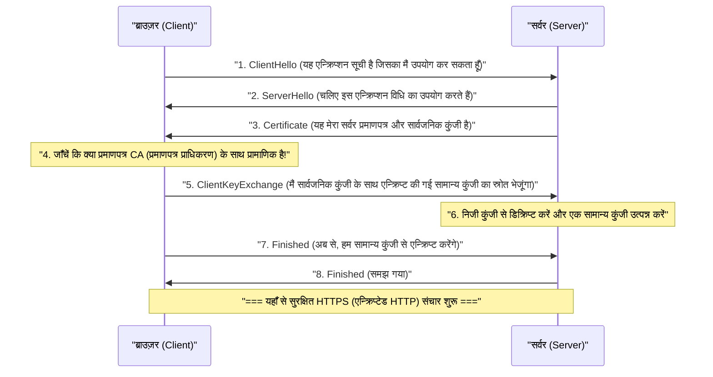

## 1. इंटरनेट एक "पोस्टकार्ड" है

वेब संचार प्रोटोकॉल "HTTP" जिसका हम सामान्य रूप से उपयोग करते हैं, वह बहुत सुविधाजनक है, लेकिन सुरक्षा के मामले में इसकी एक घातक कमजोरी है। वह यह है कि " **संचार सामग्री सभी सादे पाठ (केवल अनएन्क्रिप्टेड वर्ण) में भेजी और प्राप्त की जाती है** "।

नेटवर्क केबल और वाई-फाई रेडियो तरंगों पर प्रवाहित होने वाले HTTP डेटा को मध्यवर्ती राउटर, प्रदाता, या दुर्भावनापूर्ण हैकर्स (पैकेट स्निफर) द्वारा आसानी से देखा जा सकता है।
इसकी तुलना क्रेडिट कार्ड नंबर या पासवर्ड को एक " **पोस्टकार्ड जिसके पीछे का हिस्सा पूरी तरह दिखाई देता है** " पर लिखने और उसे लेटरबॉक्स में डालने से की जा सकती है।

इस भयानक स्थिति को हल करने के लिए, पोस्टकार्ड को "एक मजबूत तिजोरी (लिफाफा) जिसे कभी नहीं खोला जा सकता" में रखकर भेजने की तकनीक, " **HTTPS (HTTP Secure)** " है, जो HTTP में सुरक्षा (Secure) का "S" जोड़ता है।

## 2. SSL/TLS: 3 खतरों से बचाने वाली ढाल

HTTPS ने HTTP प्रोटोकॉल को ही दोबारा नहीं लिखा है। HTTP संचार करने से "पहले", यह **SSL/TLS** नामक एन्क्रिप्शन प्रोटोकॉल की एक परत सम्मिलित करता है, वहां एक सुरक्षित सुरंग बनाता है, और फिर उस सुरंग में HTTP टेक्स्ट प्रवाहित करता है।

SSL (Secure Sockets Layer) को 1994 में Netscape द्वारा विकसित किया गया था, और बाद में मानकीकृत किया गया और इसका नाम बदलकर TLS (Transport Layer Security) कर दिया गया, लेकिन इसे अभी भी प्रथागत रूप से "SSL/TLS" कहा जाता है।

SSL/TLS हमें इंटरनेट पर 3 बड़े खतरों से बचाता है।
1. **ईव्सड्रॉपिंग (Eavesdropping)** : संचार सामग्री को देखे जाने से रोकना (एन्क्रिप्शन)
2. **छेड़छाड़ (Tampering)** : रास्ते में डेटा को फिर से लिखे जाने से रोकना (संदेश प्रमाणीकरण)
3. **स्पूफिंग (Spoofing)** : यह साबित करना कि संचार भागीदार कोई नकली साइट नहीं है (डिजिटल प्रमाणपत्र)

## 3. एन्क्रिप्शन की दुविधा: सिमेट्रिक की और पब्लिक की

संचार को एन्क्रिप्ट करने के लिए "कुंजी (Key)" की आवश्यकता होती है। हालाँकि, यहाँ एक बड़ी दुविधा उत्पन्न होती है।

सबसे तेज़ और सबसे कुशल एन्क्रिप्शन विधि " **सिमेट्रिक की एन्क्रिप्शन (Symmetric key encryption)** (उदाहरण: AES)" है। इसमें प्रेषक और प्राप्तकर्ता एन्क्रिप्शन और डिक्रिप्शन करने के लिए "एक ही कुंजी" रखते हैं (घर की चाबी के समान)।
हालाँकि, जब आप पहली बार इंटरनेट पर Amazon पर खरीदारी करते हैं, तो आप और Amazon उस "सामान्य कुंजी" को सुरक्षित रूप से कैसे साझा कर सकते हैं? यदि आप कुंजी को ही इंटरनेट पर भेजते हैं, तो वह भी हैकर्स द्वारा चुरा ली जाएगी (कुंजी वितरण समस्या)।

इस समस्या को गणित की शक्ति से शानदार ढंग से हल करने वाली विधि " **पब्लिक की एन्क्रिप्शन (Public key encryption)** (उदाहरण: RSA, एलिप्टिक कर्व क्रिप्टोग्राफी)" है।

पब्लिक की एन्क्रिप्शन में, दो कुंजियों का एक जोड़ा बनाया जाता है: एक "पैडलॉक (सार्वजनिक कुंजी/Public key)" जिसे किसी को भी वितरित किया जा सकता है, और एक "खोलने के लिए कुंजी (निजी कुंजी/Private key)" जो केवल आपके पास होती है।
Amazon अपनी "सार्वजनिक कुंजी" पूरी दुनिया में वितरित करता है। आपका ब्राउज़र उस Amazon की सार्वजनिक कुंजी (पैडलॉक) का उपयोग करता है, इस बार के लिए एक "सामान्य कुंजी" को एक बॉक्स में रखता है, इसे क्लिक के साथ लॉक करता है, और इसे Amazon को भेजता है।
यह बॉक्स केवल Amazon के पास मौजूद "निजी कुंजी" से ही खोला जा सकता है। भले ही कोई हैकर रास्ते में बॉक्स चुरा ले, इसका कोई मतलब नहीं है क्योंकि उसे खोलने के लिए कोई चाबी नहीं है।

## 4. HTTPS संचार के पीछे: SSL/TLS हैंडशेक

जिस क्षण आप अपने ब्राउज़र में `https://...` एक्सेस करते हैं, उसके पीछे केवल कुछ सेकंड के अंश में, ब्राउज़र और सर्वर के बीच एक उन्नत बातचीत होती है जिसे " **SSL/TLS हैंडशेक** " कहा जाता है।

पब्लिक की एन्क्रिप्शन कम्प्यूटेशनल रूप से बहुत भारी है, इसलिए यदि सभी संचार पब्लिक की का उपयोग करके किए जाते हैं, तो सर्वर क्रैश हो जाएगा।
इसलिए, HTTPS एक बहुत ही चतुर हाइब्रिड विधि अपनाता है: " **केवल सुरक्षित रूप से कुंजियों को पास करने के लिए पब्लिक की एन्क्रिप्शन का उपयोग करें, और वास्तविक बड़ी मात्रा में डेटा संचार के लिए उच्च गति वाले सिमेट्रिक की एन्क्रिप्शन का उपयोग करें** "।

## 5. पब्लिक की इंफ्रास्ट्रक्चर (PKI) और प्रमाणपत्र प्राधिकरण (CA)

यहाँ अंतिम समस्या बनी हुई है। वह "स्पूफिंग" है।
क्या होगा यदि कोई दुर्भावनापूर्ण हैकर बिल्कुल Amazon जैसी नकली साइट बनाता है और आपको अपनी सार्वजनिक कुंजी भेजता है? आपका ब्राउज़र नकली साइट के साथ सुरक्षित रूप से एन्क्रिप्टेड संचार स्थापित करेगा, आपके पासवर्ड को एन्क्रिप्ट करेगा, और इसे "सुरक्षित रूप से" हैकर तक पहुंचाएगा।

इसे रोकने के लिए **PKI (Public Key Infrastructure: पब्लिक की इंफ्रास्ट्रक्चर)** और **CA (Certificate Authority: प्रमाणपत्र प्राधिकरण)** का तंत्र है।

दुनिया में "तीसरे पक्ष के संगठन (प्रमाणपत्र प्राधिकरण)" हैं जिन पर दुनिया भर में भरोसा किया जाता है, जैसे कि DigiCert, GlobalSign, और Let's Encrypt। Amazon जैसी कंपनियाँ इन प्रमाणपत्र प्राधिकरणों द्वारा कड़ी जाँच से गुजरती हैं, और फिर उन्हें डिजिटल हस्ताक्षर वाला "सर्वर प्रमाणपत्र" जारी किया जाता है जिसमें कहा जाता है कि "यह सार्वजनिक कुंजी निश्चित रूप से वास्तविक Amazon की है"।

इन विश्वसनीय प्रमाणपत्र प्राधिकरणों के "रूट प्रमाणपत्र" हमारे कंप्यूटर और स्मार्टफोन (OS और ब्राउज़र) में पहले से स्थापित होते हैं।
जब ब्राउज़र सर्वर से प्रमाणपत्र प्राप्त करता है, तो वह इसकी तुलना अपने पास मौजूद रूट प्रमाणपत्र से करता है, और केवल तभी जब यह पुष्टि कर सकता है कि "यह निश्चित रूप से एक विश्वसनीय CA द्वारा हस्ताक्षरित वास्तविक प्रमाणपत्र है", यह एड्रेस बार में "सुरक्षित पैडलॉक चिह्न" प्रदर्शित करता है।

## 6. निष्कर्ष: ऑलवेज़-ऑन SSL के युग की ओर

अतीत में, HTTPS एक विशेष चीज़ थी जिसका उपयोग केवल कुछ पेजों पर किया जाता था, जैसे कि भुगतान स्क्रीन जहाँ आप अपना क्रेडिट कार्ड नंबर दर्ज करते हैं। ऐसा इसलिए था क्योंकि माना जाता था कि एन्क्रिप्शन प्रक्रिया सर्वर पर भार डालती है।

हालाँकि, CPU प्रदर्शन में सुधार और प्रौद्योगिकी के विकास (HTTP/2 और HTTP/3 का आगमन), और सबसे बढ़कर, गोपनीयता सुरक्षा के लिए बढ़ती सामाजिक मांगों के कारण, Google और अन्य के नेतृत्व में "सभी वेब पेजों को HTTPS (ऑलवेज़-ऑन SSL) बनाना" अब वैश्विक मानक बन गया है। वर्तमान में, इंटरनेट पर 90% से अधिक वेब ट्रैफ़िक HTTPS के साथ एन्क्रिप्ट किया गया है।

अदृश्य और जटिल गणितीय एल्गोरिदम और वैश्विक विश्वास नेटवर्क (PKI) एक साथ मिलकर HTTPS बनाते हैं। जिस स्मार्टफोन स्क्रीन को हम अनजाने में टैप करते हैं, उसके पीछे दुनिया के कुछ सर्वश्रेष्ठ दिमागों द्वारा बनाई गई एक मजबूत एन्क्रिप्शन दीवार आज भी चुपचाप हमारे डेटा की रक्षा कर रही है।
