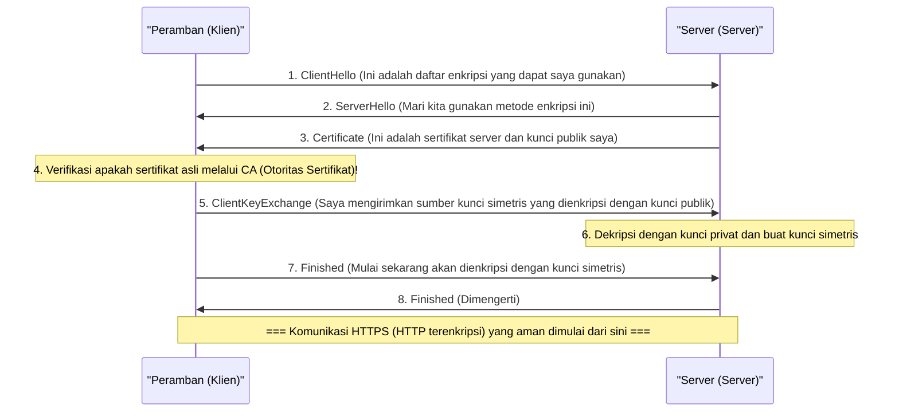

## 1. Internet itu seperti "Kartu Pos"

Protokol komunikasi Web "HTTP" yang biasa kita gunakan, meskipun sangat praktis, memiliki kelemahan fatal dari segi keamanan. Kelemahan tersebut adalah "**semua konten komunikasi dikirim dan diterima dalam bentuk teks biasa (teks yang tidak dienkripsi)**".

Data HTTP yang mengalir melalui kabel jaringan atau gelombang Wi-Fi dapat dengan mudah diintip isinya oleh router atau penyedia layanan (provider) di tengah jalan, atau oleh peretas (peretas paket) yang berniat jahat.
Hal ini ibarat menuliskan nomor kartu kredit atau kata sandi pada "**kartu pos yang bagian belakangnya terlihat jelas**" lalu memasukkannya ke dalam kotak pos.

Teknologi yang mengatasi situasi mengerikan ini dan mengirimkan kartu pos tersebut dengan memasukkannya ke dalam "brankas (amplop) kokoh yang sama sekali tidak dapat dibuka", itulah "**HTTPS (HTTP Secure)**", yang menambahkan huruf "S" untuk Keamanan (Secure) pada HTTP.

## 2. SSL/TLS: Perisai yang melindungi dari 3 ancaman

HTTPS bukanlah penulisan ulang dari protokol HTTP itu sendiri. Strukturnya adalah sebelum komunikasi HTTP dilakukan, sebuah lapisan protokol enkripsi bernama **SSL/TLS** disisipkan, menciptakan terowongan yang aman di sana, dan kemudian teks HTTP dialirkan ke dalamnya.

SSL (Secure Sockets Layer) dikembangkan oleh Netscape pada tahun 1994, dan kemudian distandarisasi dan berganti nama menjadi TLS (Transport Layer Security), tetapi bahkan sekarang masih disebut sebagai "SSL/TLS" sebagai kebiasaan.

SSL/TLS melindungi kita dari 3 ancaman besar di internet.
1. **Penyadapan (Eavesdropping)**: Mencegah agar isi komunikasi tidak terlihat (Enkripsi)
2. **Manipulasi (Tampering)**: Mencegah data diubah di tengah jalan (Autentikasi pesan)
3. **Pemalsuan (Spoofing)**: Membuktikan bahwa pihak yang diajak berkomunikasi bukanlah situs palsu (Sertifikat digital)

## 3. Dilema Enkripsi: Kunci Simetris dan Kunci Publik

Untuk mengenkripsi komunikasi, diperlukan sebuah "kunci". Namun, di sinilah muncul dilema yang besar.

Metode enkripsi tercepat dan paling efisien adalah "**Metode Enkripsi Kunci Simetris** (contoh: AES)". Metode ini menggunakan "kunci yang sama" antara pengirim dan penerima untuk melakukan enkripsi dan dekripsi (sama seperti kunci rumah).
Namun, saat pertama kali berbelanja di Amazon melalui internet, bagaimana Anda dan Amazon dapat berbagi "kunci bersama" tersebut dengan aman? Jika kunci itu sendiri dikirim melalui internet, kunci itu juga akan dicuri oleh peretas (Masalah distribusi kunci).

Masalah ini berhasil diselesaikan dengan brilian menggunakan kekuatan matematika melalui "**Metode Enkripsi Kunci Publik** (contoh: RSA, Enkripsi kurva eliptik)".

Dalam metode enkripsi kunci publik, dibuat sepasang kunci: "Gembok (Kunci publik)" yang boleh dibagikan kepada siapa saja, dan "Kunci untuk membukanya (Kunci privat)" yang hanya dimiliki oleh diri sendiri.
Amazon menyebarkan "kunci publik" miliknya ke seluruh dunia. Peramban Anda menggunakan kunci publik (gembok) Amazon tersebut untuk mengunci "kunci simetris" yang hanya berlaku kali ini saja ke dalam sebuah kotak, lalu mengirimkannya ke Amazon.
Kotak ini hanya bisa dibuka dengan "kunci privat" yang dimiliki oleh Amazon di seluruh dunia. Bahkan jika peretas mencuri kotak tersebut di tengah jalan, hal itu tidak akan ada gunanya karena tidak ada kunci untuk membukanya.

## 4. Di Balik Layar Komunikasi HTTPS: SSL/TLS Handshake

Saat Anda mengakses `https://...` dari peramban, di balik layar hanya dalam hitungan sepersekian detik, terjadi negosiasi tingkat tinggi yang disebut "**SSL/TLS Handshake**" antara peramban dan server.

Karena enkripsi kunci publik membutuhkan proses perhitungan yang sangat berat, jika semua komunikasi dilakukan dengan kunci publik, server akan kelebihan beban.
Oleh karena itu, HTTPS mengadopsi sistem hibrida yang sangat cerdas, yaitu "**menggunakan enkripsi kunci publik hanya untuk pertukaran kunci yang aman, dan menggunakan enkripsi kunci simetris berkecepatan tinggi untuk komunikasi data masif yang sebenarnya**".

## 5. Infrastruktur Kunci Publik (PKI) dan Otoritas Sertifikat (CA)

Sekarang ada satu masalah terakhir yang tersisa. "Pemalsuan".
Apa yang terjadi jika peretas jahat membuat situs palsu yang persis seperti Amazon dan mengirimkan kunci publik miliknya kepada Anda? Peramban Anda akan membuat komunikasi terenkripsi yang aman dengan situs palsu tersebut, mengenkripsi kata sandi, dan mengirimkannya "dengan aman" kepada peretas.

Hal ini dapat dicegah oleh mekanisme **PKI (Public Key Infrastructure: Infrastruktur Kunci Publik)** dan **CA (Certificate Authority: Otoritas Sertifikat)**.

Di dunia ini, terdapat "Pihak Ketiga (Otoritas Sertifikat)" yang dipercaya di seluruh dunia, seperti DigiCert, GlobalSign, dan Let's Encrypt. Perusahaan seperti Amazon, setelah melalui pemeriksaan ketat oleh otoritas sertifikat ini, diterbitkan sebuah "sertifikat server" dengan tanda tangan digital yang menyatakan "Kunci publik ini pastilah milik Amazon yang asli".

Di dalam komputer atau ponsel pintar kita (OS dan peramban), "sertifikat akar" dari otoritas sertifikat yang tepercaya ini sudah terinstal sebelumnya.
Saat peramban menerima sertifikat dari server, ia akan membandingkannya dengan sertifikat akar yang dimilikinya. Hanya ketika peramban dapat memastikan bahwa "ini adalah sertifikat asli yang ditandatangani oleh CA yang dapat dipercaya", barulah ia menampilkan "tanda gembok aman" di bilah alamat.

## 6. Kesimpulan: Menuju Era Always-On SSL

Dahulu, HTTPS adalah sesuatu yang istimewa dan hanya digunakan pada sebagian kecil halaman, seperti halaman pembayaran untuk memasukkan nomor kartu kredit. Hal ini karena proses enkripsi dianggap membebani server.

Namun, dengan peningkatan performa CPU dan evolusi teknologi (kemunculan HTTP/2 dan HTTP/3), serta di atas segalanya, meningkatnya tuntutan sosial akan perlindungan privasi, saat ini menjadikannya standar global yang dipelopori oleh perusahaan seperti Google bahwa "semua halaman Web menggunakan HTTPS (Always-On SSL)". Saat ini, lebih dari 90% lalu lintas Web di internet telah dienkripsi dengan HTTPS.

HTTPS tercipta dari kombinasi algoritma matematika kompleks yang tidak kasatmata dan jaringan kepercayaan global (PKI). Di balik layar ponsel pintar yang kita ketuk dengan santai, benteng pertahanan enkripsi terkuat yang diciptakan oleh orang-orang terpintar di dunia diam-diam terus melindungi data kita hari ini.
