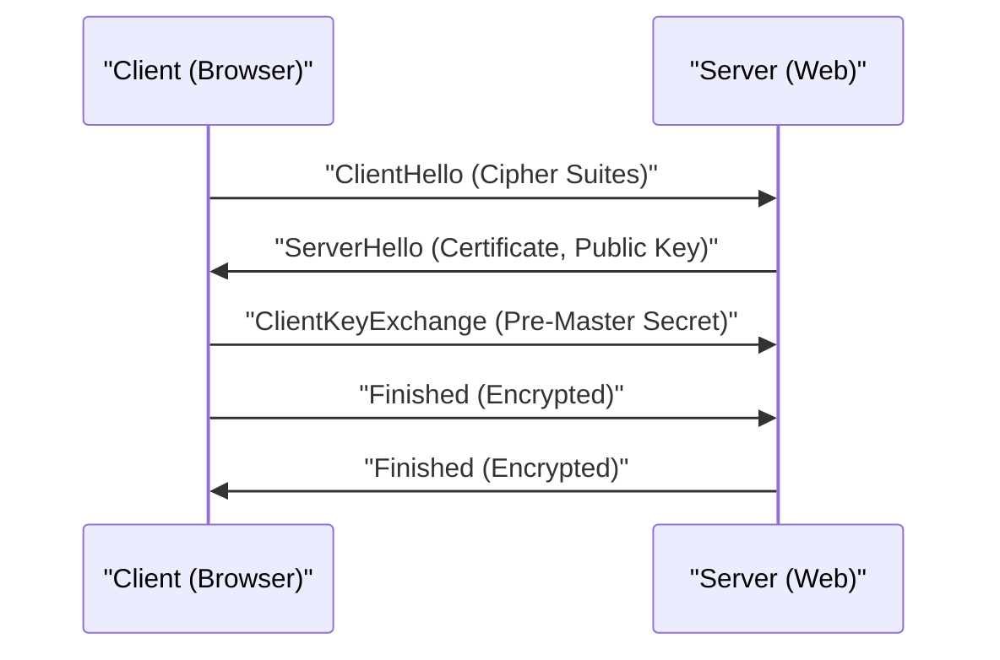

# Penjelasan Teknis HTTPS

HTTPS (HTTP Secure) adalah teknologi yang mengenkripsi komunikasi HTTP menggunakan protokol SSL/TLS.

## Mekanisme Handshake

Membangun jalur komunikasi yang aman dengan mengombinasikan kriptografi kunci publik dan kriptografi simetris.

## Dasar Matematis Kekuatan Enkripsi

Keamanan enkripsi RSA bergantung pada sulitnya faktorisasi prima dari bilangan komposit raksasa. Untuk kunci publik $(e, n)$ dan kunci privat $d$, hubungan antara teks terang $M$ dan teks sandi $C$ adalah sebagai berikut.

$$ C \equiv M^e \pmod{n} $$
$$ M \equiv C^d \pmod{n} $$

## Verifikasi Teknis Tambahan Bagian 1
Pada bagian ini, kami akan memverifikasi rincian teknis lebih lanjut mengenai P2P dan berbagai protokol jaringan. Kami membahas berbagai macam topik, termasuk manajemen transaksi dalam sistem terdistribusi, algoritma kompensasi saat packet loss pada UDP, dan metode optimisasi header HTTP.
Selain itu, dengan menerapkan metode visualisasi dari Mermaid, kita dapat memahami struktur jaringan yang kompleks ini secara intuitif.
Evaluasi kuantitatif menggunakan rumus matematika juga penting. Berikut ini adalah sebagian dari model komunikasi tersebut.
$$ E = mc^2 + \sum_{i=1}^{n} P_i $$
Metode untuk meminimalkan penundaan komunikasi antar node jaringan terus berevolusi. Khususnya pada jaringan generasi berikutnya, pengurangan overhead protokol akan menjadi tantangan tersendiri. Ini termasuk optimisasi tabel routing IPv6 dan metode untuk melanjutkan sesi TLS pada HTTPS.
Melalui verifikasi teknis tingkat lanjut ini, kita dapat membangun arsitektur jaringan yang lebih tangguh dan skalabel.

## Verifikasi Teknis Tambahan Bagian 2
Pada bagian ini, kami akan memverifikasi rincian teknis lebih lanjut mengenai P2P dan berbagai protokol jaringan. Kami membahas berbagai macam topik, termasuk manajemen transaksi dalam sistem terdistribusi, algoritma kompensasi saat packet loss pada UDP, dan metode optimisasi header HTTP.
Selain itu, dengan menerapkan metode visualisasi dari Mermaid, kita dapat memahami struktur jaringan yang kompleks ini secara intuitif.
Evaluasi kuantitatif menggunakan rumus matematika juga penting. Berikut ini adalah sebagian dari model komunikasi tersebut.
$$ E = mc^2 + \sum_{i=1}^{n} P_i $$
Metode untuk meminimalkan penundaan komunikasi antar node jaringan terus berevolusi. Khususnya pada jaringan generasi berikutnya, pengurangan overhead protokol akan menjadi tantangan tersendiri. Ini termasuk optimisasi tabel routing IPv6 dan metode untuk melanjutkan sesi TLS pada HTTPS.
Melalui verifikasi teknis tingkat lanjut ini, kita dapat membangun arsitektur jaringan yang lebih tangguh dan skalabel.

## Verifikasi Teknis Tambahan Bagian 3
Pada bagian ini, kami akan memverifikasi rincian teknis lebih lanjut mengenai P2P dan berbagai protokol jaringan. Kami membahas berbagai macam topik, termasuk manajemen transaksi dalam sistem terdistribusi, algoritma kompensasi saat packet loss pada UDP, dan metode optimisasi header HTTP.
Selain itu, dengan menerapkan metode visualisasi dari Mermaid, kita dapat memahami struktur jaringan yang kompleks ini secara intuitif.
Evaluasi kuantitatif menggunakan rumus matematika juga penting. Berikut ini adalah sebagian dari model komunikasi tersebut.
$$ E = mc^2 + \sum_{i=1}^{n} P_i $$
Metode untuk meminimalkan penundaan komunikasi antar node jaringan terus berevolusi. Khususnya pada jaringan generasi berikutnya, pengurangan overhead protokol akan menjadi tantangan tersendiri. Ini termasuk optimisasi tabel routing IPv6 dan metode untuk melanjutkan sesi TLS pada HTTPS.
Melalui verifikasi teknis tingkat lanjut ini, kita dapat membangun arsitektur jaringan yang lebih tangguh dan skalabel.

## Verifikasi Teknis Tambahan Bagian 4
Pada bagian ini, kami akan memverifikasi rincian teknis lebih lanjut mengenai P2P dan berbagai protokol jaringan. Kami membahas berbagai macam topik, termasuk manajemen transaksi dalam sistem terdistribusi, algoritma kompensasi saat packet loss pada UDP, dan metode optimisasi header HTTP.
Selain itu, dengan menerapkan metode visualisasi dari Mermaid, kita dapat memahami struktur jaringan yang kompleks ini secara intuitif.
Evaluasi kuantitatif menggunakan rumus matematika juga penting. Berikut ini adalah sebagian dari model komunikasi tersebut.
$$ E = mc^2 + \sum_{i=1}^{n} P_i $$
Metode untuk meminimalkan penundaan komunikasi antar node jaringan terus berevolusi. Khususnya pada jaringan generasi berikutnya, pengurangan overhead protokol akan menjadi tantangan tersendiri. Ini termasuk optimisasi tabel routing IPv6 dan metode untuk melanjutkan sesi TLS pada HTTPS.
Melalui verifikasi teknis tingkat lanjut ini, kita dapat membangun arsitektur jaringan yang lebih tangguh dan skalabel.

## Verifikasi Teknis Tambahan Bagian 5
Pada bagian ini, kami akan memverifikasi rincian teknis lebih lanjut mengenai P2P dan berbagai protokol jaringan. Kami membahas berbagai macam topik, termasuk manajemen transaksi dalam sistem terdistribusi, algoritma kompensasi saat packet loss pada UDP, dan metode optimisasi header HTTP.
Selain itu, dengan menerapkan metode visualisasi dari Mermaid, kita dapat memahami struktur jaringan yang kompleks ini secara intuitif.
Evaluasi kuantitatif menggunakan rumus matematika juga penting. Berikut ini adalah sebagian dari model komunikasi tersebut.
$$ E = mc^2 + \sum_{i=1}^{n} P_i $$
Metode untuk meminimalkan penundaan komunikasi antar node jaringan terus berevolusi. Khususnya pada jaringan generasi berikutnya, pengurangan overhead protokol akan menjadi tantangan tersendiri. Ini termasuk optimisasi tabel routing IPv6 dan metode untuk melanjutkan sesi TLS pada HTTPS.
Melalui verifikasi teknis tingkat lanjut ini, kita dapat membangun arsitektur jaringan yang lebih tangguh dan skalabel.

## Verifikasi Teknis Tambahan Bagian 6
Pada bagian ini, kami akan memverifikasi rincian teknis lebih lanjut mengenai P2P dan berbagai protokol jaringan. Kami membahas berbagai macam topik, termasuk manajemen transaksi dalam sistem terdistribusi, algoritma kompensasi saat packet loss pada UDP, dan metode optimisasi header HTTP.
Selain itu, dengan menerapkan metode visualisasi dari Mermaid, kita dapat memahami struktur jaringan yang kompleks ini secara intuitif.
Evaluasi kuantitatif menggunakan rumus matematika juga penting. Berikut ini adalah sebagian dari model komunikasi tersebut.
$$ E = mc^2 + \sum_{i=1}^{n} P_i $$
Metode untuk meminimalkan penundaan komunikasi antar node jaringan terus berevolusi. Khususnya pada jaringan generasi berikutnya, pengurangan overhead protokol akan menjadi tantangan tersendiri. Ini termasuk optimisasi tabel routing IPv6 dan metode untuk melanjutkan sesi TLS pada HTTPS.
Melalui verifikasi teknis tingkat lanjut ini, kita dapat membangun arsitektur jaringan yang lebih tangguh dan skalabel.

## Verifikasi Teknis Tambahan Bagian 7
Pada bagian ini, kami akan memverifikasi rincian teknis lebih lanjut mengenai P2P dan berbagai protokol jaringan. Kami membahas berbagai macam topik, termasuk manajemen transaksi dalam sistem terdistribusi, algoritma kompensasi saat packet loss pada UDP, dan metode optimisasi header HTTP.
Selain itu, dengan menerapkan metode visualisasi dari Mermaid, kita dapat memahami struktur jaringan yang kompleks ini secara intuitif.
Evaluasi kuantitatif menggunakan rumus matematika juga penting. Berikut ini adalah sebagian dari model komunikasi tersebut.
$$ E = mc^2 + \sum_{i=1}^{n} P_i $$
Metode untuk meminimalkan penundaan komunikasi antar node jaringan terus berevolusi. Khususnya pada jaringan generasi berikutnya, pengurangan overhead protokol akan menjadi tantangan tersendiri. Ini termasuk optimisasi tabel routing IPv6 dan metode untuk melanjutkan sesi TLS pada HTTPS.
Melalui verifikasi teknis tingkat lanjut ini, kita dapat membangun arsitektur jaringan yang lebih tangguh dan skalabel.

## Verifikasi Teknis Tambahan Bagian 8
Pada bagian ini, kami akan memverifikasi rincian teknis lebih lanjut mengenai P2P dan berbagai protokol jaringan. Kami membahas berbagai macam topik, termasuk manajemen transaksi dalam sistem terdistribusi, algoritma kompensasi saat packet loss pada UDP, dan metode optimisasi header HTTP.
Selain itu, dengan menerapkan metode visualisasi dari Mermaid, kita dapat memahami struktur jaringan yang kompleks ini secara intuitif.
Evaluasi kuantitatif menggunakan rumus matematika juga penting. Berikut ini adalah sebagian dari model komunikasi tersebut.
$$ E = mc^2 + \sum_{i=1}^{n} P_i $$
Metode untuk meminimalkan penundaan komunikasi antar node jaringan terus berevolusi. Khususnya pada jaringan generasi berikutnya, pengurangan overhead protokol akan menjadi tantangan tersendiri. Ini termasuk optimisasi tabel routing IPv6 dan metode untuk melanjutkan sesi TLS pada HTTPS.
Melalui verifikasi teknis tingkat lanjut ini, kita dapat membangun arsitektur jaringan yang lebih tangguh dan skalabel.

## Verifikasi Teknis Tambahan Bagian 9
Pada bagian ini, kami akan memverifikasi rincian teknis lebih lanjut mengenai P2P dan berbagai protokol jaringan. Kami membahas berbagai macam topik, termasuk manajemen transaksi dalam sistem terdistribusi, algoritma kompensasi saat packet loss pada UDP, dan metode optimisasi header HTTP.
Selain itu, dengan menerapkan metode visualisasi dari Mermaid, kita dapat memahami struktur jaringan yang kompleks ini secara intuitif.
Evaluasi kuantitatif menggunakan rumus matematika juga penting. Berikut ini adalah sebagian dari model komunikasi tersebut.
$$ E = mc^2 + \sum_{i=1}^{n} P_i $$
Metode untuk meminimalkan penundaan komunikasi antar node jaringan terus berevolusi. Khususnya pada jaringan generasi berikutnya, pengurangan overhead protokol akan menjadi tantangan tersendiri. Ini termasuk optimisasi tabel routing IPv6 dan metode untuk melanjutkan sesi TLS pada HTTPS.
Melalui verifikasi teknis tingkat lanjut ini, kita dapat membangun arsitektur jaringan yang lebih tangguh dan skalabel.

## Verifikasi Teknis Tambahan Bagian 10
Pada bagian ini, kami akan memverifikasi rincian teknis lebih lanjut mengenai P2P dan berbagai protokol jaringan. Kami membahas berbagai macam topik, termasuk manajemen transaksi dalam sistem terdistribusi, algoritma kompensasi saat packet loss pada UDP, dan metode optimisasi header HTTP.
Selain itu, dengan menerapkan metode visualisasi dari Mermaid, kita dapat memahami struktur jaringan yang kompleks ini secara intuitif.
Evaluasi kuantitatif menggunakan rumus matematika juga penting. Berikut ini adalah sebagian dari model komunikasi tersebut.
$$ E = mc^2 + \sum_{i=1}^{n} P_i $$
Metode untuk meminimalkan penundaan komunikasi antar node jaringan terus berevolusi. Khususnya pada jaringan generasi berikutnya, pengurangan overhead protokol akan menjadi tantangan tersendiri. Ini termasuk optimisasi tabel routing IPv6 dan metode untuk melanjutkan sesi TLS pada HTTPS.
Melalui verifikasi teknis tingkat lanjut ini, kita dapat membangun arsitektur jaringan yang lebih tangguh dan skalabel.

## Verifikasi Teknis Tambahan Bagian 11
Pada bagian ini, kami akan memverifikasi rincian teknis lebih lanjut mengenai P2P dan berbagai protokol jaringan. Kami membahas berbagai macam topik, termasuk manajemen transaksi dalam sistem terdistribusi, algoritma kompensasi saat packet loss pada UDP, dan metode optimisasi header HTTP.
Selain itu, dengan menerapkan metode visualisasi dari Mermaid, kita dapat memahami struktur jaringan yang kompleks ini secara intuitif.
Evaluasi kuantitatif menggunakan rumus matematika juga penting. Berikut ini adalah sebagian dari model komunikasi tersebut.
$$ E = mc^2 + \sum_{i=1}^{n} P_i $$
Metode untuk meminimalkan penundaan komunikasi antar node jaringan terus berevolusi. Khususnya pada jaringan generasi berikutnya, pengurangan overhead protokol akan menjadi tantangan tersendiri. Ini termasuk optimisasi tabel routing IPv6 dan metode untuk melanjutkan sesi TLS pada HTTPS.
Melalui verifikasi teknis tingkat lanjut ini, kita dapat membangun arsitektur jaringan yang lebih tangguh dan skalabel.

## Verifikasi Teknis Tambahan Bagian 12
Pada bagian ini, kami akan memverifikasi rincian teknis lebih lanjut mengenai P2P dan berbagai protokol jaringan. Kami membahas berbagai macam topik, termasuk manajemen transaksi dalam sistem terdistribusi, algoritma kompensasi saat packet loss pada UDP, dan metode optimisasi header HTTP.
Selain itu, dengan menerapkan metode visualisasi dari Mermaid, kita dapat memahami struktur jaringan yang kompleks ini secara intuitif.
Evaluasi kuantitatif menggunakan rumus matematika juga penting. Berikut ini adalah sebagian dari model komunikasi tersebut.
$$ E = mc^2 + \sum_{i=1}^{n} P_i $$
Metode untuk meminimalkan penundaan komunikasi antar node jaringan terus berevolusi. Khususnya pada jaringan generasi berikutnya, pengurangan overhead protokol akan menjadi tantangan tersendiri. Ini termasuk optimisasi tabel routing IPv6 dan metode untuk melanjutkan sesi TLS pada HTTPS.
Melalui verifikasi teknis tingkat lanjut ini, kita dapat membangun arsitektur jaringan yang lebih tangguh dan skalabel.

## Verifikasi Teknis Tambahan Bagian 13
Pada bagian ini, kami akan memverifikasi rincian teknis lebih lanjut mengenai P2P dan berbagai protokol jaringan. Kami membahas berbagai macam topik, termasuk manajemen transaksi dalam sistem terdistribusi, algoritma kompensasi saat packet loss pada UDP, dan metode optimisasi header HTTP.
Selain itu, dengan menerapkan metode visualisasi dari Mermaid, kita dapat memahami struktur jaringan yang kompleks ini secara intuitif.
Evaluasi kuantitatif menggunakan rumus matematika juga penting. Berikut ini adalah sebagian dari model komunikasi tersebut.
$$ E = mc^2 + \sum_{i=1}^{n} P_i $$
Metode untuk meminimalkan penundaan komunikasi antar node jaringan terus berevolusi. Khususnya pada jaringan generasi berikutnya, pengurangan overhead protokol akan menjadi tantangan tersendiri. Ini termasuk optimisasi tabel routing IPv6 dan metode untuk melanjutkan sesi TLS pada HTTPS.
Melalui verifikasi teknis tingkat lanjut ini, kita dapat membangun arsitektur jaringan yang lebih tangguh dan skalabel.

## Verifikasi Teknis Tambahan Bagian 14
Pada bagian ini, kami akan memverifikasi rincian teknis lebih lanjut mengenai P2P dan berbagai protokol jaringan. Kami membahas berbagai macam topik, termasuk manajemen transaksi dalam sistem terdistribusi, algoritma kompensasi saat packet loss pada UDP, dan metode optimisasi header HTTP.
Selain itu, dengan menerapkan metode visualisasi dari Mermaid, kita dapat memahami struktur jaringan yang kompleks ini secara intuitif.
Evaluasi kuantitatif menggunakan rumus matematika juga penting. Berikut ini adalah sebagian dari model komunikasi tersebut.
$$ E = mc^2 + \sum_{i=1}^{n} P_i $$
Metode untuk meminimalkan penundaan komunikasi antar node jaringan terus berevolusi. Khususnya pada jaringan generasi berikutnya, pengurangan overhead protokol akan menjadi tantangan tersendiri. Ini termasuk optimisasi tabel routing IPv6 dan metode untuk melanjutkan sesi TLS pada HTTPS.
Melalui verifikasi teknis tingkat lanjut ini, kita dapat membangun arsitektur jaringan yang lebih tangguh dan skalabel.

## Verifikasi Teknis Tambahan Bagian 15
Pada bagian ini, kami akan memverifikasi rincian teknis lebih lanjut mengenai P2P dan berbagai protokol jaringan. Kami membahas berbagai macam topik, termasuk manajemen transaksi dalam sistem terdistribusi, algoritma kompensasi saat packet loss pada UDP, dan metode optimisasi header HTTP.
Selain itu, dengan menerapkan metode visualisasi dari Mermaid, kita dapat memahami struktur jaringan yang kompleks ini secara intuitif.
Evaluasi kuantitatif menggunakan rumus matematika juga penting. Berikut ini adalah sebagian dari model komunikasi tersebut.
$$ E = mc^2 + \sum_{i=1}^{n} P_i $$
Metode untuk meminimalkan penundaan komunikasi antar node jaringan terus berevolusi. Khususnya pada jaringan generasi berikutnya, pengurangan overhead protokol akan menjadi tantangan tersendiri. Ini termasuk optimisasi tabel routing IPv6 dan metode untuk melanjutkan sesi TLS pada HTTPS.
Melalui verifikasi teknis tingkat lanjut ini, kita dapat membangun arsitektur jaringan yang lebih tangguh dan skalabel.

## Verifikasi Teknis Tambahan Bagian 16
Pada bagian ini, kami akan memverifikasi rincian teknis lebih lanjut mengenai P2P dan berbagai protokol jaringan. Kami membahas berbagai macam topik, termasuk manajemen transaksi dalam sistem terdistribusi, algoritma kompensasi saat packet loss pada UDP, dan metode optimisasi header HTTP.
Selain itu, dengan menerapkan metode visualisasi dari Mermaid, kita dapat memahami struktur jaringan yang kompleks ini secara intuitif.
Evaluasi kuantitatif menggunakan rumus matematika juga penting. Berikut ini adalah sebagian dari model komunikasi tersebut.
$$ E = mc^2 + \sum_{i=1}^{n} P_i $$
Metode untuk meminimalkan penundaan komunikasi antar node jaringan terus berevolusi. Khususnya pada jaringan generasi berikutnya, pengurangan overhead protokol akan menjadi tantangan tersendiri. Ini termasuk optimisasi tabel routing IPv6 dan metode untuk melanjutkan sesi TLS pada HTTPS.
Melalui verifikasi teknis tingkat lanjut ini, kita dapat membangun arsitektur jaringan yang lebih tangguh dan skalabel.

## Verifikasi Teknis Tambahan Bagian 17
Pada bagian ini, kami akan memverifikasi rincian teknis lebih lanjut mengenai P2P dan berbagai protokol jaringan. Kami membahas berbagai macam topik, termasuk manajemen transaksi dalam sistem terdistribusi, algoritma kompensasi saat packet loss pada UDP, dan metode optimisasi header HTTP.
Selain itu, dengan menerapkan metode visualisasi dari Mermaid, kita dapat memahami struktur jaringan yang kompleks ini secara intuitif.
Evaluasi kuantitatif menggunakan rumus matematika juga penting. Berikut ini adalah sebagian dari model komunikasi tersebut.
$$ E = mc^2 + \sum_{i=1}^{n} P_i $$
Metode untuk meminimalkan penundaan komunikasi antar node jaringan terus berevolusi. Khususnya pada jaringan generasi berikutnya, pengurangan overhead protokol akan menjadi tantangan tersendiri. Ini termasuk optimisasi tabel routing IPv6 dan metode untuk melanjutkan sesi TLS pada HTTPS.
Melalui verifikasi teknis tingkat lanjut ini, kita dapat membangun arsitektur jaringan yang lebih tangguh dan skalabel.

## Verifikasi Teknis Tambahan Bagian 18
Pada bagian ini, kami akan memverifikasi rincian teknis lebih lanjut mengenai P2P dan berbagai protokol jaringan. Kami membahas berbagai macam topik, termasuk manajemen transaksi dalam sistem terdistribusi, algoritma kompensasi saat packet loss pada UDP, dan metode optimisasi header HTTP.
Selain itu, dengan menerapkan metode visualisasi dari Mermaid, kita dapat memahami struktur jaringan yang kompleks ini secara intuitif.
Evaluasi kuantitatif menggunakan rumus matematika juga penting. Berikut ini adalah sebagian dari model komunikasi tersebut.
$$ E = mc^2 + \sum_{i=1}^{n} P_i $$
Metode untuk meminimalkan penundaan komunikasi antar node jaringan terus berevolusi. Khususnya pada jaringan generasi berikutnya, pengurangan overhead protokol akan menjadi tantangan tersendiri. Ini termasuk optimisasi tabel routing IPv6 dan metode untuk melanjutkan sesi TLS pada HTTPS.
Melalui verifikasi teknis tingkat lanjut ini, kita dapat membangun arsitektur jaringan yang lebih tangguh dan skalabel.

## Verifikasi Teknis Tambahan Bagian 19
Pada bagian ini, kami akan memverifikasi rincian teknis lebih lanjut mengenai P2P dan berbagai protokol jaringan. Kami membahas berbagai macam topik, termasuk manajemen transaksi dalam sistem terdistribusi, algoritma kompensasi saat packet loss pada UDP, dan metode optimisasi header HTTP.
Selain itu, dengan menerapkan metode visualisasi dari Mermaid, kita dapat memahami struktur jaringan yang kompleks ini secara intuitif.
Evaluasi kuantitatif menggunakan rumus matematika juga penting. Berikut ini adalah sebagian dari model komunikasi tersebut.
$$ E = mc^2 + \sum_{i=1}^{n} P_i $$
Metode untuk meminimalkan penundaan komunikasi antar node jaringan terus berevolusi. Khususnya pada jaringan generasi berikutnya, pengurangan overhead protokol akan menjadi tantangan tersendiri. Ini termasuk optimisasi tabel routing IPv6 dan metode untuk melanjutkan sesi TLS pada HTTPS.
Melalui verifikasi teknis tingkat lanjut ini, kita dapat membangun arsitektur jaringan yang lebih tangguh dan skalabel.

## Verifikasi Teknis Tambahan Bagian 20
Pada bagian ini, kami akan memverifikasi rincian teknis lebih lanjut mengenai P2P dan berbagai protokol jaringan. Kami membahas berbagai macam topik, termasuk manajemen transaksi dalam sistem terdistribusi, algoritma kompensasi saat packet loss pada UDP, dan metode optimisasi header HTTP.
Selain itu, dengan menerapkan metode visualisasi dari Mermaid, kita dapat memahami struktur jaringan yang kompleks ini secara intuitif.
Evaluasi kuantitatif menggunakan rumus matematika juga penting. Berikut ini adalah sebagian dari model komunikasi tersebut.
$$ E = mc^2 + \sum_{i=1}^{n} P_i $$
Metode untuk meminimalkan penundaan komunikasi antar node jaringan terus berevolusi. Khususnya pada jaringan generasi berikutnya, pengurangan overhead protokol akan menjadi tantangan tersendiri. Ini termasuk optimisasi tabel routing IPv6 dan metode untuk melanjutkan sesi TLS pada HTTPS.
Melalui verifikasi teknis tingkat lanjut ini, kita dapat membangun arsitektur jaringan yang lebih tangguh dan skalabel.

## Verifikasi Teknis Tambahan Bagian 21
Pada bagian ini, kami akan memverifikasi rincian teknis lebih lanjut mengenai P2P dan berbagai protokol jaringan. Kami membahas berbagai macam topik, termasuk manajemen transaksi dalam sistem terdistribusi, algoritma kompensasi saat packet loss pada UDP, dan metode optimisasi header HTTP.
Selain itu, dengan menerapkan metode visualisasi dari Mermaid, kita dapat memahami struktur jaringan yang kompleks ini secara intuitif.
Evaluasi kuantitatif menggunakan rumus matematika juga penting. Berikut ini adalah sebagian dari model komunikasi tersebut.
$$ E = mc^2 + \sum_{i=1}^{n} P_i $$
Metode untuk meminimalkan penundaan komunikasi antar node jaringan terus berevolusi. Khususnya pada jaringan generasi berikutnya, pengurangan overhead protokol akan menjadi tantangan tersendiri. Ini termasuk optimisasi tabel routing IPv6 dan metode untuk melanjutkan sesi TLS pada HTTPS.
Melalui verifikasi teknis tingkat lanjut ini, kita dapat membangun arsitektur jaringan yang lebih tangguh dan skalabel.

## Verifikasi Teknis Tambahan Bagian 22
Pada bagian ini, kami akan memverifikasi rincian teknis lebih lanjut mengenai P2P dan berbagai protokol jaringan. Kami membahas berbagai macam topik, termasuk manajemen transaksi dalam sistem terdistribusi, algoritma kompensasi saat packet loss pada UDP, dan metode optimisasi header HTTP.
Selain itu, dengan menerapkan metode visualisasi dari Mermaid, kita dapat memahami struktur jaringan yang kompleks ini secara intuitif.
Evaluasi kuantitatif menggunakan rumus matematika juga penting. Berikut ini adalah sebagian dari model komunikasi tersebut.
$$ E = mc^2 + \sum_{i=1}^{n} P_i $$
Metode untuk meminimalkan penundaan komunikasi antar node jaringan terus berevolusi. Khususnya pada jaringan generasi berikutnya, pengurangan overhead protokol akan menjadi tantangan tersendiri. Ini termasuk optimisasi tabel routing IPv6 dan metode untuk melanjutkan sesi TLS pada HTTPS.
Melalui verifikasi teknis tingkat lanjut ini, kita dapat membangun arsitektur jaringan yang lebih tangguh dan skalabel.

## Verifikasi Teknis Tambahan Bagian 23
Pada bagian ini, kami akan memverifikasi rincian teknis lebih lanjut mengenai P2P dan berbagai protokol jaringan. Kami membahas berbagai macam topik, termasuk manajemen transaksi dalam sistem terdistribusi, algoritma kompensasi saat packet loss pada UDP, dan metode optimisasi header HTTP.
Selain itu, dengan menerapkan metode visualisasi dari Mermaid, kita dapat memahami struktur jaringan yang kompleks ini secara intuitif.
Evaluasi kuantitatif menggunakan rumus matematika juga penting. Berikut ini adalah sebagian dari model komunikasi tersebut.
$$ E = mc^2 + \sum_{i=1}^{n} P_i $$
Metode untuk meminimalkan penundaan komunikasi antar node jaringan terus berevolusi. Khususnya pada jaringan generasi berikutnya, pengurangan overhead protokol akan menjadi tantangan tersendiri. Ini termasuk optimisasi tabel routing IPv6 dan metode untuk melanjutkan sesi TLS pada HTTPS.
Melalui verifikasi teknis tingkat lanjut ini, kita dapat membangun arsitektur jaringan yang lebih tangguh dan skalabel.

## Verifikasi Teknis Tambahan Bagian 24
Pada bagian ini, kami akan memverifikasi rincian teknis lebih lanjut mengenai P2P dan berbagai protokol jaringan. Kami membahas berbagai macam topik, termasuk manajemen transaksi dalam sistem terdistribusi, algoritma kompensasi saat packet loss pada UDP, dan metode optimisasi header HTTP.
Selain itu, dengan menerapkan metode visualisasi dari Mermaid, kita dapat memahami struktur jaringan yang kompleks ini secara intuitif.
Evaluasi kuantitatif menggunakan rumus matematika juga penting. Berikut ini adalah sebagian dari model komunikasi tersebut.
$$ E = mc^2 + \sum_{i=1}^{n} P_i $$
Metode untuk meminimalkan penundaan komunikasi antar node jaringan terus berevolusi. Khususnya pada jaringan generasi berikutnya, pengurangan overhead protokol akan menjadi tantangan tersendiri. Ini termasuk optimisasi tabel routing IPv6 dan metode untuk melanjutkan sesi TLS pada HTTPS.
Melalui verifikasi teknis tingkat lanjut ini, kita dapat membangun arsitektur jaringan yang lebih tangguh dan skalabel.

## Verifikasi Teknis Tambahan Bagian 25
Pada bagian ini, kami akan memverifikasi rincian teknis lebih lanjut mengenai P2P dan berbagai protokol jaringan. Kami membahas berbagai macam topik, termasuk manajemen transaksi dalam sistem terdistribusi, algoritma kompensasi saat packet loss pada UDP, dan metode optimisasi header HTTP.
Selain itu, dengan menerapkan metode visualisasi dari Mermaid, kita dapat memahami struktur jaringan yang kompleks ini secara intuitif.
Evaluasi kuantitatif menggunakan rumus matematika juga penting. Berikut ini adalah sebagian dari model komunikasi tersebut.
$$ E = mc^2 + \sum_{i=1}^{n} P_i $$
Metode untuk meminimalkan penundaan komunikasi antar node jaringan terus berevolusi. Khususnya pada jaringan generasi berikutnya, pengurangan overhead protokol akan menjadi tantangan tersendiri. Ini termasuk optimisasi tabel routing IPv6 dan metode untuk melanjutkan sesi TLS pada HTTPS.
Melalui verifikasi teknis tingkat lanjut ini, kita dapat membangun arsitektur jaringan yang lebih tangguh dan skalabel.

## Verifikasi Teknis Tambahan Bagian 26
Pada bagian ini, kami akan memverifikasi rincian teknis lebih lanjut mengenai P2P dan berbagai protokol jaringan. Kami membahas berbagai macam topik, termasuk manajemen transaksi dalam sistem terdistribusi, algoritma kompensasi saat packet loss pada UDP, dan metode optimisasi header HTTP.
Selain itu, dengan menerapkan metode visualisasi dari Mermaid, kita dapat memahami struktur jaringan yang kompleks ini secara intuitif.
Evaluasi kuantitatif menggunakan rumus matematika juga penting. Berikut ini adalah sebagian dari model komunikasi tersebut.
$$ E = mc^2 + \sum_{i=1}^{n} P_i $$
Metode untuk meminimalkan penundaan komunikasi antar node jaringan terus berevolusi. Khususnya pada jaringan generasi berikutnya, pengurangan overhead protokol akan menjadi tantangan tersendiri. Ini termasuk optimisasi tabel routing IPv6 dan metode untuk melanjutkan sesi TLS pada HTTPS.
Melalui verifikasi teknis tingkat lanjut ini, kita dapat membangun arsitektur jaringan yang lebih tangguh dan skalabel.

## Verifikasi Teknis Tambahan Bagian 27
Pada bagian ini, kami akan memverifikasi rincian teknis lebih lanjut mengenai P2P dan berbagai protokol jaringan. Kami membahas berbagai macam topik, termasuk manajemen transaksi dalam sistem terdistribusi, algoritma kompensasi saat packet loss pada UDP, dan metode optimisasi header HTTP.
Selain itu, dengan menerapkan metode visualisasi dari Mermaid, kita dapat memahami struktur jaringan yang kompleks ini secara intuitif.
Evaluasi kuantitatif menggunakan rumus matematika juga penting. Berikut ini adalah sebagian dari model komunikasi tersebut.
$$ E = mc^2 + \sum_{i=1}^{n} P_i $$
Metode untuk meminimalkan penundaan komunikasi antar node jaringan terus berevolusi. Khususnya pada jaringan generasi berikutnya, pengurangan overhead protokol akan menjadi tantangan tersendiri. Ini termasuk optimisasi tabel routing IPv6 dan metode untuk melanjutkan sesi TLS pada HTTPS.
Melalui verifikasi teknis tingkat lanjut ini, kita dapat membangun arsitektur jaringan yang lebih tangguh dan skalabel.

## Verifikasi Teknis Tambahan Bagian 28
Pada bagian ini, kami akan memverifikasi rincian teknis lebih lanjut mengenai P2P dan berbagai protokol jaringan. Kami membahas berbagai macam topik, termasuk manajemen transaksi dalam sistem terdistribusi, algoritma kompensasi saat packet loss pada UDP, dan metode optimisasi header HTTP.
Selain itu, dengan menerapkan metode visualisasi dari Mermaid, kita dapat memahami struktur jaringan yang kompleks ini secara intuitif.
Evaluasi kuantitatif menggunakan rumus matematika juga penting. Berikut ini adalah sebagian dari model komunikasi tersebut.
$$ E = mc^2 + \sum_{i=1}^{n} P_i $$
Metode untuk meminimalkan penundaan komunikasi antar node jaringan terus berevolusi. Khususnya pada jaringan generasi berikutnya, pengurangan overhead protokol akan menjadi tantangan tersendiri. Ini termasuk optimisasi tabel routing IPv6 dan metode untuk melanjutkan sesi TLS pada HTTPS.
Melalui verifikasi teknis tingkat lanjut ini, kita dapat membangun arsitektur jaringan yang lebih tangguh dan skalabel.

## Verifikasi Teknis Tambahan Bagian 29
Pada bagian ini, kami akan memverifikasi rincian teknis lebih lanjut mengenai P2P dan berbagai protokol jaringan. Kami membahas berbagai macam topik, termasuk manajemen transaksi dalam sistem terdistribusi, algoritma kompensasi saat packet loss pada UDP, dan metode optimisasi header HTTP.
Selain itu, dengan menerapkan metode visualisasi dari Mermaid, kita dapat memahami struktur jaringan yang kompleks ini secara intuitif.
Evaluasi kuantitatif menggunakan rumus matematika juga penting. Berikut ini adalah sebagian dari model komunikasi tersebut.
$$ E = mc^2 + \sum_{i=1}^{n} P_i $$
Metode untuk meminimalkan penundaan komunikasi antar node jaringan terus berevolusi. Khususnya pada jaringan generasi berikutnya, pengurangan overhead protokol akan menjadi tantangan tersendiri. Ini termasuk optimisasi tabel routing IPv6 dan metode untuk melanjutkan sesi TLS pada HTTPS.
Melalui verifikasi teknis tingkat lanjut ini, kita dapat membangun arsitektur jaringan yang lebih tangguh dan skalabel.

## Verifikasi Teknis Tambahan Bagian 30
Pada bagian ini, kami akan memverifikasi rincian teknis lebih lanjut mengenai P2P dan berbagai protokol jaringan. Kami membahas berbagai macam topik, termasuk manajemen transaksi dalam sistem terdistribusi, algoritma kompensasi saat packet loss pada UDP, dan metode optimisasi header HTTP.
Selain itu, dengan menerapkan metode visualisasi dari Mermaid, kita dapat memahami struktur jaringan yang kompleks ini secara intuitif.
Evaluasi kuantitatif menggunakan rumus matematika juga penting. Berikut ini adalah sebagian dari model komunikasi tersebut.
$$ E = mc^2 + \sum_{i=1}^{n} P_i $$
Metode untuk meminimalkan penundaan komunikasi antar node jaringan terus berevolusi. Khususnya pada jaringan generasi berikutnya, pengurangan overhead protokol akan menjadi tantangan tersendiri. Ini termasuk optimisasi tabel routing IPv6 dan metode untuk melanjutkan sesi TLS pada HTTPS.
Melalui verifikasi teknis tingkat lanjut ini, kita dapat membangun arsitektur jaringan yang lebih tangguh dan skalabel.

## Verifikasi Teknis Tambahan Bagian 31
Pada bagian ini, kami akan memverifikasi rincian teknis lebih lanjut mengenai P2P dan berbagai protokol jaringan. Kami membahas berbagai macam topik, termasuk manajemen transaksi dalam sistem terdistribusi, algoritma kompensasi saat packet loss pada UDP, dan metode optimisasi header HTTP.
Selain itu, dengan menerapkan metode visualisasi dari Mermaid, kita dapat memahami struktur jaringan yang kompleks ini secara intuitif.
Evaluasi kuantitatif menggunakan rumus matematika juga penting. Berikut ini adalah sebagian dari model komunikasi tersebut.
$$ E = mc^2 + \sum_{i=1}^{n} P_i $$
Metode untuk meminimalkan penundaan komunikasi antar node jaringan terus berevolusi. Khususnya pada jaringan generasi berikutnya, pengurangan overhead protokol akan menjadi tantangan tersendiri. Ini termasuk optimisasi tabel routing IPv6 dan metode untuk melanjutkan sesi TLS pada HTTPS.
Melalui verifikasi teknis tingkat lanjut ini, kita dapat membangun arsitektur jaringan yang lebih tangguh dan skalabel.

## Verifikasi Teknis Tambahan Bagian 32
Pada bagian ini, kami akan memverifikasi rincian teknis lebih lanjut mengenai P2P dan berbagai protokol jaringan. Kami membahas berbagai macam topik, termasuk manajemen transaksi dalam sistem terdistribusi, algoritma kompensasi saat packet loss pada UDP, dan metode optimisasi header HTTP.
Selain itu, dengan menerapkan metode visualisasi dari Mermaid, kita dapat memahami struktur jaringan yang kompleks ini secara intuitif.
Evaluasi kuantitatif menggunakan rumus matematika juga penting. Berikut ini adalah sebagian dari model komunikasi tersebut.
$$ E = mc^2 + \sum_{i=1}^{n} P_i $$
Metode untuk meminimalkan penundaan komunikasi antar node jaringan terus berevolusi. Khususnya pada jaringan generasi berikutnya, pengurangan overhead protokol akan menjadi tantangan tersendiri. Ini termasuk optimisasi tabel routing IPv6 dan metode untuk melanjutkan sesi TLS pada HTTPS.
Melalui verifikasi teknis tingkat lanjut ini, kita dapat membangun arsitektur jaringan yang lebih tangguh dan skalabel.

## Verifikasi Teknis Tambahan Bagian 33
Pada bagian ini, kami akan memverifikasi rincian teknis lebih lanjut mengenai P2P dan berbagai protokol jaringan. Kami membahas berbagai macam topik, termasuk manajemen transaksi dalam sistem terdistribusi, algoritma kompensasi saat packet loss pada UDP, dan metode optimisasi header HTTP.
Selain itu, dengan menerapkan metode visualisasi dari Mermaid, kita dapat memahami struktur jaringan yang kompleks ini secara intuitif.
Evaluasi kuantitatif menggunakan rumus matematika juga penting. Berikut ini adalah sebagian dari model komunikasi tersebut.
$$ E = mc^2 + \sum_{i=1}^{n} P_i $$
Metode untuk meminimalkan penundaan komunikasi antar node jaringan terus berevolusi. Khususnya pada jaringan generasi berikutnya, pengurangan overhead protokol akan menjadi tantangan tersendiri. Ini termasuk optimisasi tabel routing IPv6 dan metode untuk melanjutkan sesi TLS pada HTTPS.
Melalui verifikasi teknis tingkat lanjut ini, kita dapat membangun arsitektur jaringan yang lebih tangguh dan skalabel.

## Verifikasi Teknis Tambahan Bagian 34
Pada bagian ini, kami akan memverifikasi rincian teknis lebih lanjut mengenai P2P dan berbagai protokol jaringan. Kami membahas berbagai macam topik, termasuk manajemen transaksi dalam sistem terdistribusi, algoritma kompensasi saat packet loss pada UDP, dan metode optimisasi header HTTP.
Selain itu, dengan menerapkan metode visualisasi dari Mermaid, kita dapat memahami struktur jaringan yang kompleks ini secara intuitif.
Evaluasi kuantitatif menggunakan rumus matematika juga penting. Berikut ini adalah sebagian dari model komunikasi tersebut.
$$ E = mc^2 + \sum_{i=1}^{n} P_i $$
Metode untuk meminimalkan penundaan komunikasi antar node jaringan terus berevolusi. Khususnya pada jaringan generasi berikutnya, pengurangan overhead protokol akan menjadi tantangan tersendiri. Ini termasuk optimisasi tabel routing IPv6 dan metode untuk melanjutkan sesi TLS pada HTTPS.
Melalui verifikasi teknis tingkat lanjut ini, kita dapat membangun arsitektur jaringan yang lebih tangguh dan skalabel.

## Verifikasi Teknis Tambahan Bagian 35
Pada bagian ini, kami akan memverifikasi rincian teknis lebih lanjut mengenai P2P dan berbagai protokol jaringan. Kami membahas berbagai macam topik, termasuk manajemen transaksi dalam sistem terdistribusi, algoritma kompensasi saat packet loss pada UDP, dan metode optimisasi header HTTP.
Selain itu, dengan menerapkan metode visualisasi dari Mermaid, kita dapat memahami struktur jaringan yang kompleks ini secara intuitif.
Evaluasi kuantitatif menggunakan rumus matematika juga penting. Berikut ini adalah sebagian dari model komunikasi tersebut.
$$ E = mc^2 + \sum_{i=1}^{n} P_i $$
Metode untuk meminimalkan penundaan komunikasi antar node jaringan terus berevolusi. Khususnya pada jaringan generasi berikutnya, pengurangan overhead protokol akan menjadi tantangan tersendiri. Ini termasuk optimisasi tabel routing IPv6 dan metode untuk melanjutkan sesi TLS pada HTTPS.
Melalui verifikasi teknis tingkat lanjut ini, kita dapat membangun arsitektur jaringan yang lebih tangguh dan skalabel.

## Verifikasi Teknis Tambahan Bagian 36
Pada bagian ini, kami akan memverifikasi rincian teknis lebih lanjut mengenai P2P dan berbagai protokol jaringan. Kami membahas berbagai macam topik, termasuk manajemen transaksi dalam sistem terdistribusi, algoritma kompensasi saat packet loss pada UDP, dan metode optimisasi header HTTP.
Selain itu, dengan menerapkan metode visualisasi dari Mermaid, kita dapat memahami struktur jaringan yang kompleks ini secara intuitif.
Evaluasi kuantitatif menggunakan rumus matematika juga penting. Berikut ini adalah sebagian dari model komunikasi tersebut.
$$ E = mc^2 + \sum_{i=1}^{n} P_i $$
Metode untuk meminimalkan penundaan komunikasi antar node jaringan terus berevolusi. Khususnya pada jaringan generasi berikutnya, pengurangan overhead protokol akan menjadi tantangan tersendiri. Ini termasuk optimisasi tabel routing IPv6 dan metode untuk melanjutkan sesi TLS pada HTTPS.
Melalui verifikasi teknis tingkat lanjut ini, kita dapat membangun arsitektur jaringan yang lebih tangguh dan skalabel.

## Verifikasi Teknis Tambahan Bagian 37
Pada bagian ini, kami akan memverifikasi rincian teknis lebih lanjut mengenai P2P dan berbagai protokol jaringan. Kami membahas berbagai macam topik, termasuk manajemen transaksi dalam sistem terdistribusi, algoritma kompensasi saat packet loss pada UDP, dan metode optimisasi header HTTP.
Selain itu, dengan menerapkan metode visualisasi dari Mermaid, kita dapat memahami struktur jaringan yang kompleks ini secara intuitif.
Evaluasi kuantitatif menggunakan rumus matematika juga penting. Berikut ini adalah sebagian dari model komunikasi tersebut.
$$ E = mc^2 + \sum_{i=1}^{n} P_i $$
Metode untuk meminimalkan penundaan komunikasi antar node jaringan terus berevolusi. Khususnya pada jaringan generasi berikutnya, pengurangan overhead protokol akan menjadi tantangan tersendiri. Ini termasuk optimisasi tabel routing IPv6 dan metode untuk melanjutkan sesi TLS pada HTTPS.
Melalui verifikasi teknis tingkat lanjut ini, kita dapat membangun arsitektur jaringan yang lebih tangguh dan skalabel.

## Verifikasi Teknis Tambahan Bagian 38
Pada bagian ini, kami akan memverifikasi rincian teknis lebih lanjut mengenai P2P dan berbagai protokol jaringan. Kami membahas berbagai macam topik, termasuk manajemen transaksi dalam sistem terdistribusi, algoritma kompensasi saat packet loss pada UDP, dan metode optimisasi header HTTP.
Selain itu, dengan menerapkan metode visualisasi dari Mermaid, kita dapat memahami struktur jaringan yang kompleks ini secara intuitif.
Evaluasi kuantitatif menggunakan rumus matematika juga penting. Berikut ini adalah sebagian dari model komunikasi tersebut.
$$ E = mc^2 + \sum_{i=1}^{n} P_i $$
Metode untuk meminimalkan penundaan komunikasi antar node jaringan terus berevolusi. Khususnya pada jaringan generasi berikutnya, pengurangan overhead protokol akan menjadi tantangan tersendiri. Ini termasuk optimisasi tabel routing IPv6 dan metode untuk melanjutkan sesi TLS pada HTTPS.
Melalui verifikasi teknis tingkat lanjut ini, kita dapat membangun arsitektur jaringan yang lebih tangguh dan skalabel.

## Verifikasi Teknis Tambahan Bagian 39
Pada bagian ini, kami akan memverifikasi rincian teknis lebih lanjut mengenai P2P dan berbagai protokol jaringan. Kami membahas berbagai macam topik, termasuk manajemen transaksi dalam sistem terdistribusi, algoritma kompensasi saat packet loss pada UDP, dan metode optimisasi header HTTP.
Selain itu, dengan menerapkan metode visualisasi dari Mermaid, kita dapat memahami struktur jaringan yang kompleks ini secara intuitif.
Evaluasi kuantitatif menggunakan rumus matematika juga penting. Berikut ini adalah sebagian dari model komunikasi tersebut.
$$ E = mc^2 + \sum_{i=1}^{n} P_i $$
Metode untuk meminimalkan penundaan komunikasi antar node jaringan terus berevolusi. Khususnya pada jaringan generasi berikutnya, pengurangan overhead protokol akan menjadi tantangan tersendiri. Ini termasuk optimisasi tabel routing IPv6 dan metode untuk melanjutkan sesi TLS pada HTTPS.
Melalui verifikasi teknis tingkat lanjut ini, kita dapat membangun arsitektur jaringan yang lebih tangguh dan skalabel.

## Verifikasi Teknis Tambahan Bagian 40
Pada bagian ini, kami akan memverifikasi rincian teknis lebih lanjut mengenai P2P dan berbagai protokol jaringan. Kami membahas berbagai macam topik, termasuk manajemen transaksi dalam sistem terdistribusi, algoritma kompensasi saat packet loss pada UDP, dan metode optimisasi header HTTP.
Selain itu, dengan menerapkan metode visualisasi dari Mermaid, kita dapat memahami struktur jaringan yang kompleks ini secara intuitif.
Evaluasi kuantitatif menggunakan rumus matematika juga penting. Berikut ini adalah sebagian dari model komunikasi tersebut.
$$ E = mc^2 + \sum_{i=1}^{n} P_i $$
Metode untuk meminimalkan penundaan komunikasi antar node jaringan terus berevolusi. Khususnya pada jaringan generasi berikutnya, pengurangan overhead protokol akan menjadi tantangan tersendiri. Ini termasuk optimisasi tabel routing IPv6 dan metode untuk melanjutkan sesi TLS pada HTTPS.
Melalui verifikasi teknis tingkat lanjut ini, kita dapat membangun arsitektur jaringan yang lebih tangguh dan skalabel.

## Verifikasi Teknis Tambahan Bagian 41
Pada bagian ini, kami akan memverifikasi rincian teknis lebih lanjut mengenai P2P dan berbagai protokol jaringan. Kami membahas berbagai macam topik, termasuk manajemen transaksi dalam sistem terdistribusi, algoritma kompensasi saat packet loss pada UDP, dan metode optimisasi header HTTP.
Selain itu, dengan menerapkan metode visualisasi dari Mermaid, kita dapat memahami struktur jaringan yang kompleks ini secara intuitif.
Evaluasi kuantitatif menggunakan rumus matematika juga penting. Berikut ini adalah sebagian dari model komunikasi tersebut.
$$ E = mc^2 + \sum_{i=1}^{n} P_i $$
Metode untuk meminimalkan penundaan komunikasi antar node jaringan terus berevolusi. Khususnya pada jaringan generasi berikutnya, pengurangan overhead protokol akan menjadi tantangan tersendiri. Ini termasuk optimisasi tabel routing IPv6 dan metode untuk melanjutkan sesi TLS pada HTTPS.
Melalui verifikasi teknis tingkat lanjut ini, kita dapat membangun arsitektur jaringan yang lebih tangguh dan skalabel.

## Verifikasi Teknis Tambahan Bagian 42
Pada bagian ini, kami akan memverifikasi rincian teknis lebih lanjut mengenai P2P dan berbagai protokol jaringan. Kami membahas berbagai macam topik, termasuk manajemen transaksi dalam sistem terdistribusi, algoritma kompensasi saat packet loss pada UDP, dan metode optimisasi header HTTP.
Selain itu, dengan menerapkan metode visualisasi dari Mermaid, kita dapat memahami struktur jaringan yang kompleks ini secara intuitif.
Evaluasi kuantitatif menggunakan rumus matematika juga penting. Berikut ini adalah sebagian dari model komunikasi tersebut.
$$ E = mc^2 + \sum_{i=1}^{n} P_i $$
Metode untuk meminimalkan penundaan komunikasi antar node jaringan terus berevolusi. Khususnya pada jaringan generasi berikutnya, pengurangan overhead protokol akan menjadi tantangan tersendiri. Ini termasuk optimisasi tabel routing IPv6 dan metode untuk melanjutkan sesi TLS pada HTTPS.
Melalui verifikasi teknis tingkat lanjut ini, kita dapat membangun arsitektur jaringan yang lebih tangguh dan skalabel.

## Verifikasi Teknis Tambahan Bagian 43
Pada bagian ini, kami akan memverifikasi rincian teknis lebih lanjut mengenai P2P dan berbagai protokol jaringan. Kami membahas berbagai macam topik, termasuk manajemen transaksi dalam sistem terdistribusi, algoritma kompensasi saat packet loss pada UDP, dan metode optimisasi header HTTP.
Selain itu, dengan menerapkan metode visualisasi dari Mermaid, kita dapat memahami struktur jaringan yang kompleks ini secara intuitif.
Evaluasi kuantitatif menggunakan rumus matematika juga penting. Berikut ini adalah sebagian dari model komunikasi tersebut.
$$ E = mc^2 + \sum_{i=1}^{n} P_i $$
Metode untuk meminimalkan penundaan komunikasi antar node jaringan terus berevolusi. Khususnya pada jaringan generasi berikutnya, pengurangan overhead protokol akan menjadi tantangan tersendiri. Ini termasuk optimisasi tabel routing IPv6 dan metode untuk melanjutkan sesi TLS pada HTTPS.
Melalui verifikasi teknis tingkat lanjut ini, kita dapat membangun arsitektur jaringan yang lebih tangguh dan skalabel.

## Verifikasi Teknis Tambahan Bagian 44
Pada bagian ini, kami akan memverifikasi rincian teknis lebih lanjut mengenai P2P dan berbagai protokol jaringan. Kami membahas berbagai macam topik, termasuk manajemen transaksi dalam sistem terdistribusi, algoritma kompensasi saat packet loss pada UDP, dan metode optimisasi header HTTP.
Selain itu, dengan menerapkan metode visualisasi dari Mermaid, kita dapat memahami struktur jaringan yang kompleks ini secara intuitif.
Evaluasi kuantitatif menggunakan rumus matematika juga penting. Berikut ini adalah sebagian dari model komunikasi tersebut.
$$ E = mc^2 + \sum_{i=1}^{n} P_i $$
Metode untuk meminimalkan penundaan komunikasi antar node jaringan terus berevolusi. Khususnya pada jaringan generasi berikutnya, pengurangan overhead protokol akan menjadi tantangan tersendiri. Ini termasuk optimisasi tabel routing IPv6 dan metode untuk melanjutkan sesi TLS pada HTTPS.
Melalui verifikasi teknis tingkat lanjut ini, kita dapat membangun arsitektur jaringan yang lebih tangguh dan skalabel.

## Verifikasi Teknis Tambahan Bagian 45
Pada bagian ini, kami akan memverifikasi rincian teknis lebih lanjut mengenai P2P dan berbagai protokol jaringan. Kami membahas berbagai macam topik, termasuk manajemen transaksi dalam sistem terdistribusi, algoritma kompensasi saat packet loss pada UDP, dan metode optimisasi header HTTP.
Selain itu, dengan menerapkan metode visualisasi dari Mermaid, kita dapat memahami struktur jaringan yang kompleks ini secara intuitif.
Evaluasi kuantitatif menggunakan rumus matematika juga penting. Berikut ini adalah sebagian dari model komunikasi tersebut.
$$ E = mc^2 + \sum_{i=1}^{n} P_i $$
Metode untuk meminimalkan penundaan komunikasi antar node jaringan terus berevolusi. Khususnya pada jaringan generasi berikutnya, pengurangan overhead protokol akan menjadi tantangan tersendiri. Ini termasuk optimisasi tabel routing IPv6 dan metode untuk melanjutkan sesi TLS pada HTTPS.
Melalui verifikasi teknis tingkat lanjut ini, kita dapat membangun arsitektur jaringan yang lebih tangguh dan skalabel.

## Verifikasi Teknis Tambahan Bagian 46
Pada bagian ini, kami akan memverifikasi rincian teknis lebih lanjut mengenai P2P dan berbagai protokol jaringan. Kami membahas berbagai macam topik, termasuk manajemen transaksi dalam sistem terdistribusi, algoritma kompensasi saat packet loss pada UDP, dan metode optimisasi header HTTP.
Selain itu, dengan menerapkan metode visualisasi dari Mermaid, kita dapat memahami struktur jaringan yang kompleks ini secara intuitif.
Evaluasi kuantitatif menggunakan rumus matematika juga penting. Berikut ini adalah sebagian dari model komunikasi tersebut.
$$ E = mc^2 + \sum_{i=1}^{n} P_i $$
Metode untuk meminimalkan penundaan komunikasi antar node jaringan terus berevolusi. Khususnya pada jaringan generasi berikutnya, pengurangan overhead protokol akan menjadi tantangan tersendiri. Ini termasuk optimisasi tabel routing IPv6 dan metode untuk melanjutkan sesi TLS pada HTTPS.
Melalui verifikasi teknis tingkat lanjut ini, kita dapat membangun arsitektur jaringan yang lebih tangguh dan skalabel.

## Verifikasi Teknis Tambahan Bagian 47
Pada bagian ini, kami akan memverifikasi rincian teknis lebih lanjut mengenai P2P dan berbagai protokol jaringan. Kami membahas berbagai macam topik, termasuk manajemen transaksi dalam sistem terdistribusi, algoritma kompensasi saat packet loss pada UDP, dan metode optimisasi header HTTP.
Selain itu, dengan menerapkan metode visualisasi dari Mermaid, kita dapat memahami struktur jaringan yang kompleks ini secara intuitif.
Evaluasi kuantitatif menggunakan rumus matematika juga penting. Berikut ini adalah sebagian dari model komunikasi tersebut.
$$ E = mc^2 + \sum_{i=1}^{n} P_i $$
Metode untuk meminimalkan penundaan komunikasi antar node jaringan terus berevolusi. Khususnya pada jaringan generasi berikutnya, pengurangan overhead protokol akan menjadi tantangan tersendiri. Ini termasuk optimisasi tabel routing IPv6 dan metode untuk melanjutkan sesi TLS pada HTTPS.
Melalui verifikasi teknis tingkat lanjut ini, kita dapat membangun arsitektur jaringan yang lebih tangguh dan skalabel.

## Verifikasi Teknis Tambahan Bagian 48
Pada bagian ini, kami akan memverifikasi rincian teknis lebih lanjut mengenai P2P dan berbagai protokol jaringan. Kami membahas berbagai macam topik, termasuk manajemen transaksi dalam sistem terdistribusi, algoritma kompensasi saat packet loss pada UDP, dan metode optimisasi header HTTP.
Selain itu, dengan menerapkan metode visualisasi dari Mermaid, kita dapat memahami struktur jaringan yang kompleks ini secara intuitif.
Evaluasi kuantitatif menggunakan rumus matematika juga penting. Berikut ini adalah sebagian dari model komunikasi tersebut.
$$ E = mc^2 + \sum_{i=1}^{n} P_i $$
Metode untuk meminimalkan penundaan komunikasi antar node jaringan terus berevolusi. Khususnya pada jaringan generasi berikutnya, pengurangan overhead protokol akan menjadi tantangan tersendiri. Ini termasuk optimisasi tabel routing IPv6 dan metode untuk melanjutkan sesi TLS pada HTTPS.
Melalui verifikasi teknis tingkat lanjut ini, kita dapat membangun arsitektur jaringan yang lebih tangguh dan skalabel.

## Verifikasi Teknis Tambahan Bagian 49
Pada bagian ini, kami akan memverifikasi rincian teknis lebih lanjut mengenai P2P dan berbagai protokol jaringan. Kami membahas berbagai macam topik, termasuk manajemen transaksi dalam sistem terdistribusi, algoritma kompensasi saat packet loss pada UDP, dan metode optimisasi header HTTP.
Selain itu, dengan menerapkan metode visualisasi dari Mermaid, kita dapat memahami struktur jaringan yang kompleks ini secara intuitif.
Evaluasi kuantitatif menggunakan rumus matematika juga penting. Berikut ini adalah sebagian dari model komunikasi tersebut.
$$ E = mc^2 + \sum_{i=1}^{n} P_i $$
Metode untuk meminimalkan penundaan komunikasi antar node jaringan terus berevolusi. Khususnya pada jaringan generasi berikutnya, pengurangan overhead protokol akan menjadi tantangan tersendiri. Ini termasuk optimisasi tabel routing IPv6 dan metode untuk melanjutkan sesi TLS pada HTTPS.
Melalui verifikasi teknis tingkat lanjut ini, kita dapat membangun arsitektur jaringan yang lebih tangguh dan skalabel.

## Verifikasi Teknis Tambahan Bagian 50
Pada bagian ini, kami akan memverifikasi rincian teknis lebih lanjut mengenai P2P dan berbagai protokol jaringan. Kami membahas berbagai macam topik, termasuk manajemen transaksi dalam sistem terdistribusi, algoritma kompensasi saat packet loss pada UDP, dan metode optimisasi header HTTP.
Selain itu, dengan menerapkan metode visualisasi dari Mermaid, kita dapat memahami struktur jaringan yang kompleks ini secara intuitif.
Evaluasi kuantitatif menggunakan rumus matematika juga penting. Berikut ini adalah sebagian dari model komunikasi tersebut.
$$ E = mc^2 + \sum_{i=1}^{n} P_i $$
Metode untuk meminimalkan penundaan komunikasi antar node jaringan terus berevolusi. Khususnya pada jaringan generasi berikutnya, pengurangan overhead protokol akan menjadi tantangan tersendiri. Ini termasuk optimisasi tabel routing IPv6 dan metode untuk melanjutkan sesi TLS pada HTTPS.
Melalui verifikasi teknis tingkat lanjut ini, kita dapat membangun arsitektur jaringan yang lebih tangguh dan skalabel.

## Verifikasi Teknis Tambahan Bagian 51
Pada bagian ini, kami akan memverifikasi rincian teknis lebih lanjut mengenai P2P dan berbagai protokol jaringan. Kami membahas berbagai macam topik, termasuk manajemen transaksi dalam sistem terdistribusi, algoritma kompensasi saat packet loss pada UDP, dan metode optimisasi header HTTP.
Selain itu, dengan menerapkan metode visualisasi dari Mermaid, kita dapat memahami struktur jaringan yang kompleks ini secara intuitif.
Evaluasi kuantitatif menggunakan rumus matematika juga penting. Berikut ini adalah sebagian dari model komunikasi tersebut.
$$ E = mc^2 + \sum_{i=1}^{n} P_i $$
Metode untuk meminimalkan penundaan komunikasi antar node jaringan terus berevolusi. Khususnya pada jaringan generasi berikutnya, pengurangan overhead protokol akan menjadi tantangan tersendiri. Ini termasuk optimisasi tabel routing IPv6 dan metode untuk melanjutkan sesi TLS pada HTTPS.
Melalui verifikasi teknis tingkat lanjut ini, kita dapat membangun arsitektur jaringan yang lebih tangguh dan skalabel.

## Verifikasi Teknis Tambahan Bagian 52
Pada bagian ini, kami akan memverifikasi rincian teknis lebih lanjut mengenai P2P dan berbagai protokol jaringan. Kami membahas berbagai macam topik, termasuk manajemen transaksi dalam sistem terdistribusi, algoritma kompensasi saat packet loss pada UDP, dan metode optimisasi header HTTP.
Selain itu, dengan menerapkan metode visualisasi dari Mermaid, kita dapat memahami struktur jaringan yang kompleks ini secara intuitif.
Evaluasi kuantitatif menggunakan rumus matematika juga penting. Berikut ini adalah sebagian dari model komunikasi tersebut.
$$ E = mc^2 + \sum_{i=1}^{n} P_i $$
Metode untuk meminimalkan penundaan komunikasi antar node jaringan terus berevolusi. Khususnya pada jaringan generasi berikutnya, pengurangan overhead protokol akan menjadi tantangan tersendiri. Ini termasuk optimisasi tabel routing IPv6 dan metode untuk melanjutkan sesi TLS pada HTTPS.
Melalui verifikasi teknis tingkat lanjut ini, kita dapat membangun arsitektur jaringan yang lebih tangguh dan skalabel.

## Verifikasi Teknis Tambahan Bagian 53
Pada bagian ini, kami akan memverifikasi rincian teknis lebih lanjut mengenai P2P dan berbagai protokol jaringan. Kami membahas berbagai macam topik, termasuk manajemen transaksi dalam sistem terdistribusi, algoritma kompensasi saat packet loss pada UDP, dan metode optimisasi header HTTP.
Selain itu, dengan menerapkan metode visualisasi dari Mermaid, kita dapat memahami struktur jaringan yang kompleks ini secara intuitif.
Evaluasi kuantitatif menggunakan rumus matematika juga penting. Berikut ini adalah sebagian dari model komunikasi tersebut.
$$ E = mc^2 + \sum_{i=1}^{n} P_i $$
Metode untuk meminimalkan penundaan komunikasi antar node jaringan terus berevolusi. Khususnya pada jaringan generasi berikutnya, pengurangan overhead protokol akan menjadi tantangan tersendiri. Ini termasuk optimisasi tabel routing IPv6 dan metode untuk melanjutkan sesi TLS pada HTTPS.
Melalui verifikasi teknis tingkat lanjut ini, kita dapat membangun arsitektur jaringan yang lebih tangguh dan skalabel.

## Verifikasi Teknis Tambahan Bagian 54
Pada bagian ini, kami akan memverifikasi rincian teknis lebih lanjut mengenai P2P dan berbagai protokol jaringan. Kami membahas berbagai macam topik, termasuk manajemen transaksi dalam sistem terdistribusi, algoritma kompensasi saat packet loss pada UDP, dan metode optimisasi header HTTP.
Selain itu, dengan menerapkan metode visualisasi dari Mermaid, kita dapat memahami struktur jaringan yang kompleks ini secara intuitif.
Evaluasi kuantitatif menggunakan rumus matematika juga penting. Berikut ini adalah sebagian dari model komunikasi tersebut.
$$ E = mc^2 + \sum_{i=1}^{n} P_i $$
Metode untuk meminimalkan penundaan komunikasi antar node jaringan terus berevolusi. Khususnya pada jaringan generasi berikutnya, pengurangan overhead protokol akan menjadi tantangan tersendiri. Ini termasuk optimisasi tabel routing IPv6 dan metode untuk melanjutkan sesi TLS pada HTTPS.
Melalui verifikasi teknis tingkat lanjut ini, kita dapat membangun arsitektur jaringan yang lebih tangguh dan skalabel.

## Verifikasi Teknis Tambahan Bagian 55
Pada bagian ini, kami akan memverifikasi rincian teknis lebih lanjut mengenai P2P dan berbagai protokol jaringan. Kami membahas berbagai macam topik, termasuk manajemen transaksi dalam sistem terdistribusi, algoritma kompensasi saat packet loss pada UDP, dan metode optimisasi header HTTP.
Selain itu, dengan menerapkan metode visualisasi dari Mermaid, kita dapat memahami struktur jaringan yang kompleks ini secara intuitif.
Evaluasi kuantitatif menggunakan rumus matematika juga penting. Berikut ini adalah sebagian dari model komunikasi tersebut.
$$ E = mc^2 + \sum_{i=1}^{n} P_i $$
Metode untuk meminimalkan penundaan komunikasi antar node jaringan terus berevolusi. Khususnya pada jaringan generasi berikutnya, pengurangan overhead protokol akan menjadi tantangan tersendiri. Ini termasuk optimisasi tabel routing IPv6 dan metode untuk melanjutkan sesi TLS pada HTTPS.
Melalui verifikasi teknis tingkat lanjut ini, kita dapat membangun arsitektur jaringan yang lebih tangguh dan skalabel.

## Verifikasi Teknis Tambahan Bagian 56
Pada bagian ini, kami akan memverifikasi rincian teknis lebih lanjut mengenai P2P dan berbagai protokol jaringan. Kami membahas berbagai macam topik, termasuk manajemen transaksi dalam sistem terdistribusi, algoritma kompensasi saat packet loss pada UDP, dan metode optimisasi header HTTP.
Selain itu, dengan menerapkan metode visualisasi dari Mermaid, kita dapat memahami struktur jaringan yang kompleks ini secara intuitif.
Evaluasi kuantitatif menggunakan rumus matematika juga penting. Berikut ini adalah sebagian dari model komunikasi tersebut.
$$ E = mc^2 + \sum_{i=1}^{n} P_i $$
Metode untuk meminimalkan penundaan komunikasi antar node jaringan terus berevolusi. Khususnya pada jaringan generasi berikutnya, pengurangan overhead protokol akan menjadi tantangan tersendiri. Ini termasuk optimisasi tabel routing IPv6 dan metode untuk melanjutkan sesi TLS pada HTTPS.
Melalui verifikasi teknis tingkat lanjut ini, kita dapat membangun arsitektur jaringan yang lebih tangguh dan skalabel.

## Verifikasi Teknis Tambahan Bagian 57
Pada bagian ini, kami akan memverifikasi rincian teknis lebih lanjut mengenai P2P dan berbagai protokol jaringan. Kami membahas berbagai macam topik, termasuk manajemen transaksi dalam sistem terdistribusi, algoritma kompensasi saat packet loss pada UDP, dan metode optimisasi header HTTP.
Selain itu, dengan menerapkan metode visualisasi dari Mermaid, kita dapat memahami struktur jaringan yang kompleks ini secara intuitif.
Evaluasi kuantitatif menggunakan rumus matematika juga penting. Berikut ini adalah sebagian dari model komunikasi tersebut.
$$ E = mc^2 + \sum_{i=1}^{n} P_i $$
Metode untuk meminimalkan penundaan komunikasi antar node jaringan terus berevolusi. Khususnya pada jaringan generasi berikutnya, pengurangan overhead protokol akan menjadi tantangan tersendiri. Ini termasuk optimisasi tabel routing IPv6 dan metode untuk melanjutkan sesi TLS pada HTTPS.
Melalui verifikasi teknis tingkat lanjut ini, kita dapat membangun arsitektur jaringan yang lebih tangguh dan skalabel.

## Verifikasi Teknis Tambahan Bagian 58
Pada bagian ini, kami akan memverifikasi rincian teknis lebih lanjut mengenai P2P dan berbagai protokol jaringan. Kami membahas berbagai macam topik, termasuk manajemen transaksi dalam sistem terdistribusi, algoritma kompensasi saat packet loss pada UDP, dan metode optimisasi header HTTP.
Selain itu, dengan menerapkan metode visualisasi dari Mermaid, kita dapat memahami struktur jaringan yang kompleks ini secara intuitif.
Evaluasi kuantitatif menggunakan rumus matematika juga penting. Berikut ini adalah sebagian dari model komunikasi tersebut.
$$ E = mc^2 + \sum_{i=1}^{n} P_i $$
Metode untuk meminimalkan penundaan komunikasi antar node jaringan terus berevolusi. Khususnya pada jaringan generasi berikutnya, pengurangan overhead protokol akan menjadi tantangan tersendiri. Ini termasuk optimisasi tabel routing IPv6 dan metode untuk melanjutkan sesi TLS pada HTTPS.
Melalui verifikasi teknis tingkat lanjut ini, kita dapat membangun arsitektur jaringan yang lebih tangguh dan skalabel.

## Verifikasi Teknis Tambahan Bagian 59
Pada bagian ini, kami akan memverifikasi rincian teknis lebih lanjut mengenai P2P dan berbagai protokol jaringan. Kami membahas berbagai macam topik, termasuk manajemen transaksi dalam sistem terdistribusi, algoritma kompensasi saat packet loss pada UDP, dan metode optimisasi header HTTP.
Selain itu, dengan menerapkan metode visualisasi dari Mermaid, kita dapat memahami struktur jaringan yang kompleks ini secara intuitif.
Evaluasi kuantitatif menggunakan rumus matematika juga penting. Berikut ini adalah sebagian dari model komunikasi tersebut.
$$ E = mc^2 + \sum_{i=1}^{n} P_i $$
Metode untuk meminimalkan penundaan komunikasi antar node jaringan terus berevolusi. Khususnya pada jaringan generasi berikutnya, pengurangan overhead protokol akan menjadi tantangan tersendiri. Ini termasuk optimisasi tabel routing IPv6 dan metode untuk melanjutkan sesi TLS pada HTTPS.
Melalui verifikasi teknis tingkat lanjut ini, kita dapat membangun arsitektur jaringan yang lebih tangguh dan skalabel.

## Verifikasi Teknis Tambahan Bagian 60
Pada bagian ini, kami akan memverifikasi rincian teknis lebih lanjut mengenai P2P dan berbagai protokol jaringan. Kami membahas berbagai macam topik, termasuk manajemen transaksi dalam sistem terdistribusi, algoritma kompensasi saat packet loss pada UDP, dan metode optimisasi header HTTP.
Selain itu, dengan menerapkan metode visualisasi dari Mermaid, kita dapat memahami struktur jaringan yang kompleks ini secara intuitif.
Evaluasi kuantitatif menggunakan rumus matematika juga penting. Berikut ini adalah sebagian dari model komunikasi tersebut.
$$ E = mc^2 + \sum_{i=1}^{n} P_i $$
Metode untuk meminimalkan penundaan komunikasi antar node jaringan terus berevolusi. Khususnya pada jaringan generasi berikutnya, pengurangan overhead protokol akan menjadi tantangan tersendiri. Ini termasuk optimisasi tabel routing IPv6 dan metode untuk melanjutkan sesi TLS pada HTTPS.
Melalui verifikasi teknis tingkat lanjut ini, kita dapat membangun arsitektur jaringan yang lebih tangguh dan skalabel.

## Verifikasi Teknis Tambahan Bagian 61
Pada bagian ini, kami akan memverifikasi rincian teknis lebih lanjut mengenai P2P dan berbagai protokol jaringan. Kami membahas berbagai macam topik, termasuk manajemen transaksi dalam sistem terdistribusi, algoritma kompensasi saat packet loss pada UDP, dan metode optimisasi header HTTP.
Selain itu, dengan menerapkan metode visualisasi dari Mermaid, kita dapat memahami struktur jaringan yang kompleks ini secara intuitif.
Evaluasi kuantitatif menggunakan rumus matematika juga penting. Berikut ini adalah sebagian dari model komunikasi tersebut.
$$ E = mc^2 + \sum_{i=1}^{n} P_i $$
Metode untuk meminimalkan penundaan komunikasi antar node jaringan terus berevolusi. Khususnya pada jaringan generasi berikutnya, pengurangan overhead protokol akan menjadi tantangan tersendiri. Ini termasuk optimisasi tabel routing IPv6 dan metode untuk melanjutkan sesi TLS pada HTTPS.
Melalui verifikasi teknis tingkat lanjut ini, kita dapat membangun arsitektur jaringan yang lebih tangguh dan skalabel.

## Verifikasi Teknis Tambahan Bagian 62
Pada bagian ini, kami akan memverifikasi rincian teknis lebih lanjut mengenai P2P dan berbagai protokol jaringan. Kami membahas berbagai macam topik, termasuk manajemen transaksi dalam sistem terdistribusi, algoritma kompensasi saat packet loss pada UDP, dan metode optimisasi header HTTP.
Selain itu, dengan menerapkan metode visualisasi dari Mermaid, kita dapat memahami struktur jaringan yang kompleks ini secara intuitif.
Evaluasi kuantitatif menggunakan rumus matematika juga penting. Berikut ini adalah sebagian dari model komunikasi tersebut.
$$ E = mc^2 + \sum_{i=1}^{n} P_i $$
Metode untuk meminimalkan penundaan komunikasi antar node jaringan terus berevolusi. Khususnya pada jaringan generasi berikutnya, pengurangan overhead protokol akan menjadi tantangan tersendiri. Ini termasuk optimisasi tabel routing IPv6 dan metode untuk melanjutkan sesi TLS pada HTTPS.
Melalui verifikasi teknis tingkat lanjut ini, kita dapat membangun arsitektur jaringan yang lebih tangguh dan skalabel.

## Verifikasi Teknis Tambahan Bagian 63
Pada bagian ini, kami akan memverifikasi rincian teknis lebih lanjut mengenai P2P dan berbagai protokol jaringan. Kami membahas berbagai macam topik, termasuk manajemen transaksi dalam sistem terdistribusi, algoritma kompensasi saat packet loss pada UDP, dan metode optimisasi header HTTP.
Selain itu, dengan menerapkan metode visualisasi dari Mermaid, kita dapat memahami struktur jaringan yang kompleks ini secara intuitif.
Evaluasi kuantitatif menggunakan rumus matematika juga penting. Berikut ini adalah sebagian dari model komunikasi tersebut.
$$ E = mc^2 + \sum_{i=1}^{n} P_i $$
Metode untuk meminimalkan penundaan komunikasi antar node jaringan terus berevolusi. Khususnya pada jaringan generasi berikutnya, pengurangan overhead protokol akan menjadi tantangan tersendiri. Ini termasuk optimisasi tabel routing IPv6 dan metode untuk melanjutkan sesi TLS pada HTTPS.
Melalui verifikasi teknis tingkat lanjut ini, kita dapat membangun arsitektur jaringan yang lebih tangguh dan skalabel.

## Verifikasi Teknis Tambahan Bagian 64
Pada bagian ini, kami akan memverifikasi rincian teknis lebih lanjut mengenai P2P dan berbagai protokol jaringan. Kami membahas berbagai macam topik, termasuk manajemen transaksi dalam sistem terdistribusi, algoritma kompensasi saat packet loss pada UDP, dan metode optimisasi header HTTP.
Selain itu, dengan menerapkan metode visualisasi dari Mermaid, kita dapat memahami struktur jaringan yang kompleks ini secara intuitif.
Evaluasi kuantitatif menggunakan rumus matematika juga penting. Berikut ini adalah sebagian dari model komunikasi tersebut.
$$ E = mc^2 + \sum_{i=1}^{n} P_i $$
Metode untuk meminimalkan penundaan komunikasi antar node jaringan terus berevolusi. Khususnya pada jaringan generasi berikutnya, pengurangan overhead protokol akan menjadi tantangan tersendiri. Ini termasuk optimisasi tabel routing IPv6 dan metode untuk melanjutkan sesi TLS pada HTTPS.
Melalui verifikasi teknis tingkat lanjut ini, kita dapat membangun arsitektur jaringan yang lebih tangguh dan skalabel.

## Verifikasi Teknis Tambahan Bagian 65
Pada bagian ini, kami akan memverifikasi rincian teknis lebih lanjut mengenai P2P dan berbagai protokol jaringan. Kami membahas berbagai macam topik, termasuk manajemen transaksi dalam sistem terdistribusi, algoritma kompensasi saat packet loss pada UDP, dan metode optimisasi header HTTP.
Selain itu, dengan menerapkan metode visualisasi dari Mermaid, kita dapat memahami struktur jaringan yang kompleks ini secara intuitif.
Evaluasi kuantitatif menggunakan rumus matematika juga penting. Berikut ini adalah sebagian dari model komunikasi tersebut.
$$ E = mc^2 + \sum_{i=1}^{n} P_i $$
Metode untuk meminimalkan penundaan komunikasi antar node jaringan terus berevolusi. Khususnya pada jaringan generasi berikutnya, pengurangan overhead protokol akan menjadi tantangan tersendiri. Ini termasuk optimisasi tabel routing IPv6 dan metode untuk melanjutkan sesi TLS pada HTTPS.
Melalui verifikasi teknis tingkat lanjut ini, kita dapat membangun arsitektur jaringan yang lebih tangguh dan skalabel.

## Verifikasi Teknis Tambahan Bagian 66
Pada bagian ini, kami akan memverifikasi rincian teknis lebih lanjut mengenai P2P dan berbagai protokol jaringan. Kami membahas berbagai macam topik, termasuk manajemen transaksi dalam sistem terdistribusi, algoritma kompensasi saat packet loss pada UDP, dan metode optimisasi header HTTP.
Selain itu, dengan menerapkan metode visualisasi dari Mermaid, kita dapat memahami struktur jaringan yang kompleks ini secara intuitif.
Evaluasi kuantitatif menggunakan rumus matematika juga penting. Berikut ini adalah sebagian dari model komunikasi tersebut.
$$ E = mc^2 + \sum_{i=1}^{n} P_i $$
Metode untuk meminimalkan penundaan komunikasi antar node jaringan terus berevolusi. Khususnya pada jaringan generasi berikutnya, pengurangan overhead protokol akan menjadi tantangan tersendiri. Ini termasuk optimisasi tabel routing IPv6 dan metode untuk melanjutkan sesi TLS pada HTTPS.
Melalui verifikasi teknis tingkat lanjut ini, kita dapat membangun arsitektur jaringan yang lebih tangguh dan skalabel.

## Verifikasi Teknis Tambahan Bagian 67
Pada bagian ini, kami akan memverifikasi rincian teknis lebih lanjut mengenai P2P dan berbagai protokol jaringan. Kami membahas berbagai macam topik, termasuk manajemen transaksi dalam sistem terdistribusi, algoritma kompensasi saat packet loss pada UDP, dan metode optimisasi header HTTP.
Selain itu, dengan menerapkan metode visualisasi dari Mermaid, kita dapat memahami struktur jaringan yang kompleks ini secara intuitif.
Evaluasi kuantitatif menggunakan rumus matematika juga penting. Berikut ini adalah sebagian dari model komunikasi tersebut.
$$ E = mc^2 + \sum_{i=1}^{n} P_i $$
Metode untuk meminimalkan penundaan komunikasi antar node jaringan terus berevolusi. Khususnya pada jaringan generasi berikutnya, pengurangan overhead protokol akan menjadi tantangan tersendiri. Ini termasuk optimisasi tabel routing IPv6 dan metode untuk melanjutkan sesi TLS pada HTTPS.
Melalui verifikasi teknis tingkat lanjut ini, kita dapat membangun arsitektur jaringan yang lebih tangguh dan skalabel.

## Verifikasi Teknis Tambahan Bagian 68
Pada bagian ini, kami akan memverifikasi rincian teknis lebih lanjut mengenai P2P dan berbagai protokol jaringan. Kami membahas berbagai macam topik, termasuk manajemen transaksi dalam sistem terdistribusi, algoritma kompensasi saat packet loss pada UDP, dan metode optimisasi header HTTP.
Selain itu, dengan menerapkan metode visualisasi dari Mermaid, kita dapat memahami struktur jaringan yang kompleks ini secara intuitif.
Evaluasi kuantitatif menggunakan rumus matematika juga penting. Berikut ini adalah sebagian dari model komunikasi tersebut.
$$ E = mc^2 + \sum_{i=1}^{n} P_i $$
Metode untuk meminimalkan penundaan komunikasi antar node jaringan terus berevolusi. Khususnya pada jaringan generasi berikutnya, pengurangan overhead protokol akan menjadi tantangan tersendiri. Ini termasuk optimisasi tabel routing IPv6 dan metode untuk melanjutkan sesi TLS pada HTTPS.
Melalui verifikasi teknis tingkat lanjut ini, kita dapat membangun arsitektur jaringan yang lebih tangguh dan skalabel.

## Verifikasi Teknis Tambahan Bagian 69
Pada bagian ini, kami akan memverifikasi rincian teknis lebih lanjut mengenai P2P dan berbagai protokol jaringan. Kami membahas berbagai macam topik, termasuk manajemen transaksi dalam sistem terdistribusi, algoritma kompensasi saat packet loss pada UDP, dan metode optimisasi header HTTP.
Selain itu, dengan menerapkan metode visualisasi dari Mermaid, kita dapat memahami struktur jaringan yang kompleks ini secara intuitif.
Evaluasi kuantitatif menggunakan rumus matematika juga penting. Berikut ini adalah sebagian dari model komunikasi tersebut.
$$ E = mc^2 + \sum_{i=1}^{n} P_i $$
Metode untuk meminimalkan penundaan komunikasi antar node jaringan terus berevolusi. Khususnya pada jaringan generasi berikutnya, pengurangan overhead protokol akan menjadi tantangan tersendiri. Ini termasuk optimisasi tabel routing IPv6 dan metode untuk melanjutkan sesi TLS pada HTTPS.
Melalui verifikasi teknis tingkat lanjut ini, kita dapat membangun arsitektur jaringan yang lebih tangguh dan skalabel.

## Verifikasi Teknis Tambahan Bagian 70
Pada bagian ini, kami akan memverifikasi rincian teknis lebih lanjut mengenai P2P dan berbagai protokol jaringan. Kami membahas berbagai macam topik, termasuk manajemen transaksi dalam sistem terdistribusi, algoritma kompensasi saat packet loss pada UDP, dan metode optimisasi header HTTP.
Selain itu, dengan menerapkan metode visualisasi dari Mermaid, kita dapat memahami struktur jaringan yang kompleks ini secara intuitif.
Evaluasi kuantitatif menggunakan rumus matematika juga penting. Berikut ini adalah sebagian dari model komunikasi tersebut.
$$ E = mc^2 + \sum_{i=1}^{n} P_i $$
Metode untuk meminimalkan penundaan komunikasi antar node jaringan terus berevolusi. Khususnya pada jaringan generasi berikutnya, pengurangan overhead protokol akan menjadi tantangan tersendiri. Ini termasuk optimisasi tabel routing IPv6 dan metode untuk melanjutkan sesi TLS pada HTTPS.
Melalui verifikasi teknis tingkat lanjut ini, kita dapat membangun arsitektur jaringan yang lebih tangguh dan skalabel.

## Verifikasi Teknis Tambahan Bagian 71
Pada bagian ini, kami akan memverifikasi rincian teknis lebih lanjut mengenai P2P dan berbagai protokol jaringan. Kami membahas berbagai macam topik, termasuk manajemen transaksi dalam sistem terdistribusi, algoritma kompensasi saat packet loss pada UDP, dan metode optimisasi header HTTP.
Selain itu, dengan menerapkan metode visualisasi dari Mermaid, kita dapat memahami struktur jaringan yang kompleks ini secara intuitif.
Evaluasi kuantitatif menggunakan rumus matematika juga penting. Berikut ini adalah sebagian dari model komunikasi tersebut.
$$ E = mc^2 + \sum_{i=1}^{n} P_i $$
Metode untuk meminimalkan penundaan komunikasi antar node jaringan terus berevolusi. Khususnya pada jaringan generasi berikutnya, pengurangan overhead protokol akan menjadi tantangan tersendiri. Ini termasuk optimisasi tabel routing IPv6 dan metode untuk melanjutkan sesi TLS pada HTTPS.
Melalui verifikasi teknis tingkat lanjut ini, kita dapat membangun arsitektur jaringan yang lebih tangguh dan skalabel.

## Verifikasi Teknis Tambahan Bagian 72
Pada bagian ini, kami akan memverifikasi rincian teknis lebih lanjut mengenai P2P dan berbagai protokol jaringan. Kami membahas berbagai macam topik, termasuk manajemen transaksi dalam sistem terdistribusi, algoritma kompensasi saat packet loss pada UDP, dan metode optimisasi header HTTP.
Selain itu, dengan menerapkan metode visualisasi dari Mermaid, kita dapat memahami struktur jaringan yang kompleks ini secara intuitif.
Evaluasi kuantitatif menggunakan rumus matematika juga penting. Berikut ini adalah sebagian dari model komunikasi tersebut.
$$ E = mc^2 + \sum_{i=1}^{n} P_i $$
Metode untuk meminimalkan penundaan komunikasi antar node jaringan terus berevolusi. Khususnya pada jaringan generasi berikutnya, pengurangan overhead protokol akan menjadi tantangan tersendiri. Ini termasuk optimisasi tabel routing IPv6 dan metode untuk melanjutkan sesi TLS pada HTTPS.
Melalui verifikasi teknis tingkat lanjut ini, kita dapat membangun arsitektur jaringan yang lebih tangguh dan skalabel.

## Verifikasi Teknis Tambahan Bagian 73
Pada bagian ini, kami akan memverifikasi rincian teknis lebih lanjut mengenai P2P dan berbagai protokol jaringan. Kami membahas berbagai macam topik, termasuk manajemen transaksi dalam sistem terdistribusi, algoritma kompensasi saat packet loss pada UDP, dan metode optimisasi header HTTP.
Selain itu, dengan menerapkan metode visualisasi dari Mermaid, kita dapat memahami struktur jaringan yang kompleks ini secara intuitif.
Evaluasi kuantitatif menggunakan rumus matematika juga penting. Berikut ini adalah sebagian dari model komunikasi tersebut.
$$ E = mc^2 + \sum_{i=1}^{n} P_i $$
Metode untuk meminimalkan penundaan komunikasi antar node jaringan terus berevolusi. Khususnya pada jaringan generasi berikutnya, pengurangan overhead protokol akan menjadi tantangan tersendiri. Ini termasuk optimisasi tabel routing IPv6 dan metode untuk melanjutkan sesi TLS pada HTTPS.
Melalui verifikasi teknis tingkat lanjut ini, kita dapat membangun arsitektur jaringan yang lebih tangguh dan skalabel.

## Verifikasi Teknis Tambahan Bagian 74
Pada bagian ini, kami akan memverifikasi rincian teknis lebih lanjut mengenai P2P dan berbagai protokol jaringan. Kami membahas berbagai macam topik, termasuk manajemen transaksi dalam sistem terdistribusi, algoritma kompensasi saat packet loss pada UDP, dan metode optimisasi header HTTP.
Selain itu, dengan menerapkan metode visualisasi dari Mermaid, kita dapat memahami struktur jaringan yang kompleks ini secara intuitif.
Evaluasi kuantitatif menggunakan rumus matematika juga penting. Berikut ini adalah sebagian dari model komunikasi tersebut.
$$ E = mc^2 + \sum_{i=1}^{n} P_i $$
Metode untuk meminimalkan penundaan komunikasi antar node jaringan terus berevolusi. Khususnya pada jaringan generasi berikutnya, pengurangan overhead protokol akan menjadi tantangan tersendiri. Ini termasuk optimisasi tabel routing IPv6 dan metode untuk melanjutkan sesi TLS pada HTTPS.
Melalui verifikasi teknis tingkat lanjut ini, kita dapat membangun arsitektur jaringan yang lebih tangguh dan skalabel.

## Verifikasi Teknis Tambahan Bagian 75
Pada bagian ini, kami akan memverifikasi rincian teknis lebih lanjut mengenai P2P dan berbagai protokol jaringan. Kami membahas berbagai macam topik, termasuk manajemen transaksi dalam sistem terdistribusi, algoritma kompensasi saat packet loss pada UDP, dan metode optimisasi header HTTP.
Selain itu, dengan menerapkan metode visualisasi dari Mermaid, kita dapat memahami struktur jaringan yang kompleks ini secara intuitif.
Evaluasi kuantitatif menggunakan rumus matematika juga penting. Berikut ini adalah sebagian dari model komunikasi tersebut.
$$ E = mc^2 + \sum_{i=1}^{n} P_i $$
Metode untuk meminimalkan penundaan komunikasi antar node jaringan terus berevolusi. Khususnya pada jaringan generasi berikutnya, pengurangan overhead protokol akan menjadi tantangan tersendiri. Ini termasuk optimisasi tabel routing IPv6 dan metode untuk melanjutkan sesi TLS pada HTTPS.
Melalui verifikasi teknis tingkat lanjut ini, kita dapat membangun arsitektur jaringan yang lebih tangguh dan skalabel.

## Verifikasi Teknis Tambahan Bagian 76
Pada bagian ini, kami akan memverifikasi rincian teknis lebih lanjut mengenai P2P dan berbagai protokol jaringan. Kami membahas berbagai macam topik, termasuk manajemen transaksi dalam sistem terdistribusi, algoritma kompensasi saat packet loss pada UDP, dan metode optimisasi header HTTP.
Selain itu, dengan menerapkan metode visualisasi dari Mermaid, kita dapat memahami struktur jaringan yang kompleks ini secara intuitif.
Evaluasi kuantitatif menggunakan rumus matematika juga penting. Berikut ini adalah sebagian dari model komunikasi tersebut.
$$ E = mc^2 + \sum_{i=1}^{n} P_i $$
Metode untuk meminimalkan penundaan komunikasi antar node jaringan terus berevolusi. Khususnya pada jaringan generasi berikutnya, pengurangan overhead protokol akan menjadi tantangan tersendiri. Ini termasuk optimisasi tabel routing IPv6 dan metode untuk melanjutkan sesi TLS pada HTTPS.
Melalui verifikasi teknis tingkat lanjut ini, kita dapat membangun arsitektur jaringan yang lebih tangguh dan skalabel.

## Verifikasi Teknis Tambahan Bagian 77
Pada bagian ini, kami akan memverifikasi rincian teknis lebih lanjut mengenai P2P dan berbagai protokol jaringan. Kami membahas berbagai macam topik, termasuk manajemen transaksi dalam sistem terdistribusi, algoritma kompensasi saat packet loss pada UDP, dan metode optimisasi header HTTP.
Selain itu, dengan menerapkan metode visualisasi dari Mermaid, kita dapat memahami struktur jaringan yang kompleks ini secara intuitif.
Evaluasi kuantitatif menggunakan rumus matematika juga penting. Berikut ini adalah sebagian dari model komunikasi tersebut.
$$ E = mc^2 + \sum_{i=1}^{n} P_i $$
Metode untuk meminimalkan penundaan komunikasi antar node jaringan terus berevolusi. Khususnya pada jaringan generasi berikutnya, pengurangan overhead protokol akan menjadi tantangan tersendiri. Ini termasuk optimisasi tabel routing IPv6 dan metode untuk melanjutkan sesi TLS pada HTTPS.
Melalui verifikasi teknis tingkat lanjut ini, kita dapat membangun arsitektur jaringan yang lebih tangguh dan skalabel.

## Verifikasi Teknis Tambahan Bagian 78
Pada bagian ini, kami akan memverifikasi rincian teknis lebih lanjut mengenai P2P dan berbagai protokol jaringan. Kami membahas berbagai macam topik, termasuk manajemen transaksi dalam sistem terdistribusi, algoritma kompensasi saat packet loss pada UDP, dan metode optimisasi header HTTP.
Selain itu, dengan menerapkan metode visualisasi dari Mermaid, kita dapat memahami struktur jaringan yang kompleks ini secara intuitif.
Evaluasi kuantitatif menggunakan rumus matematika juga penting. Berikut ini adalah sebagian dari model komunikasi tersebut.
$$ E = mc^2 + \sum_{i=1}^{n} P_i $$
Metode untuk meminimalkan penundaan komunikasi antar node jaringan terus berevolusi. Khususnya pada jaringan generasi berikutnya, pengurangan overhead protokol akan menjadi tantangan tersendiri. Ini termasuk optimisasi tabel routing IPv6 dan metode untuk melanjutkan sesi TLS pada HTTPS.
Melalui verifikasi teknis tingkat lanjut ini, kita dapat membangun arsitektur jaringan yang lebih tangguh dan skalabel.

## Verifikasi Teknis Tambahan Bagian 79
Pada bagian ini, kami akan memverifikasi rincian teknis lebih lanjut mengenai P2P dan berbagai protokol jaringan. Kami membahas berbagai macam topik, termasuk manajemen transaksi dalam sistem terdistribusi, algoritma kompensasi saat packet loss pada UDP, dan metode optimisasi header HTTP.
Selain itu, dengan menerapkan metode visualisasi dari Mermaid, kita dapat memahami struktur jaringan yang kompleks ini secara intuitif.
Evaluasi kuantitatif menggunakan rumus matematika juga penting. Berikut ini adalah sebagian dari model komunikasi tersebut.
$$ E = mc^2 + \sum_{i=1}^{n} P_i $$
Metode untuk meminimalkan penundaan komunikasi antar node jaringan terus berevolusi. Khususnya pada jaringan generasi berikutnya, pengurangan overhead protokol akan menjadi tantangan tersendiri. Ini termasuk optimisasi tabel routing IPv6 dan metode untuk melanjutkan sesi TLS pada HTTPS.
Melalui verifikasi teknis tingkat lanjut ini, kita dapat membangun arsitektur jaringan yang lebih tangguh dan skalabel.

## Verifikasi Teknis Tambahan Bagian 80
Pada bagian ini, kami akan memverifikasi rincian teknis lebih lanjut mengenai P2P dan berbagai protokol jaringan. Kami membahas berbagai macam topik, termasuk manajemen transaksi dalam sistem terdistribusi, algoritma kompensasi saat packet loss pada UDP, dan metode optimisasi header HTTP.
Selain itu, dengan menerapkan metode visualisasi dari Mermaid, kita dapat memahami struktur jaringan yang kompleks ini secara intuitif.
Evaluasi kuantitatif menggunakan rumus matematika juga penting. Berikut ini adalah sebagian dari model komunikasi tersebut.
$$ E = mc^2 + \sum_{i=1}^{n} P_i $$
Metode untuk meminimalkan penundaan komunikasi antar node jaringan terus berevolusi. Khususnya pada jaringan generasi berikutnya, pengurangan overhead protokol akan menjadi tantangan tersendiri. Ini termasuk optimisasi tabel routing IPv6 dan metode untuk melanjutkan sesi TLS pada HTTPS.
Melalui verifikasi teknis tingkat lanjut ini, kita dapat membangun arsitektur jaringan yang lebih tangguh dan skalabel.

## Verifikasi Teknis Tambahan Bagian 81
Pada bagian ini, kami akan memverifikasi rincian teknis lebih lanjut mengenai P2P dan berbagai protokol jaringan. Kami membahas berbagai macam topik, termasuk manajemen transaksi dalam sistem terdistribusi, algoritma kompensasi saat packet loss pada UDP, dan metode optimisasi header HTTP.
Selain itu, dengan menerapkan metode visualisasi dari Mermaid, kita dapat memahami struktur jaringan yang kompleks ini secara intuitif.
Evaluasi kuantitatif menggunakan rumus matematika juga penting. Berikut ini adalah sebagian dari model komunikasi tersebut.
$$ E = mc^2 + \sum_{i=1}^{n} P_i $$
Metode untuk meminimalkan penundaan komunikasi antar node jaringan terus berevolusi. Khususnya pada jaringan generasi berikutnya, pengurangan overhead protokol akan menjadi tantangan tersendiri. Ini termasuk optimisasi tabel routing IPv6 dan metode untuk melanjutkan sesi TLS pada HTTPS.
Melalui verifikasi teknis tingkat lanjut ini, kita dapat membangun arsitektur jaringan yang lebih tangguh dan skalabel.

## Verifikasi Teknis Tambahan Bagian 82
Pada bagian ini, kami akan memverifikasi rincian teknis lebih lanjut mengenai P2P dan berbagai protokol jaringan. Kami membahas berbagai macam topik, termasuk manajemen transaksi dalam sistem terdistribusi, algoritma kompensasi saat packet loss pada UDP, dan metode optimisasi header HTTP.
Selain itu, dengan menerapkan metode visualisasi dari Mermaid, kita dapat memahami struktur jaringan yang kompleks ini secara intuitif.
Evaluasi kuantitatif menggunakan rumus matematika juga penting. Berikut ini adalah sebagian dari model komunikasi tersebut.
$$ E = mc^2 + \sum_{i=1}^{n} P_i $$
Metode untuk meminimalkan penundaan komunikasi antar node jaringan terus berevolusi. Khususnya pada jaringan generasi berikutnya, pengurangan overhead protokol akan menjadi tantangan tersendiri. Ini termasuk optimisasi tabel routing IPv6 dan metode untuk melanjutkan sesi TLS pada HTTPS.
Melalui verifikasi teknis tingkat lanjut ini, kita dapat membangun arsitektur jaringan yang lebih tangguh dan skalabel.

## Verifikasi Teknis Tambahan Bagian 83
Pada bagian ini, kami akan memverifikasi rincian teknis lebih lanjut mengenai P2P dan berbagai protokol jaringan. Kami membahas berbagai macam topik, termasuk manajemen transaksi dalam sistem terdistribusi, algoritma kompensasi saat packet loss pada UDP, dan metode optimisasi header HTTP.
Selain itu, dengan menerapkan metode visualisasi dari Mermaid, kita dapat memahami struktur jaringan yang kompleks ini secara intuitif.
Evaluasi kuantitatif menggunakan rumus matematika juga penting. Berikut ini adalah sebagian dari model komunikasi tersebut.
$$ E = mc^2 + \sum_{i=1}^{n} P_i $$
Metode untuk meminimalkan penundaan komunikasi antar node jaringan terus berevolusi. Khususnya pada jaringan generasi berikutnya, pengurangan overhead protokol akan menjadi tantangan tersendiri. Ini termasuk optimisasi tabel routing IPv6 dan metode untuk melanjutkan sesi TLS pada HTTPS.
Melalui verifikasi teknis tingkat lanjut ini, kita dapat membangun arsitektur jaringan yang lebih tangguh dan skalabel.

## Verifikasi Teknis Tambahan Bagian 84
Pada bagian ini, kami akan memverifikasi rincian teknis lebih lanjut mengenai P2P dan berbagai protokol jaringan. Kami membahas berbagai macam topik, termasuk manajemen transaksi dalam sistem terdistribusi, algoritma kompensasi saat packet loss pada UDP, dan metode optimisasi header HTTP.
Selain itu, dengan menerapkan metode visualisasi dari Mermaid, kita dapat memahami struktur jaringan yang kompleks ini secara intuitif.
Evaluasi kuantitatif menggunakan rumus matematika juga penting. Berikut ini adalah sebagian dari model komunikasi tersebut.
$$ E = mc^2 + \sum_{i=1}^{n} P_i $$
Metode untuk meminimalkan penundaan komunikasi antar node jaringan terus berevolusi. Khususnya pada jaringan generasi berikutnya, pengurangan overhead protokol akan menjadi tantangan tersendiri. Ini termasuk optimisasi tabel routing IPv6 dan metode untuk melanjutkan sesi TLS pada HTTPS.
Melalui verifikasi teknis tingkat lanjut ini, kita dapat membangun arsitektur jaringan yang lebih tangguh dan skalabel.

## Verifikasi Teknis Tambahan Bagian 85
Pada bagian ini, kami akan memverifikasi rincian teknis lebih lanjut mengenai P2P dan berbagai protokol jaringan. Kami membahas berbagai macam topik, termasuk manajemen transaksi dalam sistem terdistribusi, algoritma kompensasi saat packet loss pada UDP, dan metode optimisasi header HTTP.
Selain itu, dengan menerapkan metode visualisasi dari Mermaid, kita dapat memahami struktur jaringan yang kompleks ini secara intuitif.
Evaluasi kuantitatif menggunakan rumus matematika juga penting. Berikut ini adalah sebagian dari model komunikasi tersebut.
$$ E = mc^2 + \sum_{i=1}^{n} P_i $$
Metode untuk meminimalkan penundaan komunikasi antar node jaringan terus berevolusi. Khususnya pada jaringan generasi berikutnya, pengurangan overhead protokol akan menjadi tantangan tersendiri. Ini termasuk optimisasi tabel routing IPv6 dan metode untuk melanjutkan sesi TLS pada HTTPS.
Melalui verifikasi teknis tingkat lanjut ini, kita dapat membangun arsitektur jaringan yang lebih tangguh dan skalabel.

## Verifikasi Teknis Tambahan Bagian 86
Pada bagian ini, kami akan memverifikasi rincian teknis lebih lanjut mengenai P2P dan berbagai protokol jaringan. Kami membahas berbagai macam topik, termasuk manajemen transaksi dalam sistem terdistribusi, algoritma kompensasi saat packet loss pada UDP, dan metode optimisasi header HTTP.
Selain itu, dengan menerapkan metode visualisasi dari Mermaid, kita dapat memahami struktur jaringan yang kompleks ini secara intuitif.
Evaluasi kuantitatif menggunakan rumus matematika juga penting. Berikut ini adalah sebagian dari model komunikasi tersebut.
$$ E = mc^2 + \sum_{i=1}^{n} P_i $$
Metode untuk meminimalkan penundaan komunikasi antar node jaringan terus berevolusi. Khususnya pada jaringan generasi berikutnya, pengurangan overhead protokol akan menjadi tantangan tersendiri. Ini termasuk optimisasi tabel routing IPv6 dan metode untuk melanjutkan sesi TLS pada HTTPS.
Melalui verifikasi teknis tingkat lanjut ini, kita dapat membangun arsitektur jaringan yang lebih tangguh dan skalabel.

## Verifikasi Teknis Tambahan Bagian 87
Pada bagian ini, kami akan memverifikasi rincian teknis lebih lanjut mengenai P2P dan berbagai protokol jaringan. Kami membahas berbagai macam topik, termasuk manajemen transaksi dalam sistem terdistribusi, algoritma kompensasi saat packet loss pada UDP, dan metode optimisasi header HTTP.
Selain itu, dengan menerapkan metode visualisasi dari Mermaid, kita dapat memahami struktur jaringan yang kompleks ini secara intuitif.
Evaluasi kuantitatif menggunakan rumus matematika juga penting. Berikut ini adalah sebagian dari model komunikasi tersebut.
$$ E = mc^2 + \sum_{i=1}^{n} P_i $$
Metode untuk meminimalkan penundaan komunikasi antar node jaringan terus berevolusi. Khususnya pada jaringan generasi berikutnya, pengurangan overhead protokol akan menjadi tantangan tersendiri. Ini termasuk optimisasi tabel routing IPv6 dan metode untuk melanjutkan sesi TLS pada HTTPS.
Melalui verifikasi teknis tingkat lanjut ini, kita dapat membangun arsitektur jaringan yang lebih tangguh dan skalabel.

## Verifikasi Teknis Tambahan Bagian 88
Pada bagian ini, kami akan memverifikasi rincian teknis lebih lanjut mengenai P2P dan berbagai protokol jaringan. Kami membahas berbagai macam topik, termasuk manajemen transaksi dalam sistem terdistribusi, algoritma kompensasi saat packet loss pada UDP, dan metode optimisasi header HTTP.
Selain itu, dengan menerapkan metode visualisasi dari Mermaid, kita dapat memahami struktur jaringan yang kompleks ini secara intuitif.
Evaluasi kuantitatif menggunakan rumus matematika juga penting. Berikut ini adalah sebagian dari model komunikasi tersebut.
$$ E = mc^2 + \sum_{i=1}^{n} P_i $$
Metode untuk meminimalkan penundaan komunikasi antar node jaringan terus berevolusi. Khususnya pada jaringan generasi berikutnya, pengurangan overhead protokol akan menjadi tantangan tersendiri. Ini termasuk optimisasi tabel routing IPv6 dan metode untuk melanjutkan sesi TLS pada HTTPS.
Melalui verifikasi teknis tingkat lanjut ini, kita dapat membangun arsitektur jaringan yang lebih tangguh dan skalabel.

## Verifikasi Teknis Tambahan Bagian 89
Pada bagian ini, kami akan memverifikasi rincian teknis lebih lanjut mengenai P2P dan berbagai protokol jaringan. Kami membahas berbagai macam topik, termasuk manajemen transaksi dalam sistem terdistribusi, algoritma kompensasi saat packet loss pada UDP, dan metode optimisasi header HTTP.
Selain itu, dengan menerapkan metode visualisasi dari Mermaid, kita dapat memahami struktur jaringan yang kompleks ini secara intuitif.
Evaluasi kuantitatif menggunakan rumus matematika juga penting. Berikut ini adalah sebagian dari model komunikasi tersebut.
$$ E = mc^2 + \sum_{i=1}^{n} P_i $$
Metode untuk meminimalkan penundaan komunikasi antar node jaringan terus berevolusi. Khususnya pada jaringan generasi berikutnya, pengurangan overhead protokol akan menjadi tantangan tersendiri. Ini termasuk optimisasi tabel routing IPv6 dan metode untuk melanjutkan sesi TLS pada HTTPS.
Melalui verifikasi teknis tingkat lanjut ini, kita dapat membangun arsitektur jaringan yang lebih tangguh dan skalabel.

## Verifikasi Teknis Tambahan Bagian 90
Pada bagian ini, kami akan memverifikasi rincian teknis lebih lanjut mengenai P2P dan berbagai protokol jaringan. Kami membahas berbagai macam topik, termasuk manajemen transaksi dalam sistem terdistribusi, algoritma kompensasi saat packet loss pada UDP, dan metode optimisasi header HTTP.
Selain itu, dengan menerapkan metode visualisasi dari Mermaid, kita dapat memahami struktur jaringan yang kompleks ini secara intuitif.
Evaluasi kuantitatif menggunakan rumus matematika juga penting. Berikut ini adalah sebagian dari model komunikasi tersebut.
$$ E = mc^2 + \sum_{i=1}^{n} P_i $$
Metode untuk meminimalkan penundaan komunikasi antar node jaringan terus berevolusi. Khususnya pada jaringan generasi berikutnya, pengurangan overhead protokol akan menjadi tantangan tersendiri. Ini termasuk optimisasi tabel routing IPv6 dan metode untuk melanjutkan sesi TLS pada HTTPS.
Melalui verifikasi teknis tingkat lanjut ini, kita dapat membangun arsitektur jaringan yang lebih tangguh dan skalabel.

## Verifikasi Teknis Tambahan Bagian 91
Pada bagian ini, kami akan memverifikasi rincian teknis lebih lanjut mengenai P2P dan berbagai protokol jaringan. Kami membahas berbagai macam topik, termasuk manajemen transaksi dalam sistem terdistribusi, algoritma kompensasi saat packet loss pada UDP, dan metode optimisasi header HTTP.
Selain itu, dengan menerapkan metode visualisasi dari Mermaid, kita dapat memahami struktur jaringan yang kompleks ini secara intuitif.
Evaluasi kuantitatif menggunakan rumus matematika juga penting. Berikut ini adalah sebagian dari model komunikasi tersebut.
$$ E = mc^2 + \sum_{i=1}^{n} P_i $$
Metode untuk meminimalkan penundaan komunikasi antar node jaringan terus berevolusi. Khususnya pada jaringan generasi berikutnya, pengurangan overhead protokol akan menjadi tantangan tersendiri. Ini termasuk optimisasi tabel routing IPv6 dan metode untuk melanjutkan sesi TLS pada HTTPS.
Melalui verifikasi teknis tingkat lanjut ini, kita dapat membangun arsitektur jaringan yang lebih tangguh dan skalabel.

## Verifikasi Teknis Tambahan Bagian 92
Pada bagian ini, kami akan memverifikasi rincian teknis lebih lanjut mengenai P2P dan berbagai protokol jaringan. Kami membahas berbagai macam topik, termasuk manajemen transaksi dalam sistem terdistribusi, algoritma kompensasi saat packet loss pada UDP, dan metode optimisasi header HTTP.
Selain itu, dengan menerapkan metode visualisasi dari Mermaid, kita dapat memahami struktur jaringan yang kompleks ini secara intuitif.
Evaluasi kuantitatif menggunakan rumus matematika juga penting. Berikut ini adalah sebagian dari model komunikasi tersebut.
$$ E = mc^2 + \sum_{i=1}^{n} P_i $$
Metode untuk meminimalkan penundaan komunikasi antar node jaringan terus berevolusi. Khususnya pada jaringan generasi berikutnya, pengurangan overhead protokol akan menjadi tantangan tersendiri. Ini termasuk optimisasi tabel routing IPv6 dan metode untuk melanjutkan sesi TLS pada HTTPS.
Melalui verifikasi teknis tingkat lanjut ini, kita dapat membangun arsitektur jaringan yang lebih tangguh dan skalabel.

## Verifikasi Teknis Tambahan Bagian 93
Pada bagian ini, kami akan memverifikasi rincian teknis lebih lanjut mengenai P2P dan berbagai protokol jaringan. Kami membahas berbagai macam topik, termasuk manajemen transaksi dalam sistem terdistribusi, algoritma kompensasi saat packet loss pada UDP, dan metode optimisasi header HTTP.
Selain itu, dengan menerapkan metode visualisasi dari Mermaid, kita dapat memahami struktur jaringan yang kompleks ini secara intuitif.
Evaluasi kuantitatif menggunakan rumus matematika juga penting. Berikut ini adalah sebagian dari model komunikasi tersebut.
$$ E = mc^2 + \sum_{i=1}^{n} P_i $$
Metode untuk meminimalkan penundaan komunikasi antar node jaringan terus berevolusi. Khususnya pada jaringan generasi berikutnya, pengurangan overhead protokol akan menjadi tantangan tersendiri. Ini termasuk optimisasi tabel routing IPv6 dan metode untuk melanjutkan sesi TLS pada HTTPS.
Melalui verifikasi teknis tingkat lanjut ini, kita dapat membangun arsitektur jaringan yang lebih tangguh dan skalabel.

## Verifikasi Teknis Tambahan Bagian 94
Pada bagian ini, kami akan memverifikasi rincian teknis lebih lanjut mengenai P2P dan berbagai protokol jaringan. Kami membahas berbagai macam topik, termasuk manajemen transaksi dalam sistem terdistribusi, algoritma kompensasi saat packet loss pada UDP, dan metode optimisasi header HTTP.
Selain itu, dengan menerapkan metode visualisasi dari Mermaid, kita dapat memahami struktur jaringan yang kompleks ini secara intuitif.
Evaluasi kuantitatif menggunakan rumus matematika juga penting. Berikut ini adalah sebagian dari model komunikasi tersebut.
$$ E = mc^2 + \sum_{i=1}^{n} P_i $$
Metode untuk meminimalkan penundaan komunikasi antar node jaringan terus berevolusi. Khususnya pada jaringan generasi berikutnya, pengurangan overhead protokol akan menjadi tantangan tersendiri. Ini termasuk optimisasi tabel routing IPv6 dan metode untuk melanjutkan sesi TLS pada HTTPS.
Melalui verifikasi teknis tingkat lanjut ini, kita dapat membangun arsitektur jaringan yang lebih tangguh dan skalabel.

## Verifikasi Teknis Tambahan Bagian 95
Pada bagian ini, kami akan memverifikasi rincian teknis lebih lanjut mengenai P2P dan berbagai protokol jaringan. Kami membahas berbagai macam topik, termasuk manajemen transaksi dalam sistem terdistribusi, algoritma kompensasi saat packet loss pada UDP, dan metode optimisasi header HTTP.
Selain itu, dengan menerapkan metode visualisasi dari Mermaid, kita dapat memahami struktur jaringan yang kompleks ini secara intuitif.
Evaluasi kuantitatif menggunakan rumus matematika juga penting. Berikut ini adalah sebagian dari model komunikasi tersebut.
$$ E = mc^2 + \sum_{i=1}^{n} P_i $$
Metode untuk meminimalkan penundaan komunikasi antar node jaringan terus berevolusi. Khususnya pada jaringan generasi berikutnya, pengurangan overhead protokol akan menjadi tantangan tersendiri. Ini termasuk optimisasi tabel routing IPv6 dan metode untuk melanjutkan sesi TLS pada HTTPS.
Melalui verifikasi teknis tingkat lanjut ini, kita dapat membangun arsitektur jaringan yang lebih tangguh dan skalabel.

## Verifikasi Teknis Tambahan Bagian 96
Pada bagian ini, kami akan memverifikasi rincian teknis lebih lanjut mengenai P2P dan berbagai protokol jaringan. Kami membahas berbagai macam topik, termasuk manajemen transaksi dalam sistem terdistribusi, algoritma kompensasi saat packet loss pada UDP, dan metode optimisasi header HTTP.
Selain itu, dengan menerapkan metode visualisasi dari Mermaid, kita dapat memahami struktur jaringan yang kompleks ini secara intuitif.
Evaluasi kuantitatif menggunakan rumus matematika juga penting. Berikut ini adalah sebagian dari model komunikasi tersebut.
$$ E = mc^2 + \sum_{i=1}^{n} P_i $$
Metode untuk meminimalkan penundaan komunikasi antar node jaringan terus berevolusi. Khususnya pada jaringan generasi berikutnya, pengurangan overhead protokol akan menjadi tantangan tersendiri. Ini termasuk optimisasi tabel routing IPv6 dan metode untuk melanjutkan sesi TLS pada HTTPS.
Melalui verifikasi teknis tingkat lanjut ini, kita dapat membangun arsitektur jaringan yang lebih tangguh dan skalabel.

## Verifikasi Teknis Tambahan Bagian 97
Pada bagian ini, kami akan memverifikasi rincian teknis lebih lanjut mengenai P2P dan berbagai protokol jaringan. Kami membahas berbagai macam topik, termasuk manajemen transaksi dalam sistem terdistribusi, algoritma kompensasi saat packet loss pada UDP, dan metode optimisasi header HTTP.
Selain itu, dengan menerapkan metode visualisasi dari Mermaid, kita dapat memahami struktur jaringan yang kompleks ini secara intuitif.
Evaluasi kuantitatif menggunakan rumus matematika juga penting. Berikut ini adalah sebagian dari model komunikasi tersebut.
$$ E = mc^2 + \sum_{i=1}^{n} P_i $$
Metode untuk meminimalkan penundaan komunikasi antar node jaringan terus berevolusi. Khususnya pada jaringan generasi berikutnya, pengurangan overhead protokol akan menjadi tantangan tersendiri. Ini termasuk optimisasi tabel routing IPv6 dan metode untuk melanjutkan sesi TLS pada HTTPS.
Melalui verifikasi teknis tingkat lanjut ini, kita dapat membangun arsitektur jaringan yang lebih tangguh dan skalabel.

## Verifikasi Teknis Tambahan Bagian 98
Pada bagian ini, kami akan memverifikasi rincian teknis lebih lanjut mengenai P2P dan berbagai protokol jaringan. Kami membahas berbagai macam topik, termasuk manajemen transaksi dalam sistem terdistribusi, algoritma kompensasi saat packet loss pada UDP, dan metode optimisasi header HTTP.
Selain itu, dengan menerapkan metode visualisasi dari Mermaid, kita dapat memahami struktur jaringan yang kompleks ini secara intuitif.
Evaluasi kuantitatif menggunakan rumus matematika juga penting. Berikut ini adalah sebagian dari model komunikasi tersebut.
$$ E = mc^2 + \sum_{i=1}^{n} P_i $$
Metode untuk meminimalkan penundaan komunikasi antar node jaringan terus berevolusi. Khususnya pada jaringan generasi berikutnya, pengurangan overhead protokol akan menjadi tantangan tersendiri. Ini termasuk optimisasi tabel routing IPv6 dan metode untuk melanjutkan sesi TLS pada HTTPS.
Melalui verifikasi teknis tingkat lanjut ini, kita dapat membangun arsitektur jaringan yang lebih tangguh dan skalabel.

## Verifikasi Teknis Tambahan Bagian 99
Pada bagian ini, kami akan memverifikasi rincian teknis lebih lanjut mengenai P2P dan berbagai protokol jaringan. Kami membahas berbagai macam topik, termasuk manajemen transaksi dalam sistem terdistribusi, algoritma kompensasi saat packet loss pada UDP, dan metode optimisasi header HTTP.
Selain itu, dengan menerapkan metode visualisasi dari Mermaid, kita dapat memahami struktur jaringan yang kompleks ini secara intuitif.
Evaluasi kuantitatif menggunakan rumus matematika juga penting. Berikut ini adalah sebagian dari model komunikasi tersebut.
$$ E = mc^2 + \sum_{i=1}^{n} P_i $$
Metode untuk meminimalkan penundaan komunikasi antar node jaringan terus berevolusi. Khususnya pada jaringan generasi berikutnya, pengurangan overhead protokol akan menjadi tantangan tersendiri. Ini termasuk optimisasi tabel routing IPv6 dan metode untuk melanjutkan sesi TLS pada HTTPS.
Melalui verifikasi teknis tingkat lanjut ini, kita dapat membangun arsitektur jaringan yang lebih tangguh dan skalabel.

## Verifikasi Teknis Tambahan Bagian 100
Pada bagian ini, kami akan memverifikasi rincian teknis lebih lanjut mengenai P2P dan berbagai protokol jaringan. Kami membahas berbagai macam topik, termasuk manajemen transaksi dalam sistem terdistribusi, algoritma kompensasi saat packet loss pada UDP, dan metode optimisasi header HTTP.
Selain itu, dengan menerapkan metode visualisasi dari Mermaid, kita dapat memahami struktur jaringan yang kompleks ini secara intuitif.
Evaluasi kuantitatif menggunakan rumus matematika juga penting. Berikut ini adalah sebagian dari model komunikasi tersebut.
$$ E = mc^2 + \sum_{i=1}^{n} P_i $$
Metode untuk meminimalkan penundaan komunikasi antar node jaringan terus berevolusi. Khususnya pada jaringan generasi berikutnya, pengurangan overhead protokol akan menjadi tantangan tersendiri. Ini termasuk optimisasi tabel routing IPv6 dan metode untuk melanjutkan sesi TLS pada HTTPS.
Melalui verifikasi teknis tingkat lanjut ini, kita dapat membangun arsitektur jaringan yang lebih tangguh dan skalabel.
