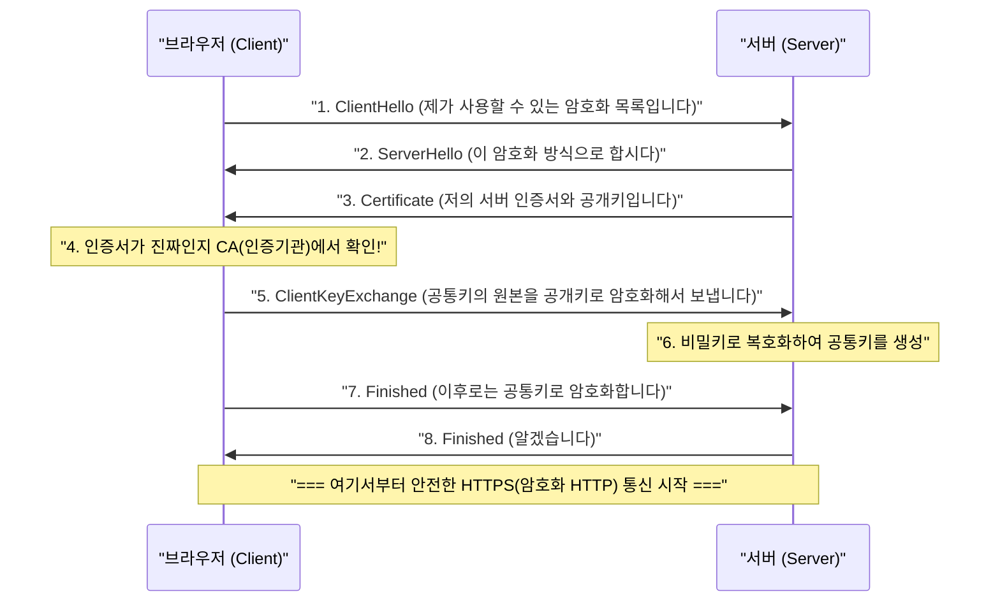

## 1. 인터넷은 '엽서'이다

우리가 평소 이용하는 웹 통신 프로토콜 'HTTP'는 매우 편리한 반면, 보안 측면에서 치명적인 약점을 가지고 있습니다. 그것은 바로 '**통신 내용이 모두 평문(암호화되지 않은 단순한 문자)으로 송수신된다**'는 것입니다.

네트워크 케이블이나 Wi-Fi 전파를 흐르는 HTTP 데이터는 중간의 라우터나 프로바이더, 혹은 악의적인 해커(패킷 스니퍼)에 의해 쉽게 내용이 엿보일 수 있습니다.
이것은 비유하자면 신용카드 번호나 비밀번호를 '**뒷면이 훤히 보이는 엽서**'에 적어 우체통에 넣는 것과 같습니다.

이 무서운 상황을 해결하고, 엽서를 '절대 열 수 없는 튼튼한 금고(봉투)'에 넣어 보내는 기술, 그것이 HTTP에 보안(Secure)의 'S'를 추가한 '**HTTPS (HTTP Secure)**'입니다.

## 2. SSL/TLS: 3가지 위협으로부터 몸을 지키는 방패

HTTPS는 HTTP라는 프로토콜 자체를 다시 쓴 것이 아닙니다. HTTP 통신을 하기 '전'에, **SSL/TLS** 라는 암호화 프로토콜 계층을 끼워 넣어, 그곳에 안전한 터널을 만든 다음 그 안에 HTTP 텍스트를 흘려보내는 구조로 되어 있습니다.

SSL(Secure Sockets Layer)은 1994년 넷스케이프(Netscape)사에 의해 개발되었고, 이후 표준화되어 TLS(Transport Layer Security)로 이름이 바뀌었지만, 현재도 관습적으로 'SSL/TLS'라고 불리고 있습니다.

SSL/TLS는 인터넷상의 3가지 거대한 위협으로부터 우리를 지켜줍니다.
1. **도청 (Eavesdropping)**: 통신 내용을 누군가 보는 것을 방지 (암호화)
2. **변조 (Tampering)**: 도중에 데이터가 수정되는 것을 방지 (메시지 인증)
3. **위장 (Spoofing)**: 통신 상대가 가짜 사이트가 아님을 증명 (디지털 인증서)

## 3. 암호화의 딜레마: 공통키와 공개키

통신을 암호화하기 위해서는 '키'가 필요합니다. 하지만 여기서 큰 딜레마가 발생합니다.

가장 빠르고 효율적인 암호화 방식은 '**공통키 암호 방식** (예: AES)'입니다. 이것은 송신자와 수신자가 '같은 1개의 키'를 가지고 암호화·복호화를 수행합니다(집 열쇠와 같습니다).
하지만, 인터넷상에서 처음으로 Amazon에서 쇼핑을 할 때, 당신과 Amazon은 어떻게 그 '공통의 키'를 안전하게 공유해야 할까요? 키 자체를 인터넷으로 보내면, 그것 역시 해커에게 도둑맞고 맙니다(키 배송 문제).

이 문제를 수학의 힘으로 훌륭하게 해결한 것이 '**공개키 암호 방식** (예: RSA, 타원곡선암호)'입니다.

공개키 암호 방식에서는 누구에게나 나눠줘도 되는 '자물쇠(공개키)'와 자신만이 가지고 있는 '열기 위한 키(비밀키)' 두 개를 쌍으로 만듭니다.
Amazon은 전 세계에 자신의 '공개키'를 뿌립니다. 당신의 브라우저는 그 Amazon의 공개키(자물쇠)를 사용하여 이번 한 번만 사용할 '공통키'를 상자에 넣고 철컥 잠근 후 Amazon에 보냅니다.
이 상자는 전 세계에서 Amazon만이 가지고 있는 '비밀키'로만 절대적으로 열 수 있습니다. 중간에 해커가 상자를 훔쳐도, 열 수 있는 키가 없기 때문에 무의미한 것입니다.

## 4. HTTPS 통신의 이면: SSL/TLS 핸드셰이크

당신이 브라우저에서 `https://...` 에 접속하는 순간, 이면에서는 불과 몇 분의 1초 사이에 브라우저와 서버 간에 '**SSL/TLS 핸드셰이크**'라고 불리는 고도의 협상이 이루어지고 있습니다.

공개키 암호는 계산 처리가 매우 무겁기 때문에, 모든 통신을 공개키로 하면 서버가 마비되어 버립니다.
그렇기 때문에 HTTPS는 '**안전한 키 전달에만 공개키 암호를 사용하고, 실제 대량의 데이터 통신에는 고속의 공통키 암호를 사용한다**'는 매우 현명한 하이브리드 방식을 채택하고 있습니다.

## 5. 공개키 기반 (PKI)과 인증기관 (CA)

여기서 마지막 문제가 남습니다. 바로 '위장'입니다.
만약 악의적인 해커가 Amazon과 똑같은 가짜 사이트를 만들고, 자신의 공개키를 당신에게 보내오면 어떻게 될까요? 당신의 브라우저는 가짜 사이트와 안전하게 암호화 통신을 확립하고, 비밀번호를 암호화하여 '안전하게' 해커에게 전달해 버릴 것입니다.

이것을 막아주는 것이 **PKI(Public Key Infrastructure: 공개키 기반)** 와 **CA(Certificate Authority: 인증기관)** 의 구조입니다.

세상에는 DigiCert나 GlobalSign, Let's Encrypt와 같은, 전 세계적으로 신뢰받는 '제3자 기관(인증기관)'이 존재합니다. Amazon 등의 기업은 이 인증기관에 엄격한 심사를 받은 후 "이 공개키는 틀림없는 진짜 Amazon의 것입니다"라는 디지털 서명이 된 '서버 인증서'를 발급받습니다.

우리들의 PC나 스마트폰 안(OS나 브라우저)에는 미리 이러한 신뢰할 수 있는 인증기관의 '루트 인증서'가 설치되어 있습니다.
브라우저는 서버로부터 인증서를 받으면, 자신이 가지고 있는 루트 인증서와 대조하여 '확실히 신뢰할 수 있는 CA가 서명한 진짜 인증서다'라고 확인되었을 때만 주소창에 '안전한 자물쇠 마크'를 표시하는 것입니다.

## 6. 요약: 상시 SSL화 시대에

과거에 HTTPS는 신용카드 번호를 입력하는 결제 화면 등 극히 일부 페이지에서만 사용되는 특별한 것이었습니다. 암호화 처리가 서버에 부하를 준다고 여겨졌기 때문입니다.

하지만 CPU 성능의 향상과 기술의 진화(HTTP/2나 HTTP/3의 등장), 그리고 무엇보다 프라이버시 보호에 대한 사회적인 요구가 높아짐에 따라, 현재는 Google 등의 주도로 '모든 웹 페이지를 HTTPS화하는 것(상시 SSL화)'이 세계적인 표준이 되었습니다. 현재 인터넷상의 웹 트래픽 중 90% 이상이 HTTPS로 암호화되어 있습니다.

눈에 보이지 않는 복잡한 수학 알고리즘과 세계적인 신뢰의 네트워크(PKI)가 연계되어 만들어내는 HTTPS. 우리가 무심코 탭하는 스마트폰 화면 이면에서는, 세계 최고의 두뇌들이 만들어낸 견고한 암호 방벽이 오늘도 우리의 데이터를 조용히 지켜주고 있습니다.
