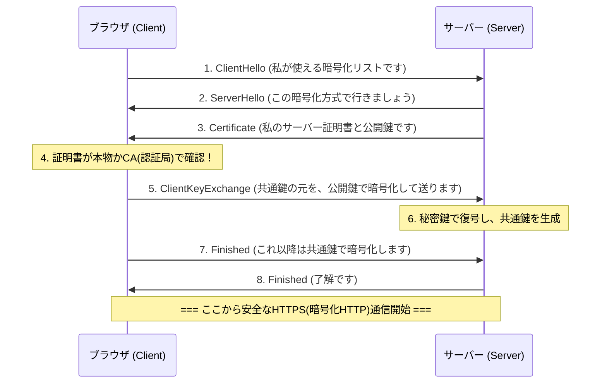

## 1. インターネットは「ハガキ」である

私たちが普段利用しているWebの通信プロトコル「HTTP」は、非常に便利な反面、セキュリティ面において致命的な弱点を持っています。それは「**通信内容がすべて平文（暗号化されていないただの文字）で送受信される**」ということです。

ネットワークのケーブルやWi-Fiの電波を流れるHTTPのデータは、途中のルーターやプロバイダ、あるいは悪意のあるハッカー（パケットスニファ）によって簡単に中身を覗き見ることができます。
これは例えるなら、クレジットカード番号やパスワードを「**裏面が丸見えのハガキ**」に書いて郵便ポストに投函しているようなものです。

この恐ろしい状況を解決し、ハガキを「絶対に開けられない頑丈な金庫（封筒）」に入れて送る技術、それがHTTPにセキュリティ（Secure）の「S」を追加した「**HTTPS (HTTP Secure)**」です。

## 2. SSL/TLS：3つの脅威から身を守る盾

HTTPSは、HTTPというプロトコル自体を書き換えたわけではありません。HTTPの通信を行う「前」に、**SSL/TLS**という暗号化プロトコルの層を挟み込み、そこで安全なトンネルを作ってから、その中にHTTPのテキストを流し込むという構造になっています。

SSL（Secure Sockets Layer）は1994年にNetscape社によって開発され、その後標準化されてTLS（Transport Layer Security）と名前を変えましたが、現在でも慣習的に「SSL/TLS」と呼ばれています。

SSL/TLSは、インターネット上の3つの巨大な脅威から私たちを守っています。
1. **盗聴（Eavesdropping）**：通信内容を見られること防ぐ（暗号化）
2. **改ざん（Tampering）**：途中でデータが書き換えられるのを防ぐ（メッセージ認証）
3. **なりすまし（Spoofing）**：通信相手が偽サイトではないことを証明する（デジタル証明書）

## 3. 暗号化のジレンマ：共通鍵と公開鍵

通信を暗号化するためには「鍵」が必要です。しかし、ここで大きなジレンマが発生します。

最も高速で効率的な暗号化方式は「**共通鍵暗号方式**（例：AES）」です。これは、送信者と受信者が「同じ1つの鍵」を持って暗号化・復号を行います（家の鍵と同じです）。
しかし、インターネット上で初めてAmazonで買い物をする際、あなたとAmazonはどうやってその「共通の鍵」を安全に共有すればよいのでしょうか？ 鍵自体をネットで送ったら、それもハッカーに盗まれてしまいます（鍵配送問題）。

この問題を数学の力で見事に解決したのが「**公開鍵暗号方式**（例：RSA, 楕円曲線暗号）」です。

公開鍵暗号方式では、誰にでも配っていい「南京錠（公開鍵）」と、自分だけが持っている「開けるための鍵（秘密鍵）」の2つをペアで作ります。
Amazonは世界中に自分の「公開鍵」をばら撒きます。あなたのブラウザは、そのAmazonの公開鍵（南京錠）を使って、今回限りの「共通鍵」を箱に入れてガチャンとロックし、Amazonに送ります。
この箱は、世界中でAmazonが持っている「秘密鍵」でしか絶対に開けられません。途中でハッカーが箱を盗んでも、開ける鍵がないため無意味なのです。

## 4. HTTPS通信の裏側：SSL/TLSハンドシェイク

あなたがブラウザで `https://...` にアクセスした瞬間、裏側ではわずかコンマ数秒の間に、ブラウザとサーバー間で「**SSL/TLSハンドシェイク**」と呼ばれる高度な交渉が行われています。

公開鍵暗号は計算処理が非常に重いため、すべての通信を公開鍵で行うとサーバーがパンクしてしまいます。
そのため、HTTPSは「**安全な鍵の受け渡しにだけ公開鍵暗号を使い、実際の大量のデータ通信には高速な共通鍵暗号を使う**」という、非常に賢いハイブリッド方式を採用しています。

## 5. 公開鍵基盤 (PKI) と認証局 (CA)

ここで最後の問題が残ります。「なりすまし」です。
もし悪意のあるハッカーがAmazonそっくりの偽サイトを作り、自分の公開鍵をあなたに送ってきたらどうなるでしょう？ あなたのブラウザは偽サイトと安全に暗号化通信を確立し、パスワードを暗号化して「安全に」ハッカーに届けてしまいます。

これを防ぐのが、**PKI（Public Key Infrastructure：公開鍵基盤）**と**CA（Certificate Authority：認証局）**の仕組みです。

世の中には、DigiCertやGlobalSign、Let's Encryptといった、世界中から信頼されている「第三者機関（認証局）」が存在します。Amazonなどの企業は、この認証局に厳しい審査を受けた上で「この公開鍵は間違いなく本物のAmazonのものです」というデジタル署名がされた「サーバー証明書」を発行してもらいます。

私たちのパソコンやスマホの中（OSやブラウザ）には、あらかじめこれらの信頼できる認証局の「ルート証明書」がインストールされています。
ブラウザはサーバーから証明書を受け取ると、自分の持っているルート証明書と照らし合わせ、「確かに信頼できるCAが署名している本物の証明書だ」と確認できた時だけ、アドレスバーに「安全な鍵マーク」を表示するのです。

## 6. まとめ：常時SSL化の時代へ

かつてHTTPSは、クレジットカード番号を入力する決済画面など、ごく一部のページでのみ使われる特別なものでした。暗号化処理がサーバーに負荷をかけると考えられていたためです。

しかし、CPU性能の向上と技術の進化（HTTP/2やHTTP/3の登場）、そして何よりプライバシー保護に対する社会的な要求の高まりにより、現在ではGoogleなどの主導で「すべてのWebページをHTTPS化する（常時SSL化）」ことが世界の標準となりました。現在、インターネット上のWebトラフィックの90%以上がHTTPSで暗号化されています。

目に見えない複雑な数学アルゴリズムと、世界的な信頼のネットワーク（PKI）が連携して作り上げるHTTPS。私たちが何気なくタップしているスマホの画面の裏側では、世界最高の頭脳たちが作り上げた強固な暗号防壁が、今日も私たちのデータを静かに守り続けています。
