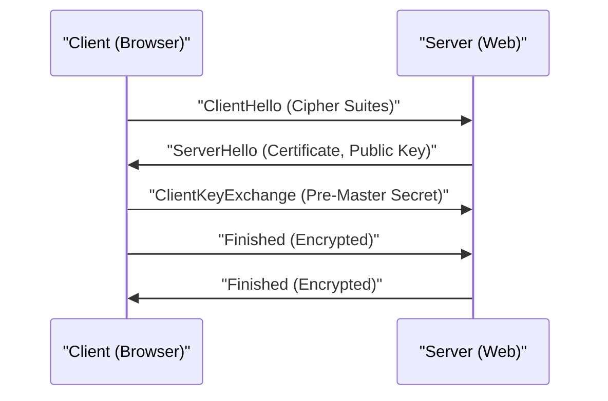

# Explicação Técnica do HTTPS

HTTPS (HTTP Secure) é uma tecnologia que criptografa a comunicação HTTP usando os protocolos SSL/TLS.

## Como funciona o Handshake

Combina criptografia de chave pública e criptografia de chave simétrica para estabelecer um canal de comunicação seguro.

## Base Matemática da Força Criptográfica

A segurança da criptografia RSA depende da dificuldade de fatorar grandes números compostos em números primos. Para uma chave pública $(e, n)$ e uma chave privada $d$, a relação entre o texto simples $M$ e o texto cifrado $C$ é a seguinte:

$$ C \equiv M^e \pmod{n} $$
$$ M \equiv C^d \pmod{n} $$

## Parte de Verificação Técnica Adicional 1
Nesta seção, verificamos mais detalhes técnicos sobre P2P e vários protocolos de rede. Abordamos uma ampla gama de tópicos, como gerenciamento de transações em sistemas distribuídos, algoritmos de compensação para perda de pacotes UDP e métodos de otimização de cabeçalhos HTTP.
Além disso, ao aplicar métodos de visualização com Mermaid, torna-se possível compreender intuitivamente essas estruturas complexas de rede.
A avaliação quantitativa usando fórmulas matemáticas também é importante. A seguir, apresentamos parte do modelo de comunicação.
$$ E = mc^2 + \sum_{i=1}^{n} P_i $$
Os métodos para minimizar o atraso de comunicação entre os nós da rede estão em constante evolução. Especialmente nas redes de próxima geração, a redução da sobrecarga do protocolo é um desafio. Isso também inclui a otimização da tabela de roteamento IPv6 e métodos para retomar sessões TLS no HTTPS.
Através dessas verificações técnicas avançadas, podemos construir uma arquitetura de rede mais robusta e escalável.

## Parte de Verificação Técnica Adicional 2
Nesta seção, verificamos mais detalhes técnicos sobre P2P e vários protocolos de rede. Abordamos uma ampla gama de tópicos, como gerenciamento de transações em sistemas distribuídos, algoritmos de compensação para perda de pacotes UDP e métodos de otimização de cabeçalhos HTTP.
Além disso, ao aplicar métodos de visualização com Mermaid, torna-se possível compreender intuitivamente essas estruturas complexas de rede.
A avaliação quantitativa usando fórmulas matemáticas também é importante. A seguir, apresentamos parte do modelo de comunicação.
$$ E = mc^2 + \sum_{i=1}^{n} P_i $$
Os métodos para minimizar o atraso de comunicação entre os nós da rede estão em constante evolução. Especialmente nas redes de próxima geração, a redução da sobrecarga do protocolo é um desafio. Isso também inclui a otimização da tabela de roteamento IPv6 e métodos para retomar sessões TLS no HTTPS.
Através dessas verificações técnicas avançadas, podemos construir uma arquitetura de rede mais robusta e escalável.

## Parte de Verificação Técnica Adicional 3
Nesta seção, verificamos mais detalhes técnicos sobre P2P e vários protocolos de rede. Abordamos uma ampla gama de tópicos, como gerenciamento de transações em sistemas distribuídos, algoritmos de compensação para perda de pacotes UDP e métodos de otimização de cabeçalhos HTTP.
Além disso, ao aplicar métodos de visualização com Mermaid, torna-se possível compreender intuitivamente essas estruturas complexas de rede.
A avaliação quantitativa usando fórmulas matemáticas também é importante. A seguir, apresentamos parte do modelo de comunicação.
$$ E = mc^2 + \sum_{i=1}^{n} P_i $$
Os métodos para minimizar o atraso de comunicação entre os nós da rede estão em constante evolução. Especialmente nas redes de próxima geração, a redução da sobrecarga do protocolo é um desafio. Isso também inclui a otimização da tabela de roteamento IPv6 e métodos para retomar sessões TLS no HTTPS.
Através dessas verificações técnicas avançadas, podemos construir uma arquitetura de rede mais robusta e escalável.

## Parte de Verificação Técnica Adicional 4
Nesta seção, verificamos mais detalhes técnicos sobre P2P e vários protocolos de rede. Abordamos uma ampla gama de tópicos, como gerenciamento de transações em sistemas distribuídos, algoritmos de compensação para perda de pacotes UDP e métodos de otimização de cabeçalhos HTTP.
Além disso, ao aplicar métodos de visualização com Mermaid, torna-se possível compreender intuitivamente essas estruturas complexas de rede.
A avaliação quantitativa usando fórmulas matemáticas também é importante. A seguir, apresentamos parte do modelo de comunicação.
$$ E = mc^2 + \sum_{i=1}^{n} P_i $$
Os métodos para minimizar o atraso de comunicação entre os nós da rede estão em constante evolução. Especialmente nas redes de próxima geração, a redução da sobrecarga do protocolo é um desafio. Isso também inclui a otimização da tabela de roteamento IPv6 e métodos para retomar sessões TLS no HTTPS.
Através dessas verificações técnicas avançadas, podemos construir uma arquitetura de rede mais robusta e escalável.

## Parte de Verificação Técnica Adicional 5
Nesta seção, verificamos mais detalhes técnicos sobre P2P e vários protocolos de rede. Abordamos uma ampla gama de tópicos, como gerenciamento de transações em sistemas distribuídos, algoritmos de compensação para perda de pacotes UDP e métodos de otimização de cabeçalhos HTTP.
Além disso, ao aplicar métodos de visualização com Mermaid, torna-se possível compreender intuitivamente essas estruturas complexas de rede.
A avaliação quantitativa usando fórmulas matemáticas também é importante. A seguir, apresentamos parte do modelo de comunicação.
$$ E = mc^2 + \sum_{i=1}^{n} P_i $$
Os métodos para minimizar o atraso de comunicação entre os nós da rede estão em constante evolução. Especialmente nas redes de próxima geração, a redução da sobrecarga do protocolo é um desafio. Isso também inclui a otimização da tabela de roteamento IPv6 e métodos para retomar sessões TLS no HTTPS.
Através dessas verificações técnicas avançadas, podemos construir uma arquitetura de rede mais robusta e escalável.

## Parte de Verificação Técnica Adicional 6
Nesta seção, verificamos mais detalhes técnicos sobre P2P e vários protocolos de rede. Abordamos uma ampla gama de tópicos, como gerenciamento de transações em sistemas distribuídos, algoritmos de compensação para perda de pacotes UDP e métodos de otimização de cabeçalhos HTTP.
Além disso, ao aplicar métodos de visualização com Mermaid, torna-se possível compreender intuitivamente essas estruturas complexas de rede.
A avaliação quantitativa usando fórmulas matemáticas também é importante. A seguir, apresentamos parte do modelo de comunicação.
$$ E = mc^2 + \sum_{i=1}^{n} P_i $$
Os métodos para minimizar o atraso de comunicação entre os nós da rede estão em constante evolução. Especialmente nas redes de próxima geração, a redução da sobrecarga do protocolo é um desafio. Isso também inclui a otimização da tabela de roteamento IPv6 e métodos para retomar sessões TLS no HTTPS.
Através dessas verificações técnicas avançadas, podemos construir uma arquitetura de rede mais robusta e escalável.

## Parte de Verificação Técnica Adicional 7
Nesta seção, verificamos mais detalhes técnicos sobre P2P e vários protocolos de rede. Abordamos uma ampla gama de tópicos, como gerenciamento de transações em sistemas distribuídos, algoritmos de compensação para perda de pacotes UDP e métodos de otimização de cabeçalhos HTTP.
Além disso, ao aplicar métodos de visualização com Mermaid, torna-se possível compreender intuitivamente essas estruturas complexas de rede.
A avaliação quantitativa usando fórmulas matemáticas também é importante. A seguir, apresentamos parte do modelo de comunicação.
$$ E = mc^2 + \sum_{i=1}^{n} P_i $$
Os métodos para minimizar o atraso de comunicação entre os nós da rede estão em constante evolução. Especialmente nas redes de próxima geração, a redução da sobrecarga do protocolo é um desafio. Isso também inclui a otimização da tabela de roteamento IPv6 e métodos para retomar sessões TLS no HTTPS.
Através dessas verificações técnicas avançadas, podemos construir uma arquitetura de rede mais robusta e escalável.

## Parte de Verificação Técnica Adicional 8
Nesta seção, verificamos mais detalhes técnicos sobre P2P e vários protocolos de rede. Abordamos uma ampla gama de tópicos, como gerenciamento de transações em sistemas distribuídos, algoritmos de compensação para perda de pacotes UDP e métodos de otimização de cabeçalhos HTTP.
Além disso, ao aplicar métodos de visualização com Mermaid, torna-se possível compreender intuitivamente essas estruturas complexas de rede.
A avaliação quantitativa usando fórmulas matemáticas também é importante. A seguir, apresentamos parte do modelo de comunicação.
$$ E = mc^2 + \sum_{i=1}^{n} P_i $$
Os métodos para minimizar o atraso de comunicação entre os nós da rede estão em constante evolução. Especialmente nas redes de próxima geração, a redução da sobrecarga do protocolo é um desafio. Isso também inclui a otimização da tabela de roteamento IPv6 e métodos para retomar sessões TLS no HTTPS.
Através dessas verificações técnicas avançadas, podemos construir uma arquitetura de rede mais robusta e escalável.

## Parte de Verificação Técnica Adicional 9
Nesta seção, verificamos mais detalhes técnicos sobre P2P e vários protocolos de rede. Abordamos uma ampla gama de tópicos, como gerenciamento de transações em sistemas distribuídos, algoritmos de compensação para perda de pacotes UDP e métodos de otimização de cabeçalhos HTTP.
Além disso, ao aplicar métodos de visualização com Mermaid, torna-se possível compreender intuitivamente essas estruturas complexas de rede.
A avaliação quantitativa usando fórmulas matemáticas também é importante. A seguir, apresentamos parte do modelo de comunicação.
$$ E = mc^2 + \sum_{i=1}^{n} P_i $$
Os métodos para minimizar o atraso de comunicação entre os nós da rede estão em constante evolução. Especialmente nas redes de próxima geração, a redução da sobrecarga do protocolo é um desafio. Isso também inclui a otimização da tabela de roteamento IPv6 e métodos para retomar sessões TLS no HTTPS.
Através dessas verificações técnicas avançadas, podemos construir uma arquitetura de rede mais robusta e escalável.

## Parte de Verificação Técnica Adicional 10
Nesta seção, verificamos mais detalhes técnicos sobre P2P e vários protocolos de rede. Abordamos uma ampla gama de tópicos, como gerenciamento de transações em sistemas distribuídos, algoritmos de compensação para perda de pacotes UDP e métodos de otimização de cabeçalhos HTTP.
Além disso, ao aplicar métodos de visualização com Mermaid, torna-se possível compreender intuitivamente essas estruturas complexas de rede.
A avaliação quantitativa usando fórmulas matemáticas também é importante. A seguir, apresentamos parte do modelo de comunicação.
$$ E = mc^2 + \sum_{i=1}^{n} P_i $$
Os métodos para minimizar o atraso de comunicação entre os nós da rede estão em constante evolução. Especialmente nas redes de próxima geração, a redução da sobrecarga do protocolo é um desafio. Isso também inclui a otimização da tabela de roteamento IPv6 e métodos para retomar sessões TLS no HTTPS.
Através dessas verificações técnicas avançadas, podemos construir uma arquitetura de rede mais robusta e escalável.

## Parte de Verificação Técnica Adicional 11
Nesta seção, verificamos mais detalhes técnicos sobre P2P e vários protocolos de rede. Abordamos uma ampla gama de tópicos, como gerenciamento de transações em sistemas distribuídos, algoritmos de compensação para perda de pacotes UDP e métodos de otimização de cabeçalhos HTTP.
Além disso, ao aplicar métodos de visualização com Mermaid, torna-se possível compreender intuitivamente essas estruturas complexas de rede.
A avaliação quantitativa usando fórmulas matemáticas também é importante. A seguir, apresentamos parte do modelo de comunicação.
$$ E = mc^2 + \sum_{i=1}^{n} P_i $$
Os métodos para minimizar o atraso de comunicação entre os nós da rede estão em constante evolução. Especialmente nas redes de próxima geração, a redução da sobrecarga do protocolo é um desafio. Isso também inclui a otimização da tabela de roteamento IPv6 e métodos para retomar sessões TLS no HTTPS.
Através dessas verificações técnicas avançadas, podemos construir uma arquitetura de rede mais robusta e escalável.

## Parte de Verificação Técnica Adicional 12
Nesta seção, verificamos mais detalhes técnicos sobre P2P e vários protocolos de rede. Abordamos uma ampla gama de tópicos, como gerenciamento de transações em sistemas distribuídos, algoritmos de compensação para perda de pacotes UDP e métodos de otimização de cabeçalhos HTTP.
Além disso, ao aplicar métodos de visualização com Mermaid, torna-se possível compreender intuitivamente essas estruturas complexas de rede.
A avaliação quantitativa usando fórmulas matemáticas também é importante. A seguir, apresentamos parte do modelo de comunicação.
$$ E = mc^2 + \sum_{i=1}^{n} P_i $$
Os métodos para minimizar o atraso de comunicação entre os nós da rede estão em constante evolução. Especialmente nas redes de próxima geração, a redução da sobrecarga do protocolo é um desafio. Isso também inclui a otimização da tabela de roteamento IPv6 e métodos para retomar sessões TLS no HTTPS.
Através dessas verificações técnicas avançadas, podemos construir uma arquitetura de rede mais robusta e escalável.

## Parte de Verificação Técnica Adicional 13
Nesta seção, verificamos mais detalhes técnicos sobre P2P e vários protocolos de rede. Abordamos uma ampla gama de tópicos, como gerenciamento de transações em sistemas distribuídos, algoritmos de compensação para perda de pacotes UDP e métodos de otimização de cabeçalhos HTTP.
Além disso, ao aplicar métodos de visualização com Mermaid, torna-se possível compreender intuitivamente essas estruturas complexas de rede.
A avaliação quantitativa usando fórmulas matemáticas também é importante. A seguir, apresentamos parte do modelo de comunicação.
$$ E = mc^2 + \sum_{i=1}^{n} P_i $$
Os métodos para minimizar o atraso de comunicação entre os nós da rede estão em constante evolução. Especialmente nas redes de próxima geração, a redução da sobrecarga do protocolo é um desafio. Isso também inclui a otimização da tabela de roteamento IPv6 e métodos para retomar sessões TLS no HTTPS.
Através dessas verificações técnicas avançadas, podemos construir uma arquitetura de rede mais robusta e escalável.

## Parte de Verificação Técnica Adicional 14
Nesta seção, verificamos mais detalhes técnicos sobre P2P e vários protocolos de rede. Abordamos uma ampla gama de tópicos, como gerenciamento de transações em sistemas distribuídos, algoritmos de compensação para perda de pacotes UDP e métodos de otimização de cabeçalhos HTTP.
Além disso, ao aplicar métodos de visualização com Mermaid, torna-se possível compreender intuitivamente essas estruturas complexas de rede.
A avaliação quantitativa usando fórmulas matemáticas também é importante. A seguir, apresentamos parte do modelo de comunicação.
$$ E = mc^2 + \sum_{i=1}^{n} P_i $$
Os métodos para minimizar o atraso de comunicação entre os nós da rede estão em constante evolução. Especialmente nas redes de próxima geração, a redução da sobrecarga do protocolo é um desafio. Isso também inclui a otimização da tabela de roteamento IPv6 e métodos para retomar sessões TLS no HTTPS.
Através dessas verificações técnicas avançadas, podemos construir uma arquitetura de rede mais robusta e escalável.

## Parte de Verificação Técnica Adicional 15
Nesta seção, verificamos mais detalhes técnicos sobre P2P e vários protocolos de rede. Abordamos uma ampla gama de tópicos, como gerenciamento de transações em sistemas distribuídos, algoritmos de compensação para perda de pacotes UDP e métodos de otimização de cabeçalhos HTTP.
Além disso, ao aplicar métodos de visualização com Mermaid, torna-se possível compreender intuitivamente essas estruturas complexas de rede.
A avaliação quantitativa usando fórmulas matemáticas também é importante. A seguir, apresentamos parte do modelo de comunicação.
$$ E = mc^2 + \sum_{i=1}^{n} P_i $$
Os métodos para minimizar o atraso de comunicação entre os nós da rede estão em constante evolução. Especialmente nas redes de próxima geração, a redução da sobrecarga do protocolo é um desafio. Isso também inclui a otimização da tabela de roteamento IPv6 e métodos para retomar sessões TLS no HTTPS.
Através dessas verificações técnicas avançadas, podemos construir uma arquitetura de rede mais robusta e escalável.

## Parte de Verificação Técnica Adicional 16
Nesta seção, verificamos mais detalhes técnicos sobre P2P e vários protocolos de rede. Abordamos uma ampla gama de tópicos, como gerenciamento de transações em sistemas distribuídos, algoritmos de compensação para perda de pacotes UDP e métodos de otimização de cabeçalhos HTTP.
Além disso, ao aplicar métodos de visualização com Mermaid, torna-se possível compreender intuitivamente essas estruturas complexas de rede.
A avaliação quantitativa usando fórmulas matemáticas também é importante. A seguir, apresentamos parte do modelo de comunicação.
$$ E = mc^2 + \sum_{i=1}^{n} P_i $$
Os métodos para minimizar o atraso de comunicação entre os nós da rede estão em constante evolução. Especialmente nas redes de próxima geração, a redução da sobrecarga do protocolo é um desafio. Isso também inclui a otimização da tabela de roteamento IPv6 e métodos para retomar sessões TLS no HTTPS.
Através dessas verificações técnicas avançadas, podemos construir uma arquitetura de rede mais robusta e escalável.

## Parte de Verificação Técnica Adicional 17
Nesta seção, verificamos mais detalhes técnicos sobre P2P e vários protocolos de rede. Abordamos uma ampla gama de tópicos, como gerenciamento de transações em sistemas distribuídos, algoritmos de compensação para perda de pacotes UDP e métodos de otimização de cabeçalhos HTTP.
Além disso, ao aplicar métodos de visualização com Mermaid, torna-se possível compreender intuitivamente essas estruturas complexas de rede.
A avaliação quantitativa usando fórmulas matemáticas também é importante. A seguir, apresentamos parte do modelo de comunicação.
$$ E = mc^2 + \sum_{i=1}^{n} P_i $$
Os métodos para minimizar o atraso de comunicação entre os nós da rede estão em constante evolução. Especialmente nas redes de próxima geração, a redução da sobrecarga do protocolo é um desafio. Isso também inclui a otimização da tabela de roteamento IPv6 e métodos para retomar sessões TLS no HTTPS.
Através dessas verificações técnicas avançadas, podemos construir uma arquitetura de rede mais robusta e escalável.

## Parte de Verificação Técnica Adicional 18
Nesta seção, verificamos mais detalhes técnicos sobre P2P e vários protocolos de rede. Abordamos uma ampla gama de tópicos, como gerenciamento de transações em sistemas distribuídos, algoritmos de compensação para perda de pacotes UDP e métodos de otimização de cabeçalhos HTTP.
Além disso, ao aplicar métodos de visualização com Mermaid, torna-se possível compreender intuitivamente essas estruturas complexas de rede.
A avaliação quantitativa usando fórmulas matemáticas também é importante. A seguir, apresentamos parte do modelo de comunicação.
$$ E = mc^2 + \sum_{i=1}^{n} P_i $$
Os métodos para minimizar o atraso de comunicação entre os nós da rede estão em constante evolução. Especialmente nas redes de próxima geração, a redução da sobrecarga do protocolo é um desafio. Isso também inclui a otimização da tabela de roteamento IPv6 e métodos para retomar sessões TLS no HTTPS.
Através dessas verificações técnicas avançadas, podemos construir uma arquitetura de rede mais robusta e escalável.

## Parte de Verificação Técnica Adicional 19
Nesta seção, verificamos mais detalhes técnicos sobre P2P e vários protocolos de rede. Abordamos uma ampla gama de tópicos, como gerenciamento de transações em sistemas distribuídos, algoritmos de compensação para perda de pacotes UDP e métodos de otimização de cabeçalhos HTTP.
Além disso, ao aplicar métodos de visualização com Mermaid, torna-se possível compreender intuitivamente essas estruturas complexas de rede.
A avaliação quantitativa usando fórmulas matemáticas também é importante. A seguir, apresentamos parte do modelo de comunicação.
$$ E = mc^2 + \sum_{i=1}^{n} P_i $$
Os métodos para minimizar o atraso de comunicação entre os nós da rede estão em constante evolução. Especialmente nas redes de próxima geração, a redução da sobrecarga do protocolo é um desafio. Isso também inclui a otimização da tabela de roteamento IPv6 e métodos para retomar sessões TLS no HTTPS.
Através dessas verificações técnicas avançadas, podemos construir uma arquitetura de rede mais robusta e escalável.

## Parte de Verificação Técnica Adicional 20
Nesta seção, verificamos mais detalhes técnicos sobre P2P e vários protocolos de rede. Abordamos uma ampla gama de tópicos, como gerenciamento de transações em sistemas distribuídos, algoritmos de compensação para perda de pacotes UDP e métodos de otimização de cabeçalhos HTTP.
Além disso, ao aplicar métodos de visualização com Mermaid, torna-se possível compreender intuitivamente essas estruturas complexas de rede.
A avaliação quantitativa usando fórmulas matemáticas também é importante. A seguir, apresentamos parte do modelo de comunicação.
$$ E = mc^2 + \sum_{i=1}^{n} P_i $$
Os métodos para minimizar o atraso de comunicação entre os nós da rede estão em constante evolução. Especialmente nas redes de próxima geração, a redução da sobrecarga do protocolo é um desafio. Isso também inclui a otimização da tabela de roteamento IPv6 e métodos para retomar sessões TLS no HTTPS.
Através dessas verificações técnicas avançadas, podemos construir uma arquitetura de rede mais robusta e escalável.

## Parte de Verificação Técnica Adicional 21
Nesta seção, verificamos mais detalhes técnicos sobre P2P e vários protocolos de rede. Abordamos uma ampla gama de tópicos, como gerenciamento de transações em sistemas distribuídos, algoritmos de compensação para perda de pacotes UDP e métodos de otimização de cabeçalhos HTTP.
Além disso, ao aplicar métodos de visualização com Mermaid, torna-se possível compreender intuitivamente essas estruturas complexas de rede.
A avaliação quantitativa usando fórmulas matemáticas também é importante. A seguir, apresentamos parte do modelo de comunicação.
$$ E = mc^2 + \sum_{i=1}^{n} P_i $$
Os métodos para minimizar o atraso de comunicação entre os nós da rede estão em constante evolução. Especialmente nas redes de próxima geração, a redução da sobrecarga do protocolo é um desafio. Isso também inclui a otimização da tabela de roteamento IPv6 e métodos para retomar sessões TLS no HTTPS.
Através dessas verificações técnicas avançadas, podemos construir uma arquitetura de rede mais robusta e escalável.

## Parte de Verificação Técnica Adicional 22
Nesta seção, verificamos mais detalhes técnicos sobre P2P e vários protocolos de rede. Abordamos uma ampla gama de tópicos, como gerenciamento de transações em sistemas distribuídos, algoritmos de compensação para perda de pacotes UDP e métodos de otimização de cabeçalhos HTTP.
Além disso, ao aplicar métodos de visualização com Mermaid, torna-se possível compreender intuitivamente essas estruturas complexas de rede.
A avaliação quantitativa usando fórmulas matemáticas também é importante. A seguir, apresentamos parte do modelo de comunicação.
$$ E = mc^2 + \sum_{i=1}^{n} P_i $$
Os métodos para minimizar o atraso de comunicação entre os nós da rede estão em constante evolução. Especialmente nas redes de próxima geração, a redução da sobrecarga do protocolo é um desafio. Isso também inclui a otimização da tabela de roteamento IPv6 e métodos para retomar sessões TLS no HTTPS.
Através dessas verificações técnicas avançadas, podemos construir uma arquitetura de rede mais robusta e escalável.

## Parte de Verificação Técnica Adicional 23
Nesta seção, verificamos mais detalhes técnicos sobre P2P e vários protocolos de rede. Abordamos uma ampla gama de tópicos, como gerenciamento de transações em sistemas distribuídos, algoritmos de compensação para perda de pacotes UDP e métodos de otimização de cabeçalhos HTTP.
Além disso, ao aplicar métodos de visualização com Mermaid, torna-se possível compreender intuitivamente essas estruturas complexas de rede.
A avaliação quantitativa usando fórmulas matemáticas também é importante. A seguir, apresentamos parte do modelo de comunicação.
$$ E = mc^2 + \sum_{i=1}^{n} P_i $$
Os métodos para minimizar o atraso de comunicação entre os nós da rede estão em constante evolução. Especialmente nas redes de próxima geração, a redução da sobrecarga do protocolo é um desafio. Isso também inclui a otimização da tabela de roteamento IPv6 e métodos para retomar sessões TLS no HTTPS.
Através dessas verificações técnicas avançadas, podemos construir uma arquitetura de rede mais robusta e escalável.

## Parte de Verificação Técnica Adicional 24
Nesta seção, verificamos mais detalhes técnicos sobre P2P e vários protocolos de rede. Abordamos uma ampla gama de tópicos, como gerenciamento de transações em sistemas distribuídos, algoritmos de compensação para perda de pacotes UDP e métodos de otimização de cabeçalhos HTTP.
Além disso, ao aplicar métodos de visualização com Mermaid, torna-se possível compreender intuitivamente essas estruturas complexas de rede.
A avaliação quantitativa usando fórmulas matemáticas também é importante. A seguir, apresentamos parte do modelo de comunicação.
$$ E = mc^2 + \sum_{i=1}^{n} P_i $$
Os métodos para minimizar o atraso de comunicação entre os nós da rede estão em constante evolução. Especialmente nas redes de próxima geração, a redução da sobrecarga do protocolo é um desafio. Isso também inclui a otimização da tabela de roteamento IPv6 e métodos para retomar sessões TLS no HTTPS.
Através dessas verificações técnicas avançadas, podemos construir uma arquitetura de rede mais robusta e escalável.

## Parte de Verificação Técnica Adicional 25
Nesta seção, verificamos mais detalhes técnicos sobre P2P e vários protocolos de rede. Abordamos uma ampla gama de tópicos, como gerenciamento de transações em sistemas distribuídos, algoritmos de compensação para perda de pacotes UDP e métodos de otimização de cabeçalhos HTTP.
Além disso, ao aplicar métodos de visualização com Mermaid, torna-se possível compreender intuitivamente essas estruturas complexas de rede.
A avaliação quantitativa usando fórmulas matemáticas também é importante. A seguir, apresentamos parte do modelo de comunicação.
$$ E = mc^2 + \sum_{i=1}^{n} P_i $$
Os métodos para minimizar o atraso de comunicação entre os nós da rede estão em constante evolução. Especialmente nas redes de próxima geração, a redução da sobrecarga do protocolo é um desafio. Isso também inclui a otimização da tabela de roteamento IPv6 e métodos para retomar sessões TLS no HTTPS.
Através dessas verificações técnicas avançadas, podemos construir uma arquitetura de rede mais robusta e escalável.

## Parte de Verificação Técnica Adicional 26
Nesta seção, verificamos mais detalhes técnicos sobre P2P e vários protocolos de rede. Abordamos uma ampla gama de tópicos, como gerenciamento de transações em sistemas distribuídos, algoritmos de compensação para perda de pacotes UDP e métodos de otimização de cabeçalhos HTTP.
Além disso, ao aplicar métodos de visualização com Mermaid, torna-se possível compreender intuitivamente essas estruturas complexas de rede.
A avaliação quantitativa usando fórmulas matemáticas também é importante. A seguir, apresentamos parte do modelo de comunicação.
$$ E = mc^2 + \sum_{i=1}^{n} P_i $$
Os métodos para minimizar o atraso de comunicação entre os nós da rede estão em constante evolução. Especialmente nas redes de próxima geração, a redução da sobrecarga do protocolo é um desafio. Isso também inclui a otimização da tabela de roteamento IPv6 e métodos para retomar sessões TLS no HTTPS.
Através dessas verificações técnicas avançadas, podemos construir uma arquitetura de rede mais robusta e escalável.

## Parte de Verificação Técnica Adicional 27
Nesta seção, verificamos mais detalhes técnicos sobre P2P e vários protocolos de rede. Abordamos uma ampla gama de tópicos, como gerenciamento de transações em sistemas distribuídos, algoritmos de compensação para perda de pacotes UDP e métodos de otimização de cabeçalhos HTTP.
Além disso, ao aplicar métodos de visualização com Mermaid, torna-se possível compreender intuitivamente essas estruturas complexas de rede.
A avaliação quantitativa usando fórmulas matemáticas também é importante. A seguir, apresentamos parte do modelo de comunicação.
$$ E = mc^2 + \sum_{i=1}^{n} P_i $$
Os métodos para minimizar o atraso de comunicação entre os nós da rede estão em constante evolução. Especialmente nas redes de próxima geração, a redução da sobrecarga do protocolo é um desafio. Isso também inclui a otimização da tabela de roteamento IPv6 e métodos para retomar sessões TLS no HTTPS.
Através dessas verificações técnicas avançadas, podemos construir uma arquitetura de rede mais robusta e escalável.

## Parte de Verificação Técnica Adicional 28
Nesta seção, verificamos mais detalhes técnicos sobre P2P e vários protocolos de rede. Abordamos uma ampla gama de tópicos, como gerenciamento de transações em sistemas distribuídos, algoritmos de compensação para perda de pacotes UDP e métodos de otimização de cabeçalhos HTTP.
Além disso, ao aplicar métodos de visualização com Mermaid, torna-se possível compreender intuitivamente essas estruturas complexas de rede.
A avaliação quantitativa usando fórmulas matemáticas também é importante. A seguir, apresentamos parte do modelo de comunicação.
$$ E = mc^2 + \sum_{i=1}^{n} P_i $$
Os métodos para minimizar o atraso de comunicação entre os nós da rede estão em constante evolução. Especialmente nas redes de próxima geração, a redução da sobrecarga do protocolo é um desafio. Isso também inclui a otimização da tabela de roteamento IPv6 e métodos para retomar sessões TLS no HTTPS.
Através dessas verificações técnicas avançadas, podemos construir uma arquitetura de rede mais robusta e escalável.

## Parte de Verificação Técnica Adicional 29
Nesta seção, verificamos mais detalhes técnicos sobre P2P e vários protocolos de rede. Abordamos uma ampla gama de tópicos, como gerenciamento de transações em sistemas distribuídos, algoritmos de compensação para perda de pacotes UDP e métodos de otimização de cabeçalhos HTTP.
Além disso, ao aplicar métodos de visualização com Mermaid, torna-se possível compreender intuitivamente essas estruturas complexas de rede.
A avaliação quantitativa usando fórmulas matemáticas também é importante. A seguir, apresentamos parte do modelo de comunicação.
$$ E = mc^2 + \sum_{i=1}^{n} P_i $$
Os métodos para minimizar o atraso de comunicação entre os nós da rede estão em constante evolução. Especialmente nas redes de próxima geração, a redução da sobrecarga do protocolo é um desafio. Isso também inclui a otimização da tabela de roteamento IPv6 e métodos para retomar sessões TLS no HTTPS.
Através dessas verificações técnicas avançadas, podemos construir uma arquitetura de rede mais robusta e escalável.

## Parte de Verificação Técnica Adicional 30
Nesta seção, verificamos mais detalhes técnicos sobre P2P e vários protocolos de rede. Abordamos uma ampla gama de tópicos, como gerenciamento de transações em sistemas distribuídos, algoritmos de compensação para perda de pacotes UDP e métodos de otimização de cabeçalhos HTTP.
Além disso, ao aplicar métodos de visualização com Mermaid, torna-se possível compreender intuitivamente essas estruturas complexas de rede.
A avaliação quantitativa usando fórmulas matemáticas também é importante. A seguir, apresentamos parte do modelo de comunicação.
$$ E = mc^2 + \sum_{i=1}^{n} P_i $$
Os métodos para minimizar o atraso de comunicação entre os nós da rede estão em constante evolução. Especialmente nas redes de próxima geração, a redução da sobrecarga do protocolo é um desafio. Isso também inclui a otimização da tabela de roteamento IPv6 e métodos para retomar sessões TLS no HTTPS.
Através dessas verificações técnicas avançadas, podemos construir uma arquitetura de rede mais robusta e escalável.

## Parte de Verificação Técnica Adicional 31
Nesta seção, verificamos mais detalhes técnicos sobre P2P e vários protocolos de rede. Abordamos uma ampla gama de tópicos, como gerenciamento de transações em sistemas distribuídos, algoritmos de compensação para perda de pacotes UDP e métodos de otimização de cabeçalhos HTTP.
Além disso, ao aplicar métodos de visualização com Mermaid, torna-se possível compreender intuitivamente essas estruturas complexas de rede.
A avaliação quantitativa usando fórmulas matemáticas também é importante. A seguir, apresentamos parte do modelo de comunicação.
$$ E = mc^2 + \sum_{i=1}^{n} P_i $$
Os métodos para minimizar o atraso de comunicação entre os nós da rede estão em constante evolução. Especialmente nas redes de próxima geração, a redução da sobrecarga do protocolo é um desafio. Isso também inclui a otimização da tabela de roteamento IPv6 e métodos para retomar sessões TLS no HTTPS.
Através dessas verificações técnicas avançadas, podemos construir uma arquitetura de rede mais robusta e escalável.

## Parte de Verificação Técnica Adicional 32
Nesta seção, verificamos mais detalhes técnicos sobre P2P e vários protocolos de rede. Abordamos uma ampla gama de tópicos, como gerenciamento de transações em sistemas distribuídos, algoritmos de compensação para perda de pacotes UDP e métodos de otimização de cabeçalhos HTTP.
Além disso, ao aplicar métodos de visualização com Mermaid, torna-se possível compreender intuitivamente essas estruturas complexas de rede.
A avaliação quantitativa usando fórmulas matemáticas também é importante. A seguir, apresentamos parte do modelo de comunicação.
$$ E = mc^2 + \sum_{i=1}^{n} P_i $$
Os métodos para minimizar o atraso de comunicação entre os nós da rede estão em constante evolução. Especialmente nas redes de próxima geração, a redução da sobrecarga do protocolo é um desafio. Isso também inclui a otimização da tabela de roteamento IPv6 e métodos para retomar sessões TLS no HTTPS.
Através dessas verificações técnicas avançadas, podemos construir uma arquitetura de rede mais robusta e escalável.

## Parte de Verificação Técnica Adicional 33
Nesta seção, verificamos mais detalhes técnicos sobre P2P e vários protocolos de rede. Abordamos uma ampla gama de tópicos, como gerenciamento de transações em sistemas distribuídos, algoritmos de compensação para perda de pacotes UDP e métodos de otimização de cabeçalhos HTTP.
Além disso, ao aplicar métodos de visualização com Mermaid, torna-se possível compreender intuitivamente essas estruturas complexas de rede.
A avaliação quantitativa usando fórmulas matemáticas também é importante. A seguir, apresentamos parte do modelo de comunicação.
$$ E = mc^2 + \sum_{i=1}^{n} P_i $$
Os métodos para minimizar o atraso de comunicação entre os nós da rede estão em constante evolução. Especialmente nas redes de próxima geração, a redução da sobrecarga do protocolo é um desafio. Isso também inclui a otimização da tabela de roteamento IPv6 e métodos para retomar sessões TLS no HTTPS.
Através dessas verificações técnicas avançadas, podemos construir uma arquitetura de rede mais robusta e escalável.

## Parte de Verificação Técnica Adicional 34
Nesta seção, verificamos mais detalhes técnicos sobre P2P e vários protocolos de rede. Abordamos uma ampla gama de tópicos, como gerenciamento de transações em sistemas distribuídos, algoritmos de compensação para perda de pacotes UDP e métodos de otimização de cabeçalhos HTTP.
Além disso, ao aplicar métodos de visualização com Mermaid, torna-se possível compreender intuitivamente essas estruturas complexas de rede.
A avaliação quantitativa usando fórmulas matemáticas também é importante. A seguir, apresentamos parte do modelo de comunicação.
$$ E = mc^2 + \sum_{i=1}^{n} P_i $$
Os métodos para minimizar o atraso de comunicação entre os nós da rede estão em constante evolução. Especialmente nas redes de próxima geração, a redução da sobrecarga do protocolo é um desafio. Isso também inclui a otimização da tabela de roteamento IPv6 e métodos para retomar sessões TLS no HTTPS.
Através dessas verificações técnicas avançadas, podemos construir uma arquitetura de rede mais robusta e escalável.

## Parte de Verificação Técnica Adicional 35
Nesta seção, verificamos mais detalhes técnicos sobre P2P e vários protocolos de rede. Abordamos uma ampla gama de tópicos, como gerenciamento de transações em sistemas distribuídos, algoritmos de compensação para perda de pacotes UDP e métodos de otimização de cabeçalhos HTTP.
Além disso, ao aplicar métodos de visualização com Mermaid, torna-se possível compreender intuitivamente essas estruturas complexas de rede.
A avaliação quantitativa usando fórmulas matemáticas também é importante. A seguir, apresentamos parte do modelo de comunicação.
$$ E = mc^2 + \sum_{i=1}^{n} P_i $$
Os métodos para minimizar o atraso de comunicação entre os nós da rede estão em constante evolução. Especialmente nas redes de próxima geração, a redução da sobrecarga do protocolo é um desafio. Isso também inclui a otimização da tabela de roteamento IPv6 e métodos para retomar sessões TLS no HTTPS.
Através dessas verificações técnicas avançadas, podemos construir uma arquitetura de rede mais robusta e escalável.

## Parte de Verificação Técnica Adicional 36
Nesta seção, verificamos mais detalhes técnicos sobre P2P e vários protocolos de rede. Abordamos uma ampla gama de tópicos, como gerenciamento de transações em sistemas distribuídos, algoritmos de compensação para perda de pacotes UDP e métodos de otimização de cabeçalhos HTTP.
Além disso, ao aplicar métodos de visualização com Mermaid, torna-se possível compreender intuitivamente essas estruturas complexas de rede.
A avaliação quantitativa usando fórmulas matemáticas também é importante. A seguir, apresentamos parte do modelo de comunicação.
$$ E = mc^2 + \sum_{i=1}^{n} P_i $$
Os métodos para minimizar o atraso de comunicação entre os nós da rede estão em constante evolução. Especialmente nas redes de próxima geração, a redução da sobrecarga do protocolo é um desafio. Isso também inclui a otimização da tabela de roteamento IPv6 e métodos para retomar sessões TLS no HTTPS.
Através dessas verificações técnicas avançadas, podemos construir uma arquitetura de rede mais robusta e escalável.

## Parte de Verificação Técnica Adicional 37
Nesta seção, verificamos mais detalhes técnicos sobre P2P e vários protocolos de rede. Abordamos uma ampla gama de tópicos, como gerenciamento de transações em sistemas distribuídos, algoritmos de compensação para perda de pacotes UDP e métodos de otimização de cabeçalhos HTTP.
Além disso, ao aplicar métodos de visualização com Mermaid, torna-se possível compreender intuitivamente essas estruturas complexas de rede.
A avaliação quantitativa usando fórmulas matemáticas também é importante. A seguir, apresentamos parte do modelo de comunicação.
$$ E = mc^2 + \sum_{i=1}^{n} P_i $$
Os métodos para minimizar o atraso de comunicação entre os nós da rede estão em constante evolução. Especialmente nas redes de próxima geração, a redução da sobrecarga do protocolo é um desafio. Isso também inclui a otimização da tabela de roteamento IPv6 e métodos para retomar sessões TLS no HTTPS.
Através dessas verificações técnicas avançadas, podemos construir uma arquitetura de rede mais robusta e escalável.

## Parte de Verificação Técnica Adicional 38
Nesta seção, verificamos mais detalhes técnicos sobre P2P e vários protocolos de rede. Abordamos uma ampla gama de tópicos, como gerenciamento de transações em sistemas distribuídos, algoritmos de compensação para perda de pacotes UDP e métodos de otimização de cabeçalhos HTTP.
Além disso, ao aplicar métodos de visualização com Mermaid, torna-se possível compreender intuitivamente essas estruturas complexas de rede.
A avaliação quantitativa usando fórmulas matemáticas também é importante. A seguir, apresentamos parte do modelo de comunicação.
$$ E = mc^2 + \sum_{i=1}^{n} P_i $$
Os métodos para minimizar o atraso de comunicação entre os nós da rede estão em constante evolução. Especialmente nas redes de próxima geração, a redução da sobrecarga do protocolo é um desafio. Isso também inclui a otimização da tabela de roteamento IPv6 e métodos para retomar sessões TLS no HTTPS.
Através dessas verificações técnicas avançadas, podemos construir uma arquitetura de rede mais robusta e escalável.

## Parte de Verificação Técnica Adicional 39
Nesta seção, verificamos mais detalhes técnicos sobre P2P e vários protocolos de rede. Abordamos uma ampla gama de tópicos, como gerenciamento de transações em sistemas distribuídos, algoritmos de compensação para perda de pacotes UDP e métodos de otimização de cabeçalhos HTTP.
Além disso, ao aplicar métodos de visualização com Mermaid, torna-se possível compreender intuitivamente essas estruturas complexas de rede.
A avaliação quantitativa usando fórmulas matemáticas também é importante. A seguir, apresentamos parte do modelo de comunicação.
$$ E = mc^2 + \sum_{i=1}^{n} P_i $$
Os métodos para minimizar o atraso de comunicação entre os nós da rede estão em constante evolução. Especialmente nas redes de próxima geração, a redução da sobrecarga do protocolo é um desafio. Isso também inclui a otimização da tabela de roteamento IPv6 e métodos para retomar sessões TLS no HTTPS.
Através dessas verificações técnicas avançadas, podemos construir uma arquitetura de rede mais robusta e escalável.

## Parte de Verificação Técnica Adicional 40
Nesta seção, verificamos mais detalhes técnicos sobre P2P e vários protocolos de rede. Abordamos uma ampla gama de tópicos, como gerenciamento de transações em sistemas distribuídos, algoritmos de compensação para perda de pacotes UDP e métodos de otimização de cabeçalhos HTTP.
Além disso, ao aplicar métodos de visualização com Mermaid, torna-se possível compreender intuitivamente essas estruturas complexas de rede.
A avaliação quantitativa usando fórmulas matemáticas também é importante. A seguir, apresentamos parte do modelo de comunicação.
$$ E = mc^2 + \sum_{i=1}^{n} P_i $$
Os métodos para minimizar o atraso de comunicação entre os nós da rede estão em constante evolução. Especialmente nas redes de próxima geração, a redução da sobrecarga do protocolo é um desafio. Isso também inclui a otimização da tabela de roteamento IPv6 e métodos para retomar sessões TLS no HTTPS.
Através dessas verificações técnicas avançadas, podemos construir uma arquitetura de rede mais robusta e escalável.

## Parte de Verificação Técnica Adicional 41
Nesta seção, verificamos mais detalhes técnicos sobre P2P e vários protocolos de rede. Abordamos uma ampla gama de tópicos, como gerenciamento de transações em sistemas distribuídos, algoritmos de compensação para perda de pacotes UDP e métodos de otimização de cabeçalhos HTTP.
Além disso, ao aplicar métodos de visualização com Mermaid, torna-se possível compreender intuitivamente essas estruturas complexas de rede.
A avaliação quantitativa usando fórmulas matemáticas também é importante. A seguir, apresentamos parte do modelo de comunicação.
$$ E = mc^2 + \sum_{i=1}^{n} P_i $$
Os métodos para minimizar o atraso de comunicação entre os nós da rede estão em constante evolução. Especialmente nas redes de próxima geração, a redução da sobrecarga do protocolo é um desafio. Isso também inclui a otimização da tabela de roteamento IPv6 e métodos para retomar sessões TLS no HTTPS.
Através dessas verificações técnicas avançadas, podemos construir uma arquitetura de rede mais robusta e escalável.

## Parte de Verificação Técnica Adicional 42
Nesta seção, verificamos mais detalhes técnicos sobre P2P e vários protocolos de rede. Abordamos uma ampla gama de tópicos, como gerenciamento de transações em sistemas distribuídos, algoritmos de compensação para perda de pacotes UDP e métodos de otimização de cabeçalhos HTTP.
Além disso, ao aplicar métodos de visualização com Mermaid, torna-se possível compreender intuitivamente essas estruturas complexas de rede.
A avaliação quantitativa usando fórmulas matemáticas também é importante. A seguir, apresentamos parte do modelo de comunicação.
$$ E = mc^2 + \sum_{i=1}^{n} P_i $$
Os métodos para minimizar o atraso de comunicação entre os nós da rede estão em constante evolução. Especialmente nas redes de próxima geração, a redução da sobrecarga do protocolo é um desafio. Isso também inclui a otimização da tabela de roteamento IPv6 e métodos para retomar sessões TLS no HTTPS.
Através dessas verificações técnicas avançadas, podemos construir uma arquitetura de rede mais robusta e escalável.

## Parte de Verificação Técnica Adicional 43
Nesta seção, verificamos mais detalhes técnicos sobre P2P e vários protocolos de rede. Abordamos uma ampla gama de tópicos, como gerenciamento de transações em sistemas distribuídos, algoritmos de compensação para perda de pacotes UDP e métodos de otimização de cabeçalhos HTTP.
Além disso, ao aplicar métodos de visualização com Mermaid, torna-se possível compreender intuitivamente essas estruturas complexas de rede.
A avaliação quantitativa usando fórmulas matemáticas também é importante. A seguir, apresentamos parte do modelo de comunicação.
$$ E = mc^2 + \sum_{i=1}^{n} P_i $$
Os métodos para minimizar o atraso de comunicação entre os nós da rede estão em constante evolução. Especialmente nas redes de próxima geração, a redução da sobrecarga do protocolo é um desafio. Isso também inclui a otimização da tabela de roteamento IPv6 e métodos para retomar sessões TLS no HTTPS.
Através dessas verificações técnicas avançadas, podemos construir uma arquitetura de rede mais robusta e escalável.

## Parte de Verificação Técnica Adicional 44
Nesta seção, verificamos mais detalhes técnicos sobre P2P e vários protocolos de rede. Abordamos uma ampla gama de tópicos, como gerenciamento de transações em sistemas distribuídos, algoritmos de compensação para perda de pacotes UDP e métodos de otimização de cabeçalhos HTTP.
Além disso, ao aplicar métodos de visualização com Mermaid, torna-se possível compreender intuitivamente essas estruturas complexas de rede.
A avaliação quantitativa usando fórmulas matemáticas também é importante. A seguir, apresentamos parte do modelo de comunicação.
$$ E = mc^2 + \sum_{i=1}^{n} P_i $$
Os métodos para minimizar o atraso de comunicação entre os nós da rede estão em constante evolução. Especialmente nas redes de próxima geração, a redução da sobrecarga do protocolo é um desafio. Isso também inclui a otimização da tabela de roteamento IPv6 e métodos para retomar sessões TLS no HTTPS.
Através dessas verificações técnicas avançadas, podemos construir uma arquitetura de rede mais robusta e escalável.

## Parte de Verificação Técnica Adicional 45
Nesta seção, verificamos mais detalhes técnicos sobre P2P e vários protocolos de rede. Abordamos uma ampla gama de tópicos, como gerenciamento de transações em sistemas distribuídos, algoritmos de compensação para perda de pacotes UDP e métodos de otimização de cabeçalhos HTTP.
Além disso, ao aplicar métodos de visualização com Mermaid, torna-se possível compreender intuitivamente essas estruturas complexas de rede.
A avaliação quantitativa usando fórmulas matemáticas também é importante. A seguir, apresentamos parte do modelo de comunicação.
$$ E = mc^2 + \sum_{i=1}^{n} P_i $$
Os métodos para minimizar o atraso de comunicação entre os nós da rede estão em constante evolução. Especialmente nas redes de próxima geração, a redução da sobrecarga do protocolo é um desafio. Isso também inclui a otimização da tabela de roteamento IPv6 e métodos para retomar sessões TLS no HTTPS.
Através dessas verificações técnicas avançadas, podemos construir uma arquitetura de rede mais robusta e escalável.

## Parte de Verificação Técnica Adicional 46
Nesta seção, verificamos mais detalhes técnicos sobre P2P e vários protocolos de rede. Abordamos uma ampla gama de tópicos, como gerenciamento de transações em sistemas distribuídos, algoritmos de compensação para perda de pacotes UDP e métodos de otimização de cabeçalhos HTTP.
Além disso, ao aplicar métodos de visualização com Mermaid, torna-se possível compreender intuitivamente essas estruturas complexas de rede.
A avaliação quantitativa usando fórmulas matemáticas também é importante. A seguir, apresentamos parte do modelo de comunicação.
$$ E = mc^2 + \sum_{i=1}^{n} P_i $$
Os métodos para minimizar o atraso de comunicação entre os nós da rede estão em constante evolução. Especialmente nas redes de próxima geração, a redução da sobrecarga do protocolo é um desafio. Isso também inclui a otimização da tabela de roteamento IPv6 e métodos para retomar sessões TLS no HTTPS.
Através dessas verificações técnicas avançadas, podemos construir uma arquitetura de rede mais robusta e escalável.

## Parte de Verificação Técnica Adicional 47
Nesta seção, verificamos mais detalhes técnicos sobre P2P e vários protocolos de rede. Abordamos uma ampla gama de tópicos, como gerenciamento de transações em sistemas distribuídos, algoritmos de compensação para perda de pacotes UDP e métodos de otimização de cabeçalhos HTTP.
Além disso, ao aplicar métodos de visualização com Mermaid, torna-se possível compreender intuitivamente essas estruturas complexas de rede.
A avaliação quantitativa usando fórmulas matemáticas também é importante. A seguir, apresentamos parte do modelo de comunicação.
$$ E = mc^2 + \sum_{i=1}^{n} P_i $$
Os métodos para minimizar o atraso de comunicação entre os nós da rede estão em constante evolução. Especialmente nas redes de próxima geração, a redução da sobrecarga do protocolo é um desafio. Isso também inclui a otimização da tabela de roteamento IPv6 e métodos para retomar sessões TLS no HTTPS.
Através dessas verificações técnicas avançadas, podemos construir uma arquitetura de rede mais robusta e escalável.

## Parte de Verificação Técnica Adicional 48
Nesta seção, verificamos mais detalhes técnicos sobre P2P e vários protocolos de rede. Abordamos uma ampla gama de tópicos, como gerenciamento de transações em sistemas distribuídos, algoritmos de compensação para perda de pacotes UDP e métodos de otimização de cabeçalhos HTTP.
Além disso, ao aplicar métodos de visualização com Mermaid, torna-se possível compreender intuitivamente essas estruturas complexas de rede.
A avaliação quantitativa usando fórmulas matemáticas também é importante. A seguir, apresentamos parte do modelo de comunicação.
$$ E = mc^2 + \sum_{i=1}^{n} P_i $$
Os métodos para minimizar o atraso de comunicação entre os nós da rede estão em constante evolução. Especialmente nas redes de próxima geração, a redução da sobrecarga do protocolo é um desafio. Isso também inclui a otimização da tabela de roteamento IPv6 e métodos para retomar sessões TLS no HTTPS.
Através dessas verificações técnicas avançadas, podemos construir uma arquitetura de rede mais robusta e escalável.

## Parte de Verificação Técnica Adicional 49
Nesta seção, verificamos mais detalhes técnicos sobre P2P e vários protocolos de rede. Abordamos uma ampla gama de tópicos, como gerenciamento de transações em sistemas distribuídos, algoritmos de compensação para perda de pacotes UDP e métodos de otimização de cabeçalhos HTTP.
Além disso, ao aplicar métodos de visualização com Mermaid, torna-se possível compreender intuitivamente essas estruturas complexas de rede.
A avaliação quantitativa usando fórmulas matemáticas também é importante. A seguir, apresentamos parte do modelo de comunicação.
$$ E = mc^2 + \sum_{i=1}^{n} P_i $$
Os métodos para minimizar o atraso de comunicação entre os nós da rede estão em constante evolução. Especialmente nas redes de próxima geração, a redução da sobrecarga do protocolo é um desafio. Isso também inclui a otimização da tabela de roteamento IPv6 e métodos para retomar sessões TLS no HTTPS.
Através dessas verificações técnicas avançadas, podemos construir uma arquitetura de rede mais robusta e escalável.

## Parte de Verificação Técnica Adicional 50
Nesta seção, verificamos mais detalhes técnicos sobre P2P e vários protocolos de rede. Abordamos uma ampla gama de tópicos, como gerenciamento de transações em sistemas distribuídos, algoritmos de compensação para perda de pacotes UDP e métodos de otimização de cabeçalhos HTTP.
Além disso, ao aplicar métodos de visualização com Mermaid, torna-se possível compreender intuitivamente essas estruturas complexas de rede.
A avaliação quantitativa usando fórmulas matemáticas também é importante. A seguir, apresentamos parte do modelo de comunicação.
$$ E = mc^2 + \sum_{i=1}^{n} P_i $$
Os métodos para minimizar o atraso de comunicação entre os nós da rede estão em constante evolução. Especialmente nas redes de próxima geração, a redução da sobrecarga do protocolo é um desafio. Isso também inclui a otimização da tabela de roteamento IPv6 e métodos para retomar sessões TLS no HTTPS.
Através dessas verificações técnicas avançadas, podemos construir uma arquitetura de rede mais robusta e escalável.

## Parte de Verificação Técnica Adicional 51
Nesta seção, verificamos mais detalhes técnicos sobre P2P e vários protocolos de rede. Abordamos uma ampla gama de tópicos, como gerenciamento de transações em sistemas distribuídos, algoritmos de compensação para perda de pacotes UDP e métodos de otimização de cabeçalhos HTTP.
Além disso, ao aplicar métodos de visualização com Mermaid, torna-se possível compreender intuitivamente essas estruturas complexas de rede.
A avaliação quantitativa usando fórmulas matemáticas também é importante. A seguir, apresentamos parte do modelo de comunicação.
$$ E = mc^2 + \sum_{i=1}^{n} P_i $$
Os métodos para minimizar o atraso de comunicação entre os nós da rede estão em constante evolução. Especialmente nas redes de próxima geração, a redução da sobrecarga do protocolo é um desafio. Isso também inclui a otimização da tabela de roteamento IPv6 e métodos para retomar sessões TLS no HTTPS.
Através dessas verificações técnicas avançadas, podemos construir uma arquitetura de rede mais robusta e escalável.

## Parte de Verificação Técnica Adicional 52
Nesta seção, verificamos mais detalhes técnicos sobre P2P e vários protocolos de rede. Abordamos uma ampla gama de tópicos, como gerenciamento de transações em sistemas distribuídos, algoritmos de compensação para perda de pacotes UDP e métodos de otimização de cabeçalhos HTTP.
Além disso, ao aplicar métodos de visualização com Mermaid, torna-se possível compreender intuitivamente essas estruturas complexas de rede.
A avaliação quantitativa usando fórmulas matemáticas também é importante. A seguir, apresentamos parte do modelo de comunicação.
$$ E = mc^2 + \sum_{i=1}^{n} P_i $$
Os métodos para minimizar o atraso de comunicação entre os nós da rede estão em constante evolução. Especialmente nas redes de próxima geração, a redução da sobrecarga do protocolo é um desafio. Isso também inclui a otimização da tabela de roteamento IPv6 e métodos para retomar sessões TLS no HTTPS.
Através dessas verificações técnicas avançadas, podemos construir uma arquitetura de rede mais robusta e escalável.

## Parte de Verificação Técnica Adicional 53
Nesta seção, verificamos mais detalhes técnicos sobre P2P e vários protocolos de rede. Abordamos uma ampla gama de tópicos, como gerenciamento de transações em sistemas distribuídos, algoritmos de compensação para perda de pacotes UDP e métodos de otimização de cabeçalhos HTTP.
Além disso, ao aplicar métodos de visualização com Mermaid, torna-se possível compreender intuitivamente essas estruturas complexas de rede.
A avaliação quantitativa usando fórmulas matemáticas também é importante. A seguir, apresentamos parte do modelo de comunicação.
$$ E = mc^2 + \sum_{i=1}^{n} P_i $$
Os métodos para minimizar o atraso de comunicação entre os nós da rede estão em constante evolução. Especialmente nas redes de próxima geração, a redução da sobrecarga do protocolo é um desafio. Isso também inclui a otimização da tabela de roteamento IPv6 e métodos para retomar sessões TLS no HTTPS.
Através dessas verificações técnicas avançadas, podemos construir uma arquitetura de rede mais robusta e escalável.

## Parte de Verificação Técnica Adicional 54
Nesta seção, verificamos mais detalhes técnicos sobre P2P e vários protocolos de rede. Abordamos uma ampla gama de tópicos, como gerenciamento de transações em sistemas distribuídos, algoritmos de compensação para perda de pacotes UDP e métodos de otimização de cabeçalhos HTTP.
Além disso, ao aplicar métodos de visualização com Mermaid, torna-se possível compreender intuitivamente essas estruturas complexas de rede.
A avaliação quantitativa usando fórmulas matemáticas também é importante. A seguir, apresentamos parte do modelo de comunicação.
$$ E = mc^2 + \sum_{i=1}^{n} P_i $$
Os métodos para minimizar o atraso de comunicação entre os nós da rede estão em constante evolução. Especialmente nas redes de próxima geração, a redução da sobrecarga do protocolo é um desafio. Isso também inclui a otimização da tabela de roteamento IPv6 e métodos para retomar sessões TLS no HTTPS.
Através dessas verificações técnicas avançadas, podemos construir uma arquitetura de rede mais robusta e escalável.

## Parte de Verificação Técnica Adicional 55
Nesta seção, verificamos mais detalhes técnicos sobre P2P e vários protocolos de rede. Abordamos uma ampla gama de tópicos, como gerenciamento de transações em sistemas distribuídos, algoritmos de compensação para perda de pacotes UDP e métodos de otimização de cabeçalhos HTTP.
Além disso, ao aplicar métodos de visualização com Mermaid, torna-se possível compreender intuitivamente essas estruturas complexas de rede.
A avaliação quantitativa usando fórmulas matemáticas também é importante. A seguir, apresentamos parte do modelo de comunicação.
$$ E = mc^2 + \sum_{i=1}^{n} P_i $$
Os métodos para minimizar o atraso de comunicação entre os nós da rede estão em constante evolução. Especialmente nas redes de próxima geração, a redução da sobrecarga do protocolo é um desafio. Isso também inclui a otimização da tabela de roteamento IPv6 e métodos para retomar sessões TLS no HTTPS.
Através dessas verificações técnicas avançadas, podemos construir uma arquitetura de rede mais robusta e escalável.

## Parte de Verificação Técnica Adicional 56
Nesta seção, verificamos mais detalhes técnicos sobre P2P e vários protocolos de rede. Abordamos uma ampla gama de tópicos, como gerenciamento de transações em sistemas distribuídos, algoritmos de compensação para perda de pacotes UDP e métodos de otimização de cabeçalhos HTTP.
Além disso, ao aplicar métodos de visualização com Mermaid, torna-se possível compreender intuitivamente essas estruturas complexas de rede.
A avaliação quantitativa usando fórmulas matemáticas também é importante. A seguir, apresentamos parte do modelo de comunicação.
$$ E = mc^2 + \sum_{i=1}^{n} P_i $$
Os métodos para minimizar o atraso de comunicação entre os nós da rede estão em constante evolução. Especialmente nas redes de próxima geração, a redução da sobrecarga do protocolo é um desafio. Isso também inclui a otimização da tabela de roteamento IPv6 e métodos para retomar sessões TLS no HTTPS.
Através dessas verificações técnicas avançadas, podemos construir uma arquitetura de rede mais robusta e escalável.

## Parte de Verificação Técnica Adicional 57
Nesta seção, verificamos mais detalhes técnicos sobre P2P e vários protocolos de rede. Abordamos uma ampla gama de tópicos, como gerenciamento de transações em sistemas distribuídos, algoritmos de compensação para perda de pacotes UDP e métodos de otimização de cabeçalhos HTTP.
Além disso, ao aplicar métodos de visualização com Mermaid, torna-se possível compreender intuitivamente essas estruturas complexas de rede.
A avaliação quantitativa usando fórmulas matemáticas também é importante. A seguir, apresentamos parte do modelo de comunicação.
$$ E = mc^2 + \sum_{i=1}^{n} P_i $$
Os métodos para minimizar o atraso de comunicação entre os nós da rede estão em constante evolução. Especialmente nas redes de próxima geração, a redução da sobrecarga do protocolo é um desafio. Isso também inclui a otimização da tabela de roteamento IPv6 e métodos para retomar sessões TLS no HTTPS.
Através dessas verificações técnicas avançadas, podemos construir uma arquitetura de rede mais robusta e escalável.

## Parte de Verificação Técnica Adicional 58
Nesta seção, verificamos mais detalhes técnicos sobre P2P e vários protocolos de rede. Abordamos uma ampla gama de tópicos, como gerenciamento de transações em sistemas distribuídos, algoritmos de compensação para perda de pacotes UDP e métodos de otimização de cabeçalhos HTTP.
Além disso, ao aplicar métodos de visualização com Mermaid, torna-se possível compreender intuitivamente essas estruturas complexas de rede.
A avaliação quantitativa usando fórmulas matemáticas também é importante. A seguir, apresentamos parte do modelo de comunicação.
$$ E = mc^2 + \sum_{i=1}^{n} P_i $$
Os métodos para minimizar o atraso de comunicação entre os nós da rede estão em constante evolução. Especialmente nas redes de próxima geração, a redução da sobrecarga do protocolo é um desafio. Isso também inclui a otimização da tabela de roteamento IPv6 e métodos para retomar sessões TLS no HTTPS.
Através dessas verificações técnicas avançadas, podemos construir uma arquitetura de rede mais robusta e escalável.

## Parte de Verificação Técnica Adicional 59
Nesta seção, verificamos mais detalhes técnicos sobre P2P e vários protocolos de rede. Abordamos uma ampla gama de tópicos, como gerenciamento de transações em sistemas distribuídos, algoritmos de compensação para perda de pacotes UDP e métodos de otimização de cabeçalhos HTTP.
Além disso, ao aplicar métodos de visualização com Mermaid, torna-se possível compreender intuitivamente essas estruturas complexas de rede.
A avaliação quantitativa usando fórmulas matemáticas também é importante. A seguir, apresentamos parte do modelo de comunicação.
$$ E = mc^2 + \sum_{i=1}^{n} P_i $$
Os métodos para minimizar o atraso de comunicação entre os nós da rede estão em constante evolução. Especialmente nas redes de próxima geração, a redução da sobrecarga do protocolo é um desafio. Isso também inclui a otimização da tabela de roteamento IPv6 e métodos para retomar sessões TLS no HTTPS.
Através dessas verificações técnicas avançadas, podemos construir uma arquitetura de rede mais robusta e escalável.

## Parte de Verificação Técnica Adicional 60
Nesta seção, verificamos mais detalhes técnicos sobre P2P e vários protocolos de rede. Abordamos uma ampla gama de tópicos, como gerenciamento de transações em sistemas distribuídos, algoritmos de compensação para perda de pacotes UDP e métodos de otimização de cabeçalhos HTTP.
Além disso, ao aplicar métodos de visualização com Mermaid, torna-se possível compreender intuitivamente essas estruturas complexas de rede.
A avaliação quantitativa usando fórmulas matemáticas também é importante. A seguir, apresentamos parte do modelo de comunicação.
$$ E = mc^2 + \sum_{i=1}^{n} P_i $$
Os métodos para minimizar o atraso de comunicação entre os nós da rede estão em constante evolução. Especialmente nas redes de próxima geração, a redução da sobrecarga do protocolo é um desafio. Isso também inclui a otimização da tabela de roteamento IPv6 e métodos para retomar sessões TLS no HTTPS.
Através dessas verificações técnicas avançadas, podemos construir uma arquitetura de rede mais robusta e escalável.

## Parte de Verificação Técnica Adicional 61
Nesta seção, verificamos mais detalhes técnicos sobre P2P e vários protocolos de rede. Abordamos uma ampla gama de tópicos, como gerenciamento de transações em sistemas distribuídos, algoritmos de compensação para perda de pacotes UDP e métodos de otimização de cabeçalhos HTTP.
Além disso, ao aplicar métodos de visualização com Mermaid, torna-se possível compreender intuitivamente essas estruturas complexas de rede.
A avaliação quantitativa usando fórmulas matemáticas também é importante. A seguir, apresentamos parte do modelo de comunicação.
$$ E = mc^2 + \sum_{i=1}^{n} P_i $$
Os métodos para minimizar o atraso de comunicação entre os nós da rede estão em constante evolução. Especialmente nas redes de próxima geração, a redução da sobrecarga do protocolo é um desafio. Isso também inclui a otimização da tabela de roteamento IPv6 e métodos para retomar sessões TLS no HTTPS.
Através dessas verificações técnicas avançadas, podemos construir uma arquitetura de rede mais robusta e escalável.

## Parte de Verificação Técnica Adicional 62
Nesta seção, verificamos mais detalhes técnicos sobre P2P e vários protocolos de rede. Abordamos uma ampla gama de tópicos, como gerenciamento de transações em sistemas distribuídos, algoritmos de compensação para perda de pacotes UDP e métodos de otimização de cabeçalhos HTTP.
Além disso, ao aplicar métodos de visualização com Mermaid, torna-se possível compreender intuitivamente essas estruturas complexas de rede.
A avaliação quantitativa usando fórmulas matemáticas também é importante. A seguir, apresentamos parte do modelo de comunicação.
$$ E = mc^2 + \sum_{i=1}^{n} P_i $$
Os métodos para minimizar o atraso de comunicação entre os nós da rede estão em constante evolução. Especialmente nas redes de próxima geração, a redução da sobrecarga do protocolo é um desafio. Isso também inclui a otimização da tabela de roteamento IPv6 e métodos para retomar sessões TLS no HTTPS.
Através dessas verificações técnicas avançadas, podemos construir uma arquitetura de rede mais robusta e escalável.

## Parte de Verificação Técnica Adicional 63
Nesta seção, verificamos mais detalhes técnicos sobre P2P e vários protocolos de rede. Abordamos uma ampla gama de tópicos, como gerenciamento de transações em sistemas distribuídos, algoritmos de compensação para perda de pacotes UDP e métodos de otimização de cabeçalhos HTTP.
Além disso, ao aplicar métodos de visualização com Mermaid, torna-se possível compreender intuitivamente essas estruturas complexas de rede.
A avaliação quantitativa usando fórmulas matemáticas também é importante. A seguir, apresentamos parte do modelo de comunicação.
$$ E = mc^2 + \sum_{i=1}^{n} P_i $$
Os métodos para minimizar o atraso de comunicação entre os nós da rede estão em constante evolução. Especialmente nas redes de próxima geração, a redução da sobrecarga do protocolo é um desafio. Isso também inclui a otimização da tabela de roteamento IPv6 e métodos para retomar sessões TLS no HTTPS.
Através dessas verificações técnicas avançadas, podemos construir uma arquitetura de rede mais robusta e escalável.

## Parte de Verificação Técnica Adicional 64
Nesta seção, verificamos mais detalhes técnicos sobre P2P e vários protocolos de rede. Abordamos uma ampla gama de tópicos, como gerenciamento de transações em sistemas distribuídos, algoritmos de compensação para perda de pacotes UDP e métodos de otimização de cabeçalhos HTTP.
Além disso, ao aplicar métodos de visualização com Mermaid, torna-se possível compreender intuitivamente essas estruturas complexas de rede.
A avaliação quantitativa usando fórmulas matemáticas também é importante. A seguir, apresentamos parte do modelo de comunicação.
$$ E = mc^2 + \sum_{i=1}^{n} P_i $$
Os métodos para minimizar o atraso de comunicação entre os nós da rede estão em constante evolução. Especialmente nas redes de próxima geração, a redução da sobrecarga do protocolo é um desafio. Isso também inclui a otimização da tabela de roteamento IPv6 e métodos para retomar sessões TLS no HTTPS.
Através dessas verificações técnicas avançadas, podemos construir uma arquitetura de rede mais robusta e escalável.

## Parte de Verificação Técnica Adicional 65
Nesta seção, verificamos mais detalhes técnicos sobre P2P e vários protocolos de rede. Abordamos uma ampla gama de tópicos, como gerenciamento de transações em sistemas distribuídos, algoritmos de compensação para perda de pacotes UDP e métodos de otimização de cabeçalhos HTTP.
Além disso, ao aplicar métodos de visualização com Mermaid, torna-se possível compreender intuitivamente essas estruturas complexas de rede.
A avaliação quantitativa usando fórmulas matemáticas também é importante. A seguir, apresentamos parte do modelo de comunicação.
$$ E = mc^2 + \sum_{i=1}^{n} P_i $$
Os métodos para minimizar o atraso de comunicação entre os nós da rede estão em constante evolução. Especialmente nas redes de próxima geração, a redução da sobrecarga do protocolo é um desafio. Isso também inclui a otimização da tabela de roteamento IPv6 e métodos para retomar sessões TLS no HTTPS.
Através dessas verificações técnicas avançadas, podemos construir uma arquitetura de rede mais robusta e escalável.

## Parte de Verificação Técnica Adicional 66
Nesta seção, verificamos mais detalhes técnicos sobre P2P e vários protocolos de rede. Abordamos uma ampla gama de tópicos, como gerenciamento de transações em sistemas distribuídos, algoritmos de compensação para perda de pacotes UDP e métodos de otimização de cabeçalhos HTTP.
Além disso, ao aplicar métodos de visualização com Mermaid, torna-se possível compreender intuitivamente essas estruturas complexas de rede.
A avaliação quantitativa usando fórmulas matemáticas também é importante. A seguir, apresentamos parte do modelo de comunicação.
$$ E = mc^2 + \sum_{i=1}^{n} P_i $$
Os métodos para minimizar o atraso de comunicação entre os nós da rede estão em constante evolução. Especialmente nas redes de próxima geração, a redução da sobrecarga do protocolo é um desafio. Isso também inclui a otimização da tabela de roteamento IPv6 e métodos para retomar sessões TLS no HTTPS.
Através dessas verificações técnicas avançadas, podemos construir uma arquitetura de rede mais robusta e escalável.

## Parte de Verificação Técnica Adicional 67
Nesta seção, verificamos mais detalhes técnicos sobre P2P e vários protocolos de rede. Abordamos uma ampla gama de tópicos, como gerenciamento de transações em sistemas distribuídos, algoritmos de compensação para perda de pacotes UDP e métodos de otimização de cabeçalhos HTTP.
Além disso, ao aplicar métodos de visualização com Mermaid, torna-se possível compreender intuitivamente essas estruturas complexas de rede.
A avaliação quantitativa usando fórmulas matemáticas também é importante. A seguir, apresentamos parte do modelo de comunicação.
$$ E = mc^2 + \sum_{i=1}^{n} P_i $$
Os métodos para minimizar o atraso de comunicação entre os nós da rede estão em constante evolução. Especialmente nas redes de próxima geração, a redução da sobrecarga do protocolo é um desafio. Isso também inclui a otimização da tabela de roteamento IPv6 e métodos para retomar sessões TLS no HTTPS.
Através dessas verificações técnicas avançadas, podemos construir uma arquitetura de rede mais robusta e escalável.

## Parte de Verificação Técnica Adicional 68
Nesta seção, verificamos mais detalhes técnicos sobre P2P e vários protocolos de rede. Abordamos uma ampla gama de tópicos, como gerenciamento de transações em sistemas distribuídos, algoritmos de compensação para perda de pacotes UDP e métodos de otimização de cabeçalhos HTTP.
Além disso, ao aplicar métodos de visualização com Mermaid, torna-se possível compreender intuitivamente essas estruturas complexas de rede.
A avaliação quantitativa usando fórmulas matemáticas também é importante. A seguir, apresentamos parte do modelo de comunicação.
$$ E = mc^2 + \sum_{i=1}^{n} P_i $$
Os métodos para minimizar o atraso de comunicação entre os nós da rede estão em constante evolução. Especialmente nas redes de próxima geração, a redução da sobrecarga do protocolo é um desafio. Isso também inclui a otimização da tabela de roteamento IPv6 e métodos para retomar sessões TLS no HTTPS.
Através dessas verificações técnicas avançadas, podemos construir uma arquitetura de rede mais robusta e escalável.

## Parte de Verificação Técnica Adicional 69
Nesta seção, verificamos mais detalhes técnicos sobre P2P e vários protocolos de rede. Abordamos uma ampla gama de tópicos, como gerenciamento de transações em sistemas distribuídos, algoritmos de compensação para perda de pacotes UDP e métodos de otimização de cabeçalhos HTTP.
Além disso, ao aplicar métodos de visualização com Mermaid, torna-se possível compreender intuitivamente essas estruturas complexas de rede.
A avaliação quantitativa usando fórmulas matemáticas também é importante. A seguir, apresentamos parte do modelo de comunicação.
$$ E = mc^2 + \sum_{i=1}^{n} P_i $$
Os métodos para minimizar o atraso de comunicação entre os nós da rede estão em constante evolução. Especialmente nas redes de próxima geração, a redução da sobrecarga do protocolo é um desafio. Isso também inclui a otimização da tabela de roteamento IPv6 e métodos para retomar sessões TLS no HTTPS.
Através dessas verificações técnicas avançadas, podemos construir uma arquitetura de rede mais robusta e escalável.

## Parte de Verificação Técnica Adicional 70
Nesta seção, verificamos mais detalhes técnicos sobre P2P e vários protocolos de rede. Abordamos uma ampla gama de tópicos, como gerenciamento de transações em sistemas distribuídos, algoritmos de compensação para perda de pacotes UDP e métodos de otimização de cabeçalhos HTTP.
Além disso, ao aplicar métodos de visualização com Mermaid, torna-se possível compreender intuitivamente essas estruturas complexas de rede.
A avaliação quantitativa usando fórmulas matemáticas também é importante. A seguir, apresentamos parte do modelo de comunicação.
$$ E = mc^2 + \sum_{i=1}^{n} P_i $$
Os métodos para minimizar o atraso de comunicação entre os nós da rede estão em constante evolução. Especialmente nas redes de próxima geração, a redução da sobrecarga do protocolo é um desafio. Isso também inclui a otimização da tabela de roteamento IPv6 e métodos para retomar sessões TLS no HTTPS.
Através dessas verificações técnicas avançadas, podemos construir uma arquitetura de rede mais robusta e escalável.

## Parte de Verificação Técnica Adicional 71
Nesta seção, verificamos mais detalhes técnicos sobre P2P e vários protocolos de rede. Abordamos uma ampla gama de tópicos, como gerenciamento de transações em sistemas distribuídos, algoritmos de compensação para perda de pacotes UDP e métodos de otimização de cabeçalhos HTTP.
Além disso, ao aplicar métodos de visualização com Mermaid, torna-se possível compreender intuitivamente essas estruturas complexas de rede.
A avaliação quantitativa usando fórmulas matemáticas também é importante. A seguir, apresentamos parte do modelo de comunicação.
$$ E = mc^2 + \sum_{i=1}^{n} P_i $$
Os métodos para minimizar o atraso de comunicação entre os nós da rede estão em constante evolução. Especialmente nas redes de próxima geração, a redução da sobrecarga do protocolo é um desafio. Isso também inclui a otimização da tabela de roteamento IPv6 e métodos para retomar sessões TLS no HTTPS.
Através dessas verificações técnicas avançadas, podemos construir uma arquitetura de rede mais robusta e escalável.

## Parte de Verificação Técnica Adicional 72
Nesta seção, verificamos mais detalhes técnicos sobre P2P e vários protocolos de rede. Abordamos uma ampla gama de tópicos, como gerenciamento de transações em sistemas distribuídos, algoritmos de compensação para perda de pacotes UDP e métodos de otimização de cabeçalhos HTTP.
Além disso, ao aplicar métodos de visualização com Mermaid, torna-se possível compreender intuitivamente essas estruturas complexas de rede.
A avaliação quantitativa usando fórmulas matemáticas também é importante. A seguir, apresentamos parte do modelo de comunicação.
$$ E = mc^2 + \sum_{i=1}^{n} P_i $$
Os métodos para minimizar o atraso de comunicação entre os nós da rede estão em constante evolução. Especialmente nas redes de próxima geração, a redução da sobrecarga do protocolo é um desafio. Isso também inclui a otimização da tabela de roteamento IPv6 e métodos para retomar sessões TLS no HTTPS.
Através dessas verificações técnicas avançadas, podemos construir uma arquitetura de rede mais robusta e escalável.

## Parte de Verificação Técnica Adicional 73
Nesta seção, verificamos mais detalhes técnicos sobre P2P e vários protocolos de rede. Abordamos uma ampla gama de tópicos, como gerenciamento de transações em sistemas distribuídos, algoritmos de compensação para perda de pacotes UDP e métodos de otimização de cabeçalhos HTTP.
Além disso, ao aplicar métodos de visualização com Mermaid, torna-se possível compreender intuitivamente essas estruturas complexas de rede.
A avaliação quantitativa usando fórmulas matemáticas também é importante. A seguir, apresentamos parte do modelo de comunicação.
$$ E = mc^2 + \sum_{i=1}^{n} P_i $$
Os métodos para minimizar o atraso de comunicação entre os nós da rede estão em constante evolução. Especialmente nas redes de próxima geração, a redução da sobrecarga do protocolo é um desafio. Isso também inclui a otimização da tabela de roteamento IPv6 e métodos para retomar sessões TLS no HTTPS.
Através dessas verificações técnicas avançadas, podemos construir uma arquitetura de rede mais robusta e escalável.

## Parte de Verificação Técnica Adicional 74
Nesta seção, verificamos mais detalhes técnicos sobre P2P e vários protocolos de rede. Abordamos uma ampla gama de tópicos, como gerenciamento de transações em sistemas distribuídos, algoritmos de compensação para perda de pacotes UDP e métodos de otimização de cabeçalhos HTTP.
Além disso, ao aplicar métodos de visualização com Mermaid, torna-se possível compreender intuitivamente essas estruturas complexas de rede.
A avaliação quantitativa usando fórmulas matemáticas também é importante. A seguir, apresentamos parte do modelo de comunicação.
$$ E = mc^2 + \sum_{i=1}^{n} P_i $$
Os métodos para minimizar o atraso de comunicação entre os nós da rede estão em constante evolução. Especialmente nas redes de próxima geração, a redução da sobrecarga do protocolo é um desafio. Isso também inclui a otimização da tabela de roteamento IPv6 e métodos para retomar sessões TLS no HTTPS.
Através dessas verificações técnicas avançadas, podemos construir uma arquitetura de rede mais robusta e escalável.

## Parte de Verificação Técnica Adicional 75
Nesta seção, verificamos mais detalhes técnicos sobre P2P e vários protocolos de rede. Abordamos uma ampla gama de tópicos, como gerenciamento de transações em sistemas distribuídos, algoritmos de compensação para perda de pacotes UDP e métodos de otimização de cabeçalhos HTTP.
Além disso, ao aplicar métodos de visualização com Mermaid, torna-se possível compreender intuitivamente essas estruturas complexas de rede.
A avaliação quantitativa usando fórmulas matemáticas também é importante. A seguir, apresentamos parte do modelo de comunicação.
$$ E = mc^2 + \sum_{i=1}^{n} P_i $$
Os métodos para minimizar o atraso de comunicação entre os nós da rede estão em constante evolução. Especialmente nas redes de próxima geração, a redução da sobrecarga do protocolo é um desafio. Isso também inclui a otimização da tabela de roteamento IPv6 e métodos para retomar sessões TLS no HTTPS.
Através dessas verificações técnicas avançadas, podemos construir uma arquitetura de rede mais robusta e escalável.

## Parte de Verificação Técnica Adicional 76
Nesta seção, verificamos mais detalhes técnicos sobre P2P e vários protocolos de rede. Abordamos uma ampla gama de tópicos, como gerenciamento de transações em sistemas distribuídos, algoritmos de compensação para perda de pacotes UDP e métodos de otimização de cabeçalhos HTTP.
Além disso, ao aplicar métodos de visualização com Mermaid, torna-se possível compreender intuitivamente essas estruturas complexas de rede.
A avaliação quantitativa usando fórmulas matemáticas também é importante. A seguir, apresentamos parte do modelo de comunicação.
$$ E = mc^2 + \sum_{i=1}^{n} P_i $$
Os métodos para minimizar o atraso de comunicação entre os nós da rede estão em constante evolução. Especialmente nas redes de próxima geração, a redução da sobrecarga do protocolo é um desafio. Isso também inclui a otimização da tabela de roteamento IPv6 e métodos para retomar sessões TLS no HTTPS.
Através dessas verificações técnicas avançadas, podemos construir uma arquitetura de rede mais robusta e escalável.

## Parte de Verificação Técnica Adicional 77
Nesta seção, verificamos mais detalhes técnicos sobre P2P e vários protocolos de rede. Abordamos uma ampla gama de tópicos, como gerenciamento de transações em sistemas distribuídos, algoritmos de compensação para perda de pacotes UDP e métodos de otimização de cabeçalhos HTTP.
Além disso, ao aplicar métodos de visualização com Mermaid, torna-se possível compreender intuitivamente essas estruturas complexas de rede.
A avaliação quantitativa usando fórmulas matemáticas também é importante. A seguir, apresentamos parte do modelo de comunicação.
$$ E = mc^2 + \sum_{i=1}^{n} P_i $$
Os métodos para minimizar o atraso de comunicação entre os nós da rede estão em constante evolução. Especialmente nas redes de próxima geração, a redução da sobrecarga do protocolo é um desafio. Isso também inclui a otimização da tabela de roteamento IPv6 e métodos para retomar sessões TLS no HTTPS.
Através dessas verificações técnicas avançadas, podemos construir uma arquitetura de rede mais robusta e escalável.

## Parte de Verificação Técnica Adicional 78
Nesta seção, verificamos mais detalhes técnicos sobre P2P e vários protocolos de rede. Abordamos uma ampla gama de tópicos, como gerenciamento de transações em sistemas distribuídos, algoritmos de compensação para perda de pacotes UDP e métodos de otimização de cabeçalhos HTTP.
Além disso, ao aplicar métodos de visualização com Mermaid, torna-se possível compreender intuitivamente essas estruturas complexas de rede.
A avaliação quantitativa usando fórmulas matemáticas também é importante. A seguir, apresentamos parte do modelo de comunicação.
$$ E = mc^2 + \sum_{i=1}^{n} P_i $$
Os métodos para minimizar o atraso de comunicação entre os nós da rede estão em constante evolução. Especialmente nas redes de próxima geração, a redução da sobrecarga do protocolo é um desafio. Isso também inclui a otimização da tabela de roteamento IPv6 e métodos para retomar sessões TLS no HTTPS.
Através dessas verificações técnicas avançadas, podemos construir uma arquitetura de rede mais robusta e escalável.

## Parte de Verificação Técnica Adicional 79
Nesta seção, verificamos mais detalhes técnicos sobre P2P e vários protocolos de rede. Abordamos uma ampla gama de tópicos, como gerenciamento de transações em sistemas distribuídos, algoritmos de compensação para perda de pacotes UDP e métodos de otimização de cabeçalhos HTTP.
Além disso, ao aplicar métodos de visualização com Mermaid, torna-se possível compreender intuitivamente essas estruturas complexas de rede.
A avaliação quantitativa usando fórmulas matemáticas também é importante. A seguir, apresentamos parte do modelo de comunicação.
$$ E = mc^2 + \sum_{i=1}^{n} P_i $$
Os métodos para minimizar o atraso de comunicação entre os nós da rede estão em constante evolução. Especialmente nas redes de próxima geração, a redução da sobrecarga do protocolo é um desafio. Isso também inclui a otimização da tabela de roteamento IPv6 e métodos para retomar sessões TLS no HTTPS.
Através dessas verificações técnicas avançadas, podemos construir uma arquitetura de rede mais robusta e escalável.

## Parte de Verificação Técnica Adicional 80
Nesta seção, verificamos mais detalhes técnicos sobre P2P e vários protocolos de rede. Abordamos uma ampla gama de tópicos, como gerenciamento de transações em sistemas distribuídos, algoritmos de compensação para perda de pacotes UDP e métodos de otimização de cabeçalhos HTTP.
Além disso, ao aplicar métodos de visualização com Mermaid, torna-se possível compreender intuitivamente essas estruturas complexas de rede.
A avaliação quantitativa usando fórmulas matemáticas também é importante. A seguir, apresentamos parte do modelo de comunicação.
$$ E = mc^2 + \sum_{i=1}^{n} P_i $$
Os métodos para minimizar o atraso de comunicação entre os nós da rede estão em constante evolução. Especialmente nas redes de próxima geração, a redução da sobrecarga do protocolo é um desafio. Isso também inclui a otimização da tabela de roteamento IPv6 e métodos para retomar sessões TLS no HTTPS.
Através dessas verificações técnicas avançadas, podemos construir uma arquitetura de rede mais robusta e escalável.

## Parte de Verificação Técnica Adicional 81
Nesta seção, verificamos mais detalhes técnicos sobre P2P e vários protocolos de rede. Abordamos uma ampla gama de tópicos, como gerenciamento de transações em sistemas distribuídos, algoritmos de compensação para perda de pacotes UDP e métodos de otimização de cabeçalhos HTTP.
Além disso, ao aplicar métodos de visualização com Mermaid, torna-se possível compreender intuitivamente essas estruturas complexas de rede.
A avaliação quantitativa usando fórmulas matemáticas também é importante. A seguir, apresentamos parte do modelo de comunicação.
$$ E = mc^2 + \sum_{i=1}^{n} P_i $$
Os métodos para minimizar o atraso de comunicação entre os nós da rede estão em constante evolução. Especialmente nas redes de próxima geração, a redução da sobrecarga do protocolo é um desafio. Isso também inclui a otimização da tabela de roteamento IPv6 e métodos para retomar sessões TLS no HTTPS.
Através dessas verificações técnicas avançadas, podemos construir uma arquitetura de rede mais robusta e escalável.

## Parte de Verificação Técnica Adicional 82
Nesta seção, verificamos mais detalhes técnicos sobre P2P e vários protocolos de rede. Abordamos uma ampla gama de tópicos, como gerenciamento de transações em sistemas distribuídos, algoritmos de compensação para perda de pacotes UDP e métodos de otimização de cabeçalhos HTTP.
Além disso, ao aplicar métodos de visualização com Mermaid, torna-se possível compreender intuitivamente essas estruturas complexas de rede.
A avaliação quantitativa usando fórmulas matemáticas também é importante. A seguir, apresentamos parte do modelo de comunicação.
$$ E = mc^2 + \sum_{i=1}^{n} P_i $$
Os métodos para minimizar o atraso de comunicação entre os nós da rede estão em constante evolução. Especialmente nas redes de próxima geração, a redução da sobrecarga do protocolo é um desafio. Isso também inclui a otimização da tabela de roteamento IPv6 e métodos para retomar sessões TLS no HTTPS.
Através dessas verificações técnicas avançadas, podemos construir uma arquitetura de rede mais robusta e escalável.

## Parte de Verificação Técnica Adicional 83
Nesta seção, verificamos mais detalhes técnicos sobre P2P e vários protocolos de rede. Abordamos uma ampla gama de tópicos, como gerenciamento de transações em sistemas distribuídos, algoritmos de compensação para perda de pacotes UDP e métodos de otimização de cabeçalhos HTTP.
Além disso, ao aplicar métodos de visualização com Mermaid, torna-se possível compreender intuitivamente essas estruturas complexas de rede.
A avaliação quantitativa usando fórmulas matemáticas também é importante. A seguir, apresentamos parte do modelo de comunicação.
$$ E = mc^2 + \sum_{i=1}^{n} P_i $$
Os métodos para minimizar o atraso de comunicação entre os nós da rede estão em constante evolução. Especialmente nas redes de próxima geração, a redução da sobrecarga do protocolo é um desafio. Isso também inclui a otimização da tabela de roteamento IPv6 e métodos para retomar sessões TLS no HTTPS.
Através dessas verificações técnicas avançadas, podemos construir uma arquitetura de rede mais robusta e escalável.

## Parte de Verificação Técnica Adicional 84
Nesta seção, verificamos mais detalhes técnicos sobre P2P e vários protocolos de rede. Abordamos uma ampla gama de tópicos, como gerenciamento de transações em sistemas distribuídos, algoritmos de compensação para perda de pacotes UDP e métodos de otimização de cabeçalhos HTTP.
Além disso, ao aplicar métodos de visualização com Mermaid, torna-se possível compreender intuitivamente essas estruturas complexas de rede.
A avaliação quantitativa usando fórmulas matemáticas também é importante. A seguir, apresentamos parte do modelo de comunicação.
$$ E = mc^2 + \sum_{i=1}^{n} P_i $$
Os métodos para minimizar o atraso de comunicação entre os nós da rede estão em constante evolução. Especialmente nas redes de próxima geração, a redução da sobrecarga do protocolo é um desafio. Isso também inclui a otimização da tabela de roteamento IPv6 e métodos para retomar sessões TLS no HTTPS.
Através dessas verificações técnicas avançadas, podemos construir uma arquitetura de rede mais robusta e escalável.

## Parte de Verificação Técnica Adicional 85
Nesta seção, verificamos mais detalhes técnicos sobre P2P e vários protocolos de rede. Abordamos uma ampla gama de tópicos, como gerenciamento de transações em sistemas distribuídos, algoritmos de compensação para perda de pacotes UDP e métodos de otimização de cabeçalhos HTTP.
Além disso, ao aplicar métodos de visualização com Mermaid, torna-se possível compreender intuitivamente essas estruturas complexas de rede.
A avaliação quantitativa usando fórmulas matemáticas também é importante. A seguir, apresentamos parte do modelo de comunicação.
$$ E = mc^2 + \sum_{i=1}^{n} P_i $$
Os métodos para minimizar o atraso de comunicação entre os nós da rede estão em constante evolução. Especialmente nas redes de próxima geração, a redução da sobrecarga do protocolo é um desafio. Isso também inclui a otimização da tabela de roteamento IPv6 e métodos para retomar sessões TLS no HTTPS.
Através dessas verificações técnicas avançadas, podemos construir uma arquitetura de rede mais robusta e escalável.

## Parte de Verificação Técnica Adicional 86
Nesta seção, verificamos mais detalhes técnicos sobre P2P e vários protocolos de rede. Abordamos uma ampla gama de tópicos, como gerenciamento de transações em sistemas distribuídos, algoritmos de compensação para perda de pacotes UDP e métodos de otimização de cabeçalhos HTTP.
Além disso, ao aplicar métodos de visualização com Mermaid, torna-se possível compreender intuitivamente essas estruturas complexas de rede.
A avaliação quantitativa usando fórmulas matemáticas também é importante. A seguir, apresentamos parte do modelo de comunicação.
$$ E = mc^2 + \sum_{i=1}^{n} P_i $$
Os métodos para minimizar o atraso de comunicação entre os nós da rede estão em constante evolução. Especialmente nas redes de próxima geração, a redução da sobrecarga do protocolo é um desafio. Isso também inclui a otimização da tabela de roteamento IPv6 e métodos para retomar sessões TLS no HTTPS.
Através dessas verificações técnicas avançadas, podemos construir uma arquitetura de rede mais robusta e escalável.

## Parte de Verificação Técnica Adicional 87
Nesta seção, verificamos mais detalhes técnicos sobre P2P e vários protocolos de rede. Abordamos uma ampla gama de tópicos, como gerenciamento de transações em sistemas distribuídos, algoritmos de compensação para perda de pacotes UDP e métodos de otimização de cabeçalhos HTTP.
Além disso, ao aplicar métodos de visualização com Mermaid, torna-se possível compreender intuitivamente essas estruturas complexas de rede.
A avaliação quantitativa usando fórmulas matemáticas também é importante. A seguir, apresentamos parte do modelo de comunicação.
$$ E = mc^2 + \sum_{i=1}^{n} P_i $$
Os métodos para minimizar o atraso de comunicação entre os nós da rede estão em constante evolução. Especialmente nas redes de próxima geração, a redução da sobrecarga do protocolo é um desafio. Isso também inclui a otimização da tabela de roteamento IPv6 e métodos para retomar sessões TLS no HTTPS.
Através dessas verificações técnicas avançadas, podemos construir uma arquitetura de rede mais robusta e escalável.

## Parte de Verificação Técnica Adicional 88
Nesta seção, verificamos mais detalhes técnicos sobre P2P e vários protocolos de rede. Abordamos uma ampla gama de tópicos, como gerenciamento de transações em sistemas distribuídos, algoritmos de compensação para perda de pacotes UDP e métodos de otimização de cabeçalhos HTTP.
Além disso, ao aplicar métodos de visualização com Mermaid, torna-se possível compreender intuitivamente essas estruturas complexas de rede.
A avaliação quantitativa usando fórmulas matemáticas também é importante. A seguir, apresentamos parte do modelo de comunicação.
$$ E = mc^2 + \sum_{i=1}^{n} P_i $$
Os métodos para minimizar o atraso de comunicação entre os nós da rede estão em constante evolução. Especialmente nas redes de próxima geração, a redução da sobrecarga do protocolo é um desafio. Isso também inclui a otimização da tabela de roteamento IPv6 e métodos para retomar sessões TLS no HTTPS.
Através dessas verificações técnicas avançadas, podemos construir uma arquitetura de rede mais robusta e escalável.

## Parte de Verificação Técnica Adicional 89
Nesta seção, verificamos mais detalhes técnicos sobre P2P e vários protocolos de rede. Abordamos uma ampla gama de tópicos, como gerenciamento de transações em sistemas distribuídos, algoritmos de compensação para perda de pacotes UDP e métodos de otimização de cabeçalhos HTTP.
Além disso, ao aplicar métodos de visualização com Mermaid, torna-se possível compreender intuitivamente essas estruturas complexas de rede.
A avaliação quantitativa usando fórmulas matemáticas também é importante. A seguir, apresentamos parte do modelo de comunicação.
$$ E = mc^2 + \sum_{i=1}^{n} P_i $$
Os métodos para minimizar o atraso de comunicação entre os nós da rede estão em constante evolução. Especialmente nas redes de próxima geração, a redução da sobrecarga do protocolo é um desafio. Isso também inclui a otimização da tabela de roteamento IPv6 e métodos para retomar sessões TLS no HTTPS.
Através dessas verificações técnicas avançadas, podemos construir uma arquitetura de rede mais robusta e escalável.

## Parte de Verificação Técnica Adicional 90
Nesta seção, verificamos mais detalhes técnicos sobre P2P e vários protocolos de rede. Abordamos uma ampla gama de tópicos, como gerenciamento de transações em sistemas distribuídos, algoritmos de compensação para perda de pacotes UDP e métodos de otimização de cabeçalhos HTTP.
Além disso, ao aplicar métodos de visualização com Mermaid, torna-se possível compreender intuitivamente essas estruturas complexas de rede.
A avaliação quantitativa usando fórmulas matemáticas também é importante. A seguir, apresentamos parte do modelo de comunicação.
$$ E = mc^2 + \sum_{i=1}^{n} P_i $$
Os métodos para minimizar o atraso de comunicação entre os nós da rede estão em constante evolução. Especialmente nas redes de próxima geração, a redução da sobrecarga do protocolo é um desafio. Isso também inclui a otimização da tabela de roteamento IPv6 e métodos para retomar sessões TLS no HTTPS.
Através dessas verificações técnicas avançadas, podemos construir uma arquitetura de rede mais robusta e escalável.

## Parte de Verificação Técnica Adicional 91
Nesta seção, verificamos mais detalhes técnicos sobre P2P e vários protocolos de rede. Abordamos uma ampla gama de tópicos, como gerenciamento de transações em sistemas distribuídos, algoritmos de compensação para perda de pacotes UDP e métodos de otimização de cabeçalhos HTTP.
Além disso, ao aplicar métodos de visualização com Mermaid, torna-se possível compreender intuitivamente essas estruturas complexas de rede.
A avaliação quantitativa usando fórmulas matemáticas também é importante. A seguir, apresentamos parte do modelo de comunicação.
$$ E = mc^2 + \sum_{i=1}^{n} P_i $$
Os métodos para minimizar o atraso de comunicação entre os nós da rede estão em constante evolução. Especialmente nas redes de próxima geração, a redução da sobrecarga do protocolo é um desafio. Isso também inclui a otimização da tabela de roteamento IPv6 e métodos para retomar sessões TLS no HTTPS.
Através dessas verificações técnicas avançadas, podemos construir uma arquitetura de rede mais robusta e escalável.

## Parte de Verificação Técnica Adicional 92
Nesta seção, verificamos mais detalhes técnicos sobre P2P e vários protocolos de rede. Abordamos uma ampla gama de tópicos, como gerenciamento de transações em sistemas distribuídos, algoritmos de compensação para perda de pacotes UDP e métodos de otimização de cabeçalhos HTTP.
Além disso, ao aplicar métodos de visualização com Mermaid, torna-se possível compreender intuitivamente essas estruturas complexas de rede.
A avaliação quantitativa usando fórmulas matemáticas também é importante. A seguir, apresentamos parte do modelo de comunicação.
$$ E = mc^2 + \sum_{i=1}^{n} P_i $$
Os métodos para minimizar o atraso de comunicação entre os nós da rede estão em constante evolução. Especialmente nas redes de próxima geração, a redução da sobrecarga do protocolo é um desafio. Isso também inclui a otimização da tabela de roteamento IPv6 e métodos para retomar sessões TLS no HTTPS.
Através dessas verificações técnicas avançadas, podemos construir uma arquitetura de rede mais robusta e escalável.

## Parte de Verificação Técnica Adicional 93
Nesta seção, verificamos mais detalhes técnicos sobre P2P e vários protocolos de rede. Abordamos uma ampla gama de tópicos, como gerenciamento de transações em sistemas distribuídos, algoritmos de compensação para perda de pacotes UDP e métodos de otimização de cabeçalhos HTTP.
Além disso, ao aplicar métodos de visualização com Mermaid, torna-se possível compreender intuitivamente essas estruturas complexas de rede.
A avaliação quantitativa usando fórmulas matemáticas também é importante. A seguir, apresentamos parte do modelo de comunicação.
$$ E = mc^2 + \sum_{i=1}^{n} P_i $$
Os métodos para minimizar o atraso de comunicação entre os nós da rede estão em constante evolução. Especialmente nas redes de próxima geração, a redução da sobrecarga do protocolo é um desafio. Isso também inclui a otimização da tabela de roteamento IPv6 e métodos para retomar sessões TLS no HTTPS.
Através dessas verificações técnicas avançadas, podemos construir uma arquitetura de rede mais robusta e escalável.

## Parte de Verificação Técnica Adicional 94
Nesta seção, verificamos mais detalhes técnicos sobre P2P e vários protocolos de rede. Abordamos uma ampla gama de tópicos, como gerenciamento de transações em sistemas distribuídos, algoritmos de compensação para perda de pacotes UDP e métodos de otimização de cabeçalhos HTTP.
Além disso, ao aplicar métodos de visualização com Mermaid, torna-se possível compreender intuitivamente essas estruturas complexas de rede.
A avaliação quantitativa usando fórmulas matemáticas também é importante. A seguir, apresentamos parte do modelo de comunicação.
$$ E = mc^2 + \sum_{i=1}^{n} P_i $$
Os métodos para minimizar o atraso de comunicação entre os nós da rede estão em constante evolução. Especialmente nas redes de próxima geração, a redução da sobrecarga do protocolo é um desafio. Isso também inclui a otimização da tabela de roteamento IPv6 e métodos para retomar sessões TLS no HTTPS.
Através dessas verificações técnicas avançadas, podemos construir uma arquitetura de rede mais robusta e escalável.

## Parte de Verificação Técnica Adicional 95
Nesta seção, verificamos mais detalhes técnicos sobre P2P e vários protocolos de rede. Abordamos uma ampla gama de tópicos, como gerenciamento de transações em sistemas distribuídos, algoritmos de compensação para perda de pacotes UDP e métodos de otimização de cabeçalhos HTTP.
Além disso, ao aplicar métodos de visualização com Mermaid, torna-se possível compreender intuitivamente essas estruturas complexas de rede.
A avaliação quantitativa usando fórmulas matemáticas também é importante. A seguir, apresentamos parte do modelo de comunicação.
$$ E = mc^2 + \sum_{i=1}^{n} P_i $$
Os métodos para minimizar o atraso de comunicação entre os nós da rede estão em constante evolução. Especialmente nas redes de próxima geração, a redução da sobrecarga do protocolo é um desafio. Isso também inclui a otimização da tabela de roteamento IPv6 e métodos para retomar sessões TLS no HTTPS.
Através dessas verificações técnicas avançadas, podemos construir uma arquitetura de rede mais robusta e escalável.

## Parte de Verificação Técnica Adicional 96
Nesta seção, verificamos mais detalhes técnicos sobre P2P e vários protocolos de rede. Abordamos uma ampla gama de tópicos, como gerenciamento de transações em sistemas distribuídos, algoritmos de compensação para perda de pacotes UDP e métodos de otimização de cabeçalhos HTTP.
Além disso, ao aplicar métodos de visualização com Mermaid, torna-se possível compreender intuitivamente essas estruturas complexas de rede.
A avaliação quantitativa usando fórmulas matemáticas também é importante. A seguir, apresentamos parte do modelo de comunicação.
$$ E = mc^2 + \sum_{i=1}^{n} P_i $$
Os métodos para minimizar o atraso de comunicação entre os nós da rede estão em constante evolução. Especialmente nas redes de próxima geração, a redução da sobrecarga do protocolo é um desafio. Isso também inclui a otimização da tabela de roteamento IPv6 e métodos para retomar sessões TLS no HTTPS.
Através dessas verificações técnicas avançadas, podemos construir uma arquitetura de rede mais robusta e escalável.

## Parte de Verificação Técnica Adicional 97
Nesta seção, verificamos mais detalhes técnicos sobre P2P e vários protocolos de rede. Abordamos uma ampla gama de tópicos, como gerenciamento de transações em sistemas distribuídos, algoritmos de compensação para perda de pacotes UDP e métodos de otimização de cabeçalhos HTTP.
Além disso, ao aplicar métodos de visualização com Mermaid, torna-se possível compreender intuitivamente essas estruturas complexas de rede.
A avaliação quantitativa usando fórmulas matemáticas também é importante. A seguir, apresentamos parte do modelo de comunicação.
$$ E = mc^2 + \sum_{i=1}^{n} P_i $$
Os métodos para minimizar o atraso de comunicação entre os nós da rede estão em constante evolução. Especialmente nas redes de próxima geração, a redução da sobrecarga do protocolo é um desafio. Isso também inclui a otimização da tabela de roteamento IPv6 e métodos para retomar sessões TLS no HTTPS.
Através dessas verificações técnicas avançadas, podemos construir uma arquitetura de rede mais robusta e escalável.

## Parte de Verificação Técnica Adicional 98
Nesta seção, verificamos mais detalhes técnicos sobre P2P e vários protocolos de rede. Abordamos uma ampla gama de tópicos, como gerenciamento de transações em sistemas distribuídos, algoritmos de compensação para perda de pacotes UDP e métodos de otimização de cabeçalhos HTTP.
Além disso, ao aplicar métodos de visualização com Mermaid, torna-se possível compreender intuitivamente essas estruturas complexas de rede.
A avaliação quantitativa usando fórmulas matemáticas também é importante. A seguir, apresentamos parte do modelo de comunicação.
$$ E = mc^2 + \sum_{i=1}^{n} P_i $$
Os métodos para minimizar o atraso de comunicação entre os nós da rede estão em constante evolução. Especialmente nas redes de próxima geração, a redução da sobrecarga do protocolo é um desafio. Isso também inclui a otimização da tabela de roteamento IPv6 e métodos para retomar sessões TLS no HTTPS.
Através dessas verificações técnicas avançadas, podemos construir uma arquitetura de rede mais robusta e escalável.

## Parte de Verificação Técnica Adicional 99
Nesta seção, verificamos mais detalhes técnicos sobre P2P e vários protocolos de rede. Abordamos uma ampla gama de tópicos, como gerenciamento de transações em sistemas distribuídos, algoritmos de compensação para perda de pacotes UDP e métodos de otimização de cabeçalhos HTTP.
Além disso, ao aplicar métodos de visualização com Mermaid, torna-se possível compreender intuitivamente essas estruturas complexas de rede.
A avaliação quantitativa usando fórmulas matemáticas também é importante. A seguir, apresentamos parte do modelo de comunicação.
$$ E = mc^2 + \sum_{i=1}^{n} P_i $$
Os métodos para minimizar o atraso de comunicação entre os nós da rede estão em constante evolução. Especialmente nas redes de próxima geração, a redução da sobrecarga do protocolo é um desafio. Isso também inclui a otimização da tabela de roteamento IPv6 e métodos para retomar sessões TLS no HTTPS.
Através dessas verificações técnicas avançadas, podemos construir uma arquitetura de rede mais robusta e escalável.

## Parte de Verificação Técnica Adicional 100
Nesta seção, verificamos mais detalhes técnicos sobre P2P e vários protocolos de rede. Abordamos uma ampla gama de tópicos, como gerenciamento de transações em sistemas distribuídos, algoritmos de compensação para perda de pacotes UDP e métodos de otimização de cabeçalhos HTTP.
Além disso, ao aplicar métodos de visualização com Mermaid, torna-se possível compreender intuitivamente essas estruturas complexas de rede.
A avaliação quantitativa usando fórmulas matemáticas também é importante. A seguir, apresentamos parte do modelo de comunicação.
$$ E = mc^2 + \sum_{i=1}^{n} P_i $$
Os métodos para minimizar o atraso de comunicação entre os nós da rede estão em constante evolução. Especialmente nas redes de próxima geração, a redução da sobrecarga do protocolo é um desafio. Isso também inclui a otimização da tabela de roteamento IPv6 e métodos para retomar sessões TLS no HTTPS.
Através dessas verificações técnicas avançadas, podemos construir uma arquitetura de rede mais robusta e escalável.

