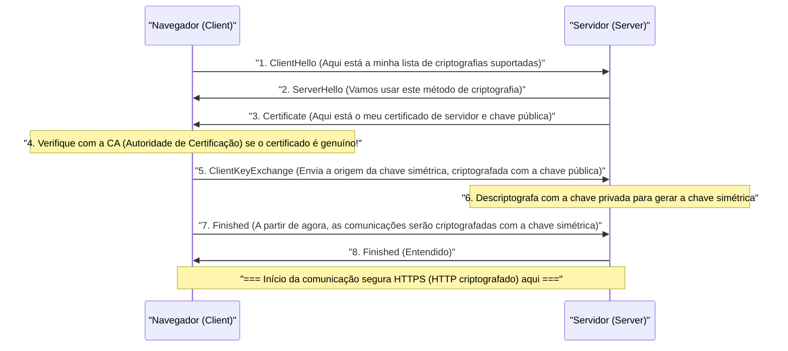

## 1. A Internet é como um "Cartão Postal"

O protocolo de comunicação da Web que usamos habitualmente, o "HTTP", embora muito conveniente, tem uma fraqueza fatal em termos de segurança. Isso significa que "**todo o conteúdo da comunicação é enviado e recebido em texto simples (apenas texto não criptografado)**".

Os dados HTTP que fluem através de cabos de rede e sinais Wi-Fi podem ser facilmente espiados por roteadores intermediários, provedores de internet, ou hackers maliciosos (packet sniffers).
Comparando, é como escrever o número do seu cartão de crédito ou senha em um "**cartão postal com o verso totalmente visível**" e colocá-lo na caixa de correio.

A tecnologia que resolve essa situação assustadora e envia o cartão postal dentro de um "cofre robusto e absolutamente impossível de abrir (envelope)" é o "**HTTPS (HTTP Secure)**", que adiciona o "S" de Segurança (Secure) ao HTTP.

## 2. SSL/TLS: O Escudo para se Proteger de 3 Ameaças

O HTTPS não reescreve o próprio protocolo HTTP. A estrutura funciona inserindo uma camada do protocolo de criptografia **SSL/TLS** "antes" da comunicação HTTP, criando um túnel seguro lá, e então fluindo o texto HTTP para dentro dele.

O SSL (Secure Sockets Layer) foi desenvolvido pela Netscape em 1994, depois padronizado e renomeado para TLS (Transport Layer Security), mas por convenção ainda é chamado de "SSL/TLS" até hoje.

O SSL/TLS nos protege de três grandes ameaças na Internet.
1. **Interceptação (Eavesdropping)**: Impede que o conteúdo da comunicação seja visto (criptografia)
2. **Adulteração (Tampering)**: Impede que os dados sejam reescritos no meio do caminho (autenticação de mensagem)
3. **Falsificação (Spoofing)**: Prova que a outra parte não é um site falso (certificado digital)

## 3. O Dilema da Criptografia: Chave Simétrica e Chave Pública

Para criptografar a comunicação, é necessária uma "chave". No entanto, aqui surge um grande dilema.

O método de criptografia mais rápido e eficiente é o "**sistema de criptografia de chave simétrica** (ex: AES)". Nele, o remetente e o destinatário têm "a mesma única chave" para realizar a criptografia e descriptografia (assim como a chave de casa).
No entanto, ao fazer compras na Amazon pela primeira vez na Internet, como você e a Amazon podem compartilhar com segurança essa "chave comum"? Se a própria chave for enviada pela rede, ela também será roubada por hackers (problema de distribuição de chaves).

O método que resolveu esse problema brilhantemente com o poder da matemática é o "**sistema de criptografia de chave pública** (ex: RSA, criptografia de curva elíptica)".

No sistema de criptografia de chave pública, você cria um par de chaves: um "cadeado (chave pública)" que pode ser distribuído para qualquer pessoa, e uma "chave para abrir (chave privada)" que só você possui.
A Amazon espalha a sua "chave pública" por todo o mundo. O seu navegador usa a chave pública da Amazon (cadeado) para colocar a "chave simétrica" de uso único em uma caixa, trancá-la firmemente e enviá-la para a Amazon.
Esta caixa só pode ser aberta pela "chave privada" que a Amazon possui no mundo inteiro. Mesmo que um hacker roube a caixa no meio do caminho, ela é inútil sem a chave para abri-la.

## 4. Os Bastidores da Comunicação HTTPS: Handshake SSL/TLS

No momento em que você acessa `https://...` no seu navegador, em apenas frações de segundo nos bastidores, uma negociação avançada chamada "**Handshake SSL/TLS**" é realizada entre o navegador e o servidor.

A criptografia de chave pública requer um processamento de cálculo muito pesado, portanto, se toda a comunicação for feita com chaves públicas, o servidor irá sobrecarregar.
Por essa razão, o HTTPS adota um método híbrido muito inteligente: "**usar a criptografia de chave pública apenas para a troca segura de chaves, e usar a criptografia de chave simétrica de alta velocidade para a comunicação real de grandes volumes de dados**".

## 5. Infraestrutura de Chave Pública (PKI) e Autoridade de Certificação (CA)

Aqui resta um último problema. A "Falsificação".
E se um hacker malicioso criar um site falso idêntico à Amazon e enviar sua própria chave pública para você? Seu navegador estabelecerá uma comunicação criptografada segura com o site falso e entregará sua senha criptografada "com segurança" para o hacker.

O que impede isso é o mecanismo de **PKI (Public Key Infrastructure: Infraestrutura de Chave Pública)** e **CA (Certificate Authority: Autoridade de Certificação)**.

No mundo, existem "instituições terceirizadas (autoridades de certificação)" confiáveis, como DigiCert, GlobalSign e Let's Encrypt. Empresas como a Amazon, após passarem por um exame rigoroso por essas autoridades de certificação, recebem um "certificado de servidor" emitido com uma assinatura digital afirmando que "esta chave pública é sem dúvida da verdadeira Amazon".

Em nossos computadores e smartphones (Sistemas Operacionais e navegadores), os "certificados raiz" dessas autoridades de certificação confiáveis já estão instalados com antecedência.
Quando o navegador recebe um certificado do servidor, ele o compara com o seu próprio certificado raiz e só exibe o "ícone de cadeado seguro" na barra de endereços quando consegue confirmar que "certamente é um certificado genuíno assinado por uma CA confiável".

## 6. Conclusão: Rumo à Era do SSL Contínuo (Always-On SSL)

No passado, o HTTPS era algo especial, usado apenas em um número muito pequeno de páginas, como telas de pagamento onde são inseridos os números dos cartões de crédito. Isso ocorria porque se acreditava que o processo de criptografia sobrecarregava o servidor.

No entanto, devido à melhoria do desempenho das CPUs e à evolução da tecnologia (como o surgimento do HTTP/2 e HTTP/3), e acima de tudo à crescente demanda social por proteção de privacidade, agora se tornou o padrão global "tornar todas as páginas da Web em HTTPS (SSL Contínuo)", liderado por empresas como o Google. Atualmente, mais de 90% do tráfego da Web na Internet é criptografado com HTTPS.

O HTTPS é criado pela colaboração de complexos algoritmos matemáticos invisíveis e uma rede de confiança global (PKI). Nos bastidores da tela do smartphone que tocamos casualmente, a robusta barreira criptográfica construída pelas melhores mentes do mundo continua a proteger nossos dados silenciosamente hoje também.
