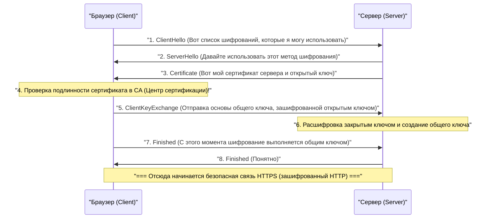

## 1. Интернет — это «открытка»

Протокол связи веб-страниц «HTTP», который мы обычно используем, очень удобен, но имеет фатальный недостаток с точки зрения безопасности. Это означает, что **все данные передаются в виде открытого текста (обычного текста без шифрования)**.

Данные HTTP, проходящие по сетевым кабелям или радиоволнам Wi-Fi, могут быть легко просмотрены промежуточными маршрутизаторами, провайдерами или злонамеренными хакерами (анализаторами пакетов).
Это можно сравнить с тем, как если бы вы написали номер своей кредитной карты и пароль на **открытке, задняя часть которой полностью видна**, и бросили её в почтовый ящик.

Технология, которая решает эту пугающую ситуацию и отправляет открытку в «крепком сейфе (конверте), который никогда нельзя открыть», — это **HTTPS (HTTP Secure)**, где к HTTP добавлена буква «S», означающая безопасность (Secure).

## 2. SSL/TLS: Щит, защищающий от трех угроз

HTTPS не переписывает сам протокол HTTP. «Перед» тем, как осуществляется связь по HTTP, вставляется уровень протокола шифрования **SSL/TLS**, где создается безопасный туннель, а затем в него направляется текст HTTP.

SSL (Secure Sockets Layer) был разработан компанией Netscape в 1994 году и позже был стандартизирован и переименован в TLS (Transport Layer Security), но по привычке его все еще называют «SSL/TLS».

SSL/TLS защищает нас от трех огромных угроз в интернете:
1. **Прослушивание (Eavesdropping)**: Предотвращение просмотра содержимого связи (шифрование)
2. **Подделка (Tampering)**: Предотвращение изменения данных в пути (аутентификация сообщений)
3. **Подмена (Spoofing)**: Доказательство того, что сторона связи не является поддельным сайтом (цифровой сертификат)

## 3. Дилемма шифрования: Общий и открытый ключи

Для шифрования связи необходим «ключ». Однако здесь возникает большая дилемма.

Самый быстрый и эффективный метод шифрования — это **шифрование с общим ключом** (например: AES). При этом отправитель и получатель имеют «один и тот же ключ» для шифрования и расшифровки (так же, как ключ от дома).
Однако, когда вы впервые делаете покупки на Amazon в интернете, как вы и Amazon можете безопасно поделиться этим «общим ключом»? Если вы отправите сам ключ по сети, он также будет украден хакерами (проблема распределения ключей).

Сила математики блестяще решила эту проблему с помощью **шифрования с открытым ключом** (например: RSA, криптография на эллиптических кривых).

В шифровании с открытым ключом создается пара из двух ключей: «навесного замка (открытый ключ)», который можно раздавать кому угодно, и «ключа для открытия (закрытый ключ)», который есть только у вас.
Amazon раздает свой «открытый ключ» по всему миру. Ваш браузер использует открытый ключ Amazon (навесной замок), чтобы запереть одноразовый «общий ключ» в ящике со щелчком и отправить его на Amazon.
Этот ящик может быть открыт только «закрытым ключом», который Amazon хранит в тайне от всего мира. Даже если хакер украдет ящик по пути, это бессмысленно, потому что у него нет ключа, чтобы его открыть.

## 4. За кулисами связи HTTPS: Рукопожатие SSL/TLS

В тот момент, когда вы обращаетесь к `https://...` в своем браузере, за кулисами за доли секунды происходит сложный процесс переговоров, называемый **рукопожатием SSL/TLS**, между браузером и сервером.

Поскольку шифрование с открытым ключом требует очень тяжелых вычислений, если все коммуникации будут использовать открытый ключ, сервер перегрузится и выйдет из строя.
Поэтому HTTPS использует очень умный гибридный метод: **использование шифрования с открытым ключом только для безопасной передачи ключей, а для фактической массовой передачи данных используется высокоскоростное шифрование с общим ключом**.

## 5. Инфраструктура открытых ключей (PKI) и Центр сертификации (CA)

Здесь остается последняя проблема. «Подмена».
Что, если злонамеренный хакер создаст поддельный сайт, который выглядит в точности как Amazon, и пришлет вам свой открытый ключ? Ваш браузер установит безопасное зашифрованное соединение с поддельным сайтом и зашифрует ваш пароль, чтобы «безопасно» доставить его хакеру.

Это предотвращается с помощью систем **PKI (Public Key Infrastructure: Инфраструктура открытых ключей)** и **CA (Certificate Authority: Центр сертификации)**.

В мире существуют «третьи стороны (центры сертификации)», которым доверяют во всем мире, такие как DigiCert, GlobalSign и Let's Encrypt. Компании, такие как Amazon, после прохождения строгой проверки этими центрами сертификации получают «сертификат сервера» с цифровой подписью, подтверждающей: «Этот открытый ключ определенно принадлежит настоящему Amazon».

«Корневые сертификаты» этих доверенных центров сертификации заранее установлены на наших компьютерах и смартфонах (в ОС и браузерах).
Когда браузер получает сертификат от сервера, он сверяет его со своим собственным корневым сертификатом и отображает «значок безопасного замка» в адресной строке только тогда, когда он может подтвердить, что «это действительно подлинный сертификат, подписанный доверенным CA».

## 6. Заключение: В эпоху постоянного SSL

В прошлом HTTPS был чем-то особенным, что использовалось только на очень немногих страницах, таких как экраны оплаты, где вы вводили номер своей кредитной карты. Считалось, что процесс шифрования создает нагрузку на сервер.

Однако благодаря повышению производительности процессоров и эволюции технологий (появление HTTP/2 и HTTP/3), а главное, из-за растущих социальных требований к защите конфиденциальности, сейчас под руководством таких компаний, как Google, стало мировым стандартом «сделать все веб-страницы использующими HTTPS (постоянный SSL)». В настоящее время более 90% веб-трафика в интернете зашифровано с помощью HTTPS.

HTTPS создается путем объединения сложных невидимых математических алгоритмов и глобальной сети доверия (PKI). За кулисами экранов смартфонов, по которым мы случайно тапаем, мощный барьер шифрования, созданный лучшими умами мира, сегодня продолжает тихо защищать наши данные.
