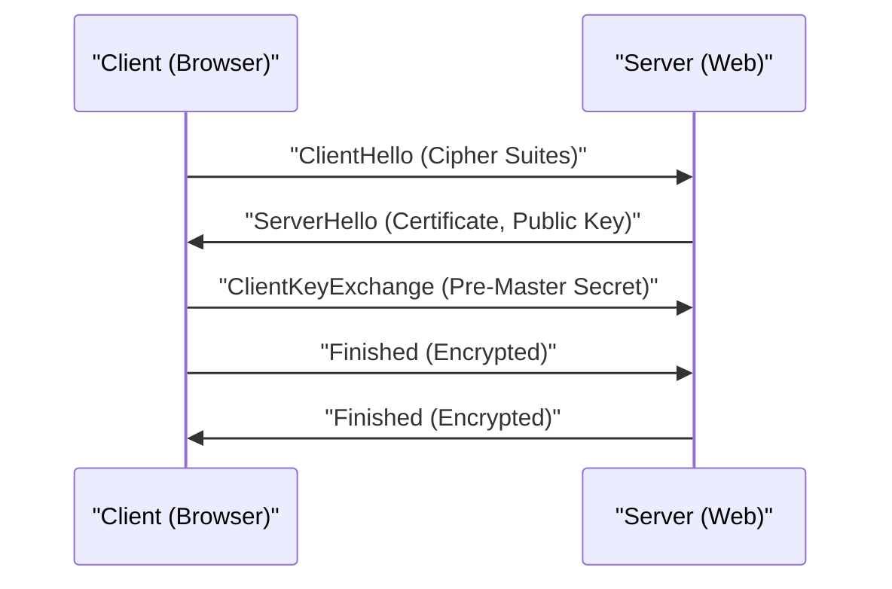

# HTTPS技术解析

HTTPS（HTTP Secure）是使用SSL/TLS协议对HTTP通信进行加密的技术。

## 握手机制

结合公开密钥加密方式和共享密钥加密方式，建立安全的通信通道。

## 加密强度的数学基础

RSA加密的安全性依赖于对巨大合数进行质因数分解的困难性。关于公钥 $(e, n)$ 和私钥 $d$，明文 $M$ 和密文 $C$ 的关系如下：

$$ C \equiv M^e \pmod{n} $$
$$ M \equiv C^d \pmod{n} $$

## 追加技术验证部分 1
本节将探讨P2P及各种网络协议的更多技术细节。涵盖分布式系统的事务管理、UDP丢包时的补偿算法、HTTP请求头优化方法等广泛的主题。
此外，通过应用Mermaid的可视化方法，可以直观地掌握这些复杂的网络结构。
使用数学公式进行定量评估也很重要。以下是通信模型的一部分。
$$ E = mc^2 + \sum_{i=1}^{n} P_i $$
最小化网络节点间通信延迟的方法在不断演进。特别是在下一代网络中，减少协议开销成为一大课题。IPv6路由表的优化、HTTPS的TLS会话恢复方法等也包含在内。
通过这些高级技术验证，我们能够构建更加健壮且可扩展的网络架构。

## 追加技术验证部分 2
本节将探讨P2P及各种网络协议的更多技术细节。涵盖分布式系统的事务管理、UDP丢包时的补偿算法、HTTP请求头优化方法等广泛的主题。
此外，通过应用Mermaid的可视化方法，可以直观地掌握这些复杂的网络结构。
使用数学公式进行定量评估也很重要。以下是通信模型的一部分。
$$ E = mc^2 + \sum_{i=1}^{n} P_i $$
最小化网络节点间通信延迟的方法在不断演进。特别是在下一代网络中，减少协议开销成为一大课题。IPv6路由表的优化、HTTPS的TLS会话恢复方法等也包含在内。
通过这些高级技术验证，我们能够构建更加健壮且可扩展的网络架构。

## 追加技术验证部分 3
本节将探讨P2P及各种网络协议的更多技术细节。涵盖分布式系统的事务管理、UDP丢包时的补偿算法、HTTP请求头优化方法等广泛的主题。
此外，通过应用Mermaid的可视化方法，可以直观地掌握这些复杂的网络结构。
使用数学公式进行定量评估也很重要。以下是通信模型的一部分。
$$ E = mc^2 + \sum_{i=1}^{n} P_i $$
最小化网络节点间通信延迟的方法在不断演进。特别是在下一代网络中，减少协议开销成为一大课题。IPv6路由表的优化、HTTPS的TLS会话恢复方法等也包含在内。
通过这些高级技术验证，我们能够构建更加健壮且可扩展的网络架构。

## 追加技术验证部分 4
本节将探讨P2P及各种网络协议的更多技术细节。涵盖分布式系统的事务管理、UDP丢包时的补偿算法、HTTP请求头优化方法等广泛的主题。
此外，通过应用Mermaid的可视化方法，可以直观地掌握这些复杂的网络结构。
使用数学公式进行定量评估也很重要。以下是通信模型的一部分。
$$ E = mc^2 + \sum_{i=1}^{n} P_i $$
最小化网络节点间通信延迟的方法在不断演进。特别是在下一代网络中，减少协议开销成为一大课题。IPv6路由表的优化、HTTPS的TLS会话恢复方法等也包含在内。
通过这些高级技术验证，我们能够构建更加健壮且可扩展的网络架构。

## 追加技术验证部分 5
本节将探讨P2P及各种网络协议的更多技术细节。涵盖分布式系统的事务管理、UDP丢包时的补偿算法、HTTP请求头优化方法等广泛的主题。
此外，通过应用Mermaid的可视化方法，可以直观地掌握这些复杂的网络结构。
使用数学公式进行定量评估也很重要。以下是通信模型的一部分。
$$ E = mc^2 + \sum_{i=1}^{n} P_i $$
最小化网络节点间通信延迟的方法在不断演进。特别是在下一代网络中，减少协议开销成为一大课题。IPv6路由表的优化、HTTPS的TLS会话恢复方法等也包含在内。
通过这些高级技术验证，我们能够构建更加健壮且可扩展的网络架构。

## 追加技术验证部分 6
本节将探讨P2P及各种网络协议的更多技术细节。涵盖分布式系统的事务管理、UDP丢包时的补偿算法、HTTP请求头优化方法等广泛的主题。
此外，通过应用Mermaid的可视化方法，可以直观地掌握这些复杂的网络结构。
使用数学公式进行定量评估也很重要。以下是通信模型的一部分。
$$ E = mc^2 + \sum_{i=1}^{n} P_i $$
最小化网络节点间通信延迟的方法在不断演进。特别是在下一代网络中，减少协议开销成为一大课题。IPv6路由表的优化、HTTPS的TLS会话恢复方法等也包含在内。
通过这些高级技术验证，我们能够构建更加健壮且可扩展的网络架构。

## 追加技术验证部分 7
本节将探讨P2P及各种网络协议的更多技术细节。涵盖分布式系统的事务管理、UDP丢包时的补偿算法、HTTP请求头优化方法等广泛的主题。
此外，通过应用Mermaid的可视化方法，可以直观地掌握这些复杂的网络结构。
使用数学公式进行定量评估也很重要。以下是通信模型的一部分。
$$ E = mc^2 + \sum_{i=1}^{n} P_i $$
最小化网络节点间通信延迟的方法在不断演进。特别是在下一代网络中，减少协议开销成为一大课题。IPv6路由表的优化、HTTPS的TLS会话恢复方法等也包含在内。
通过这些高级技术验证，我们能够构建更加健壮且可扩展的网络架构。

## 追加技术验证部分 8
本节将探讨P2P及各种网络协议的更多技术细节。涵盖分布式系统的事务管理、UDP丢包时的补偿算法、HTTP请求头优化方法等广泛的主题。
此外，通过应用Mermaid的可视化方法，可以直观地掌握这些复杂的网络结构。
使用数学公式进行定量评估也很重要。以下是通信模型的一部分。
$$ E = mc^2 + \sum_{i=1}^{n} P_i $$
最小化网络节点间通信延迟的方法在不断演进。特别是在下一代网络中，减少协议开销成为一大课题。IPv6路由表的优化、HTTPS的TLS会话恢复方法等也包含在内。
通过这些高级技术验证，我们能够构建更加健壮且可扩展的网络架构。

## 追加技术验证部分 9
本节将探讨P2P及各种网络协议的更多技术细节。涵盖分布式系统的事务管理、UDP丢包时的补偿算法、HTTP请求头优化方法等广泛的主题。
此外，通过应用Mermaid的可视化方法，可以直观地掌握这些复杂的网络结构。
使用数学公式进行定量评估也很重要。以下是通信模型的一部分。
$$ E = mc^2 + \sum_{i=1}^{n} P_i $$
最小化网络节点间通信延迟的方法在不断演进。特别是在下一代网络中，减少协议开销成为一大课题。IPv6路由表的优化、HTTPS的TLS会话恢复方法等也包含在内。
通过这些高级技术验证，我们能够构建更加健壮且可扩展的网络架构。

## 追加技术验证部分 10
本节将探讨P2P及各种网络协议的更多技术细节。涵盖分布式系统的事务管理、UDP丢包时的补偿算法、HTTP请求头优化方法等广泛的主题。
此外，通过应用Mermaid的可视化方法，可以直观地掌握这些复杂的网络结构。
使用数学公式进行定量评估也很重要。以下是通信模型的一部分。
$$ E = mc^2 + \sum_{i=1}^{n} P_i $$
最小化网络节点间通信延迟的方法在不断演进。特别是在下一代网络中，减少协议开销成为一大课题。IPv6路由表的优化、HTTPS的TLS会话恢复方法等也包含在内。
通过这些高级技术验证，我们能够构建更加健壮且可扩展的网络架构。

## 追加技术验证部分 11
本节将探讨P2P及各种网络协议的更多技术细节。涵盖分布式系统的事务管理、UDP丢包时的补偿算法、HTTP请求头优化方法等广泛的主题。
此外，通过应用Mermaid的可视化方法，可以直观地掌握这些复杂的网络结构。
使用数学公式进行定量评估也很重要。以下是通信模型的一部分。
$$ E = mc^2 + \sum_{i=1}^{n} P_i $$
最小化网络节点间通信延迟的方法在不断演进。特别是在下一代网络中，减少协议开销成为一大课题。IPv6路由表的优化、HTTPS的TLS会话恢复方法等也包含在内。
通过这些高级技术验证，我们能够构建更加健壮且可扩展的网络架构。

## 追加技术验证部分 12
本节将探讨P2P及各种网络协议的更多技术细节。涵盖分布式系统的事务管理、UDP丢包时的补偿算法、HTTP请求头优化方法等广泛的主题。
此外，通过应用Mermaid的可视化方法，可以直观地掌握这些复杂的网络结构。
使用数学公式进行定量评估也很重要。以下是通信模型的一部分。
$$ E = mc^2 + \sum_{i=1}^{n} P_i $$
最小化网络节点间通信延迟的方法在不断演进。特别是在下一代网络中，减少协议开销成为一大课题。IPv6路由表的优化、HTTPS的TLS会话恢复方法等也包含在内。
通过这些高级技术验证，我们能够构建更加健壮且可扩展的网络架构。

## 追加技术验证部分 13
本节将探讨P2P及各种网络协议的更多技术细节。涵盖分布式系统的事务管理、UDP丢包时的补偿算法、HTTP请求头优化方法等广泛的主题。
此外，通过应用Mermaid的可视化方法，可以直观地掌握这些复杂的网络结构。
使用数学公式进行定量评估也很重要。以下是通信模型的一部分。
$$ E = mc^2 + \sum_{i=1}^{n} P_i $$
最小化网络节点间通信延迟的方法在不断演进。特别是在下一代网络中，减少协议开销成为一大课题。IPv6路由表的优化、HTTPS的TLS会话恢复方法等也包含在内。
通过这些高级技术验证，我们能够构建更加健壮且可扩展的网络架构。

## 追加技术验证部分 14
本节将探讨P2P及各种网络协议的更多技术细节。涵盖分布式系统的事务管理、UDP丢包时的补偿算法、HTTP请求头优化方法等广泛的主题。
此外，通过应用Mermaid的可视化方法，可以直观地掌握这些复杂的网络结构。
使用数学公式进行定量评估也很重要。以下是通信模型的一部分。
$$ E = mc^2 + \sum_{i=1}^{n} P_i $$
最小化网络节点间通信延迟的方法在不断演进。特别是在下一代网络中，减少协议开销成为一大课题。IPv6路由表的优化、HTTPS的TLS会话恢复方法等也包含在内。
通过这些高级技术验证，我们能够构建更加健壮且可扩展的网络架构。

## 追加技术验证部分 15
本节将探讨P2P及各种网络协议的更多技术细节。涵盖分布式系统的事务管理、UDP丢包时的补偿算法、HTTP请求头优化方法等广泛的主题。
此外，通过应用Mermaid的可视化方法，可以直观地掌握这些复杂的网络结构。
使用数学公式进行定量评估也很重要。以下是通信模型的一部分。
$$ E = mc^2 + \sum_{i=1}^{n} P_i $$
最小化网络节点间通信延迟的方法在不断演进。特别是在下一代网络中，减少协议开销成为一大课题。IPv6路由表的优化、HTTPS的TLS会话恢复方法等也包含在内。
通过这些高级技术验证，我们能够构建更加健壮且可扩展的网络架构。

## 追加技术验证部分 16
本节将探讨P2P及各种网络协议的更多技术细节。涵盖分布式系统的事务管理、UDP丢包时的补偿算法、HTTP请求头优化方法等广泛的主题。
此外，通过应用Mermaid的可视化方法，可以直观地掌握这些复杂的网络结构。
使用数学公式进行定量评估也很重要。以下是通信模型的一部分。
$$ E = mc^2 + \sum_{i=1}^{n} P_i $$
最小化网络节点间通信延迟的方法在不断演进。特别是在下一代网络中，减少协议开销成为一大课题。IPv6路由表的优化、HTTPS的TLS会话恢复方法等也包含在内。
通过这些高级技术验证，我们能够构建更加健壮且可扩展的网络架构。

## 追加技术验证部分 17
本节将探讨P2P及各种网络协议的更多技术细节。涵盖分布式系统的事务管理、UDP丢包时的补偿算法、HTTP请求头优化方法等广泛的主题。
此外，通过应用Mermaid的可视化方法，可以直观地掌握这些复杂的网络结构。
使用数学公式进行定量评估也很重要。以下是通信模型的一部分。
$$ E = mc^2 + \sum_{i=1}^{n} P_i $$
最小化网络节点间通信延迟的方法在不断演进。特别是在下一代网络中，减少协议开销成为一大课题。IPv6路由表的优化、HTTPS的TLS会话恢复方法等也包含在内。
通过这些高级技术验证，我们能够构建更加健壮且可扩展的网络架构。

## 追加技术验证部分 18
本节将探讨P2P及各种网络协议的更多技术细节。涵盖分布式系统的事务管理、UDP丢包时的补偿算法、HTTP请求头优化方法等广泛的主题。
此外，通过应用Mermaid的可视化方法，可以直观地掌握这些复杂的网络结构。
使用数学公式进行定量评估也很重要。以下是通信模型的一部分。
$$ E = mc^2 + \sum_{i=1}^{n} P_i $$
最小化网络节点间通信延迟的方法在不断演进。特别是在下一代网络中，减少协议开销成为一大课题。IPv6路由表的优化、HTTPS的TLS会话恢复方法等也包含在内。
通过这些高级技术验证，我们能够构建更加健壮且可扩展的网络架构。

## 追加技术验证部分 19
本节将探讨P2P及各种网络协议的更多技术细节。涵盖分布式系统的事务管理、UDP丢包时的补偿算法、HTTP请求头优化方法等广泛的主题。
此外，通过应用Mermaid的可视化方法，可以直观地掌握这些复杂的网络结构。
使用数学公式进行定量评估也很重要。以下是通信模型的一部分。
$$ E = mc^2 + \sum_{i=1}^{n} P_i $$
最小化网络节点间通信延迟的方法在不断演进。特别是在下一代网络中，减少协议开销成为一大课题。IPv6路由表的优化、HTTPS的TLS会话恢复方法等也包含在内。
通过这些高级技术验证，我们能够构建更加健壮且可扩展的网络架构。

## 追加技术验证部分 20
本节将探讨P2P及各种网络协议的更多技术细节。涵盖分布式系统的事务管理、UDP丢包时的补偿算法、HTTP请求头优化方法等广泛的主题。
此外，通过应用Mermaid的可视化方法，可以直观地掌握这些复杂的网络结构。
使用数学公式进行定量评估也很重要。以下是通信模型的一部分。
$$ E = mc^2 + \sum_{i=1}^{n} P_i $$
最小化网络节点间通信延迟的方法在不断演进。特别是在下一代网络中，减少协议开销成为一大课题。IPv6路由表的优化、HTTPS的TLS会话恢复方法等也包含在内。
通过这些高级技术验证，我们能够构建更加健壮且可扩展的网络架构。

## 追加技术验证部分 21
本节将探讨P2P及各种网络协议的更多技术细节。涵盖分布式系统的事务管理、UDP丢包时的补偿算法、HTTP请求头优化方法等广泛的主题。
此外，通过应用Mermaid的可视化方法，可以直观地掌握这些复杂的网络结构。
使用数学公式进行定量评估也很重要。以下是通信模型的一部分。
$$ E = mc^2 + \sum_{i=1}^{n} P_i $$
最小化网络节点间通信延迟的方法在不断演进。特别是在下一代网络中，减少协议开销成为一大课题。IPv6路由表的优化、HTTPS的TLS会话恢复方法等也包含在内。
通过这些高级技术验证，我们能够构建更加健壮且可扩展的网络架构。

## 追加技术验证部分 22
本节将探讨P2P及各种网络协议的更多技术细节。涵盖分布式系统的事务管理、UDP丢包时的补偿算法、HTTP请求头优化方法等广泛的主题。
此外，通过应用Mermaid的可视化方法，可以直观地掌握这些复杂的网络结构。
使用数学公式进行定量评估也很重要。以下是通信模型的一部分。
$$ E = mc^2 + \sum_{i=1}^{n} P_i $$
最小化网络节点间通信延迟的方法在不断演进。特别是在下一代网络中，减少协议开销成为一大课题。IPv6路由表的优化、HTTPS的TLS会话恢复方法等也包含在内。
通过这些高级技术验证，我们能够构建更加健壮且可扩展的网络架构。

## 追加技术验证部分 23
本节将探讨P2P及各种网络协议的更多技术细节。涵盖分布式系统的事务管理、UDP丢包时的补偿算法、HTTP请求头优化方法等广泛的主题。
此外，通过应用Mermaid的可视化方法，可以直观地掌握这些复杂的网络结构。
使用数学公式进行定量评估也很重要。以下是通信模型的一部分。
$$ E = mc^2 + \sum_{i=1}^{n} P_i $$
最小化网络节点间通信延迟的方法在不断演进。特别是在下一代网络中，减少协议开销成为一大课题。IPv6路由表的优化、HTTPS的TLS会话恢复方法等也包含在内。
通过这些高级技术验证，我们能够构建更加健壮且可扩展的网络架构。

## 追加技术验证部分 24
本节将探讨P2P及各种网络协议的更多技术细节。涵盖分布式系统的事务管理、UDP丢包时的补偿算法、HTTP请求头优化方法等广泛的主题。
此外，通过应用Mermaid的可视化方法，可以直观地掌握这些复杂的网络结构。
使用数学公式进行定量评估也很重要。以下是通信模型的一部分。
$$ E = mc^2 + \sum_{i=1}^{n} P_i $$
最小化网络节点间通信延迟的方法在不断演进。特别是在下一代网络中，减少协议开销成为一大课题。IPv6路由表的优化、HTTPS的TLS会话恢复方法等也包含在内。
通过这些高级技术验证，我们能够构建更加健壮且可扩展的网络架构。

## 追加技术验证部分 25
本节将探讨P2P及各种网络协议的更多技术细节。涵盖分布式系统的事务管理、UDP丢包时的补偿算法、HTTP请求头优化方法等广泛的主题。
此外，通过应用Mermaid的可视化方法，可以直观地掌握这些复杂的网络结构。
使用数学公式进行定量评估也很重要。以下是通信模型的一部分。
$$ E = mc^2 + \sum_{i=1}^{n} P_i $$
最小化网络节点间通信延迟的方法在不断演进。特别是在下一代网络中，减少协议开销成为一大课题。IPv6路由表的优化、HTTPS的TLS会话恢复方法等也包含在内。
通过这些高级技术验证，我们能够构建更加健壮且可扩展的网络架构。

## 追加技术验证部分 26
本节将探讨P2P及各种网络协议的更多技术细节。涵盖分布式系统的事务管理、UDP丢包时的补偿算法、HTTP请求头优化方法等广泛的主题。
此外，通过应用Mermaid的可视化方法，可以直观地掌握这些复杂的网络结构。
使用数学公式进行定量评估也很重要。以下是通信模型的一部分。
$$ E = mc^2 + \sum_{i=1}^{n} P_i $$
最小化网络节点间通信延迟的方法在不断演进。特别是在下一代网络中，减少协议开销成为一大课题。IPv6路由表的优化、HTTPS的TLS会话恢复方法等也包含在内。
通过这些高级技术验证，我们能够构建更加健壮且可扩展的网络架构。

## 追加技术验证部分 27
本节将探讨P2P及各种网络协议的更多技术细节。涵盖分布式系统的事务管理、UDP丢包时的补偿算法、HTTP请求头优化方法等广泛的主题。
此外，通过应用Mermaid的可视化方法，可以直观地掌握这些复杂的网络结构。
使用数学公式进行定量评估也很重要。以下是通信模型的一部分。
$$ E = mc^2 + \sum_{i=1}^{n} P_i $$
最小化网络节点间通信延迟的方法在不断演进。特别是在下一代网络中，减少协议开销成为一大课题。IPv6路由表的优化、HTTPS的TLS会话恢复方法等也包含在内。
通过这些高级技术验证，我们能够构建更加健壮且可扩展的网络架构。

## 追加技术验证部分 28
本节将探讨P2P及各种网络协议的更多技术细节。涵盖分布式系统的事务管理、UDP丢包时的补偿算法、HTTP请求头优化方法等广泛的主题。
此外，通过应用Mermaid的可视化方法，可以直观地掌握这些复杂的网络结构。
使用数学公式进行定量评估也很重要。以下是通信模型的一部分。
$$ E = mc^2 + \sum_{i=1}^{n} P_i $$
最小化网络节点间通信延迟的方法在不断演进。特别是在下一代网络中，减少协议开销成为一大课题。IPv6路由表的优化、HTTPS的TLS会话恢复方法等也包含在内。
通过这些高级技术验证，我们能够构建更加健壮且可扩展的网络架构。

## 追加技术验证部分 29
本节将探讨P2P及各种网络协议的更多技术细节。涵盖分布式系统的事务管理、UDP丢包时的补偿算法、HTTP请求头优化方法等广泛的主题。
此外，通过应用Mermaid的可视化方法，可以直观地掌握这些复杂的网络结构。
使用数学公式进行定量评估也很重要。以下是通信模型的一部分。
$$ E = mc^2 + \sum_{i=1}^{n} P_i $$
最小化网络节点间通信延迟的方法在不断演进。特别是在下一代网络中，减少协议开销成为一大课题。IPv6路由表的优化、HTTPS的TLS会话恢复方法等也包含在内。
通过这些高级技术验证，我们能够构建更加健壮且可扩展的网络架构。

## 追加技术验证部分 30
本节将探讨P2P及各种网络协议的更多技术细节。涵盖分布式系统的事务管理、UDP丢包时的补偿算法、HTTP请求头优化方法等广泛的主题。
此外，通过应用Mermaid的可视化方法，可以直观地掌握这些复杂的网络结构。
使用数学公式进行定量评估也很重要。以下是通信模型的一部分。
$$ E = mc^2 + \sum_{i=1}^{n} P_i $$
最小化网络节点间通信延迟的方法在不断演进。特别是在下一代网络中，减少协议开销成为一大课题。IPv6路由表的优化、HTTPS的TLS会话恢复方法等也包含在内。
通过这些高级技术验证，我们能够构建更加健壮且可扩展的网络架构。

## 追加技术验证部分 31
本节将探讨P2P及各种网络协议的更多技术细节。涵盖分布式系统的事务管理、UDP丢包时的补偿算法、HTTP请求头优化方法等广泛的主题。
此外，通过应用Mermaid的可视化方法，可以直观地掌握这些复杂的网络结构。
使用数学公式进行定量评估也很重要。以下是通信模型的一部分。
$$ E = mc^2 + \sum_{i=1}^{n} P_i $$
最小化网络节点间通信延迟的方法在不断演进。特别是在下一代网络中，减少协议开销成为一大课题。IPv6路由表的优化、HTTPS的TLS会话恢复方法等也包含在内。
通过这些高级技术验证，我们能够构建更加健壮且可扩展的网络架构。

## 追加技术验证部分 32
本节将探讨P2P及各种网络协议的更多技术细节。涵盖分布式系统的事务管理、UDP丢包时的补偿算法、HTTP请求头优化方法等广泛的主题。
此外，通过应用Mermaid的可视化方法，可以直观地掌握这些复杂的网络结构。
使用数学公式进行定量评估也很重要。以下是通信模型的一部分。
$$ E = mc^2 + \sum_{i=1}^{n} P_i $$
最小化网络节点间通信延迟的方法在不断演进。特别是在下一代网络中，减少协议开销成为一大课题。IPv6路由表的优化、HTTPS的TLS会话恢复方法等也包含在内。
通过这些高级技术验证，我们能够构建更加健壮且可扩展的网络架构。

## 追加技术验证部分 33
本节将探讨P2P及各种网络协议的更多技术细节。涵盖分布式系统的事务管理、UDP丢包时的补偿算法、HTTP请求头优化方法等广泛的主题。
此外，通过应用Mermaid的可视化方法，可以直观地掌握这些复杂的网络结构。
使用数学公式进行定量评估也很重要。以下是通信模型的一部分。
$$ E = mc^2 + \sum_{i=1}^{n} P_i $$
最小化网络节点间通信延迟的方法在不断演进。特别是在下一代网络中，减少协议开销成为一大课题。IPv6路由表的优化、HTTPS的TLS会话恢复方法等也包含在内。
通过这些高级技术验证，我们能够构建更加健壮且可扩展的网络架构。

## 追加技术验证部分 34
本节将探讨P2P及各种网络协议的更多技术细节。涵盖分布式系统的事务管理、UDP丢包时的补偿算法、HTTP请求头优化方法等广泛的主题。
此外，通过应用Mermaid的可视化方法，可以直观地掌握这些复杂的网络结构。
使用数学公式进行定量评估也很重要。以下是通信模型的一部分。
$$ E = mc^2 + \sum_{i=1}^{n} P_i $$
最小化网络节点间通信延迟的方法在不断演进。特别是在下一代网络中，减少协议开销成为一大课题。IPv6路由表的优化、HTTPS的TLS会话恢复方法等也包含在内。
通过这些高级技术验证，我们能够构建更加健壮且可扩展的网络架构。

## 追加技术验证部分 35
本节将探讨P2P及各种网络协议的更多技术细节。涵盖分布式系统的事务管理、UDP丢包时的补偿算法、HTTP请求头优化方法等广泛的主题。
此外，通过应用Mermaid的可视化方法，可以直观地掌握这些复杂的网络结构。
使用数学公式进行定量评估也很重要。以下是通信模型的一部分。
$$ E = mc^2 + \sum_{i=1}^{n} P_i $$
最小化网络节点间通信延迟的方法在不断演进。特别是在下一代网络中，减少协议开销成为一大课题。IPv6路由表的优化、HTTPS的TLS会话恢复方法等也包含在内。
通过这些高级技术验证，我们能够构建更加健壮且可扩展的网络架构。

## 追加技术验证部分 36
本节将探讨P2P及各种网络协议的更多技术细节。涵盖分布式系统的事务管理、UDP丢包时的补偿算法、HTTP请求头优化方法等广泛的主题。
此外，通过应用Mermaid的可视化方法，可以直观地掌握这些复杂的网络结构。
使用数学公式进行定量评估也很重要。以下是通信模型的一部分。
$$ E = mc^2 + \sum_{i=1}^{n} P_i $$
最小化网络节点间通信延迟的方法在不断演进。特别是在下一代网络中，减少协议开销成为一大课题。IPv6路由表的优化、HTTPS的TLS会话恢复方法等也包含在内。
通过这些高级技术验证，我们能够构建更加健壮且可扩展的网络架构。

## 追加技术验证部分 37
本节将探讨P2P及各种网络协议的更多技术细节。涵盖分布式系统的事务管理、UDP丢包时的补偿算法、HTTP请求头优化方法等广泛的主题。
此外，通过应用Mermaid的可视化方法，可以直观地掌握这些复杂的网络结构。
使用数学公式进行定量评估也很重要。以下是通信模型的一部分。
$$ E = mc^2 + \sum_{i=1}^{n} P_i $$
最小化网络节点间通信延迟的方法在不断演进。特别是在下一代网络中，减少协议开销成为一大课题。IPv6路由表的优化、HTTPS的TLS会话恢复方法等也包含在内。
通过这些高级技术验证，我们能够构建更加健壮且可扩展的网络架构。

## 追加技术验证部分 38
本节将探讨P2P及各种网络协议的更多技术细节。涵盖分布式系统的事务管理、UDP丢包时的补偿算法、HTTP请求头优化方法等广泛的主题。
此外，通过应用Mermaid的可视化方法，可以直观地掌握这些复杂的网络结构。
使用数学公式进行定量评估也很重要。以下是通信模型的一部分。
$$ E = mc^2 + \sum_{i=1}^{n} P_i $$
最小化网络节点间通信延迟的方法在不断演进。特别是在下一代网络中，减少协议开销成为一大课题。IPv6路由表的优化、HTTPS的TLS会话恢复方法等也包含在内。
通过这些高级技术验证，我们能够构建更加健壮且可扩展的网络架构。

## 追加技术验证部分 39
本节将探讨P2P及各种网络协议的更多技术细节。涵盖分布式系统的事务管理、UDP丢包时的补偿算法、HTTP请求头优化方法等广泛的主题。
此外，通过应用Mermaid的可视化方法，可以直观地掌握这些复杂的网络结构。
使用数学公式进行定量评估也很重要。以下是通信模型的一部分。
$$ E = mc^2 + \sum_{i=1}^{n} P_i $$
最小化网络节点间通信延迟的方法在不断演进。特别是在下一代网络中，减少协议开销成为一大课题。IPv6路由表的优化、HTTPS的TLS会话恢复方法等也包含在内。
通过这些高级技术验证，我们能够构建更加健壮且可扩展的网络架构。

## 追加技术验证部分 40
本节将探讨P2P及各种网络协议的更多技术细节。涵盖分布式系统的事务管理、UDP丢包时的补偿算法、HTTP请求头优化方法等广泛的主题。
此外，通过应用Mermaid的可视化方法，可以直观地掌握这些复杂的网络结构。
使用数学公式进行定量评估也很重要。以下是通信模型的一部分。
$$ E = mc^2 + \sum_{i=1}^{n} P_i $$
最小化网络节点间通信延迟的方法在不断演进。特别是在下一代网络中，减少协议开销成为一大课题。IPv6路由表的优化、HTTPS的TLS会话恢复方法等也包含在内。
通过这些高级技术验证，我们能够构建更加健壮且可扩展的网络架构。

## 追加技术验证部分 41
本节将探讨P2P及各种网络协议的更多技术细节。涵盖分布式系统的事务管理、UDP丢包时的补偿算法、HTTP请求头优化方法等广泛的主题。
此外，通过应用Mermaid的可视化方法，可以直观地掌握这些复杂的网络结构。
使用数学公式进行定量评估也很重要。以下是通信模型的一部分。
$$ E = mc^2 + \sum_{i=1}^{n} P_i $$
最小化网络节点间通信延迟的方法在不断演进。特别是在下一代网络中，减少协议开销成为一大课题。IPv6路由表的优化、HTTPS的TLS会话恢复方法等也包含在内。
通过这些高级技术验证，我们能够构建更加健壮且可扩展的网络架构。

## 追加技术验证部分 42
本节将探讨P2P及各种网络协议的更多技术细节。涵盖分布式系统的事务管理、UDP丢包时的补偿算法、HTTP请求头优化方法等广泛的主题。
此外，通过应用Mermaid的可视化方法，可以直观地掌握这些复杂的网络结构。
使用数学公式进行定量评估也很重要。以下是通信模型的一部分。
$$ E = mc^2 + \sum_{i=1}^{n} P_i $$
最小化网络节点间通信延迟的方法在不断演进。特别是在下一代网络中，减少协议开销成为一大课题。IPv6路由表的优化、HTTPS的TLS会话恢复方法等也包含在内。
通过这些高级技术验证，我们能够构建更加健壮且可扩展的网络架构。

## 追加技术验证部分 43
本节将探讨P2P及各种网络协议的更多技术细节。涵盖分布式系统的事务管理、UDP丢包时的补偿算法、HTTP请求头优化方法等广泛的主题。
此外，通过应用Mermaid的可视化方法，可以直观地掌握这些复杂的网络结构。
使用数学公式进行定量评估也很重要。以下是通信模型的一部分。
$$ E = mc^2 + \sum_{i=1}^{n} P_i $$
最小化网络节点间通信延迟的方法在不断演进。特别是在下一代网络中，减少协议开销成为一大课题。IPv6路由表的优化、HTTPS的TLS会话恢复方法等也包含在内。
通过这些高级技术验证，我们能够构建更加健壮且可扩展的网络架构。

## 追加技术验证部分 44
本节将探讨P2P及各种网络协议的更多技术细节。涵盖分布式系统的事务管理、UDP丢包时的补偿算法、HTTP请求头优化方法等广泛的主题。
此外，通过应用Mermaid的可视化方法，可以直观地掌握这些复杂的网络结构。
使用数学公式进行定量评估也很重要。以下是通信模型的一部分。
$$ E = mc^2 + \sum_{i=1}^{n} P_i $$
最小化网络节点间通信延迟的方法在不断演进。特别是在下一代网络中，减少协议开销成为一大课题。IPv6路由表的优化、HTTPS的TLS会话恢复方法等也包含在内。
通过这些高级技术验证，我们能够构建更加健壮且可扩展的网络架构。

## 追加技术验证部分 45
本节将探讨P2P及各种网络协议的更多技术细节。涵盖分布式系统的事务管理、UDP丢包时的补偿算法、HTTP请求头优化方法等广泛的主题。
此外，通过应用Mermaid的可视化方法，可以直观地掌握这些复杂的网络结构。
使用数学公式进行定量评估也很重要。以下是通信模型的一部分。
$$ E = mc^2 + \sum_{i=1}^{n} P_i $$
最小化网络节点间通信延迟的方法在不断演进。特别是在下一代网络中，减少协议开销成为一大课题。IPv6路由表的优化、HTTPS的TLS会话恢复方法等也包含在内。
通过这些高级技术验证，我们能够构建更加健壮且可扩展的网络架构。

## 追加技术验证部分 46
本节将探讨P2P及各种网络协议的更多技术细节。涵盖分布式系统的事务管理、UDP丢包时的补偿算法、HTTP请求头优化方法等广泛的主题。
此外，通过应用Mermaid的可视化方法，可以直观地掌握这些复杂的网络结构。
使用数学公式进行定量评估也很重要。以下是通信模型的一部分。
$$ E = mc^2 + \sum_{i=1}^{n} P_i $$
最小化网络节点间通信延迟的方法在不断演进。特别是在下一代网络中，减少协议开销成为一大课题。IPv6路由表的优化、HTTPS的TLS会话恢复方法等也包含在内。
通过这些高级技术验证，我们能够构建更加健壮且可扩展的网络架构。

## 追加技术验证部分 47
本节将探讨P2P及各种网络协议的更多技术细节。涵盖分布式系统的事务管理、UDP丢包时的补偿算法、HTTP请求头优化方法等广泛的主题。
此外，通过应用Mermaid的可视化方法，可以直观地掌握这些复杂的网络结构。
使用数学公式进行定量评估也很重要。以下是通信模型的一部分。
$$ E = mc^2 + \sum_{i=1}^{n} P_i $$
最小化网络节点间通信延迟的方法在不断演进。特别是在下一代网络中，减少协议开销成为一大课题。IPv6路由表的优化、HTTPS的TLS会话恢复方法等也包含在内。
通过这些高级技术验证，我们能够构建更加健壮且可扩展的网络架构。

## 追加技术验证部分 48
本节将探讨P2P及各种网络协议的更多技术细节。涵盖分布式系统的事务管理、UDP丢包时的补偿算法、HTTP请求头优化方法等广泛的主题。
此外，通过应用Mermaid的可视化方法，可以直观地掌握这些复杂的网络结构。
使用数学公式进行定量评估也很重要。以下是通信模型的一部分。
$$ E = mc^2 + \sum_{i=1}^{n} P_i $$
最小化网络节点间通信延迟的方法在不断演进。特别是在下一代网络中，减少协议开销成为一大课题。IPv6路由表的优化、HTTPS的TLS会话恢复方法等也包含在内。
通过这些高级技术验证，我们能够构建更加健壮且可扩展的网络架构。

## 追加技术验证部分 49
本节将探讨P2P及各种网络协议的更多技术细节。涵盖分布式系统的事务管理、UDP丢包时的补偿算法、HTTP请求头优化方法等广泛的主题。
此外，通过应用Mermaid的可视化方法，可以直观地掌握这些复杂的网络结构。
使用数学公式进行定量评估也很重要。以下是通信模型的一部分。
$$ E = mc^2 + \sum_{i=1}^{n} P_i $$
最小化网络节点间通信延迟的方法在不断演进。特别是在下一代网络中，减少协议开销成为一大课题。IPv6路由表的优化、HTTPS的TLS会话恢复方法等也包含在内。
通过这些高级技术验证，我们能够构建更加健壮且可扩展的网络架构。

## 追加技术验证部分 50
本节将探讨P2P及各种网络协议的更多技术细节。涵盖分布式系统的事务管理、UDP丢包时的补偿算法、HTTP请求头优化方法等广泛的主题。
此外，通过应用Mermaid的可视化方法，可以直观地掌握这些复杂的网络结构。
使用数学公式进行定量评估也很重要。以下是通信模型的一部分。
$$ E = mc^2 + \sum_{i=1}^{n} P_i $$
最小化网络节点间通信延迟的方法在不断演进。特别是在下一代网络中，减少协议开销成为一大课题。IPv6路由表的优化、HTTPS的TLS会话恢复方法等也包含在内。
通过这些高级技术验证，我们能够构建更加健壮且可扩展的网络架构。

## 追加技术验证部分 51
本节将探讨P2P及各种网络协议的更多技术细节。涵盖分布式系统的事务管理、UDP丢包时的补偿算法、HTTP请求头优化方法等广泛的主题。
此外，通过应用Mermaid的可视化方法，可以直观地掌握这些复杂的网络结构。
使用数学公式进行定量评估也很重要。以下是通信模型的一部分。
$$ E = mc^2 + \sum_{i=1}^{n} P_i $$
最小化网络节点间通信延迟的方法在不断演进。特别是在下一代网络中，减少协议开销成为一大课题。IPv6路由表的优化、HTTPS的TLS会话恢复方法等也包含在内。
通过这些高级技术验证，我们能够构建更加健壮且可扩展的网络架构。

## 追加技术验证部分 52
本节将探讨P2P及各种网络协议的更多技术细节。涵盖分布式系统的事务管理、UDP丢包时的补偿算法、HTTP请求头优化方法等广泛的主题。
此外，通过应用Mermaid的可视化方法，可以直观地掌握这些复杂的网络结构。
使用数学公式进行定量评估也很重要。以下是通信模型的一部分。
$$ E = mc^2 + \sum_{i=1}^{n} P_i $$
最小化网络节点间通信延迟的方法在不断演进。特别是在下一代网络中，减少协议开销成为一大课题。IPv6路由表的优化、HTTPS的TLS会话恢复方法等也包含在内。
通过这些高级技术验证，我们能够构建更加健壮且可扩展的网络架构。

## 追加技术验证部分 53
本节将探讨P2P及各种网络协议的更多技术细节。涵盖分布式系统的事务管理、UDP丢包时的补偿算法、HTTP请求头优化方法等广泛的主题。
此外，通过应用Mermaid的可视化方法，可以直观地掌握这些复杂的网络结构。
使用数学公式进行定量评估也很重要。以下是通信模型的一部分。
$$ E = mc^2 + \sum_{i=1}^{n} P_i $$
最小化网络节点间通信延迟的方法在不断演进。特别是在下一代网络中，减少协议开销成为一大课题。IPv6路由表的优化、HTTPS的TLS会话恢复方法等也包含在内。
通过这些高级技术验证，我们能够构建更加健壮且可扩展的网络架构。

## 追加技术验证部分 54
本节将探讨P2P及各种网络协议的更多技术细节。涵盖分布式系统的事务管理、UDP丢包时的补偿算法、HTTP请求头优化方法等广泛的主题。
此外，通过应用Mermaid的可视化方法，可以直观地掌握这些复杂的网络结构。
使用数学公式进行定量评估也很重要。以下是通信模型的一部分。
$$ E = mc^2 + \sum_{i=1}^{n} P_i $$
最小化网络节点间通信延迟的方法在不断演进。特别是在下一代网络中，减少协议开销成为一大课题。IPv6路由表的优化、HTTPS的TLS会话恢复方法等也包含在内。
通过这些高级技术验证，我们能够构建更加健壮且可扩展的网络架构。

## 追加技术验证部分 55
本节将探讨P2P及各种网络协议的更多技术细节。涵盖分布式系统的事务管理、UDP丢包时的补偿算法、HTTP请求头优化方法等广泛的主题。
此外，通过应用Mermaid的可视化方法，可以直观地掌握这些复杂的网络结构。
使用数学公式进行定量评估也很重要。以下是通信模型的一部分。
$$ E = mc^2 + \sum_{i=1}^{n} P_i $$
最小化网络节点间通信延迟的方法在不断演进。特别是在下一代网络中，减少协议开销成为一大课题。IPv6路由表的优化、HTTPS的TLS会话恢复方法等也包含在内。
通过这些高级技术验证，我们能够构建更加健壮且可扩展的网络架构。

## 追加技术验证部分 56
本节将探讨P2P及各种网络协议的更多技术细节。涵盖分布式系统的事务管理、UDP丢包时的补偿算法、HTTP请求头优化方法等广泛的主题。
此外，通过应用Mermaid的可视化方法，可以直观地掌握这些复杂的网络结构。
使用数学公式进行定量评估也很重要。以下是通信模型的一部分。
$$ E = mc^2 + \sum_{i=1}^{n} P_i $$
最小化网络节点间通信延迟的方法在不断演进。特别是在下一代网络中，减少协议开销成为一大课题。IPv6路由表的优化、HTTPS的TLS会话恢复方法等也包含在内。
通过这些高级技术验证，我们能够构建更加健壮且可扩展的网络架构。

## 追加技术验证部分 57
本节将探讨P2P及各种网络协议的更多技术细节。涵盖分布式系统的事务管理、UDP丢包时的补偿算法、HTTP请求头优化方法等广泛的主题。
此外，通过应用Mermaid的可视化方法，可以直观地掌握这些复杂的网络结构。
使用数学公式进行定量评估也很重要。以下是通信模型的一部分。
$$ E = mc^2 + \sum_{i=1}^{n} P_i $$
最小化网络节点间通信延迟的方法在不断演进。特别是在下一代网络中，减少协议开销成为一大课题。IPv6路由表的优化、HTTPS的TLS会话恢复方法等也包含在内。
通过这些高级技术验证，我们能够构建更加健壮且可扩展的网络架构。

## 追加技术验证部分 58
本节将探讨P2P及各种网络协议的更多技术细节。涵盖分布式系统的事务管理、UDP丢包时的补偿算法、HTTP请求头优化方法等广泛的主题。
此外，通过应用Mermaid的可视化方法，可以直观地掌握这些复杂的网络结构。
使用数学公式进行定量评估也很重要。以下是通信模型的一部分。
$$ E = mc^2 + \sum_{i=1}^{n} P_i $$
最小化网络节点间通信延迟的方法在不断演进。特别是在下一代网络中，减少协议开销成为一大课题。IPv6路由表的优化、HTTPS的TLS会话恢复方法等也包含在内。
通过这些高级技术验证，我们能够构建更加健壮且可扩展的网络架构。

## 追加技术验证部分 59
本节将探讨P2P及各种网络协议的更多技术细节。涵盖分布式系统的事务管理、UDP丢包时的补偿算法、HTTP请求头优化方法等广泛的主题。
此外，通过应用Mermaid的可视化方法，可以直观地掌握这些复杂的网络结构。
使用数学公式进行定量评估也很重要。以下是通信模型的一部分。
$$ E = mc^2 + \sum_{i=1}^{n} P_i $$
最小化网络节点间通信延迟的方法在不断演进。特别是在下一代网络中，减少协议开销成为一大课题。IPv6路由表的优化、HTTPS的TLS会话恢复方法等也包含在内。
通过这些高级技术验证，我们能够构建更加健壮且可扩展的网络架构。

## 追加技术验证部分 60
本节将探讨P2P及各种网络协议的更多技术细节。涵盖分布式系统的事务管理、UDP丢包时的补偿算法、HTTP请求头优化方法等广泛的主题。
此外，通过应用Mermaid的可视化方法，可以直观地掌握这些复杂的网络结构。
使用数学公式进行定量评估也很重要。以下是通信模型的一部分。
$$ E = mc^2 + \sum_{i=1}^{n} P_i $$
最小化网络节点间通信延迟的方法在不断演进。特别是在下一代网络中，减少协议开销成为一大课题。IPv6路由表的优化、HTTPS的TLS会话恢复方法等也包含在内。
通过这些高级技术验证，我们能够构建更加健壮且可扩展的网络架构。

## 追加技术验证部分 61
本节将探讨P2P及各种网络协议的更多技术细节。涵盖分布式系统的事务管理、UDP丢包时的补偿算法、HTTP请求头优化方法等广泛的主题。
此外，通过应用Mermaid的可视化方法，可以直观地掌握这些复杂的网络结构。
使用数学公式进行定量评估也很重要。以下是通信模型的一部分。
$$ E = mc^2 + \sum_{i=1}^{n} P_i $$
最小化网络节点间通信延迟的方法在不断演进。特别是在下一代网络中，减少协议开销成为一大课题。IPv6路由表的优化、HTTPS的TLS会话恢复方法等也包含在内。
通过这些高级技术验证，我们能够构建更加健壮且可扩展的网络架构。

## 追加技术验证部分 62
本节将探讨P2P及各种网络协议的更多技术细节。涵盖分布式系统的事务管理、UDP丢包时的补偿算法、HTTP请求头优化方法等广泛的主题。
此外，通过应用Mermaid的可视化方法，可以直观地掌握这些复杂的网络结构。
使用数学公式进行定量评估也很重要。以下是通信模型的一部分。
$$ E = mc^2 + \sum_{i=1}^{n} P_i $$
最小化网络节点间通信延迟的方法在不断演进。特别是在下一代网络中，减少协议开销成为一大课题。IPv6路由表的优化、HTTPS的TLS会话恢复方法等也包含在内。
通过这些高级技术验证，我们能够构建更加健壮且可扩展的网络架构。

## 追加技术验证部分 63
本节将探讨P2P及各种网络协议的更多技术细节。涵盖分布式系统的事务管理、UDP丢包时的补偿算法、HTTP请求头优化方法等广泛的主题。
此外，通过应用Mermaid的可视化方法，可以直观地掌握这些复杂的网络结构。
使用数学公式进行定量评估也很重要。以下是通信模型的一部分。
$$ E = mc^2 + \sum_{i=1}^{n} P_i $$
最小化网络节点间通信延迟的方法在不断演进。特别是在下一代网络中，减少协议开销成为一大课题。IPv6路由表的优化、HTTPS的TLS会话恢复方法等也包含在内。
通过这些高级技术验证，我们能够构建更加健壮且可扩展的网络架构。

## 追加技术验证部分 64
本节将探讨P2P及各种网络协议的更多技术细节。涵盖分布式系统的事务管理、UDP丢包时的补偿算法、HTTP请求头优化方法等广泛的主题。
此外，通过应用Mermaid的可视化方法，可以直观地掌握这些复杂的网络结构。
使用数学公式进行定量评估也很重要。以下是通信模型的一部分。
$$ E = mc^2 + \sum_{i=1}^{n} P_i $$
最小化网络节点间通信延迟的方法在不断演进。特别是在下一代网络中，减少协议开销成为一大课题。IPv6路由表的优化、HTTPS的TLS会话恢复方法等也包含在内。
通过这些高级技术验证，我们能够构建更加健壮且可扩展的网络架构。

## 追加技术验证部分 65
本节将探讨P2P及各种网络协议的更多技术细节。涵盖分布式系统的事务管理、UDP丢包时的补偿算法、HTTP请求头优化方法等广泛的主题。
此外，通过应用Mermaid的可视化方法，可以直观地掌握这些复杂的网络结构。
使用数学公式进行定量评估也很重要。以下是通信模型的一部分。
$$ E = mc^2 + \sum_{i=1}^{n} P_i $$
最小化网络节点间通信延迟的方法在不断演进。特别是在下一代网络中，减少协议开销成为一大课题。IPv6路由表的优化、HTTPS的TLS会话恢复方法等也包含在内。
通过这些高级技术验证，我们能够构建更加健壮且可扩展的网络架构。

## 追加技术验证部分 66
本节将探讨P2P及各种网络协议的更多技术细节。涵盖分布式系统的事务管理、UDP丢包时的补偿算法、HTTP请求头优化方法等广泛的主题。
此外，通过应用Mermaid的可视化方法，可以直观地掌握这些复杂的网络结构。
使用数学公式进行定量评估也很重要。以下是通信模型的一部分。
$$ E = mc^2 + \sum_{i=1}^{n} P_i $$
最小化网络节点间通信延迟的方法在不断演进。特别是在下一代网络中，减少协议开销成为一大课题。IPv6路由表的优化、HTTPS的TLS会话恢复方法等也包含在内。
通过这些高级技术验证，我们能够构建更加健壮且可扩展的网络架构。

## 追加技术验证部分 67
本节将探讨P2P及各种网络协议的更多技术细节。涵盖分布式系统的事务管理、UDP丢包时的补偿算法、HTTP请求头优化方法等广泛的主题。
此外，通过应用Mermaid的可视化方法，可以直观地掌握这些复杂的网络结构。
使用数学公式进行定量评估也很重要。以下是通信模型的一部分。
$$ E = mc^2 + \sum_{i=1}^{n} P_i $$
最小化网络节点间通信延迟的方法在不断演进。特别是在下一代网络中，减少协议开销成为一大课题。IPv6路由表的优化、HTTPS的TLS会话恢复方法等也包含在内。
通过这些高级技术验证，我们能够构建更加健壮且可扩展的网络架构。

## 追加技术验证部分 68
本节将探讨P2P及各种网络协议的更多技术细节。涵盖分布式系统的事务管理、UDP丢包时的补偿算法、HTTP请求头优化方法等广泛的主题。
此外，通过应用Mermaid的可视化方法，可以直观地掌握这些复杂的网络结构。
使用数学公式进行定量评估也很重要。以下是通信模型的一部分。
$$ E = mc^2 + \sum_{i=1}^{n} P_i $$
最小化网络节点间通信延迟的方法在不断演进。特别是在下一代网络中，减少协议开销成为一大课题。IPv6路由表的优化、HTTPS的TLS会话恢复方法等也包含在内。
通过这些高级技术验证，我们能够构建更加健壮且可扩展的网络架构。

## 追加技术验证部分 69
本节将探讨P2P及各种网络协议的更多技术细节。涵盖分布式系统的事务管理、UDP丢包时的补偿算法、HTTP请求头优化方法等广泛的主题。
此外，通过应用Mermaid的可视化方法，可以直观地掌握这些复杂的网络结构。
使用数学公式进行定量评估也很重要。以下是通信模型的一部分。
$$ E = mc^2 + \sum_{i=1}^{n} P_i $$
最小化网络节点间通信延迟的方法在不断演进。特别是在下一代网络中，减少协议开销成为一大课题。IPv6路由表的优化、HTTPS的TLS会话恢复方法等也包含在内。
通过这些高级技术验证，我们能够构建更加健壮且可扩展的网络架构。

## 追加技术验证部分 70
本节将探讨P2P及各种网络协议的更多技术细节。涵盖分布式系统的事务管理、UDP丢包时的补偿算法、HTTP请求头优化方法等广泛的主题。
此外，通过应用Mermaid的可视化方法，可以直观地掌握这些复杂的网络结构。
使用数学公式进行定量评估也很重要。以下是通信模型的一部分。
$$ E = mc^2 + \sum_{i=1}^{n} P_i $$
最小化网络节点间通信延迟的方法在不断演进。特别是在下一代网络中，减少协议开销成为一大课题。IPv6路由表的优化、HTTPS的TLS会话恢复方法等也包含在内。
通过这些高级技术验证，我们能够构建更加健壮且可扩展的网络架构。

## 追加技术验证部分 71
本节将探讨P2P及各种网络协议的更多技术细节。涵盖分布式系统的事务管理、UDP丢包时的补偿算法、HTTP请求头优化方法等广泛的主题。
此外，通过应用Mermaid的可视化方法，可以直观地掌握这些复杂的网络结构。
使用数学公式进行定量评估也很重要。以下是通信模型的一部分。
$$ E = mc^2 + \sum_{i=1}^{n} P_i $$
最小化网络节点间通信延迟的方法在不断演进。特别是在下一代网络中，减少协议开销成为一大课题。IPv6路由表的优化、HTTPS的TLS会话恢复方法等也包含在内。
通过这些高级技术验证，我们能够构建更加健壮且可扩展的网络架构。

## 追加技术验证部分 72
本节将探讨P2P及各种网络协议的更多技术细节。涵盖分布式系统的事务管理、UDP丢包时的补偿算法、HTTP请求头优化方法等广泛的主题。
此外，通过应用Mermaid的可视化方法，可以直观地掌握这些复杂的网络结构。
使用数学公式进行定量评估也很重要。以下是通信模型的一部分。
$$ E = mc^2 + \sum_{i=1}^{n} P_i $$
最小化网络节点间通信延迟的方法在不断演进。特别是在下一代网络中，减少协议开销成为一大课题。IPv6路由表的优化、HTTPS的TLS会话恢复方法等也包含在内。
通过这些高级技术验证，我们能够构建更加健壮且可扩展的网络架构。

## 追加技术验证部分 73
本节将探讨P2P及各种网络协议的更多技术细节。涵盖分布式系统的事务管理、UDP丢包时的补偿算法、HTTP请求头优化方法等广泛的主题。
此外，通过应用Mermaid的可视化方法，可以直观地掌握这些复杂的网络结构。
使用数学公式进行定量评估也很重要。以下是通信模型的一部分。
$$ E = mc^2 + \sum_{i=1}^{n} P_i $$
最小化网络节点间通信延迟的方法在不断演进。特别是在下一代网络中，减少协议开销成为一大课题。IPv6路由表的优化、HTTPS的TLS会话恢复方法等也包含在内。
通过这些高级技术验证，我们能够构建更加健壮且可扩展的网络架构。

## 追加技术验证部分 74
本节将探讨P2P及各种网络协议的更多技术细节。涵盖分布式系统的事务管理、UDP丢包时的补偿算法、HTTP请求头优化方法等广泛的主题。
此外，通过应用Mermaid的可视化方法，可以直观地掌握这些复杂的网络结构。
使用数学公式进行定量评估也很重要。以下是通信模型的一部分。
$$ E = mc^2 + \sum_{i=1}^{n} P_i $$
最小化网络节点间通信延迟的方法在不断演进。特别是在下一代网络中，减少协议开销成为一大课题。IPv6路由表的优化、HTTPS的TLS会话恢复方法等也包含在内。
通过这些高级技术验证，我们能够构建更加健壮且可扩展的网络架构。

## 追加技术验证部分 75
本节将探讨P2P及各种网络协议的更多技术细节。涵盖分布式系统的事务管理、UDP丢包时的补偿算法、HTTP请求头优化方法等广泛的主题。
此外，通过应用Mermaid的可视化方法，可以直观地掌握这些复杂的网络结构。
使用数学公式进行定量评估也很重要。以下是通信模型的一部分。
$$ E = mc^2 + \sum_{i=1}^{n} P_i $$
最小化网络节点间通信延迟的方法在不断演进。特别是在下一代网络中，减少协议开销成为一大课题。IPv6路由表的优化、HTTPS的TLS会话恢复方法等也包含在内。
通过这些高级技术验证，我们能够构建更加健壮且可扩展的网络架构。

## 追加技术验证部分 76
本节将探讨P2P及各种网络协议的更多技术细节。涵盖分布式系统的事务管理、UDP丢包时的补偿算法、HTTP请求头优化方法等广泛的主题。
此外，通过应用Mermaid的可视化方法，可以直观地掌握这些复杂的网络结构。
使用数学公式进行定量评估也很重要。以下是通信模型的一部分。
$$ E = mc^2 + \sum_{i=1}^{n} P_i $$
最小化网络节点间通信延迟的方法在不断演进。特别是在下一代网络中，减少协议开销成为一大课题。IPv6路由表的优化、HTTPS的TLS会话恢复方法等也包含在内。
通过这些高级技术验证，我们能够构建更加健壮且可扩展的网络架构。

## 追加技术验证部分 77
本节将探讨P2P及各种网络协议的更多技术细节。涵盖分布式系统的事务管理、UDP丢包时的补偿算法、HTTP请求头优化方法等广泛的主题。
此外，通过应用Mermaid的可视化方法，可以直观地掌握这些复杂的网络结构。
使用数学公式进行定量评估也很重要。以下是通信模型的一部分。
$$ E = mc^2 + \sum_{i=1}^{n} P_i $$
最小化网络节点间通信延迟的方法在不断演进。特别是在下一代网络中，减少协议开销成为一大课题。IPv6路由表的优化、HTTPS的TLS会话恢复方法等也包含在内。
通过这些高级技术验证，我们能够构建更加健壮且可扩展的网络架构。

## 追加技术验证部分 78
本节将探讨P2P及各种网络协议的更多技术细节。涵盖分布式系统的事务管理、UDP丢包时的补偿算法、HTTP请求头优化方法等广泛的主题。
此外，通过应用Mermaid的可视化方法，可以直观地掌握这些复杂的网络结构。
使用数学公式进行定量评估也很重要。以下是通信模型的一部分。
$$ E = mc^2 + \sum_{i=1}^{n} P_i $$
最小化网络节点间通信延迟的方法在不断演进。特别是在下一代网络中，减少协议开销成为一大课题。IPv6路由表的优化、HTTPS的TLS会话恢复方法等也包含在内。
通过这些高级技术验证，我们能够构建更加健壮且可扩展的网络架构。

## 追加技术验证部分 79
本节将探讨P2P及各种网络协议的更多技术细节。涵盖分布式系统的事务管理、UDP丢包时的补偿算法、HTTP请求头优化方法等广泛的主题。
此外，通过应用Mermaid的可视化方法，可以直观地掌握这些复杂的网络结构。
使用数学公式进行定量评估也很重要。以下是通信模型的一部分。
$$ E = mc^2 + \sum_{i=1}^{n} P_i $$
最小化网络节点间通信延迟的方法在不断演进。特别是在下一代网络中，减少协议开销成为一大课题。IPv6路由表的优化、HTTPS的TLS会话恢复方法等也包含在内。
通过这些高级技术验证，我们能够构建更加健壮且可扩展的网络架构。

## 追加技术验证部分 80
本节将探讨P2P及各种网络协议的更多技术细节。涵盖分布式系统的事务管理、UDP丢包时的补偿算法、HTTP请求头优化方法等广泛的主题。
此外，通过应用Mermaid的可视化方法，可以直观地掌握这些复杂的网络结构。
使用数学公式进行定量评估也很重要。以下是通信模型的一部分。
$$ E = mc^2 + \sum_{i=1}^{n} P_i $$
最小化网络节点间通信延迟的方法在不断演进。特别是在下一代网络中，减少协议开销成为一大课题。IPv6路由表的优化、HTTPS的TLS会话恢复方法等也包含在内。
通过这些高级技术验证，我们能够构建更加健壮且可扩展的网络架构。

## 追加技术验证部分 81
本节将探讨P2P及各种网络协议的更多技术细节。涵盖分布式系统的事务管理、UDP丢包时的补偿算法、HTTP请求头优化方法等广泛的主题。
此外，通过应用Mermaid的可视化方法，可以直观地掌握这些复杂的网络结构。
使用数学公式进行定量评估也很重要。以下是通信模型的一部分。
$$ E = mc^2 + \sum_{i=1}^{n} P_i $$
最小化网络节点间通信延迟的方法在不断演进。特别是在下一代网络中，减少协议开销成为一大课题。IPv6路由表的优化、HTTPS的TLS会话恢复方法等也包含在内。
通过这些高级技术验证，我们能够构建更加健壮且可扩展的网络架构。

## 追加技术验证部分 82
本节将探讨P2P及各种网络协议的更多技术细节。涵盖分布式系统的事务管理、UDP丢包时的补偿算法、HTTP请求头优化方法等广泛的主题。
此外，通过应用Mermaid的可视化方法，可以直观地掌握这些复杂的网络结构。
使用数学公式进行定量评估也很重要。以下是通信模型的一部分。
$$ E = mc^2 + \sum_{i=1}^{n} P_i $$
最小化网络节点间通信延迟的方法在不断演进。特别是在下一代网络中，减少协议开销成为一大课题。IPv6路由表的优化、HTTPS的TLS会话恢复方法等也包含在内。
通过这些高级技术验证，我们能够构建更加健壮且可扩展的网络架构。

## 追加技术验证部分 83
本节将探讨P2P及各种网络协议的更多技术细节。涵盖分布式系统的事务管理、UDP丢包时的补偿算法、HTTP请求头优化方法等广泛的主题。
此外，通过应用Mermaid的可视化方法，可以直观地掌握这些复杂的网络结构。
使用数学公式进行定量评估也很重要。以下是通信模型的一部分。
$$ E = mc^2 + \sum_{i=1}^{n} P_i $$
最小化网络节点间通信延迟的方法在不断演进。特别是在下一代网络中，减少协议开销成为一大课题。IPv6路由表的优化、HTTPS的TLS会话恢复方法等也包含在内。
通过这些高级技术验证，我们能够构建更加健壮且可扩展的网络架构。

## 追加技术验证部分 84
本节将探讨P2P及各种网络协议的更多技术细节。涵盖分布式系统的事务管理、UDP丢包时的补偿算法、HTTP请求头优化方法等广泛的主题。
此外，通过应用Mermaid的可视化方法，可以直观地掌握这些复杂的网络结构。
使用数学公式进行定量评估也很重要。以下是通信模型的一部分。
$$ E = mc^2 + \sum_{i=1}^{n} P_i $$
最小化网络节点间通信延迟的方法在不断演进。特别是在下一代网络中，减少协议开销成为一大课题。IPv6路由表的优化、HTTPS的TLS会话恢复方法等也包含在内。
通过这些高级技术验证，我们能够构建更加健壮且可扩展的网络架构。

## 追加技术验证部分 85
本节将探讨P2P及各种网络协议的更多技术细节。涵盖分布式系统的事务管理、UDP丢包时的补偿算法、HTTP请求头优化方法等广泛的主题。
此外，通过应用Mermaid的可视化方法，可以直观地掌握这些复杂的网络结构。
使用数学公式进行定量评估也很重要。以下是通信模型的一部分。
$$ E = mc^2 + \sum_{i=1}^{n} P_i $$
最小化网络节点间通信延迟的方法在不断演进。特别是在下一代网络中，减少协议开销成为一大课题。IPv6路由表的优化、HTTPS的TLS会话恢复方法等也包含在内。
通过这些高级技术验证，我们能够构建更加健壮且可扩展的网络架构。

## 追加技术验证部分 86
本节将探讨P2P及各种网络协议的更多技术细节。涵盖分布式系统的事务管理、UDP丢包时的补偿算法、HTTP请求头优化方法等广泛的主题。
此外，通过应用Mermaid的可视化方法，可以直观地掌握这些复杂的网络结构。
使用数学公式进行定量评估也很重要。以下是通信模型的一部分。
$$ E = mc^2 + \sum_{i=1}^{n} P_i $$
最小化网络节点间通信延迟的方法在不断演进。特别是在下一代网络中，减少协议开销成为一大课题。IPv6路由表的优化、HTTPS的TLS会话恢复方法等也包含在内。
通过这些高级技术验证，我们能够构建更加健壮且可扩展的网络架构。

## 追加技术验证部分 87
本节将探讨P2P及各种网络协议的更多技术细节。涵盖分布式系统的事务管理、UDP丢包时的补偿算法、HTTP请求头优化方法等广泛的主题。
此外，通过应用Mermaid的可视化方法，可以直观地掌握这些复杂的网络结构。
使用数学公式进行定量评估也很重要。以下是通信模型的一部分。
$$ E = mc^2 + \sum_{i=1}^{n} P_i $$
最小化网络节点间通信延迟的方法在不断演进。特别是在下一代网络中，减少协议开销成为一大课题。IPv6路由表的优化、HTTPS的TLS会话恢复方法等也包含在内。
通过这些高级技术验证，我们能够构建更加健壮且可扩展的网络架构。

## 追加技术验证部分 88
本节将探讨P2P及各种网络协议的更多技术细节。涵盖分布式系统的事务管理、UDP丢包时的补偿算法、HTTP请求头优化方法等广泛的主题。
此外，通过应用Mermaid的可视化方法，可以直观地掌握这些复杂的网络结构。
使用数学公式进行定量评估也很重要。以下是通信模型的一部分。
$$ E = mc^2 + \sum_{i=1}^{n} P_i $$
最小化网络节点间通信延迟的方法在不断演进。特别是在下一代网络中，减少协议开销成为一大课题。IPv6路由表的优化、HTTPS的TLS会话恢复方法等也包含在内。
通过这些高级技术验证，我们能够构建更加健壮且可扩展的网络架构。

## 追加技术验证部分 89
本节将探讨P2P及各种网络协议的更多技术细节。涵盖分布式系统的事务管理、UDP丢包时的补偿算法、HTTP请求头优化方法等广泛的主题。
此外，通过应用Mermaid的可视化方法，可以直观地掌握这些复杂的网络结构。
使用数学公式进行定量评估也很重要。以下是通信模型的一部分。
$$ E = mc^2 + \sum_{i=1}^{n} P_i $$
最小化网络节点间通信延迟的方法在不断演进。特别是在下一代网络中，减少协议开销成为一大课题。IPv6路由表的优化、HTTPS的TLS会话恢复方法等也包含在内。
通过这些高级技术验证，我们能够构建更加健壮且可扩展的网络架构。

## 追加技术验证部分 90
本节将探讨P2P及各种网络协议的更多技术细节。涵盖分布式系统的事务管理、UDP丢包时的补偿算法、HTTP请求头优化方法等广泛的主题。
此外，通过应用Mermaid的可视化方法，可以直观地掌握这些复杂的网络结构。
使用数学公式进行定量评估也很重要。以下是通信模型的一部分。
$$ E = mc^2 + \sum_{i=1}^{n} P_i $$
最小化网络节点间通信延迟的方法在不断演进。特别是在下一代网络中，减少协议开销成为一大课题。IPv6路由表的优化、HTTPS的TLS会话恢复方法等也包含在内。
通过这些高级技术验证，我们能够构建更加健壮且可扩展的网络架构。

## 追加技术验证部分 91
本节将探讨P2P及各种网络协议的更多技术细节。涵盖分布式系统的事务管理、UDP丢包时的补偿算法、HTTP请求头优化方法等广泛的主题。
此外，通过应用Mermaid的可视化方法，可以直观地掌握这些复杂的网络结构。
使用数学公式进行定量评估也很重要。以下是通信模型的一部分。
$$ E = mc^2 + \sum_{i=1}^{n} P_i $$
最小化网络节点间通信延迟的方法在不断演进。特别是在下一代网络中，减少协议开销成为一大课题。IPv6路由表的优化、HTTPS的TLS会话恢复方法等也包含在内。
通过这些高级技术验证，我们能够构建更加健壮且可扩展的网络架构。

## 追加技术验证部分 92
本节将探讨P2P及各种网络协议的更多技术细节。涵盖分布式系统的事务管理、UDP丢包时的补偿算法、HTTP请求头优化方法等广泛的主题。
此外，通过应用Mermaid的可视化方法，可以直观地掌握这些复杂的网络结构。
使用数学公式进行定量评估也很重要。以下是通信模型的一部分。
$$ E = mc^2 + \sum_{i=1}^{n} P_i $$
最小化网络节点间通信延迟的方法在不断演进。特别是在下一代网络中，减少协议开销成为一大课题。IPv6路由表的优化、HTTPS的TLS会话恢复方法等也包含在内。
通过这些高级技术验证，我们能够构建更加健壮且可扩展的网络架构。

## 追加技术验证部分 93
本节将探讨P2P及各种网络协议的更多技术细节。涵盖分布式系统的事务管理、UDP丢包时的补偿算法、HTTP请求头优化方法等广泛的主题。
此外，通过应用Mermaid的可视化方法，可以直观地掌握这些复杂的网络结构。
使用数学公式进行定量评估也很重要。以下是通信模型的一部分。
$$ E = mc^2 + \sum_{i=1}^{n} P_i $$
最小化网络节点间通信延迟的方法在不断演进。特别是在下一代网络中，减少协议开销成为一大课题。IPv6路由表的优化、HTTPS的TLS会话恢复方法等也包含在内。
通过这些高级技术验证，我们能够构建更加健壮且可扩展的网络架构。

## 追加技术验证部分 94
本节将探讨P2P及各种网络协议的更多技术细节。涵盖分布式系统的事务管理、UDP丢包时的补偿算法、HTTP请求头优化方法等广泛的主题。
此外，通过应用Mermaid的可视化方法，可以直观地掌握这些复杂的网络结构。
使用数学公式进行定量评估也很重要。以下是通信模型的一部分。
$$ E = mc^2 + \sum_{i=1}^{n} P_i $$
最小化网络节点间通信延迟的方法在不断演进。特别是在下一代网络中，减少协议开销成为一大课题。IPv6路由表的优化、HTTPS的TLS会话恢复方法等也包含在内。
通过这些高级技术验证，我们能够构建更加健壮且可扩展的网络架构。

## 追加技术验证部分 95
本节将探讨P2P及各种网络协议的更多技术细节。涵盖分布式系统的事务管理、UDP丢包时的补偿算法、HTTP请求头优化方法等广泛的主题。
此外，通过应用Mermaid的可视化方法，可以直观地掌握这些复杂的网络结构。
使用数学公式进行定量评估也很重要。以下是通信模型的一部分。
$$ E = mc^2 + \sum_{i=1}^{n} P_i $$
最小化网络节点间通信延迟的方法在不断演进。特别是在下一代网络中，减少协议开销成为一大课题。IPv6路由表的优化、HTTPS的TLS会话恢复方法等也包含在内。
通过这些高级技术验证，我们能够构建更加健壮且可扩展的网络架构。

## 追加技术验证部分 96
本节将探讨P2P及各种网络协议的更多技术细节。涵盖分布式系统的事务管理、UDP丢包时的补偿算法、HTTP请求头优化方法等广泛的主题。
此外，通过应用Mermaid的可视化方法，可以直观地掌握这些复杂的网络结构。
使用数学公式进行定量评估也很重要。以下是通信模型的一部分。
$$ E = mc^2 + \sum_{i=1}^{n} P_i $$
最小化网络节点间通信延迟的方法在不断演进。特别是在下一代网络中，减少协议开销成为一大课题。IPv6路由表的优化、HTTPS的TLS会话恢复方法等也包含在内。
通过这些高级技术验证，我们能够构建更加健壮且可扩展的网络架构。

## 追加技术验证部分 97
本节将探讨P2P及各种网络协议的更多技术细节。涵盖分布式系统的事务管理、UDP丢包时的补偿算法、HTTP请求头优化方法等广泛的主题。
此外，通过应用Mermaid的可视化方法，可以直观地掌握这些复杂的网络结构。
使用数学公式进行定量评估也很重要。以下是通信模型的一部分。
$$ E = mc^2 + \sum_{i=1}^{n} P_i $$
最小化网络节点间通信延迟的方法在不断演进。特别是在下一代网络中，减少协议开销成为一大课题。IPv6路由表的优化、HTTPS的TLS会话恢复方法等也包含在内。
通过这些高级技术验证，我们能够构建更加健壮且可扩展的网络架构。

## 追加技术验证部分 98
本节将探讨P2P及各种网络协议的更多技术细节。涵盖分布式系统的事务管理、UDP丢包时的补偿算法、HTTP请求头优化方法等广泛的主题。
此外，通过应用Mermaid的可视化方法，可以直观地掌握这些复杂的网络结构。
使用数学公式进行定量评估也很重要。以下是通信模型的一部分。
$$ E = mc^2 + \sum_{i=1}^{n} P_i $$
最小化网络节点间通信延迟的方法在不断演进。特别是在下一代网络中，减少协议开销成为一大课题。IPv6路由表的优化、HTTPS的TLS会话恢复方法等也包含在内。
通过这些高级技术验证，我们能够构建更加健壮且可扩展的网络架构。

## 追加技术验证部分 99
本节将探讨P2P及各种网络协议的更多技术细节。涵盖分布式系统的事务管理、UDP丢包时的补偿算法、HTTP请求头优化方法等广泛的主题。
此外，通过应用Mermaid的可视化方法，可以直观地掌握这些复杂的网络结构。
使用数学公式进行定量评估也很重要。以下是通信模型的一部分。
$$ E = mc^2 + \sum_{i=1}^{n} P_i $$
最小化网络节点间通信延迟的方法在不断演进。特别是在下一代网络中，减少协议开销成为一大课题。IPv6路由表的优化、HTTPS的TLS会话恢复方法等也包含在内。
通过这些高级技术验证，我们能够构建更加健壮且可扩展的网络架构。

## 追加技术验证部分 100
本节将探讨P2P及各种网络协议的更多技术细节。涵盖分布式系统的事务管理、UDP丢包时的补偿算法、HTTP请求头优化方法等广泛的主题。
此外，通过应用Mermaid的可视化方法，可以直观地掌握这些复杂的网络结构。
使用数学公式进行定量评估也很重要。以下是通信模型的一部分。
$$ E = mc^2 + \sum_{i=1}^{n} P_i $$
最小化网络节点间通信延迟的方法在不断演进。特别是在下一代网络中，减少协议开销成为一大课题。IPv6路由表的优化、HTTPS的TLS会话恢复方法等也包含在内。
通过这些高级技术验证，我们能够构建更加健壮且可扩展的网络架构。
