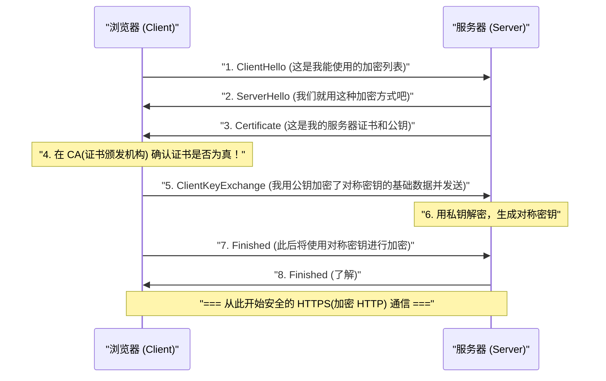

## 1. 互联网就像是「明信片」

我们平时使用的 Web 通信协议「HTTP」虽然非常方便，但在安全性方面却有着致命的弱点。那就是「 **通信内容全部以明文（未加密的普通文字）进行收发** 」。

在网络电缆或 Wi-Fi 电波中传输的 HTTP 数据，很容易被途中的路由器、互联网服务提供商 (ISP)，或者是恶意的黑客（数据包嗅探器）偷窥。
打个比方，这就像是把信用卡号或密码写在「 **背面完全公开的明信片** 」上，然后投进邮筒里一样。

为了解决这个可怕的情况，将明信片放进「绝对无法打开的坚固保险箱（信封）」中发送的技术，就是在 HTTP 上添加了代表安全 (Secure) 的「S」的「 **HTTPS (HTTP Secure)** 」。

## 2. SSL/TLS：抵御三大威胁的盾牌

HTTPS 并没有改写 HTTP 协议本身。而是在进行 HTTP 通信「之前」，插入了一层 **SSL/TLS** 加密协议，在那里建立安全的隧道后，再将 HTTP 文本流入其中。

SSL (Secure Sockets Layer) 是由 Netscape 公司于 1994 年开发的，随后被标准化并改名为 TLS (Transport Layer Security)，但现在仍习惯性地被称为「SSL/TLS」。

SSL/TLS 保护我们免受互联网上的三大巨大威胁。
1. **窃听 (Eavesdropping)** ：防止通信内容被偷看（加密）
2. **篡改 (Tampering)** ：防止数据在途中被修改（消息认证）
3. **伪装 (Spoofing)** ：证明通信对象不是伪造网站（数字证书）

## 3. 加密的困境：对称密钥与公钥

为了对通信进行加密，我们需要「密钥」。然而，这里出现了一个巨大的困境。

最快速且高效的加密方式是「 **对称密钥加密方式** （例如：AES）」。这意味着发送者和接收者持有「相同的 1 把密钥」来进行加密和解密（就像家里的钥匙一样）。
但是，当你在互联网上第一次在 Amazon 购物时，你和 Amazon 应该如何安全地共享那把「共同的密钥」呢？如果直接在网上发送密钥，它也会被黑客窃取（密钥分发问题）。

用数学的力量完美解决这个问题的是「 **公钥加密方式** （例如：RSA，椭圆曲线密码学）」。

在公钥加密方式中，会成对创建任何人都可以分发的「挂锁（公钥）」和只有自己才有的「开锁钥匙（私钥）」。
Amazon 会向全世界分发自己的「公钥」。你的浏览器会使用 Amazon 的公钥（挂锁），将仅限此次使用的「对称密钥」放入箱子中锁上，然后发送给 Amazon。
这个箱子，只有 Amazon 在全世界持有的「私钥」才能绝对打开。即使黑客在途中偷走了箱子，因为没有开锁的钥匙，也是毫无意义的。

## 4. HTTPS 通信的幕后：SSL/TLS 握手

当你使用浏览器访问 `https://...` 的瞬间，在幕后只需零点几秒的时间，浏览器和服务器之间就会进行被称为「 **SSL/TLS 握手** 」的高级协商。

由于公钥加密的计算处理非常繁重，如果所有的通信都使用公钥，服务器就会崩溃。
因此，HTTPS 采用了「 **仅在安全的密钥传递时使用公钥加密，而在实际的大量数据通信中使用高速的对称密钥加密** 」这种非常聪明的混合方式。

## 5. 公钥基础设施 (PKI) 与证书颁发机构 (CA)

这里还剩下最后一个问题。「伪装」。
如果恶意的黑客制作了一个和 Amazon 一模一样的伪造网站，并将自己的公钥发送给你，会发生什么？你的浏览器会与伪造网站安全地建立加密通信，将密码加密后「安全地」送到黑客手中。

防止这种情况发生的，就是 **PKI (Public Key Infrastructure：公钥基础设施)** 和 **CA (Certificate Authority：证书颁发机构)** 的机制。

世界上存在着 DigiCert、GlobalSign、Let's Encrypt 等受全世界信任的「第三方机构（证书颁发机构）」。像 Amazon 这样的企业，在接受这些机构严格审查后，会获发带有数字签名的「服务器证书」，证明「这个公钥毫无疑问是真正 Amazon 的」。

在我们的电脑和智能手机（OS 和浏览器）中，预先安装了这些受信任的证书颁发机构的「根证书」。
当浏览器从服务器收到证书时，会与自己持有的根证书进行比对，只有在确认「这确实是由受信任的 CA 签名的真实证书」时，才会在地址栏显示「安全的锁标志」。

## 6. 总结：迈向全站 HTTPS 化的时代

曾经，HTTPS 是一种只在输入信用卡号的支付界面等极少数页面中使用的特殊东西。因为人们认为加密处理会给服务器带来负担。

然而，随着 CPU 性能的提升和技术的进步（HTTP/2 和 HTTP/3 的出现），以及最重要的社会对隐私保护要求的提高，如今在 Google 等公司的引领下，「将所有网页 HTTPS 化（全站 HTTPS 化）」已成为世界标准。现在，互联网上超过 90% 的 Web 流量都经过 HTTPS 加密。

看不见的复杂数学算法，与世界级的信任网络 (PKI) 协同构建了 HTTPS。在我们不经意间点击的智能手机屏幕背后，由世界上最顶尖的大脑们构建的坚固密码防线，今天也在静静地保护着我们的数据。
