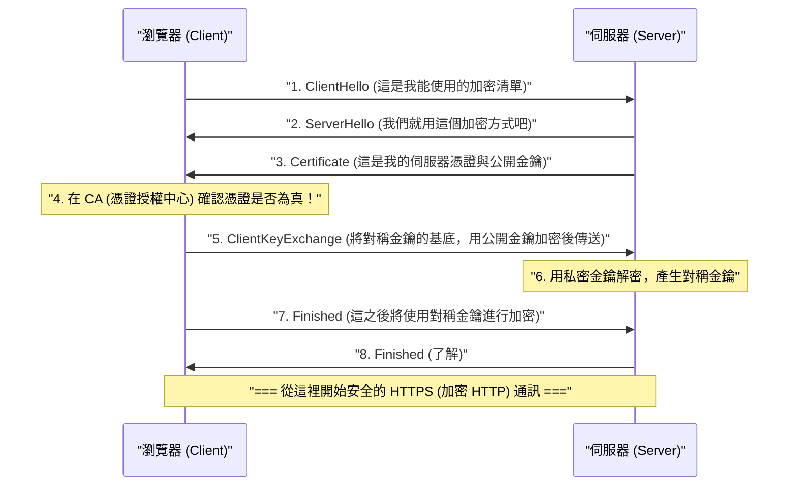

## 1. 網際網路就像是「明信片」

我們平時使用的網頁通訊協定「HTTP」雖然非常方便，但在安全性方面卻有一個致命的弱點。那就是「 **所有通訊內容都是以明文（未加密的普通文字）進行傳送與接收** 」。

流經網路纜線或 Wi-Fi 電波的 HTTP 資料，中途的路由器、ISP，或是惡意駭客（封包竊聽者）都能輕易偷窺其內容。
舉例來說，這就像是把信用卡卡號或密碼寫在「 **背面一覽無遺的明信片** 」上，然後投入郵筒一樣。

為了解決這個可怕的狀況，將明信片放入「絕對無法打開的堅固保險箱（信封）」中寄送的技術，就是為 HTTP 加上安全（Secure）的「S」的「 **HTTPS (HTTP Secure)** 」。

## 2. SSL/TLS：防禦 3 大威脅的盾牌

HTTPS 並不是改寫了 HTTP 這個協定本身。它的架構是在進行 HTTP 通訊「之前」，先插入 **SSL/TLS** 這個加密協定層，在那裡建立安全的隧道後，再將 HTTP 文字流入其中。

SSL（Secure Sockets Layer）於 1994 年由 Netscape 公司開發，後來經過標準化並更名為 TLS（Transport Layer Security），但至今仍習慣性地被稱為「SSL/TLS」。

SSL/TLS 保護我們免受網際網路上的 3 大威脅：
1. **竊聽（Eavesdropping）** ：防止通訊內容被偷看（加密）
2. **篡改（Tampering）** ：防止資料在中途被修改（訊息鑑別）
3. **偽裝（Spoofing）** ：證明通訊對象不是偽造網站（數位憑證）

## 3. 加密的兩難：對稱金鑰與公開金鑰

為了加密通訊，我們需要「金鑰」。然而，這裡出現了一個巨大的兩難。

最快速且高效的加密方式是「 **對稱金鑰加密** （例如：AES）」。在這種方式中，發送者與接收者持有「相同的 1 把金鑰」來進行加密與解密（就像家裡的鑰匙一樣）。
但是，當你第一次在網路上於 Amazon 購物時，你和 Amazon 該如何安全地共享那把「共同的金鑰」呢？如果直接在網路上傳送金鑰本身，它也會被駭客偷走（金鑰配送問題）。

利用數學力量完美解決這個問題的，就是「 **公開金鑰加密** （例如：RSA、橢圓曲線密碼學）」。

在公開金鑰加密中，會產生一對金鑰：任何人都可以拿到的「掛鎖（公開金鑰）」，以及只有自己擁有的「開鎖鑰匙（私密金鑰）」。
Amazon 會向全世界散佈自己的「公開金鑰」。你的瀏覽器會使用 Amazon 的公開金鑰（掛鎖），將只限這次使用的「對稱金鑰」放入箱子中喀嚓一聲鎖上，然後送給 Amazon。
這個箱子絕對只有在全世界僅 Amazon 擁有的「私密金鑰」才能打開。即使駭客中途偷走箱子，因為沒有開鎖的鑰匙，所以毫無意義。

## 4. HTTPS 通訊的背後：SSL/TLS 交握

當你在瀏覽器中存取 `https://...` 的瞬間，在背後短短零點幾秒內，瀏覽器與伺服器之間正在進行被稱為「 **SSL/TLS 交握** 」的高階協商。

公開金鑰加密的計算處理非常繁重，如果所有的通訊都使用公開金鑰，伺服器將會超載。
因此，HTTPS 採用了一種非常聰明的混合方式：「 **只在安全傳遞金鑰時使用公開金鑰加密，而在實際的大量資料通訊時則使用高速的對稱金鑰加密** 」。

## 5. 公開金鑰基礎建設 (PKI) 與憑證授權中心 (CA)

這裡還剩下最後一個問題。那就是「偽裝」。
如果惡意駭客製作了一個與 Amazon 一模一樣的偽造網站，並將自己的公開金鑰傳送給你，會發生什麼事呢？你的瀏覽器會與偽造網站建立安全的加密通訊，並將密碼加密後「安全地」送達駭客手中。

防止這種情況發生的，就是 **PKI（Public Key Infrastructure：公開金鑰基礎建設）** 與 **CA（Certificate Authority：憑證授權中心）** 的機制。

世上存在著如 DigiCert、GlobalSign、Let's Encrypt 等，受到全世界信任的「第三方機構（憑證授權中心）」。Amazon 等企業會在接受這些憑證授權中心的嚴格審查後，獲發帶有數位簽章的「伺服器憑證」，以證明「這個公開金鑰毫無疑問是真正屬於 Amazon 的」。

在我們的電腦或智慧型手機（作業系統或瀏覽器）中，已經預先安裝了這些值得信任的憑證授權中心的「根憑證」。
當瀏覽器從伺服器接收到憑證時，會與自己擁有的根憑證進行比對，只有在確認「這確實是由值得信任的 CA 所簽署的真正憑證」時，才會在網址列顯示「安全的鎖頭標誌」。

## 6. 總結：邁向全程 SSL 化的時代

過去，HTTPS 是一種只在輸入信用卡卡號的結帳畫面等極少數頁面中使用的特殊技術。因為當時認為加密處理會對伺服器造成負擔。

然而，隨著 CPU 效能的提升與技術的進化（HTTP/2 與 HTTP/3 的出現），加上社會對隱私保護的要求日益高漲，現在由 Google 等公司主導，「將所有網頁 HTTPS 化（常時 SSL 化）」已成為世界標準。目前，網際網路上超過 90% 的網頁流量都是透過 HTTPS 進行加密的。

看不見的複雜數學演算法，與世界級的信任網路（PKI）互相協作，打造出了 HTTPS。在我們不經意點擊的智慧型手機螢幕背後，世界上最頂尖的頭腦所打造的堅固加密防護壁，今天也正靜靜地保護著我們的資料。
