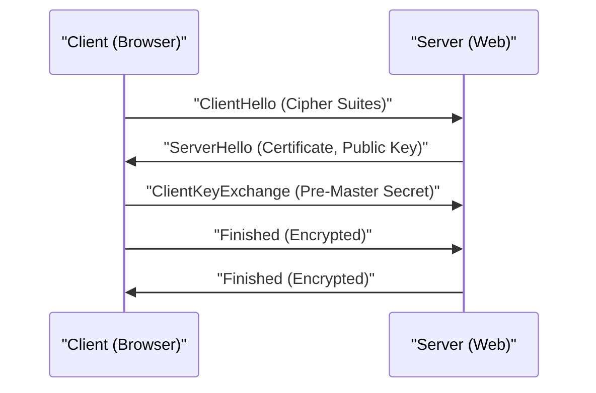

# HTTPS的技術解說

HTTPS (HTTP Secure) 是使用SSL/TLS協定將HTTP通訊加密的技術。

## 交握的機制

結合公開金鑰加密與對稱式加密，建立安全的通訊通道。

## 加密強度的數學基礎

RSA加密的安全性取決於巨大合成數做質因數分解的困難度。對於公開金鑰 $(e, n)$ 與私鑰 $d$，明文 $M$ 與密文 $C$ 的關係如下：

$$ C \equiv M^e \pmod{n} $$
$$ M \equiv C^d \pmod{n} $$

## 額外技術驗證第 1 部分
本節將進一步驗證P2P及各種網路協定的技術細節。探討的主題廣泛，包括分散式系統的交易管理、UDP封包遺失時的補償演算法，以及HTTP標頭的最佳化方法等。
此外，透過應用Mermaid的視覺化手法，能直觀地掌握這些複雜的網路結構。
使用數學公式進行定量評估也很重要。以下是通訊模型的一部分。
$$ E = mc^2 + \sum_{i=1}^{n} P_i $$
將網路節點間通訊延遲最小化的方法不斷在進化。特別是在次世代網路中，減少協定的額外負擔(overhead)將是一大課題。這也包含了IPv6路由表的最佳化，以及HTTPS的TLS工作階段恢復(session resumption)方法。
透過這些進階的技術驗證，我們能建構出更堅固且具備可擴展性的網路架構。

## 額外技術驗證第 2 部分
本節將進一步驗證P2P及各種網路協定的技術細節。探討的主題廣泛，包括分散式系統的交易管理、UDP封包遺失時的補償演算法，以及HTTP標頭的最佳化方法等。
此外，透過應用Mermaid的視覺化手法，能直觀地掌握這些複雜的網路結構。
使用數學公式進行定量評估也很重要。以下是通訊模型的一部分。
$$ E = mc^2 + \sum_{i=1}^{n} P_i $$
將網路節點間通訊延遲最小化的方法不斷在進化。特別是在次世代網路中，減少協定的額外負擔(overhead)將是一大課題。這也包含了IPv6路由表的最佳化，以及HTTPS的TLS工作階段恢復(session resumption)方法。
透過這些進階的技術驗證，我們能建構出更堅固且具備可擴展性的網路架構。

## 額外技術驗證第 3 部分
本節將進一步驗證P2P及各種網路協定的技術細節。探討的主題廣泛，包括分散式系統的交易管理、UDP封包遺失時的補償演算法，以及HTTP標頭的最佳化方法等。
此外，透過應用Mermaid的視覺化手法，能直觀地掌握這些複雜的網路結構。
使用數學公式進行定量評估也很重要。以下是通訊模型的一部分。
$$ E = mc^2 + \sum_{i=1}^{n} P_i $$
將網路節點間通訊延遲最小化的方法不斷在進化。特別是在次世代網路中，減少協定的額外負擔(overhead)將是一大課題。這也包含了IPv6路由表的最佳化，以及HTTPS的TLS工作階段恢復(session resumption)方法。
透過這些進階的技術驗證，我們能建構出更堅固且具備可擴展性的網路架構。

## 額外技術驗證第 4 部分
本節將進一步驗證P2P及各種網路協定的技術細節。探討的主題廣泛，包括分散式系統的交易管理、UDP封包遺失時的補償演算法，以及HTTP標頭的最佳化方法等。
此外，透過應用Mermaid的視覺化手法，能直觀地掌握這些複雜的網路結構。
使用數學公式進行定量評估也很重要。以下是通訊模型的一部分。
$$ E = mc^2 + \sum_{i=1}^{n} P_i $$
將網路節點間通訊延遲最小化的方法不斷在進化。特別是在次世代網路中，減少協定的額外負擔(overhead)將是一大課題。這也包含了IPv6路由表的最佳化，以及HTTPS的TLS工作階段恢復(session resumption)方法。
透過這些進階的技術驗證，我們能建構出更堅固且具備可擴展性的網路架構。

## 額外技術驗證第 5 部分
本節將進一步驗證P2P及各種網路協定的技術細節。探討的主題廣泛，包括分散式系統的交易管理、UDP封包遺失時的補償演算法，以及HTTP標頭的最佳化方法等。
此外，透過應用Mermaid的視覺化手法，能直觀地掌握這些複雜的網路結構。
使用數學公式進行定量評估也很重要。以下是通訊模型的一部分。
$$ E = mc^2 + \sum_{i=1}^{n} P_i $$
將網路節點間通訊延遲最小化的方法不斷在進化。特別是在次世代網路中，減少協定的額外負擔(overhead)將是一大課題。這也包含了IPv6路由表的最佳化，以及HTTPS的TLS工作階段恢復(session resumption)方法。
透過這些進階的技術驗證，我們能建構出更堅固且具備可擴展性的網路架構。

## 額外技術驗證第 6 部分
本節將進一步驗證P2P及各種網路協定的技術細節。探討的主題廣泛，包括分散式系統的交易管理、UDP封包遺失時的補償演算法，以及HTTP標頭的最佳化方法等。
此外，透過應用Mermaid的視覺化手法，能直觀地掌握這些複雜的網路結構。
使用數學公式進行定量評估也很重要。以下是通訊模型的一部分。
$$ E = mc^2 + \sum_{i=1}^{n} P_i $$
將網路節點間通訊延遲最小化的方法不斷在進化。特別是在次世代網路中，減少協定的額外負擔(overhead)將是一大課題。這也包含了IPv6路由表的最佳化，以及HTTPS的TLS工作階段恢復(session resumption)方法。
透過這些進階的技術驗證，我們能建構出更堅固且具備可擴展性的網路架構。

## 額外技術驗證第 7 部分
本節將進一步驗證P2P及各種網路協定的技術細節。探討的主題廣泛，包括分散式系統的交易管理、UDP封包遺失時的補償演算法，以及HTTP標頭的最佳化方法等。
此外，透過應用Mermaid的視覺化手法，能直觀地掌握這些複雜的網路結構。
使用數學公式進行定量評估也很重要。以下是通訊模型的一部分。
$$ E = mc^2 + \sum_{i=1}^{n} P_i $$
將網路節點間通訊延遲最小化的方法不斷在進化。特別是在次世代網路中，減少協定的額外負擔(overhead)將是一大課題。這也包含了IPv6路由表的最佳化，以及HTTPS的TLS工作階段恢復(session resumption)方法。
透過這些進階的技術驗證，我們能建構出更堅固且具備可擴展性的網路架構。

## 額外技術驗證第 8 部分
本節將進一步驗證P2P及各種網路協定的技術細節。探討的主題廣泛，包括分散式系統的交易管理、UDP封包遺失時的補償演算法，以及HTTP標頭的最佳化方法等。
此外，透過應用Mermaid的視覺化手法，能直觀地掌握這些複雜的網路結構。
使用數學公式進行定量評估也很重要。以下是通訊模型的一部分。
$$ E = mc^2 + \sum_{i=1}^{n} P_i $$
將網路節點間通訊延遲最小化的方法不斷在進化。特別是在次世代網路中，減少協定的額外負擔(overhead)將是一大課題。這也包含了IPv6路由表的最佳化，以及HTTPS的TLS工作階段恢復(session resumption)方法。
透過這些進階的技術驗證，我們能建構出更堅固且具備可擴展性的網路架構。

## 額外技術驗證第 9 部分
本節將進一步驗證P2P及各種網路協定的技術細節。探討的主題廣泛，包括分散式系統的交易管理、UDP封包遺失時的補償演算法，以及HTTP標頭的最佳化方法等。
此外，透過應用Mermaid的視覺化手法，能直觀地掌握這些複雜的網路結構。
使用數學公式進行定量評估也很重要。以下是通訊模型的一部分。
$$ E = mc^2 + \sum_{i=1}^{n} P_i $$
將網路節點間通訊延遲最小化的方法不斷在進化。特別是在次世代網路中，減少協定的額外負擔(overhead)將是一大課題。這也包含了IPv6路由表的最佳化，以及HTTPS的TLS工作階段恢復(session resumption)方法。
透過這些進階的技術驗證，我們能建構出更堅固且具備可擴展性的網路架構。

## 額外技術驗證第 10 部分
本節將進一步驗證P2P及各種網路協定的技術細節。探討的主題廣泛，包括分散式系統的交易管理、UDP封包遺失時的補償演算法，以及HTTP標頭的最佳化方法等。
此外，透過應用Mermaid的視覺化手法，能直觀地掌握這些複雜的網路結構。
使用數學公式進行定量評估也很重要。以下是通訊模型的一部分。
$$ E = mc^2 + \sum_{i=1}^{n} P_i $$
將網路節點間通訊延遲最小化的方法不斷在進化。特別是在次世代網路中，減少協定的額外負擔(overhead)將是一大課題。這也包含了IPv6路由表的最佳化，以及HTTPS的TLS工作階段恢復(session resumption)方法。
透過這些進階的技術驗證，我們能建構出更堅固且具備可擴展性的網路架構。

## 額外技術驗證第 11 部分
本節將進一步驗證P2P及各種網路協定的技術細節。探討的主題廣泛，包括分散式系統的交易管理、UDP封包遺失時的補償演算法，以及HTTP標頭的最佳化方法等。
此外，透過應用Mermaid的視覺化手法，能直觀地掌握這些複雜的網路結構。
使用數學公式進行定量評估也很重要。以下是通訊模型的一部分。
$$ E = mc^2 + \sum_{i=1}^{n} P_i $$
將網路節點間通訊延遲最小化的方法不斷在進化。特別是在次世代網路中，減少協定的額外負擔(overhead)將是一大課題。這也包含了IPv6路由表的最佳化，以及HTTPS的TLS工作階段恢復(session resumption)方法。
透過這些進階的技術驗證，我們能建構出更堅固且具備可擴展性的網路架構。

## 額外技術驗證第 12 部分
本節將進一步驗證P2P及各種網路協定的技術細節。探討的主題廣泛，包括分散式系統的交易管理、UDP封包遺失時的補償演算法，以及HTTP標頭的最佳化方法等。
此外，透過應用Mermaid的視覺化手法，能直觀地掌握這些複雜的網路結構。
使用數學公式進行定量評估也很重要。以下是通訊模型的一部分。
$$ E = mc^2 + \sum_{i=1}^{n} P_i $$
將網路節點間通訊延遲最小化的方法不斷在進化。特別是在次世代網路中，減少協定的額外負擔(overhead)將是一大課題。這也包含了IPv6路由表的最佳化，以及HTTPS的TLS工作階段恢復(session resumption)方法。
透過這些進階的技術驗證，我們能建構出更堅固且具備可擴展性的網路架構。

## 額外技術驗證第 13 部分
本節將進一步驗證P2P及各種網路協定的技術細節。探討的主題廣泛，包括分散式系統的交易管理、UDP封包遺失時的補償演算法，以及HTTP標頭的最佳化方法等。
此外，透過應用Mermaid的視覺化手法，能直觀地掌握這些複雜的網路結構。
使用數學公式進行定量評估也很重要。以下是通訊模型的一部分。
$$ E = mc^2 + \sum_{i=1}^{n} P_i $$
將網路節點間通訊延遲最小化的方法不斷在進化。特別是在次世代網路中，減少協定的額外負擔(overhead)將是一大課題。這也包含了IPv6路由表的最佳化，以及HTTPS的TLS工作階段恢復(session resumption)方法。
透過這些進階的技術驗證，我們能建構出更堅固且具備可擴展性的網路架構。

## 額外技術驗證第 14 部分
本節將進一步驗證P2P及各種網路協定的技術細節。探討的主題廣泛，包括分散式系統的交易管理、UDP封包遺失時的補償演算法，以及HTTP標頭的最佳化方法等。
此外，透過應用Mermaid的視覺化手法，能直觀地掌握這些複雜的網路結構。
使用數學公式進行定量評估也很重要。以下是通訊模型的一部分。
$$ E = mc^2 + \sum_{i=1}^{n} P_i $$
將網路節點間通訊延遲最小化的方法不斷在進化。特別是在次世代網路中，減少協定的額外負擔(overhead)將是一大課題。這也包含了IPv6路由表的最佳化，以及HTTPS的TLS工作階段恢復(session resumption)方法。
透過這些進階的技術驗證，我們能建構出更堅固且具備可擴展性的網路架構。

## 額外技術驗證第 15 部分
本節將進一步驗證P2P及各種網路協定的技術細節。探討的主題廣泛，包括分散式系統的交易管理、UDP封包遺失時的補償演算法，以及HTTP標頭的最佳化方法等。
此外，透過應用Mermaid的視覺化手法，能直觀地掌握這些複雜的網路結構。
使用數學公式進行定量評估也很重要。以下是通訊模型的一部分。
$$ E = mc^2 + \sum_{i=1}^{n} P_i $$
將網路節點間通訊延遲最小化的方法不斷在進化。特別是在次世代網路中，減少協定的額外負擔(overhead)將是一大課題。這也包含了IPv6路由表的最佳化，以及HTTPS的TLS工作階段恢復(session resumption)方法。
透過這些進階的技術驗證，我們能建構出更堅固且具備可擴展性的網路架構。

## 額外技術驗證第 16 部分
本節將進一步驗證P2P及各種網路協定的技術細節。探討的主題廣泛，包括分散式系統的交易管理、UDP封包遺失時的補償演算法，以及HTTP標頭的最佳化方法等。
此外，透過應用Mermaid的視覺化手法，能直觀地掌握這些複雜的網路結構。
使用數學公式進行定量評估也很重要。以下是通訊模型的一部分。
$$ E = mc^2 + \sum_{i=1}^{n} P_i $$
將網路節點間通訊延遲最小化的方法不斷在進化。特別是在次世代網路中，減少協定的額外負擔(overhead)將是一大課題。這也包含了IPv6路由表的最佳化，以及HTTPS的TLS工作階段恢復(session resumption)方法。
透過這些進階的技術驗證，我們能建構出更堅固且具備可擴展性的網路架構。

## 額外技術驗證第 17 部分
本節將進一步驗證P2P及各種網路協定的技術細節。探討的主題廣泛，包括分散式系統的交易管理、UDP封包遺失時的補償演算法，以及HTTP標頭的最佳化方法等。
此外，透過應用Mermaid的視覺化手法，能直觀地掌握這些複雜的網路結構。
使用數學公式進行定量評估也很重要。以下是通訊模型的一部分。
$$ E = mc^2 + \sum_{i=1}^{n} P_i $$
將網路節點間通訊延遲最小化的方法不斷在進化。特別是在次世代網路中，減少協定的額外負擔(overhead)將是一大課題。這也包含了IPv6路由表的最佳化，以及HTTPS的TLS工作階段恢復(session resumption)方法。
透過這些進階的技術驗證，我們能建構出更堅固且具備可擴展性的網路架構。

## 額外技術驗證第 18 部分
本節將進一步驗證P2P及各種網路協定的技術細節。探討的主題廣泛，包括分散式系統的交易管理、UDP封包遺失時的補償演算法，以及HTTP標頭的最佳化方法等。
此外，透過應用Mermaid的視覺化手法，能直觀地掌握這些複雜的網路結構。
使用數學公式進行定量評估也很重要。以下是通訊模型的一部分。
$$ E = mc^2 + \sum_{i=1}^{n} P_i $$
將網路節點間通訊延遲最小化的方法不斷在進化。特別是在次世代網路中，減少協定的額外負擔(overhead)將是一大課題。這也包含了IPv6路由表的最佳化，以及HTTPS的TLS工作階段恢復(session resumption)方法。
透過這些進階的技術驗證，我們能建構出更堅固且具備可擴展性的網路架構。

## 額外技術驗證第 19 部分
本節將進一步驗證P2P及各種網路協定的技術細節。探討的主題廣泛，包括分散式系統的交易管理、UDP封包遺失時的補償演算法，以及HTTP標頭的最佳化方法等。
此外，透過應用Mermaid的視覺化手法，能直觀地掌握這些複雜的網路結構。
使用數學公式進行定量評估也很重要。以下是通訊模型的一部分。
$$ E = mc^2 + \sum_{i=1}^{n} P_i $$
將網路節點間通訊延遲最小化的方法不斷在進化。特別是在次世代網路中，減少協定的額外負擔(overhead)將是一大課題。這也包含了IPv6路由表的最佳化，以及HTTPS的TLS工作階段恢復(session resumption)方法。
透過這些進階的技術驗證，我們能建構出更堅固且具備可擴展性的網路架構。

## 額外技術驗證第 20 部分
本節將進一步驗證P2P及各種網路協定的技術細節。探討的主題廣泛，包括分散式系統的交易管理、UDP封包遺失時的補償演算法，以及HTTP標頭的最佳化方法等。
此外，透過應用Mermaid的視覺化手法，能直觀地掌握這些複雜的網路結構。
使用數學公式進行定量評估也很重要。以下是通訊模型的一部分。
$$ E = mc^2 + \sum_{i=1}^{n} P_i $$
將網路節點間通訊延遲最小化的方法不斷在進化。特別是在次世代網路中，減少協定的額外負擔(overhead)將是一大課題。這也包含了IPv6路由表的最佳化，以及HTTPS的TLS工作階段恢復(session resumption)方法。
透過這些進階的技術驗證，我們能建構出更堅固且具備可擴展性的網路架構。

## 額外技術驗證第 21 部分
本節將進一步驗證P2P及各種網路協定的技術細節。探討的主題廣泛，包括分散式系統的交易管理、UDP封包遺失時的補償演算法，以及HTTP標頭的最佳化方法等。
此外，透過應用Mermaid的視覺化手法，能直觀地掌握這些複雜的網路結構。
使用數學公式進行定量評估也很重要。以下是通訊模型的一部分。
$$ E = mc^2 + \sum_{i=1}^{n} P_i $$
將網路節點間通訊延遲最小化的方法不斷在進化。特別是在次世代網路中，減少協定的額外負擔(overhead)將是一大課題。這也包含了IPv6路由表的最佳化，以及HTTPS的TLS工作階段恢復(session resumption)方法。
透過這些進階的技術驗證，我們能建構出更堅固且具備可擴展性的網路架構。

## 額外技術驗證第 22 部分
本節將進一步驗證P2P及各種網路協定的技術細節。探討的主題廣泛，包括分散式系統的交易管理、UDP封包遺失時的補償演算法，以及HTTP標頭的最佳化方法等。
此外，透過應用Mermaid的視覺化手法，能直觀地掌握這些複雜的網路結構。
使用數學公式進行定量評估也很重要。以下是通訊模型的一部分。
$$ E = mc^2 + \sum_{i=1}^{n} P_i $$
將網路節點間通訊延遲最小化的方法不斷在進化。特別是在次世代網路中，減少協定的額外負擔(overhead)將是一大課題。這也包含了IPv6路由表的最佳化，以及HTTPS的TLS工作階段恢復(session resumption)方法。
透過這些進階的技術驗證，我們能建構出更堅固且具備可擴展性的網路架構。

## 額外技術驗證第 23 部分
本節將進一步驗證P2P及各種網路協定的技術細節。探討的主題廣泛，包括分散式系統的交易管理、UDP封包遺失時的補償演算法，以及HTTP標頭的最佳化方法等。
此外，透過應用Mermaid的視覺化手法，能直觀地掌握這些複雜的網路結構。
使用數學公式進行定量評估也很重要。以下是通訊模型的一部分。
$$ E = mc^2 + \sum_{i=1}^{n} P_i $$
將網路節點間通訊延遲最小化的方法不斷在進化。特別是在次世代網路中，減少協定的額外負擔(overhead)將是一大課題。這也包含了IPv6路由表的最佳化，以及HTTPS的TLS工作階段恢復(session resumption)方法。
透過這些進階的技術驗證，我們能建構出更堅固且具備可擴展性的網路架構。

## 額外技術驗證第 24 部分
本節將進一步驗證P2P及各種網路協定的技術細節。探討的主題廣泛，包括分散式系統的交易管理、UDP封包遺失時的補償演算法，以及HTTP標頭的最佳化方法等。
此外，透過應用Mermaid的視覺化手法，能直觀地掌握這些複雜的網路結構。
使用數學公式進行定量評估也很重要。以下是通訊模型的一部分。
$$ E = mc^2 + \sum_{i=1}^{n} P_i $$
將網路節點間通訊延遲最小化的方法不斷在進化。特別是在次世代網路中，減少協定的額外負擔(overhead)將是一大課題。這也包含了IPv6路由表的最佳化，以及HTTPS的TLS工作階段恢復(session resumption)方法。
透過這些進階的技術驗證，我們能建構出更堅固且具備可擴展性的網路架構。

## 額外技術驗證第 25 部分
本節將進一步驗證P2P及各種網路協定的技術細節。探討的主題廣泛，包括分散式系統的交易管理、UDP封包遺失時的補償演算法，以及HTTP標頭的最佳化方法等。
此外，透過應用Mermaid的視覺化手法，能直觀地掌握這些複雜的網路結構。
使用數學公式進行定量評估也很重要。以下是通訊模型的一部分。
$$ E = mc^2 + \sum_{i=1}^{n} P_i $$
將網路節點間通訊延遲最小化的方法不斷在進化。特別是在次世代網路中，減少協定的額外負擔(overhead)將是一大課題。這也包含了IPv6路由表的最佳化，以及HTTPS的TLS工作階段恢復(session resumption)方法。
透過這些進階的技術驗證，我們能建構出更堅固且具備可擴展性的網路架構。

## 額外技術驗證第 26 部分
本節將進一步驗證P2P及各種網路協定的技術細節。探討的主題廣泛，包括分散式系統的交易管理、UDP封包遺失時的補償演算法，以及HTTP標頭的最佳化方法等。
此外，透過應用Mermaid的視覺化手法，能直觀地掌握這些複雜的網路結構。
使用數學公式進行定量評估也很重要。以下是通訊模型的一部分。
$$ E = mc^2 + \sum_{i=1}^{n} P_i $$
將網路節點間通訊延遲最小化的方法不斷在進化。特別是在次世代網路中，減少協定的額外負擔(overhead)將是一大課題。這也包含了IPv6路由表的最佳化，以及HTTPS的TLS工作階段恢復(session resumption)方法。
透過這些進階的技術驗證，我們能建構出更堅固且具備可擴展性的網路架構。

## 額外技術驗證第 27 部分
本節將進一步驗證P2P及各種網路協定的技術細節。探討的主題廣泛，包括分散式系統的交易管理、UDP封包遺失時的補償演算法，以及HTTP標頭的最佳化方法等。
此外，透過應用Mermaid的視覺化手法，能直觀地掌握這些複雜的網路結構。
使用數學公式進行定量評估也很重要。以下是通訊模型的一部分。
$$ E = mc^2 + \sum_{i=1}^{n} P_i $$
將網路節點間通訊延遲最小化的方法不斷在進化。特別是在次世代網路中，減少協定的額外負擔(overhead)將是一大課題。這也包含了IPv6路由表的最佳化，以及HTTPS的TLS工作階段恢復(session resumption)方法。
透過這些進階的技術驗證，我們能建構出更堅固且具備可擴展性的網路架構。

## 額外技術驗證第 28 部分
本節將進一步驗證P2P及各種網路協定的技術細節。探討的主題廣泛，包括分散式系統的交易管理、UDP封包遺失時的補償演算法，以及HTTP標頭的最佳化方法等。
此外，透過應用Mermaid的視覺化手法，能直觀地掌握這些複雜的網路結構。
使用數學公式進行定量評估也很重要。以下是通訊模型的一部分。
$$ E = mc^2 + \sum_{i=1}^{n} P_i $$
將網路節點間通訊延遲最小化的方法不斷在進化。特別是在次世代網路中，減少協定的額外負擔(overhead)將是一大課題。這也包含了IPv6路由表的最佳化，以及HTTPS的TLS工作階段恢復(session resumption)方法。
透過這些進階的技術驗證，我們能建構出更堅固且具備可擴展性的網路架構。

## 額外技術驗證第 29 部分
本節將進一步驗證P2P及各種網路協定的技術細節。探討的主題廣泛，包括分散式系統的交易管理、UDP封包遺失時的補償演算法，以及HTTP標頭的最佳化方法等。
此外，透過應用Mermaid的視覺化手法，能直觀地掌握這些複雜的網路結構。
使用數學公式進行定量評估也很重要。以下是通訊模型的一部分。
$$ E = mc^2 + \sum_{i=1}^{n} P_i $$
將網路節點間通訊延遲最小化的方法不斷在進化。特別是在次世代網路中，減少協定的額外負擔(overhead)將是一大課題。這也包含了IPv6路由表的最佳化，以及HTTPS的TLS工作階段恢復(session resumption)方法。
透過這些進階的技術驗證，我們能建構出更堅固且具備可擴展性的網路架構。

## 額外技術驗證第 30 部分
本節將進一步驗證P2P及各種網路協定的技術細節。探討的主題廣泛，包括分散式系統的交易管理、UDP封包遺失時的補償演算法，以及HTTP標頭的最佳化方法等。
此外，透過應用Mermaid的視覺化手法，能直觀地掌握這些複雜的網路結構。
使用數學公式進行定量評估也很重要。以下是通訊模型的一部分。
$$ E = mc^2 + \sum_{i=1}^{n} P_i $$
將網路節點間通訊延遲最小化的方法不斷在進化。特別是在次世代網路中，減少協定的額外負擔(overhead)將是一大課題。這也包含了IPv6路由表的最佳化，以及HTTPS的TLS工作階段恢復(session resumption)方法。
透過這些進階的技術驗證，我們能建構出更堅固且具備可擴展性的網路架構。

## 額外技術驗證第 31 部分
本節將進一步驗證P2P及各種網路協定的技術細節。探討的主題廣泛，包括分散式系統的交易管理、UDP封包遺失時的補償演算法，以及HTTP標頭的最佳化方法等。
此外，透過應用Mermaid的視覺化手法，能直觀地掌握這些複雜的網路結構。
使用數學公式進行定量評估也很重要。以下是通訊模型的一部分。
$$ E = mc^2 + \sum_{i=1}^{n} P_i $$
將網路節點間通訊延遲最小化的方法不斷在進化。特別是在次世代網路中，減少協定的額外負擔(overhead)將是一大課題。這也包含了IPv6路由表的最佳化，以及HTTPS的TLS工作階段恢復(session resumption)方法。
透過這些進階的技術驗證，我們能建構出更堅固且具備可擴展性的網路架構。

## 額外技術驗證第 32 部分
本節將進一步驗證P2P及各種網路協定的技術細節。探討的主題廣泛，包括分散式系統的交易管理、UDP封包遺失時的補償演算法，以及HTTP標頭的最佳化方法等。
此外，透過應用Mermaid的視覺化手法，能直觀地掌握這些複雜的網路結構。
使用數學公式進行定量評估也很重要。以下是通訊模型的一部分。
$$ E = mc^2 + \sum_{i=1}^{n} P_i $$
將網路節點間通訊延遲最小化的方法不斷在進化。特別是在次世代網路中，減少協定的額外負擔(overhead)將是一大課題。這也包含了IPv6路由表的最佳化，以及HTTPS的TLS工作階段恢復(session resumption)方法。
透過這些進階的技術驗證，我們能建構出更堅固且具備可擴展性的網路架構。

## 額外技術驗證第 33 部分
本節將進一步驗證P2P及各種網路協定的技術細節。探討的主題廣泛，包括分散式系統的交易管理、UDP封包遺失時的補償演算法，以及HTTP標頭的最佳化方法等。
此外，透過應用Mermaid的視覺化手法，能直觀地掌握這些複雜的網路結構。
使用數學公式進行定量評估也很重要。以下是通訊模型的一部分。
$$ E = mc^2 + \sum_{i=1}^{n} P_i $$
將網路節點間通訊延遲最小化的方法不斷在進化。特別是在次世代網路中，減少協定的額外負擔(overhead)將是一大課題。這也包含了IPv6路由表的最佳化，以及HTTPS的TLS工作階段恢復(session resumption)方法。
透過這些進階的技術驗證，我們能建構出更堅固且具備可擴展性的網路架構。

## 額外技術驗證第 34 部分
本節將進一步驗證P2P及各種網路協定的技術細節。探討的主題廣泛，包括分散式系統的交易管理、UDP封包遺失時的補償演算法，以及HTTP標頭的最佳化方法等。
此外，透過應用Mermaid的視覺化手法，能直觀地掌握這些複雜的網路結構。
使用數學公式進行定量評估也很重要。以下是通訊模型的一部分。
$$ E = mc^2 + \sum_{i=1}^{n} P_i $$
將網路節點間通訊延遲最小化的方法不斷在進化。特別是在次世代網路中，減少協定的額外負擔(overhead)將是一大課題。這也包含了IPv6路由表的最佳化，以及HTTPS的TLS工作階段恢復(session resumption)方法。
透過這些進階的技術驗證，我們能建構出更堅固且具備可擴展性的網路架構。

## 額外技術驗證第 35 部分
本節將進一步驗證P2P及各種網路協定的技術細節。探討的主題廣泛，包括分散式系統的交易管理、UDP封包遺失時的補償演算法，以及HTTP標頭的最佳化方法等。
此外，透過應用Mermaid的視覺化手法，能直觀地掌握這些複雜的網路結構。
使用數學公式進行定量評估也很重要。以下是通訊模型的一部分。
$$ E = mc^2 + \sum_{i=1}^{n} P_i $$
將網路節點間通訊延遲最小化的方法不斷在進化。特別是在次世代網路中，減少協定的額外負擔(overhead)將是一大課題。這也包含了IPv6路由表的最佳化，以及HTTPS的TLS工作階段恢復(session resumption)方法。
透過這些進階的技術驗證，我們能建構出更堅固且具備可擴展性的網路架構。

## 額外技術驗證第 36 部分
本節將進一步驗證P2P及各種網路協定的技術細節。探討的主題廣泛，包括分散式系統的交易管理、UDP封包遺失時的補償演算法，以及HTTP標頭的最佳化方法等。
此外，透過應用Mermaid的視覺化手法，能直觀地掌握這些複雜的網路結構。
使用數學公式進行定量評估也很重要。以下是通訊模型的一部分。
$$ E = mc^2 + \sum_{i=1}^{n} P_i $$
將網路節點間通訊延遲最小化的方法不斷在進化。特別是在次世代網路中，減少協定的額外負擔(overhead)將是一大課題。這也包含了IPv6路由表的最佳化，以及HTTPS的TLS工作階段恢復(session resumption)方法。
透過這些進階的技術驗證，我們能建構出更堅固且具備可擴展性的網路架構。

## 額外技術驗證第 37 部分
本節將進一步驗證P2P及各種網路協定的技術細節。探討的主題廣泛，包括分散式系統的交易管理、UDP封包遺失時的補償演算法，以及HTTP標頭的最佳化方法等。
此外，透過應用Mermaid的視覺化手法，能直觀地掌握這些複雜的網路結構。
使用數學公式進行定量評估也很重要。以下是通訊模型的一部分。
$$ E = mc^2 + \sum_{i=1}^{n} P_i $$
將網路節點間通訊延遲最小化的方法不斷在進化。特別是在次世代網路中，減少協定的額外負擔(overhead)將是一大課題。這也包含了IPv6路由表的最佳化，以及HTTPS的TLS工作階段恢復(session resumption)方法。
透過這些進階的技術驗證，我們能建構出更堅固且具備可擴展性的網路架構。

## 額外技術驗證第 38 部分
本節將進一步驗證P2P及各種網路協定的技術細節。探討的主題廣泛，包括分散式系統的交易管理、UDP封包遺失時的補償演算法，以及HTTP標頭的最佳化方法等。
此外，透過應用Mermaid的視覺化手法，能直觀地掌握這些複雜的網路結構。
使用數學公式進行定量評估也很重要。以下是通訊模型的一部分。
$$ E = mc^2 + \sum_{i=1}^{n} P_i $$
將網路節點間通訊延遲最小化的方法不斷在進化。特別是在次世代網路中，減少協定的額外負擔(overhead)將是一大課題。這也包含了IPv6路由表的最佳化，以及HTTPS的TLS工作階段恢復(session resumption)方法。
透過這些進階的技術驗證，我們能建構出更堅固且具備可擴展性的網路架構。

## 額外技術驗證第 39 部分
本節將進一步驗證P2P及各種網路協定的技術細節。探討的主題廣泛，包括分散式系統的交易管理、UDP封包遺失時的補償演算法，以及HTTP標頭的最佳化方法等。
此外，透過應用Mermaid的視覺化手法，能直觀地掌握這些複雜的網路結構。
使用數學公式進行定量評估也很重要。以下是通訊模型的一部分。
$$ E = mc^2 + \sum_{i=1}^{n} P_i $$
將網路節點間通訊延遲最小化的方法不斷在進化。特別是在次世代網路中，減少協定的額外負擔(overhead)將是一大課題。這也包含了IPv6路由表的最佳化，以及HTTPS的TLS工作階段恢復(session resumption)方法。
透過這些進階的技術驗證，我們能建構出更堅固且具備可擴展性的網路架構。

## 額外技術驗證第 40 部分
本節將進一步驗證P2P及各種網路協定的技術細節。探討的主題廣泛，包括分散式系統的交易管理、UDP封包遺失時的補償演算法，以及HTTP標頭的最佳化方法等。
此外，透過應用Mermaid的視覺化手法，能直觀地掌握這些複雜的網路結構。
使用數學公式進行定量評估也很重要。以下是通訊模型的一部分。
$$ E = mc^2 + \sum_{i=1}^{n} P_i $$
將網路節點間通訊延遲最小化的方法不斷在進化。特別是在次世代網路中，減少協定的額外負擔(overhead)將是一大課題。這也包含了IPv6路由表的最佳化，以及HTTPS的TLS工作階段恢復(session resumption)方法。
透過這些進階的技術驗證，我們能建構出更堅固且具備可擴展性的網路架構。

## 額外技術驗證第 41 部分
本節將進一步驗證P2P及各種網路協定的技術細節。探討的主題廣泛，包括分散式系統的交易管理、UDP封包遺失時的補償演算法，以及HTTP標頭的最佳化方法等。
此外，透過應用Mermaid的視覺化手法，能直觀地掌握這些複雜的網路結構。
使用數學公式進行定量評估也很重要。以下是通訊模型的一部分。
$$ E = mc^2 + \sum_{i=1}^{n} P_i $$
將網路節點間通訊延遲最小化的方法不斷在進化。特別是在次世代網路中，減少協定的額外負擔(overhead)將是一大課題。這也包含了IPv6路由表的最佳化，以及HTTPS的TLS工作階段恢復(session resumption)方法。
透過這些進階的技術驗證，我們能建構出更堅固且具備可擴展性的網路架構。

## 額外技術驗證第 42 部分
本節將進一步驗證P2P及各種網路協定的技術細節。探討的主題廣泛，包括分散式系統的交易管理、UDP封包遺失時的補償演算法，以及HTTP標頭的最佳化方法等。
此外，透過應用Mermaid的視覺化手法，能直觀地掌握這些複雜的網路結構。
使用數學公式進行定量評估也很重要。以下是通訊模型的一部分。
$$ E = mc^2 + \sum_{i=1}^{n} P_i $$
將網路節點間通訊延遲最小化的方法不斷在進化。特別是在次世代網路中，減少協定的額外負擔(overhead)將是一大課題。這也包含了IPv6路由表的最佳化，以及HTTPS的TLS工作階段恢復(session resumption)方法。
透過這些進階的技術驗證，我們能建構出更堅固且具備可擴展性的網路架構。

## 額外技術驗證第 43 部分
本節將進一步驗證P2P及各種網路協定的技術細節。探討的主題廣泛，包括分散式系統的交易管理、UDP封包遺失時的補償演算法，以及HTTP標頭的最佳化方法等。
此外，透過應用Mermaid的視覺化手法，能直觀地掌握這些複雜的網路結構。
使用數學公式進行定量評估也很重要。以下是通訊模型的一部分。
$$ E = mc^2 + \sum_{i=1}^{n} P_i $$
將網路節點間通訊延遲最小化的方法不斷在進化。特別是在次世代網路中，減少協定的額外負擔(overhead)將是一大課題。這也包含了IPv6路由表的最佳化，以及HTTPS的TLS工作階段恢復(session resumption)方法。
透過這些進階的技術驗證，我們能建構出更堅固且具備可擴展性的網路架構。

## 額外技術驗證第 44 部分
本節將進一步驗證P2P及各種網路協定的技術細節。探討的主題廣泛，包括分散式系統的交易管理、UDP封包遺失時的補償演算法，以及HTTP標頭的最佳化方法等。
此外，透過應用Mermaid的視覺化手法，能直觀地掌握這些複雜的網路結構。
使用數學公式進行定量評估也很重要。以下是通訊模型的一部分。
$$ E = mc^2 + \sum_{i=1}^{n} P_i $$
將網路節點間通訊延遲最小化的方法不斷在進化。特別是在次世代網路中，減少協定的額外負擔(overhead)將是一大課題。這也包含了IPv6路由表的最佳化，以及HTTPS的TLS工作階段恢復(session resumption)方法。
透過這些進階的技術驗證，我們能建構出更堅固且具備可擴展性的網路架構。

## 額外技術驗證第 45 部分
本節將進一步驗證P2P及各種網路協定的技術細節。探討的主題廣泛，包括分散式系統的交易管理、UDP封包遺失時的補償演算法，以及HTTP標頭的最佳化方法等。
此外，透過應用Mermaid的視覺化手法，能直觀地掌握這些複雜的網路結構。
使用數學公式進行定量評估也很重要。以下是通訊模型的一部分。
$$ E = mc^2 + \sum_{i=1}^{n} P_i $$
將網路節點間通訊延遲最小化的方法不斷在進化。特別是在次世代網路中，減少協定的額外負擔(overhead)將是一大課題。這也包含了IPv6路由表的最佳化，以及HTTPS的TLS工作階段恢復(session resumption)方法。
透過這些進階的技術驗證，我們能建構出更堅固且具備可擴展性的網路架構。

## 額外技術驗證第 46 部分
本節將進一步驗證P2P及各種網路協定的技術細節。探討的主題廣泛，包括分散式系統的交易管理、UDP封包遺失時的補償演算法，以及HTTP標頭的最佳化方法等。
此外，透過應用Mermaid的視覺化手法，能直觀地掌握這些複雜的網路結構。
使用數學公式進行定量評估也很重要。以下是通訊模型的一部分。
$$ E = mc^2 + \sum_{i=1}^{n} P_i $$
將網路節點間通訊延遲最小化的方法不斷在進化。特別是在次世代網路中，減少協定的額外負擔(overhead)將是一大課題。這也包含了IPv6路由表的最佳化，以及HTTPS的TLS工作階段恢復(session resumption)方法。
透過這些進階的技術驗證，我們能建構出更堅固且具備可擴展性的網路架構。

## 額外技術驗證第 47 部分
本節將進一步驗證P2P及各種網路協定的技術細節。探討的主題廣泛，包括分散式系統的交易管理、UDP封包遺失時的補償演算法，以及HTTP標頭的最佳化方法等。
此外，透過應用Mermaid的視覺化手法，能直觀地掌握這些複雜的網路結構。
使用數學公式進行定量評估也很重要。以下是通訊模型的一部分。
$$ E = mc^2 + \sum_{i=1}^{n} P_i $$
將網路節點間通訊延遲最小化的方法不斷在進化。特別是在次世代網路中，減少協定的額外負擔(overhead)將是一大課題。這也包含了IPv6路由表的最佳化，以及HTTPS的TLS工作階段恢復(session resumption)方法。
透過這些進階的技術驗證，我們能建構出更堅固且具備可擴展性的網路架構。

## 額外技術驗證第 48 部分
本節將進一步驗證P2P及各種網路協定的技術細節。探討的主題廣泛，包括分散式系統的交易管理、UDP封包遺失時的補償演算法，以及HTTP標頭的最佳化方法等。
此外，透過應用Mermaid的視覺化手法，能直觀地掌握這些複雜的網路結構。
使用數學公式進行定量評估也很重要。以下是通訊模型的一部分。
$$ E = mc^2 + \sum_{i=1}^{n} P_i $$
將網路節點間通訊延遲最小化的方法不斷在進化。特別是在次世代網路中，減少協定的額外負擔(overhead)將是一大課題。這也包含了IPv6路由表的最佳化，以及HTTPS的TLS工作階段恢復(session resumption)方法。
透過這些進階的技術驗證，我們能建構出更堅固且具備可擴展性的網路架構。

## 額外技術驗證第 49 部分
本節將進一步驗證P2P及各種網路協定的技術細節。探討的主題廣泛，包括分散式系統的交易管理、UDP封包遺失時的補償演算法，以及HTTP標頭的最佳化方法等。
此外，透過應用Mermaid的視覺化手法，能直觀地掌握這些複雜的網路結構。
使用數學公式進行定量評估也很重要。以下是通訊模型的一部分。
$$ E = mc^2 + \sum_{i=1}^{n} P_i $$
將網路節點間通訊延遲最小化的方法不斷在進化。特別是在次世代網路中，減少協定的額外負擔(overhead)將是一大課題。這也包含了IPv6路由表的最佳化，以及HTTPS的TLS工作階段恢復(session resumption)方法。
透過這些進階的技術驗證，我們能建構出更堅固且具備可擴展性的網路架構。

## 額外技術驗證第 50 部分
本節將進一步驗證P2P及各種網路協定的技術細節。探討的主題廣泛，包括分散式系統的交易管理、UDP封包遺失時的補償演算法，以及HTTP標頭的最佳化方法等。
此外，透過應用Mermaid的視覺化手法，能直觀地掌握這些複雜的網路結構。
使用數學公式進行定量評估也很重要。以下是通訊模型的一部分。
$$ E = mc^2 + \sum_{i=1}^{n} P_i $$
將網路節點間通訊延遲最小化的方法不斷在進化。特別是在次世代網路中，減少協定的額外負擔(overhead)將是一大課題。這也包含了IPv6路由表的最佳化，以及HTTPS的TLS工作階段恢復(session resumption)方法。
透過這些進階的技術驗證，我們能建構出更堅固且具備可擴展性的網路架構。

## 額外技術驗證第 51 部分
本節將進一步驗證P2P及各種網路協定的技術細節。探討的主題廣泛，包括分散式系統的交易管理、UDP封包遺失時的補償演算法，以及HTTP標頭的最佳化方法等。
此外，透過應用Mermaid的視覺化手法，能直觀地掌握這些複雜的網路結構。
使用數學公式進行定量評估也很重要。以下是通訊模型的一部分。
$$ E = mc^2 + \sum_{i=1}^{n} P_i $$
將網路節點間通訊延遲最小化的方法不斷在進化。特別是在次世代網路中，減少協定的額外負擔(overhead)將是一大課題。這也包含了IPv6路由表的最佳化，以及HTTPS的TLS工作階段恢復(session resumption)方法。
透過這些進階的技術驗證，我們能建構出更堅固且具備可擴展性的網路架構。

## 額外技術驗證第 52 部分
本節將進一步驗證P2P及各種網路協定的技術細節。探討的主題廣泛，包括分散式系統的交易管理、UDP封包遺失時的補償演算法，以及HTTP標頭的最佳化方法等。
此外，透過應用Mermaid的視覺化手法，能直觀地掌握這些複雜的網路結構。
使用數學公式進行定量評估也很重要。以下是通訊模型的一部分。
$$ E = mc^2 + \sum_{i=1}^{n} P_i $$
將網路節點間通訊延遲最小化的方法不斷在進化。特別是在次世代網路中，減少協定的額外負擔(overhead)將是一大課題。這也包含了IPv6路由表的最佳化，以及HTTPS的TLS工作階段恢復(session resumption)方法。
透過這些進階的技術驗證，我們能建構出更堅固且具備可擴展性的網路架構。

## 額外技術驗證第 53 部分
本節將進一步驗證P2P及各種網路協定的技術細節。探討的主題廣泛，包括分散式系統的交易管理、UDP封包遺失時的補償演算法，以及HTTP標頭的最佳化方法等。
此外，透過應用Mermaid的視覺化手法，能直觀地掌握這些複雜的網路結構。
使用數學公式進行定量評估也很重要。以下是通訊模型的一部分。
$$ E = mc^2 + \sum_{i=1}^{n} P_i $$
將網路節點間通訊延遲最小化的方法不斷在進化。特別是在次世代網路中，減少協定的額外負擔(overhead)將是一大課題。這也包含了IPv6路由表的最佳化，以及HTTPS的TLS工作階段恢復(session resumption)方法。
透過這些進階的技術驗證，我們能建構出更堅固且具備可擴展性的網路架構。

## 額外技術驗證第 54 部分
本節將進一步驗證P2P及各種網路協定的技術細節。探討的主題廣泛，包括分散式系統的交易管理、UDP封包遺失時的補償演算法，以及HTTP標頭的最佳化方法等。
此外，透過應用Mermaid的視覺化手法，能直觀地掌握這些複雜的網路結構。
使用數學公式進行定量評估也很重要。以下是通訊模型的一部分。
$$ E = mc^2 + \sum_{i=1}^{n} P_i $$
將網路節點間通訊延遲最小化的方法不斷在進化。特別是在次世代網路中，減少協定的額外負擔(overhead)將是一大課題。這也包含了IPv6路由表的最佳化，以及HTTPS的TLS工作階段恢復(session resumption)方法。
透過這些進階的技術驗證，我們能建構出更堅固且具備可擴展性的網路架構。

## 額外技術驗證第 55 部分
本節將進一步驗證P2P及各種網路協定的技術細節。探討的主題廣泛，包括分散式系統的交易管理、UDP封包遺失時的補償演算法，以及HTTP標頭的最佳化方法等。
此外，透過應用Mermaid的視覺化手法，能直觀地掌握這些複雜的網路結構。
使用數學公式進行定量評估也很重要。以下是通訊模型的一部分。
$$ E = mc^2 + \sum_{i=1}^{n} P_i $$
將網路節點間通訊延遲最小化的方法不斷在進化。特別是在次世代網路中，減少協定的額外負擔(overhead)將是一大課題。這也包含了IPv6路由表的最佳化，以及HTTPS的TLS工作階段恢復(session resumption)方法。
透過這些進階的技術驗證，我們能建構出更堅固且具備可擴展性的網路架構。

## 額外技術驗證第 56 部分
本節將進一步驗證P2P及各種網路協定的技術細節。探討的主題廣泛，包括分散式系統的交易管理、UDP封包遺失時的補償演算法，以及HTTP標頭的最佳化方法等。
此外，透過應用Mermaid的視覺化手法，能直觀地掌握這些複雜的網路結構。
使用數學公式進行定量評估也很重要。以下是通訊模型的一部分。
$$ E = mc^2 + \sum_{i=1}^{n} P_i $$
將網路節點間通訊延遲最小化的方法不斷在進化。特別是在次世代網路中，減少協定的額外負擔(overhead)將是一大課題。這也包含了IPv6路由表的最佳化，以及HTTPS的TLS工作階段恢復(session resumption)方法。
透過這些進階的技術驗證，我們能建構出更堅固且具備可擴展性的網路架構。

## 額外技術驗證第 57 部分
本節將進一步驗證P2P及各種網路協定的技術細節。探討的主題廣泛，包括分散式系統的交易管理、UDP封包遺失時的補償演算法，以及HTTP標頭的最佳化方法等。
此外，透過應用Mermaid的視覺化手法，能直觀地掌握這些複雜的網路結構。
使用數學公式進行定量評估也很重要。以下是通訊模型的一部分。
$$ E = mc^2 + \sum_{i=1}^{n} P_i $$
將網路節點間通訊延遲最小化的方法不斷在進化。特別是在次世代網路中，減少協定的額外負擔(overhead)將是一大課題。這也包含了IPv6路由表的最佳化，以及HTTPS的TLS工作階段恢復(session resumption)方法。
透過這些進階的技術驗證，我們能建構出更堅固且具備可擴展性的網路架構。

## 額外技術驗證第 58 部分
本節將進一步驗證P2P及各種網路協定的技術細節。探討的主題廣泛，包括分散式系統的交易管理、UDP封包遺失時的補償演算法，以及HTTP標頭的最佳化方法等。
此外，透過應用Mermaid的視覺化手法，能直觀地掌握這些複雜的網路結構。
使用數學公式進行定量評估也很重要。以下是通訊模型的一部分。
$$ E = mc^2 + \sum_{i=1}^{n} P_i $$
將網路節點間通訊延遲最小化的方法不斷在進化。特別是在次世代網路中，減少協定的額外負擔(overhead)將是一大課題。這也包含了IPv6路由表的最佳化，以及HTTPS的TLS工作階段恢復(session resumption)方法。
透過這些進階的技術驗證，我們能建構出更堅固且具備可擴展性的網路架構。

## 額外技術驗證第 59 部分
本節將進一步驗證P2P及各種網路協定的技術細節。探討的主題廣泛，包括分散式系統的交易管理、UDP封包遺失時的補償演算法，以及HTTP標頭的最佳化方法等。
此外，透過應用Mermaid的視覺化手法，能直觀地掌握這些複雜的網路結構。
使用數學公式進行定量評估也很重要。以下是通訊模型的一部分。
$$ E = mc^2 + \sum_{i=1}^{n} P_i $$
將網路節點間通訊延遲最小化的方法不斷在進化。特別是在次世代網路中，減少協定的額外負擔(overhead)將是一大課題。這也包含了IPv6路由表的最佳化，以及HTTPS的TLS工作階段恢復(session resumption)方法。
透過這些進階的技術驗證，我們能建構出更堅固且具備可擴展性的網路架構。

## 額外技術驗證第 60 部分
本節將進一步驗證P2P及各種網路協定的技術細節。探討的主題廣泛，包括分散式系統的交易管理、UDP封包遺失時的補償演算法，以及HTTP標頭的最佳化方法等。
此外，透過應用Mermaid的視覺化手法，能直觀地掌握這些複雜的網路結構。
使用數學公式進行定量評估也很重要。以下是通訊模型的一部分。
$$ E = mc^2 + \sum_{i=1}^{n} P_i $$
將網路節點間通訊延遲最小化的方法不斷在進化。特別是在次世代網路中，減少協定的額外負擔(overhead)將是一大課題。這也包含了IPv6路由表的最佳化，以及HTTPS的TLS工作階段恢復(session resumption)方法。
透過這些進階的技術驗證，我們能建構出更堅固且具備可擴展性的網路架構。

## 額外技術驗證第 61 部分
本節將進一步驗證P2P及各種網路協定的技術細節。探討的主題廣泛，包括分散式系統的交易管理、UDP封包遺失時的補償演算法，以及HTTP標頭的最佳化方法等。
此外，透過應用Mermaid的視覺化手法，能直觀地掌握這些複雜的網路結構。
使用數學公式進行定量評估也很重要。以下是通訊模型的一部分。
$$ E = mc^2 + \sum_{i=1}^{n} P_i $$
將網路節點間通訊延遲最小化的方法不斷在進化。特別是在次世代網路中，減少協定的額外負擔(overhead)將是一大課題。這也包含了IPv6路由表的最佳化，以及HTTPS的TLS工作階段恢復(session resumption)方法。
透過這些進階的技術驗證，我們能建構出更堅固且具備可擴展性的網路架構。

## 額外技術驗證第 62 部分
本節將進一步驗證P2P及各種網路協定的技術細節。探討的主題廣泛，包括分散式系統的交易管理、UDP封包遺失時的補償演算法，以及HTTP標頭的最佳化方法等。
此外，透過應用Mermaid的視覺化手法，能直觀地掌握這些複雜的網路結構。
使用數學公式進行定量評估也很重要。以下是通訊模型的一部分。
$$ E = mc^2 + \sum_{i=1}^{n} P_i $$
將網路節點間通訊延遲最小化的方法不斷在進化。特別是在次世代網路中，減少協定的額外負擔(overhead)將是一大課題。這也包含了IPv6路由表的最佳化，以及HTTPS的TLS工作階段恢復(session resumption)方法。
透過這些進階的技術驗證，我們能建構出更堅固且具備可擴展性的網路架構。

## 額外技術驗證第 63 部分
本節將進一步驗證P2P及各種網路協定的技術細節。探討的主題廣泛，包括分散式系統的交易管理、UDP封包遺失時的補償演算法，以及HTTP標頭的最佳化方法等。
此外，透過應用Mermaid的視覺化手法，能直觀地掌握這些複雜的網路結構。
使用數學公式進行定量評估也很重要。以下是通訊模型的一部分。
$$ E = mc^2 + \sum_{i=1}^{n} P_i $$
將網路節點間通訊延遲最小化的方法不斷在進化。特別是在次世代網路中，減少協定的額外負擔(overhead)將是一大課題。這也包含了IPv6路由表的最佳化，以及HTTPS的TLS工作階段恢復(session resumption)方法。
透過這些進階的技術驗證，我們能建構出更堅固且具備可擴展性的網路架構。

## 額外技術驗證第 64 部分
本節將進一步驗證P2P及各種網路協定的技術細節。探討的主題廣泛，包括分散式系統的交易管理、UDP封包遺失時的補償演算法，以及HTTP標頭的最佳化方法等。
此外，透過應用Mermaid的視覺化手法，能直觀地掌握這些複雜的網路結構。
使用數學公式進行定量評估也很重要。以下是通訊模型的一部分。
$$ E = mc^2 + \sum_{i=1}^{n} P_i $$
將網路節點間通訊延遲最小化的方法不斷在進化。特別是在次世代網路中，減少協定的額外負擔(overhead)將是一大課題。這也包含了IPv6路由表的最佳化，以及HTTPS的TLS工作階段恢復(session resumption)方法。
透過這些進階的技術驗證，我們能建構出更堅固且具備可擴展性的網路架構。

## 額外技術驗證第 65 部分
本節將進一步驗證P2P及各種網路協定的技術細節。探討的主題廣泛，包括分散式系統的交易管理、UDP封包遺失時的補償演算法，以及HTTP標頭的最佳化方法等。
此外，透過應用Mermaid的視覺化手法，能直觀地掌握這些複雜的網路結構。
使用數學公式進行定量評估也很重要。以下是通訊模型的一部分。
$$ E = mc^2 + \sum_{i=1}^{n} P_i $$
將網路節點間通訊延遲最小化的方法不斷在進化。特別是在次世代網路中，減少協定的額外負擔(overhead)將是一大課題。這也包含了IPv6路由表的最佳化，以及HTTPS的TLS工作階段恢復(session resumption)方法。
透過這些進階的技術驗證，我們能建構出更堅固且具備可擴展性的網路架構。

## 額外技術驗證第 66 部分
本節將進一步驗證P2P及各種網路協定的技術細節。探討的主題廣泛，包括分散式系統的交易管理、UDP封包遺失時的補償演算法，以及HTTP標頭的最佳化方法等。
此外，透過應用Mermaid的視覺化手法，能直觀地掌握這些複雜的網路結構。
使用數學公式進行定量評估也很重要。以下是通訊模型的一部分。
$$ E = mc^2 + \sum_{i=1}^{n} P_i $$
將網路節點間通訊延遲最小化的方法不斷在進化。特別是在次世代網路中，減少協定的額外負擔(overhead)將是一大課題。這也包含了IPv6路由表的最佳化，以及HTTPS的TLS工作階段恢復(session resumption)方法。
透過這些進階的技術驗證，我們能建構出更堅固且具備可擴展性的網路架構。

## 額外技術驗證第 67 部分
本節將進一步驗證P2P及各種網路協定的技術細節。探討的主題廣泛，包括分散式系統的交易管理、UDP封包遺失時的補償演算法，以及HTTP標頭的最佳化方法等。
此外，透過應用Mermaid的視覺化手法，能直觀地掌握這些複雜的網路結構。
使用數學公式進行定量評估也很重要。以下是通訊模型的一部分。
$$ E = mc^2 + \sum_{i=1}^{n} P_i $$
將網路節點間通訊延遲最小化的方法不斷在進化。特別是在次世代網路中，減少協定的額外負擔(overhead)將是一大課題。這也包含了IPv6路由表的最佳化，以及HTTPS的TLS工作階段恢復(session resumption)方法。
透過這些進階的技術驗證，我們能建構出更堅固且具備可擴展性的網路架構。

## 額外技術驗證第 68 部分
本節將進一步驗證P2P及各種網路協定的技術細節。探討的主題廣泛，包括分散式系統的交易管理、UDP封包遺失時的補償演算法，以及HTTP標頭的最佳化方法等。
此外，透過應用Mermaid的視覺化手法，能直觀地掌握這些複雜的網路結構。
使用數學公式進行定量評估也很重要。以下是通訊模型的一部分。
$$ E = mc^2 + \sum_{i=1}^{n} P_i $$
將網路節點間通訊延遲最小化的方法不斷在進化。特別是在次世代網路中，減少協定的額外負擔(overhead)將是一大課題。這也包含了IPv6路由表的最佳化，以及HTTPS的TLS工作階段恢復(session resumption)方法。
透過這些進階的技術驗證，我們能建構出更堅固且具備可擴展性的網路架構。

## 額外技術驗證第 69 部分
本節將進一步驗證P2P及各種網路協定的技術細節。探討的主題廣泛，包括分散式系統的交易管理、UDP封包遺失時的補償演算法，以及HTTP標頭的最佳化方法等。
此外，透過應用Mermaid的視覺化手法，能直觀地掌握這些複雜的網路結構。
使用數學公式進行定量評估也很重要。以下是通訊模型的一部分。
$$ E = mc^2 + \sum_{i=1}^{n} P_i $$
將網路節點間通訊延遲最小化的方法不斷在進化。特別是在次世代網路中，減少協定的額外負擔(overhead)將是一大課題。這也包含了IPv6路由表的最佳化，以及HTTPS的TLS工作階段恢復(session resumption)方法。
透過這些進階的技術驗證，我們能建構出更堅固且具備可擴展性的網路架構。

## 額外技術驗證第 70 部分
本節將進一步驗證P2P及各種網路協定的技術細節。探討的主題廣泛，包括分散式系統的交易管理、UDP封包遺失時的補償演算法，以及HTTP標頭的最佳化方法等。
此外，透過應用Mermaid的視覺化手法，能直觀地掌握這些複雜的網路結構。
使用數學公式進行定量評估也很重要。以下是通訊模型的一部分。
$$ E = mc^2 + \sum_{i=1}^{n} P_i $$
將網路節點間通訊延遲最小化的方法不斷在進化。特別是在次世代網路中，減少協定的額外負擔(overhead)將是一大課題。這也包含了IPv6路由表的最佳化，以及HTTPS的TLS工作階段恢復(session resumption)方法。
透過這些進階的技術驗證，我們能建構出更堅固且具備可擴展性的網路架構。

## 額外技術驗證第 71 部分
本節將進一步驗證P2P及各種網路協定的技術細節。探討的主題廣泛，包括分散式系統的交易管理、UDP封包遺失時的補償演算法，以及HTTP標頭的最佳化方法等。
此外，透過應用Mermaid的視覺化手法，能直觀地掌握這些複雜的網路結構。
使用數學公式進行定量評估也很重要。以下是通訊模型的一部分。
$$ E = mc^2 + \sum_{i=1}^{n} P_i $$
將網路節點間通訊延遲最小化的方法不斷在進化。特別是在次世代網路中，減少協定的額外負擔(overhead)將是一大課題。這也包含了IPv6路由表的最佳化，以及HTTPS的TLS工作階段恢復(session resumption)方法。
透過這些進階的技術驗證，我們能建構出更堅固且具備可擴展性的網路架構。

## 額外技術驗證第 72 部分
本節將進一步驗證P2P及各種網路協定的技術細節。探討的主題廣泛，包括分散式系統的交易管理、UDP封包遺失時的補償演算法，以及HTTP標頭的最佳化方法等。
此外，透過應用Mermaid的視覺化手法，能直觀地掌握這些複雜的網路結構。
使用數學公式進行定量評估也很重要。以下是通訊模型的一部分。
$$ E = mc^2 + \sum_{i=1}^{n} P_i $$
將網路節點間通訊延遲最小化的方法不斷在進化。特別是在次世代網路中，減少協定的額外負擔(overhead)將是一大課題。這也包含了IPv6路由表的最佳化，以及HTTPS的TLS工作階段恢復(session resumption)方法。
透過這些進階的技術驗證，我們能建構出更堅固且具備可擴展性的網路架構。

## 額外技術驗證第 73 部分
本節將進一步驗證P2P及各種網路協定的技術細節。探討的主題廣泛，包括分散式系統的交易管理、UDP封包遺失時的補償演算法，以及HTTP標頭的最佳化方法等。
此外，透過應用Mermaid的視覺化手法，能直觀地掌握這些複雜的網路結構。
使用數學公式進行定量評估也很重要。以下是通訊模型的一部分。
$$ E = mc^2 + \sum_{i=1}^{n} P_i $$
將網路節點間通訊延遲最小化的方法不斷在進化。特別是在次世代網路中，減少協定的額外負擔(overhead)將是一大課題。這也包含了IPv6路由表的最佳化，以及HTTPS的TLS工作階段恢復(session resumption)方法。
透過這些進階的技術驗證，我們能建構出更堅固且具備可擴展性的網路架構。

## 額外技術驗證第 74 部分
本節將進一步驗證P2P及各種網路協定的技術細節。探討的主題廣泛，包括分散式系統的交易管理、UDP封包遺失時的補償演算法，以及HTTP標頭的最佳化方法等。
此外，透過應用Mermaid的視覺化手法，能直觀地掌握這些複雜的網路結構。
使用數學公式進行定量評估也很重要。以下是通訊模型的一部分。
$$ E = mc^2 + \sum_{i=1}^{n} P_i $$
將網路節點間通訊延遲最小化的方法不斷在進化。特別是在次世代網路中，減少協定的額外負擔(overhead)將是一大課題。這也包含了IPv6路由表的最佳化，以及HTTPS的TLS工作階段恢復(session resumption)方法。
透過這些進階的技術驗證，我們能建構出更堅固且具備可擴展性的網路架構。

## 額外技術驗證第 75 部分
本節將進一步驗證P2P及各種網路協定的技術細節。探討的主題廣泛，包括分散式系統的交易管理、UDP封包遺失時的補償演算法，以及HTTP標頭的最佳化方法等。
此外，透過應用Mermaid的視覺化手法，能直觀地掌握這些複雜的網路結構。
使用數學公式進行定量評估也很重要。以下是通訊模型的一部分。
$$ E = mc^2 + \sum_{i=1}^{n} P_i $$
將網路節點間通訊延遲最小化的方法不斷在進化。特別是在次世代網路中，減少協定的額外負擔(overhead)將是一大課題。這也包含了IPv6路由表的最佳化，以及HTTPS的TLS工作階段恢復(session resumption)方法。
透過這些進階的技術驗證，我們能建構出更堅固且具備可擴展性的網路架構。

## 額外技術驗證第 76 部分
本節將進一步驗證P2P及各種網路協定的技術細節。探討的主題廣泛，包括分散式系統的交易管理、UDP封包遺失時的補償演算法，以及HTTP標頭的最佳化方法等。
此外，透過應用Mermaid的視覺化手法，能直觀地掌握這些複雜的網路結構。
使用數學公式進行定量評估也很重要。以下是通訊模型的一部分。
$$ E = mc^2 + \sum_{i=1}^{n} P_i $$
將網路節點間通訊延遲最小化的方法不斷在進化。特別是在次世代網路中，減少協定的額外負擔(overhead)將是一大課題。這也包含了IPv6路由表的最佳化，以及HTTPS的TLS工作階段恢復(session resumption)方法。
透過這些進階的技術驗證，我們能建構出更堅固且具備可擴展性的網路架構。

## 額外技術驗證第 77 部分
本節將進一步驗證P2P及各種網路協定的技術細節。探討的主題廣泛，包括分散式系統的交易管理、UDP封包遺失時的補償演算法，以及HTTP標頭的最佳化方法等。
此外，透過應用Mermaid的視覺化手法，能直觀地掌握這些複雜的網路結構。
使用數學公式進行定量評估也很重要。以下是通訊模型的一部分。
$$ E = mc^2 + \sum_{i=1}^{n} P_i $$
將網路節點間通訊延遲最小化的方法不斷在進化。特別是在次世代網路中，減少協定的額外負擔(overhead)將是一大課題。這也包含了IPv6路由表的最佳化，以及HTTPS的TLS工作階段恢復(session resumption)方法。
透過這些進階的技術驗證，我們能建構出更堅固且具備可擴展性的網路架構。

## 額外技術驗證第 78 部分
本節將進一步驗證P2P及各種網路協定的技術細節。探討的主題廣泛，包括分散式系統的交易管理、UDP封包遺失時的補償演算法，以及HTTP標頭的最佳化方法等。
此外，透過應用Mermaid的視覺化手法，能直觀地掌握這些複雜的網路結構。
使用數學公式進行定量評估也很重要。以下是通訊模型的一部分。
$$ E = mc^2 + \sum_{i=1}^{n} P_i $$
將網路節點間通訊延遲最小化的方法不斷在進化。特別是在次世代網路中，減少協定的額外負擔(overhead)將是一大課題。這也包含了IPv6路由表的最佳化，以及HTTPS的TLS工作階段恢復(session resumption)方法。
透過這些進階的技術驗證，我們能建構出更堅固且具備可擴展性的網路架構。

## 額外技術驗證第 79 部分
本節將進一步驗證P2P及各種網路協定的技術細節。探討的主題廣泛，包括分散式系統的交易管理、UDP封包遺失時的補償演算法，以及HTTP標頭的最佳化方法等。
此外，透過應用Mermaid的視覺化手法，能直觀地掌握這些複雜的網路結構。
使用數學公式進行定量評估也很重要。以下是通訊模型的一部分。
$$ E = mc^2 + \sum_{i=1}^{n} P_i $$
將網路節點間通訊延遲最小化的方法不斷在進化。特別是在次世代網路中，減少協定的額外負擔(overhead)將是一大課題。這也包含了IPv6路由表的最佳化，以及HTTPS的TLS工作階段恢復(session resumption)方法。
透過這些進階的技術驗證，我們能建構出更堅固且具備可擴展性的網路架構。

## 額外技術驗證第 80 部分
本節將進一步驗證P2P及各種網路協定的技術細節。探討的主題廣泛，包括分散式系統的交易管理、UDP封包遺失時的補償演算法，以及HTTP標頭的最佳化方法等。
此外，透過應用Mermaid的視覺化手法，能直觀地掌握這些複雜的網路結構。
使用數學公式進行定量評估也很重要。以下是通訊模型的一部分。
$$ E = mc^2 + \sum_{i=1}^{n} P_i $$
將網路節點間通訊延遲最小化的方法不斷在進化。特別是在次世代網路中，減少協定的額外負擔(overhead)將是一大課題。這也包含了IPv6路由表的最佳化，以及HTTPS的TLS工作階段恢復(session resumption)方法。
透過這些進階的技術驗證，我們能建構出更堅固且具備可擴展性的網路架構。

## 額外技術驗證第 81 部分
本節將進一步驗證P2P及各種網路協定的技術細節。探討的主題廣泛，包括分散式系統的交易管理、UDP封包遺失時的補償演算法，以及HTTP標頭的最佳化方法等。
此外，透過應用Mermaid的視覺化手法，能直觀地掌握這些複雜的網路結構。
使用數學公式進行定量評估也很重要。以下是通訊模型的一部分。
$$ E = mc^2 + \sum_{i=1}^{n} P_i $$
將網路節點間通訊延遲最小化的方法不斷在進化。特別是在次世代網路中，減少協定的額外負擔(overhead)將是一大課題。這也包含了IPv6路由表的最佳化，以及HTTPS的TLS工作階段恢復(session resumption)方法。
透過這些進階的技術驗證，我們能建構出更堅固且具備可擴展性的網路架構。

## 額外技術驗證第 82 部分
本節將進一步驗證P2P及各種網路協定的技術細節。探討的主題廣泛，包括分散式系統的交易管理、UDP封包遺失時的補償演算法，以及HTTP標頭的最佳化方法等。
此外，透過應用Mermaid的視覺化手法，能直觀地掌握這些複雜的網路結構。
使用數學公式進行定量評估也很重要。以下是通訊模型的一部分。
$$ E = mc^2 + \sum_{i=1}^{n} P_i $$
將網路節點間通訊延遲最小化的方法不斷在進化。特別是在次世代網路中，減少協定的額外負擔(overhead)將是一大課題。這也包含了IPv6路由表的最佳化，以及HTTPS的TLS工作階段恢復(session resumption)方法。
透過這些進階的技術驗證，我們能建構出更堅固且具備可擴展性的網路架構。

## 額外技術驗證第 83 部分
本節將進一步驗證P2P及各種網路協定的技術細節。探討的主題廣泛，包括分散式系統的交易管理、UDP封包遺失時的補償演算法，以及HTTP標頭的最佳化方法等。
此外，透過應用Mermaid的視覺化手法，能直觀地掌握這些複雜的網路結構。
使用數學公式進行定量評估也很重要。以下是通訊模型的一部分。
$$ E = mc^2 + \sum_{i=1}^{n} P_i $$
將網路節點間通訊延遲最小化的方法不斷在進化。特別是在次世代網路中，減少協定的額外負擔(overhead)將是一大課題。這也包含了IPv6路由表的最佳化，以及HTTPS的TLS工作階段恢復(session resumption)方法。
透過這些進階的技術驗證，我們能建構出更堅固且具備可擴展性的網路架構。

## 額外技術驗證第 84 部分
本節將進一步驗證P2P及各種網路協定的技術細節。探討的主題廣泛，包括分散式系統的交易管理、UDP封包遺失時的補償演算法，以及HTTP標頭的最佳化方法等。
此外，透過應用Mermaid的視覺化手法，能直觀地掌握這些複雜的網路結構。
使用數學公式進行定量評估也很重要。以下是通訊模型的一部分。
$$ E = mc^2 + \sum_{i=1}^{n} P_i $$
將網路節點間通訊延遲最小化的方法不斷在進化。特別是在次世代網路中，減少協定的額外負擔(overhead)將是一大課題。這也包含了IPv6路由表的最佳化，以及HTTPS的TLS工作階段恢復(session resumption)方法。
透過這些進階的技術驗證，我們能建構出更堅固且具備可擴展性的網路架構。

## 額外技術驗證第 85 部分
本節將進一步驗證P2P及各種網路協定的技術細節。探討的主題廣泛，包括分散式系統的交易管理、UDP封包遺失時的補償演算法，以及HTTP標頭的最佳化方法等。
此外，透過應用Mermaid的視覺化手法，能直觀地掌握這些複雜的網路結構。
使用數學公式進行定量評估也很重要。以下是通訊模型的一部分。
$$ E = mc^2 + \sum_{i=1}^{n} P_i $$
將網路節點間通訊延遲最小化的方法不斷在進化。特別是在次世代網路中，減少協定的額外負擔(overhead)將是一大課題。這也包含了IPv6路由表的最佳化，以及HTTPS的TLS工作階段恢復(session resumption)方法。
透過這些進階的技術驗證，我們能建構出更堅固且具備可擴展性的網路架構。

## 額外技術驗證第 86 部分
本節將進一步驗證P2P及各種網路協定的技術細節。探討的主題廣泛，包括分散式系統的交易管理、UDP封包遺失時的補償演算法，以及HTTP標頭的最佳化方法等。
此外，透過應用Mermaid的視覺化手法，能直觀地掌握這些複雜的網路結構。
使用數學公式進行定量評估也很重要。以下是通訊模型的一部分。
$$ E = mc^2 + \sum_{i=1}^{n} P_i $$
將網路節點間通訊延遲最小化的方法不斷在進化。特別是在次世代網路中，減少協定的額外負擔(overhead)將是一大課題。這也包含了IPv6路由表的最佳化，以及HTTPS的TLS工作階段恢復(session resumption)方法。
透過這些進階的技術驗證，我們能建構出更堅固且具備可擴展性的網路架構。

## 額外技術驗證第 87 部分
本節將進一步驗證P2P及各種網路協定的技術細節。探討的主題廣泛，包括分散式系統的交易管理、UDP封包遺失時的補償演算法，以及HTTP標頭的最佳化方法等。
此外，透過應用Mermaid的視覺化手法，能直觀地掌握這些複雜的網路結構。
使用數學公式進行定量評估也很重要。以下是通訊模型的一部分。
$$ E = mc^2 + \sum_{i=1}^{n} P_i $$
將網路節點間通訊延遲最小化的方法不斷在進化。特別是在次世代網路中，減少協定的額外負擔(overhead)將是一大課題。這也包含了IPv6路由表的最佳化，以及HTTPS的TLS工作階段恢復(session resumption)方法。
透過這些進階的技術驗證，我們能建構出更堅固且具備可擴展性的網路架構。

## 額外技術驗證第 88 部分
本節將進一步驗證P2P及各種網路協定的技術細節。探討的主題廣泛，包括分散式系統的交易管理、UDP封包遺失時的補償演算法，以及HTTP標頭的最佳化方法等。
此外，透過應用Mermaid的視覺化手法，能直觀地掌握這些複雜的網路結構。
使用數學公式進行定量評估也很重要。以下是通訊模型的一部分。
$$ E = mc^2 + \sum_{i=1}^{n} P_i $$
將網路節點間通訊延遲最小化的方法不斷在進化。特別是在次世代網路中，減少協定的額外負擔(overhead)將是一大課題。這也包含了IPv6路由表的最佳化，以及HTTPS的TLS工作階段恢復(session resumption)方法。
透過這些進階的技術驗證，我們能建構出更堅固且具備可擴展性的網路架構。

## 額外技術驗證第 89 部分
本節將進一步驗證P2P及各種網路協定的技術細節。探討的主題廣泛，包括分散式系統的交易管理、UDP封包遺失時的補償演算法，以及HTTP標頭的最佳化方法等。
此外，透過應用Mermaid的視覺化手法，能直觀地掌握這些複雜的網路結構。
使用數學公式進行定量評估也很重要。以下是通訊模型的一部分。
$$ E = mc^2 + \sum_{i=1}^{n} P_i $$
將網路節點間通訊延遲最小化的方法不斷在進化。特別是在次世代網路中，減少協定的額外負擔(overhead)將是一大課題。這也包含了IPv6路由表的最佳化，以及HTTPS的TLS工作階段恢復(session resumption)方法。
透過這些進階的技術驗證，我們能建構出更堅固且具備可擴展性的網路架構。

## 額外技術驗證第 90 部分
本節將進一步驗證P2P及各種網路協定的技術細節。探討的主題廣泛，包括分散式系統的交易管理、UDP封包遺失時的補償演算法，以及HTTP標頭的最佳化方法等。
此外，透過應用Mermaid的視覺化手法，能直觀地掌握這些複雜的網路結構。
使用數學公式進行定量評估也很重要。以下是通訊模型的一部分。
$$ E = mc^2 + \sum_{i=1}^{n} P_i $$
將網路節點間通訊延遲最小化的方法不斷在進化。特別是在次世代網路中，減少協定的額外負擔(overhead)將是一大課題。這也包含了IPv6路由表的最佳化，以及HTTPS的TLS工作階段恢復(session resumption)方法。
透過這些進階的技術驗證，我們能建構出更堅固且具備可擴展性的網路架構。

## 額外技術驗證第 91 部分
本節將進一步驗證P2P及各種網路協定的技術細節。探討的主題廣泛，包括分散式系統的交易管理、UDP封包遺失時的補償演算法，以及HTTP標頭的最佳化方法等。
此外，透過應用Mermaid的視覺化手法，能直觀地掌握這些複雜的網路結構。
使用數學公式進行定量評估也很重要。以下是通訊模型的一部分。
$$ E = mc^2 + \sum_{i=1}^{n} P_i $$
將網路節點間通訊延遲最小化的方法不斷在進化。特別是在次世代網路中，減少協定的額外負擔(overhead)將是一大課題。這也包含了IPv6路由表的最佳化，以及HTTPS的TLS工作階段恢復(session resumption)方法。
透過這些進階的技術驗證，我們能建構出更堅固且具備可擴展性的網路架構。

## 額外技術驗證第 92 部分
本節將進一步驗證P2P及各種網路協定的技術細節。探討的主題廣泛，包括分散式系統的交易管理、UDP封包遺失時的補償演算法，以及HTTP標頭的最佳化方法等。
此外，透過應用Mermaid的視覺化手法，能直觀地掌握這些複雜的網路結構。
使用數學公式進行定量評估也很重要。以下是通訊模型的一部分。
$$ E = mc^2 + \sum_{i=1}^{n} P_i $$
將網路節點間通訊延遲最小化的方法不斷在進化。特別是在次世代網路中，減少協定的額外負擔(overhead)將是一大課題。這也包含了IPv6路由表的最佳化，以及HTTPS的TLS工作階段恢復(session resumption)方法。
透過這些進階的技術驗證，我們能建構出更堅固且具備可擴展性的網路架構。

## 額外技術驗證第 93 部分
本節將進一步驗證P2P及各種網路協定的技術細節。探討的主題廣泛，包括分散式系統的交易管理、UDP封包遺失時的補償演算法，以及HTTP標頭的最佳化方法等。
此外，透過應用Mermaid的視覺化手法，能直觀地掌握這些複雜的網路結構。
使用數學公式進行定量評估也很重要。以下是通訊模型的一部分。
$$ E = mc^2 + \sum_{i=1}^{n} P_i $$
將網路節點間通訊延遲最小化的方法不斷在進化。特別是在次世代網路中，減少協定的額外負擔(overhead)將是一大課題。這也包含了IPv6路由表的最佳化，以及HTTPS的TLS工作階段恢復(session resumption)方法。
透過這些進階的技術驗證，我們能建構出更堅固且具備可擴展性的網路架構。

## 額外技術驗證第 94 部分
本節將進一步驗證P2P及各種網路協定的技術細節。探討的主題廣泛，包括分散式系統的交易管理、UDP封包遺失時的補償演算法，以及HTTP標頭的最佳化方法等。
此外，透過應用Mermaid的視覺化手法，能直觀地掌握這些複雜的網路結構。
使用數學公式進行定量評估也很重要。以下是通訊模型的一部分。
$$ E = mc^2 + \sum_{i=1}^{n} P_i $$
將網路節點間通訊延遲最小化的方法不斷在進化。特別是在次世代網路中，減少協定的額外負擔(overhead)將是一大課題。這也包含了IPv6路由表的最佳化，以及HTTPS的TLS工作階段恢復(session resumption)方法。
透過這些進階的技術驗證，我們能建構出更堅固且具備可擴展性的網路架構。

## 額外技術驗證第 95 部分
本節將進一步驗證P2P及各種網路協定的技術細節。探討的主題廣泛，包括分散式系統的交易管理、UDP封包遺失時的補償演算法，以及HTTP標頭的最佳化方法等。
此外，透過應用Mermaid的視覺化手法，能直觀地掌握這些複雜的網路結構。
使用數學公式進行定量評估也很重要。以下是通訊模型的一部分。
$$ E = mc^2 + \sum_{i=1}^{n} P_i $$
將網路節點間通訊延遲最小化的方法不斷在進化。特別是在次世代網路中，減少協定的額外負擔(overhead)將是一大課題。這也包含了IPv6路由表的最佳化，以及HTTPS的TLS工作階段恢復(session resumption)方法。
透過這些進階的技術驗證，我們能建構出更堅固且具備可擴展性的網路架構。

## 額外技術驗證第 96 部分
本節將進一步驗證P2P及各種網路協定的技術細節。探討的主題廣泛，包括分散式系統的交易管理、UDP封包遺失時的補償演算法，以及HTTP標頭的最佳化方法等。
此外，透過應用Mermaid的視覺化手法，能直觀地掌握這些複雜的網路結構。
使用數學公式進行定量評估也很重要。以下是通訊模型的一部分。
$$ E = mc^2 + \sum_{i=1}^{n} P_i $$
將網路節點間通訊延遲最小化的方法不斷在進化。特別是在次世代網路中，減少協定的額外負擔(overhead)將是一大課題。這也包含了IPv6路由表的最佳化，以及HTTPS的TLS工作階段恢復(session resumption)方法。
透過這些進階的技術驗證，我們能建構出更堅固且具備可擴展性的網路架構。

## 額外技術驗證第 97 部分
本節將進一步驗證P2P及各種網路協定的技術細節。探討的主題廣泛，包括分散式系統的交易管理、UDP封包遺失時的補償演算法，以及HTTP標頭的最佳化方法等。
此外，透過應用Mermaid的視覺化手法，能直觀地掌握這些複雜的網路結構。
使用數學公式進行定量評估也很重要。以下是通訊模型的一部分。
$$ E = mc^2 + \sum_{i=1}^{n} P_i $$
將網路節點間通訊延遲最小化的方法不斷在進化。特別是在次世代網路中，減少協定的額外負擔(overhead)將是一大課題。這也包含了IPv6路由表的最佳化，以及HTTPS的TLS工作階段恢復(session resumption)方法。
透過這些進階的技術驗證，我們能建構出更堅固且具備可擴展性的網路架構。

## 額外技術驗證第 98 部分
本節將進一步驗證P2P及各種網路協定的技術細節。探討的主題廣泛，包括分散式系統的交易管理、UDP封包遺失時的補償演算法，以及HTTP標頭的最佳化方法等。
此外，透過應用Mermaid的視覺化手法，能直觀地掌握這些複雜的網路結構。
使用數學公式進行定量評估也很重要。以下是通訊模型的一部分。
$$ E = mc^2 + \sum_{i=1}^{n} P_i $$
將網路節點間通訊延遲最小化的方法不斷在進化。特別是在次世代網路中，減少協定的額外負擔(overhead)將是一大課題。這也包含了IPv6路由表的最佳化，以及HTTPS的TLS工作階段恢復(session resumption)方法。
透過這些進階的技術驗證，我們能建構出更堅固且具備可擴展性的網路架構。

## 額外技術驗證第 99 部分
本節將進一步驗證P2P及各種網路協定的技術細節。探討的主題廣泛，包括分散式系統的交易管理、UDP封包遺失時的補償演算法，以及HTTP標頭的最佳化方法等。
此外，透過應用Mermaid的視覺化手法，能直觀地掌握這些複雜的網路結構。
使用數學公式進行定量評估也很重要。以下是通訊模型的一部分。
$$ E = mc^2 + \sum_{i=1}^{n} P_i $$
將網路節點間通訊延遲最小化的方法不斷在進化。特別是在次世代網路中，減少協定的額外負擔(overhead)將是一大課題。這也包含了IPv6路由表的最佳化，以及HTTPS的TLS工作階段恢復(session resumption)方法。
透過這些進階的技術驗證，我們能建構出更堅固且具備可擴展性的網路架構。

## 額外技術驗證第 100 部分
本節將進一步驗證P2P及各種網路協定的技術細節。探討的主題廣泛，包括分散式系統的交易管理、UDP封包遺失時的補償演算法，以及HTTP標頭的最佳化方法等。
此外，透過應用Mermaid的視覺化手法，能直觀地掌握這些複雜的網路結構。
使用數學公式進行定量評估也很重要。以下是通訊模型的一部分。
$$ E = mc^2 + \sum_{i=1}^{n} P_i $$
將網路節點間通訊延遲最小化的方法不斷在進化。特別是在次世代網路中，減少協定的額外負擔(overhead)將是一大課題。這也包含了IPv6路由表的最佳化，以及HTTPS的TLS工作階段恢復(session resumption)方法。
透過這些進階的技術驗證，我們能建構出更堅固且具備可擴展性的網路架構。
