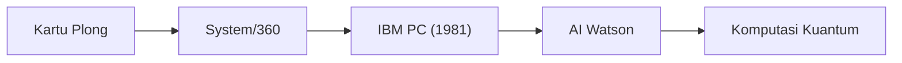

## 1. Dari Mesin Tabulasi ke IBM
Didirikan pada tahun 1911. Berawal dari mesin pemroses kartu plong (mesin tabulasi) yang digunakan untuk sensus dan lain-lain, kemudian berganti nama menjadi IBM (International Business Machines).

## 2. System/360 dan Mainframe
Diumumkan pada tahun 1964, 'System/360' adalah mainframe (komputer skala besar) bersejarah yang memiliki kompatibilitas perangkat lunak, dan membangun infrastruktur untuk lembaga keuangan dan pemerintahan di seluruh dunia.

## 3. IBM PC dan Arsitektur Terbuka
Dirilis pada tahun 1981, IBM PC mengadopsi arsitektur terbuka yang menciptakan pasar raksasa yang disebut 'PC/AT kompatibel', serta mendorong kebangkitan Microsoft dan Intel.

## 4. Komputer Kuantum dan Cloud Hibrida
Setelah menjual bisnis PC dan bisnis server, IBM saat ini terus berkembang sebagai perusahaan terkemuka di dunia dalam pengembangan 'cloud hibrida' dan 'AI', serta komputer kuantum superkonduktor (IBM Quantum).

## Bagian Verifikasi Teknologi Tambahan 1

## Bagian Verifikasi Teknologi Tambahan 2

## Bagian Verifikasi Teknologi Tambahan 3

## Bagian Verifikasi Teknologi Tambahan 4

## Bagian Verifikasi Teknologi Tambahan 5

## Bagian Verifikasi Teknologi Tambahan 6

## Bagian Verifikasi Teknologi Tambahan 7

## Bagian Verifikasi Teknologi Tambahan 8

## Bagian Verifikasi Teknologi Tambahan 9

## Bagian Verifikasi Teknologi Tambahan 10

## Bagian Verifikasi Teknologi Tambahan 11

## Bagian Verifikasi Teknologi Tambahan 12

## Bagian Verifikasi Teknologi Tambahan 13

## Bagian Verifikasi Teknologi Tambahan 14

